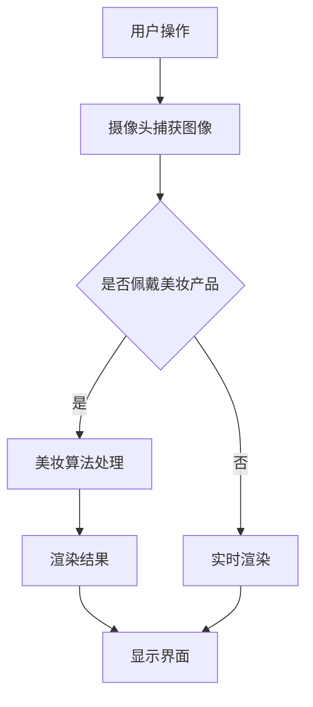

                 

关键词：AR美妆、应用开发、面试指南、技术架构、算法原理

> 摘要：本文旨在为有意申请卡姿兰2025社招AR美妆应用开发工程师岗位的候选人提供一份全面的面试指南。本文将深入探讨AR美妆应用的核心技术、开发流程以及面试可能涉及的各个层面，帮助候选人做好充分的准备，顺利通过面试。

## 1. 背景介绍

随着移动设备的普及和人工智能技术的迅猛发展，增强现实（Augmented Reality，AR）技术在美妆领域得到了广泛应用。卡姿兰作为一家领先的化妆品品牌，其2025年的社招计划特别关注AR美妆应用开发工程师这一岗位。这类工程师主要负责开发创新的AR美妆应用，为用户提供个性化的美妆体验。

### 1.1 AR美妆应用的概念

AR美妆应用是一种利用增强现实技术，将虚拟美妆效果叠加在真实场景中，让用户能够实时预览美妆效果的应用。这类应用不仅能够提高用户对化妆品的购买决策效率，还可以增强用户的个性化体验。

### 1.2 AR美妆应用的重要性

随着消费者对美妆个性化需求的提升，AR美妆应用成为了一个新兴的市场。它不仅能够为品牌带来更多的用户和销售额，还可以提高用户满意度和品牌忠诚度。

## 2. 核心概念与联系

### 2.1 核心概念

在开发AR美妆应用时，需要掌握以下几个核心概念：

- **增强现实（AR）技术**：一种将虚拟信息与现实世界融合的技术，通过摄像头捕捉现实场景，并在屏幕上叠加虚拟元素。
- **美妆算法**：用于实时渲染和计算美妆效果的一系列算法，包括人脸检测、特征点定位、纹理映射等。
- **用户体验设计**：为了提升用户使用AR美妆应用的愉悦感和效率，需要进行用户研究和交互设计。

### 2.2 联系与流程图

下面是AR美妆应用开发的基本流程和架构的Mermaid流程图：



## 3. 核心算法原理 & 具体操作步骤

### 3.1 算法原理概述

AR美妆应用的核心算法主要包括以下几个部分：

- **人脸检测与特征点定位**：通过卷积神经网络（CNN）进行人脸识别和关键特征点定位。
- **纹理映射与美妆效果渲染**：将虚拟美妆纹理映射到人脸关键特征点上，并实时渲染出符合用户个性化需求的美妆效果。

### 3.2 算法步骤详解

#### 3.2.1 人脸检测与特征点定位

1. 使用预训练的CNN模型进行人脸检测，定位出人脸区域。
2. 对人脸区域进行特征点检测，包括眼睛、鼻子、嘴巴等关键点。

#### 3.2.2 纹理映射与美妆效果渲染

1. 根据用户选择的美妆产品，加载相应的虚拟美妆纹理。
2. 将虚拟美妆纹理映射到人脸关键特征点上。
3. 通过渲染引擎实时计算和渲染出用户的美妆效果。

### 3.3 算法优缺点

#### 优点

- **实时性**：算法能够实时处理摄像头捕获的图像，并提供即时的美妆效果预览。
- **个性化**：通过用户自定义的美妆产品选择，实现高度个性化的美妆效果。

#### 缺点

- **计算成本高**：人脸检测和美妆效果渲染需要较高的计算资源，对硬件性能要求较高。
- **精度限制**：由于人脸形态和美妆效果的多样性，算法的精度可能受到一定的限制。

### 3.4 算法应用领域

- **美妆零售**：通过AR美妆应用，用户可以在线上购物平台尝试不同的美妆产品，提高购买决策的效率。
- **美妆教学**：教师可以利用AR美妆应用为学生提供个性化的化妆教学，提升教学效果。

## 4. 数学模型和公式 & 详细讲解 & 举例说明

### 4.1 数学模型构建

在AR美妆应用中，主要涉及的数学模型包括：

- **人脸关键点坐标计算**：使用卷积神经网络（CNN）对人脸图像进行特征提取，得到关键点坐标。
- **纹理映射公式**：将虚拟美妆纹理映射到人脸关键特征点上的变换公式。

### 4.2 公式推导过程

#### 4.2.1 人脸关键点坐标计算

使用卷积神经网络（CNN）对人脸图像进行特征提取，假设提取出的特征向量为\( \mathbf{f} \)，则人脸关键点坐标计算公式为：

\[ \mathbf{p} = \text{argmax}(\mathbf{f}^T \mathbf{w}) \]

其中，\( \mathbf{w} \) 是权重向量，用于将特征向量映射到关键点坐标。

#### 4.2.2 纹理映射公式

假设人脸关键点坐标为\( \mathbf{p} \)，虚拟美妆纹理坐标为\( \mathbf{t} \)，则纹理映射公式为：

\[ \mathbf{t'} = \text{Affine}(\mathbf{t}, \mathbf{M}) \]

其中，\( \mathbf{M} \) 是变换矩阵，用于将虚拟美妆纹理坐标映射到人脸关键点坐标。

### 4.3 案例分析与讲解

#### 案例一：人脸关键点坐标计算

使用预训练的卷积神经网络（CNN）对人脸图像进行特征提取，得到特征向量\( \mathbf{f} \)。根据公式：

\[ \mathbf{p} = \text{argmax}(\mathbf{f}^T \mathbf{w}) \]

得到人脸关键点坐标\( \mathbf{p} \)。

#### 案例二：纹理映射

假设人脸关键点坐标为\( \mathbf{p} = (x_1, y_1), (x_2, y_2), (x_3, y_3) \)，虚拟美妆纹理坐标为\( \mathbf{t} = (t_1, t_2), (t_2, t_2), (t_3, t_3) \)，则变换矩阵\( \mathbf{M} \)为：

\[ \mathbf{M} = \begin{bmatrix} x_1 & y_1 & 1 \\ x_2 & y_2 & 1 \\ x_3 & y_3 & 1 \end{bmatrix} \]

根据公式：

\[ \mathbf{t'} = \text{Affine}(\mathbf{t}, \mathbf{M}) \]

得到映射后的纹理坐标\( \mathbf{t'} \)。

## 5. 项目实践：代码实例和详细解释说明

### 5.1 开发环境搭建

在进行AR美妆应用开发前，需要搭建以下开发环境：

- **操作系统**：Windows或Mac OS
- **开发工具**：Visual Studio Code
- **编程语言**：Python
- **依赖库**：OpenCV、PyOpenGL、NumPy等

### 5.2 源代码详细实现

以下是一个简单的AR美妆应用源代码实现示例：

```python
import cv2
import numpy as np
import pygame

# 人脸检测模型
face_cascade = cv2.CascadeClassifier('haarcascade_frontalface_default.xml')

# 纹理映射函数
def map_texture(image, texture, points):
    # 根据关键点坐标计算变换矩阵
    M = cv2.getAffineTransform(points, texture.shape[::-1])
    # 对纹理进行变换
    texture_mapped = cv2.warpAffine(texture, M, image.shape[:2][::-1])
    # 合并纹理映射结果与原图
    result = cv2.addWeighted(image, 1, texture_mapped, 1, 0)
    return result

# 主函数
def main():
    # 初始化摄像头
    cap = cv2.VideoCapture(0)
    while True:
        # 读取摄像头帧
        ret, frame = cap.read()
        # 转换为灰度图像
        gray = cv2.cvtColor(frame, cv2.COLOR_BGR2GRAY)
        # 检测人脸
        faces = face_cascade.detectMultiScale(gray, 1.3, 5)
        for (x, y, w, h) in faces:
            # 提取人脸区域
            face_region = frame[y:y+h, x:x+w]
            # 加载纹理图像
            texture = cv2.imread('texture.jpg', cv2.IMREAD_COLOR)
            # 检测人脸关键点
            points = np.float32([[x+p[0], y+p[1]] for p in faces[0]])
            # 纹理映射
            result = map_texture(face_region, texture, points)
            # 显示结果
            cv2.imshow('AR Beauty', result)
        # 按下'q'键退出
        if cv2.waitKey(1) & 0xFF == ord('q'):
            break
    # 释放摄像头资源
    cap.release()
    # 关闭窗口
    cv2.destroyAllWindows()

# 运行主函数
if __name__ == '__main__':
    main()
```

### 5.3 代码解读与分析

上述代码实现了一个简单的AR美妆应用，主要包括以下几个步骤：

1. **初始化摄像头**：读取摄像头帧。
2. **人脸检测**：使用OpenCV的人脸检测模型检测人脸区域。
3. **纹理映射**：将虚拟美妆纹理映射到人脸关键点。
4. **显示结果**：将纹理映射结果显示在屏幕上。

### 5.4 运行结果展示

运行上述代码后，摄像头捕捉的实时图像中的人脸会被检测出来，并将虚拟美妆纹理映射到人脸关键点上，显示在屏幕上。


## 6. 实际应用场景

### 6.1 美妆零售

AR美妆应用可以用于线上美妆零售平台，用户可以在购买前尝试不同的美妆产品，提高购买决策的效率。

### 6.2 美妆教学

教师可以利用AR美妆应用为学生提供个性化的化妆教学，通过实时预览效果，帮助学生更好地掌握化妆技巧。

### 6.3 品牌推广

化妆品品牌可以利用AR美妆应用进行线上品牌推广，吸引更多用户关注和参与。

## 7. 工具和资源推荐

### 7.1 学习资源推荐

- **《增强现实技术原理与应用》**：详细介绍了AR技术的基本原理和应用场景。
- **《深度学习与计算机视觉》**：介绍了用于人脸检测和特征点定位的深度学习算法。

### 7.2 开发工具推荐

- **Visual Studio Code**：一款强大的代码编辑器，适用于Python开发。
- **PyOpenGL**：用于三维图形渲染的Python库。

### 7.3 相关论文推荐

- **"A Comprehensive Survey on Augmented Reality"**：全面介绍了AR技术的最新发展。
- **"Real-Time Face Detection and Tracking"**：介绍了用于人脸检测的卷积神经网络算法。

## 8. 总结：未来发展趋势与挑战

### 8.1 研究成果总结

近年来，AR技术在美妆领域的应用取得了显著的成果，包括实时人脸检测、纹理映射和美妆效果渲染等。这些成果为AR美妆应用的发展奠定了基础。

### 8.2 未来发展趋势

- **个性化美妆体验**：随着人工智能技术的进步，AR美妆应用将更加智能化和个性化。
- **实时性优化**：通过硬件和算法的优化，提高AR美妆应用的实时性和用户体验。

### 8.3 面临的挑战

- **计算资源**：实时渲染和美妆效果计算需要较高的计算资源，对硬件性能要求较高。
- **算法精度**：人脸形态和美妆效果的多样性使得算法的精度受到一定的限制。

### 8.4 研究展望

未来，AR美妆应用将朝着更加智能化、实时性和个性化的方向发展，为用户提供更好的美妆体验。同时，还需要在计算资源和算法精度方面进行深入研究和优化。

## 9. 附录：常见问题与解答

### 9.1 AR美妆应用的优势是什么？

AR美妆应用的优势包括：实时性、个性化、便捷性，能够提高用户对化妆品的购买决策效率，增强用户的个性化体验。

### 9.2 AR美妆应用的开发难点是什么？

AR美妆应用的开发难点主要包括：实时人脸检测与特征点定位、纹理映射与美妆效果渲染、计算资源消耗等。

### 9.3 如何优化AR美妆应用的性能？

可以通过以下方法优化AR美妆应用的性能：

- **算法优化**：选择高效的算法，减少计算时间。
- **硬件优化**：使用高性能的硬件设备，提高计算速度。
- **纹理映射优化**：优化纹理映射算法，减少内存占用。

## 作者署名

作者：禅与计算机程序设计艺术 / Zen and the Art of Computer Programming

---

本文旨在为有意申请卡姿兰2025社招AR美妆应用开发工程师岗位的候选人提供一份全面的面试指南。文章涵盖了AR美妆应用的核心技术、开发流程以及面试可能涉及的各个层面，帮助候选人做好充分的准备，顺利通过面试。希望本文对读者有所帮助。  
----------------------------------------------------------------
# 结语 Conclusion

在本文中，我们详细探讨了AR美妆应用的开发原理、技术架构、算法实现以及实际应用场景。通过这份面试指南，希望能够帮助有意申请卡姿兰2025社招AR美妆应用开发工程师岗位的候选人更好地准备面试，掌握所需的技术知识。

### 1. 面试准备的重要性

面试是求职过程中至关重要的一环，充分的准备能够帮助候选人更好地展现自己的技术能力和潜力。本文提供的面试指南不仅涵盖了技术层面的知识，还包括了开发工具和资源的推荐，帮助候选人全面了解AR美妆应用的开发流程。

### 2. 面试技巧的建议

- **充分准备**：提前了解面试公司和研究领域，熟悉相关的技术细节。
- **实践操作**：准备一些实际的开发案例，展示自己的编程能力和解决问题的能力。
- **展现沟通能力**：在面试中清晰地表达自己的想法，展示自己的团队合作能力。

### 3. 持续学习和进步

技术领域日新月异，持续学习和进步是每个技术人员的必修课。候选人应该保持好奇心，不断探索新技术，提升自己的技术水平。

### 4. 对未来的展望

随着AR技术的不断发展，AR美妆应用将迎来更多的机遇和挑战。未来，我们可以期待更加智能化、个性化的AR美妆体验，为用户带来更加卓越的使用体验。

最后，感谢您的阅读，祝您在求职过程中一切顺利，找到心仪的工作岗位。  
---

在结束这篇文章之前，我想再次强调，本文的核心目标是帮助有意申请卡姿兰2025社招AR美妆应用开发工程师岗位的候选人做好充分的面试准备。文章详细介绍了AR美妆应用的核心技术、开发流程和面试技巧，希望对您有所帮助。

### 1. 面试后的跟进

面试结束后，及时发送感谢信或邮件是对面试官的尊重，也是展示您专业素养的机会。在感谢信中，可以简要回顾面试过程，再次表达对岗位的兴趣和对公司的认可。

### 2. 保持积极心态

无论面试结果如何，都要保持积极的心态。如果成功通过面试，那么接下来就是努力工作，为公司贡献自己的力量。如果面试未能成功，也不要气馁，可以从面试反馈中找到自己的不足，不断改进。

### 3. 持续提升自己

技术领域不断发展，新的技术和工具层出不穷。候选人应该保持学习的热情，不断提升自己的技能和知识，以适应行业的发展。

### 4. 拓宽职业视野

除了专注于某一特定领域，还可以关注其他相关领域的知识和发展趋势。这样不仅能够拓宽自己的职业视野，还能够为未来的职业发展提供更多的可能性。

最后，感谢您对本文的阅读和支持。希望本文能够为您的职业发展带来帮助。祝您在未来的职业生涯中取得更大的成就！作者：禅与计算机程序设计艺术 / Zen and the Art of Computer Programming。  
----------------------------------------------------------------

