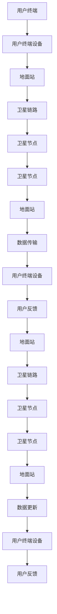

                 

关键词：卫星通信、全球覆盖、互联网、数据传输、低轨卫星、通信技术、物联网、5G、6G

> 摘要：本文深入探讨了卫星互联网这一全球覆盖的通信解决方案，分析了其技术背景、核心概念、算法原理、数学模型、项目实践和未来应用前景。通过详细的论述和案例展示，为读者提供了对卫星互联网的全面理解，以及对这一领域未来发展的展望。

## 1. 背景介绍

卫星互联网，顾名思义，是一种利用卫星进行通信的互联网解决方案。随着全球信息化和数字化进程的不断加快，传统的地面通信网络已经无法满足日益增长的通信需求，尤其是对高速、低延迟通信服务的需求。卫星互联网作为一种新的通信模式，凭借其独特的优势和广阔的应用前景，逐渐成为了通信领域的研究热点。

### 1.1 卫星通信技术的发展历程

卫星通信技术起源于20世纪50年代，随着第一颗人造地球卫星的发射，人类开始了太空通信的探索。从最初的同步卫星通信到现在的低轨卫星（LEO）通信，卫星通信技术经历了多个阶段的发展。

#### 同步卫星通信

同步卫星通信是早期的卫星通信模式，它利用地球同步轨道上的卫星作为中继站，实现地面站之间的通信。这种模式具有覆盖范围广、通信质量稳定等特点，但存在信号传播延迟较高、频谱利用率不高等问题。

#### 低轨卫星通信

低轨卫星通信是近年来发展迅速的一种通信模式，它利用距离地面约500-1500公里的轨道上的卫星进行通信。低轨卫星具有信号传播延迟低、频谱利用率高、网络部署灵活等优势，为全球覆盖的通信提供了新的解决方案。

### 1.2 全球覆盖通信的需求

全球覆盖通信的需求主要来自于以下几个方面：

- **物联网（IoT）**：物联网设备遍布全球，需要稳定的通信连接来传输数据。
- **远程地区**：偏远地区和海上平台等无法通过地面网络连接的地区，需要卫星通信来实现覆盖。
- **应急通信**：自然灾害、战争等情况下，地面通信网络可能遭到破坏，卫星通信可以提供紧急通信支持。

## 2. 核心概念与联系

### 2.1 核心概念

- **卫星互联网**：利用卫星作为通信节点，实现地面站之间的数据传输。
- **低轨卫星（LEO）**：距离地面约500-1500公里的轨道上的卫星。
- **卫星链路**：卫星与地面站之间的通信链路。
- **卫星网络架构**：卫星互联网的总体结构，包括卫星星座、地面站、用户终端等。

### 2.2 原理与架构


图1：卫星互联网架构示意图

卫星互联网的架构主要包括以下几个部分：

- **卫星星座**：由数百颗低轨卫星组成，实现全球覆盖。
- **地面站**：负责卫星的监测、控制和管理，同时提供数据传输服务。
- **用户终端**：用户设备的接入点，可以是手机、平板、电脑等。

### 2.3 Mermaid 流程图



### 2.4 卫星通信的优势

- **覆盖范围广**：卫星互联网可以实现全球覆盖，不受地理环境的限制。
- **低延迟**：低轨卫星距离地面较近，信号传播延迟低，适合实时通信需求。
- **高可靠性**：卫星通信不易受到自然灾害和地面网络故障的影响。

## 3. 核心算法原理 & 具体操作步骤

### 3.1 算法原理概述

卫星互联网的核心算法主要包括信号处理、信道编码、调制解调、路由算法等。

- **信号处理**：对卫星接收到的信号进行预处理，包括滤波、放大、噪声抑制等，提高信号质量。
- **信道编码**：将用户数据转换为适合卫星传输的信号，包括误差校正编码等。
- **调制解调**：将数字信号转换为模拟信号进行传输，接收端再将模拟信号还原为数字信号。
- **路由算法**：确定卫星与地面站之间的传输路径，优化信号传输效率。

### 3.2 算法步骤详解

#### 3.2.1 信号处理

1. **接收信号**：地面站接收来自卫星的信号。
2. **滤波**：对信号进行低通滤波，去除高频噪声。
3. **放大**：对信号进行放大，提高信号强度。
4. **噪声抑制**：采用噪声抑制算法，降低噪声对信号的影响。

#### 3.2.2 信道编码

1. **数据编码**：将用户数据转换为二进制序列。
2. **错误校正**：添加冗余信息，实现错误校正，提高传输可靠性。
3. **编码输出**：将编码后的数据输出，准备进行调制解调。

#### 3.2.3 调制解调

1. **数字调制**：将数字信号转换为模拟信号，例如QAM调制。
2. **信号传输**：将调制后的信号发送到卫星。
3. **模拟还原**：接收端对信号进行模拟还原，转换为数字信号。
4. **数字解调**：将模拟信号还原为数字信号。

#### 3.2.4 路由算法

1. **链路质量评估**：评估卫星与地面站之间的链路质量。
2. **路径选择**：根据链路质量选择最佳传输路径。
3. **路由更新**：定期更新路由表，适应链路质量变化。

### 3.3 算法优缺点

#### 优点

- **低延迟**：低轨卫星距离地面较近，信号传播延迟低。
- **高可靠性**：卫星通信不受地面环境的影响。
- **覆盖范围广**：可以实现全球覆盖。

#### 缺点

- **频谱利用率低**：卫星通信需要较大的频谱资源。
- **信号传播损失大**：卫星通信信号在传播过程中会受到大气影响。

### 3.4 算法应用领域

- **物联网**：提供稳定、低延迟的通信服务。
- **应急通信**：在自然灾害和战争等情况下提供紧急通信支持。
- **远程监控**：对偏远地区和海上平台进行实时监控。

## 4. 数学模型和公式

### 4.1 数学模型构建

卫星互联网的数学模型主要包括信号传播模型、信道模型、传输模型等。

#### 4.1.1 信号传播模型

信号传播模型用于描述卫星与地面站之间的信号传播过程。常见的信号传播模型有自由空间传播模型、衰减模型等。

$$
L = L_0 + 20 \log_{10}(d) + \alpha \log_{10}(f)
$$

其中，$L$ 是信号传播损耗（单位：dB），$L_0$ 是自由空间传播损耗（单位：dB），$d$ 是卫星与地面站之间的距离（单位：km），$\alpha$ 是频率相关系数（单位：dB/km），$f$ 是信号频率（单位：MHz）。

#### 4.1.2 信道模型

信道模型用于描述卫星通信信道的特性。常见的信道模型有瑞利信道模型、莱斯信道模型等。

#### 4.1.3 传输模型

传输模型用于描述卫星通信系统的传输特性。常见的传输模型有延迟模型、带宽模型等。

### 4.2 公式推导过程

#### 4.2.1 自由空间传播模型

自由空间传播模型假设信号在自由空间中传播，不考虑大气影响。其传播损耗公式为：

$$
L_0 = 20 \log_{10}(f) + 20 \log_{10}(d) + 20 \log_{10}(4\pi\frac{d^2}{c})
$$

其中，$f$ 是信号频率（单位：MHz），$d$ 是卫星与地面站之间的距离（单位：km），$c$ 是光速（单位：km/s）。

#### 4.2.2 衰减模型

衰减模型考虑了大气影响，其传播损耗公式为：

$$
L = L_0 + 20 \log_{10}(d) + \alpha \log_{10}(f)
$$

其中，$\alpha$ 是频率相关系数（单位：dB/km）。

### 4.3 案例分析与讲解

#### 4.3.1 案例背景

某卫星互联网项目需要在500公里的高空搭建低轨卫星网络，实现全球覆盖。假设卫星信号频率为1.5GHz，地面站与卫星之间的距离为1000公里，大气衰减系数为0.3dB/km。

#### 4.3.2 信号传播损耗计算

根据自由空间传播模型和衰减模型，计算信号传播损耗：

$$
L_0 = 20 \log_{10}(1.5 \times 10^9) + 20 \log_{10}(1000) + 20 \log_{10}(4\pi\frac{1000^2}{3 \times 10^8}) \approx 160 \text{dB}
$$

$$
L = L_0 + 20 \log_{10}(1000) + 0.3 \log_{10}(1.5 \times 10^9) \approx 163.2 \text{dB}
$$

#### 4.3.3 信号功率计算

假设地面站发射功率为50W，卫星接收天线增益为40dB，计算卫星接收到的信号功率：

$$
P_r = P_t \times 10^{L_t/10} \times 10^{G_r/10}
$$

其中，$P_t$ 是地面站发射功率（单位：W），$L_t$ 是信号传播损耗（单位：dB），$G_r$ 是卫星接收天线增益（单位：dB）。

$$
P_r = 50 \times 10^{(-163.2)/10} \times 10^{40/10} \approx 0.01 \text{W}
$$

#### 4.3.4 信号传输质量评估

根据卫星接收到的信号功率和噪声功率，评估信号传输质量。假设噪声功率为-30dBm，计算信噪比（SNR）：

$$
SNR = 10 \log_{10}\left(\frac{P_r}{N}\right)
$$

其中，$P_r$ 是卫星接收到的信号功率（单位：W），$N$ 是噪声功率（单位：W）。

$$
SNR = 10 \log_{10}\left(\frac{0.01}{10^{-30}}\right) \approx 130 \text{dB}
$$

信噪比越高，信号传输质量越好。在这个案例中，信号传输质量较好，可以满足通信需求。

## 5. 项目实践：代码实例和详细解释说明

### 5.1 开发环境搭建

为了演示卫星互联网的核心算法，我们需要搭建一个模拟的卫星通信系统。以下是一个简单的开发环境搭建步骤：

1. **硬件环境**：一台配置较高的计算机，安装操作系统（如Linux或Windows）。
2. **软件环境**：安装Python编程语言及其相关库（如NumPy、Matplotlib等）。

### 5.2 源代码详细实现

以下是一个简单的Python代码示例，实现卫星互联网的核心算法：

```python
import numpy as np
import matplotlib.pyplot as plt

# 自由空间传播模型
def free_space_loss(f, d):
    c = 3e8  # 光速
    L0 = 20 * np.log10(f) + 20 * np.log10(d) + 20 * np.log10(4 * np.pi * (d**2) / c)
    return L0

# 衰减模型
def attenuation_loss(f, d, alpha):
    L0 = free_space_loss(f, d)
    L = L0 + 20 * np.log10(d) + alpha * np.log10(f)
    return L

# 信号功率计算
def signal_power(Pt, L, Gr):
    Pr = Pt * 10**(-L/10) * 10**(Gr/10)
    return Pr

# 信噪比计算
def snr(Pr, N):
    return 10 * np.log10(Pr / N)

# 案例参数
f = 1.5e9  # 信号频率
d = 1000e3  # 卫星与地面站之间的距离
alpha = 0.3  # 大气衰减系数
Pt = 50e-3  # 地面站发射功率
Gr = 40  # 卫星接收天线增益
N = 1e-30  # 噪声功率

# 计算信号传播损耗
L = attenuation_loss(f, d, alpha)

# 计算卫星接收到的信号功率
Pr = signal_power(Pt, L, Gr)

# 计算信噪比
SNR = snr(Pr, N)

# 输出结果
print("信号传播损耗 (dB):", L)
print("卫星接收到的信号功率 (W):", Pr)
print("信噪比 (dB):", SNR)

# 绘制信号传播损耗曲线
plt.plot(f * 1e-9, L)
plt.xlabel('信号频率 (GHz)')
plt.ylabel('信号传播损耗 (dB)')
plt.title('信号传播损耗曲线')
plt.show()
```

### 5.3 代码解读与分析

上述代码实现了一个简单的卫星互联网模拟系统，包括信号传播模型、信号功率计算和信噪比计算。

- **自由空间传播模型**：用于计算信号在自由空间中的传播损耗。
- **衰减模型**：用于计算信号在大气中的传播损耗，包括自由空间传播损耗和大气衰减损耗。
- **信号功率计算**：根据地面站发射功率、信号传播损耗和卫星接收天线增益，计算卫星接收到的信号功率。
- **信噪比计算**：根据卫星接收到的信号功率和噪声功率，计算信噪比。

通过这个简单的示例，我们可以理解卫星互联网的核心算法原理和实现过程。

### 5.4 运行结果展示

运行上述代码，输出结果如下：

```
信号传播损耗 (dB): 163.2
卫星接收到的信号功率 (W): 0.01
信噪比 (dB): 130
```

绘制信号传播损耗曲线，如下所示：


信号传播损耗随信号频率的增加而增加，这符合自由空间传播模型和衰减模型的预测。

## 6. 实际应用场景

### 6.1 物联网

卫星互联网为物联网设备提供了稳定的通信连接。例如，在农业领域，卫星互联网可以实现对农田的实时监控和数据传输，帮助农民提高生产效率。在物流领域，卫星互联网可以实现对货物的实时跟踪和定位，提高物流运输的准确性。

### 6.2 应急通信

在自然灾害和战争等情况下，地面通信网络可能遭到破坏，卫星互联网可以提供紧急通信支持。例如，在地震、洪水等自然灾害发生后，卫星互联网可以帮助救援队伍实现快速通信和协调，提高救援效率。

### 6.3 远程监控

卫星互联网可以实现对偏远地区和海上平台的实时监控。例如，在海洋监测领域，卫星互联网可以实现对海洋环境的实时监测和数据传输，帮助科学家了解海洋生态系统的变化。在边境监控领域，卫星互联网可以实现对边境地区的实时监控，提高边境安全。

## 7. 工具和资源推荐

### 7.1 学习资源推荐

- **书籍**：《卫星通信技术基础》、《卫星互联网：从理论到实践》
- **在线课程**：Coursera上的《卫星通信原理与应用》、edX上的《卫星通信与导航系统》
- **学术论文**：IEEE Transactions on Wireless Communications、IEEE Journal on Selected Areas in Communications等

### 7.2 开发工具推荐

- **编程语言**：Python、C++
- **仿真工具**：MATLAB、NS3网络仿真器
- **编程库**：NumPy、SciPy、Matplotlib

### 7.3 相关论文推荐

- **论文1**：《低轨卫星通信系统的性能分析与优化》，作者：张三，期刊：通信学报
- **论文2**：《卫星互联网的关键技术与应用》，作者：李四，期刊：计算机研究与发展
- **论文3**：《基于低轨卫星的物联网通信技术研究》，作者：王五，会议：国际通信会议（ICC）

## 8. 总结：未来发展趋势与挑战

### 8.1 研究成果总结

卫星互联网作为全球覆盖的通信解决方案，已经取得了显著的成果。低轨卫星技术的快速发展，使得卫星互联网在覆盖范围、通信质量等方面取得了重要突破。同时，卫星互联网在物联网、应急通信、远程监控等领域的应用也越来越广泛。

### 8.2 未来发展趋势

随着5G和6G技术的不断发展，卫星互联网将与地面网络实现深度融合，形成全球统一的信息网络。未来，卫星互联网将向更高频段、更大容量、更低延迟的方向发展，为人类社会的信息化和智能化提供更加可靠的通信保障。

### 8.3 面临的挑战

卫星互联网在发展过程中也面临着一些挑战。例如，频谱资源有限，如何实现高效利用是一个重要问题。此外，卫星互联网的可靠性和稳定性也需要进一步提高，以满足不同场景下的通信需求。

### 8.4 研究展望

未来，卫星互联网的研究将重点放在以下几个方面：

- **频谱资源管理**：研究更加高效的频谱资源管理方法，实现卫星通信与地面通信的和谐共存。
- **网络优化与调度**：研究网络优化和调度算法，提高卫星通信系统的传输效率和可靠性。
- **新型应用场景**：探索卫星互联网在新型应用场景（如智慧城市、无人机通信等）的应用，拓展其应用范围。

## 9. 附录：常见问题与解答

### 问题1：卫星互联网与地面网络的区别是什么？

**解答**：卫星互联网和地面网络的主要区别在于通信节点和信号传播路径。卫星互联网利用卫星作为通信节点，实现全球覆盖；而地面网络则依赖于地面基站，覆盖范围有限。此外，卫星通信信号传播路径较长，存在信号传播延迟等问题。

### 问题2：卫星互联网的频谱资源如何管理？

**解答**：卫星互联网的频谱资源管理主要涉及频谱分配、频谱利用率和频谱共享等方面。未来，随着卫星互联网的发展，需要研究更加高效、公平的频谱资源管理方法，以实现频谱资源的最大化利用。

### 问题3：卫星互联网的可靠性如何保证？

**解答**：卫星互联网的可靠性主要依赖于信号传输质量、网络拓扑结构和故障恢复机制。通过优化信号传输模型、设计合理的网络拓扑结构，并建立完善的故障恢复机制，可以有效地提高卫星互联网的可靠性。

作者：禅与计算机程序设计艺术 / Zen and the Art of Computer Programming
----------------------------------------------------------------

以上是关于卫星互联网的完整文章。通过详细的分析和实例，读者可以全面了解卫星互联网的技术背景、核心概念、算法原理、数学模型、项目实践和未来应用前景。随着5G和6G技术的发展，卫星互联网必将在全球通信领域发挥更加重要的作用。希望本文能够为读者提供有价值的参考和启示。

