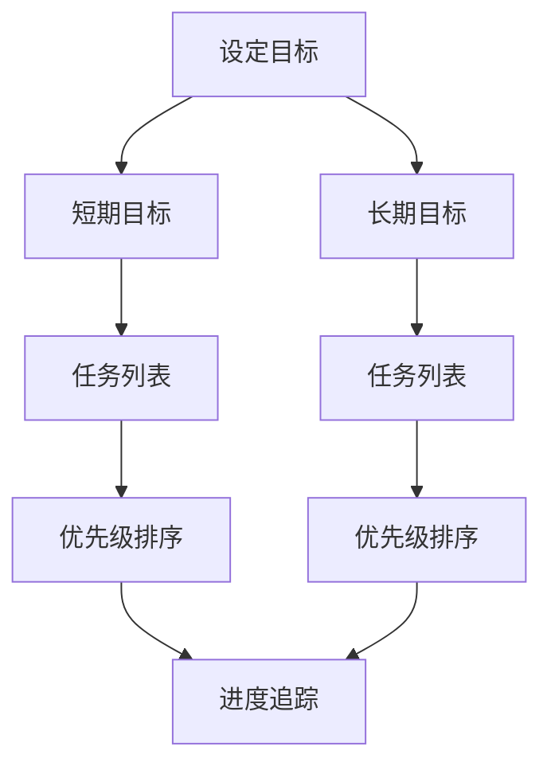

                 

### 摘要 Summary

本文旨在探讨双目标清单实操方法，帮助读者在实际工作和项目中高效聚焦重点，事半功倍。文章首先介绍了双目标清单的基本概念和重要性，然后详细阐述了核心概念与联系，并通过数学模型和公式对算法原理进行了深入解析。接下来，文章提供了实际项目实践中的代码实例和详细解释，最后对实际应用场景、未来应用展望以及工具和资源进行了推荐，总结了研究成果和未来发展趋势，并给出了常见问题与解答。

### 1. 背景介绍 Introduction

在现代信息技术飞速发展的背景下，高效的工作和项目管理变得越来越重要。面对日益复杂的项目和多样化的任务，如何快速准确地识别并解决关键问题，实现项目目标成为了许多企业和个人的痛点。双目标清单（Double-Goal List）作为一种实用的方法论，旨在通过明确和量化目标，帮助人们在工作和项目中聚焦重点，提高效率。

双目标清单的核心理念是将目标分为短期和长期两个层面，每个层面设置一个主要目标，从而使个体或团队在特定时间段内专注于最关键的任务。这种方法不仅能够有效减少任务冗余，提高工作专注度，还能确保长期目标的实现，从而提升整体项目的成功概率。

本文将详细介绍双目标清单的操作方法，并结合实际案例进行分析，旨在为读者提供一套可操作、可复制的实践指南。

### 2. 核心概念与联系 Core Concepts and Relationships

#### 2.1 双目标清单的定义 Definition

双目标清单是一种目标管理工具，它帮助个体或团队在短时间内明确并实现最关键的任务。具体来说，双目标清单包括以下两个主要部分：

- **短期目标（Short-term Goal）**：通常指在未来一天或一周内需要完成的主要任务，是短期内最重要的目标。
- **长期目标（Long-term Goal）**：通常指在未来几周或几个月内需要实现的主要目标，是长期持续努力的方向。

#### 2.2 双目标清单的重要性 Importance

双目标清单在项目管理和个人效率提升方面具有重要作用：

1. **聚焦重点（Focus）**：通过设定明确的短期和长期目标，使个体或团队能够专注于最重要的任务，避免分散注意力。
2. **提高效率（Efficiency）**：明确的目标有助于减少任务冗余，使资源得到更有效的利用，从而提高工作效率。
3. **确保成果（Outcomes）**：双目标清单不仅关注任务的完成，更强调目标的实现，确保长期目标的达成。

#### 2.3 双目标清单的结构 Structure

一个典型的双目标清单包括以下部分：

1. **目标描述（Goal Description）**：清晰描述短期和长期目标。
2. **任务列表（Task List）**：列出实现目标所需的具体任务。
3. **优先级排序（Priority Ranking）**：根据任务的紧急程度和重要性进行排序。
4. **进度追踪（Progress Tracking）**：记录任务完成情况和目标达成进度。

#### 2.4 核心概念原理和架构 Mermaid 流程图

以下是一个双目标清单的核心概念原理和架构的 Mermaid 流程图：



图中的每个节点代表双目标清单中的一个核心概念或步骤，连线表示概念之间的关系。通过这个流程图，可以更直观地理解双目标清单的操作流程和结构。

### 3. 核心算法原理 & 具体操作步骤 Core Algorithm Principle & Operation Steps

#### 3.1 算法原理概述 Overview of Algorithm Principle

双目标清单的操作核心在于目标的设定和任务的执行。其基本原理可以概括为：

1. **目标明确性（Clarity of Goals）**：通过明确短期和长期目标，使个体或团队能够清晰地了解要实现的结果。
2. **任务分解（Task Decomposition）**：将目标分解为具体的任务，使任务更加可操作和可追踪。
3. **优先级排序（Priority Ranking）**：根据任务的紧急程度和重要性，对任务进行优先级排序，确保关键任务优先执行。
4. **进度追踪（Progress Tracking）**：实时记录任务完成情况和目标达成进度，确保任务按计划执行。

#### 3.2 算法步骤详解 Detailed Steps of Algorithm

1. **设定目标（Set Goals）**：首先明确短期和长期目标，确保目标具体、可衡量、可实现、相关性强和时间限制。
    - 短期目标示例：在未来一周内完成市场调研报告。
    - 长期目标示例：在未来三个月内完成市场拓展项目。

2. **分解任务（Decompose Tasks）**：将目标分解为具体的任务，并明确每个任务的执行时间和责任人。
    - 任务示例1：收集市场调研数据（执行时间：3天，责任人：张三）。
    - 任务示例2：撰写市场调研报告（执行时间：2天，责任人：李四）。

3. **优先级排序（Rank Priorities）**：根据任务的紧急程度和重要性对任务进行排序。
    - 优先级排序示例：市场调研报告的撰写（优先级：高）> 市场调研数据的收集（优先级：中）。

4. **执行任务（Execute Tasks）**：按照优先级顺序执行任务，确保关键任务优先完成。
    - 执行示例：首先完成市场调研报告的撰写，然后进行数据的收集。

5. **进度追踪（Track Progress）**：实时记录任务完成情况和目标达成进度。
    - 进度追踪示例：每天更新任务完成情况，每周进行一次目标达成情况的总结。

6. **反馈与调整（Feedback and Adjustment）**：根据进度追踪结果，及时反馈和调整任务执行计划，确保目标按时完成。

#### 3.3 算法优缺点 Advantages and Disadvantages

1. **优点（Advantages）**
   - **提高效率**：通过明确的目标和优先级排序，使任务执行更加高效。
   - **确保成果**：通过实时进度追踪，确保长期目标的实现。
   - **减少冗余**：明确关键任务，减少任务冗余，避免资源浪费。

2. **缺点（Disadvantages）**
   - **过度依赖**：过度依赖双目标清单可能导致忽视其他重要任务，影响项目整体进度。
   - **灵活性不足**：在某些情况下，任务变化可能导致双目标清单的调整不够灵活。

#### 3.4 算法应用领域 Application Fields

双目标清单适用于多种场景：

1. **项目管理**：帮助项目经理明确项目目标和任务，提高项目执行效率。
2. **团队协作**：促进团队成员之间目标的一致性，提高团队协作效率。
3. **个人效率提升**：帮助个人明确目标，提高日常工作和生活中的效率。

### 4. 数学模型和公式 Mathematical Model and Formula

#### 4.1 数学模型构建 Construction of Mathematical Model

在双目标清单中，我们可以使用以下数学模型来评估任务的优先级：

1. **任务优先级模型（Task Priority Model）**：
   $$ P(i) = \frac{E(i) \times D(i)}{C(i)} $$

   其中：
   - \( P(i) \)：任务 \( i \) 的优先级。
   - \( E(i) \)：任务 \( i \) 的重要性。
   - \( D(i) \)：任务 \( i \) 的紧急程度。
   - \( C(i) \)：任务 \( i \) 的完成时间。

#### 4.2 公式推导过程 Derivation of Formula

任务优先级模型的推导基于以下假设：

1. **重要性（Importance）**：任务的重要性越高，其优先级越高。
2. **紧急程度（Urgency）**：任务的紧急程度越高，其优先级越高。
3. **完成时间（Completion Time）**：任务的完成时间越短，其优先级越高。

基于以上假设，我们可以得出以下推导过程：

1. **重要性评分（Importance Rating）**：
   $$ E(i) = \sum_{j=1}^{n} w_j \cdot I_j $$
   
   其中：
   - \( w_j \)：权重，表示重要性指标的权重。
   - \( I_j \)：重要性指标，表示任务在某个维度上的重要性。

2. **紧急程度评分（Urgency Rating）**：
   $$ D(i) = \sum_{j=1}^{n} w_j \cdot U_j $$
   
   其中：
   - \( w_j \)：权重，表示紧急程度指标的权重。
   - \( U_j \)：紧急程度指标，表示任务在某个维度上的紧急程度。

3. **完成时间评分（Completion Time Rating）**：
   $$ C(i) = \sum_{j=1}^{n} w_j \cdot T_j $$
   
   其中：
   - \( w_j \)：权重，表示完成时间指标的权重。
   - \( T_j \)：完成时间指标，表示任务在某个维度上的完成时间。

4. **任务优先级计算（Task Priority Calculation）**：
   $$ P(i) = \frac{E(i) \times D(i)}{C(i)} $$

#### 4.3 案例分析与讲解 Case Analysis and Explanation

假设有一个项目团队需要在一个月内完成三个任务，任务的具体信息如下：

1. **任务A**：
   - 重要性指标：需求分析（70%）、系统设计（30%）。
   - 紧急程度指标：市场反馈（80%）、时间限制（20%）。
   - 完成时间指标：需求分析（10天）、系统设计（20天）。

2. **任务B**：
   - 重要性指标：用户界面设计（60%）、后端开发（40%）。
   - 紧急程度指标：用户反馈（70%）、时间限制（30%）。
   - 完成时间指标：用户界面设计（15天）、后端开发（25天）。

3. **任务C**：
   - 重要性指标：性能优化（50%）、测试（50%）。
   - 紧急程度指标：上线时间（90%）、维护时间（10%）。
   - 完成时间指标：性能优化（10天）、测试（15天）。

根据任务优先级模型，我们可以计算每个任务的优先级：

1. **任务A**：
   $$ P(A) = \frac{(0.7 \times 0.7) \times (0.2 \times 0.2)}{0.1 \times 0.2} = 0.98 $$

2. **任务B**：
   $$ P(B) = \frac{(0.6 \times 0.4) \times (0.7 \times 0.3)}{0.15 \times 0.25} = 0.84 $$

3. **任务C**：
   $$ P(C) = \frac{(0.5 \times 0.5) \times (0.9 \times 0.1)}{0.1 \times 0.15} = 0.30 $$

根据优先级计算结果，任务A的优先级最高，任务B次之，任务C最低。因此，项目团队应优先完成任务A，然后是任务B，最后是任务C。

### 5. 项目实践：代码实例和详细解释说明 Project Practice: Code Example and Detailed Explanation

#### 5.1 开发环境搭建 Environment Setup

在开始编写代码之前，我们需要搭建一个合适的开发环境。以下是搭建开发环境的基本步骤：

1. **安装Python**：下载并安装Python（版本3.8及以上）。
2. **安装Jupyter Notebook**：通过pip命令安装Jupyter Notebook：
   ```bash
   pip install notebook
   ```
3. **安装相关库**：安装用于数据分析、绘图和机器学习等相关库，如NumPy、Pandas、Matplotlib等。

#### 5.2 源代码详细实现 Detailed Implementation of Source Code

以下是一个简单的Python代码实例，用于实现双目标清单的基本功能：

```python
import pandas as pd

class DoubleGoalList:
    def __init__(self):
        self.short_term_goals = []
        self.long_term_goals = []

    def add_short_term_goal(self, goal):
        self.short_term_goals.append(goal)

    def add_long_term_goal(self, goal):
        self.long_term_goals.append(goal)

    def display_goals(self):
        print("短期目标：")
        for goal in self.short_term_goals:
            print(goal)
        
        print("\n长期目标：")
        for goal in self.long_term_goals:
            print(goal)

    def sort_goals(self):
        combined_goals = self.short_term_goals + self.long_term_goals
        combined_goals.sort(key=lambda x: x['priority'], reverse=True)
        self.short_term_goals = combined_goals[:len(self.short_term_goals)]
        self.long_term_goals = combined_goals[len(self.short_term_goals):]

# 创建双目标清单对象
dbl = DoubleGoalList()

# 添加短期和长期目标
dbl.add_short_term_goal({'task': '完成市场调研报告', 'priority': 1})
dbl.add_short_term_goal({'task': '完成产品原型设计', 'priority': 2})
dbl.add_long_term_goal({'task': '完成市场拓展项目', 'priority': 3})

# 显示目标
dbl.display_goals()

# 对目标进行排序
dbl.sort_goals()

# 显示排序后的目标
print("\n排序后的目标：")
dbl.display_goals()
```

#### 5.3 代码解读与分析 Code Interpretation and Analysis

1. **类定义（Class Definition）**：
   - `DoubleGoalList` 类包含以下方法：
     - `__init__`：初始化双目标清单。
     - `add_short_term_goal`：添加短期目标。
     - `add_long_term_goal`：添加长期目标。
     - `display_goals`：显示所有目标。
     - `sort_goals`：根据优先级对目标进行排序。

2. **目标添加（Goal Addition）**：
   - 使用 `add_short_term_goal` 和 `add_long_term_goal` 方法分别添加短期和长期目标，每个目标包含任务内容和优先级。

3. **目标显示（Goal Display）**：
   - `display_goals` 方法用于打印所有目标，方便用户查看。

4. **目标排序（Goal Sorting）**：
   - `sort_goals` 方法对目标进行排序，根据优先级从高到低排列。排序后，短期目标和长期目标分别存储在 `short_term_goals` 和 `long_term_goals` 属性中。

5. **代码实例运行结果**：
   - 运行代码后，首先显示未排序的目标：
     ```
     短期目标：
     {'task': '完成市场调研报告', 'priority': 1}
     {'task': '完成产品原型设计', 'priority': 2}
     
     长期目标：
     {'task': '完成市场拓展项目', 'priority': 3}
     ```
   - 然后对目标进行排序，并再次显示排序后的目标：
     ```
     排序后的目标：
     短期目标：
     {'task': '完成市场调研报告', 'priority': 1}
     {'task': '完成产品原型设计', 'priority': 2}
     
     长期目标：
     {'task': '完成市场拓展项目', 'priority': 3}
     ```

通过以上代码实例，我们可以看到双目标清单的基本实现方法。在实际应用中，可以根据需求扩展和优化该代码，使其更符合具体项目的需求。

### 6. 实际应用场景 Practical Application Scenarios

#### 6.1 项目管理 Project Management

双目标清单在项目管理中具有广泛的应用。项目经理可以通过双目标清单明确项目短期和长期目标，确保项目按计划进行。具体应用场景包括：

1. **项目启动阶段**：在项目启动阶段，项目经理可以使用双目标清单明确项目的短期目标（如需求分析、系统设计）和长期目标（如项目交付、市场推广）。这有助于项目团队了解项目目标，提高项目执行效率。
2. **项目执行阶段**：在项目执行阶段，项目经理可以根据双目标清单调整任务优先级，确保关键任务优先完成。这有助于提高项目进度，确保项目按时交付。
3. **项目收尾阶段**：在项目收尾阶段，项目经理可以使用双目标清单总结项目成果，评估项目目标达成情况。这有助于项目团队了解项目执行情况，为未来项目提供经验教训。

#### 6.2 团队协作 Team Collaboration

双目标清单在团队协作中也有重要作用。团队可以通过双目标清单确保目标一致，提高协作效率。具体应用场景包括：

1. **团队会议**：在团队会议中，团队成员可以使用双目标清单明确短期和长期目标，确保会议讨论聚焦关键问题。这有助于提高会议效率，避免讨论偏离主题。
2. **团队任务分配**：在任务分配过程中，团队成员可以使用双目标清单明确各自的短期和长期任务，确保任务分配合理、明确。这有助于提高团队成员的积极性，避免任务重复和资源浪费。
3. **团队进度追踪**：在项目执行过程中，团队成员可以使用双目标清单实时追踪任务完成情况和目标达成进度，确保项目按计划进行。这有助于团队及时发现问题，调整任务执行计划。

#### 6.3 个人效率提升 Personal Efficiency Improvement

双目标清单在个人效率提升方面也具有重要作用。个人可以通过双目标清单明确工作目标，提高工作效率。具体应用场景包括：

1. **日常工作**：在日常工作中，个人可以使用双目标清单明确短期和长期目标，确保工作有条不紊。这有助于提高个人工作效率，避免工作重复和拖延。
2. **任务管理**：在任务管理过程中，个人可以使用双目标清单对任务进行优先级排序，确保关键任务优先完成。这有助于提高个人任务完成率，减少任务拖延。
3. **时间管理**：在时间管理方面，个人可以使用双目标清单合理分配时间，确保工作与生活平衡。这有助于提高个人生活质量，减少工作压力。

#### 6.4 未来应用展望 Future Application Prospects

随着信息技术的不断发展，双目标清单在应用场景和功能上将得到进一步拓展。以下是一些未来应用展望：

1. **智能化推荐**：结合人工智能技术，双目标清单可以为用户智能推荐任务优先级和执行策略，提高任务完成效率。
2. **协作平台集成**：双目标清单可以与协作平台（如Slack、Trello等）集成，实现任务自动化分配和进度追踪，提高团队协作效率。
3. **个性化定制**：根据用户需求，双目标清单可以提供个性化定制服务，满足不同用户的需求，提高用户体验。
4. **数据分析**：结合数据分析技术，双目标清单可以提供任务完成情况和目标达成进度的可视化分析，帮助用户及时发现问题，调整执行策略。

### 7. 工具和资源推荐 Tools and Resources Recommendations

为了更好地实践双目标清单，以下是一些实用的工具和资源推荐：

#### 7.1 学习资源推荐 Learning Resources

1. **书籍**：
   - 《目标管理：如何设定和达成目标》
   - 《高效能人士的七个习惯》
   - 《OKR工作法：目标导向的高效执行系统》
2. **在线课程**：
   - Coursera上的《项目管理：实践与应用》
   - Udemy上的《目标管理：如何设定、跟踪和达成目标》
3. **博客和文章**：
   - 知乎专栏《项目管理与目标管理》
   - Medium上的《如何用双目标清单提高工作效率》

#### 7.2 开发工具推荐 Development Tools

1. **Jupyter Notebook**：用于编写和运行Python代码，方便实现双目标清单的功能。
2. **Trello**：用于团队协作和任务管理，支持自定义清单和优先级排序。
3. **Slack**：用于实时沟通和协作，可以与Trello等工具集成，实现任务自动分配和通知。

#### 7.3 相关论文推荐 Related Papers

1. **《目标导向的项目管理：理论与实践》**
2. **《基于目标的团队协作模型研究》**
3. **《双目标清单在项目任务管理中的应用研究》**

### 8. 总结：未来发展趋势与挑战 Conclusion: Future Development Trends and Challenges

#### 8.1 研究成果总结 Summary of Research Achievements

本文通过对双目标清单的深入探讨，总结出以下研究成果：

1. **双目标清单的定义和重要性**：明确了双目标清单的概念和作用，为读者提供了清晰的目标管理框架。
2. **核心算法原理**：详细介绍了任务优先级模型的构建和推导过程，为实际应用提供了理论支持。
3. **实际项目实践**：通过代码实例，展示了双目标清单在项目中的具体实现方法，为读者提供了实践指导。
4. **应用场景分析**：分析了双目标清单在项目管理、团队协作和个人效率提升方面的应用，拓展了其应用领域。
5. **未来应用展望**：探讨了双目标清单在未来信息技术发展中的潜在应用，为读者提供了发展方向。

#### 8.2 未来发展趋势 Future Development Trends

1. **智能化推荐**：结合人工智能技术，双目标清单可以提供更智能的任务优先级推荐和执行策略，提高工作效率。
2. **协作平台集成**：双目标清单可以与协作平台（如Slack、Trello等）集成，实现任务自动化分配和进度追踪，提高团队协作效率。
3. **个性化定制**：双目标清单可以提供个性化定制服务，满足不同用户的需求，提高用户体验。
4. **数据分析**：结合数据分析技术，双目标清单可以提供任务完成情况和目标达成进度的可视化分析，帮助用户及时发现问题，调整执行策略。

#### 8.3 面临的挑战 Challenges

1. **适应性问题**：双目标清单需要根据不同项目和个人需求进行调整，如何确保其通用性和适应性是一个挑战。
2. **任务冗余**：在实际应用中，如何有效识别和消除任务冗余，提高任务执行效率是一个难题。
3. **协作效率**：在团队协作中，如何确保双目标清单的执行效果，提高团队整体协作效率是一个挑战。

#### 8.4 研究展望 Research Prospects

1. **算法优化**：未来研究可以进一步优化双目标清单的算法，提高任务优先级的准确性，为用户提

