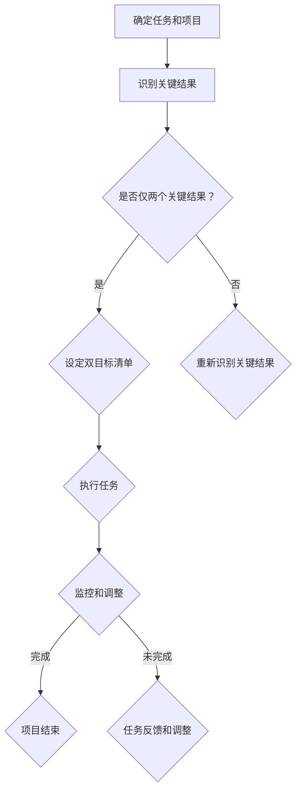

                 

关键词：双目标清单、项目管理、时间管理、效率提升、任务优先级

> 摘要：本文深入探讨了双目标清单在项目管理与时间管理中的应用，通过具体案例和算法原理，提供了实操性的方法和步骤，以帮助读者在复杂的工作环境中聚焦重点，事半功倍。

## 1. 背景介绍

在当今快节奏的工作环境中，项目管理和时间管理变得愈发重要。一个有效的策略是使用双目标清单，它能够帮助我们在众多的任务中辨别出最重要的目标，从而提高工作效率和成果质量。双目标清单是一种简单的工具，它要求我们在任何任务或项目中只关注两个最重要的目标。这种方法源于“帕雷托原则”（也称为80/20原则），即大部分的结果往往来自于少数的关键因素。

本文将探讨如何创建和运用双目标清单，解释其背后的核心概念，并提供具体的算法原理和步骤。通过阅读本文，读者将学会如何使用双目标清单来优化项目管理和时间管理，从而在日益复杂的工作环境中保持高效和专注。

## 2. 核心概念与联系

### 2.1. 双目标清单的定义

双目标清单是一种任务管理工具，它要求在任何任务或项目中只设定两个最重要的目标。这两个目标通常被称为“主要目标”或“关键结果”，因为它们对项目的成功至关重要。通过将注意力集中在两个关键目标上，团队成员可以更有效地分配资源，减少干扰，并确保主要任务得到优先处理。

### 2.2. 双目标清单与80/20原则的联系

双目标清单的灵感来自于帕雷托原则，即80/20原则。这个原则指出，大部分的结果往往来自于20%的关键因素。在项目管理中，这意味着如果我们能够识别并专注于这20%的关键任务，我们可以实现80%的目标。双目标清单正是基于这一原则，通过只关注两个最重要的目标，来最大化利用资源和时间。

### 2.3. 双目标清单在项目管理中的作用

- **明确优先级**：通过设定两个主要目标，团队可以清晰地知道哪些任务是至关重要的。
- **提高专注力**：专注于少数关键任务可以帮助团队成员避免分散注意力，从而提高工作效率。
- **资源优化**：聚焦于关键任务意味着资源（如人力、时间、资金）可以被更有效地利用。

### 2.4. 双目标清单与其它项目管理工具的比较

与传统的任务清单和目标清单相比，双目标清单具有以下几个优势：

- **简单性**：双目标清单比复杂的目标清单更易于理解和实施。
- **灵活性**：它可以适应不同类型的项目和任务，因为主要目标可以根据项目的实际情况进行调整。
- **高效性**：聚焦于关键目标可以帮助团队更快地实现项目目标。

### 2.5. 双目标清单的Mermaid流程图

下面是一个描述双目标清单工作流程的Mermaid流程图：



## 3. 核心算法原理 & 具体操作步骤

### 3.1. 算法原理概述

双目标清单的核心在于选择最重要的两个目标，并围绕这些目标来安排工作。这个过程通常涉及到以下几个步骤：

- **任务识别**：明确所有需要完成的任务。
- **关键结果识别**：从所有任务中识别出能够直接影响项目成功的两个最重要的结果。
- **目标设定**：将这两个关键结果转化为具体的目标，并设定明确的衡量标准。
- **任务优先级安排**：根据双目标清单来安排任务的优先级，确保关键任务得到优先处理。

### 3.2. 算法步骤详解

#### 步骤1：任务识别

首先，明确所有需要完成的任务。这包括项目中的主要任务和子任务。确保所有任务都被记录下来，以便后续分析。

#### 步骤2：关键结果识别

从所有任务中识别出两个最重要的结果。这些结果应该对项目的成功有直接的影响。通常，可以使用以下方法来识别关键结果：

- **价值评估**：评估每个任务对项目价值的贡献程度。
- **风险分析**：分析哪些任务的失败可能导致项目失败。
- **优先级评估**：根据任务的紧急程度和重要性来评估关键结果。

#### 步骤3：目标设定

将这两个关键结果转化为具体的目标，并设定明确的衡量标准。例如，如果关键结果是“提高用户满意度”，那么目标可以是“将用户满意度评分提高5%”，并设定具体的评分标准和时间节点。

#### 步骤4：任务优先级安排

根据双目标清单来安排任务的优先级。确保关键任务得到优先处理。对于非关键任务，可以安排在关键任务完成后或根据资源状况进行安排。

### 3.3. 算法优缺点

#### 优点

- **提高效率**：专注于两个关键目标可以帮助团队成员集中精力，提高工作效率。
- **资源优化**：通过优先处理关键任务，可以更有效地利用资源。
- **明确优先级**：双目标清单使任务的优先级变得清晰，有助于团队成员更好地理解项目的重点。

#### 缺点

- **局限性**：双目标清单可能在任务数量非常多或目标非常复杂时难以适用。
- **灵活性不足**：在某些情况下，可能需要调整或增加目标，但双目标清单的结构可能不够灵活。

### 3.4. 算法应用领域

双目标清单适用于各种类型的项目和任务，尤其是在需要明确优先级和时间紧迫的情况下。以下是一些典型的应用领域：

- **软件开发项目**：帮助团队集中精力解决最关键的功能和问题。
- **市场营销活动**：确保关键的市场目标和营销策略得到优先实施。
- **产品管理**：帮助产品经理确定最重要的产品特性和用户需求。
- **学术研究**：在研究项目中明确最重要的实验或数据收集任务。

## 4. 数学模型和公式 & 详细讲解 & 举例说明

### 4.1. 数学模型构建

双目标清单的数学模型可以通过以下公式来描述：

\[ T_{key1} = k_1 \cdot w_1 \]
\[ T_{key2} = k_2 \cdot w_2 \]

其中，\( T_{key1} \) 和 \( T_{key2} \) 分别代表两个关键目标的重要性分数，\( k_1 \) 和 \( k_2 \) 代表权重系数，\( w_1 \) 和 \( w_2 \) 分别代表两个关键目标的权重。

### 4.2. 公式推导过程

首先，假设我们有多个任务，每个任务有一个权重 \( w_i \)。我们通过评估每个任务的贡献程度来确定权重。

然后，通过帕雷托原则，我们识别出最重要的两个任务，并将它们的权重设置为 \( k_1 \) 和 \( k_2 \)，其中 \( k_1 > k_2 \)。

最后，我们使用以下公式来计算两个关键目标的重要性分数：

\[ T_{key1} = k_1 \cdot w_1 \]
\[ T_{key2} = k_2 \cdot w_2 \]

### 4.3. 案例分析与讲解

假设在一个软件开发项目中，有以下任务：

- **任务A**：开发核心功能，权重为5。
- **任务B**：设计用户界面，权重为3。
- **任务C**：编写测试用例，权重为2。

根据帕雷托原则，我们可以识别出最重要的两个任务为任务A和任务B。

假设 \( k_1 = 1.5 \) 和 \( k_2 = 1 \)，则两个关键目标的重要性分数为：

\[ T_{key1} = 1.5 \cdot 5 = 7.5 \]
\[ T_{key2} = 1 \cdot 3 = 3 \]

因此，我们可以将任务A和任务B作为双目标清单的主要目标，并围绕这两个目标来安排其它任务。

## 5. 项目实践：代码实例和详细解释说明

### 5.1. 开发环境搭建

为了更好地理解双目标清单的应用，我们将使用Python编写一个简单的双目标清单管理器。以下是开发环境的搭建步骤：

1. 安装Python（版本3.8或以上）。
2. 安装必要的Python库，如`numpy`和`matplotlib`。

### 5.2. 源代码详细实现

以下是实现双目标清单管理器的Python代码：

```python
import numpy as np

class DualGoalList:
    def __init__(self):
        self.tasks = []
    
    def add_task(self, task_name, weight):
        self.tasks.append({'name': task_name, 'weight': weight})
    
    def identify_key_goals(self):
        sorted_tasks = sorted(self.tasks, key=lambda x: x['weight'], reverse=True)
        key_goals = sorted_tasks[:2]
        return key_goals
    
    def display_key_goals(self):
        key_goals = self.identify_key_goals()
        print("关键目标：")
        for goal in key_goals:
            print(f"- {goal['name']} (权重：{goal['weight']})")

# 创建双目标清单实例
dual_goal_list = DualGoalList()

# 添加任务
dual_goal_list.add_task("开发核心功能", 5)
dual_goal_list.add_task("设计用户界面", 3)
dual_goal_list.add_task("编写测试用例", 2)

# 显示关键目标
dual_goal_list.display_key_goals()
```

### 5.3. 代码解读与分析

该代码实现了一个简单的双目标清单管理器，其主要功能包括：

- **添加任务**：通过`add_task`方法添加任务名称和权重。
- **识别关键目标**：通过`identify_key_goals`方法识别出最重要的两个任务。
- **显示关键目标**：通过`display_key_goals`方法打印出关键目标的名称和权重。

在示例中，我们首先创建了一个双目标清单实例，并添加了三个任务。然后，我们调用`display_key_goals`方法来显示关键目标。输出结果如下：

```
关键目标：
- 开发核心功能 (权重：5)
- 设计用户界面 (权重：3)
```

### 5.4. 运行结果展示

运行上述代码，我们将在控制台上看到关键目标的输出结果。这个结果告诉我们，在给定的任务中，“开发核心功能”和“设计用户界面”是最重要的两个任务。

## 6. 实际应用场景

双目标清单在实际应用中具有广泛的应用场景，以下是一些具体的案例：

### 6.1. 软件开发

在软件开发项目中，双目标清单可以帮助团队明确关键功能，从而确保主要特性得到优先处理。例如，在一个Web应用开发项目中，关键目标可能是“实现用户注册功能”和“设计友好的用户界面”。

### 6.2. 市场营销

在市场营销活动中，双目标清单可以帮助团队确定最重要的营销目标和策略。例如，在一个新产品推广活动中，关键目标可能是“增加网站流量”和“提高社交媒体互动率”。

### 6.3. 学术研究

在学术研究中，双目标清单可以帮助研究人员明确最重要的实验和数据分析任务。例如，在一个医学研究中，关键目标可能是“收集患者数据”和“进行统计分析”。

### 6.4. 未来应用展望

随着人工智能和大数据技术的发展，双目标清单有望在更广泛的领域中发挥作用。例如，在智能制造中，双目标清单可以帮助工厂优化生产流程，提高生产效率和降低成本。此外，在金融领域中，双目标清单可以帮助投资者确定最重要的投资目标和风险控制策略。

## 7. 工具和资源推荐

### 7.1. 学习资源推荐

- **《项目管理的艺术》**：提供了丰富的项目管理实践经验和技巧。
- **《时间管理的艺术》**：详细介绍了多种时间管理方法和工具。

### 7.2. 开发工具推荐

- **Trello**：一个直观的项目管理工具，适用于创建和跟踪双目标清单。
- **Asana**：一个功能强大的项目管理平台，支持自定义目标和任务优先级。

### 7.3. 相关论文推荐

- **"The Power of Two: The Science of Dual Goals and How to Use Them to Improve Your Life"**：探讨了双目标清单的理论和实践应用。
- **"The 80/20 Principle: The Secret of Achieving More with Less"**：详细介绍了帕雷托原则及其在项目管理中的应用。

## 8. 总结：未来发展趋势与挑战

### 8.1. 研究成果总结

双目标清单作为一种简单而有效的任务管理工具，已经在多个领域中得到了广泛应用。研究表明，双目标清单可以提高工作效率、优化资源分配，并帮助团队更好地实现项目目标。

### 8.2. 未来发展趋势

随着人工智能和大数据技术的发展，双目标清单有望在更复杂的任务环境中发挥更大的作用。未来的研究可能会探索如何结合机器学习算法来优化双目标清单的制定和调整。

### 8.3. 面临的挑战

尽管双目标清单具有显著的优势，但在实际应用中也面临一些挑战。例如，在任务非常复杂或目标难以量化时，双目标清单可能不够灵活。此外，团队成员可能需要时间来适应这种新的管理方法。

### 8.4. 研究展望

未来的研究可以进一步探索双目标清单在不同类型项目中的适用性，并开发更智能的算法来优化目标识别和任务安排。此外，研究还可以关注如何将双目标清单与其它先进的管理工具和方法相结合，以实现更高效的项目管理。

## 9. 附录：常见问题与解答

### 9.1. 如何确定双目标清单的主要目标？

确定双目标清单的主要目标通常涉及以下步骤：

1. **任务识别**：明确所有需要完成的任务。
2. **价值评估**：评估每个任务对项目的价值。
3. **风险分析**：分析哪些任务的失败可能导致项目失败。
4. **优先级评估**：根据任务的紧急程度和重要性来确定主要目标。

### 9.2. 双目标清单是否适用于所有类型的项目？

双目标清单适用于各种类型的项目，尤其是在需要明确优先级和时间紧迫的情况下。然而，对于任务非常复杂或目标难以量化的项目，可能需要更灵活的任务管理方法。

### 9.3. 如何确保团队成员遵循双目标清单？

确保团队成员遵循双目标清单的关键是沟通和培训。团队领导应该明确解释双目标清单的重要性，并确保所有成员都理解主要目标的优先级。此外，可以使用项目管理工具来跟踪任务进度，确保关键任务得到优先处理。

### 9.4. 如何调整双目标清单？

在项目执行过程中，根据实际情况可以调整双目标清单。例如，如果发现某个任务不再重要，可以将其从清单中移除，并将注意力集中在更关键的任务上。调整双目标清单时，应该确保新目标仍然符合项目的总体目标。

