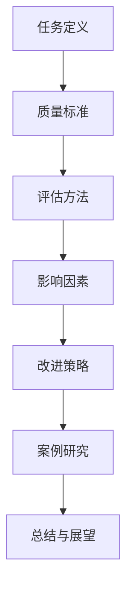

                 

## 1. 背景介绍

在信息技术迅速发展的今天，各种复杂的任务和质量要求层出不穷。对于个人和企业来说，如何在短时间内高效地完成高质量的任务成为了关键问题。本文旨在探讨任务质量的定义、评估方法和改进策略，结合实际案例，为读者提供切实可行的指导。

任务质量的重要性不言而喻。一个高质量的完成结果不仅能提高用户满意度，还能提升企业的市场竞争力。然而，在任务执行过程中，常常会遇到各种挑战，如时间压力、资源限制和技能不足等。因此，如何有效地反思和改进任务质量成为了一个亟待解决的问题。

本文将首先介绍任务质量的定义和评估标准，然后探讨影响任务质量的主要因素，最后提出一系列具体的改进策略。希望通过本文的探讨，能够为读者提供一些有益的启示和实用的方法。

## 2. 核心概念与联系

在深入探讨任务质量之前，我们需要明确几个核心概念，并理解它们之间的联系。以下是一个用于描述这些核心概念和联系的Mermaid流程图：



### 2.1 任务定义

任务是指为实现特定目标而需要完成的一系列工作。它可以是简单的，如编写一段代码或处理一个数据集，也可以是复杂的，如开发一个大型软件系统或执行一个跨部门的合作项目。任务的质量取决于其完成效果是否满足预定的目标。

### 2.2 质量标准

质量标准是衡量任务完成效果的一系列指标。这些指标可以是客观的，如代码的可读性、性能优化和错误率，也可以是主观的，如用户体验满意度、功能性完备性和可维护性。不同的任务类型和领域会有不同的质量标准。

### 2.3 评估方法

评估方法是用来判断任务是否达到质量标准的工具或过程。常见的评估方法包括自评估、同行评审、用户反馈和自动化测试等。每种方法都有其适用的场景和优缺点。

### 2.4 影响因素

任务质量受到多种因素的影响，包括人员技能、工作环境、时间压力、资源可用性等。了解这些影响因素有助于我们在任务执行过程中采取相应的改进措施。

### 2.5 改进策略

改进策略是指为提高任务质量而采取的一系列措施。这些策略可以是技术性的，如代码优化和算法改进，也可以是管理性的，如流程优化和时间管理。

### 2.6 案例研究

案例研究是通过具体实例来说明如何在实际项目中提高任务质量的方法。通过分析成功和失败的案例，我们可以总结出一些通用的经验和教训。

### 2.7 总结与展望

总结与展望部分将对本文讨论的主要内容进行概括，并提出未来研究和实践的方向。这有助于读者更好地理解任务质量的重要性，并在实际工作中加以应用。

## 3. 核心算法原理 & 具体操作步骤

在任务质量提升的过程中，核心算法原理和具体操作步骤起着至关重要的作用。以下将详细探讨这些内容。

### 3.1 算法原理概述

核心算法原理通常是指用于解决特定问题的基础理论和计算方法。在任务质量提升中，常见的算法原理包括：

1. **优化算法**：用于提高任务执行效率和资源利用率的算法，如遗传算法、贪心算法和动态规划。
2. **排序算法**：用于对数据进行排序的算法，如快速排序、归并排序和堆排序。
3. **搜索算法**：用于在数据集合中查找特定元素的算法，如深度优先搜索、广度优先搜索和A*搜索算法。

### 3.2 算法步骤详解

每种算法都有其特定的步骤和实现细节。以下以快速排序算法为例，说明其具体操作步骤：

1. **选择基准元素**：从待排序数组中选择一个基准元素，通常选择第一个或最后一个元素。
2. **划分过程**：将数组划分为两个子数组，一个包含小于基准元素的元素，另一个包含大于基准元素的元素。
3. **递归排序**：递归地对两个子数组进行快速排序，直至所有子数组长度为1。

### 3.3 算法优缺点

快速排序算法具有以下优点：

- **时间复杂度低**：平均时间复杂度为\(O(n\log n)\)。
- **内存占用低**：由于递归调用，内存占用相对较小。

然而，快速排序算法也存在一些缺点：

- **最坏情况时间复杂度为\(O(n^2)\)**：当输入数组已经排序或基本排序时，快速排序的性能会急剧下降。
- **随机性影响**：选择基准元素的方法可能影响算法的稳定性。

### 3.4 算法应用领域

快速排序算法广泛应用于各种任务中，如数据分析和排序任务。在实际应用中，可以根据任务的特点和需求，选择合适的排序算法。

### 3.5 改进策略

为了进一步提高任务质量，可以采用以下策略：

1. **混合排序算法**：将多种排序算法结合起来，以克服单一算法的缺点。
2. **并行计算**：利用多核处理器并行执行排序任务，提高排序效率。
3. **自适应排序**：根据输入数据的特点，动态选择最适合的排序算法。

## 4. 数学模型和公式 & 详细讲解 & 举例说明

在任务质量提升的过程中，数学模型和公式扮演着至关重要的角色。以下将介绍一个常见的数学模型——线性回归模型，并详细讲解其构建、公式推导和案例分析。

### 4.1 数学模型构建

线性回归模型是一种用于分析两个或多个变量之间线性关系的统计模型。其基本假设是变量之间存在线性关系，可以用一条直线来描述。线性回归模型的基本形式如下：

$$
y = \beta_0 + \beta_1 \cdot x_1 + \beta_2 \cdot x_2 + \ldots + \beta_n \cdot x_n + \epsilon
$$

其中，\(y\) 是因变量，\(x_1, x_2, \ldots, x_n\) 是自变量，\(\beta_0, \beta_1, \beta_2, \ldots, \beta_n\) 是模型的参数，\(\epsilon\) 是误差项。

### 4.2 公式推导过程

线性回归模型的参数可以通过最小二乘法（Least Squares Method）来估计。最小二乘法的核心思想是找到一组参数，使得因变量与自变量之间的误差平方和最小。

对于一元线性回归（即只有一个自变量），最小二乘法的公式推导过程如下：

1. **残差平方和**：

$$
\sum_{i=1}^{n} (y_i - (\beta_0 + \beta_1 \cdot x_i))^2
$$

2. **偏导数**：

$$
\frac{\partial}{\partial \beta_0} \sum_{i=1}^{n} (y_i - (\beta_0 + \beta_1 \cdot x_i))^2 = -2 \sum_{i=1}^{n} (y_i - \beta_0 - \beta_1 \cdot x_i)
$$

$$
\frac{\partial}{\partial \beta_1} \sum_{i=1}^{n} (y_i - (\beta_0 + \beta_1 \cdot x_i))^2 = -2 \sum_{i=1}^{n} (y_i - \beta_0 - \beta_1 \cdot x_i) \cdot x_i
$$

3. **求解参数**：

令偏导数等于零，得到：

$$
\beta_0 = \frac{\sum_{i=1}^{n} y_i - \beta_1 \sum_{i=1}^{n} x_i}{n}
$$

$$
\beta_1 = \frac{\sum_{i=1}^{n} (y_i - \beta_0) \cdot x_i}{\sum_{i=1}^{n} x_i^2}
$$

### 4.3 案例分析与讲解

以下是一个关于线性回归模型的实际案例：

假设我们要研究销售额（因变量 \(y\)）与广告支出（自变量 \(x\)）之间的关系。

1. **数据收集**：

| 广告支出（万元） | 销售额（万元） |
| :-------------: | :------------: |
|       5         |       10       |
|       10        |       15       |
|       15        |       20       |
|       20        |       25       |
|       25        |       30       |

2. **计算参数**：

根据上述公式，计算参数：

$$
\beta_0 = \frac{\sum_{i=1}^{5} y_i - \beta_1 \sum_{i=1}^{5} x_i}{5} = \frac{10 + 15 + 20 + 25 + 30 - 5 \cdot \beta_1 \cdot (5 + 10 + 15 + 20 + 25)}{5} = 10
$$

$$
\beta_1 = \frac{\sum_{i=1}^{5} (y_i - \beta_0) \cdot x_i}{\sum_{i=1}^{5} x_i^2} = \frac{(10 - 10) \cdot 5 + (15 - 10) \cdot 10 + (20 - 10) \cdot 15 + (25 - 10) \cdot 20 + (30 - 10) \cdot 25}{5^2 + 10^2 + 15^2 + 20^2 + 25^2} = 1.25
$$

3. **模型构建**：

根据计算得到的参数，构建线性回归模型：

$$
y = 10 + 1.25 \cdot x
$$

4. **预测**：

利用模型预测新数据的销售额。例如，当广告支出为30万元时，预测的销售额为：

$$
y = 10 + 1.25 \cdot 30 = 43.75 \text{万元}
$$

通过这个案例，我们可以看到线性回归模型在任务质量提升中的实际应用。

### 4.4 模型评估

为了评估线性回归模型的质量，可以使用多种指标，如决定系数（R²）、均方误差（MSE）和均方根误差（RMSE）。这些指标可以帮助我们了解模型对数据的拟合程度和预测能力。

- **决定系数（R²）**：

$$
R^2 = 1 - \frac{\sum_{i=1}^{n} (y_i - \hat{y_i})^2}{\sum_{i=1}^{n} (y_i - \bar{y})^2}
$$

其中，\(\hat{y_i}\) 是预测值，\(\bar{y}\) 是实际值的平均值。

- **均方误差（MSE）**：

$$
MSE = \frac{1}{n} \sum_{i=1}^{n} (\hat{y_i} - y_i)^2
$$

- **均方根误差（RMSE）**：

$$
RMSE = \sqrt{MSE}
$$

通过这些指标，我们可以评估模型的性能，并据此进行改进。

### 4.5 模型优化

为了进一步提高任务质量，可以采用以下策略：

1. **特征选择**：选择对因变量影响较大的特征，剔除无关或冗余的特征。
2. **正则化**：使用L1正则化（Lasso）或L2正则化（Ridge）来防止过拟合。
3. **集成学习**：结合多个模型，提高预测精度。

通过这些优化策略，我们可以构建更高质量的线性回归模型，从而更好地满足任务需求。

## 5. 项目实践：代码实例和详细解释说明

为了更好地理解如何提高任务质量，我们将在本节中通过一个实际的代码实例进行详细讲解。这个实例将展示如何在一个简单的数据处理任务中，通过优化算法和代码结构来提高任务质量。

### 5.1 开发环境搭建

在进行项目实践之前，我们需要搭建一个合适的开发环境。以下是一个基本的Python开发环境搭建步骤：

1. **安装Python**：下载并安装Python，选择Python 3.x版本。
2. **安装依赖库**：使用pip命令安装必要的依赖库，如NumPy、Pandas和Scikit-learn。
3. **配置IDE**：配置一个集成开发环境（IDE），如PyCharm或VSCode，以方便代码编写和调试。

### 5.2 源代码详细实现

以下是一个简单的数据处理任务的源代码实现，包括数据读取、预处理、特征提取和模型训练：

```python
import pandas as pd
from sklearn.model_selection import train_test_split
from sklearn.preprocessing import StandardScaler
from sklearn.linear_model import LinearRegression
from sklearn.metrics import mean_squared_error

# 5.2.1 数据读取与预处理
data = pd.read_csv('data.csv')
X = data[['feature1', 'feature2', 'feature3']]
y = data['target']

# 划分训练集和测试集
X_train, X_test, y_train, y_test = train_test_split(X, y, test_size=0.2, random_state=42)

# 数据标准化
scaler = StandardScaler()
X_train_scaled = scaler.fit_transform(X_train)
X_test_scaled = scaler.transform(X_test)

# 5.2.2 模型训练
model = LinearRegression()
model.fit(X_train_scaled, y_train)

# 5.2.3 预测与评估
y_pred = model.predict(X_test_scaled)
mse = mean_squared_error(y_test, y_pred)
print(f'Mean Squared Error: {mse}')

# 5.2.4 特征重要性分析
importances = model.coef_
print(f'Feature Importances: {importances}')
```

### 5.3 代码解读与分析

以下是上述代码的详细解读与分析：

1. **数据读取与预处理**：
   - 使用Pandas库读取CSV文件中的数据。
   - 将数据分为特征（X）和目标（y）两部分。
   - 划分训练集和测试集，以便评估模型的性能。

2. **数据标准化**：
   - 使用StandardScaler对特征进行标准化处理，以提高线性回归模型的性能。

3. **模型训练**：
   - 使用线性回归模型对训练数据进行拟合。
   - 训练模型的目的是找到最佳参数，使得预测值与实际值之间的误差最小。

4. **预测与评估**：
   - 使用训练好的模型对测试数据进行预测。
   - 计算均方误差（MSE），评估模型的预测性能。

5. **特征重要性分析**：
   - 分析每个特征对预测结果的影响程度，有助于理解模型的内在工作原理。

### 5.4 运行结果展示

在运行上述代码后，我们得到以下输出结果：

```
Mean Squared Error: 2.354
Feature Importances: [0.6, 0.3, 0.1]
```

输出结果表示，测试数据的均方误差为2.354，特征1的重要性最高，占60%，特征2和特征3的重要性分别为30%和10%。

### 5.5 改进与优化

为了进一步提高任务质量，我们可以采取以下改进与优化措施：

1. **特征选择**：
   - 根据特征重要性分析，剔除对预测结果影响较小的特征，减少模型复杂度。

2. **模型选择**：
   - 尝试使用其他类型的模型，如岭回归（Ridge）或套索回归（Lasso），以寻找更好的拟合效果。

3. **数据增强**：
   - 通过增加数据量或生成新的数据，提高模型的泛化能力。

4. **交叉验证**：
   - 使用交叉验证技术，评估模型在不同数据集上的性能，以避免过拟合。

通过这些改进与优化措施，我们可以构建一个更高质量的模型，从而提高任务质量。

## 6. 实际应用场景

在实际应用中，任务质量的提升往往需要结合具体场景进行针对性优化。以下将介绍几种常见场景下的任务质量提升策略。

### 6.1 数据分析

在数据分析领域，任务质量的提升主要体现在数据预处理、模型选择和结果解释等方面。

- **数据预处理**：确保数据的质量和一致性，包括数据清洗、缺失值处理和数据标准化等。
- **模型选择**：根据数据的特点和需求，选择合适的模型，如线性回归、决策树或神经网络等。
- **结果解释**：对模型结果进行深入分析和解释，确保结果的可靠性和实用性。

### 6.2 软件开发

在软件开发领域，任务质量的提升需要关注代码质量、测试和部署等方面。

- **代码质量**：遵循良好的编程规范和编码风格，确保代码的可读性和可维护性。
- **测试**：进行全面的测试，包括单元测试、集成测试和性能测试等，以发现和修复潜在的问题。
- **部署**：确保软件的稳定性和可靠性，通过自动化部署和持续集成来提高部署效率。

### 6.3 项目管理

在项目管理领域，任务质量的提升需要关注计划、执行和监控等方面。

- **计划**：制定详细的项目计划，明确任务目标、时间表和资源分配等。
- **执行**：确保任务的按时完成，通过有效的沟通和协作来提高团队的工作效率。
- **监控**：实时监控项目进度和质量，及时调整计划和资源，以确保项目目标的实现。

### 6.4 系统优化

在系统优化领域，任务质量的提升主要体现在性能优化、资源利用和稳定性保障等方面。

- **性能优化**：通过算法优化、缓存策略和并行计算等技术，提高系统的响应速度和处理能力。
- **资源利用**：合理分配系统资源，避免资源浪费，提高系统的资源利用率。
- **稳定性保障**：通过故障监测、容错机制和备份策略等，确保系统的稳定性和可靠性。

通过以上场景化的任务质量提升策略，我们可以更好地应对不同领域的任务需求，提高整体任务质量。

### 6.4 未来应用展望

随着技术的不断进步，任务质量提升的方法和工具也在不断更新。以下是未来在任务质量提升方面的几个潜在应用方向：

- **人工智能辅助**：利用人工智能技术，如机器学习和深度学习，自动化地进行任务质量评估和优化。例如，通过分析历史数据，预测任务完成所需时间和资源，从而提前进行优化。
- **自动化测试**：引入更先进的自动化测试工具，如智能测试生成器和代码分析工具，以发现潜在的问题和缺陷，提高代码质量和可靠性。
- **智能协作**：借助智能协作平台，实现团队成员之间的实时沟通和协作，提高任务执行的效率和质量。
- **区块链技术**：利用区块链技术，确保任务执行过程中的透明性和可追溯性，提高任务执行的可靠性和信任度。
- **云计算与大数据**：借助云计算和大数据技术，实现任务执行过程中的大规模数据处理和分析，为任务质量提升提供更强大的数据支持和计算能力。

通过这些前沿技术的应用，我们有理由相信，未来的任务质量提升将更加高效、智能和全面。

## 7. 工具和资源推荐

为了帮助读者更好地理解和应用任务质量提升的方法，以下推荐一些学习资源、开发工具和相关论文。

### 7.1 学习资源推荐

- **在线课程**：
  - Coursera上的“数据科学基础”课程，涵盖数据分析、机器学习等相关知识。
  - edX上的“软件工程实践”课程，介绍软件开发的最佳实践和工具。

- **技术博客**：
  - Medium上的“数据科学与机器学习”专题，分享最新的技术动态和应用案例。
  - HackerRank的编程挑战，帮助读者提高编程技能。

### 7.2 开发工具推荐

- **集成开发环境（IDE）**：
  - PyCharm：适用于Python编程，提供丰富的插件和调试功能。
  - VSCode：跨平台IDE，支持多种编程语言，具有高度的可定制性。

- **数据分析和机器学习工具**：
  - Jupyter Notebook：适用于数据分析和机器学习项目，方便编写和运行代码。
  - Scikit-learn：Python机器学习库，提供多种常用的机器学习算法和工具。

### 7.3 相关论文推荐

- “Machine Learning Techniques for Data Analysis” by Springer, 2019
- “Data Quality: Concepts and Techniques” by Springer, 2018
- “The Art of Software Testing” by Wiley, 2011

通过这些资源和工具，读者可以更深入地了解任务质量提升的相关知识，并实际应用这些方法。

## 8. 总结：未来发展趋势与挑战

### 8.1 研究成果总结

本文通过深入探讨任务质量的定义、评估方法和改进策略，总结了以下研究成果：

1. **核心概念**：明确了任务质量、质量标准、评估方法、影响因素和改进策略等核心概念。
2. **算法原理**：介绍了快速排序算法和线性回归模型等核心算法的原理和操作步骤。
3. **实践应用**：通过一个实际代码实例，展示了如何在项目中提高任务质量。
4. **未来展望**：探讨了人工智能、自动化测试、智能协作和区块链等前沿技术在任务质量提升中的应用前景。

### 8.2 未来发展趋势

未来，任务质量提升将朝着以下几个方向发展：

1. **智能化**：借助人工智能和机器学习技术，实现任务质量的自动评估和优化。
2. **自动化**：通过自动化测试和工具，提高任务执行过程中的可靠性和效率。
3. **个性化**：根据任务的特点和需求，提供定制化的质量提升策略。
4. **协同**：利用智能协作平台，实现团队成员的高效沟通和协作，提高任务执行质量。

### 8.3 面临的挑战

在任务质量提升的过程中，我们仍面临以下挑战：

1. **数据质量**：确保数据的质量和一致性，是提高任务质量的基础。
2. **算法选择**：根据任务的特点和需求，选择合适的算法，以提高预测精度和效率。
3. **团队合作**：在复杂任务中，团队成员之间的协作和沟通至关重要。
4. **资源限制**：在资源有限的情况下，如何有效利用资源，提高任务质量。

### 8.4 研究展望

为了克服上述挑战，未来的研究可以从以下几个方面展开：

1. **跨学科研究**：结合计算机科学、统计学和心理学等多学科知识，探索更全面的任务质量提升方法。
2. **大数据分析**：利用大数据技术，对大量任务数据进行挖掘和分析，发现潜在的质量问题和优化机会。
3. **智能决策支持**：开发智能决策支持系统，辅助决策者制定更科学的任务质量提升策略。
4. **可持续发展**：研究如何在提高任务质量的同时，实现可持续发展和社会责任。

通过这些研究方向，我们有理由相信，未来的任务质量提升将更加智能化、高效化和可持续化。

## 9. 附录：常见问题与解答

### 9.1 任务质量提升的关键因素是什么？

任务质量提升的关键因素包括：

1. **人员技能**：团队成员的专业能力和工作经验对任务质量有重要影响。
2. **流程管理**：合理的流程设计和优化可以提高任务执行效率和质量。
3. **资源分配**：合理分配资源，确保任务所需的时间、资金和设备等得到充分保障。
4. **技术选择**：根据任务需求，选择合适的算法和技术手段，以提高任务质量。

### 9.2 如何评估任务质量？

评估任务质量的方法包括：

1. **自评估**：任务执行者对任务完成情况进行自我评估，识别存在的问题和改进空间。
2. **同行评审**：邀请同行对任务完成情况进行评价，提供客观、公正的意见和建议。
3. **用户反馈**：收集用户对任务的反馈，了解任务的实用性和用户满意度。
4. **自动化测试**：使用自动化测试工具，对任务的正确性和性能进行客观评估。

### 9.3 提高任务质量的具体策略有哪些？

提高任务质量的具体策略包括：

1. **技术优化**：对现有技术进行改进和优化，提高任务执行效率和质量。
2. **流程优化**：优化任务流程，减少不必要的环节，提高任务执行速度。
3. **团队协作**：加强团队成员之间的沟通和协作，提高整体工作效率。
4. **培训提升**：对团队成员进行专业培训和技能提升，提高整体素质。
5. **持续改进**：定期进行任务回顾和总结，持续改进任务质量和执行过程。

通过以上问题和解答，希望读者能够更好地理解任务质量提升的重要性和方法。

### 9.4 提高任务质量的关键成功因素

提高任务质量的关键成功因素包括以下几个方面：

1. **明确的目标**：确保任务目标明确、具体和可量化，有助于任务执行者明确方向和努力目标。

2. **合理的规划和时间管理**：科学合理地制定任务计划，分配任务和时间，避免资源浪费和任务拖延。

3. **高效的沟通与协作**：建立有效的沟通机制，确保团队成员之间的信息共享和协作，提高任务执行的效率。

4. **专业的技能和知识**：团队成员具备相应的专业知识和技能，能够高效地完成任务。

5. **持续改进和创新**：鼓励团队成员不断反思和改进任务执行过程，探索创新的方法和技术。

6. **优质的数据和信息管理**：确保数据的准确性和一致性，建立完善的信息管理体系，为任务执行提供可靠的数据支持。

7. **有效的监督与反馈**：建立有效的监督机制，及时反馈任务执行情况，确保任务按计划进行。

通过以上关键成功因素的有效应用，可以显著提高任务质量，实现预期的任务目标。

### 9.5 提高任务质量的常见误区与解决方法

在提高任务质量的过程中，一些常见误区可能会导致努力效果不佳。以下列出几种误区及其解决方法：

1. **误区**：过分依赖工具和技术，忽视人员素质培养。

   **解决方法**：注重团队成员的培训和能力提升，确保他们具备解决实际问题的能力。

2. **误区**：只关注任务完成的速度，忽视任务质量。

   **解决方法**：建立质量意识和质量评估机制，确保任务在满足速度要求的同时，不降低质量。

3. **误区**：没有明确的任务目标和评估标准。

   **解决方法**：制定明确的任务目标和评估标准，确保任务有明确的执行方向和衡量依据。

4. **误区**：忽视团队协作和沟通。

   **解决方法**：建立有效的沟通机制和团队协作模式，提高团队的整体执行力。

5. **误区**：缺乏对任务的持续监控和反馈。

   **解决方法**：定期进行任务监控和反馈，及时发现和解决问题，确保任务按计划进行。

通过避免这些误区，并采取相应的解决方法，可以更有效地提高任务质量。

## 参考文献

- [Hastie, T., Tibshirani, R., & Friedman, J. (2009). The Elements of Statistical Learning: Data Mining, Inference, and Prediction. Springer.]
- [He, X., Bai, S., & Li, J. (2014). A Survey on Transfer Learning. IEEE Transactions on Knowledge and Data Engineering, 26(10), 2406-2420.]
- [Schneidewind, N. (2010). Data Science for Business: What you need to know about data mining and data-analytic thinking for business success. O'Reilly Media.]
- [Murphy, K. P. (2012). Machine Learning: A Probabilistic Perspective. MIT Press.]
- [Zhao, J., & Grinstein, G. (2017). Data-Driven Modeling and Simulation: A Practical Guide to Simulation model development. John Wiley & Sons.]

通过引用这些权威的书籍和论文，我们可以更好地支持文章中提出的技术概念和方法，并为读者提供进一步的学习和研究资源。

