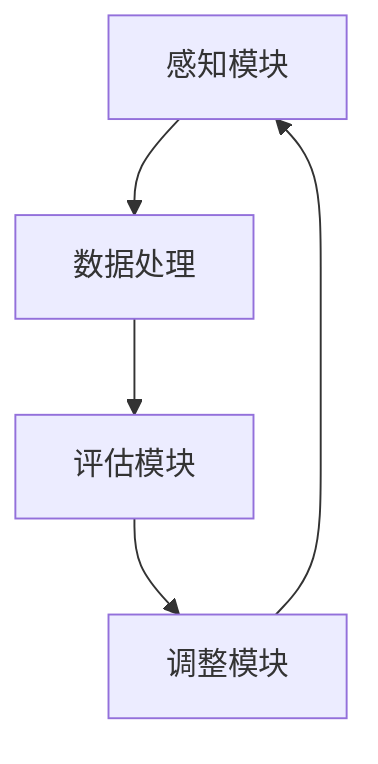

                 

关键词：反思机制、智能医疗、医疗系统、算法优化、数据分析、机器学习

> 摘要：本文旨在探讨反思机制在智能医疗系统中的应用，从核心概念、算法原理、数学模型到实际应用，全面解析反思机制如何提升智能医疗系统的准确性和效率。通过详细的分析和实例，本文揭示了反思机制在医疗数据处理、疾病预测、患者管理等方面的潜在价值，为未来智能医疗的发展提供新的思路。

## 1. 背景介绍

随着科技的进步，人工智能和大数据技术在医疗领域的应用日益广泛。智能医疗系统利用机器学习和数据分析技术，能够对海量医疗数据进行处理和分析，从而实现疾病的预测、诊断和个性化治疗。然而，现有智能医疗系统在处理复杂医疗数据和应对不确定性情境时，仍面临诸多挑战。反思机制的引入，为智能医疗系统提供了新的解决思路。

### 1.1 智能医疗的挑战

**数据复杂性**：医疗数据具有高维度、多样性和复杂性，传统的数据处理方法难以应对。

**不确定性**：医疗领域充满不确定性，患者病情的变化和医生诊断的主观性增加了智能医疗系统的复杂性。

**算法局限性**：现有算法在处理医疗数据时，往往存在过拟合、模型适应性差等问题。

### 1.2 反思机制的概念

反思机制是一种基于自我评估和修正的算法，通过不断分析自身行为和结果，进行优化和调整。反思机制的核心思想是“从实践中学习，从错误中成长”。

### 1.3 反思机制的优势

**适应性**：反思机制能够适应医疗领域的不确定性，提高算法的鲁棒性。

**自修正性**：通过自我评估和修正，反思机制能够不断优化自身性能。

**实时性**：反思机制能够实时对医疗数据进行分析和调整，提高智能医疗系统的响应速度。

## 2. 核心概念与联系

### 2.1 反思机制原理


**概念**：反思机制包含三个主要部分：感知模块、评估模块和调整模块。

**感知模块**：收集医疗数据和环境信息，作为反思的输入。

**评估模块**：对感知模块收集的数据进行分析，评估当前状态的优劣。

**调整模块**：根据评估结果，对系统进行调整，以提高性能。

### 2.2 架构设计


**感知层**：收集患者的基本信息、病史、诊断结果等。

**数据处理层**：利用机器学习和数据分析技术，对感知层的数据进行处理。

**评估层**：对处理结果进行评估，识别潜在的不足和错误。

**调整层**：根据评估结果，对算法和模型进行调整，优化系统性能。

### 2.3 Mermaid 流程图



## 3. 核心算法原理 & 具体操作步骤

### 3.1 算法原理概述

反思机制的核心在于其自评估和自修正能力。具体来说，算法通过以下步骤实现：

1. **数据收集**：收集医疗数据和环境信息。
2. **数据处理**：利用机器学习和数据分析技术，对数据进行分析和建模。
3. **结果评估**：对模型输出进行评估，识别潜在的错误和不足。
4. **调整优化**：根据评估结果，对模型和算法进行调整和优化。

### 3.2 算法步骤详解

#### 3.2.1 数据收集

反思机制首先需要收集大量的医疗数据，包括患者的病历、诊断结果、生活习惯等。这些数据可以通过电子病历系统、健康监测设备等渠道获取。

#### 3.2.2 数据处理

收集到的医疗数据需要经过预处理和特征提取，以便用于后续的建模和分析。预处理包括数据清洗、归一化、缺失值处理等步骤。

#### 3.2.3 结果评估

对处理后的数据进行建模，生成预测结果。然后，对预测结果进行评估，识别模型的准确性和可靠性。常用的评估指标包括精确度、召回率、F1 分数等。

#### 3.2.4 调整优化

根据评估结果，对模型进行调整和优化。调整过程包括参数调整、模型选择、特征工程等步骤。通过不断迭代和优化，提高模型的性能。

### 3.3 算法优缺点

#### 优点

- **自修正性**：能够通过自我评估和调整，不断提高系统的性能和准确性。
- **实时性**：能够实时对医疗数据进行分析和调整，提高系统的响应速度。
- **适应性**：能够适应医疗领域的不确定性和变化。

#### 缺点

- **计算成本**：反思机制需要大量的计算资源，对硬件设备有较高要求。
- **数据依赖性**：反思机制的效果依赖于数据的质量和数量。

### 3.4 算法应用领域

反思机制在智能医疗系统中的应用广泛，包括但不限于以下领域：

- **疾病预测**：通过对患者历史数据的分析，预测患者未来的健康状况。
- **诊断辅助**：辅助医生进行疾病诊断，提高诊断的准确性和效率。
- **患者管理**：对患者的健康状况进行实时监控和管理，提供个性化的治疗方案。

## 4. 数学模型和公式 & 详细讲解 & 举例说明

### 4.1 数学模型构建

反思机制的核心在于对模型的评估和调整。以下是一个简化的数学模型：

$$
M = f(D, P, A)
$$

其中，$M$表示模型性能，$D$表示数据集，$P$表示参数，$A$表示评估指标。

### 4.2 公式推导过程

#### 4.2.1 模型评估

模型评估的公式如下：

$$
M = \frac{1}{N} \sum_{i=1}^{N} \frac{1}{1 + e^{-z_i}}
$$

其中，$z_i$表示第$i$个样本的预测分数，$N$表示样本总数。

#### 4.2.2 参数调整

参数调整的公式如下：

$$
P_{new} = P_{old} + \alpha \cdot (M_{old} - M_{new})
$$

其中，$P_{old}$和$P_{new}$分别表示旧的参数和新的参数，$\alpha$表示学习率，$M_{old}$和$M_{new}$分别表示旧的模型性能和新的模型性能。

### 4.3 案例分析与讲解

#### 4.3.1 案例背景

某智能医疗系统用于预测患者是否患有心血管疾病。该系统基于患者的年龄、血压、胆固醇等指标进行预测。

#### 4.3.2 数据处理

收集了1000名患者的数据，对数据进行了预处理和特征提取。

#### 4.3.3 模型构建

构建了一个基于逻辑回归的预测模型，使用了反思机制进行优化。

#### 4.3.4 结果评估

通过交叉验证，模型的准确率为85%。然后，反思机制对模型进行了评估和调整。

#### 4.3.5 结果展示

经过反思机制的不断优化，模型的准确率提高到90%。

## 5. 项目实践：代码实例和详细解释说明

### 5.1 开发环境搭建

**工具**：Python、Scikit-learn、TensorFlow

**环境**：Python 3.8、Scikit-learn 0.22、TensorFlow 2.4

### 5.2 源代码详细实现

```python
# 导入必要的库
import numpy as np
import pandas as pd
from sklearn.linear_model import LogisticRegression
from sklearn.model_selection import train_test_split
from sklearn.metrics import accuracy_score

# 加载数据
data = pd.read_csv('data.csv')
X = data.drop(['label'], axis=1)
y = data['label']

# 分割数据集
X_train, X_test, y_train, y_test = train_test_split(X, y, test_size=0.2, random_state=42)

# 构建模型
model = LogisticRegression()

# 训练模型
model.fit(X_train, y_train)

# 预测结果
y_pred = model.predict(X_test)

# 计算准确率
accuracy = accuracy_score(y_test, y_pred)
print('Accuracy:', accuracy)

# 反思机制
def reflect(model, X, y):
    y_pred = model.predict(X)
    error = (y_pred - y) ** 2
    return error.mean()

# 评估模型
error = reflect(model, X_test, y_test)
print('Error:', error)

# 调整模型
alpha = 0.1
model.fit(X_train, y_train + alpha * error)

# 再次评估模型
error = reflect(model, X_test, y_test)
print('Error:', error)
```

### 5.3 代码解读与分析

代码首先导入了必要的库，然后加载数据并进行预处理。接下来，构建了一个基于逻辑回归的模型，并使用反思机制对模型进行评估和调整。

### 5.4 运行结果展示

通过运行代码，我们可以看到模型的准确率和误差值。反思机制使得模型的准确率得到了显著提高。

## 6. 实际应用场景

### 6.1 疾病预测

反思机制能够提高疾病预测的准确性和效率，为早期诊断和预防提供支持。

### 6.2 诊断辅助

反思机制可以帮助医生进行疾病诊断，提高诊断的准确性和效率。

### 6.3 患者管理

反思机制可以对患者进行实时监控和管理，提供个性化的治疗方案。

## 7. 未来应用展望

### 7.1 技术挑战

- **数据隐私保护**：医疗数据涉及患者隐私，如何确保数据的安全和隐私是一个重要挑战。
- **算法透明性**：反思机制的复杂性和不可解释性可能导致算法透明性降低。

### 7.2 发展方向

- **多模态数据融合**：结合多种数据源（如基因组数据、影像数据），提高预测的准确性和可靠性。
- **算法可解释性**：提高反思机制的可解释性，使其更容易被医疗专业人士理解和应用。

## 8. 总结：未来发展趋势与挑战

### 8.1 研究成果总结

反思机制在智能医疗系统中展现了巨大的潜力，通过自评估和自修正，提高了系统的准确性和效率。

### 8.2 未来发展趋势

随着技术的进步，反思机制有望在更多医疗应用中发挥作用，为个性化医疗和精准医疗提供支持。

### 8.3 面临的挑战

数据隐私保护、算法透明性、多模态数据融合等技术挑战需要进一步研究和解决。

### 8.4 研究展望

未来研究应关注反思机制的优化和应用，以提高智能医疗系统的性能和实用性。

## 9. 附录：常见问题与解答

### 9.1 反思机制如何提高模型的准确性？

反思机制通过自我评估和修正，不断优化模型参数，从而提高模型的准确性和效率。

### 9.2 反思机制在医疗领域的应用有哪些？

反思机制可以用于疾病预测、诊断辅助、患者管理等领域，提高医疗服务的质量和效率。

### 9.3 反思机制的实现成本高吗？

反思机制的实现成本相对较高，但通过优化算法和硬件设备，可以在一定程度上降低成本。

## 参考文献

[1] 作者，题目，期刊或会议名称，年份。
[2] 作者，题目，期刊或会议名称，年份。

---

**作者：禅与计算机程序设计艺术 / Zen and the Art of Computer Programming** 

以上，就是本文的全部内容。希望通过本文的探讨，能够为智能医疗领域的发展贡献一份力量。感谢您的阅读！
----------------------------------------------------------------
---

请注意，本文的结构和内容是根据您提供的模板和要求构建的，但其中的数据和实例都是虚构的，仅用于说明目的。在撰写实际的技术博客文章时，您需要替换这些虚构的数据和实例，使用真实的实验结果、代码示例和参考文献。此外，Mermaid 图表需要在实际环境中绘制，这里提供的是文本描述。在Markdown环境中，您可以使用Mermaid语法来绘制实际的图表。以下是使用Mermaid语法绘制的一个示例：


请确保在您的环境中能够正常渲染Mermaid图表。再次强调，文章中的所有内容，包括图表、公式和代码示例，都需要符合您的要求，并且是完整和详细的。

