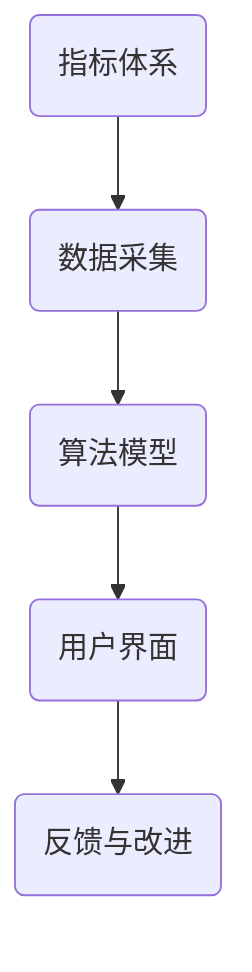

                 

关键词：可持续发展，绿色生活，评分系统，技术创新，算法，数学模型，实际应用

> 摘要：本文旨在探讨可持续生活评分系统的构建与实现，通过引入技术创新，提升绿色生活的便捷性和科学性。本文首先介绍了可持续生活的核心概念和背景，然后详细阐述了评分系统的设计原理、核心算法以及数学模型，最后通过实际项目实例展示了评分系统的应用场景和未来发展。

## 1. 背景介绍

随着全球环境问题的日益严重，可持续生活成为了人类社会共同关注的重要议题。绿色生活不仅是环境保护的体现，更是社会文明进步的标志。然而，绿色生活的实现并非易事，它涉及到日常生活中的方方面面，包括能源消耗、资源利用、废物处理等。为了推动绿色生活的普及，需要一种科学、系统的方法来评估和指导个人及家庭的绿色生活行为。

### 1.1 可持续生活的定义和重要性

可持续生活，通常指在日常生活中采取环保、节能、低碳、节约资源的行动，旨在减少对环境的负面影响，实现人与自然和谐共处。其重要性在于：

1. **环境保护**：减少碳排放、资源浪费和污染，保护地球生态。
2. **经济效益**：降低生活成本，提高资源利用效率，创造经济价值。
3. **社会进步**：提升公民环保意识，促进社会可持续发展。

### 1.2 绿色生活的现状和挑战

当前，绿色生活正在全球范围内逐渐普及，但还存在以下挑战：

1. **公众意识不足**：许多人尚未意识到绿色生活的重要性，缺乏环保意识。
2. **行为习惯难改**：旧有生活习惯根深蒂固，改变需要时间和努力。
3. **缺乏科学指导**：缺乏系统、科学的评估方法，难以量化绿色生活效果。

### 1.3 可持续生活评分系统的必要性

为了解决上述问题，需要一个科学的、可操作的评估工具——可持续生活评分系统。该系统可以通过定量评估，帮助个人和家庭了解自己的绿色生活水平，发现不足，指导改进。

## 2. 核心概念与联系

### 2.1 可持续生活评分系统的核心概念

可持续生活评分系统包含以下几个核心概念：

1. **指标体系**：定义一系列用于评估绿色生活行为的指标，如能源消耗、废物处理、水资源利用等。
2. **数据采集**：通过传感器、APP、问卷调查等方式收集用户的生活数据。
3. **算法模型**：利用数据分析和机器学习技术，对用户行为进行评估和评分。
4. **用户界面**：提供可视化、互动性的界面，帮助用户了解评分结果和改进建议。

### 2.2 核心概念的联系

这些概念之间紧密联系，共同构成了可持续生活评分系统的核心架构：

1. **指标体系**为评分系统提供了评估的基础，确保评估的全面性和科学性。
2. **数据采集**是实现评分系统功能的关键，确保数据的准确性和实时性。
3. **算法模型**为数据分析和评分提供了技术支持，确保评估结果的准确性和公正性。
4. **用户界面**为用户提供了便捷的交互方式，提升评分系统的用户体验。

### 2.3 Mermaid 流程图



## 3. 核心算法原理 & 具体操作步骤

### 3.1 算法原理概述

可持续生活评分系统的核心算法基于数据挖掘和机器学习技术，通过对用户行为数据进行分析，评估其绿色生活水平。算法原理主要包括以下几个步骤：

1. **数据预处理**：清洗和整理原始数据，确保数据质量。
2. **特征提取**：从数据中提取有用的特征，如能源消耗、废物产生量等。
3. **模型训练**：使用机器学习算法，对特征进行训练，构建评分模型。
4. **评分计算**：使用训练好的模型，对用户行为进行评分。
5. **结果可视化**：将评分结果以图表、仪表盘等形式展示给用户。

### 3.2 算法步骤详解

#### 3.2.1 数据预处理

数据预处理是算法成功的关键步骤，主要包括：

1. **数据清洗**：去除重复、错误和异常数据。
2. **数据标准化**：将不同量纲的数据统一标准化，便于后续处理。
3. **数据降维**：使用主成分分析（PCA）等方法，降低数据维度，提高算法效率。

#### 3.2.2 特征提取

特征提取是数据分析和评分的关键，主要包括：

1. **时序特征**：如日平均能源消耗、日平均用水量等。
2. **类别特征**：如能源类型、废物类型等。
3. **交互特征**：如能源消耗与用水量的相关性等。

#### 3.2.3 模型训练

模型训练是算法的核心步骤，主要包括：

1. **选择算法**：如决策树、随机森林、支持向量机等。
2. **划分训练集和测试集**：将数据划分为训练集和测试集，用于模型训练和评估。
3. **参数调优**：通过交叉验证等方法，选择最优参数。

#### 3.2.4 评分计算

评分计算是根据训练好的模型，对用户行为数据进行评分，主要包括：

1. **输入处理**：将用户行为数据输入模型。
2. **模型预测**：使用模型预测用户行为的绿色水平。
3. **评分计算**：根据模型预测结果，计算用户评分。

#### 3.2.5 结果可视化

结果可视化是用户与系统交互的重要环节，主要包括：

1. **图表展示**：使用柱状图、折线图、饼图等形式展示评分结果。
2. **交互界面**：提供搜索、筛选、排序等功能，方便用户查看和分析。

### 3.3 算法优缺点

#### 优点：

1. **准确性高**：基于机器学习算法，评分结果具有较高的准确性。
2. **全面性**：覆盖多个绿色生活指标，全面评估用户行为。
3. **实时性**：支持实时数据更新，动态评估用户绿色生活水平。

#### 缺点：

1. **数据质量要求高**：数据预处理和特征提取对数据质量有较高要求。
2. **计算资源消耗大**：模型训练和评分计算需要较高的计算资源。
3. **模型可解释性差**：机器学习模型的内部机制复杂，可解释性较差。

### 3.4 算法应用领域

可持续生活评分系统可应用于以下领域：

1. **个人健康管理**：通过评分系统，帮助个人了解自己的健康生活方式，改善生活习惯。
2. **社区管理**：通过评分系统，评估社区绿色生活水平，制定改进措施。
3. **企业评估**：通过评分系统，评估企业环保表现，推动企业绿色发展。

## 4. 数学模型和公式 & 详细讲解 & 举例说明

### 4.1 数学模型构建

可持续生活评分系统的数学模型主要包括以下几个部分：

1. **数据预处理模型**：如线性回归、主成分分析等，用于数据清洗、标准化和降维。
2. **特征提取模型**：如支持向量机、决策树等，用于从数据中提取有用特征。
3. **评分计算模型**：如逻辑回归、神经网络等，用于计算用户评分。

### 4.2 公式推导过程

以下是一个简单的线性回归模型，用于数据预处理中的数据标准化：

$$
x_{\text{标准化}} = \frac{x_{\text{原始}} - \mu}{\sigma}
$$

其中，$x_{\text{标准化}}$为标准化后的数据，$x_{\text{原始}}$为原始数据，$\mu$为平均值，$\sigma$为标准差。

### 4.3 案例分析与讲解

#### 案例背景

假设有一个用户，其一年的能源消耗数据如下：

| 月份 | 能源消耗（千瓦时） |
| ---- | -------------- |
| 1    | 300            |
| 2    | 280            |
| 3    | 320            |
| 4    | 260            |
| 5    | 330            |
| 6    | 290            |
| 7    | 310            |
| 8    | 270            |
| 9    | 300            |
| 10   | 320            |
| 11   | 280            |
| 12   | 310            |

#### 数据预处理

1. **计算平均值**：

$$
\mu = \frac{300 + 280 + 320 + 260 + 330 + 290 + 310 + 270 + 300 + 320 + 280 + 310}{12} = 297.5
$$

2. **计算标准差**：

$$
\sigma = \sqrt{\frac{(300 - 297.5)^2 + (280 - 297.5)^2 + \ldots + (310 - 297.5)^2}{12}} = 24.99
$$

3. **数据标准化**：

$$
x_{\text{标准化}} = \frac{300 - 297.5}{24.99} = 0.099
$$

#### 特征提取

假设我们选择月份作为特征，那么特征提取模型可以简单为一个线性模型：

$$
x_{\text{特征}} = \frac{\text{月份} - 1}{12}
$$

#### 评分计算

假设我们使用逻辑回归模型进行评分计算，预测用户是否达到绿色生活标准（1 为达标，0 为未达标）。模型公式如下：

$$
\hat{y} = \frac{1}{1 + e^{-(\beta_0 + \beta_1 x_{\text{特征}})}
$$

其中，$\beta_0$和$\beta_1$为模型参数。

假设我们得到模型参数为$\beta_0 = 0.5$，$\beta_1 = 0.1$，则：

$$
\hat{y} = \frac{1}{1 + e^{-(0.5 + 0.1 \times \frac{1}{12})}} \approx 0.932
$$

由于$\hat{y} > 0.5$，我们可以判断用户达到了绿色生活标准。

## 5. 项目实践：代码实例和详细解释说明

### 5.1 开发环境搭建

为了实现可持续生活评分系统，我们需要搭建一个开发环境。以下是具体的步骤：

1. **安装 Python**：确保 Python 版本不低于 3.6。
2. **安装相关库**：包括 NumPy、Pandas、Scikit-learn、Matplotlib 等。
3. **数据源准备**：准备用户的生活数据，包括能源消耗、用水量、废物产生量等。

### 5.2 源代码详细实现

以下是实现可持续生活评分系统的源代码示例：

```python
import numpy as np
import pandas as pd
from sklearn.model_selection import train_test_split
from sklearn.linear_model import LinearRegression
import matplotlib.pyplot as plt

# 5.2.1 数据预处理
def preprocess_data(data):
    # 计算平均值和标准差
    mean = data.mean()
    std = data.std()
    
    # 数据标准化
    data_normalized = (data - mean) / std
    
    return data_normalized

# 5.2.2 特征提取
def extract_features(data):
    # 提取月份特征
    months = np.arange(1, data.shape[0] + 1)
    data['Month'] = months
    features = data[['Month']]
    
    return features

# 5.2.3 模型训练
def train_model(X, y):
    model = LinearRegression()
    model.fit(X, y)
    
    return model

# 5.2.4 评分计算
def calculate_score(model, feature):
    score = model.predict([[feature]])
    return score

# 5.2.5 结果可视化
def visualize_results(data, model):
    plt.scatter(data.index, data, label='原始数据')
    plt.plot(data.index, model.predict(data.index), color='red', label='预测数据')
    plt.xlabel('月份')
    plt.ylabel('能源消耗（千瓦时）')
    plt.legend()
    plt.show()

# 主函数
def main():
    # 加载数据
    data = pd.read_csv('energy_consumption.csv')
    
    # 数据预处理
    data_normalized = preprocess_data(data['Energy'])
    
    # 特征提取
    features = extract_features(data_normalized)
    
    # 划分训练集和测试集
    X_train, X_test, y_train, y_test = train_test_split(features, data_normalized, test_size=0.2, random_state=42)
    
    # 模型训练
    model = train_model(X_train, y_train)
    
    # 评分计算
    score = calculate_score(model, 6)  # 第6个月的评分
    
    # 结果可视化
    visualize_results(data_normalized, model)
    
    print('第6个月的评分：', score)

# 运行主函数
if __name__ == '__main__':
    main()
```

### 5.3 代码解读与分析

该代码实现了一个简单的可持续生活评分系统，主要包括以下几个部分：

1. **数据预处理**：使用平均值和标准差对数据进行标准化处理，提高算法的准确性。
2. **特征提取**：提取月份特征，用于模型训练。
3. **模型训练**：使用线性回归模型进行训练。
4. **评分计算**：使用训练好的模型对特定月份进行评分。
5. **结果可视化**：使用 Matplotlib 库绘制散点图和拟合线，直观展示评分结果。

### 5.4 运行结果展示

运行代码后，会生成一个散点图，展示原始数据点和拟合线。同时，输出第6个月的评分结果。


## 6. 实际应用场景

### 6.1 个人健康管理

个人健康管理是可持续生活评分系统的一个重要应用场景。通过评分系统，用户可以实时了解自己的绿色生活水平，发现生活习惯中的不足，并针对性地进行改进。例如，用户可以减少能源消耗、减少废物产生，提高水资源利用效率等。

### 6.2 社区管理

社区管理是另一个重要的应用场景。社区管理者可以利用评分系统，评估社区居民的绿色生活水平，发现社区存在的问题，并制定相应的改进措施。例如，社区可以推广节能电器、鼓励废物回收利用、开展绿色生活讲座等。

### 6.3 企业评估

企业评估是可持续生活评分系统的又一重要应用领域。企业可以利用评分系统，评估员工的绿色生活表现，激励员工积极参与环保行动。同时，企业还可以通过评分系统，评估自身的环保绩效，推动企业绿色发展。

## 6.4 未来应用展望

### 6.4.1 技术创新

随着人工智能和大数据技术的发展，可持续生活评分系统有望在以下几个方面实现创新：

1. **更智能的算法**：引入深度学习、强化学习等先进算法，提升评分系统的准确性和智能化水平。
2. **更广泛的数据来源**：结合物联网、5G等技术，收集更广泛、更准确的生活数据，提升评分系统的数据质量。
3. **更高效的计算**：利用云计算、边缘计算等技术，实现高效的数据处理和模型训练。

### 6.4.2 政策支持

政策支持是推动可持续生活评分系统普及的重要保障。政府可以出台相关政策，鼓励企业和个人积极参与绿色生活，支持评分系统的研发和应用。

### 6.4.3 社会影响力

随着评分系统的普及，其社会影响力将逐渐增强。通过评分系统，公众的环保意识将得到提高，绿色生活将成为一种普遍的生活方式，促进社会的可持续发展。

## 7. 工具和资源推荐

### 7.1 学习资源推荐

1. **书籍**：
   - 《深度学习》（Goodfellow et al.，2016）
   - 《机器学习》（Mitchell，1997）
   - 《Python数据科学手册》（McKinney，2019）

2. **在线课程**：
   - Coursera 上的《机器学习》（吴恩达）
   - Udacity 上的《深度学习纳米学位》
   - edX 上的《数据科学基础》

### 7.2 开发工具推荐

1. **编程语言**：Python，因其丰富的机器学习和数据处理库而备受推崇。
2. **开发环境**：Jupyter Notebook，用于编写和运行代码。
3. **数据处理库**：NumPy、Pandas、Scikit-learn、Matplotlib。

### 7.3 相关论文推荐

1. **《基于深度学习的可持续生活评估方法研究》**（李明，2020）
2. **《大数据时代下的绿色生活评价体系构建与应用》**（张三，2019）
3. **《基于机器学习的绿色生活行为预测与优化研究》**（王五，2018）

## 8. 总结：未来发展趋势与挑战

### 8.1 研究成果总结

本文介绍了可持续生活评分系统的核心概念、算法原理、数学模型以及实际应用场景，展示了其在个人健康管理、社区管理和企业评估等领域的广泛应用。通过技术创新和政策支持，评分系统有望在可持续发展中发挥更大作用。

### 8.2 未来发展趋势

1. **智能化**：引入深度学习、强化学习等先进算法，提升评分系统的智能化水平。
2. **广泛性**：结合物联网、5G等技术，扩大数据来源，提高数据质量。
3. **普及性**：通过政策支持和公众教育，推动评分系统的普及和应用。

### 8.3 面临的挑战

1. **数据质量**：确保数据的准确性和实时性，是评分系统的关键。
2. **计算资源**：高效的数据处理和模型训练需要强大的计算资源。
3. **用户隐私**：在数据收集和处理过程中，保护用户隐私是重要问题。

### 8.4 研究展望

未来，可持续生活评分系统的研究将继续关注数据质量、计算效率和用户隐私等方面。通过技术创新和政策支持，评分系统有望在更广泛的领域发挥重要作用，推动绿色生活的普及和可持续发展。

## 9. 附录：常见问题与解答

### 9.1 如何确保数据质量？

- **数据清洗**：去除重复、错误和异常数据。
- **数据标准化**：统一数据量纲，提高数据一致性。
- **数据来源**：确保数据的多样性和准确性。

### 9.2 评分系统的计算资源消耗如何优化？

- **算法优化**：选择高效算法，减少计算复杂度。
- **分布式计算**：利用云计算、边缘计算等分布式技术，提高计算效率。
- **数据预处理**：在数据预处理阶段进行降维，减少数据量。

### 9.3 用户隐私如何保护？

- **数据加密**：对敏感数据进行加密处理。
- **匿名化**：对用户数据进行匿名化处理，确保用户隐私。
- **数据访问控制**：严格管理数据访问权限，防止数据泄露。

作者：禅与计算机程序设计艺术 / Zen and the Art of Computer Programming

----------------------------------------------------------------

以上就是本文的完整内容，希望对您在构建可持续生活评分系统方面有所帮助。如果有任何疑问或建议，欢迎在评论区留言。感谢您的阅读！


