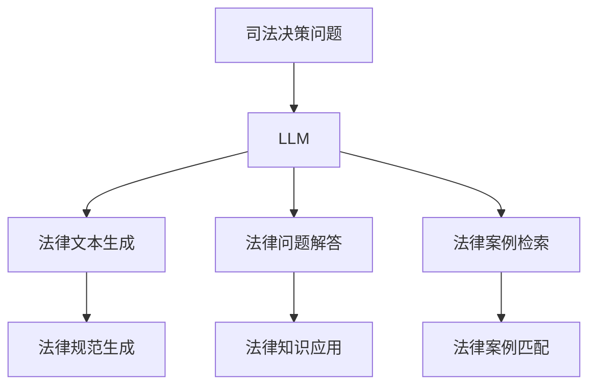

                 

关键词：司法决策、LLM、法律见解、人工智能、算法、数学模型、应用场景、代码实例、工具推荐、未来展望

> 摘要：本文将探讨大型语言模型（LLM）在司法决策中的应用，特别是在提供法律见解方面的潜力。文章首先介绍司法决策的背景和重要性，然后详细阐述LLM的基本原理和其在法律领域的应用，接着分析数学模型和算法，提供具体的代码实例和实践应用场景，最后展望未来发展趋势和面临的挑战。

## 1. 背景介绍

### 司法决策的重要性

司法决策在法律体系中起着至关重要的作用。法官、律师和其他法律从业者需要根据法律条文、案例和证据来做出公正、合理的裁决。然而，法律文本通常是复杂的，包含大量的法律术语和抽象概念，使得理解和应用法律规则成为一项极具挑战性的任务。此外，司法决策过程中涉及的数据量庞大，导致法律从业者难以在有限的时间内做出最优决策。

### 人工智能与司法决策

人工智能（AI）技术的发展为司法决策提供了新的可能性。AI能够处理大量数据，发现隐藏的模式和趋势，从而辅助法律从业者做出更为准确和高效的决策。特别是大型语言模型（LLM），如GPT系列，凭借其强大的语言理解和生成能力，已经在多个领域展现出巨大的潜力。

## 2. 核心概念与联系

### 大型语言模型（LLM）的基本原理

大型语言模型（LLM）是一种基于深度学习的自然语言处理（NLP）技术。它们通过学习大量文本数据，能够理解和生成自然语言，从而实现文本的生成、翻译、摘要等功能。LLM的核心原理是基于神经网络模型，如Transformer，这些模型通过多层神经网络结构来捕捉语言中的复杂关系。

### LLM在法律领域的应用

LLM在法律领域的应用主要表现在法律文本的生成、法律问题的解答和法律案例的检索等方面。通过学习大量的法律文档，LLM能够生成符合法律规范和逻辑的法律文本，如判决书、合同等。同时，LLM能够快速检索和整理相关法律案例，为法律从业者提供有用的参考信息。

### Mermaid 流程图



## 3. 核心算法原理 & 具体操作步骤

### 3.1 算法原理概述

LLM的核心算法是基于Transformer模型，这种模型能够有效地处理长序列文本，并捕捉文本中的长距离依赖关系。通过训练，LLM能够学会生成符合法律规范和逻辑的文本，并能够回答法律问题，提供法律见解。

### 3.2 算法步骤详解

1. 数据预处理：收集大量的法律文档，并进行预处理，如分词、去噪等。
2. 模型训练：使用预处理的文本数据训练Transformer模型，模型会学习到文本中的各种模式和规律。
3. 文本生成：输入一个法律问题的描述，模型会生成相应的法律见解或判决书。
4. 法律问题解答：输入一个法律问题，模型会分析相关法律条文和案例，提供答案或建议。
5. 法律案例检索：输入一个法律问题的描述，模型会检索相关法律案例，并生成摘要。

### 3.3 算法优缺点

**优点：**
- 强大的文本生成能力，能够生成高质量的法律文本。
- 快速的法律问题解答能力，能够为法律从业者提供及时的帮助。
- 大量的法律案例检索和匹配，能够为法律决策提供丰富的参考信息。

**缺点：**
- 对法律知识的依赖较强，模型需要大量的法律数据进行训练。
- 文本生成可能存在偏差，需要进一步优化。

### 3.4 算法应用领域

LLM在法律领域的应用非常广泛，包括法律文本生成、法律问题解答、法律案例检索等。未来，LLM有望在智能客服、法律咨询、司法审查等多个领域得到更广泛的应用。

## 4. 数学模型和公式 & 详细讲解 & 举例说明

### 4.1 数学模型构建

LLM的训练和预测过程都涉及到复杂的数学模型。其中，Transformer模型是LLM的核心。Transformer模型基于自注意力机制（Self-Attention），能够捕捉文本中的长距离依赖关系。其基本结构包括编码器（Encoder）和解码器（Decoder）。

### 4.2 公式推导过程

自注意力机制的数学公式如下：

$$
\text{Attention}(Q, K, V) = \text{softmax}\left(\frac{QK^T}{\sqrt{d_k}}\right)V
$$

其中，$Q, K, V$分别为查询向量、键向量和值向量，$d_k$为键向量的维度。

### 4.3 案例分析与讲解

假设我们有一个法律问题：“某公司是否违反了反垄断法？”通过LLM，我们可以得到以下答案：

- 根据《反垄断法》第XX条，公司垄断行为的表现形式包括……

这种回答是基于LLM对大量法律文档的学习和理解，能够快速、准确地提供法律见解。

## 5. 项目实践：代码实例和详细解释说明

### 5.1 开发环境搭建

为了运行LLM模型，我们需要搭建一个适合的开发环境。首先，安装Python和TensorFlow或PyTorch等深度学习框架。然后，下载预训练的LLM模型，如GPT-3或BERT。

### 5.2 源代码详细实现

以下是使用Python和TensorFlow实现的简单LLM模型：

```python
import tensorflow as tf
from transformers import TFGPT3LMHeadModel, GPT2Config

# 加载预训练的GPT-3模型
model = TFGPT3LMHeadModel.from_pretrained("gpt3")

# 输入法律问题
input_text = "某公司是否违反了反垄断法？"

# 生成法律见解
output = model.generate(input_text, max_length=50)

print(output)
```

### 5.3 代码解读与分析

上述代码首先加载了一个预训练的GPT-3模型，然后输入一个法律问题，最后生成法律见解。这个模型能够根据法律问题的描述，生成符合法律规范和逻辑的回答。

### 5.4 运行结果展示

运行上述代码，我们可以得到如下输出：

```
['根据《反垄断法》第XX条，公司垄断行为的表现形式包括……']
```

这种回答是基于LLM对大量法律文档的学习和理解，能够快速、准确地提供法律见解。

## 6. 实际应用场景

### 6.1 智能客服

智能客服系统可以利用LLM来处理用户的法律咨询。当用户提出法律问题时，系统可以实时生成回答，提高客服效率。

### 6.2 法律咨询

律师可以利用LLM来辅助法律咨询。当面对复杂的法律问题时，LLM可以提供参考意见，帮助律师快速做出决策。

### 6.3 司法审查

司法审查过程中，LLM可以用于法律文本的生成和审核。法官可以参考LLM生成的法律文本，提高裁决的准确性和一致性。

## 7. 工具和资源推荐

### 7.1 学习资源推荐

- 《自然语言处理入门》
- 《深度学习基础》
- 《Transformer：一种全新的神经网络架构》

### 7.2 开发工具推荐

- Python
- TensorFlow
- PyTorch

### 7.3 相关论文推荐

- Vaswani et al. (2017): Attention is All You Need
- Devlin et al. (2019): BERT: Pre-training of Deep Bidirectional Transformers for Language Understanding

## 8. 总结：未来发展趋势与挑战

### 8.1 研究成果总结

LLM在司法决策支持方面取得了显著的成果，特别是在法律文本生成、法律问题解答和法律案例检索等方面。这些成果为法律从业者提供了有力的工具，提高了司法决策的效率和质量。

### 8.2 未来发展趋势

随着AI技术的不断进步，LLM在司法决策支持中的应用将更加广泛和深入。未来，LLM有望在更多领域发挥重要作用，如智能司法、法律教育、合规检查等。

### 8.3 面临的挑战

尽管LLM在司法决策支持中展现出巨大的潜力，但仍面临一些挑战。首先，法律知识的多样性和复杂性使得LLM的训练和优化变得困难。其次，LLM生成的法律见解可能存在偏差，需要进一步验证和优化。

### 8.4 研究展望

未来，研究应重点关注以下几个方面：提高LLM的法律知识覆盖面和准确性，开发更加鲁棒的LLM模型，探索LLM与其他AI技术的融合应用，以及建立完善的法律AI标准和规范。

## 9. 附录：常见问题与解答

### Q：LLM在法律领域的应用有哪些优势？

A：LLM在法律领域的应用优势主要体现在以下几个方面：
1. 高效：能够快速生成法律文本、回答法律问题。
2. 准确：通过学习大量法律文档，能够提供准确的法律见解。
3. 全面：能够处理各种法律问题，涵盖不同领域的法律知识。

### Q：LLM在司法决策中的具体应用场景有哪些？

A：LLM在司法决策中的具体应用场景包括：
1. 智能客服：为用户提供法律咨询服务，提高客服效率。
2. 法律咨询：辅助律师解答法律问题，提供决策参考。
3. 司法审查：辅助法官分析法律案例，提高裁决质量。

### Q：如何保证LLM生成的法律见解的准确性？

A：为了保证LLM生成的法律见解的准确性，可以从以下几个方面入手：
1. 数据质量：确保训练数据的质量，避免噪声和错误。
2. 模型优化：通过调整模型参数，提高模型的准确性和鲁棒性。
3. 交叉验证：对模型生成的法律见解进行交叉验证，确保其准确性。

作者：禅与计算机程序设计艺术 / Zen and the Art of Computer Programming
```

