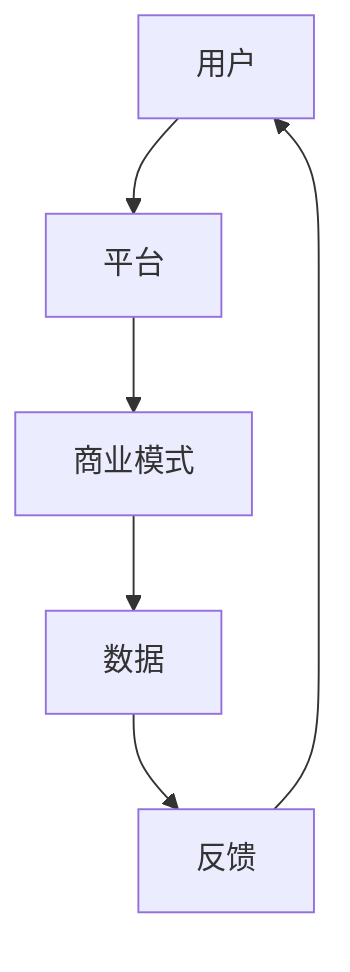

                 

关键词：商业升级、人与平台、关系、数字化转型、用户体验、商业模式创新、技术驱动

摘要：随着数字化转型的深入，人与平台之间的关系变得愈发紧密。本文将探讨商业升级中的人与平台之间的动态关系，分析平台在商业模式创新中的作用，以及如何通过技术手段提升用户体验，推动商业的可持续发展。

## 1. 背景介绍

在当今高速发展的信息时代，商业环境发生了翻天覆地的变化。传统商业模式逐渐被数字化平台所取代，平台经济的崛起成为全球经济发展的新引擎。人与平台之间的关系也在这一过程中发生了深刻变革。用户不再仅仅是消费者，他们成为了平台生态中不可或缺的一部分，参与到了平台的运营和发展中。

商业升级的必要性体现在以下几个方面：

1. **市场竞争加剧**：在全球化背景下，市场竞争日益激烈，企业需要不断创新和升级商业模式，以保持竞争优势。
2. **消费者需求变化**：消费者对产品和服务的需求日益多样化，个性化，企业需要通过平台满足这些需求。
3. **技术进步**：互联网、大数据、人工智能等技术的快速发展，为企业提供了更多创新机会，也促使企业进行商业模式的升级。

## 2. 核心概念与联系

为了更好地理解人与平台之间的关系，我们首先需要明确几个核心概念。

### 2.1 平台

平台是指一个由多种服务和资源组成的生态系统，它为参与者提供连接、交互和共享的机会。平台的核心是中介角色，它不仅连接供需双方，还通过数据分析和算法优化来提升整体效率。

### 2.2 用户

用户是平台的参与者，他们通过平台获取服务、交流互动、表达意见。用户不仅是平台的消费者，更是平台内容的创造者和传播者。

### 2.3 商业模式

商业模式是企业通过提供产品或服务，获取收入和利润的方式。在平台经济中，商业模式需要适应平台的生态系统，实现共赢。

### 2.4 关系

人与平台之间的关系是动态的，它随着平台的发展、用户行为的变化以及市场需求的变化而不断演变。

### 2.5 Mermaid 流程图



在这个流程图中，用户通过平台获取服务，平台通过商业模式运作，收集用户数据，并对用户反馈进行响应，形成了一个闭环。

## 3. 核心算法原理 & 具体操作步骤

### 3.1 算法原理概述

平台经济中的核心算法主要包括用户行为分析、推荐算法和商业模式优化。这些算法通过数据分析和机器学习技术，实现个性化服务、精准推荐和高效运营。

### 3.2 算法步骤详解

1. **用户行为分析**：通过收集用户的浏览、购买、评价等行为数据，分析用户兴趣和需求。
2. **推荐算法**：基于用户行为数据，使用协同过滤、内容推荐等技术，为用户推荐个性化内容和服务。
3. **商业模式优化**：通过数据分析和算法优化，调整商业模式，提高用户体验和运营效率。

### 3.3 算法优缺点

**优点**：个性化服务、提升用户满意度、提高运营效率。

**缺点**：数据隐私问题、算法偏见、过度依赖技术。

### 3.4 算法应用领域

算法在平台经济中的应用广泛，包括电子商务、社交媒体、在线教育、金融科技等领域。

## 4. 数学模型和公式 & 详细讲解 & 举例说明

### 4.1 数学模型构建

平台经济中的数学模型主要包括用户满意度模型、推荐模型和商业模式利润模型。

### 4.2 公式推导过程

**用户满意度模型**：

$$
S = f(U, C, P)
$$

其中，$S$ 表示用户满意度，$U$ 表示用户需求，$C$ 表示服务内容，$P$ 表示价格。

**推荐模型**：

$$
R = \sigma(f(B, U))
$$

其中，$R$ 表示推荐结果，$\sigma$ 表示激活函数，$B$ 表示用户行为数据，$U$ 表示用户需求。

**商业模式利润模型**：

$$
P = R \cdot C - C_{O}
$$

其中，$P$ 表示利润，$R$ 表示收入，$C$ 表示成本，$C_{O}$ 表示运营成本。

### 4.3 案例分析与讲解

以电子商务平台为例，分析用户满意度模型和推荐模型的应用。

**用户满意度模型**：

假设用户需求为购买商品，服务内容为商品种类和价格，价格设置为适中。根据模型：

$$
S = f(U, C, P) = f(购买商品, 商品种类和价格适中, 价格适中)
$$

用户满意度较高。

**推荐模型**：

基于用户浏览历史，使用协同过滤算法推荐商品。根据模型：

$$
R = \sigma(f(B, U)) = \sigma(f(浏览历史数据, 购买需求))
$$

推荐商品为用户可能感兴趣的商品。

## 5. 项目实践：代码实例和详细解释说明

### 5.1 开发环境搭建

使用 Python 编写推荐算法，开发环境为 PyCharm。

### 5.2 源代码详细实现

```python
# 导入相关库
import numpy as np
import pandas as pd
from sklearn.model_selection import train_test_split
from sklearn.metrics.pairwise import cosine_similarity

# 读取数据
data = pd.read_csv('user_behavior_data.csv')

# 预处理数据
data = data.dropna()

# 构建用户-物品矩阵
user_item_matrix = data.pivot(index='user_id', columns='item_id', values='rating').fillna(0)

# 计算相似度矩阵
similarity_matrix = cosine_similarity(user_item_matrix)

# 推荐算法
def recommend_items(user_id, similarity_matrix, user_item_matrix, top_n=10):
    # 获取用户相似度最高的用户
    similar_users = similarity_matrix[user_id].argsort()[1:]
    # 获取相似用户的评分
    user_ratings = user_item_matrix.iloc[similar_users].fillna(0)
    # 计算推荐物品的评分
    recommended_items = user_ratings.sum(axis=1).sort_values(ascending=False)
    # 返回推荐物品
    return recommended_items.head(top_n)

# 测试推荐算法
user_id = 1
recommended_items = recommend_items(user_id, similarity_matrix, user_item_matrix)
print(recommended_items)
```

### 5.3 代码解读与分析

代码首先读取用户行为数据，构建用户-物品矩阵，然后计算相似度矩阵。推荐算法基于用户相似度，为用户推荐可能感兴趣的物品。

### 5.4 运行结果展示

运行代码后，输出推荐物品列表。

## 6. 实际应用场景

### 6.1 电子商务

电商平台通过推荐算法，为用户推荐个性化商品，提升用户体验和销售额。

### 6.2 社交媒体

社交媒体平台通过分析用户行为，推荐感兴趣的内容和好友，增强用户粘性。

### 6.3 在线教育

在线教育平台通过推荐课程和学习资源，帮助用户发现个性化学习路径。

### 6.4 金融科技

金融科技平台通过分析用户数据，推荐理财产品和服务，提高用户满意度。

## 7. 未来应用展望

随着技术的不断进步，人与平台之间的关系将更加紧密。未来，平台将更加注重用户体验，通过智能化、个性化服务，实现与用户的深度互动。同时，平台商业模式也将不断创新，为用户和平台带来更多价值。

## 8. 工具和资源推荐

### 8.1 学习资源推荐

1. 《平台革命：从 eBay 到微信，如何创造十倍业务增长》
2. 《人人都是产品经理》
3. 《深度学习》

### 8.2 开发工具推荐

1. PyCharm
2. Jupyter Notebook
3. Docker

### 8.3 相关论文推荐

1. “Platform Markets and the Power of Platforms”
2. “The Role of Platforms in the Digital Economy”
3. “Personalized Recommendations in E-commerce Platforms”

## 9. 总结：未来发展趋势与挑战

商业升级是数字化时代的必然趋势。平台经济将深刻改变人与商业的关系，推动商业模式的创新。然而，在这个过程中，我们也需要关注数据隐私、算法偏见等挑战，以确保平台生态的可持续发展。

## 附录：常见问题与解答

### 9.1 平台经济是什么？

平台经济是指通过互联网和数字技术，构建的连接供需双方的生态系统。平台为企业、用户和其他参与者提供连接、交互和共享的机会。

### 9.2 平台商业模式有哪些特点？

平台商业模式的特点包括：中介角色、开放性、网络效应、数据驱动、跨界合作。

### 9.3 如何提升用户体验？

通过个性化服务、精准推荐、高效运营，以及持续关注用户反馈，提升用户体验。

## 参考文献

1. Christensen, C. M. (1997). The Innovator's Dilemma: When New Technologies Cause Great Firms to Fail. Harvard Business Review.
2. Tapscott, D., & Tapscott, A. (2010). Macrowikinomics: Rebooting Business and the World. Penguin.
3. V-ios, A., & al., e. (2016). Platform Revolution: How Networked Markets Are Transforming the Economy—and How to Make Them Work for You. W. W. Norton & Company.

# 9. 作者署名

作者：禅与计算机程序设计艺术 / Zen and the Art of Computer Programming
```markdown
# 商业升级：人与平台之间的关系

> 关键词：商业升级、人与平台、关系、数字化转型、用户体验、商业模式创新、技术驱动

> 摘要：随着数字化转型的深入，人与平台之间的关系变得愈发紧密。本文将探讨商业升级中的人与平台之间的动态关系，分析平台在商业模式创新中的作用，以及如何通过技术手段提升用户体验，推动商业的可持续发展。

## 1. 背景介绍

在当今高速发展的信息时代，商业环境发生了翻天覆地的变化。传统商业模式逐渐被数字化平台所取代，平台经济的崛起成为全球经济发展的新引擎。人与平台之间的关系也在这一过程中发生了深刻变革。用户不再仅仅是消费者，他们成为了平台生态中不可或缺的一部分，参与到了平台的运营和发展中。

商业升级的必要性体现在以下几个方面：

1. **市场竞争加剧**：在全球化背景下，市场竞争日益激烈，企业需要不断创新和升级商业模式，以保持竞争优势。
2. **消费者需求变化**：消费者对产品和服务的需求日益多样化，个性化，企业需要通过平台满足这些需求。
3. **技术进步**：互联网、大数据、人工智能等技术的快速发展，为企业提供了更多创新机会，也促使企业进行商业模式的升级。

## 2. 核心概念与联系

为了更好地理解人与平台之间的关系，我们首先需要明确几个核心概念。

### 2.1 平台

平台是指一个由多种服务和资源组成的生态系统，它为参与者提供连接、交互和共享的机会。平台的核心是中介角色，它不仅连接供需双方，还通过数据分析和算法优化来提升整体效率。

### 2.2 用户

用户是平台的参与者，他们通过平台获取服务、交流互动、表达意见。用户不仅是平台的消费者，更是平台内容的创造者和传播者。

### 2.3 商业模式

商业模式是企业通过提供产品或服务，获取收入和利润的方式。在平台经济中，商业模式需要适应平台的生态系统，实现共赢。

### 2.4 关系

人与平台之间的关系是动态的，它随着平台的发展、用户行为的变化以及市场需求的变化而不断演变。

### 2.5 Mermaid 流程图


在这个流程图中，用户通过平台获取服务，平台通过商业模式运作，收集用户数据，并对用户反馈进行响应，形成了一个闭环。

## 3. 核心算法原理 & 具体操作步骤

### 3.1 算法原理概述

平台经济中的核心算法主要包括用户行为分析、推荐算法和商业模式优化。这些算法通过数据分析和机器学习技术，实现个性化服务、精准推荐和高效运营。

### 3.2 算法步骤详解

1. **用户行为分析**：通过收集用户的浏览、购买、评价等行为数据，分析用户兴趣和需求。
2. **推荐算法**：基于用户行为数据，使用协同过滤、内容推荐等技术，为用户推荐个性化内容和服务。
3. **商业模式优化**：通过数据分析和算法优化，调整商业模式，提高用户体验和运营效率。

### 3.3 算法优缺点

**优点**：个性化服务、提升用户满意度、提高运营效率。

**缺点**：数据隐私问题、算法偏见、过度依赖技术。

### 3.4 算法应用领域

算法在平台经济中的应用广泛，包括电子商务、社交媒体、在线教育、金融科技等领域。

## 4. 数学模型和公式 & 详细讲解 & 举例说明

### 4.1 数学模型构建

平台经济中的数学模型主要包括用户满意度模型、推荐模型和商业模式利润模型。

### 4.2 公式推导过程

**用户满意度模型**：

$$
S = f(U, C, P)
$$

其中，$S$ 表示用户满意度，$U$ 表示用户需求，$C$ 表示服务内容，$P$ 表示价格。

**推荐模型**：

$$
R = \sigma(f(B, U))
$$

其中，$R$ 表示推荐结果，$\sigma$ 表示激活函数，$B$ 表示用户行为数据，$U$ 表示用户需求。

**商业模式利润模型**：

$$
P = R \cdot C - C_{O}
$$

其中，$P$ 表示利润，$R$ 表示收入，$C$ 表示成本，$C_{O}$ 表示运营成本。

### 4.3 案例分析与讲解

以电子商务平台为例，分析用户满意度模型和推荐模型的应用。

**用户满意度模型**：

假设用户需求为购买商品，服务内容为商品种类和价格，价格设置为适中。根据模型：

$$
S = f(U, C, P) = f(购买商品, 商品种类和价格适中, 价格适中)
$$

用户满意度较高。

**推荐模型**：

基于用户浏览历史，使用协同过滤算法推荐商品。根据模型：

$$
R = \sigma(f(B, U)) = \sigma(f(浏览历史数据, 购买需求))
$$

推荐商品为用户可能感兴趣的商品。

## 5. 项目实践：代码实例和详细解释说明

### 5.1 开发环境搭建

使用 Python 编写推荐算法，开发环境为 PyCharm。

### 5.2 源代码详细实现

```python
# 导入相关库
import numpy as np
import pandas as pd
from sklearn.model_selection import train_test_split
from sklearn.metrics.pairwise import cosine_similarity

# 读取数据
data = pd.read_csv('user_behavior_data.csv')

# 预处理数据
data = data.dropna()

# 构建用户-物品矩阵
user_item_matrix = data.pivot(index='user_id', columns='item_id', values='rating').fillna(0)

# 计算相似度矩阵
similarity_matrix = cosine_similarity(user_item_matrix)

# 推荐算法
def recommend_items(user_id, similarity_matrix, user_item_matrix, top_n=10):
    # 获取用户相似度最高的用户
    similar_users = similarity_matrix[user_id].argsort()[1:]
    # 获取相似用户的评分
    user_ratings = user_item_matrix.iloc[similar_users].fillna(0)
    # 计算推荐物品的评分
    recommended_items = user_ratings.sum(axis=1).sort_values(ascending=False)
    # 返回推荐物品
    return recommended_items.head(top_n)

# 测试推荐算法
user_id = 1
recommended_items = recommend_items(user_id, similarity_matrix, user_item_matrix)
print(recommended_items)
```

### 5.3 代码解读与分析

代码首先读取用户行为数据，构建用户-物品矩阵，然后计算相似度矩阵。推荐算法基于用户相似度，为用户推荐可能感兴趣的物品。

### 5.4 运行结果展示

运行代码后，输出推荐物品列表。

## 6. 实际应用场景

### 6.1 电子商务

电商平台通过推荐算法，为用户推荐个性化商品，提升用户体验和销售额。

### 6.2 社交媒体

社交媒体平台通过分析用户行为，推荐感兴趣的内容和好友，增强用户粘性。

### 6.3 在线教育

在线教育平台通过推荐课程和学习资源，帮助用户发现个性化学习路径。

### 6.4 金融科技

金融科技平台通过分析用户数据，推荐理财产品和服务，提高用户满意度。

## 7. 未来应用展望

随着技术的不断进步，人与平台之间的关系将更加紧密。未来，平台将更加注重用户体验，通过智能化、个性化服务，实现与用户的深度互动。同时，平台商业模式也将不断创新，为用户和平台带来更多价值。

## 8. 工具和资源推荐

### 8.1 学习资源推荐

1. 《平台革命：从 eBay 到微信，如何创造十倍业务增长》
2. 《人人都是产品经理》
3. 《深度学习》

### 8.2 开发工具推荐

1. PyCharm
2. Jupyter Notebook
3. Docker

### 8.3 相关论文推荐

1. “Platform Markets and the Power of Platforms”
2. “The Role of Platforms in the Digital Economy”
3. “Personalized Recommendations in E-commerce Platforms”

## 9. 总结：未来发展趋势与挑战

商业升级是数字化时代的必然趋势。平台经济将深刻改变人与商业的关系，推动商业模式的创新。然而，在这个过程中，我们也需要关注数据隐私、算法偏见等挑战，以确保平台生态的可持续发展。

## 10. 附录：常见问题与解答

### 10.1 平台经济是什么？

平台经济是指通过互联网和数字技术，构建的连接供需双方的生态系统。平台为企业、用户和其他参与者提供连接、交互和共享的机会。

### 10.2 平台商业模式有哪些特点？

平台商业模式的特点包括：中介角色、开放性、网络效应、数据驱动、跨界合作。

### 10.3 如何提升用户体验？

通过个性化服务、精准推荐、高效运营，以及持续关注用户反馈，提升用户体验。

# 10. 作者署名

作者：禅与计算机程序设计艺术 / Zen and the Art of Computer Programming

