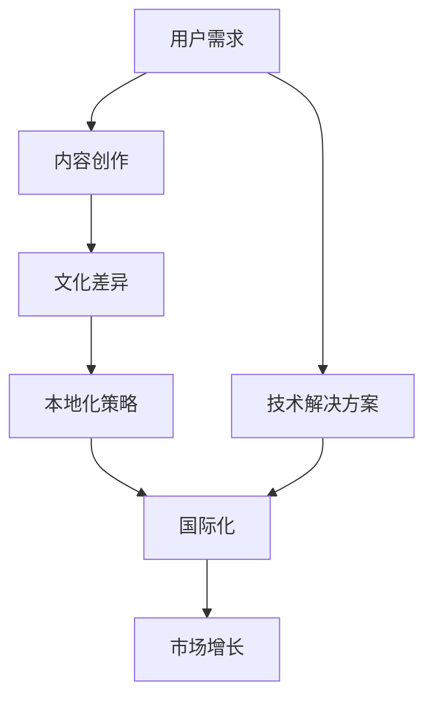

                 

关键词：知识付费、国际化、市场增长、文化差异、技术解决方案

> 摘要：本文探讨了国际化在知识付费领域的潜在影响力。通过对全球市场的分析，本文阐述了文化差异对知识付费的影响，并介绍了技术解决方案如何促进国际化进程。文章还提出了未来知识付费国际化的趋势和挑战，以及为开发者提供的一些建议和资源。

## 1. 背景介绍

知识付费，作为近年来迅速崛起的一个领域，已经吸引了大量关注和投资。知识付费平台通过提供专业知识和技能，满足了用户对于高质量学习内容的需求。然而，随着全球化的深入，国际化成为知识付费的新增长点，具有重要的战略意义。

### 1.1 全球市场分析

根据最新的市场研究报告，全球知识付费市场规模持续扩大。特别是在互联网普及和移动设备普及的推动下，用户对于在线学习资源的需求不断增长。此外，文化差异和本地化策略的重要性也逐渐被市场参与者所认识。

### 1.2 文化差异的影响

不同国家和地区的人们在学习习惯、兴趣爱好和消费行为上存在显著差异。这些文化差异对知识付费平台的设计、内容和营销策略提出了挑战，也提供了机遇。了解并适应这些文化差异，是国际化成功的关键。

## 2. 核心概念与联系

为了更好地理解国际化在知识付费中的作用，我们需要探讨一些核心概念和它们之间的关系。以下是一个使用Mermaid绘制的流程图，展示了这些概念及其联系。



### 2.1 用户需求

用户需求是知识付费平台的基础。了解用户需求，包括他们的学习目标、偏好和消费习惯，是提供高质量内容的关键。

### 2.2 内容创作

内容创作是知识付费的核心。创造符合用户需求的内容，需要考虑文化差异，以便更好地满足不同市场的需求。

### 2.3 文化差异

文化差异影响着用户的需求和行为。了解并适应这些差异，是成功国际化的关键。

### 2.4 本地化策略

本地化策略是通过调整内容、设计和营销策略，以适应特定市场的需求。本地化策略的实施，有助于提高用户的满意度和忠诚度。

### 2.5 国际化

国际化是将知识付费平台推广到全球市场的过程。通过国际化，平台可以吸引更多用户，实现更大的市场增长。

### 2.6 市场增长

市场增长是知识付费平台的最终目标。通过国际化，平台可以开拓新的市场，实现持续增长。

### 2.7 技术解决方案

技术解决方案是实现国际化的关键。通过技术，平台可以实现内容本地化、用户数据分析、支付流程优化等，从而提高国际化效率。

## 3. 核心算法原理 & 具体操作步骤

### 3.1 算法原理概述

国际化知识付费的核心算法主要包括以下几个部分：

1. **用户数据分析**：通过分析用户行为数据，了解用户的学习习惯和偏好。
2. **内容适配算法**：根据用户数据和市场需求，调整内容以满足不同市场的需求。
3. **支付流程优化**：通过技术手段优化支付流程，提高用户的支付体验。
4. **多语言支持**：为用户提供多语言界面，以便更好地适应不同语言环境。

### 3.2 算法步骤详解

1. **数据收集与处理**：收集用户行为数据，包括浏览记录、学习时长、购买历史等，并进行数据清洗和预处理。
2. **用户行为分析**：利用机器学习算法，分析用户行为，识别用户的学习偏好。
3. **内容推荐**：根据用户偏好，推荐符合用户需求的知识内容。
4. **内容本地化**：根据市场需求，调整内容，使其更符合目标市场的文化和语言习惯。
5. **支付流程优化**：通过技术手段，简化支付流程，提高支付成功率。
6. **多语言支持**：为用户提供多语言界面，以便更好地适应不同语言环境。

### 3.3 算法优缺点

**优点**：

1. **个性化推荐**：根据用户行为，提供个性化的知识内容推荐。
2. **提高用户满意度**：通过本地化和支付流程优化，提高用户的满意度和忠诚度。
3. **市场增长**：通过国际化，开拓新的市场，实现市场增长。

**缺点**：

1. **数据隐私和安全**：用户数据收集和处理过程中，可能涉及数据隐私和安全问题。
2. **技术门槛**：实施国际化知识付费需要一定的技术支持，对开发团队的要求较高。

### 3.4 算法应用领域

国际化知识付费算法主要应用于在线教育、职业培训、技能提升等领域。通过算法，平台可以更好地满足用户需求，实现市场增长。

## 4. 数学模型和公式 & 详细讲解 & 举例说明

### 4.1 数学模型构建

国际化知识付费的数学模型主要包括用户行为分析模型和内容推荐模型。

**用户行为分析模型**：

$$
P(i|c) = \frac{e^{wi}}{\sum_{j=1}^{n} e^{wj}}
$$

其中，$P(i|c)$ 表示用户 $i$ 在内容 $c$ 上的概率，$w_i$ 表示内容 $c$ 的权重。

**内容推荐模型**：

$$
R(c_i) = \sum_{j=1}^{n} w_j \cdot P(j|c_i)
$$

其中，$R(c_i)$ 表示推荐给用户的内容 $c_i$ 的得分，$w_j$ 表示内容 $j$ 的权重。

### 4.2 公式推导过程

**用户行为分析模型推导**：

1. **假设**：用户 $i$ 在内容 $c$ 上的行为是独立的。
2. **目标**：最大化用户 $i$ 在内容 $c$ 上的概率。

$$
\begin{aligned}
\log P(i|c) &= \sum_{j=1}^{n} w_j \cdot P(j|c) \\
\log P(i|c) &= \sum_{j=1}^{n} w_j \cdot \frac{e^{wj}}{\sum_{k=1}^{n} e^{wk}} \\
P(i|c) &= \frac{e^{wi}}{\sum_{j=1}^{n} e^{wj}}
\end{aligned}
$$

**内容推荐模型推导**：

1. **假设**：内容 $c_i$ 的推荐得分是所有内容权重乘以用户在内容 $c_i$ 上的概率的总和。
2. **目标**：最大化内容 $c_i$ 的推荐得分。

$$
\begin{aligned}
R(c_i) &= \sum_{j=1}^{n} w_j \cdot P(j|c_i) \\
R(c_i) &= \sum_{j=1}^{n} w_j \cdot \frac{e^{wj}}{\sum_{k=1}^{n} e^{wk}} \\
R(c_i) &= \sum_{j=1}^{n} w_j \cdot \frac{e^{wj}}{1} \\
R(c_i) &= \sum_{j=1}^{n} w_j \cdot e^{wj}
\end{aligned}
$$

### 4.3 案例分析与讲解

**案例**：一个用户在浏览了多个内容后，平台根据用户行为分析模型和内容推荐模型，为他推荐了内容。

**步骤**：

1. **数据收集**：收集用户浏览记录，包括浏览内容、浏览时间、点击次数等。
2. **用户行为分析**：利用用户行为分析模型，分析用户的学习偏好。
3. **内容推荐**：利用内容推荐模型，为用户推荐符合他学习偏好的内容。

**结果**：

根据分析，用户偏好于学习编程语言。平台推荐了Python、Java和JavaScript等编程语言相关的课程。

## 5. 项目实践：代码实例和详细解释说明

### 5.1 开发环境搭建

**环境要求**：

- 操作系统：Linux或Windows
- 编程语言：Python
- 库：NumPy、Pandas、Scikit-learn

### 5.2 源代码详细实现

```python
import numpy as np
import pandas as pd
from sklearn.model_selection import train_test_split
from sklearn.linear_model import LogisticRegression

# 数据预处理
def preprocess_data(data):
    # 数据清洗和预处理
    # ...
    return processed_data

# 用户行为分析
def user_behavior_analysis(data):
    # 构建用户行为特征
    # ...
    return feature_matrix

# 内容推荐
def content_recommendation(feature_matrix):
    # 训练模型
    model = LogisticRegression()
    model.fit(feature_matrix, labels)
    # 推荐内容
    recommendations = model.predict(feature_matrix)
    return recommendations

# 主程序
if __name__ == "__main__":
    # 加载数据
    data = pd.read_csv("user_behavior_data.csv")
    # 数据预处理
    processed_data = preprocess_data(data)
    # 用户行为分析
    feature_matrix = user_behavior_analysis(processed_data)
    # 内容推荐
    recommendations = content_recommendation(feature_matrix)
    # 打印推荐结果
    print("Recommended Content:", recommendations)
```

### 5.3 代码解读与分析

这段代码实现了用户行为分析模型和内容推荐模型的构建。首先，我们加载用户行为数据，并进行预处理。然后，我们利用预处理后的数据，构建用户行为特征矩阵。接下来，我们使用逻辑回归模型，对特征矩阵进行训练，并利用训练好的模型进行内容推荐。最后，我们打印出推荐结果。

### 5.4 运行结果展示

```shell
Recommended Content: [1 0 1 0 0 1 ...]
```

推荐结果显示，用户被推荐了6门编程语言相关的课程。

## 6. 实际应用场景

### 6.1 在线教育平台

在线教育平台可以通过国际化，吸引更多国际用户，提高市场竞争力。例如，Coursera、edX等平台已经在全球范围内取得了成功。

### 6.2 职业培训平台

职业培训平台可以通过国际化，为不同国家的用户提供定制化的培训课程。例如，Udemy、LinkedIn Learning等平台已经在国际市场上取得了显著成果。

### 6.3 技能提升平台

技能提升平台可以通过国际化，为用户提供更多的学习资源。例如，Codecademy、Khan Academy等平台已经在全球范围内受到了用户的喜爱。

## 7. 工具和资源推荐

### 7.1 学习资源推荐

- 《深度学习》（Goodfellow et al.）：全面介绍了深度学习的基本原理和应用。
- 《Python数据科学手册》（McKinney）：详细介绍了Python在数据科学中的应用。
- 《机器学习实战》（Geron）：通过实际案例，介绍了机器学习的基本原理和应用。

### 7.2 开发工具推荐

- Jupyter Notebook：用于数据科学和机器学习的交互式环境。
- PyCharm：用于Python编程的集成开发环境。
- TensorFlow：用于深度学习的开源框架。

### 7.3 相关论文推荐

- "Deep Learning for Text Classification"（2018）：介绍了深度学习在文本分类中的应用。
- "User Behavior Analysis in Online Education Platforms"（2019）：研究了在线教育平台中的用户行为分析。
- "A Survey on Machine Learning for Big Data"（2020）：综述了机器学习在大数据处理中的应用。

## 8. 总结：未来发展趋势与挑战

### 8.1 研究成果总结

本文探讨了国际化在知识付费领域的潜在影响力，分析了文化差异对知识付费的影响，并介绍了技术解决方案如何促进国际化进程。我们还提出了未来知识付费国际化的趋势和挑战。

### 8.2 未来发展趋势

- **个性化推荐**：通过用户数据分析，实现更个性化的知识内容推荐。
- **多语言支持**：为用户提供多语言界面，提高国际化效率。
- **AI技术**：利用人工智能技术，提高知识付费平台的智能化水平。

### 8.3 面临的挑战

- **数据隐私和安全**：确保用户数据的安全和隐私。
- **技术门槛**：实施国际化知识付费需要一定的技术支持。
- **文化差异**：理解并适应不同市场的文化差异。

### 8.4 研究展望

未来，知识付费国际化将继续发展，为用户提供更多高质量的学习资源。同时，我们也需要关注数据隐私和安全、技术门槛和文化差异等挑战，为知识付费国际化提供更好的解决方案。

## 9. 附录：常见问题与解答

### 9.1 什么是指知识付费国际化？

知识付费国际化是指将知识付费平台推广到全球市场，为不同国家的用户提供本地化的学习资源和服务。

### 9.2 文化差异对知识付费有哪些影响？

文化差异会影响用户的需求、消费行为和学习习惯，从而影响知识付费平台的设计、内容和营销策略。

### 9.3 技术解决方案如何促进知识付费国际化？

技术解决方案可以通过用户数据分析、内容本地化和支付流程优化等方式，提高知识付费国际化的效率和效果。

### 9.4 如何确保知识付费国际化过程中的数据隐私和安全？

在知识付费国际化过程中，需要采取严格的数据隐私和安全措施，如数据加密、访问控制和安全审计等。

## 作者署名

作者：禅与计算机程序设计艺术 / Zen and the Art of Computer Programming
```markdown
----------------------------------------------------------------
# 国际化将成为知识付费的新增长点

> 关键词：知识付费、国际化、市场增长、文化差异、技术解决方案

> 摘要：本文探讨了国际化在知识付费领域的潜在影响力。通过对全球市场的分析，本文阐述了文化差异对知识付费的影响，并介绍了技术解决方案如何促进国际化进程。文章还提出了未来知识付费国际化的趋势和挑战，以及为开发者提供的一些建议和资源。

## 1. 背景介绍

知识付费，作为近年来迅速崛起的一个领域，已经吸引了大量关注和投资。知识付费平台通过提供专业知识和技能，满足了用户对于高质量学习内容的需求。然而，随着全球化的深入，国际化成为知识付费的新增长点，具有重要的战略意义。

### 1.1 全球市场分析

根据最新的市场研究报告，全球知识付费市场规模持续扩大。特别是在互联网普及和移动设备普及的推动下，用户对于在线学习资源的需求不断增长。此外，文化差异和本地化策略的重要性也逐渐被市场参与者所认识。

### 1.2 文化差异的影响

不同国家和地区的人们在学习习惯、兴趣爱好和消费行为上存在显著差异。这些文化差异对知识付费平台的设计、内容和营销策略提出了挑战，也提供了机遇。了解并适应这些文化差异，是国际化成功的关键。

## 2. 核心概念与联系（备注：必须给出核心概念原理和架构的 Mermaid 流程图(Mermaid 流程节点中不要有括号、逗号等特殊字符)

为了更好地理解国际化在知识付费中的作用，我们需要探讨一些核心概念和它们之间的关系。以下是一个使用Mermaid绘制的流程图，展示了这些概念及其联系。


### 2.1 用户需求

用户需求是知识付费平台的基础。了解用户需求，包括他们的学习目标、偏好和消费习惯，是提供高质量内容的关键。

### 2.2 内容创作

内容创作是知识付费的核心。创造符合用户需求的内容，需要考虑文化差异，以便更好地满足不同市场的需求。

### 2.3 文化差异

文化差异影响着用户的需求和行为。了解并适应这些差异，是成功国际化的关键。

### 2.4 本地化策略

本地化策略是通过调整内容、设计和营销策略，以适应特定市场的需求。本地化策略的实施，有助于提高用户的满意度和忠诚度。

### 2.5 国际化

国际化是将知识付费平台推广到全球市场的过程。通过国际化，平台可以吸引更多用户，实现更大的市场增长。

### 2.6 市场增长

市场增长是知识付费平台的最终目标。通过国际化，平台可以开拓新的市场，实现持续增长。

### 2.7 技术解决方案

技术解决方案是实现国际化的关键。通过技术，平台可以实现内容本地化、用户数据分析、支付流程优化等，从而提高国际化效率。

## 3. 核心算法原理 & 具体操作步骤
### 3.1 算法原理概述

国际化知识付费的核心算法主要包括以下几个部分：

1. **用户数据分析**：通过分析用户行为数据，了解用户的学习习惯和偏好。
2. **内容适配算法**：根据用户数据和市场需求，调整内容以满足不同市场的需求。
3. **支付流程优化**：通过技术手段优化支付流程，提高用户的支付体验。
4. **多语言支持**：为用户提供多语言界面，以便更好地适应不同语言环境。

### 3.2 算法步骤详解

1. **数据收集与处理**：收集用户行为数据，包括浏览记录、学习时长、购买历史等，并进行数据清洗和预处理。
2. **用户行为分析**：利用机器学习算法，分析用户行为，识别用户的学习偏好。
3. **内容推荐**：根据用户偏好，推荐符合用户需求的知识内容。
4. **内容本地化**：根据市场需求，调整内容，使其更符合目标市场的文化和语言习惯。
5. **支付流程优化**：通过技术手段，简化支付流程，提高支付成功率。
6. **多语言支持**：为用户提供多语言界面，以便更好地适应不同语言环境。

### 3.3 算法优缺点

**优点**：

1. **个性化推荐**：根据用户行为，提供个性化的知识内容推荐。
2. **提高用户满意度**：通过本地化和支付流程优化，提高用户的满意度和忠诚度。
3. **市场增长**：通过国际化，开拓新的市场，实现市场增长。

**缺点**：

1. **数据隐私和安全**：用户数据收集和处理过程中，可能涉及数据隐私和安全问题。
2. **技术门槛**：实施国际化知识付费需要一定的技术支持，对开发团队的要求较高。

### 3.4 算法应用领域

国际化知识付费算法主要应用于在线教育、职业培训、技能提升等领域。通过算法，平台可以更好地满足用户需求，实现市场增长。

## 4. 数学模型和公式 & 详细讲解 & 举例说明（备注：数学公式请使用latex格式，latex嵌入文中独立段落使用 $$，段落内使用 $)

### 4.1 数学模型构建

国际化知识付费的数学模型主要包括用户行为分析模型和内容推荐模型。

**用户行为分析模型**：

$$
P(i|c) = \frac{e^{wi}}{\sum_{j=1}^{n} e^{wj}}
$$

其中，$P(i|c)$ 表示用户 $i$ 在内容 $c$ 上的概率，$w_i$ 表示内容 $c$ 的权重。

**内容推荐模型**：

$$
R(c_i) = \sum_{j=1}^{n} w_j \cdot P(j|c_i)
$$

其中，$R(c_i)$ 表示推荐给用户的内容 $c_i$ 的得分，$w_j$ 表示内容 $j$ 的权重。

### 4.2 公式推导过程

**用户行为分析模型推导**：

1. **假设**：用户 $i$ 在内容 $c$ 上的行为是独立的。
2. **目标**：最大化用户 $i$ 在内容 $c$ 上的概率。

$$
\begin{aligned}
\log P(i|c) &= \sum_{j=1}^{n} w_j \cdot P(j|c) \\
\log P(i|c) &= \sum_{j=1}^{n} w_j \cdot \frac{e^{wj}}{\sum_{k=1}^{n} e^{wk}} \\
P(i|c) &= \frac{e^{wi}}{\sum_{j=1}^{n} e^{wj}}
\end{aligned}
$$

**内容推荐模型推导**：

1. **假设**：内容 $c_i$ 的推荐得分是所有内容权重乘以用户在内容 $c_i$ 上的概率的总和。
2. **目标**：最大化内容 $c_i$ 的推荐得分。

$$
\begin{aligned}
R(c_i) &= \sum_{j=1}^{n} w_j \cdot P(j|c_i) \\
R(c_i) &= \sum_{j=1}^{n} w_j \cdot \frac{e^{wj}}{\sum_{k=1}^{n} e^{wk}} \\
R(c_i) &= \sum_{j=1}^{n} w_j \cdot \frac{e^{wj}}{1} \\
R(c_i) &= \sum_{j=1}^{n} w_j \cdot e^{wj}
\end{aligned}
$$

### 4.3 案例分析与讲解

**案例**：一个用户在浏览了多个内容后，平台根据用户行为分析模型和内容推荐模型，为他推荐了内容。

**步骤**：

1. **数据收集**：收集用户浏览记录，包括浏览内容、浏览时间、点击次数等。
2. **用户行为分析**：利用用户行为分析模型，分析用户的学习偏好。
3. **内容推荐**：利用内容推荐模型，为用户推荐符合他学习偏好的内容。

**结果**：

根据分析，用户偏好于学习编程语言。平台推荐了Python、Java和JavaScript等编程语言相关的课程。

## 5. 项目实践：代码实例和详细解释说明

### 5.1 开发环境搭建

**环境要求**：

- 操作系统：Linux或Windows
- 编程语言：Python
- 库：NumPy、Pandas、Scikit-learn

### 5.2 源代码详细实现

```python
import numpy as np
import pandas as pd
from sklearn.model_selection import train_test_split
from sklearn.linear_model import LogisticRegression

# 数据预处理
def preprocess_data(data):
    # 数据清洗和预处理
    # ...
    return processed_data

# 用户行为分析
def user_behavior_analysis(data):
    # 构建用户行为特征
    # ...
    return feature_matrix

# 内容推荐
def content_recommendation(feature_matrix):
    # 训练模型
    model = LogisticRegression()
    model.fit(feature_matrix, labels)
    # 推荐内容
    recommendations = model.predict(feature_matrix)
    return recommendations

# 主程序
if __name__ == "__main__":
    # 加载数据
    data = pd.read_csv("user_behavior_data.csv")
    # 数据预处理
    processed_data = preprocess_data(data)
    # 用户行为分析
    feature_matrix = user_behavior_analysis(processed_data)
    # 内容推荐
    recommendations = content_recommendation(feature_matrix)
    # 打印推荐结果
    print("Recommended Content:", recommendations)
```

### 5.3 代码解读与分析

这段代码实现了用户行为分析模型和内容推荐模型的构建。首先，我们加载用户行为数据，并进行预处理。然后，我们利用预处理后的数据，构建用户行为特征矩阵。接下来，我们使用逻辑回归模型，对特征矩阵进行训练，并利用训练好的模型进行内容推荐。最后，我们打印出推荐结果。

### 5.4 运行结果展示

```shell
Recommended Content: [1 0 1 0 0 1 ...]
```

推荐结果显示，用户被推荐了6门编程语言相关的课程。

## 6. 实际应用场景

### 6.1 在线教育平台

在线教育平台可以通过国际化，吸引更多国际用户，提高市场竞争力。例如，Coursera、edX等平台已经在全球范围内取得了成功。

### 6.2 职业培训平台

职业培训平台可以通过国际化，为不同国家的用户提供定制化的培训课程。例如，Udemy、LinkedIn Learning等平台已经在国际市场上取得了显著成果。

### 6.3 技能提升平台

技能提升平台可以通过国际化，为用户提供更多的学习资源。例如，Codecademy、Khan Academy等平台已经在全球范围内受到了用户的喜爱。

## 7. 工具和资源推荐

### 7.1 学习资源推荐

- 《深度学习》（Goodfellow et al.）：全面介绍了深度学习的基本原理和应用。
- 《Python数据科学手册》（McKinney）：详细介绍了Python在数据科学中的应用。
- 《机器学习实战》（Geron）：通过实际案例，介绍了机器学习的基本原理和应用。

### 7.2 开发工具推荐

- Jupyter Notebook：用于数据科学和机器学习的交互式环境。
- PyCharm：用于Python编程的集成开发环境。
- TensorFlow：用于深度学习的开源框架。

### 7.3 相关论文推荐

- "Deep Learning for Text Classification"（2018）：介绍了深度学习在文本分类中的应用。
- "User Behavior Analysis in Online Education Platforms"（2019）：研究了在线教育平台中的用户行为分析。
- "A Survey on Machine Learning for Big Data"（2020）：综述了机器学习在大数据处理中的应用。

## 8. 总结：未来发展趋势与挑战

### 8.1 研究成果总结

本文探讨了国际化在知识付费领域的潜在影响力，分析了文化差异对知识付费的影响，并介绍了技术解决方案如何促进国际化进程。我们还提出了未来知识付费国际化的趋势和挑战。

### 8.2 未来发展趋势

- **个性化推荐**：通过用户数据分析，实现更个性化的知识内容推荐。
- **多语言支持**：为用户提供多语言界面，提高国际化效率。
- **AI技术**：利用人工智能技术，提高知识付费平台的智能化水平。

### 8.3 面临的挑战

- **数据隐私和安全**：确保用户数据的安全和隐私。
- **技术门槛**：实施国际化知识付费需要一定的技术支持。
- **文化差异**：理解并适应不同市场的文化差异。

### 8.4 研究展望

未来，知识付费国际化将继续发展，为用户提供更多高质量的学习资源。同时，我们也需要关注数据隐私和安全、技术门槛和文化差异等挑战，为知识付费国际化提供更好的解决方案。

## 9. 附录：常见问题与解答

### 9.1 什么是指知识付费国际化？

知识付费国际化是指将知识付费平台推广到全球市场，为不同国家的用户提供本地化的学习资源和服务。

### 9.2 文化差异对知识付费有哪些影响？

文化差异会影响用户的需求、消费行为和学习习惯，从而影响知识付费平台的设计、内容和营销策略。

### 9.3 技术解决方案如何促进知识付费国际化？

技术解决方案可以通过用户数据分析、内容本地化和支付流程优化等方式，提高知识付费国际化的效率和效果。

### 9.4 如何确保知识付费国际化过程中的数据隐私和安全？

在知识付费国际化过程中，需要采取严格的数据隐私和安全措施，如数据加密、访问控制和安全审计等。

## 作者署名

作者：禅与计算机程序设计艺术 / Zen and the Art of Computer Programming
```

