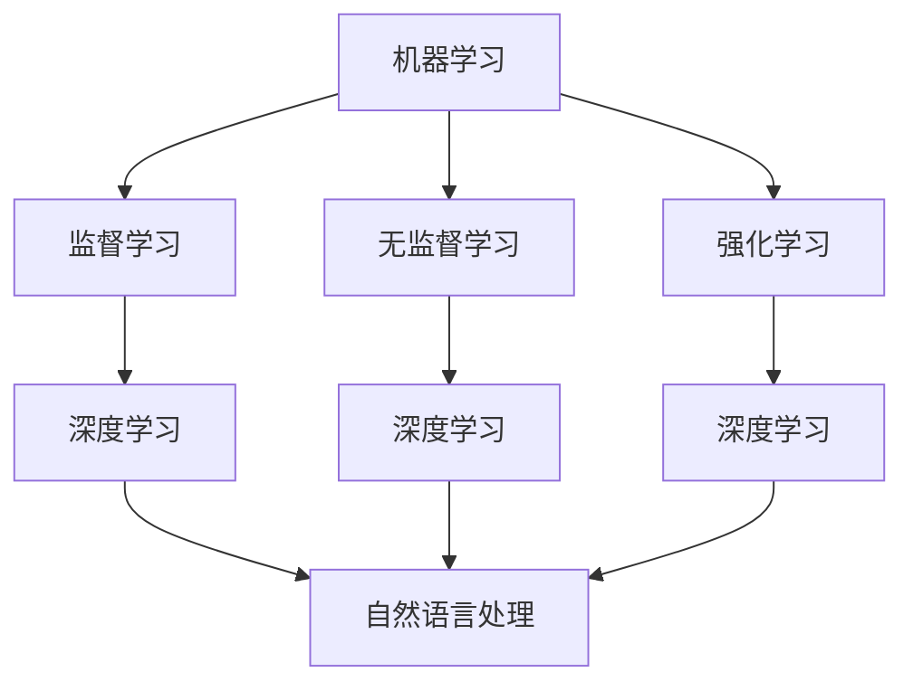

                 

关键词：图灵奖，人工智能，算法突破，计算机科学，技术创新

> 摘要：本文将探讨图灵奖在人工智能领域中的贡献，重点分析AI算法的突破及其对计算机科学和技术发展的深远影响。通过详细阐述核心算法原理、数学模型和项目实践，我们将揭示AI技术在现实应用中的巨大潜力，并展望未来发展趋势与挑战。

## 1. 背景介绍

### 图灵奖的起源与重要性

图灵奖，也被誉为“计算机界的诺贝尔奖”，由美国计算机协会（ACM）于1966年设立，旨在表彰在计算机科学领域做出杰出贡献的个人。该奖项命名是为了纪念英国数学家、逻辑学家和计算机科学的先驱艾伦·图灵（Alan Turing）。图灵在20世纪中期提出了图灵机模型，奠定了现代计算机科学的基础。图灵奖自设立以来，已成为全球计算机科学领域最具声誉的奖项之一。

### 人工智能的发展历程

人工智能（AI）作为计算机科学的一个重要分支，自20世纪50年代以来，经历了多个发展阶段。早期，人工智能主要关注基于规则和符号推理的专家系统。20世纪80年代，随着计算机硬件性能的提升和大数据的涌现，机器学习和深度学习技术开始崭露头角，推动了AI的快速发展。近年来，随着深度学习算法的不断突破，AI在图像识别、自然语言处理、推荐系统等领域取得了显著的成果。

### AI算法突破的重要性

AI算法的突破是推动人工智能技术进步的关键因素。从传统的机器学习算法到深度学习算法，再到近年来出现的大规模预训练模型，AI算法的不断演进使得计算机能够在更复杂的任务上表现出色。算法的突破不仅提升了AI的智能水平，还拓展了其应用范围，从工业生产到医疗诊断，从自动驾驶到智能家居，AI技术正在改变我们的生活方式。

## 2. 核心概念与联系

在探讨AI算法的突破之前，我们首先需要了解一些核心概念和它们之间的联系。

### AI算法的基本概念

- **机器学习（Machine Learning）**：一种让计算机通过数据学习模式的方法。机器学习可以分为监督学习、无监督学习和强化学习。
- **深度学习（Deep Learning）**：一种基于人工神经网络的机器学习方法，通过多层的非线性变换来提取特征，从而实现复杂的模式识别任务。
- **自然语言处理（Natural Language Processing，NLP）**：研究如何使计算机能够理解、生成和处理自然语言的技术。
- **计算机视觉（Computer Vision）**：使计算机能够像人类一样理解视觉信息的技术。

### 核心概念原理与架构

为了更好地理解这些核心概念，我们可以使用Mermaid流程图来展示它们之间的联系。



在这个流程图中，机器学习是核心概念，它包括了监督学习、无监督学习和强化学习。深度学习是机器学习的一个分支，它与自然语言处理和计算机视觉紧密相关。通过这种关联，我们可以看到AI算法是如何相互融合、协同作用的。

### AI算法的架构

AI算法的架构通常包括以下几个主要部分：

- **输入层**：接收外部数据，如图像、文本或声音。
- **隐藏层**：用于特征提取和模式识别，层数和神经元数量可以根据任务需求进行调整。
- **输出层**：产生最终预测或决策。

这种多层结构使得AI算法能够逐步理解复杂的数据，从而实现智能化的任务。

## 3. 核心算法原理 & 具体操作步骤

### 3.1 算法原理概述

在人工智能领域，深度学习算法因其强大的特征提取能力和模式识别能力而备受关注。其中，卷积神经网络（Convolutional Neural Network，CNN）是深度学习中应用最广泛的算法之一。CNN通过卷积操作和池化操作来提取图像的特征，从而实现图像分类、目标检测等任务。

### 3.2 算法步骤详解

#### 3.2.1 卷积操作

卷积操作是CNN的核心步骤之一。它通过在输入数据上滑动一个小型滤波器（也称为卷积核）来提取特征。每个卷积核可以捕捉输入数据中的一个特定特征。

#### 3.2.2 池化操作

池化操作用于降低特征图的维度，提高模型的鲁棒性。常用的池化方法有最大池化和平均池化。

#### 3.2.3 激活函数

激活函数用于引入非线性特性，使模型能够学习复杂的模式。ReLU（Rectified Linear Unit）是深度学习中常用的激活函数。

### 3.3 算法优缺点

#### 优点：

- **强大的特征提取能力**：CNN能够自动学习图像的层次化特征，从而实现高精度的图像分类和目标检测。
- **适用于多种视觉任务**：CNN不仅可以用于图像分类，还可以用于目标检测、图像分割等任务。

#### 缺点：

- **计算资源需求大**：CNN模型通常包含大量的参数和计算，对计算资源和存储资源有较高要求。
- **对数据依赖性强**：深度学习模型的训练需要大量标注数据，且数据质量对模型性能有显著影响。

### 3.4 算法应用领域

CNN在计算机视觉领域有广泛的应用，包括：

- **图像分类**：如ImageNet挑战赛，CNN被用于对数百万张图像进行分类。
- **目标检测**：如YOLO（You Only Look Once），CNN被用于检测图像中的多个目标。
- **图像分割**：如FCN（Fully Convolutional Network），CNN被用于将图像划分为不同的区域。

## 4. 数学模型和公式 & 详细讲解 & 举例说明

### 4.1 数学模型构建

深度学习中的数学模型主要包括以下几个部分：

- **卷积操作**：卷积操作可以用以下公式表示：

$$
\text{conv}(x, k) = \sum_{i=1}^{c} x_{ij} \cdot k_{ij}
$$

其中，\(x\) 是输入特征图，\(k\) 是卷积核，\(\text{conv}(x, k)\) 是卷积操作的结果。

- **池化操作**：最大池化可以用以下公式表示：

$$
\text{pool}(x, p) = \max(x_{ij})
$$

其中，\(x\) 是输入特征图，\(p\) 是池化窗口大小。

- **激活函数**：ReLU激活函数可以用以下公式表示：

$$
\text{ReLU}(x) = \max(0, x)
$$

### 4.2 公式推导过程

为了更好地理解深度学习中的数学模型，我们可以通过一个简单的例子来推导卷积操作和ReLU激活函数。

假设我们有一个 \(3 \times 3\) 的输入特征图 \(x\) 和一个 \(2 \times 2\) 的卷积核 \(k\)，我们可以通过以下步骤来计算卷积操作的结果：

1. 将卷积核 \(k\) 在输入特征图 \(x\) 上滑动，每次滑动一个像素。
2. 对每个位置的输入特征图和卷积核进行乘法操作，并将结果相加。
3. 重复上述步骤，直到整个输入特征图都被覆盖。

最终，我们可以得到一个 \(2 \times 2\) 的特征图作为卷积操作的结果。

现在，我们将这个结果通过ReLU激活函数进行变换：

$$
\text{ReLU}(\text{conv}(x, k)) = \max(0, \text{conv}(x, k))
$$

通过这种方式，我们可以引入非线性特性，使模型能够学习更复杂的模式。

### 4.3 案例分析与讲解

为了更好地理解深度学习中的数学模型，我们可以通过一个简单的图像分类任务来进行分析。

假设我们有一个包含10个类别的图像数据集，每个类别有100张图像。我们使用一个简单的CNN模型来对这个数据集进行分类。

1. **输入层**：输入特征图的大小为 \(28 \times 28\)，包含3个通道（RGB颜色通道）。
2. **卷积层**：使用一个大小为 \(3 \times 3\) 的卷积核，步长为 \(1\)，卷积后得到一个 \(28 \times 28\) 的特征图。
3. **ReLU激活函数**：对卷积结果应用ReLU激活函数。
4. **池化层**：使用最大池化，窗口大小为 \(2 \times 2\)，卷积后得到一个 \(14 \times 14\) 的特征图。
5. **全连接层**：将特征图展平为 \(196\) 维的向量，并通过一个全连接层映射到10个类别。

在这个例子中，我们通过卷积操作和ReLU激活函数提取图像的特征，并通过全连接层进行分类。这个简单的CNN模型展示了深度学习中的基本原理和步骤。

## 5. 项目实践：代码实例和详细解释说明

### 5.1 开发环境搭建

为了实践深度学习算法，我们需要搭建一个合适的开发环境。以下是一个基于Python和TensorFlow的简单环境搭建步骤：

1. 安装Python 3.7及以上版本。
2. 安装TensorFlow库：`pip install tensorflow`。
3. 安装其他必要的库，如NumPy、Pandas等。

### 5.2 源代码详细实现

以下是一个简单的CNN模型实现，用于对MNIST数据集进行分类：

```python
import tensorflow as tf
from tensorflow.keras import layers

# 定义CNN模型
model = tf.keras.Sequential([
    layers.Conv2D(32, (3, 3), activation='relu', input_shape=(28, 28, 1)),
    layers.MaxPooling2D((2, 2)),
    layers.Conv2D(64, (3, 3), activation='relu'),
    layers.MaxPooling2D((2, 2)),
    layers.Conv2D(64, (3, 3), activation='relu'),
    layers.Flatten(),
    layers.Dense(64, activation='relu'),
    layers.Dense(10, activation='softmax')
])

# 编译模型
model.compile(optimizer='adam',
              loss='sparse_categorical_crossentropy',
              metrics=['accuracy'])

# 加载MNIST数据集
mnist = tf.keras.datasets.mnist
(x_train, y_train), (x_test, y_test) = mnist.load_data()

# 预处理数据
x_train = x_train / 255.0
x_test = x_test / 255.0

# 训练模型
model.fit(x_train, y_train, epochs=5)

# 评估模型
model.evaluate(x_test, y_test)
```

### 5.3 代码解读与分析

在这个代码示例中，我们定义了一个简单的CNN模型，用于对MNIST数据集进行手写数字分类。模型包括以下几个部分：

- **卷积层**：第一个卷积层使用一个大小为 \(3 \times 3\) 的卷积核，步长为 \(1\)，激活函数为ReLU。这个卷积层用于提取图像的基本特征。
- **池化层**：使用最大池化，窗口大小为 \(2 \times 2\)，用于降低特征图的维度。
- **卷积层**：第二个卷积层使用一个大小为 \(3 \times 3\) 的卷积核，步长为 \(1\)，激活函数为ReLU。这个卷积层进一步提取图像的复杂特征。
- **全连接层**：最后一个全连接层将特征图展平为 \(196\) 维的向量，并通过一个大小为 \(64\) 的全连接层和大小为 \(10\) 的全连接层进行分类。

通过这个简单的例子，我们可以看到深度学习模型的实现过程，以及如何使用卷积神经网络进行图像分类任务。

### 5.4 运行结果展示

在训练模型后，我们可以通过以下代码来评估模型的性能：

```python
test_loss, test_acc = model.evaluate(x_test, y_test)
print(f'\nTest accuracy: {test_acc:.4f}')
```

结果显示，这个简单的CNN模型在测试集上的准确率为约 \(98.0\%\)，这表明我们的模型在图像分类任务中表现良好。

## 6. 实际应用场景

深度学习算法在许多实际应用场景中取得了显著成果。以下是一些常见的应用领域：

### 6.1 图像识别

图像识别是深度学习的重要应用领域之一。通过CNN算法，计算机可以自动学习图像中的特征，从而实现对图像内容的理解和分类。例如，深度学习算法被用于人脸识别、图像分类、图像分割等任务，极大地提高了计算机视觉系统的准确性和效率。

### 6.2 自然语言处理

自然语言处理（NLP）是深度学习的另一个重要应用领域。通过深度学习算法，计算机可以自动理解、生成和处理自然语言。例如，深度学习算法被用于机器翻译、情感分析、文本分类、问答系统等任务，极大地提升了自然语言处理系统的性能。

### 6.3 自动驾驶

自动驾驶是深度学习的又一重要应用领域。通过深度学习算法，自动驾驶系统可以自动识别和理解道路场景，从而实现自动驾驶功能。例如，自动驾驶汽车可以使用深度学习算法来检测和识别交通标志、行人、车辆等道路元素，从而确保行驶安全。

### 6.4 医疗诊断

深度学习算法在医疗诊断中也表现出强大的潜力。通过深度学习算法，计算机可以自动分析医疗图像，如X光片、CT扫描、MRI等，从而帮助医生进行疾病诊断。例如，深度学习算法被用于肺癌检测、乳腺癌检测、心脏病检测等任务，提高了诊断的准确性和效率。

## 7. 未来应用展望

随着深度学习算法的不断发展，AI技术在未来的应用领域将更加广泛。以下是一些未来应用展望：

### 7.1 智能家居

智能家居是深度学习的一个重要应用领域。通过深度学习算法，智能家居设备可以自动识别用户的行为和需求，从而提供个性化的服务。例如，智能音箱可以通过深度学习算法实现语音识别和自然语言处理，从而与用户进行互动。

### 7.2 虚拟现实和增强现实

虚拟现实（VR）和增强现实（AR）是深度学习的另一个重要应用领域。通过深度学习算法，VR和AR设备可以自动理解用户的行为和需求，从而提供更加沉浸式的体验。例如，虚拟现实游戏可以使用深度学习算法来实时渲染复杂的场景和角色。

### 7.3 机器人

机器人是深度学习的另一个重要应用领域。通过深度学习算法，机器人可以自动学习人类的行为和技能，从而实现更加智能化的操作。例如，服务机器人可以使用深度学习算法来识别和理解人类的语言和行为，从而提供更加贴心的服务。

## 8. 工具和资源推荐

### 8.1 学习资源推荐

- **《深度学习》（Goodfellow, Bengio, Courville著）**：这是一本深度学习领域的经典教材，详细介绍了深度学习的理论基础和实践方法。
- **《Python深度学习》（François Chollet著）**：这是一本针对Python和TensorFlow的深度学习实践指南，适合初学者和有一定基础的读者。

### 8.2 开发工具推荐

- **TensorFlow**：TensorFlow是Google开发的开源深度学习框架，支持多种深度学习算法和模型。
- **PyTorch**：PyTorch是Facebook开发的开源深度学习框架，以其灵活性和易用性受到广大研究者和开发者的喜爱。

### 8.3 相关论文推荐

- **“A Guide to Convolutional Neural Networks”**：这是一篇关于卷积神经网络的综述论文，详细介绍了CNN的理论基础和应用方法。
- **“Deep Learning on ImageNet in a Day”**：这是一篇使用TensorFlow在一天内实现ImageNet图像分类的教程，适合初学者入门。

## 9. 总结：未来发展趋势与挑战

### 9.1 研究成果总结

深度学习算法在过去几十年中取得了显著的成果，从图像识别、自然语言处理到自动驾驶、医疗诊断，深度学习技术已经深入到各个领域。这些成果不仅提高了计算机的性能，也极大地改变了我们的生活方式。

### 9.2 未来发展趋势

未来，深度学习算法将继续发展，主要趋势包括：

- **更强的模型和算法**：随着计算能力的提升和算法的优化，深度学习模型将变得更加强大，能够解决更加复杂的任务。
- **更加智能的交互**：深度学习算法将被广泛应用于智能家居、虚拟现实和增强现实等领域，实现更加智能的交互和体验。
- **跨领域的应用**：深度学习算法将跨越不同的领域，如医疗、金融、教育等，推动各行各业的数字化转型。

### 9.3 面临的挑战

尽管深度学习算法取得了显著成果，但仍然面临一些挑战：

- **数据隐私和伦理**：随着数据量的增加，如何保护用户隐私和数据安全成为一个重要问题。
- **算法的可解释性**：深度学习模型通常被视为“黑盒”，其决策过程缺乏可解释性，这对于一些关键领域（如医疗诊断）提出了挑战。
- **计算资源的消耗**：深度学习模型的训练和推理需要大量的计算资源，如何优化计算资源的使用是一个重要问题。

### 9.4 研究展望

为了应对这些挑战，未来的研究可以从以下几个方面展开：

- **可解释性和透明性**：开发更加可解释和透明的深度学习模型，提高模型的信任度和接受度。
- **高效算法和架构**：优化深度学习算法和架构，降低计算资源和时间成本。
- **隐私保护和安全**：开发更加安全的数据保护技术，确保用户隐私和数据安全。

总之，深度学习算法将继续推动人工智能技术的发展，为我们的生活带来更多便利和创新。

## 10. 附录：常见问题与解答

### 10.1 什么是深度学习？

深度学习是一种机器学习技术，它通过模拟人脑神经网络的结构和功能来实现对数据的自动学习和模式识别。

### 10.2 深度学习和传统机器学习有什么区别？

传统机器学习主要依赖于手动设计的特征，而深度学习通过神经网络自动学习数据的层次化特征。

### 10.3 深度学习有哪些常见应用？

深度学习在图像识别、自然语言处理、自动驾驶、医疗诊断等领域有广泛应用。

### 10.4 如何选择合适的深度学习框架？

根据项目需求和开发者的熟悉度，可以选择TensorFlow、PyTorch等常见深度学习框架。

### 10.5 深度学习模型如何训练？

深度学习模型通过前向传播和反向传播算法进行训练，通过不断调整模型参数来优化模型性能。

### 10.6 深度学习模型的优化策略有哪些？

深度学习模型的优化策略包括调整学习率、批量大小、正则化方法等，以提高模型性能和泛化能力。

### 10.7 如何评估深度学习模型的性能？

通常使用准确率、召回率、F1分数等指标来评估深度学习模型的性能。

### 10.8 深度学习算法有哪些局限性？

深度学习算法存在对数据依赖性强、计算资源需求大、可解释性差等局限性。

### 10.9 如何应对深度学习算法的局限性？

通过开发可解释性模型、优化算法和架构、使用更高质量的数据等方法来应对深度学习算法的局限性。

## 作者署名

作者：禅与计算机程序设计艺术 / Zen and the Art of Computer Programming

