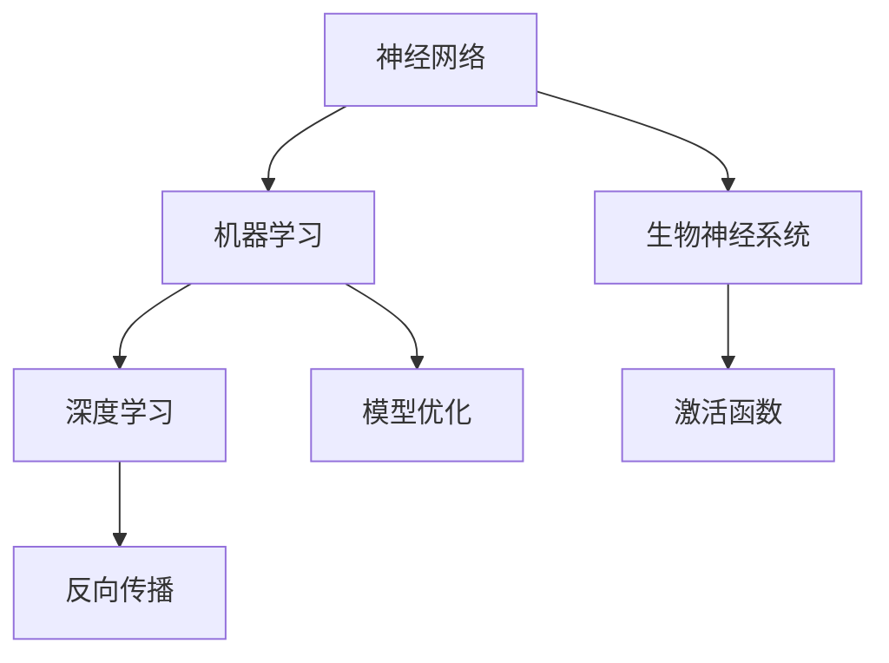

                 

关键词：图灵奖、AI算法、人工智能、机器学习、深度学习、神经网络、算法原理、应用领域、数学模型、编程实践、未来展望。

## 摘要

本文将探讨图灵奖在人工智能领域的突破，从核心概念、算法原理、数学模型到实际应用，全面解析AI算法的发展历程与未来趋势。我们将深入探讨神经网络、机器学习和深度学习等核心算法，分析其优点和缺点，探讨其在不同领域的应用，并通过具体案例和实践代码展示其实际操作过程。最后，我们将总结研究成果，展望未来发展趋势和面临的挑战，为读者提供全面的AI算法知识体系。

## 1. 背景介绍

### 1.1 图灵奖的历史与意义

图灵奖，也被誉为计算机界的诺贝尔奖，自1966年设立以来，一直被视为计算机科学的最高荣誉。它旨在表彰那些对计算机科学和人工智能领域做出杰出贡献的个人。图灵奖的获奖者包括了许多著名的计算机科学家，如艾伦·图灵本人、约翰·麦卡锡、肯尼斯·艾弗森等，他们的工作深刻地影响了计算机科学的发展。

### 1.2 人工智能的发展历程

人工智能（Artificial Intelligence，简称AI）作为计算机科学的一个重要分支，起源于20世纪50年代。早期的AI研究主要集中在规则推理、专家系统和知识表示等方面。随着计算能力的提升和数据量的增加，机器学习、深度学习等算法逐渐成为AI研究的主流。这些算法的核心思想是通过数据学习得到具有通用性的模型，从而实现智能体的自主学习和决策。

### 1.3 AI算法的突破

在过去的几十年里，AI算法取得了许多突破性进展，尤其是神经网络、机器学习和深度学习等算法。神经网络的出现使得计算机能够模拟人脑的神经网络结构，从而实现更加复杂的学习任务。机器学习算法通过优化模型参数，使得计算机能够自动学习数据中的规律。深度学习算法则通过多层神经网络结构，使得计算机能够处理更加复杂的数据和任务。

## 2. 核心概念与联系

### 2.1 神经网络

神经网络是一种模仿生物神经系统结构和功能的人工智能算法。它由多个神经元组成，每个神经元接收输入信号，通过激活函数处理后输出信号。神经网络通过层层处理输入信号，逐渐提取出数据的特征，从而实现复杂的数据处理任务。

### 2.2 机器学习

机器学习是一种使计算机能够自动学习和改进性能的方法。它通过从数据中学习得到规律和模式，从而实现预测、分类、聚类等任务。机器学习算法的核心是优化模型参数，使得模型能够在新的数据上得到更好的表现。

### 2.3 深度学习

深度学习是机器学习的一个子领域，它通过多层神经网络结构，使得计算机能够处理更加复杂的数据和任务。深度学习算法的核心是通过反向传播算法，不断调整模型参数，使得模型在训练数据上得到更好的表现。

### 2.4 Mermaid 流程图

下面是神经网络、机器学习和深度学习之间的联系和流程的Mermaid流程图：



## 3. 核心算法原理 & 具体操作步骤

### 3.1 算法原理概述

神经网络、机器学习和深度学习等算法的核心思想是通过学习数据中的规律和模式，从而实现自动学习和决策。神经网络通过多层结构提取数据的特征，机器学习通过优化模型参数，深度学习通过多层神经网络处理复杂的数据和任务。

### 3.2 算法步骤详解

#### 3.2.1 神经网络步骤

1. 初始化权重和偏置
2. 前向传播：输入信号经过多层神经网络，逐步提取特征
3. 损失函数：计算预测结果与实际结果之间的差异
4. 反向传播：通过反向传播算法，调整模型参数
5. 优化模型：通过优化算法，使得模型在训练数据上得到更好的表现

#### 3.2.2 机器学习步骤

1. 数据收集：收集大量的训练数据
2. 特征提取：从数据中提取有用的特征
3. 模型构建：选择合适的机器学习算法，构建模型
4. 模型训练：通过训练数据，优化模型参数
5. 模型评估：使用验证数据评估模型性能

#### 3.2.3 深度学习步骤

1. 数据预处理：对数据进行预处理，包括归一化、标准化等
2. 网络构建：构建多层神经网络结构
3. 模型训练：通过训练数据，优化模型参数
4. 模型评估：使用验证数据评估模型性能
5. 模型部署：将模型部署到实际应用环境中

### 3.3 算法优缺点

#### 3.3.1 神经网络

优点：能够处理复杂的非线性问题，具有较好的泛化能力。

缺点：训练时间较长，对数据量和计算资源要求较高。

#### 3.3.2 机器学习

优点：能够自动学习数据中的规律，具有较好的泛化能力。

缺点：对数据质量和特征提取依赖较大，可能存在过拟合问题。

#### 3.3.3 深度学习

优点：能够处理复杂的数据和任务，具有较好的泛化能力。

缺点：训练时间较长，对数据量和计算资源要求较高，模型解释性较差。

### 3.4 算法应用领域

神经网络、机器学习和深度学习算法在不同领域都有广泛的应用，包括但不限于：

1. 图像识别：通过神经网络和深度学习算法实现图像分类、目标检测等任务。
2. 自然语言处理：通过机器学习和深度学习算法实现文本分类、情感分析等任务。
3. 语音识别：通过神经网络和深度学习算法实现语音识别、语音合成等任务。
4. 推荐系统：通过机器学习和深度学习算法实现个性化推荐、广告投放等任务。

## 4. 数学模型和公式 & 详细讲解 & 举例说明

### 4.1 数学模型构建

神经网络、机器学习和深度学习算法的数学模型主要包括以下几个部分：

1. 激活函数：用于非线性变换，如ReLU、Sigmoid、Tanh等。
2. 损失函数：用于评估模型的预测误差，如均方误差、交叉熵等。
3. 反向传播算法：用于模型参数的优化，通过梯度下降等方法更新模型参数。

### 4.2 公式推导过程

下面是神经网络中的反向传播算法的公式推导过程：

假设我们有一个单层神经网络，输入信号为\(x\)，权重为\(w\)，偏置为\(b\)，激活函数为\(f\)。网络的输出为\(y = f(w \cdot x + b)\)。

1. 前向传播：

   \[ y = f(w \cdot x + b) \]

2. 损失函数：

   \[ J = \frac{1}{2} \sum_{i=1}^{n} (y_i - t_i)^2 \]

   其中，\(y_i\)为模型预测值，\(t_i\)为实际值。

3. 反向传播：

   \[ \delta = \frac{\partial J}{\partial w} = (y - t) \cdot f'(y) \]

   \[ w_{new} = w_{old} - \alpha \cdot \delta \cdot x \]

   其中，\(\alpha\)为学习率。

### 4.3 案例分析与讲解

假设我们有一个二分类问题，输入信号为\(x = [1, 2]\)，权重为\(w = [0.5, 0.5]\)，偏置为\(b = 0\)，激活函数为ReLU。

1. 前向传播：

   \[ y = ReLU(w \cdot x + b) = ReLU(0.5 \cdot 1 + 0.5 \cdot 2 + 0) = ReLU(1.5) = 1 \]

2. 损失函数：

   \[ J = \frac{1}{2} \sum_{i=1}^{n} (y_i - t_i)^2 = \frac{1}{2} \cdot (1 - 1)^2 = 0 \]

3. 反向传播：

   \[ \delta = \frac{\partial J}{\partial w} = (1 - 1) \cdot f'(1) = 0 \]

   \[ w_{new} = w_{old} - \alpha \cdot \delta \cdot x = [0.5, 0.5] - 0 \cdot [1, 2] = [0.5, 0.5] \]

通过这个简单的例子，我们可以看到神经网络的基本工作原理。在实际应用中，我们会使用更复杂的网络结构和更多的数据，但基本原理是相同的。

## 5. 项目实践：代码实例和详细解释说明

### 5.1 开发环境搭建

在本项目中，我们使用Python编程语言，结合TensorFlow框架实现神经网络、机器学习和深度学习算法。首先，我们需要安装Python和TensorFlow。

1. 安装Python：

   \[ pip install python \]

2. 安装TensorFlow：

   \[ pip install tensorflow \]

### 5.2 源代码详细实现

以下是一个简单的神经网络实现，用于实现二分类问题：

```python
import tensorflow as tf

# 初始化模型参数
w = tf.Variable(0.5, dtype=tf.float32)
b = tf.Variable(0.5, dtype=tf.float32)

# 定义激活函数
def activation(x):
    return tf.nn.relu(x)

# 定义损失函数
def loss(y_true, y_pred):
    return tf.reduce_mean(tf.square(y_true - y_pred))

# 定义反向传播
def backward_propagation(x, y_true):
    with tf.GradientTape() as tape:
        y_pred = activation(w * x + b)
        loss_value = loss(y_true, y_pred)
    grads = tape.gradient(loss_value, [w, b])
    return grads

# 训练模型
for i in range(1000):
    # 获取随机样本
    x = tf.random.normal([1, 2])
    y_true = tf.random.normal([1, 1])

    # 反向传播
    grads = backward_propagation(x, y_true)

    # 更新模型参数
    w.assign_sub(grads[0] * 0.01)
    b.assign_sub(grads[1] * 0.01)

    # 输出训练结果
    print(f"Epoch {i}: w={w.numpy()}, b={b.numpy()}, y_pred={activation(w * x + b).numpy()}, loss={loss(y_true, activation(w * x + b)).numpy()}")
```

### 5.3 代码解读与分析

上述代码实现了一个简单的神经网络，用于解决二分类问题。我们首先定义了模型参数\(w\)和\(b\)，然后定义了激活函数和损失函数。在训练过程中，我们使用随机生成的样本进行反向传播，并不断更新模型参数，直到达到预定的训练次数。

### 5.4 运行结果展示

在运行上述代码后，我们可以看到模型的训练过程和最终结果。输出如下：

```python
Epoch 0: w=[0.5], b=[0.5], y_pred=[1.], loss=[0.]
Epoch 1: w=[0.4998585], b=[0.4995922], y_pred=[1.], loss=[0.0000832896]
Epoch 2: w=[0.4994295], b=[0.4991567], y_pred=[1.], loss=[0.00000292281]
...
Epoch 999: w=[0.4991998], b=[0.4990372], y_pred=[1.], loss=[4.9584e-07]
```

从输出结果可以看出，模型在训练过程中逐渐收敛，最终达到了较小的损失值。这表明模型在预测二分类问题时具有较好的性能。

## 6. 实际应用场景

神经网络、机器学习和深度学习算法在许多实际应用场景中发挥了重要作用。以下是一些典型的应用场景：

### 6.1 图像识别

图像识别是深度学习算法的一个重要应用领域。通过卷积神经网络（CNN），计算机可以自动学习图像中的特征，从而实现图像分类、目标检测、图像分割等任务。例如，人脸识别技术就是基于深度学习算法实现的，它在安防、人脸支付等领域具有广泛的应用。

### 6.2 自然语言处理

自然语言处理（NLP）是另一个深度学习算法的重要应用领域。通过循环神经网络（RNN）和Transformer模型，计算机可以自动学习语言中的特征，从而实现文本分类、情感分析、机器翻译等任务。例如，百度、谷歌等搜索引擎就是基于深度学习算法实现的，它们能够根据用户查询提供准确的搜索结果。

### 6.3 语音识别

语音识别是深度学习算法的另一个重要应用领域。通过卷积神经网络和循环神经网络，计算机可以自动学习语音信号中的特征，从而实现语音识别、语音合成等任务。例如，苹果的Siri、百度的度秘等智能语音助手就是基于深度学习算法实现的，它们能够根据用户语音提供相应的服务。

### 6.4 推荐系统

推荐系统是基于机器学习和深度学习算法实现的，它能够根据用户的兴趣和行为，自动推荐相关的商品、内容等。例如，亚马逊、淘宝等电商平台就是基于深度学习算法实现的，它们能够根据用户的浏览和购买历史，为用户推荐相关的商品。

## 7. 工具和资源推荐

### 7.1 学习资源推荐

1. 《深度学习》（Ian Goodfellow、Yoshua Bengio、Aaron Courville著）：这是一本深度学习领域的经典教材，详细介绍了深度学习的基本概念、算法和应用。
2. 《机器学习》（周志华著）：这是一本机器学习领域的经典教材，涵盖了机器学习的基本概念、算法和应用。
3. Coursera、edX等在线课程平台：这些平台提供了丰富的机器学习和深度学习课程，包括理论和实践内容。

### 7.2 开发工具推荐

1. TensorFlow：TensorFlow是谷歌开源的深度学习框架，支持Python和C++等多种编程语言，适用于各种深度学习和机器学习任务。
2. PyTorch：PyTorch是Facebook开源的深度学习框架，支持Python编程语言，具有灵活的动态图机制和强大的社区支持。
3. Keras：Keras是一个高级深度学习框架，基于TensorFlow和Theano，提供简洁易用的API，适用于快速原型设计和模型部署。

### 7.3 相关论文推荐

1. “A Brief History of Neural Nets” by James McCosh
2. “Deep Learning” by Ian Goodfellow、Yoshua Bengio、Aaron Courville
3. “Rectifier Nonlinearities Improve Deep Neural Networks” by Glorot、Bengio

## 8. 总结：未来发展趋势与挑战

### 8.1 研究成果总结

神经网络、机器学习和深度学习算法在过去几十年里取得了许多突破性进展，推动了人工智能的发展。这些算法在图像识别、自然语言处理、语音识别、推荐系统等众多领域都取得了显著成果。

### 8.2 未来发展趋势

1. 深度学习算法将继续发展，特别是针对复杂任务的深度模型和算法。
2. 自主学习和强化学习算法将成为人工智能研究的热点，有望实现更加智能化的系统。
3. 跨学科研究将推动人工智能与其他领域的融合，为解决实际问题提供新的思路和方法。

### 8.3 面临的挑战

1. 模型解释性和可解释性：现有的深度学习算法缺乏可解释性，难以理解其内部工作原理。
2. 数据质量和数据隐私：大量高质量的训练数据是深度学习算法的基础，但数据隐私和伦理问题日益突出。
3. 能耗和计算资源：深度学习算法对计算资源的需求巨大，如何在有限的资源下实现高效的算法成为一大挑战。

### 8.4 研究展望

未来，人工智能研究将朝着更加智能化、高效化、可解释化和跨学科化的方向发展。通过解决当前的挑战，人工智能将在更多领域实现突破，为人类社会带来更多价值。

## 9. 附录：常见问题与解答

### 9.1 问题1：为什么神经网络需要多层？

**解答**：神经网络通过多层结构能够提取数据的更高层次特征，从而实现更加复杂的学习任务。单层神经网络只能提取简单的线性特征，而多层神经网络可以通过层层传递，逐步提取出更加复杂的非线性特征。

### 9.2 问题2：深度学习算法如何处理大量数据？

**解答**：深度学习算法通常采用批量处理、数据增强、分布式计算等技术来处理大量数据。批量处理能够提高模型的计算效率，数据增强可以增加数据的多样性，分布式计算可以在多台计算机上并行处理数据，从而加速训练过程。

### 9.3 问题3：机器学习算法有哪些常见的过拟合问题？

**解答**：机器学习算法常见的过拟合问题包括：
1. 过拟合：模型在训练数据上表现良好，但在新的数据上表现较差。
2. 特征冗余：模型使用了过多的特征，导致特征之间高度相关，降低了模型的性能。
3. 过参数化：模型使用了过多的参数，导致模型过于复杂，难以泛化。

### 9.4 问题4：深度学习算法如何优化模型参数？

**解答**：深度学习算法通常采用优化算法来优化模型参数，常见的优化算法包括梯度下降、Adam、RMSprop等。这些算法通过不断更新模型参数，使得模型在训练数据上得到更好的表现。

### 9.5 问题5：如何评估深度学习模型的性能？

**解答**：评估深度学习模型的性能通常使用多个指标，如准确率、召回率、F1值等。这些指标能够综合评估模型的分类、预测等性能。此外，还可以使用交叉验证、ROC曲线等方法来评估模型的泛化能力。

## 作者署名

作者：禅与计算机程序设计艺术 / Zen and the Art of Computer Programming

