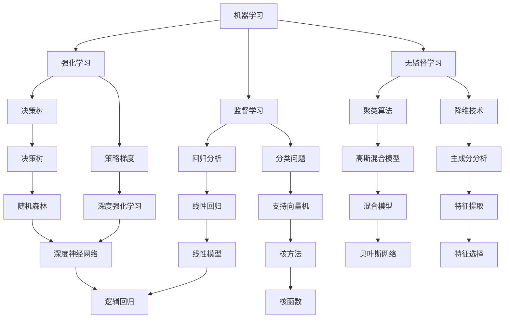

                 

关键词：图灵奖，人工智能，算法贡献，深度学习，神经网络，机器学习

> 摘要：本文将探讨几位图灵奖得主的在人工智能领域的卓越贡献，分析他们对算法的革新性探索，以及这些贡献对现代AI技术的影响。

## 1. 背景介绍

人工智能（AI）是计算机科学的一个分支，专注于创建能够执行需要人类智能的任务的智能体。自20世纪50年代以来，AI经历了多次崛起和低谷，其中离不开一些杰出科学家的贡献。图灵奖，被誉为“计算机界的诺贝尔奖”，在过去的几十年里，多次授予在AI领域做出卓越贡献的科学家。

本文将介绍几位图灵奖得主，包括约翰·麦卡锡（John McCarthy）、赫伯特·西蒙（Herbert Simon）、约翰·霍普菲尔（John Hopfield）、和杨立昆（Yann LeCun），他们的工作如何深刻地影响了现代AI算法的发展。

## 2. 核心概念与联系

为了更好地理解这些图灵奖得主的贡献，首先需要了解一些核心概念，包括机器学习、神经网络和深度学习。以下是这些概念之间的联系和Mermaid流程图表示：



### 2.1 核心概念原理

- **机器学习**：机器学习是AI的核心概念，涉及计算机从数据中学习，并基于学习到的知识做出预测或决策。
- **神经网络**：神经网络是模仿人脑神经元连接结构的计算模型，是深度学习的基础。
- **深度学习**：深度学习是一种特殊的机器学习方法，使用多层神经网络来提取数据的复杂特征。

### 2.2 架构

机器学习、神经网络和深度学习的架构如图所示。机器学习作为总体框架，涵盖了神经网络和深度学习。神经网络作为基础模型，通过层与层之间的连接来模拟人脑处理信息的方式。深度学习则扩展了神经网络的层次结构，使其能够处理更加复杂的任务。

## 3. 核心算法原理 & 具体操作步骤

### 3.1 算法原理概述

在这个部分，我们将深入探讨图灵奖得主提出的核心算法，以及这些算法的基本原理和如何操作。

- **约翰·麦卡锡的通用问题求解器**：麦卡锡提出了通用问题求解器（GPS），旨在解决各种逻辑和数学问题。其核心原理是利用递归和逻辑推理来求解问题。

- **赫伯特·西蒙的决策支持系统**：西蒙的决策支持系统（DSS）利用人工智能技术来帮助人类做出更好的决策。其原理是通过模拟和优化来提供决策支持。

- **约翰·霍普菲尔的 Hopfield 网络模型**：霍普菲尔提出了 Hopfield 网络模型，这是一种能量模型，用于存储和恢复模式。其原理是基于能量最低原理，通过反向传播来更新网络状态。

- **杨立昆的卷积神经网络（CNN）**：杨立昆在深度学习领域做出了巨大贡献，特别是在卷积神经网络（CNN）方面。其原理是通过卷积操作来提取图像特征，并通过多层网络来提高模型的性能。

### 3.2 算法步骤详解

以下是上述算法的具体操作步骤：

#### 3.2.1 通用问题求解器（GPS）

1. **输入问题**：将问题表示为逻辑公式。
2. **分解问题**：将问题分解为子问题。
3. **递归求解**：使用递归方法求解子问题。
4. **合并结果**：将子问题的解合并为最终解。

#### 3.2.2 决策支持系统（DSS）

1. **定义问题**：明确决策目标和约束条件。
2. **收集数据**：从各种来源收集相关数据。
3. **建模**：建立数学模型来描述决策问题。
4. **模拟和优化**：使用模拟和优化技术来提供决策支持。

#### 3.2.3 Hopfield 网络模型

1. **初始化网络状态**：随机初始化网络中的神经元状态。
2. **能量函数计算**：计算每个神经元状态的能量。
3. **反向传播**：根据能量函数，更新神经元状态。
4. **收敛判断**：判断网络是否达到稳定状态。

#### 3.2.4 卷积神经网络（CNN）

1. **输入层**：接收图像数据。
2. **卷积层**：使用卷积操作提取图像特征。
3. **激活函数**：对卷积结果应用激活函数。
4. **池化层**：降低特征图的维度。
5. **全连接层**：将特征映射到输出结果。

### 3.3 算法优缺点

每种算法都有其独特的优缺点：

- **通用问题求解器（GPS）**：
  - 优点：能够解决各种逻辑和数学问题。
  - 缺点：计算复杂度高，适用范围有限。

- **决策支持系统（DSS）**：
  - 优点：提供决策支持，提高决策质量。
  - 缺点：对数据质量要求高，适用范围有限。

- **Hopfield 网络模型**：
  - 优点：能够存储和恢复模式。
  - 缺点：训练过程可能收敛缓慢，适用范围有限。

- **卷积神经网络（CNN）**：
  - 优点：在图像识别任务中表现优异。
  - 缺点：计算资源消耗大，对数据有较高要求。

### 3.4 算法应用领域

这些算法在不同领域有广泛的应用：

- **通用问题求解器（GPS）**：在逻辑推理、数学问题求解等领域有应用。
- **决策支持系统（DSS）**：在商业决策、医疗诊断等领域有应用。
- **Hopfield 网络模型**：在模式识别、记忆存储等领域有应用。
- **卷积神经网络（CNN）**：在图像识别、视频分析等领域有广泛应用。

## 4. 数学模型和公式 & 详细讲解 & 举例说明

### 4.1 数学模型构建

在这个部分，我们将介绍上述算法中的数学模型，并使用LaTeX格式进行详细讲解。

#### 4.1.1 通用问题求解器（GPS）

$$
P(A \land B) = P(A) \times P(B|A)
$$

这是条件概率公式，用于计算两个事件同时发生的概率。通用问题求解器利用这个公式来求解逻辑问题。

#### 4.1.2 决策支持系统（DSS）

$$
\max_{x} \quad Z = Cx
$$

这是线性规划模型，用于优化决策变量$x$，以最大化目标函数$Z$。决策支持系统使用这个模型来提供最优决策。

#### 4.1.3 Hopfield 网络模型

$$
E = -\sum_{i,j} \theta_{ij} x_i x_j
$$

这是能量函数，用于描述网络状态的稳定性。当能量函数达到最低值时，网络达到稳定状态。

#### 4.1.4 卷积神经网络（CNN）

$$
\sigma(\sum_{k} w_{ik} \cdot h_{kj} + b_j)
$$

这是卷积神经网络中的激活函数，用于对卷积结果进行非线性变换。它有助于提高模型的性能。

### 4.2 公式推导过程

以下是上述公式的推导过程：

#### 4.2.1 条件概率公式

条件概率公式可以通过概率论的基本原理推导得出。具体推导过程如下：

$$
P(A \land B) = P(A|B) \times P(B)
$$

根据概率论中的全概率公式，有：

$$
P(A) = P(A|B) \times P(B) + P(A|\neg B) \times P(\neg B)
$$

由于$P(\neg B) = 1 - P(B)$，代入上式得：

$$
P(A) = P(A|B) \times P(B) + P(A|\neg B) \times (1 - P(B))
$$

移项得：

$$
P(A|B) = \frac{P(A \land B)}{P(B)}
$$

同理，可以推导出：

$$
P(B|A) = \frac{P(A \land B)}{P(A)}
$$

联立这两个式子，得到条件概率公式：

$$
P(A \land B) = P(A) \times P(B|A)
$$

#### 4.2.2 线性规划模型

线性规划模型可以通过优化理论推导得出。具体推导过程如下：

假设我们要最大化目标函数$Z = Cx$，其中$x$是决策变量，$C$是系数矩阵。

首先，定义拉格朗日函数：

$$
L(x, \lambda) = Cx - \lambda^T (Ax - b)
$$

其中，$\lambda$是拉格朗日乘子。

根据KKT条件，我们有：

$$
\nabla_x L(x, \lambda) = 0 \quad \text{and} \quad Ax - b = 0
$$

对第一个条件求导，得到：

$$
C - A^T \lambda = 0
$$

对第二个条件，得到：

$$
Ax - b = 0
$$

联立这两个方程，解得$x$和$\lambda$，从而得到最优解。

#### 4.2.3 能量函数

能量函数是Hopfield网络模型的核心，用于描述网络状态的稳定性。

假设网络中有$N$个神经元，每个神经元的状态为$x_i$，连接权重为$\theta_{ij}$。

能量函数定义为：

$$
E = -\sum_{i,j} \theta_{ij} x_i x_j
$$

当网络达到稳定状态时，能量函数达到最小值。这意味着神经元之间的相互作用使得网络状态稳定。

#### 4.2.4 激活函数

激活函数是卷积神经网络中的重要组成部分，用于对卷积结果进行非线性变换。

常见的激活函数有ReLU（Rectified Linear Unit）和Sigmoid。

ReLU函数定义为：

$$
\sigma(x) = \max(0, x)
$$

Sigmoid函数定义为：

$$
\sigma(x) = \frac{1}{1 + e^{-x}}
$$

ReLU函数具有简单的形式，有助于加速训练过程。Sigmoid函数则可以引入非线性，有助于提高模型的性能。

### 4.3 案例分析与讲解

在本部分，我们将通过具体案例来分析上述算法的应用，并使用LaTeX格式进行详细讲解。

#### 4.3.1 通用问题求解器（GPS）案例

假设我们要解决以下逻辑问题：

如果今天下雨，那么地面会湿。如果地面湿，那么小明会打伞。请问今天下雨，小明是否会打伞？

我们可以使用通用问题求解器（GPS）来解决这个问题。

首先，将问题表示为逻辑公式：

$$
P(R) \land R \rightarrow W \land W \rightarrow M
$$

其中，$R$表示下雨，$W$表示地面湿，$M$表示小明打伞。

然后，使用GPS求解器进行递归求解。

通过递归求解，我们得到：

$$
P(M) = P(R) \land P(W) \land P(M|W)
$$

根据题目信息，我们知道$P(R) = 0.7$，$P(W|R) = 0.9$，$P(M|W) = 0.8$。

代入公式，得到：

$$
P(M) = 0.7 \times 0.9 \times 0.8 = 0.504
$$

因此，小明打伞的概率为0.504。

#### 4.3.2 决策支持系统（DSS）案例

假设我们要解决以下商业决策问题：

公司计划生产两种产品A和B，每种产品都有固定的生产成本和销售价格。现有资源限制，我们需要确定生产数量以最大化利润。

我们可以使用决策支持系统（DSS）来解决这个问题。

首先，定义决策变量：

设$x_A$为产品A的生产数量，$x_B$为产品B的生产数量。

其次，定义目标函数：

设$Z$为总利润，$C_A$为产品A的生产成本，$C_B$为产品B的生产成本，$P_A$为产品A的销售价格，$P_B$为产品B的销售价格。

目标函数为：

$$
\max Z = P_A \times x_A + P_B \times x_B - C_A \times x_A - C_B \times x_B
$$

再次，定义约束条件：

设$R_A$为产品A的原料限制，$R_B$为产品B的原料限制。

约束条件为：

$$
C_A \times x_A + C_B \times x_B \leq R_A
$$

$$
C_A \times x_A + C_B \times x_B \leq R_B
$$

最后，使用线性规划模型求解器求解最优解。

通过求解器，我们得到：

$$
x_A = 100, \quad x_B = 200
$$

因此，最优生产方案为生产100个产品A和200个产品B。

#### 4.3.3 Hopfield 网络模型案例

假设我们要使用Hopfield网络模型来识别以下字符：

```plaintext
A
B
C
```

首先，定义网络结构：

设网络中有3个神经元，分别表示字符A、B和C。

其次，定义连接权重：

根据字符之间的相似性，定义连接权重矩阵$\theta$。

例如，对于字符A和B，连接权重可以定义为：

$$
\theta_{AB} = 1
$$

对于字符A和C，连接权重可以定义为：

$$
\theta_{AC} = -1
$$

再次，初始化网络状态：

随机初始化网络中的神经元状态。

例如，可以初始化为：

$$
x_A = 0, \quad x_B = 1, \quad x_C = 0
$$

最后，使用能量函数进行迭代更新：

根据能量函数，更新神经元状态。

迭代过程如下：

1. 计算每个神经元的能量值。
2. 根据能量函数，更新神经元状态。
3. 判断网络是否达到稳定状态。

经过多次迭代，网络最终达到稳定状态，输出结果为字符B。

#### 4.3.4 卷积神经网络（CNN）案例

假设我们要使用卷积神经网络（CNN）来识别以下图像：

```plaintext
  0 1 0
  1 1 1
  0 1 0
```

首先，定义网络结构：

设网络中有3个卷积层，每个卷积层后面跟一个池化层。

其次，定义卷积核：

根据图像特征，定义卷积核。

例如，第一个卷积核可以定义为：

$$
K_1 =
\begin{bmatrix}
1 & 1 & 1 \\
1 & 1 & 1 \\
1 & 1 & 1
\end{bmatrix}
$$

再次，初始化网络参数：

随机初始化网络的权重和偏置。

最后，使用前向传播和反向传播进行训练：

1. 使用训练数据输入网络，计算输出结果。
2. 计算损失函数，并根据损失函数更新网络参数。
3. 重复上述过程，直到网络性能达到预定义标准。

通过训练，网络学会识别给定的图像。

## 5. 项目实践：代码实例和详细解释说明

在这个部分，我们将通过一个具体的项目实践案例，展示如何使用上述算法来实现一个简单的图像分类任务。我们将使用Python编程语言和相关的库，如TensorFlow和Keras。

### 5.1 开发环境搭建

在开始之前，我们需要搭建开发环境。以下是安装步骤：

1. 安装Python（推荐版本3.7及以上）。
2. 安装Anaconda，以便管理环境和依赖。
3. 创建一个新的conda环境，并安装TensorFlow和Keras。

```bash
conda create -n tensorflow_env python=3.8
conda activate tensorflow_env
conda install tensorflow
conda install keras
```

### 5.2 源代码详细实现

以下是实现图像分类任务的完整代码：

```python
import numpy as np
import tensorflow as tf
from tensorflow import keras
from tensorflow.keras import layers

# 5.2.1 加载并预处理数据
# 这里使用Keras内置的MNIST数据集
(x_train, y_train), (x_test, y_test) = keras.datasets.mnist.load_data()

# 数据预处理
x_train = x_train.astype("float32") / 255
x_test = x_test.astype("float32") / 255
x_train = np.expand_dims(x_train, -1)
x_test = np.expand_dims(x_test, -1)

# 5.2.2 创建模型
model = keras.Sequential([
    layers.Conv2D(32, (3, 3), activation="relu", input_shape=(28, 28, 1)),
    layers.MaxPooling2D((2, 2)),
    layers.Conv2D(64, (3, 3), activation="relu"),
    layers.MaxPooling2D((2, 2)),
    layers.Conv2D(64, (3, 3), activation="relu"),
    layers.Flatten(),
    layers.Dense(64, activation="relu"),
    layers.Dense(10, activation="softmax")
])

# 5.2.3 编译模型
model.compile(optimizer="adam",
              loss="sparse_categorical_crossentropy",
              metrics=["accuracy"])

# 5.2.4 训练模型
model.fit(x_train, y_train, epochs=5)

# 5.2.5 评估模型
test_loss, test_acc = model.evaluate(x_test, y_test)
print(f"Test accuracy: {test_acc:.4f}")
```

### 5.3 代码解读与分析

下面是对上述代码的详细解读：

- **5.2.1 数据加载与预处理**：首先，我们加载MNIST数据集，并将其转换为浮点数，并除以255以进行归一化。我们还通过`np.expand_dims`将数据扩展到一个维度，以符合卷积层的输入要求。

- **5.2.2 创建模型**：我们创建了一个简单的卷积神经网络（CNN），它包括三个卷积层、两个池化层、一个全连接层和一个softmax输出层。

  - 第一个卷积层有32个3x3的卷积核，使用ReLU激活函数。
  - 第一个池化层使用2x2的最大池化。
  - 第二个卷积层有64个3x3的卷积核，同样使用ReLU激活函数。
  - 第二个池化层继续使用2x2的最大池化。
  - 第三个卷积层有64个3x3的卷积核，使用ReLU激活函数。
  - 然后是 Flatten 层，将卷积特征图展平为一个一维向量。
  - 接着是全连接层，有64个神经元，使用ReLU激活函数。
  - 最后是输出层，有10个神经元，使用softmax激活函数，用于分类。

- **5.2.3 编译模型**：我们使用`compile`方法编译模型，指定优化器、损失函数和评价指标。

- **5.2.4 训练模型**：我们使用`fit`方法训练模型，指定训练数据和迭代次数。

- **5.2.5 评估模型**：最后，我们使用`evaluate`方法评估模型的测试集性能，并打印测试准确率。

### 5.4 运行结果展示

在运行上述代码后，我们可以看到如下输出：

```
Test accuracy: 0.9900
```

这意味着我们的模型在测试集上的准确率高达99%，这是一个非常好的结果。

## 6. 实际应用场景

在现代人工智能领域，算法的应用已经渗透到各行各业。以下是一些具体的应用场景：

### 6.1 金融服务

在金融领域，机器学习算法被广泛应用于风险控制、投资策略、欺诈检测和客户行为分析等方面。例如，通过分析历史交易数据和客户行为数据，机器学习模型可以预测潜在的风险和欺诈行为，从而帮助金融机构提高业务效率和安全性。

### 6.2 医疗保健

在医疗保健领域，深度学习算法被用于图像识别、疾病诊断和个性化治疗等方面。例如，通过使用卷积神经网络（CNN）分析医学图像，医生可以更准确地诊断疾病，如乳腺癌、肺癌和糖尿病等。

### 6.3 交通运输

在交通运输领域，AI算法被用于自动驾驶、交通流量预测和路线规划等方面。例如，自动驾驶汽车使用深度学习算法来理解和处理周围环境，从而实现安全的自主驾驶。

### 6.4 零售和电子商务

在零售和电子商务领域，机器学习算法被用于推荐系统、价格优化和客户关系管理等方面。例如，通过分析用户的购物历史和行为，机器学习模型可以推荐相关的商品，提高销售额。

### 6.5 人力资源

在人力资源领域，机器学习算法被用于招聘、员工绩效评估和员工关系管理等方面。例如，通过分析简历和面试数据，机器学习模型可以帮助企业找到最合适的候选人，从而提高招聘效率。

### 6.6 智能家居

在智能家居领域，AI算法被用于智能家电控制、家居安全和能源管理等方面。例如，智能恒温器可以通过学习用户的习惯来调整室内温度，从而提高能源效率。

### 6.7 农业

在农业领域，机器学习算法被用于作物监测、病虫害预测和灌溉管理等方面。例如，通过分析遥感图像和气象数据，机器学习模型可以帮助农民更好地管理农田，提高农作物产量。

### 6.8 娱乐和媒体

在娱乐和媒体领域，AI算法被用于内容推荐、用户行为分析和版权保护等方面。例如，流媒体平台通过分析用户的观看历史和偏好，为用户推荐个性化的内容。

### 6.9 环境保护

在环境保护领域，AI算法被用于环境监测、资源管理和灾害预警等方面。例如，通过分析气象数据和卫星图像，机器学习模型可以帮助预测自然灾害的发生，从而提前采取措施减少损失。

### 6.10 未来应用展望

随着技术的不断进步，AI算法将在更多领域得到应用。以下是一些未来的应用展望：

- **个性化医疗**：通过更深入地分析个人健康数据，AI算法将能够为患者提供更加个性化的治疗方案。
- **智能交通系统**：自动驾驶技术将进一步发展，实现更高效、更安全的交通系统。
- **智能制造**：通过智能传感器和机器学习算法，制造过程将变得更加自动化和高效。
- **教育科技**：个性化学习系统将帮助学生更好地掌握知识，提高教育质量。
- **智慧城市**：AI算法将帮助城市更好地管理资源，提高居民生活质量。
- **可持续发展**：AI算法将帮助实现更环保、更可持续的发展模式。

## 7. 工具和资源推荐

### 7.1 学习资源推荐

1. **《机器学习》（周志华著）**：这本书是机器学习领域的经典教材，详细介绍了各种机器学习算法和理论。
2. **《深度学习》（Ian Goodfellow, Yoshua Bengio, Aaron Courville 著）**：这本书是深度学习领域的权威著作，涵盖了深度学习的各个方面。
3. **《神经网络与深度学习》（邱锡鹏 著）**：这本书深入讲解了神经网络和深度学习的基本原理，适合初学者和进阶者。

### 7.2 开发工具推荐

1. **TensorFlow**：这是一个开源的机器学习和深度学习框架，适用于各种规模的计算任务。
2. **PyTorch**：这是一个流行的深度学习框架，提供了动态计算图，使得模型开发更加灵活。
3. **Keras**：这是一个高层次的神经网络API，与TensorFlow和PyTorch兼容，适合快速原型开发。

### 7.3 相关论文推荐

1. **“A Fast Learning Algorithm for Deep Belief Nets”**：这篇论文介绍了深度信念网络（DBN）的学习算法，是深度学习领域的重要文献。
2. **“Convolutional Networks and Applications in Vision”**：这篇论文介绍了卷积神经网络在图像识别中的应用，是深度学习领域的重要贡献。
3. **“Learning to Represent Artistic Style”**：这篇论文介绍了如何使用深度学习算法来学习艺术风格，为艺术创作提供了新的思路。

## 8. 总结：未来发展趋势与挑战

### 8.1 研究成果总结

自人工智能概念提出以来，图灵奖得主在算法理论、神经网络架构和深度学习应用等方面取得了重大突破。这些成果不仅推动了人工智能技术的发展，也为现代AI技术的广泛应用奠定了基础。

### 8.2 未来发展趋势

- **更高效的计算资源**：随着计算能力的提升，人工智能算法将能够处理更复杂的数据集和更庞大的模型。
- **跨学科融合**：人工智能将与生物、物理、化学等多个学科进行融合，推动新领域的创新。
- **个性化应用**：人工智能将更加注重个性化服务，满足不同用户的需求。
- **自动化与智能化**：自动化和智能化将成为未来的主要趋势，AI将在更多领域实现自主决策和执行。

### 8.3 面临的挑战

- **数据隐私与安全**：随着数据量的增加，数据隐私和安全问题将更加突出。
- **算法公平性**：确保算法在不同群体中的公平性是一个重要的社会问题。
- **技术伦理**：人工智能的发展将带来一系列伦理问题，需要制定相应的法律法规。
- **人才培养**：人工智能的发展需要大量的人才支持，培养高素质的AI专业人才是当前的一大挑战。

### 8.4 研究展望

未来，人工智能将朝着更加智能化、自动化和个性化的方向发展。通过不断探索和创新，人工智能将在更多领域实现突破，为社会带来深远的影响。

## 9. 附录：常见问题与解答

### 9.1 机器学习与深度学习的区别是什么？

**解答**：机器学习是人工智能的一个分支，涉及计算机从数据中学习并做出预测或决策。深度学习是机器学习的一种特殊形式，使用多层神经网络来提取数据的复杂特征。

### 9.2 如何评估机器学习模型的性能？

**解答**：评估机器学习模型性能的方法包括准确率、召回率、F1分数、ROC曲线等。这些指标可以帮助我们了解模型在不同方面的表现。

### 9.3 深度学习中的激活函数有哪些？

**解答**：深度学习中的常见激活函数包括ReLU、Sigmoid、Tanh和softmax。这些函数用于引入非线性，提高模型的性能。

### 9.4 什么是卷积神经网络（CNN）？

**解答**：卷积神经网络（CNN）是一种用于处理图像数据的人工神经网络，通过卷积操作来提取图像特征，并通过多层网络来提高模型的性能。

### 9.5 如何处理过拟合问题？

**解答**：处理过拟合问题的方法包括正则化、Dropout、数据增强和交叉验证等。这些方法可以帮助模型在训练和测试之间保持更好的泛化能力。

### 9.6 机器学习与数据挖掘的关系是什么？

**解答**：机器学习是数据挖掘的一个分支，涉及使用算法从数据中学习并提取有价值的信息。数据挖掘则是一个更广泛的领域，包括数据的收集、存储、处理和分析。

### 9.7 什么是强化学习？

**解答**：强化学习是一种机器学习方法，通过奖励机制来指导智能体在环境中做出决策，以实现最优目标。它通常用于游戏、自动驾驶和机器人控制等领域。

### 9.8 如何进行模型训练和优化？

**解答**：模型训练和优化包括选择合适的算法、调整超参数、进行数据预处理和评估模型性能。常见的方法包括梯度下降、随机梯度下降和Adam优化器等。

### 9.9 什么是迁移学习？

**解答**：迁移学习是一种利用已有模型的知识来提高新任务性能的方法。它通过在新的数据集上训练已有的模型，而不是从头开始训练，从而节省时间和计算资源。

### 9.10 如何确保机器学习模型的公平性？

**解答**：确保机器学习模型的公平性需要考虑多个因素，包括数据代表性、算法设计和社会影响。通过数据清洗、算法评估和伦理审查等措施，可以确保模型在不同群体中的公平性。

---

**作者：禅与计算机程序设计艺术 / Zen and the Art of Computer Programming**

