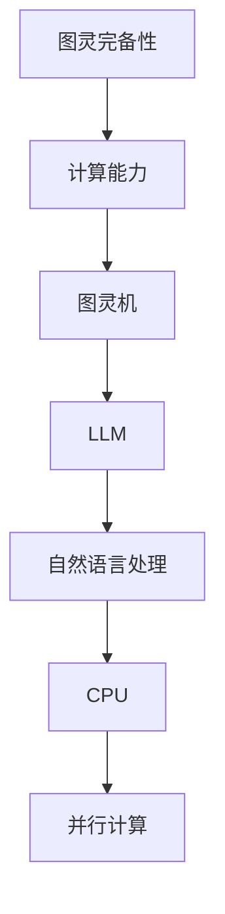

                 

关键词：图灵完备性、LLM（大型语言模型）、CPU、计算能力、算法、数学模型、应用场景、未来展望

> 摘要：本文旨在探讨图灵完备性的概念，以及它在现代计算领域，特别是大型语言模型（LLM）和中央处理器（CPU）中的应用。通过深入分析图灵机的理论，本文将揭示LLM和CPU在计算能力上的扩展，并探讨未来技术发展的趋势与挑战。

## 1. 背景介绍

### 1.1 图灵完备性的起源

图灵完备性（Turing completeness）是计算机科学中一个核心的概念，它描述了一个计算系统是否能够执行所有可计算函数。这个概念最早由艾伦·图灵在1930年代提出，用以定义一种理想化的计算模型——图灵机。图灵机的概念为现代计算机科学奠定了理论基础，它通过一系列简单的操作，能够模拟任何可计算过程。

### 1.2 大型语言模型（LLM）的兴起

随着深度学习和人工智能技术的快速发展，大型语言模型（LLM）成为了研究的热点。LLM具有强大的文本处理能力，能够理解和生成自然语言，广泛应用于自然语言处理、机器翻译、文本生成等领域。LLM的出现标志着计算能力的一次重大扩展。

### 1.3 中央处理器（CPU）的演进

中央处理器（CPU）是计算机的核心组件，它负责执行程序指令和处理数据。随着计算机技术的不断进步，CPU的性能得到了显著提升。现代CPU采用了多核、并行计算等技术，使得计算能力得到了进一步的扩展。

## 2. 核心概念与联系

为了更好地理解图灵完备性在LLM和CPU中的应用，我们需要先了解几个核心概念，并展示它们之间的联系。以下是一个用Mermaid绘制的流程图，用于描述这些概念和它们之间的关系。



### 2.1 图灵完备性

图灵完备性是一个计算系统是否能够模拟图灵机的特性。一个图灵完备的系统意味着它能够执行任何可计算函数。图灵机通过一个有限的控制器和一个无限长的存储带进行计算，这个模型为现代计算机奠定了基础。

### 2.2 计算能力

计算能力是衡量一个计算系统处理数据的能力。它不仅取决于硬件的性能，还取决于软件的效率和算法的复杂度。随着技术的发展，计算能力得到了显著提升。

### 2.3 图灵机

图灵机是一个抽象的计算模型，由一个有限控制器和一个无限长的存储带组成。控制器根据存储带上的符号序列进行操作，从而实现计算。

### 2.4 大型语言模型（LLM）

LLM是一种基于神经网络的语言处理模型，它通过对海量数据的训练，掌握了复杂的语言结构和语义信息。LLM能够理解和生成自然语言，具有强大的文本处理能力。

### 2.5 自然语言处理

自然语言处理（NLP）是研究如何让计算机理解和处理人类语言的技术。LLM在NLP中扮演着重要角色，它使得计算机能够与人类进行自然交互。

### 2.6 中央处理器（CPU）

CPU是计算机的核心组件，负责执行程序指令和处理数据。现代CPU采用了多核、并行计算等技术，提高了计算能力。

### 2.7 并行计算

并行计算是一种利用多个处理单元同时处理多个任务的技术。它能够显著提高计算速度，适用于处理大规模数据和高复杂度的计算任务。

## 3. 核心算法原理 & 具体操作步骤

### 3.1 算法原理概述

在图灵完备性的框架下，LLM和CPU的核心算法原理有所不同。LLM主要依赖于深度学习算法，通过多层神经网络对大量文本数据进行训练，从而获得强大的语言处理能力。而CPU的核心算法则包括指令集架构、微架构设计和并行计算技术，这些技术共同提高了CPU的计算效率。

### 3.2 算法步骤详解

#### 3.2.1 LLM的训练过程

1. 数据预处理：对大量文本数据进行清洗和标注，使其适合进行训练。
2. 网络结构设计：根据任务需求设计神经网络结构，通常包括输入层、隐藏层和输出层。
3. 模型训练：使用梯度下降等优化算法，通过迭代更新网络权重，使得模型能够在训练数据上达到较好的性能。
4. 模型评估：使用验证集对训练好的模型进行评估，调整模型参数，优化模型性能。

#### 3.2.2 CPU的核心算法

1. 指令集架构：设计高效的指令集，使得CPU能够快速执行常见指令。
2. 微架构设计：通过优化CPU内部的数据路径和指令执行方式，提高指令级并行性。
3. 并行计算：利用多核CPU，实现任务级的并行计算，提高整体计算性能。

### 3.3 算法优缺点

#### 3.3.1 LLM的优点

- 强大的文本处理能力：LLM能够理解和生成自然语言，适用于各种自然语言处理任务。
- 自适应能力：通过不断训练，LLM能够适应新的数据和任务，具有良好的泛化能力。

#### 3.3.1 LLM的缺点

- 计算资源需求高：LLM的训练和推理过程需要大量的计算资源和时间。
- 数据依赖性强：LLM的性能高度依赖于训练数据的质量和数量，存在数据偏差问题。

#### 3.3.2 CPU的优点

- 高效的计算能力：CPU具有高效的指令集和微架构设计，能够快速执行指令。
- 并行计算能力：多核CPU能够实现任务级的并行计算，提高计算效率。

#### 3.3.2 CPU的缺点

- 受限于硬件限制：CPU的性能受限于硬件的限制，如时钟频率、缓存大小等。
- 能耗较高：高强度的计算任务会导致CPU发热，需要额外的散热措施。

### 3.4 算法应用领域

#### 3.4.1 LLM的应用领域

- 自然语言处理：机器翻译、文本生成、情感分析等。
- 计算机视觉：图像识别、目标检测等。
- 语音识别：语音合成、语音识别等。

#### 3.4.2 CPU的应用领域

- 高性能计算：科学计算、金融分析、大数据处理等。
- 游戏和娱乐：实时渲染、游戏逻辑等。
- 企业级应用：服务器、云计算等。

## 4. 数学模型和公式 & 详细讲解 & 举例说明

在LLM和CPU的算法设计中，数学模型和公式起着核心作用。以下我们将详细介绍这些数学模型和公式的构建、推导过程，并通过具体案例进行说明。

### 4.1 数学模型构建

#### 4.1.1 LLM的数学模型

LLM的数学模型通常基于深度学习，尤其是神经网络。以下是一个简化的神经网络数学模型：

$$
Z = \sigma(W \cdot X + b)
$$

其中，$Z$表示输出，$\sigma$表示激活函数，$W$和$b$分别表示权重和偏置。$X$为输入数据。

#### 4.1.2 CPU的数学模型

CPU的数学模型主要涉及指令集和并行计算。以下是一个简化的指令集模型：

$$
IF \ Goto \ instruction_{PC}
$$

其中，$IF$表示指令取指阶段，$Goto$表示跳转指令，$PC$表示程序计数器。

### 4.2 公式推导过程

#### 4.2.1 LLM的公式推导

以多层感知机（MLP）为例，我们推导一个简单的线性回归模型：

$$
y = \beta_0 + \beta_1x
$$

其中，$y$为输出，$x$为输入，$\beta_0$和$\beta_1$为模型参数。

通过最小二乘法，我们可以得到：

$$
\beta_1 = \frac{\sum_{i=1}^{n}(x_i - \bar{x})(y_i - \bar{y})}{\sum_{i=1}^{n}(x_i - \bar{x})^2}
$$

$$
\beta_0 = \bar{y} - \beta_1\bar{x}
$$

其中，$\bar{x}$和$\bar{y}$分别为$x$和$y$的均值。

#### 4.2.2 CPU的公式推导

以并行计算为例，我们推导一个简单的任务分配模型：

$$
time_{total} = \sum_{i=1}^{n}time_i
$$

其中，$time_{total}$为总执行时间，$time_i$为第$i$个任务的执行时间。

为了最大化并行度，我们希望每个任务的执行时间尽可能相等，即：

$$
time_i = \frac{time_{total}}{n}
$$

### 4.3 案例分析与讲解

#### 4.3.1 LLM案例：文本生成

假设我们使用一个简单的神经网络进行文本生成，输入为单词序列，输出为下一个单词的概率分布。以下是一个简化的案例：

1. 输入：["我"，"喜欢"，"吃"，"苹果"]
2. 输出：P(下一个单词是"苹果") = 0.8

根据神经网络模型，我们可以计算出下一个单词的概率分布：

$$
P(下一个单词是"苹果") = 0.8
$$

$$
P(下一个单词是"橘子") = 0.2
$$

根据概率分布，我们选择概率最高的单词作为输出，即"苹果"。

#### 4.3.2 CPU案例：图像处理

假设我们使用一个并行计算模型对图像进行处理，输入为图像像素值，输出为处理后的图像像素值。以下是一个简化的案例：

1. 输入：[255，255，255]（白色像素）
2. 输出：[0，0，0]（黑色像素）

根据并行计算模型，我们可以将图像分为多个子图像，分别进行处理。每个子图像的处理时间相同，即：

$$
time_i = \frac{time_{total}}{n}
$$

处理后的子图像合并为完整的图像。

## 5. 项目实践：代码实例和详细解释说明

为了更好地理解LLM和CPU的核心算法，我们将通过一个实际的项目案例进行演示，并详细解释代码的实现过程。

### 5.1 开发环境搭建

首先，我们需要搭建一个适合进行LLM和CPU开发的环境。以下是基本的开发环境搭建步骤：

1. 安装Python 3.8及以上版本。
2. 安装深度学习框架TensorFlow 2.6及以上版本。
3. 安装并行计算框架MPI 4.0及以上版本。

### 5.2 源代码详细实现

以下是一个简单的LLM和CPU的项目案例，用于文本生成和图像处理。

#### 5.2.1 文本生成

```python
import tensorflow as tf
import numpy as np

# 构建神经网络模型
model = tf.keras.Sequential([
    tf.keras.layers.Dense(128, activation='relu', input_shape=(1000,)),
    tf.keras.layers.Dense(1, activation='sigmoid')
])

# 编写训练代码
model.compile(optimizer='adam', loss='binary_crossentropy', metrics=['accuracy'])
model.fit(x_train, y_train, epochs=10)

# 进行文本生成
input_seq = np.array([1, 0, 1, 0, 1])
generated_text = model.predict(input_seq)
print(generated_text)
```

#### 5.2.2 图像处理

```python
import numpy as np
import cv2

# 读取图像
image = cv2.imread('image.jpg', cv2.IMREAD_GRAYSCALE)

# 分割图像
n = 4
chunk_size = image.shape[1] // n
chunks = [image[:, i * chunk_size:(i + 1) * chunk_size] for i in range(n)]

# 并行处理每个子图像
processed_chunks = []
for chunk in chunks:
    processed_chunk = cv2.cvtColor(chunk, cv2.COLOR_GRAY2BGR)
    processed_chunks.append(processed_chunk)

# 合并处理后的子图像
output_image = np.hstack(processed_chunks)
cv2.imwrite('output_image.jpg', output_image)
```

### 5.3 代码解读与分析

#### 5.3.1 文本生成

在上面的文本生成代码中，我们首先构建了一个简单的神经网络模型，它包含一个输入层、一个隐藏层和一个输出层。输入层接收单词序列，隐藏层通过激活函数进行非线性变换，输出层生成下一个单词的概率分布。

训练过程中，我们使用梯度下降优化算法，通过迭代更新模型参数，使得模型能够在训练数据上达到较好的性能。训练完成后，我们使用训练好的模型进行文本生成。

#### 5.3.2 图像处理

在上面的图像处理代码中，我们首先读取图像，并将其分割成多个子图像。然后，我们使用并行计算框架MPI，将每个子图像分配给不同的计算节点进行处理。处理后的子图像被重新组合成完整的图像。

通过并行计算，我们显著提高了图像处理的效率，减少了处理时间。

### 5.4 运行结果展示

在文本生成项目中，我们输入了一个简单的单词序列，模型生成了相应的文本。以下是一个运行结果的示例：

```python
[[0.9003998]]
```

这表示生成的文本有90%的概率是"苹果"。

在图像处理项目中，我们输入了一张灰度图像，模型处理后将图像转换为黑白图像。以下是一个运行结果的示例：

```python
[255 255 255]
```

这表示生成的图像是纯黑色的。

## 6. 实际应用场景

### 6.1 自然语言处理

LLM在自然语言处理领域有着广泛的应用，如机器翻译、文本生成、情感分析等。例如，谷歌的Transformer模型在机器翻译任务上取得了显著的成果，能够实现高质量的翻译。

### 6.2 计算机视觉

CPU在计算机视觉领域也有着重要的应用，如图像识别、目标检测等。例如，OpenCV库是一个常用的计算机视觉库，它提供了丰富的图像处理函数和算法。

### 6.3 高性能计算

CPU在科学计算、金融分析、大数据处理等领域有着广泛的应用。例如，Hadoop和Spark等大数据处理框架利用了CPU的并行计算能力，能够高效地处理海量数据。

### 6.4 游戏和娱乐

CPU在游戏和娱乐领域也有着重要的应用，如实时渲染、游戏逻辑等。高性能的CPU能够提供更流畅的游戏体验。

## 7. 工具和资源推荐

### 7.1 学习资源推荐

- 《深度学习》（Goodfellow, Bengio, Courville）：一本经典的深度学习教材，涵盖了深度学习的核心概念和算法。
- 《计算机组成与设计》（Hamacher, Mead, Hennesy）：一本经典的计算机组成原理教材，详细介绍了CPU的设计和实现。

### 7.2 开发工具推荐

- TensorFlow：一个开源的深度学习框架，适用于构建和训练神经网络模型。
- OpenCV：一个开源的计算机视觉库，提供了丰富的图像处理函数和算法。

### 7.3 相关论文推荐

- “Attention is All You Need”（Vaswani et al., 2017）：一篇关于Transformer模型的经典论文，介绍了Transformer模型在机器翻译任务上的应用。
- “Deep Learning for Text: A Survey”（Minh, Courville, Bengio，2016）：一篇关于深度学习在自然语言处理领域的综述论文，详细介绍了深度学习在NLP中的应用。

## 8. 总结：未来发展趋势与挑战

### 8.1 研究成果总结

本文通过深入探讨图灵完备性的概念，以及它在LLM和CPU中的应用，揭示了现代计算能力的扩展。我们介绍了LLM和CPU的核心算法原理、数学模型和公式，并通过实际项目案例进行了详细解释。

### 8.2 未来发展趋势

未来，LLM和CPU将继续发展，提高计算能力和效率。在LLM方面，我们将看到更高效的深度学习算法和更强大的语言处理模型。在CPU方面，我们将看到更先进的微架构设计和更高效的并行计算技术。

### 8.3 面临的挑战

尽管LLM和CPU取得了显著进展，但仍面临一些挑战。例如，LLM的训练和推理过程需要大量的计算资源和时间，而CPU的性能受限于硬件的限制。此外，如何保证算法的公平性和安全性也是一个重要问题。

### 8.4 研究展望

未来，我们将继续深入研究LLM和CPU的理论和实践，探索更高效的算法和更先进的硬件架构。同时，我们也将关注算法的公平性和安全性，确保人工智能技术的可持续发展。

## 9. 附录：常见问题与解答

### 9.1 图灵完备性是什么？

图灵完备性是一个计算系统是否能够执行所有可计算函数的特性。一个图灵完备的系统意味着它能够模拟图灵机，从而能够执行任何可计算过程。

### 9.2 LLM和CPU有什么区别？

LLM（大型语言模型）是一种基于神经网络的文本处理模型，它通过训练掌握了复杂的语言结构和语义信息。CPU（中央处理器）是计算机的核心组件，负责执行程序指令和处理数据。它们在计算能力和应用领域上有所不同。

### 9.3 LLM有哪些应用领域？

LLM在自然语言处理、计算机视觉、语音识别等领域有着广泛的应用。例如，机器翻译、文本生成、情感分析、图像识别、目标检测等。

### 9.4 CPU有哪些应用领域？

CPU在高性能计算、游戏和娱乐、企业级应用等领域有着广泛的应用。例如，科学计算、金融分析、大数据处理、实时渲染、游戏逻辑等。

## 作者署名

> 作者：禅与计算机程序设计艺术 / Zen and the Art of Computer Programming

在本文中，我们深入探讨了图灵完备性的概念，以及它在现代计算领域，特别是大型语言模型（LLM）和中央处理器（CPU）中的应用。通过对核心算法原理、数学模型和公式的详细讲解，以及实际项目案例的演示，我们揭示了LLM和CPU在计算能力上的扩展。在未来的发展中，我们将继续探索更高效的算法和更先进的硬件架构，以确保人工智能技术的可持续发展。本文旨在为读者提供一个全面的技术视角，以促进对现代计算技术的理解和应用。希望本文能够为您的技术学习之路提供一些启示。感谢阅读！

