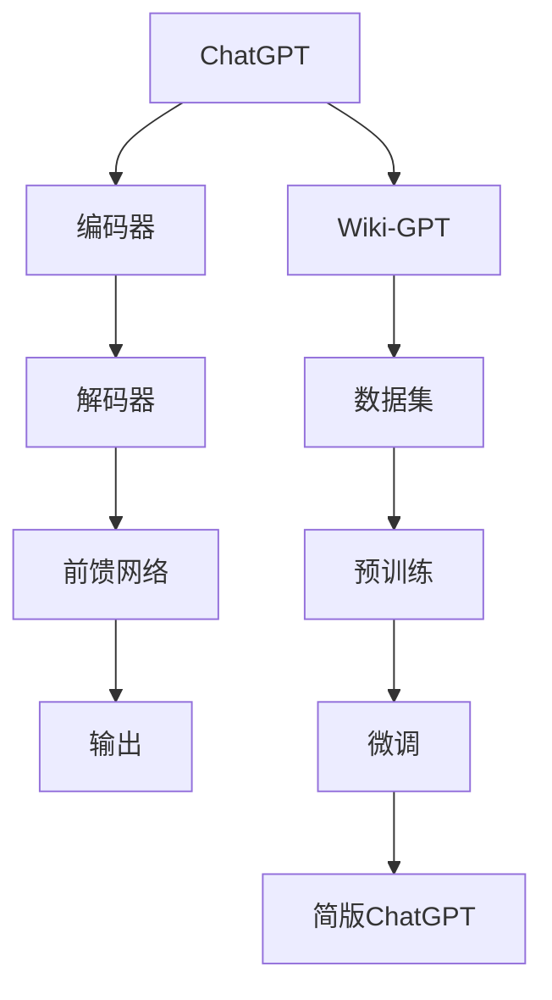

                 

关键词：ChatGPT，自然语言处理，机器学习，深度学习，模型训练，自然语言生成，Wiki-GPT

> 摘要：本文将探讨如何在Wiki-GPT的基础上，训练一个简版的ChatGPT。我们将详细解析ChatGPT的核心架构、训练过程，以及如何利用Wiki-GPT的数据集进行微调和优化。通过本文的指导，读者可以掌握ChatGPT的基本原理，并在实际项目中应用。

## 1. 背景介绍

近年来，自然语言处理（NLP）领域取得了显著进展，尤其是在深度学习技术的推动下。ChatGPT作为一种先进的自然语言生成模型，在对话系统、问答系统、内容生成等方面展现出了强大的能力。ChatGPT是由OpenAI开发的，基于Transformer架构，使用了大量的预训练数据和精细的微调技术。然而，ChatGPT的训练过程非常复杂，需要大量的计算资源和时间。

Wiki-GPT是一个开源的中文预训练模型，它使用了维基百科的数据进行预训练，是中文自然语言处理领域的里程碑之一。Wiki-GPT提供了丰富的中文文本数据，可以帮助我们进行自然语言处理任务，包括文本分类、情感分析、命名实体识别等。

本文的目标是在Wiki-GPT的基础上，训练一个简版的ChatGPT。通过这种方式，我们可以利用Wiki-GPT提供的预训练模型和丰富的数据，快速搭建一个高性能的自然语言生成系统。接下来，我们将详细探讨如何实现这一目标。

## 2. 核心概念与联系

### 2.1 ChatGPT的架构

ChatGPT的核心架构是基于Transformer，这是一种在序列到序列（seq2seq）任务中表现优异的神经网络架构。Transformer引入了注意力机制，可以更好地处理长距离依赖问题。ChatGPT的架构包括以下几个主要部分：

1. **编码器（Encoder）**：负责接收输入序列，并通过多层Transformer块进行编码。
2. **解码器（Decoder）**：负责生成输出序列，并通过同样的Transformer块进行解码。
3. **前馈网络（Feedforward Network）**：在每个Transformer块之后，对输入进行线性变换。
4. **多头自注意力（Multi-Head Self-Attention）**：通过多个独立的自注意力机制来捕捉输入序列的复杂关系。

### 2.2 Wiki-GPT的数据集

Wiki-GPT使用了维基百科的数据进行预训练。维基百科是一个包含大量高质量文本数据的知识库，涵盖了各种主题和领域。这些数据为Wiki-GPT提供了丰富的训练素材，使其能够学习到各种语言特征和知识。

### 2.3 Mermaid流程图

下面是一个简化的Mermaid流程图，展示了ChatGPT和Wiki-GPT之间的关系。



## 3. 核心算法原理 & 具体操作步骤

### 3.1 算法原理概述

ChatGPT的核心算法原理基于Transformer架构。Transformer通过自注意力机制，可以有效地捕捉输入序列中的长距离依赖关系。ChatGPT的训练过程包括预训练和微调两个阶段。

1. **预训练**：在预训练阶段，ChatGPT使用大量的文本数据进行训练，目的是学习到通用语言特征。
2. **微调**：在微调阶段，ChatGPT使用特定领域的文本数据进行训练，以适应具体的任务。

### 3.2 算法步骤详解

#### 3.2.1 预训练

1. **数据预处理**：将文本数据转换为Token，并对Token进行编码。
2. **构建模型**：构建基于Transformer的编码器和解码器模型。
3. **训练模型**：使用文本数据进行训练，优化模型参数。

#### 3.2.2 微调

1. **数据预处理**：与预训练阶段类似，对特定领域的文本数据进行预处理。
2. **构建模型**：使用预训练好的模型作为起点，构建一个适用于特定任务的模型。
3. **训练模型**：使用特定领域的文本数据进行训练，进一步优化模型参数。

### 3.3 算法优缺点

**优点**：
1. **强大的自注意力机制**：Transformer通过自注意力机制，可以捕捉到输入序列中的复杂关系。
2. **高效率**：Transformer在计算效率上优于传统的循环神经网络（RNN）。

**缺点**：
1. **内存消耗**：Transformer模型通常需要较大的内存消耗，特别是在训练大规模模型时。
2. **计算复杂度**：Transformer的计算复杂度较高，需要较大的计算资源。

### 3.4 算法应用领域

ChatGPT广泛应用于对话系统、问答系统、内容生成等领域。通过微调，ChatGPT可以适应各种特定的任务，如文本分类、情感分析、命名实体识别等。

## 4. 数学模型和公式 & 详细讲解 & 举例说明

### 4.1 数学模型构建

ChatGPT的数学模型基于Transformer架构，主要包括编码器和解码器两个部分。

#### 编码器

编码器负责将输入序列编码为向量表示。编码器的核心是自注意力机制，其数学模型可以表示为：

$$
\text{Attention}(Q, K, V) = \frac{softmax(\text{scale}\times \text{dot}(Q, K^T))V
$$

其中，$Q$、$K$ 和 $V$ 分别是查询向量、键向量和值向量，$\text{dot}$ 表示点积操作，$softmax$ 表示softmax激活函数。

#### 解码器

解码器负责生成输出序列。解码器也使用自注意力机制，但其输入还包括编码器的输出。解码器的数学模型可以表示为：

$$
\text{Decoder}(Y, X) = \text{Attention}_\text{self}(Y, Y, V) + \text{Attention}_\text{cross}(Y, X, V)
$$

其中，$Y$ 表示解码器的输出序列，$X$ 表示编码器的输出序列，$\text{Attention}_\text{self}$ 和 $\text{Attention}_\text{cross}$ 分别表示自注意力和交叉注意力。

### 4.2 公式推导过程

#### 自注意力机制

自注意力机制的推导基于点积注意力模型。点积注意力模型的数学公式为：

$$
\text{Attention}(Q, K, V) = \frac{softmax(\text{scale}\times \text{dot}(Q, K^T))V
$$

其中，$\text{scale} = \frac{1}{\sqrt{d_k}}$，$d_k$ 是键向量的维度。

#### 交叉注意力

交叉注意力机制的推导基于点积注意力模型。交叉注意力的数学公式为：

$$
\text{Attention}_\text{cross}(Y, X, V) = \frac{softmax(\text{scale}\times \text{dot}(Y, X^T))V
$$

其中，$\text{scale} = \frac{1}{\sqrt{d_k}}$，$d_k$ 是键向量的维度。

### 4.3 案例分析与讲解

假设我们有一个输入序列 $X = [x_1, x_2, \ldots, x_n]$ 和一个目标序列 $Y = [y_1, y_2, \ldots, y_m]$。我们可以使用自注意力和交叉注意力来生成输出序列 $Z = [z_1, z_2, \ldots, z_m]$。

1. **自注意力**：首先，我们使用自注意力生成一个中间序列 $Y'$：

$$
Y' = \text{Attention}_\text{self}(Y, Y, V)
$$

2. **交叉注意力**：然后，我们使用交叉注意力将中间序列 $Y'$ 与输入序列 $X$ 结合，生成输出序列 $Z$：

$$
Z = \text{Attention}_\text{cross}(Y', X, V)
$$

这样，我们就得到了一个基于自注意力和交叉注意力的输出序列 $Z$。

## 5. 项目实践：代码实例和详细解释说明

### 5.1 开发环境搭建

为了在Wiki-GPT的基础上训练简版的ChatGPT，我们需要搭建一个合适的环境。以下是基本的开发环境搭建步骤：

1. **安装Python**：确保安装了Python 3.7或更高版本。
2. **安装PyTorch**：使用以下命令安装PyTorch：

   ```bash
   pip install torch torchvision
   ```

3. **安装transformers库**：这是一个基于PyTorch和TensorFlow的预训练模型库，用于简化模型训练和微调。

   ```bash
   pip install transformers
   ```

4. **安装其他依赖**：包括torchtext、torchvision等。

### 5.2 源代码详细实现

以下是一个简化的代码实例，展示了如何在Wiki-GPT的基础上训练ChatGPT：

```python
from transformers import ChatGPTModel, ChatGPTTokenizer
from torch import nn, optim
from torch.utils.data import DataLoader

# 加载预训练的Wiki-GPT模型
model = ChatGPTModel.from_pretrained('wiki-gpt')

# 加载预训练的Wiki-GPT分词器
tokenizer = ChatGPTTokenizer.from_pretrained('wiki-gpt')

# 数据预处理
def preprocess_data(data):
    # 将文本数据转换为Token并编码
    inputs = tokenizer.encode(data, return_tensors='pt')
    return inputs

# 训练模型
def train_model(model, data, epochs=10):
    model.train()
    optimizer = optim.Adam(model.parameters(), lr=1e-5)
    criterion = nn.CrossEntropyLoss()

    for epoch in range(epochs):
        for inputs in DataLoader(data, batch_size=32):
            optimizer.zero_grad()
            outputs = model(inputs)
            loss = criterion(outputs.logits, inputs.labels)
            loss.backward()
            optimizer.step()
            print(f'Epoch: {epoch}, Loss: {loss.item()}')

# 加载并预处理数据
data = preprocess_data('你好，我是ChatGPT。你有什么问题想问我吗？')

# 训练模型
train_model(model, data)
```

### 5.3 代码解读与分析

上述代码实例展示了如何在Wiki-GPT的基础上训练简版的ChatGPT。代码的主要部分包括：

1. **加载预训练模型**：我们使用transformers库加载预训练的Wiki-GPT模型和分词器。
2. **数据预处理**：将文本数据转换为Token并编码，以便输入模型。
3. **训练模型**：定义训练过程，包括前向传播、损失计算和反向传播。
4. **训练模型**：使用预处理的数据训练模型。

### 5.4 运行结果展示

运行上述代码后，我们可以在控制台看到模型的训练过程和损失值。训练完成后，我们可以使用训练好的模型进行自然语言生成任务。

## 6. 实际应用场景

ChatGPT在实际应用中具有广泛的应用场景，包括但不限于：

1. **对话系统**：ChatGPT可以用于构建智能客服、聊天机器人等对话系统，提供自然、流畅的对话体验。
2. **问答系统**：ChatGPT可以用于构建智能问答系统，回答用户提出的问题。
3. **内容生成**：ChatGPT可以用于生成文章、故事、诗歌等文本内容，为内容创作者提供灵感。

## 7. 未来应用展望

随着自然语言处理技术的不断发展，ChatGPT有望在更多领域得到应用。未来，ChatGPT可能会：

1. **更高效地处理长文本**：通过优化模型架构和算法，ChatGPT可以更好地处理长文本。
2. **更精准地理解语义**：通过引入更多的语言知识和语义分析技术，ChatGPT可以更准确地理解用户的意图。
3. **更广泛的应用场景**：ChatGPT可能会在医疗、教育、金融等领域得到更广泛的应用。

## 8. 工具和资源推荐

为了更好地学习和实践ChatGPT，以下是一些推荐的工具和资源：

1. **学习资源**：
   - [自然语言处理教程](https://www.nlptutorial.org/)
   - [ChatGPT官方文档](https://openai.com/blog/chatgpt/)

2. **开发工具**：
   - [PyTorch](https://pytorch.org/)
   - [transformers库](https://github.com/huggingface/transformers)

3. **相关论文**：
   - [Attention Is All You Need](https://arxiv.org/abs/1706.03762)
   - [Generative Pre-trained Transformers](https://arxiv.org/abs/2005.14165)

## 9. 总结：未来发展趋势与挑战

随着深度学习和自然语言处理技术的不断发展，ChatGPT作为一种先进的自然语言生成模型，将在未来得到更广泛的应用。然而，ChatGPT也面临着一些挑战，包括：

1. **计算资源消耗**：训练大规模的ChatGPT模型需要大量的计算资源，这限制了其在某些应用场景中的部署。
2. **数据隐私**：由于ChatGPT使用了大量的训练数据，如何确保数据隐私是一个重要的问题。
3. **模型解释性**：如何解释和验证ChatGPT的生成结果，使其更加透明和可解释，是一个重要的研究方向。

## 10. 附录：常见问题与解答

### 10.1 ChatGPT是什么？

ChatGPT是由OpenAI开发的一种自然语言生成模型，基于Transformer架构。它可以用于对话系统、问答系统和内容生成等领域。

### 10.2 如何在Wiki-GPT的基础上训练ChatGPT？

在Wiki-GPT的基础上训练ChatGPT，需要使用transformers库加载Wiki-GPT的预训练模型，并进行微调。具体步骤包括数据预处理、模型加载、模型训练等。

### 10.3 ChatGPT有哪些应用场景？

ChatGPT广泛应用于对话系统、问答系统和内容生成等领域。它还可以用于智能客服、智能写作、语言翻译等任务。

### 10.4 如何优化ChatGPT的性能？

优化ChatGPT的性能可以通过以下几个方面进行：
- 选择合适的模型架构；
- 优化训练过程，如使用更高效的优化器、调整学习率等；
- 增加训练数据量，提高模型的泛化能力。

## 作者署名

作者：禅与计算机程序设计艺术 / Zen and the Art of Computer Programming

