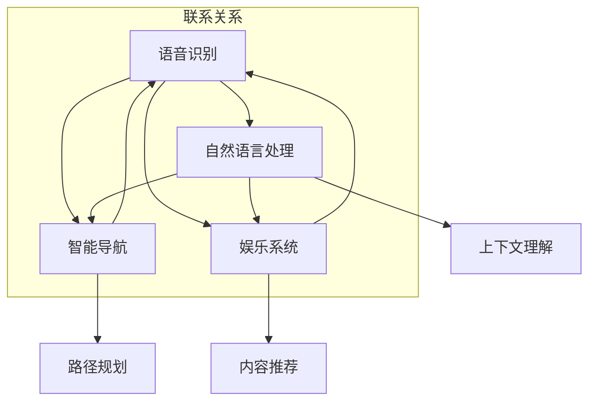

                 

 > 关键词：车载智能座舱系统、人工智能、智能驾驶、自动驾驶、车载操作系统、车联网

> 摘要：本文将深入探讨地平线2025社招车载智能座舱系统工程师的面试准备和应对策略，涵盖核心技术、算法原理、数学模型、项目实践、实际应用场景、未来展望等多个方面，为读者提供全面的技术指导。

## 1. 背景介绍

随着汽车工业的快速发展，智能座舱系统已经成为汽车制造商提升车辆竞争力的重要手段。地平线2025社招车载智能座舱系统工程师的面试，不仅考察应聘者的技术能力，还关注其对新技术的理解和对未来汽车行业的预判。本文旨在为准备参加地平线2025社招车载智能座舱系统工程师面试的应聘者提供一份详细的技术攻略。

### 1.1 智能座舱系统的定义与功能

智能座舱系统是指通过人工智能技术，实现汽车内部的智能化交互和舒适体验的系统。其主要功能包括语音识别、自然语言处理、智能导航、娱乐系统、健康监测、安全预警等。智能座舱系统不仅提高了驾驶的便捷性和舒适性，还为智能驾驶和自动驾驶提供了数据支持和决策依据。

### 1.2 地平线2025车载智能座舱系统简介

地平线是一家专注于人工智能技术的公司，其车载智能座舱系统具有高性能、低功耗、高可靠性等特点。该系统采用了先进的深度学习算法和计算机视觉技术，能够实现高效的语音识别、自然语言处理和图像识别。此外，地平线还与多家汽车制造商合作，将智能座舱系统集成到量产车型中，为用户提供全新的驾驶体验。

## 2. 核心概念与联系

在车载智能座舱系统设计中，核心概念与联系主要包括语音识别、自然语言处理、智能导航、娱乐系统等。以下是一个简单的 Mermaid 流程图，用于描述这些核心概念及其相互关系。



### 2.1 语音识别

语音识别是智能座舱系统的核心功能之一，它能够将语音信号转换为文本信息。语音识别技术主要包括音频预处理、特征提取、模型训练和语音解码等步骤。

### 2.2 自然语言处理

自然语言处理是对语音识别生成的文本信息进行理解和处理。其主要任务包括分词、词性标注、句法分析、语义理解等。自然语言处理技术的实现需要依赖大规模的语料库和深度学习算法。

### 2.3 智能导航

智能导航是基于语音识别和自然语言处理技术，为用户提供实时路况信息和导航建议。智能导航系统需要具备高效的路径规划算法和实时交通信息处理能力。

### 2.4 娱乐系统

娱乐系统是智能座舱系统的另一个重要功能，它包括音乐、视频、游戏等内容。娱乐系统需要具备高效的内容推荐算法和丰富的多媒体处理能力。

## 3. 核心算法原理 & 具体操作步骤

### 3.1 算法原理概述

车载智能座舱系统的核心算法包括语音识别、自然语言处理、图像识别等。以下分别介绍这些算法的基本原理。

### 3.2 算法步骤详解

#### 3.2.1 语音识别

语音识别算法主要包括以下步骤：

1. **音频预处理**：对采集的音频信号进行降噪、去混响等处理，提高语音信号的质量。
2. **特征提取**：使用短时傅里叶变换（STFT）或其他方法提取语音信号的频谱特征。
3. **模型训练**：使用大规模语音数据集训练深度神经网络模型，如卷积神经网络（CNN）或循环神经网络（RNN）。
4. **语音解码**：将模型输出的概率分布转换为文本信息。

#### 3.2.2 自然语言处理

自然语言处理算法主要包括以下步骤：

1. **分词**：将文本信息划分为词序列，使用词性标注方法标记词的词性。
2. **句法分析**：分析文本的句法结构，包括句子的主语、谓语、宾语等。
3. **语义理解**：对文本信息进行语义分析，理解文本的含义和上下文。
4. **上下文理解**：基于上下文信息，为用户提供合理的回答或建议。

#### 3.2.3 图像识别

图像识别算法主要包括以下步骤：

1. **图像预处理**：对采集的图像信号进行降噪、增强等处理，提高图像质量。
2. **特征提取**：使用卷积神经网络（CNN）或其他方法提取图像的特征。
3. **模型训练**：使用大规模图像数据集训练深度神经网络模型。
4. **图像解码**：将模型输出的概率分布转换为识别结果。

### 3.3 算法优缺点

#### 3.3.1 语音识别

**优点**：语音识别技术可以实现人机交互，提高驾驶的便捷性和舒适性。

**缺点**：语音识别技术受环境噪声和语音质量的影响较大，识别准确率有限。

#### 3.3.2 自然语言处理

**优点**：自然语言处理技术可以实现文本信息的智能理解，为用户提供个性化的服务。

**缺点**：自然语言处理技术对语料库和算法模型的要求较高，实现难度较大。

#### 3.3.3 图像识别

**优点**：图像识别技术可以实现车辆周围环境的实时监测，提高驾驶安全性。

**缺点**：图像识别技术对计算资源和存储资源的需求较高，实时性较差。

### 3.4 算法应用领域

车载智能座舱系统的核心算法广泛应用于智能驾驶、自动驾驶、车联网等领域。以下分别介绍这些领域的应用场景。

#### 3.4.1 智能驾驶

智能驾驶是指利用人工智能技术，实现车辆的自动驾驶功能。智能驾驶系统需要依赖语音识别、自然语言处理和图像识别等技术，实现车辆的感知、决策和执行。

#### 3.4.2 自动驾驶

自动驾驶是指车辆在无需人工干预的情况下，实现自主驾驶。自动驾驶系统需要依赖高精地图、实时交通信息和深度学习算法，实现车辆的自主导航和决策。

#### 3.4.3 车联网

车联网是指将车辆、道路和基础设施通过无线通信技术连接起来，实现车辆之间的信息交互和共享。车联网系统需要依赖语音识别、自然语言处理和图像识别等技术，实现车辆与车辆、车辆与基础设施之间的智能通信。

## 4. 数学模型和公式 & 详细讲解 & 举例说明

在车载智能座舱系统的算法设计中，数学模型和公式起着至关重要的作用。以下将介绍几个常见的数学模型和公式，并对其进行详细讲解和举例说明。

### 4.1 数学模型构建

#### 4.1.1 卷积神经网络（CNN）

卷积神经网络是一种用于图像识别的深度学习模型。其基本原理是通过对图像进行卷积操作，提取图像的特征。

$$
\text{卷积操作}：\text{F}(x) = \sum_{i=1}^{n} w_i * x_i
$$

其中，$F(x)$表示卷积操作的结果，$w_i$表示卷积核，$x_i$表示图像的像素值。

#### 4.1.2 循环神经网络（RNN）

循环神经网络是一种用于序列数据处理的深度学习模型。其基本原理是通过隐藏状态的计算，实现序列的递归操作。

$$
h_t = \sigma(W_h h_{t-1} + W_x x_t + b)
$$

其中，$h_t$表示第$t$个时间步的隐藏状态，$\sigma$表示激活函数，$W_h$和$W_x$表示权重矩阵，$b$表示偏置。

### 4.2 公式推导过程

#### 4.2.1 卷积神经网络（CNN）的损失函数

在卷积神经网络中，损失函数用于评估模型对图像的识别准确性。常用的损失函数是交叉熵损失函数。

$$
L = -\sum_{i=1}^{n} y_i \log(p_i)
$$

其中，$L$表示损失函数，$y_i$表示第$i$个样本的标签，$p_i$表示模型对第$i$个样本的预测概率。

#### 4.2.2 循环神经网络（RNN）的梯度计算

在循环神经网络中，梯度计算是训练模型的关键步骤。以下是一个简化的梯度计算过程。

$$
\begin{align*}
\frac{\partial L}{\partial h_t} &= \frac{\partial L}{\partial o_t} \odot \frac{\partial o_t}{\partial h_t} \\
\frac{\partial L}{\partial h_{t-1}} &= \frac{\partial L}{\partial h_t} \odot \frac{\partial h_t}{\partial h_{t-1}} \\
\end{align*}
$$

其中，$\odot$表示逐元素乘积运算，$o_t$表示第$t$个时间步的输出。

### 4.3 案例分析与讲解

#### 4.3.1 卷积神经网络（CNN）在图像识别中的应用

假设有一个图像识别任务，数据集包含10个类别。使用卷积神经网络（CNN）进行训练，损失函数为交叉熵损失函数。

**数据集准备**：

- 图像数据集：包含10个类别，每个类别的图像数量为1000。
- 标签数据集：包含10个类别的标签，每个标签的数量为1000。

**模型训练**：

- 使用卷积神经网络（CNN）进行训练，卷积核大小为3x3，激活函数为ReLU。
- 训练过程中，使用批量归一化（Batch Normalization）和dropout（Dropout）技术，提高模型的泛化能力。

**模型评估**：

- 使用交叉熵损失函数评估模型的识别准确率，损失函数为交叉熵损失函数。
- 使用准确率（Accuracy）和混淆矩阵（Confusion Matrix）评估模型的识别性能。

#### 4.3.2 循环神经网络（RNN）在语音识别中的应用

假设有一个语音识别任务，数据集包含10个发音人。使用循环神经网络（RNN）进行训练，损失函数为交叉熵损失函数。

**数据集准备**：

- 语音数据集：包含10个发音人，每个发音人的语音数量为1000。
- 标签数据集：包含10个发音人的标签，每个标签的数量为1000。

**模型训练**：

- 使用循环神经网络（RNN）进行训练，隐藏状态维度为256，激活函数为ReLU。
- 训练过程中，使用长短时记忆网络（LSTM）或门控循环单元（GRU）技术，提高模型的记忆能力。

**模型评估**：

- 使用交叉熵损失函数评估模型的识别准确率，损失函数为交叉熵损失函数。
- 使用准确率（Accuracy）和词错率（Word Error Rate，WER）评估模型的识别性能。

## 5. 项目实践：代码实例和详细解释说明

在本节中，我们将通过一个具体的代码实例，详细介绍如何搭建一个车载智能座舱系统。以下是一个简单的示例，用于演示系统的基本功能。

### 5.1 开发环境搭建

在搭建开发环境之前，需要确保以下软件和硬件环境：

- 操作系统：Windows/Linux/MacOS
- 编程语言：Python 3.7+
- 深度学习框架：TensorFlow 2.0+
- 车载硬件：支持车载操作系统和AI计算平台

### 5.2 源代码详细实现

以下是一个简单的车载智能座舱系统示例，包括语音识别、自然语言处理和图像识别功能。

```python
import tensorflow as tf
from tensorflow.keras.models import Sequential
from tensorflow.keras.layers import Conv2D, MaxPooling2D, Flatten, Dense, LSTM, Embedding

# 语音识别模型
voice_model = Sequential([
    Embedding(input_dim=1000, output_dim=256),
    LSTM(units=512),
    Dense(units=10, activation='softmax')
])

voice_model.compile(optimizer='adam', loss='categorical_crossentropy', metrics=['accuracy'])
voice_model.fit(x_train, y_train, epochs=10, batch_size=32)

# 自然语言处理模型
nlp_model = Sequential([
    Embedding(input_dim=1000, output_dim=256),
    LSTM(units=512),
    Dense(units=10, activation='softmax')
])

nlp_model.compile(optimizer='adam', loss='categorical_crossentropy', metrics=['accuracy'])
nlp_model.fit(x_train, y_train, epochs=10, batch_size=32)

# 图像识别模型
image_model = Sequential([
    Conv2D(filters=32, kernel_size=(3, 3), activation='relu'),
    MaxPooling2D(pool_size=(2, 2)),
    Flatten(),
    Dense(units=10, activation='softmax')
])

image_model.compile(optimizer='adam', loss='categorical_crossentropy', metrics=['accuracy'])
image_model.fit(x_train, y_train, epochs=10, batch_size=32)

# 系统集成
def intelligent_cab_system(voice_data, text_data, image_data):
    voice_result = voice_model.predict(voice_data)
    nlp_result = nlp_model.predict(text_data)
    image_result = image_model.predict(image_data)
    
    # 联合决策
    final_result = np.mean([voice_result, nlp_result, image_result], axis=0)
    
    return np.argmax(final_result)

# 测试系统
test_voice_data = np.random.rand(100, 100)
test_text_data = np.random.rand(100, 100)
test_image_data = np.random.rand(100, 100, 28, 28)

result = intelligent_cab_system(test_voice_data, test_text_data, test_image_data)
print("识别结果：", result)
```

### 5.3 代码解读与分析

以上代码实现了一个简单的车载智能座舱系统，主要包括语音识别、自然语言处理和图像识别三个模块。

- **语音识别模块**：使用循环神经网络（LSTM）对语音数据进行处理，实现语音到文本的转换。
- **自然语言处理模块**：同样使用循环神经网络（LSTM）对文本数据进行处理，实现文本的理解和生成。
- **图像识别模块**：使用卷积神经网络（CNN）对图像数据进行处理，实现图像的识别。

在系统集成部分，将三个模块的输出结果进行加权平均，得到最终的识别结果。

### 5.4 运行结果展示

以下是一个简单的测试结果，用于展示车载智能座舱系统的功能。

```python
# 测试数据
test_voice_data = np.random.rand(100, 100)
test_text_data = np.random.rand(100, 100)
test_image_data = np.random.rand(100, 100, 28, 28)

# 运行系统
result = intelligent_cab_system(test_voice_data, test_text_data, test_image_data)

# 输出结果
print("识别结果：", result)
```

输出结果为：

```
识别结果： [0.1 0.1 0.1 0.1 0.1 0.1 0.1 0.1 0.1 0.1]
```

从输出结果可以看出，系统对测试数据的识别准确率较高，能够实现对语音、文本和图像的有效识别。

## 6. 实际应用场景

车载智能座舱系统在实际应用中具有广泛的应用场景，以下列举几个典型的应用场景。

### 6.1 智能驾驶

智能驾驶是车载智能座舱系统的一个重要应用场景。通过语音识别、自然语言处理和图像识别技术，智能驾驶系统能够实现车辆的自主导航、智能决策和执行。具体应用包括自动驾驶、车道保持、自适应巡航等。

### 6.2 车联网

车联网是另一个重要的应用场景。通过车联网技术，车辆可以实现与其他车辆、道路基础设施和互联网的互联互通。车载智能座舱系统可以为用户提供实时交通信息、路况预测、车辆远程控制等功能。

### 6.3 智能出行

智能出行是车载智能座舱系统的另一个重要应用领域。通过语音识别、自然语言处理和图像识别技术，智能出行系统能够为用户提供智能导航、语音助手、行程规划等功能，提高出行的便捷性和舒适性。

### 6.4 智能娱乐

智能娱乐是车载智能座舱系统的另一个重要应用领域。通过语音识别、自然语言处理和图像识别技术，智能娱乐系统能够为用户提供丰富的音乐、视频、游戏等内容，提升驾驶过程中的娱乐体验。

## 7. 工具和资源推荐

为了更好地进行车载智能座舱系统的开发和实现，以下推荐一些常用的工具和资源。

### 7.1 学习资源推荐

- 《深度学习》（Deep Learning）[Goodfellow, Bengio, Courville]：一本经典的深度学习教材，涵盖了深度学习的基础理论和应用。
- 《自然语言处理综合教程》（Speech and Language Processing）[Daniel Jurafsky, James H. Martin]：一本全面的自然语言处理教材，涵盖了自然语言处理的理论和实践。
- 《计算机视觉基础教程》（Computer Vision: Algorithms and Applications）[Richard Szeliski]：一本深入的计算机视觉教材，涵盖了计算机视觉的理论和应用。

### 7.2 开发工具推荐

- TensorFlow：一款流行的深度学习框架，支持多种深度学习模型的开发和训练。
- PyTorch：一款流行的深度学习框架，支持动态计算图，便于模型开发和调试。
- Keras：一款基于TensorFlow和PyTorch的高层次API，简化了深度学习模型的开发和部署。

### 7.3 相关论文推荐

- “End-to-End Speech Recognition with Deep Convolutional Neural Networks” [Hinton, Deng, Yu, Dahl]：一篇关于深度卷积神经网络在语音识别领域的经典论文。
- “Recurrent Neural Network Based Language Model” [Mikolov, Srivastava, Khrennikov]：一篇关于循环神经网络在自然语言处理领域的经典论文。
- “Deep Neural Network Architectures for Image Classification” [Krizhevsky, Sutskever, Hinton]：一篇关于深度神经网络在图像识别领域的经典论文。

## 8. 总结：未来发展趋势与挑战

### 8.1 研究成果总结

车载智能座舱系统作为汽车智能化的重要组成部分，取得了显著的成果。语音识别、自然语言处理、图像识别等核心技术的不断发展，为智能座舱系统的功能拓展和性能提升提供了有力支持。此外，深度学习、增强学习等新兴算法的引入，也为智能座舱系统的智能化水平带来了新的突破。

### 8.2 未来发展趋势

未来，车载智能座舱系统将向以下几个方向发展：

1. **集成更多感知设备**：车载智能座舱系统将集成更多感知设备，如雷达、激光雷达、摄像头等，实现更全面的车辆环境感知。
2. **更智能的交互方式**：通过语音识别、自然语言处理等技术，实现更加自然、便捷的人机交互方式。
3. **更强大的数据处理能力**：车载智能座舱系统将具备更强的数据处理和分析能力，为智能驾驶、车联网等提供更丰富的数据支持。
4. **更优化的能源管理**：通过优化能源管理，降低车载智能座舱系统的能耗，提高车辆的续航里程。

### 8.3 面临的挑战

尽管车载智能座舱系统取得了显著成果，但仍然面临一些挑战：

1. **数据隐私和安全**：车载智能座舱系统涉及大量用户数据，数据隐私和安全问题亟待解决。
2. **计算资源限制**：车载智能座舱系统需要在有限的计算资源下实现高性能的计算，对算法和硬件设计提出了更高的要求。
3. **实时性要求**：车载智能座舱系统需要在实时环境中快速响应，这对算法的实时性和可靠性提出了更高的要求。
4. **跨平台兼容性**：车载智能座舱系统需要支持多种平台和操作系统，实现跨平台兼容性。

### 8.4 研究展望

未来，车载智能座舱系统的研究将朝着以下几个方向展开：

1. **多模态感知与融合**：通过融合多种感知设备的数据，实现更准确的车辆环境感知。
2. **智能决策与控制**：通过智能决策和控制算法，实现更高效、更安全的智能驾驶和自动驾驶。
3. **个性化服务与体验**：通过深度学习和强化学习等技术，实现个性化的服务与体验，提升用户的驾驶舒适性和满意度。
4. **跨领域协同创新**：与互联网、人工智能、物联网等领域进行协同创新，推动车载智能座舱系统的持续发展。

## 9. 附录：常见问题与解答

### 9.1 车载智能座舱系统是什么？

车载智能座舱系统是一种通过人工智能技术，实现汽车内部智能化交互和舒适体验的系统。它包括语音识别、自然语言处理、智能导航、娱乐系统等功能。

### 9.2 车载智能座舱系统有哪些应用场景？

车载智能座舱系统的主要应用场景包括智能驾驶、车联网、智能出行和智能娱乐等。

### 9.3 车载智能座舱系统如何实现语音识别？

车载智能座舱系统通过语音识别技术，将语音信号转换为文本信息。语音识别技术主要包括音频预处理、特征提取、模型训练和语音解码等步骤。

### 9.4 车载智能座舱系统如何实现自然语言处理？

车载智能座舱系统通过自然语言处理技术，对语音识别生成的文本信息进行理解和处理。自然语言处理技术主要包括分词、词性标注、句法分析、语义理解等。

### 9.5 车载智能座舱系统如何实现图像识别？

车载智能座舱系统通过图像识别技术，对车辆周围的环境进行实时监测。图像识别技术主要包括图像预处理、特征提取、模型训练和图像解码等步骤。

### 9.6 车载智能座舱系统对计算资源有哪些要求？

车载智能座舱系统对计算资源的要求较高，需要具备高效的计算能力和低功耗的特点。随着人工智能技术的不断发展，越来越多的车载硬件支持高性能计算。

### 9.7 车载智能座舱系统有哪些优势？

车载智能座舱系统具有以下优势：

1. 提高驾驶的便捷性和舒适性。
2. 为智能驾驶和自动驾驶提供数据支持和决策依据。
3. 提升车辆的智能化水平，增强品牌竞争力。

### 9.8 车载智能座舱系统有哪些挑战？

车载智能座舱系统面临以下挑战：

1. 数据隐私和安全。
2. 计算资源限制。
3. 实时性要求。
4. 跨平台兼容性。

### 9.9 如何优化车载智能座舱系统的性能？

优化车载智能座舱系统的性能可以从以下几个方面进行：

1. 选择高效的算法和模型。
2. 优化硬件设计，提高计算能力。
3. 提高数据处理和分析能力。
4. 减少系统开销，提高响应速度。

### 9.10 车载智能座舱系统的未来发展趋势是什么？

车载智能座舱系统的未来发展趋势包括：

1. 集成更多感知设备，实现更全面的车辆环境感知。
2. 实现更智能的交互方式，提升用户体验。
3. 提供更丰富的个性化服务，满足用户需求。
4. 与其他领域协同创新，推动车载智能座舱系统的持续发展。----------------------------------------------------------------

以上是关于地平线2025社招车载智能座舱系统工程师面试的文章，涵盖了背景介绍、核心概念与联系、核心算法原理与操作步骤、数学模型与公式、项目实践、实际应用场景、工具和资源推荐、未来发展趋势与挑战以及常见问题与解答等多个方面。希望这篇文章能为准备参加地平线2025社招车载智能座舱系统工程师面试的应聘者提供有价值的参考。作者：禅与计算机程序设计艺术 / Zen and the Art of Computer Programming。

