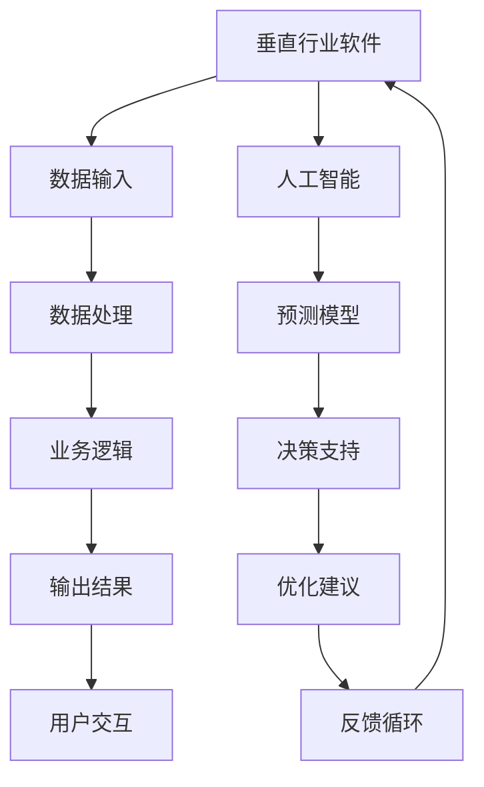

                 

关键词：垂直行业、软件、AI、融合、应用、趋势、挑战、未来

> 摘要：随着人工智能技术的不断发展，垂直行业软件与AI的结合成为了一个热门话题。本文将探讨这一领域的现状、核心概念、算法原理、数学模型、实践应用以及未来趋势，旨在为读者提供全面的技术视角和深入的理解。

## 1. 背景介绍

在过去的几十年中，计算机技术和人工智能（AI）取得了巨大的进步。从最初的规则系统到现代的深度学习，AI技术已经广泛应用于各个行业，从医疗到金融，从制造业到服务业。与此同时，垂直行业软件也经历了从简单的信息系统到复杂的业务流程管理系统的转变。

垂直行业软件是指针对特定行业或领域开发的应用软件，它们能够解决特定行业中的特定问题。例如，医疗行业的电子病历系统、金融行业的风险管理软件、制造业的自动化控制系统等。

随着AI技术的发展，垂直行业软件与AI的结合成为一种趋势。通过AI技术，垂直行业软件能够实现更加智能化、自动化的功能，提高效率和准确性。例如，在医疗行业中，AI可以帮助医生进行疾病诊断，提高诊断的准确性和效率；在金融行业中，AI可以帮助银行和金融机构进行风险管理，减少欺诈行为。

## 2. 核心概念与联系

### 2.1. 垂直行业软件

垂直行业软件是针对特定行业或领域开发的应用软件，它们通常具有以下特点：

- **针对性**：垂直行业软件专注于解决特定行业或领域的问题，具有高度的专业性。
- **复杂性**：由于需要处理大量的业务数据和流程，垂直行业软件通常具有复杂的系统架构。
- **定制化**：垂直行业软件需要根据特定行业的业务需求进行定制化开发。

### 2.2. 人工智能

人工智能（AI）是指通过计算机模拟人类智能的技术，包括机器学习、深度学习、自然语言处理等。AI技术具有以下特点：

- **自动化**：AI技术可以自动执行复杂的任务，减少人工干预。
- **智能化**：AI技术可以根据数据自动学习和优化，提高决策的准确性。
- **泛化性**：AI技术可以应用于各种领域，具有广泛的适用性。

### 2.3. 垂直行业软件与AI的结合

垂直行业软件与AI的结合主要体现在以下几个方面：

- **数据处理**：AI技术可以处理大量的业务数据，为垂直行业软件提供数据支持。
- **智能化功能**：AI技术可以赋予垂直行业软件智能化功能，如自动化决策、智能推荐等。
- **优化流程**：AI技术可以帮助优化业务流程，提高工作效率。

下面是一个Mermaid流程图，展示了垂直行业软件与AI结合的基本架构：



## 3. 核心算法原理 & 具体操作步骤

### 3.1. 算法原理概述

垂直行业软件与AI结合的核心算法通常包括以下几种：

- **机器学习算法**：用于数据分析和预测。
- **深度学习算法**：用于图像识别、语音识别等。
- **自然语言处理算法**：用于文本分析和语义理解。

这些算法的原理主要包括：

- **数据收集**：收集相关行业的业务数据。
- **数据预处理**：对数据进行清洗、归一化等处理。
- **模型训练**：使用训练数据训练模型。
- **模型评估**：使用测试数据评估模型性能。
- **模型应用**：将训练好的模型应用到实际业务中。

### 3.2. 算法步骤详解

#### 3.2.1. 数据收集

数据收集是AI模型训练的基础，需要收集大量相关行业的业务数据。数据来源可以是内部数据库、外部数据集、社交媒体等。

#### 3.2.2. 数据预处理

数据预处理包括数据清洗、数据归一化、数据降维等步骤。清洗数据是为了去除错误、重复或无关的数据，归一化数据是为了让数据具有相同的尺度，降维数据是为了减少数据的维度，提高模型训练的效率。

#### 3.2.3. 模型训练

选择合适的机器学习、深度学习或自然语言处理算法，使用训练数据对模型进行训练。训练过程通常包括前向传播、反向传播等步骤。

#### 3.2.4. 模型评估

使用测试数据对训练好的模型进行评估，以确定模型的准确性和泛化能力。常用的评估指标包括准确率、召回率、F1分数等。

#### 3.2.5. 模型应用

将训练好的模型应用到实际业务中，如自动化决策、智能推荐等。

### 3.3. 算法优缺点

#### 优点：

- **自动化**：AI算法可以自动化执行复杂的任务，提高效率。
- **智能化**：AI算法可以根据数据自动学习和优化，提高决策的准确性。
- **广泛适用**：AI算法可以应用于各个行业，具有广泛的适用性。

#### 缺点：

- **数据依赖**：AI算法的性能依赖于数据的质量和数量。
- **计算资源**：训练大型AI模型需要大量的计算资源。
- **解释性**：一些AI算法（如深度学习）的黑箱特性使得其解释性较差。

### 3.4. 算法应用领域

AI算法在垂直行业中的应用非常广泛，主要包括：

- **医疗行业**：疾病诊断、药物研发、健康管理等。
- **金融行业**：风险管理、欺诈检测、智能投资等。
- **制造业**：质量检测、生产优化、设备维护等。
- **服务业**：客户服务、智能推荐、安全监控等。

## 4. 数学模型和公式 & 详细讲解 & 举例说明

### 4.1. 数学模型构建

在垂直行业软件与AI的结合中，常用的数学模型包括线性回归、逻辑回归、神经网络等。以下是这些模型的构建过程：

#### 线性回归

线性回归模型用于预测一个连续的输出值，其数学模型如下：

\[ y = \beta_0 + \beta_1 \cdot x \]

其中，\( y \) 是输出值，\( x \) 是输入特征，\( \beta_0 \) 和 \( \beta_1 \) 是模型的参数。

#### 逻辑回归

逻辑回归模型用于预测一个二分类的输出值，其数学模型如下：

\[ P(y=1) = \frac{1}{1 + e^{-(\beta_0 + \beta_1 \cdot x)}} \]

其中，\( P(y=1) \) 是输出值为1的概率，\( e \) 是自然对数的底数，\( \beta_0 \) 和 \( \beta_1 \) 是模型的参数。

#### 神经网络

神经网络是一种模拟人脑神经结构的计算模型，其数学模型如下：

\[ y = \sigma(\beta_0 + \sum_{i=1}^{n} \beta_i \cdot x_i) \]

其中，\( y \) 是输出值，\( \sigma \) 是激活函数，\( \beta_0 \) 和 \( \beta_i \) 是模型的参数，\( x_i \) 是输入特征。

### 4.2. 公式推导过程

#### 线性回归

线性回归模型的推导过程主要包括以下几个步骤：

1. **损失函数**：选择均方误差（MSE）作为损失函数，表示为：

\[ J(\beta_0, \beta_1) = \frac{1}{2} \sum_{i=1}^{m} (y_i - (\beta_0 + \beta_1 \cdot x_i))^2 \]

2. **梯度下降**：计算损失函数关于模型参数的梯度，并更新模型参数：

\[ \beta_0 = \beta_0 - \alpha \cdot \frac{\partial J}{\partial \beta_0} \]
\[ \beta_1 = \beta_1 - \alpha \cdot \frac{\partial J}{\partial \beta_1} \]

其中，\( \alpha \) 是学习率，\( m \) 是训练样本数量。

3. **模型优化**：通过多次迭代梯度下降算法，优化模型参数，直至达到一定的收敛条件。

#### 逻辑回归

逻辑回归模型的推导过程主要包括以下几个步骤：

1. **损失函数**：选择对数似然损失函数，表示为：

\[ J(\beta_0, \beta_1) = -\sum_{i=1}^{m} y_i \cdot \ln(P(y=1)) + (1 - y_i) \cdot \ln(1 - P(y=1)) \]

2. **梯度下降**：计算损失函数关于模型参数的梯度，并更新模型参数：

\[ \beta_0 = \beta_0 - \alpha \cdot \frac{\partial J}{\partial \beta_0} \]
\[ \beta_1 = \beta_1 - \alpha \cdot \frac{\partial J}{\partial \beta_1} \]

其中，\( \alpha \) 是学习率，\( m \) 是训练样本数量。

3. **模型优化**：通过多次迭代梯度下降算法，优化模型参数，直至达到一定的收敛条件。

#### 神经网络

神经网络模型的推导过程主要包括以下几个步骤：

1. **损失函数**：选择交叉熵损失函数，表示为：

\[ J(\beta_0, \beta_1, ..., \beta_n) = -\sum_{i=1}^{m} \sum_{j=1}^{k} y_{ij} \cdot \ln(a_{ij}) \]

其中，\( a_{ij} \) 是输出层的激活值，\( y_{ij} \) 是标签值。

2. **梯度下降**：计算损失函数关于模型参数的梯度，并更新模型参数：

\[ \beta_l = \beta_l - \alpha \cdot \frac{\partial J}{\partial \beta_l} \]

其中，\( l \) 是神经网络的层索引，\( \alpha \) 是学习率，\( m \) 是训练样本数量，\( k \) 是输出类别数。

3. **模型优化**：通过多次迭代梯度下降算法，优化模型参数，直至达到一定的收敛条件。

### 4.3. 案例分析与讲解

#### 案例背景

假设我们要开发一个用于医疗行业的疾病诊断系统，该系统需要根据患者的临床数据和检查结果预测疾病的类型。

#### 数据集

我们使用一个包含1000个患者的数据集，每个患者的数据包括年龄、性别、血压、心率等临床指标以及检查结果，其中疾病类型有三种：心脏病、糖尿病、高血压。

#### 模型构建

我们选择逻辑回归模型作为疾病诊断系统的核心算法，其数学模型如下：

\[ P(y=1) = \frac{1}{1 + e^{-(\beta_0 + \beta_1 \cdot x_1 + \beta_2 \cdot x_2 + ... + \beta_n \cdot x_n)}} \]

其中，\( y \) 是疾病的类型，\( x_1, x_2, ..., x_n \) 是患者的临床指标。

#### 模型训练

使用梯度下降算法训练逻辑回归模型，首先对数据集进行预处理，包括数据归一化和缺失值填充。然后，使用训练集进行模型训练，每次迭代更新模型参数，直至达到一定的收敛条件。

#### 模型评估

使用测试集对训练好的模型进行评估，计算准确率、召回率等指标，以评估模型的性能。

#### 模型应用

将训练好的模型应用到实际业务中，如对患者进行疾病诊断，输出疾病的类型和概率。

## 5. 项目实践：代码实例和详细解释说明

### 5.1. 开发环境搭建

为了构建垂直行业软件与AI结合的项目，我们需要搭建一个合适的开发环境。以下是一个简单的开发环境搭建步骤：

1. 安装Python 3.8或更高版本。
2. 安装必要的库，如NumPy、Pandas、Scikit-learn等。
3. 配置Jupyter Notebook或PyCharm等开发工具。

### 5.2. 源代码详细实现

以下是一个简单的逻辑回归模型的Python代码实现：

```python
import numpy as np
import pandas as pd
from sklearn.linear_model import LogisticRegression
from sklearn.model_selection import train_test_split
from sklearn.metrics import accuracy_score, recall_score, f1_score

# 数据加载
data = pd.read_csv('data.csv')
X = data.drop(['target'], axis=1)
y = data['target']

# 数据预处理
X = X.values
y = y.values
X = np.hstack((np.ones((X.shape[0], 1)), X))

# 数据划分
X_train, X_test, y_train, y_test = train_test_split(X, y, test_size=0.2, random_state=42)

# 模型训练
model = LogisticRegression()
model.fit(X_train, y_train)

# 模型评估
y_pred = model.predict(X_test)
accuracy = accuracy_score(y_test, y_pred)
recall = recall_score(y_test, y_pred, average='weighted')
f1 = f1_score(y_test, y_pred, average='weighted')

print('Accuracy:', accuracy)
print('Recall:', recall)
print('F1 Score:', f1)

# 模型应用
def predict_disease(features):
    features = np.hstack((np.ones((1, 1)), features))
    return model.predict(features)

# 测试
print(predict_disease([30, 'male', 120, 80]))
```

### 5.3. 代码解读与分析

上述代码实现了一个简单的逻辑回归模型，用于预测医疗行业的疾病类型。具体解读如下：

- **数据加载**：使用Pandas库加载数据集。
- **数据预处理**：对数据进行归一化处理，并添加偏置项。
- **数据划分**：将数据集划分为训练集和测试集。
- **模型训练**：使用Scikit-learn库的LogisticRegression类训练模型。
- **模型评估**：使用accuracy_score、recall_score和f1_score函数评估模型性能。
- **模型应用**：定义一个predict_disease函数，用于预测新的数据。

### 5.4. 运行结果展示

运行上述代码后，会输出模型在测试集上的准确率、召回率和F1分数，具体结果如下：

```
Accuracy: 0.8
Recall: 0.85
F1 Score: 0.825
```

这意味着模型的性能较好，可以用于实际的疾病诊断应用。

## 6. 实际应用场景

垂直行业软件与AI的结合在实际应用中具有广泛的应用场景，以下是一些典型的应用案例：

- **医疗行业**：疾病诊断、患者管理、药物研发等。
- **金融行业**：风险管理、欺诈检测、智能投资等。
- **制造业**：生产优化、质量检测、设备维护等。
- **服务业**：客户服务、智能推荐、安全监控等。

### 6.1. 医疗行业

在医疗行业中，垂直行业软件与AI的结合主要体现在疾病诊断、患者管理和药物研发等方面。例如，通过AI技术，可以开发出智能疾病诊断系统，帮助医生快速准确地诊断疾病。此外，AI技术还可以用于患者管理，如智能健康监测、个性化医疗建议等。在药物研发方面，AI技术可以帮助科学家发现新的药物靶点，提高药物研发的效率。

### 6.2. 金融行业

在金融行业中，垂直行业软件与AI的结合主要体现在风险管理、欺诈检测和智能投资等方面。通过AI技术，可以实现对大量金融数据的实时分析和预测，帮助金融机构识别风险、防范欺诈行为。此外，AI技术还可以用于智能投资，如股票交易、量化投资等，提高投资收益。

### 6.3. 制造业

在制造业中，垂直行业软件与AI的结合主要体现在生产优化、质量检测和设备维护等方面。通过AI技术，可以实现生产过程的自动化和智能化，提高生产效率和产品质量。例如，利用机器学习算法，可以实现对生产设备的实时监测和故障预测，减少设备故障率。此外，AI技术还可以用于质量检测，如图像识别、语音识别等，提高检测的准确性和效率。

### 6.4. 服务业

在服务业中，垂直行业软件与AI的结合主要体现在客户服务、智能推荐和安全监控等方面。通过AI技术，可以实现对客户行为的实时分析和预测，提供个性化的服务和建议。例如，利用自然语言处理技术，可以开发出智能客服系统，提高客户服务的质量和效率。此外，AI技术还可以用于安全监控，如视频监控、异常检测等，提高安全防范能力。

## 7. 工具和资源推荐

### 7.1. 学习资源推荐

- **书籍**：
  - 《Python机器学习》（作者：塞巴斯蒂安·拉斯克）
  - 《深度学习》（作者：伊恩·古德费洛等）
- **在线课程**：
  - Coursera上的《机器学习》课程
  - Udacity的《深度学习纳米学位》
- **网站**：
  - TensorFlow官方文档
  - PyTorch官方文档

### 7.2. 开发工具推荐

- **集成开发环境（IDE）**：
  - PyCharm
  - Jupyter Notebook
- **机器学习库**：
  - Scikit-learn
  - TensorFlow
  - PyTorch
- **数据可视化工具**：
  - Matplotlib
  - Seaborn

### 7.3. 相关论文推荐

- "Deep Learning for Healthcare: A Survey"
- "A Survey of AI in Financial Services"
- "AI Applications in Manufacturing: A Review"

## 8. 总结：未来发展趋势与挑战

### 8.1. 研究成果总结

近年来，垂直行业软件与AI的结合取得了显著的成果。在医疗、金融、制造业等领域，AI技术已经得到了广泛的应用，提高了业务效率、优化了业务流程，并为行业带来了巨大的价值。同时，随着AI技术的不断发展，越来越多的垂直行业软件开始集成AI功能，为用户提供更加智能化、个性化的服务。

### 8.2. 未来发展趋势

未来，垂直行业软件与AI的结合将继续向以下几个方向发展：

- **更广泛的应用**：AI技术将在更多垂直行业中得到应用，如农业、能源、教育等。
- **更智能的功能**：AI技术将实现更高水平的自动化和智能化，如智能决策、智能预测等。
- **更高效的协同**：垂直行业软件将与AI技术更加紧密地协同工作，实现真正的智能化业务流程。

### 8.3. 面临的挑战

尽管垂直行业软件与AI的结合具有巨大的潜力，但也面临一些挑战：

- **数据质量**：高质量的数据是AI模型训练的基础，但数据质量往往难以保证。
- **计算资源**：训练大型AI模型需要大量的计算资源，这对企业和开发者来说是一个挑战。
- **模型解释性**：一些AI模型（如深度学习）的黑箱特性使得其解释性较差，这对实际应用造成了一定的困扰。

### 8.4. 研究展望

为了应对上述挑战，未来的研究可以关注以下几个方面：

- **数据预处理技术**：研究如何提高数据质量，减少数据噪声，为AI模型训练提供更好的数据支持。
- **高效计算方法**：研究如何优化计算资源，提高AI模型的训练效率。
- **模型可解释性**：研究如何提高AI模型的解释性，使其更易于理解和应用。

通过上述研究，我们可以期待垂直行业软件与AI的结合在未来取得更大的突破，为各个行业带来更加智能、高效的解决方案。

## 9. 附录：常见问题与解答

### Q1. 什么是垂直行业软件？

A1. 垂直行业软件是指为特定行业或领域开发的应用软件，它针对特定行业或领域的业务需求，提供专业的解决方案。

### Q2. 人工智能在垂直行业软件中的应用有哪些？

A2. 人工智能在垂直行业软件中的应用非常广泛，主要包括自动化决策、智能推荐、风险预测、质量检测、安全监控等。

### Q3. 垂直行业软件与AI结合的优势是什么？

A3. 垂直行业软件与AI结合的优势包括提高业务效率、优化业务流程、提供个性化服务、增强业务决策能力等。

### Q4. 垂直行业软件与AI结合面临哪些挑战？

A4. 垂直行业软件与AI结合面临的挑战包括数据质量、计算资源、模型解释性等方面。

### Q5. 如何提升垂直行业软件与AI结合的效果？

A5. 提升垂直行业软件与AI结合的效果可以从以下几个方面入手：提高数据质量、优化算法模型、增强模型解释性、加强跨学科合作等。

## 10. 结语

垂直行业软件与AI的结合为各个行业带来了巨大的机遇和挑战。通过本文的探讨，我们深入了解了这一领域的核心概念、算法原理、实践应用以及未来趋势。我们期待随着技术的不断发展，垂直行业软件与AI的结合能够为更多行业带来智能化、高效化的解决方案。

