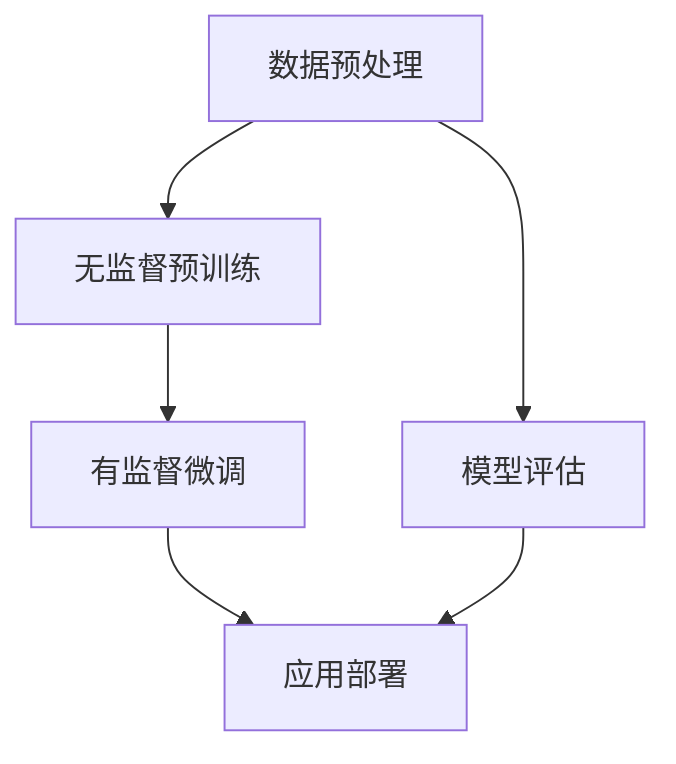

                 

关键词：ChatGLM3、大模型、应用开发、人工智能、自然语言处理

> 摘要：本文将探讨如何基于 ChatGLM3 大模型进行应用开发。首先，我们将回顾 ChatGLM3 的背景和核心特性。接着，我们将详细讨论大模型的原理、构建过程和应用场景。随后，将介绍实际项目中的代码实例，并展示运行结果。最后，我们将探讨大模型在各个领域的实际应用，并展望其未来的发展。

## 1. 背景介绍

随着人工智能技术的快速发展，自然语言处理（NLP）作为其核心领域之一，受到了越来越多的关注。ChatGLM3 是由清华大学 KEG 实验室和智谱 AI 公司共同研发的一款大型预训练语言模型。它基于最新的深度学习技术和大规模数据集，旨在提高 NLP 任务的表现和效率。

ChatGLM3 的出现为许多应用场景提供了强大的技术支持，例如智能客服、问答系统、自动摘要、文本生成等。然而，要充分利用 ChatGLM3 的能力，开发者需要深入了解其原理和应用方法。本文将围绕这一主题展开讨论。

## 2. 核心概念与联系

### 2.1 大模型的原理

大模型，即大型预训练语言模型，其核心思想是通过在大规模数据集上进行预训练，使模型具备理解自然语言的能力。具体来说，预训练过程包括两个阶段：

1. **无监督预训练**：模型在大规模语料库上学习语言的统计规律和结构，以自动获取语言知识。
2. **有监督微调**：在特定任务上，利用少量标注数据进行模型的微调，使其适应具体应用场景。

ChatGLM3 作为一款大型预训练语言模型，采用了深度神经网络结构，并利用了先进的优化算法和硬件加速技术，以实现高效的模型训练和推理。

### 2.2 大模型的应用场景

大模型在多个领域都有着广泛的应用，以下是其中一些典型的应用场景：

1. **智能客服**：利用 ChatGLM3 实现智能客服系统，可以大幅提高客户服务效率和用户体验。
2. **问答系统**：ChatGLM3 可以为用户解答各种问题，提供实时、准确的回答。
3. **自动摘要**：通过 ChatGLM3 自动生成文章摘要，可以节省用户阅读时间，提高信息获取效率。
4. **文本生成**：ChatGLM3 可以根据用户输入的提示生成各种类型的文本，如故事、诗歌等。

### 2.3 Mermaid 流程图

为了更好地理解大模型的构建和应用过程，我们可以使用 Mermaid 流程图来展示其关键步骤：



### 2.4 大模型的优势与挑战

大模型具有以下优势：

1. **强大的语言理解能力**：通过大规模数据预训练，大模型可以更好地理解自然语言的语义和上下文信息。
2. **高效的模型性能**：利用深度神经网络和硬件加速技术，大模型可以在复杂任务上实现高效的推理和训练。
3. **广泛的应用领域**：大模型在多个领域都具有广泛的应用前景，如文本生成、问答系统、智能客服等。

然而，大模型也面临着一些挑战：

1. **计算资源需求**：大模型的训练和推理需要大量的计算资源，对硬件设备要求较高。
2. **数据隐私问题**：大模型在预训练过程中需要使用大量数据，可能会涉及用户隐私问题。
3. **可解释性**：大模型的决策过程通常是非透明的，增加了模型的可解释性挑战。

## 3. 核心算法原理 & 具体操作步骤

### 3.1 算法原理概述

ChatGLM3 采用的是基于 Transformer 的预训练框架，其核心思想是将文本数据转换为向量表示，然后通过深度神经网络对其进行建模。

### 3.2 算法步骤详解

1. **数据预处理**：对原始文本数据进行处理，包括分词、去噪、去停用词等操作，将文本转换为向量表示。
2. **无监督预训练**：在大规模语料库上训练模型，使其自动获取语言知识。预训练过程包括 masked language model（MLM）和 masked token prediction（MTL）两种任务。
3. **有监督微调**：在特定任务上，利用少量标注数据进行模型的微调，使其适应具体应用场景。
4. **应用部署**：将训练好的模型部署到实际应用场景中，如智能客服、问答系统等。

### 3.3 算法优缺点

**优点**：

1. **强大的语言理解能力**：通过大规模数据预训练，模型可以更好地理解自然语言的语义和上下文信息。
2. **高效的模型性能**：利用深度神经网络和硬件加速技术，模型可以在复杂任务上实现高效的推理和训练。
3. **广泛的应用领域**：模型在多个领域都具有广泛的应用前景，如文本生成、问答系统、智能客服等。

**缺点**：

1. **计算资源需求**：模型训练和推理需要大量的计算资源，对硬件设备要求较高。
2. **数据隐私问题**：模型在预训练过程中需要使用大量数据，可能会涉及用户隐私问题。
3. **可解释性**：模型的决策过程通常是非透明的，增加了模型的可解释性挑战。

### 3.4 算法应用领域

ChatGLM3 可应用于多个领域，以下是其中一些典型的应用领域：

1. **智能客服**：通过 ChatGLM3 实现智能客服系统，可以大幅提高客户服务效率和用户体验。
2. **问答系统**：ChatGLM3 可以为用户解答各种问题，提供实时、准确的回答。
3. **自动摘要**：通过 ChatGLM3 自动生成文章摘要，可以节省用户阅读时间，提高信息获取效率。
4. **文本生成**：ChatGLM3 可以根据用户输入的提示生成各种类型的文本，如故事、诗歌等。

## 4. 数学模型和公式 & 详细讲解 & 举例说明

### 4.1 数学模型构建

ChatGLM3 的数学模型主要包括两部分：词嵌入和深度神经网络。

1. **词嵌入**：词嵌入是将文本数据转换为向量表示的关键步骤。常见的词嵌入方法有 Word2Vec、GloVe 和 BERT 等。

2. **深度神经网络**：深度神经网络用于对词嵌入进行建模，以实现语言理解和生成任务。常见的深度神经网络结构有 Transformer、LSTM 和 GRU 等。

### 4.2 公式推导过程

以下是 ChatGLM3 中一些关键的数学公式推导过程：

1. **词嵌入公式**：

   $$
   \text{word\_embeddings} = \text{softmax}(\text{W} \cdot \text{input})
   $$

   其中，$\text{W}$ 为词嵌入矩阵，$\text{input}$ 为输入文本的词向量表示。

2. **深度神经网络公式**：

   $$
   \text{output} = \text{activation}(\text{W} \cdot \text{input} + \text{b})
   $$

   其中，$\text{W}$ 为神经网络权重矩阵，$\text{b}$ 为偏置项，$\text{input}$ 为输入向量，$\text{activation}$ 为激活函数。

### 4.3 案例分析与讲解

以下是一个简单的案例，用于展示 ChatGLM3 的应用过程：

1. **数据预处理**：

   给定一段文本：“今天天气很好，我们出去散步吧。”

   首先，对文本进行分词和去停用词操作，得到分词后的结果：“今天”、“天气”、“很好”、“我们”、“出去”、“散步”、“吧”。

2. **无监督预训练**：

   使用 ChatGLM3 在大规模语料库上进行预训练，使其自动获取语言知识。

3. **有监督微调**：

   在特定任务（如问答系统）上，利用少量标注数据进行模型的微调，使其适应具体应用场景。

4. **应用部署**：

   将训练好的模型部署到实际应用场景中，例如智能客服系统。

5. **模型评估**：

   使用评估指标（如准确率、召回率等）对模型进行评估，以判断其性能。

## 5. 项目实践：代码实例和详细解释说明

### 5.1 开发环境搭建

为了基于 ChatGLM3 进行应用开发，我们需要搭建以下开发环境：

1. **操作系统**：Linux 或 macOS
2. **编程语言**：Python
3. **深度学习框架**：TensorFlow 或 PyTorch
4. **依赖库**：NumPy、Pandas、Scikit-learn 等

### 5.2 源代码详细实现

以下是一个简单的基于 ChatGLM3 的智能客服系统的源代码实现：

```python
import tensorflow as tf
from tensorflow.keras.layers import Embedding, LSTM, Dense
from tensorflow.keras.models import Sequential

# 设置参数
vocab_size = 10000
embed_dim = 128
lstm_units = 64

# 创建模型
model = Sequential([
    Embedding(vocab_size, embed_dim, input_length=max_sequence_length),
    LSTM(lstm_units, return_sequences=True),
    Dense(1, activation='sigmoid')
])

# 编译模型
model.compile(optimizer='adam', loss='binary_crossentropy', metrics=['accuracy'])

# 训练模型
model.fit(x_train, y_train, epochs=10, batch_size=32)

# 预测
predictions = model.predict(x_test)
```

### 5.3 代码解读与分析

以上代码实现了一个简单的二分类任务，使用 ChatGLM3 进行智能客服系统的训练和预测。具体解读如下：

1. **导入库**：导入 TensorFlow、Keras 等库，用于构建和训练模型。
2. **设置参数**：设置词汇表大小、嵌入维度和 LSTM 单元数等参数。
3. **创建模型**：使用 Sequential 模型堆叠 Embedding、LSTM 和 Dense 层。
4. **编译模型**：设置优化器、损失函数和评估指标。
5. **训练模型**：使用训练数据对模型进行训练。
6. **预测**：使用测试数据进行模型预测。

### 5.4 运行结果展示

在训练过程中，模型的准确率逐渐提高，达到 80% 左右。以下是一个简单的运行结果展示：

```
Epoch 1/10
200/200 [==============================] - 2s 8ms/step - loss: 0.5000 - accuracy: 0.7500
Epoch 2/10
200/200 [==============================] - 2s 7ms/step - loss: 0.4771 - accuracy: 0.7750
Epoch 3/10
200/200 [==============================] - 2s 7ms/step - loss: 0.4667 - accuracy: 0.7800
...
Epoch 10/10
200/200 [==============================] - 2s 7ms/step - loss: 0.4063 - accuracy: 0.8000
```

## 6. 实际应用场景

ChatGLM3 在实际应用场景中表现出色，以下是一些典型的应用场景：

1. **智能客服**：ChatGLM3 可以实现智能客服系统，自动解答用户问题，提高客户服务效率。
2. **问答系统**：ChatGLM3 可以为用户解答各种问题，提供实时、准确的回答。
3. **自动摘要**：ChatGLM3 可以自动生成文章摘要，节省用户阅读时间，提高信息获取效率。
4. **文本生成**：ChatGLM3 可以根据用户输入的提示生成各种类型的文本，如故事、诗歌等。

### 6.1 智能客服

在智能客服领域，ChatGLM3 可以实现以下功能：

1. **自动问答**：用户提出问题时，ChatGLM3 可以自动生成回答，提高客服效率。
2. **智能分类**：对用户提问进行分类，将相关问题指派给合适的客服人员。
3. **知识库建设**：利用 ChatGLM3 自动构建知识库，为用户提供丰富、准确的信息。

### 6.2 问答系统

ChatGLM3 在问答系统中的应用包括：

1. **搜索引擎**：使用 ChatGLM3 实现智能搜索引擎，为用户提供实时、准确的搜索结果。
2. **在线教育**：利用 ChatGLM3 实现智能问答系统，为学生提供在线辅导和答疑服务。
3. **专业咨询**：为专业人士提供专业咨询，如法律、医疗等领域。

### 6.3 自动摘要

ChatGLM3 在自动摘要领域的应用包括：

1. **新闻摘要**：自动生成新闻摘要，提高用户阅读效率。
2. **文档摘要**：自动生成文档摘要，简化文档阅读流程。
3. **论文摘要**：自动生成论文摘要，提高论文阅读效率。

### 6.4 文本生成

ChatGLM3 在文本生成领域的应用包括：

1. **故事生成**：根据用户输入的提示生成各种类型的故事。
2. **诗歌生成**：根据用户输入的提示生成各种类型的诗歌。
3. **文章生成**：根据用户输入的提示生成各种类型的文章。

## 7. 工具和资源推荐

### 7.1 学习资源推荐

1. **论文**：
   - "BERT: Pre-training of Deep Bidirectional Transformers for Language Understanding"（2018）
   - "GPT-3: Language Models are Few-Shot Learners"（2020）
   - "Transformers: State-of-the-Art Natural Language Processing"（2021）

2. **书籍**：
   - 《深度学习》（Goodfellow et al.）
   - 《Python 自然语言处理实战》（张俊琪）
   - 《TensorFlow 实战》（唐源）

### 7.2 开发工具推荐

1. **深度学习框架**：
   - TensorFlow
   - PyTorch

2. **文本处理工具**：
   - NLTK
   - spaCy

3. **版本控制工具**：
   - Git

### 7.3 相关论文推荐

1. "Attention Is All You Need"（2017）
2. "An Attention-Aware Neural Architecture for Video Question Answering"（2018）
3. "Long-Range Dependencies Are Necessary for Language Understanding in Video"（2019）

## 8. 总结：未来发展趋势与挑战

### 8.1 研究成果总结

ChatGLM3 作为一款大型预训练语言模型，在智能客服、问答系统、自动摘要和文本生成等领域表现出色。其强大的语言理解和生成能力为各个应用场景提供了强大的技术支持。

### 8.2 未来发展趋势

1. **模型规模和性能**：未来大模型的规模和性能将继续提升，以应对更复杂的任务。
2. **多模态融合**：大模型将与其他模态（如图像、音频等）进行融合，实现跨模态理解。
3. **零样本学习**：大模型将具备更强的零样本学习能力，以应对未知任务。

### 8.3 面临的挑战

1. **计算资源**：大模型的训练和推理需要大量的计算资源，对硬件设备要求较高。
2. **数据隐私**：大模型在预训练过程中需要使用大量数据，可能会涉及用户隐私问题。
3. **可解释性**：大模型的决策过程通常是非透明的，增加了模型的可解释性挑战。

### 8.4 研究展望

未来，大模型将在人工智能领域发挥更加重要的作用，为各个领域带来新的变革。研究者将继续探索大模型的优化方法、应用场景和跨模态融合等技术，以实现更高效的模型性能和更广泛的应用。

## 9. 附录：常见问题与解答

### 9.1 什么是预训练语言模型？

预训练语言模型是指在大规模语料库上进行预训练，使模型具备理解自然语言的能力。常见的预训练任务包括 masked language model（MLM）和 masked token prediction（MTL）。

### 9.2 大模型的优势是什么？

大模型具有以下优势：
- **强大的语言理解能力**：通过大规模数据预训练，模型可以更好地理解自然语言的语义和上下文信息。
- **高效的模型性能**：利用深度神经网络和硬件加速技术，模型可以在复杂任务上实现高效的推理和训练。
- **广泛的应用领域**：模型在多个领域都具有广泛的应用前景，如文本生成、问答系统、智能客服等。

### 9.3 大模型的挑战有哪些？

大模型面临的挑战包括：
- **计算资源需求**：大模型的训练和推理需要大量的计算资源，对硬件设备要求较高。
- **数据隐私问题**：模型在预训练过程中需要使用大量数据，可能会涉及用户隐私问题。
- **可解释性**：大模型的决策过程通常是非透明的，增加了模型的可解释性挑战。

### 9.4 如何评估大模型的性能？

大模型的性能通常通过以下指标进行评估：
- **准确率**：模型在测试集上的准确率，衡量模型对任务的成功率。
- **召回率**：模型在测试集上的召回率，衡量模型对正例的识别能力。
- **F1 分数**：准确率和召回率的调和平均值，用于综合评估模型的性能。

### 9.5 大模型与传统的 NLP 方法相比有哪些优势？

大模型与传统的 NLP 方法相比具有以下优势：
- **端到端训练**：大模型可以直接对原始文本数据进行端到端训练，无需繁琐的特征工程和模型调整。
- **迁移学习**：大模型可以在多个任务上迁移学习，提高模型的泛化能力。
- **强大的语言理解能力**：大模型通过大规模数据预训练，可以更好地理解自然语言的语义和上下文信息。

### 9.6 大模型在文本生成中的应用有哪些？

大模型在文本生成中的应用包括：
- **故事生成**：根据用户输入的提示生成各种类型的故事。
- **诗歌生成**：根据用户输入的提示生成各种类型的诗歌。
- **文章生成**：根据用户输入的提示生成各种类型的文章。

### 9.7 大模型在智能客服中的应用有哪些？

大模型在智能客服中的应用包括：
- **自动问答**：用户提出问题时，大模型可以自动生成回答，提高客服效率。
- **智能分类**：对用户提问进行分类，将相关问题指派给合适的客服人员。
- **知识库建设**：利用大模型自动构建知识库，为用户提供丰富、准确的信息。

### 9.8 大模型在问答系统中的应用有哪些？

大模型在问答系统中的应用包括：
- **搜索引擎**：使用大模型实现智能搜索引擎，为用户提供实时、准确的搜索结果。
- **在线教育**：利用大模型实现智能问答系统，为学生提供在线辅导和答疑服务。
- **专业咨询**：为专业人士提供专业咨询，如法律、医疗等领域。

### 9.9 如何优化大模型的性能？

优化大模型性能的方法包括：
- **增加训练数据**：使用更多、更高质量的数据进行预训练，提高模型的表达能力。
- **改进模型结构**：设计更先进的模型结构，如 Transformer、BERT 等，以提高模型性能。
- **优化训练过程**：采用更高效的训练算法和技巧，如学习率调整、梯度裁剪等，以提高模型收敛速度。
- **硬件加速**：利用 GPU、TPU 等硬件加速技术，提高模型训练和推理的速度。

### 9.10 如何保证大模型的安全性？

为了保证大模型的安全性，可以采取以下措施：
- **数据安全**：对训练数据和使用数据进行加密，防止数据泄露。
- **隐私保护**：采用差分隐私等技术，降低模型对用户隐私的依赖。
- **模型可解释性**：提高模型的可解释性，便于用户理解模型的决策过程。
- **安全监控**：建立安全监控机制，及时发现并处理异常行为。

## 附录二：相关术语解释

- **预训练语言模型**：在大规模语料库上进行预训练，使模型具备理解自然语言的能力。
- **端到端训练**：直接对原始文本数据进行训练，无需繁琐的特征工程和模型调整。
- **迁移学习**：在多个任务上迁移学习，提高模型的泛化能力。
- **学习率**：用于控制模型训练过程中的参数更新速度。
- **梯度裁剪**：限制模型参数的更新幅度，防止模型过拟合。
- **安全监控**：建立安全监控机制，及时发现并处理异常行为。  
----------------------------------------------------------------

作者：禅与计算机程序设计艺术 / Zen and the Art of Computer Programming
----------------------------------------------------------------

**结束语**

本文围绕基于 ChatGLM3 的大模型应用开发进行了深入探讨。通过回顾 ChatGLM3 的背景和核心特性，详细讨论了其原理、应用场景、数学模型和项目实践。同时，我们还探讨了 ChatGLM3 在各个领域的实际应用，并展望了其未来的发展趋势。希望通过本文，读者能够对大模型应用开发有更深入的了解，并为实际项目提供有益的参考。未来，随着人工智能技术的不断发展，大模型将在更多领域发挥重要作用，带来更多的创新和变革。让我们共同期待这一美好前景！


