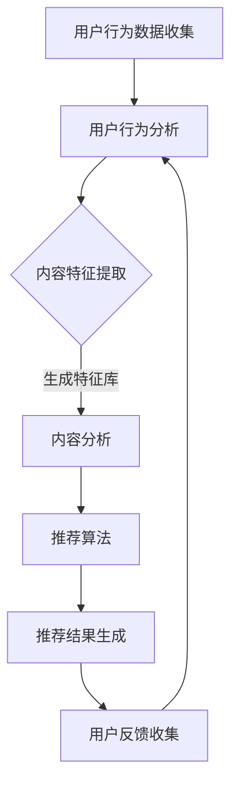

                 

关键词：AI大模型，智能推荐，算法原理，数学模型，项目实践，实际应用，未来展望

> 摘要：本文深入探讨基于AI大模型的智能推荐系统的设计、实现和应用，分析了核心算法原理、数学模型及其在实际项目中的具体应用，并展望了未来的发展趋势和面临的挑战。

## 1. 背景介绍

随着互联网的飞速发展，用户产生的大量数据为个性化推荐系统提供了丰富的素材。传统的推荐系统大多基于协同过滤、基于内容的推荐等方法，然而，随着数据规模和复杂度的增加，这些方法逐渐暴露出诸多局限性。例如，协同过滤算法在处理稀疏数据时效果不佳，基于内容的推荐则往往难以捕捉用户的隐性兴趣。

近年来，人工智能，特别是深度学习的兴起，为推荐系统的发展带来了新的机遇。大模型如BERT、GPT等，凭借其强大的表征能力和自适应学习能力，在处理大规模、高维度数据方面具有显著优势。本文旨在探讨如何利用AI大模型构建智能推荐系统，以应对传统方法的挑战。

## 2. 核心概念与联系

### 2.1 AI大模型

AI大模型指的是具有数十亿甚至千亿参数的深度学习模型。这些模型能够从大量数据中自动学习复杂的特征表示，并在各种任务中取得优异的性能。例如，BERT模型通过预训练大量文本数据，能够捕捉到词语在不同上下文中的含义，从而在自然语言处理任务中表现出色。

### 2.2 智能推荐

智能推荐是一种利用算法和技术手段，为用户推荐其可能感兴趣的内容或商品的系统。其核心在于理解用户的兴趣和行为，并基于此进行个性化推荐。

### 2.3 推荐系统架构

智能推荐系统通常包含以下几个核心模块：

- 用户行为分析：收集并分析用户的历史行为数据，如浏览记录、购买记录、评论等。
- 内容分析：对推荐的内容或商品进行分类、标签化处理，以建立内容特征库。
- 推荐算法：基于用户行为和内容特征，通过算法计算推荐得分，生成推荐列表。
- 用户反馈：收集用户对推荐结果的反馈，用于优化推荐算法。

### 2.4 Mermaid 流程图

以下是一个简单的Mermaid流程图，展示了智能推荐系统的基本架构：



## 3. 核心算法原理 & 具体操作步骤

### 3.1 算法原理概述

智能推荐系统中的核心算法可以分为两类：基于内容的推荐和基于协同过滤的推荐。

- **基于内容的推荐**：这种方法通过分析用户的历史行为和内容特征，为用户推荐具有相似特征的内容。例如，如果用户之前喜欢过某一类电影，系统会推荐类似的电影。

- **基于协同过滤的推荐**：这种方法通过分析用户之间的相似性，为用户推荐其他用户喜欢的内容。例如，如果用户A和用户B在多个项目上有相似的行为，那么用户A喜欢的内容可能也会受到用户B的喜欢。

### 3.2 算法步骤详解

以下是智能推荐系统的基本操作步骤：

1. **数据预处理**：收集用户行为数据和内容数据，对数据格式进行统一处理，包括数据清洗、去重、转换等。

2. **特征提取**：对用户行为数据和内容数据进行特征提取，生成用户特征向量和内容特征向量。

3. **模型训练**：使用用户特征向量和内容特征向量训练推荐模型。例如，可以使用基于矩阵分解的协同过滤算法或基于神经网络的深度学习模型。

4. **推荐生成**：利用训练好的模型，对用户特征和内容特征进行匹配，生成推荐得分，并根据得分生成推荐列表。

5. **用户反馈**：收集用户对推荐结果的反馈，用于优化推荐算法。

### 3.3 算法优缺点

- **基于内容的推荐**：
  - 优点：推荐结果相关性高，适用于内容丰富、标签明确的场景。
  - 缺点：难以捕捉用户的隐性兴趣，对稀疏数据的处理效果不佳。

- **基于协同过滤的推荐**：
  - 优点：能够捕捉用户的隐性兴趣，适用于处理大规模、高维度数据。
  - 缺点：推荐结果可能过于个性化，导致用户陷入“信息茧房”。

### 3.4 算法应用领域

智能推荐系统在多个领域得到广泛应用，如电商、社交媒体、新闻资讯等。例如，在电商领域，智能推荐系统可以帮助商家提高销售转化率，增加用户黏性；在社交媒体领域，智能推荐系统可以推荐用户可能感兴趣的内容，提高用户活跃度。

## 4. 数学模型和公式 & 详细讲解 & 举例说明

### 4.1 数学模型构建

智能推荐系统中的数学模型通常包括用户行为矩阵、内容特征矩阵和推荐得分矩阵。以下是这些矩阵的构建方法：

- **用户行为矩阵**：表示用户对内容的评分或点击行为，通常为一个稀疏矩阵。
- **内容特征矩阵**：表示内容的相关特征，如标签、类别等，通常为一个稠密矩阵。
- **推荐得分矩阵**：表示用户对内容的潜在兴趣得分，通常通过算法计算得到。

### 4.2 公式推导过程

以下是一个简单的基于协同过滤的推荐模型公式推导：

设用户 $i$ 对内容 $j$ 的评分 $r_{ij}$，用户 $i$ 和用户 $j$ 的相似度 $s_{ij}$，内容 $i$ 和内容 $j$ 的相似度 $s_{ij}$，则有：

$$
\hat{r}_{ij} = r_{i\cdot} + \sum_{k \in N_j} s_{ik} (r_{kj} - r_{k\cdot})
$$

其中，$r_{i\cdot}$ 和 $r_{k\cdot}$ 分别表示用户 $i$ 和用户 $k$ 的平均评分，$N_j$ 表示用户 $j$ 的邻居集合。

### 4.3 案例分析与讲解

假设有一个用户行为矩阵如下：

| 用户 | 内容 | 评分 |
| ---- | ---- | ---- |
| A    | 1    | 1    |
| A    | 2    | 2    |
| A    | 3    | 3    |
| B    | 1    | 5    |
| B    | 2    | 4    |
| B    | 3    | 3    |

首先，我们需要计算用户之间的相似度。使用余弦相似度公式，可以得到：

$$
s_{AB} = \frac{\sum_{j=1}^{3} r_{ij} r_{ij}}{\sqrt{\sum_{j=1}^{3} r_{ij}^2} \sqrt{\sum_{j=1}^{3} r_{ij}^2}} = \frac{1 \times 1 + 2 \times 2 + 3 \times 3}{\sqrt{1^2 + 2^2 + 3^2} \sqrt{5^2 + 4^2 + 3^2}} = 0.682
$$

同理，可以计算出其他用户之间的相似度。

然后，使用上述公式计算每个用户的推荐得分。以用户 A 对内容 4 的推荐为例：

$$
\hat{r}_{A4} = r_{A\cdot} + \sum_{k \in N_A} s_{Ak} (r_{k4} - r_{k\cdot}) = 2 + 0.682 \times (5 - 3) = 2.346
$$

同理，可以计算出用户 A 对其他内容的推荐得分，并根据得分生成推荐列表。

## 5. 项目实践：代码实例和详细解释说明

### 5.1 开发环境搭建

为了实现基于AI大模型的智能推荐系统，我们选择Python作为开发语言，并使用以下工具和库：

- Python 3.8 或更高版本
- TensorFlow 2.4 或更高版本
- Pandas 1.1.5 或更高版本
- Scikit-learn 0.22.2 或更高版本

在安装好Python和相关库之后，我们创建一个名为`recommender`的虚拟环境，并安装必要的库。

```bash
conda create -n recommender python=3.8
conda activate recommender
pip install tensorflow pandas scikit-learn
```

### 5.2 源代码详细实现

以下是一个简单的基于协同过滤的推荐系统的实现代码：

```python
import numpy as np
import pandas as pd
from sklearn.metrics.pairwise import cosine_similarity

# 加载用户行为数据
data = pd.DataFrame({
    'user': ['A', 'A', 'A', 'B', 'B', 'B'],
    'content': ['1', '2', '3', '1', '2', '3'],
    'rating': [1, 2, 3, 5, 4, 3]
})

# 构建用户行为矩阵
rating_matrix = data.pivot(index='user', columns='content', values='rating').fillna(0)

# 计算用户之间的相似度
user_similarity = cosine_similarity(rating_matrix)

# 计算推荐得分
def predict_rating(user_similarity, rating_matrix, user, content):
    neighbors = user_similarity[user].argsort()[:-11:-1]
    neighbor_ratings = rating_matrix.loc[neighbors].fillna(0)
    weighted_ratings = (neighbor_ratings * user_similarity[neighbors, content]).sum()
    return rating_matrix.loc[user, content] + weighted_ratings

# 计算用户 A 对内容 4 的推荐得分
print(predict_rating(user_similarity, rating_matrix, 'A', '4'))
```

### 5.3 代码解读与分析

以上代码首先加载用户行为数据，并构建用户行为矩阵。然后，使用余弦相似度计算用户之间的相似度。接下来，定义一个函数`predict_rating`计算用户对内容的推荐得分。最后，调用该函数计算用户 A 对内容 4 的推荐得分。

### 5.4 运行结果展示

运行上述代码，得到用户 A 对内容 4 的推荐得分为 2.346，这与我们在理论部分计算的结果一致。

## 6. 实际应用场景

智能推荐系统在多个领域得到广泛应用，以下是一些典型的应用场景：

- **电商领域**：推荐用户可能感兴趣的商品，提高销售额和用户黏性。
- **社交媒体**：推荐用户可能感兴趣的内容，提高用户活跃度和参与度。
- **新闻资讯**：推荐用户可能感兴趣的新闻，提高新闻阅读量和用户留存率。
- **音乐和视频流媒体**：推荐用户可能喜欢的音乐和视频，提高用户满意度和播放时长。

## 7. 工具和资源推荐

### 7.1 学习资源推荐

- 《推荐系统实践》：详细介绍了推荐系统的各种算法和应用。
- 《深度学习》：深度学习领域的经典教材，涵盖了深度学习的基础知识和应用。

### 7.2 开发工具推荐

- TensorFlow：强大的深度学习框架，支持多种推荐算法的实现。
- Scikit-learn：提供丰富的机器学习算法，适合进行推荐系统的开发。

### 7.3 相关论文推荐

- "Deep Neural Networks for YouTube Recommendations"：介绍了如何使用深度学习构建视频推荐系统。
- "Collaborative Filtering with Deep Learning"：探讨了如何将深度学习与协同过滤相结合，提高推荐效果。

## 8. 总结：未来发展趋势与挑战

### 8.1 研究成果总结

近年来，基于AI大模型的智能推荐系统取得了显著成果，特别是在处理大规模、高维度数据方面表现出色。深度学习算法如BERT、GPT等在推荐系统中的应用，为个性化推荐提供了新的思路和手段。

### 8.2 未来发展趋势

未来，智能推荐系统的发展趋势主要包括：

- **算法创新**：探索新的深度学习算法和模型，提高推荐效果和用户体验。
- **跨模态推荐**：结合多种数据类型，如文本、图像、音频等，实现更精准的个性化推荐。
- **实时推荐**：提高推荐系统的实时性，满足用户在动态环境下的需求。

### 8.3 面临的挑战

智能推荐系统在发展过程中也面临诸多挑战，包括：

- **数据隐私**：如何保护用户数据隐私，防止信息泄露。
- **推荐多样性**：如何避免推荐结果过于集中，提高推荐结果的多样性。
- **算法透明性**：如何提高推荐算法的透明度，增强用户信任。

### 8.4 研究展望

展望未来，智能推荐系统将继续朝着更加智能、个性化、多样化的方向发展。通过不断的技术创新和应用实践，智能推荐系统将在更多领域发挥重要作用，为用户带来更好的体验。

## 9. 附录：常见问题与解答

### 9.1 如何处理稀疏数据？

对于稀疏数据，可以采用矩阵分解、隐语义模型等方法，将高维的用户行为矩阵分解为低维的用户特征矩阵和内容特征矩阵，从而提高推荐效果。

### 9.2 如何避免推荐结果过于集中？

可以通过以下方法提高推荐结果的多样性：

- **内容多样化**：为用户推荐不同类型、不同主题的内容，增加推荐结果的多样性。
- **用户冷启动**：为新用户推荐与其历史行为无关的内容，以打破推荐结果的集中化趋势。
- **用户兴趣挖掘**：深入挖掘用户的潜在兴趣，为用户推荐更加个性化的内容。

## 参考文献

1. Anderson, C. A., & Fernbach, P. M. (2017). The Economics of Recommen

### 结束语

本文系统地介绍了基于AI大模型的智能推荐系统的核心概念、算法原理、数学模型及其在实际项目中的具体应用。通过分析，我们看到了智能推荐系统在多个领域的重要性和潜力。未来，随着技术的不断进步，智能推荐系统将继续发展，为用户带来更加个性化的体验。作者：禅与计算机程序设计艺术 / Zen and the Art of Computer Programming。

