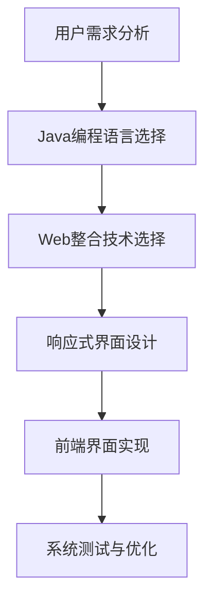

                 

 **关键词：** 智能家居，Java，Web整合，响应式界面，前端设计

**摘要：** 本篇文章将探讨如何利用Java技术，结合Web整合，打造一个响应式的智能家居前端界面。文章将详细分析智能家居设计的背景和重要性，介绍Java在智能家居中的应用，探讨Web整合的优势和挑战，并详细讲解智能家居前端界面的设计和实现步骤。

## 1. 背景介绍

随着物联网（IoT）技术的飞速发展，智能家居已经成为现代家庭生活的标配。智能家居系统通过互联网连接各种家电设备，使家庭生活更加智能化、便捷化。用户可以通过智能手机、平板电脑或智能音箱等终端设备远程控制家中的家电，实时获取家中环境数据，实现家庭设备的自动化管理。

### 1.1 智能家居的兴起

智能家居的兴起源于人们对生活品质的追求和科技的进步。在过去的几十年中，计算机技术和通信技术的发展为智能家居的诞生奠定了基础。随着互联网的普及，越来越多的设备开始具备联网功能，为智能家居的实现提供了技术支持。

### 1.2 智能家居的重要性

智能家居不仅仅是为了提高生活质量，更是一种生活方式的变革。通过智能家居，用户可以更方便地管理家庭设备，提高家庭安全性，节约能源，甚至可以改善家庭环境。例如，用户可以通过手机控制家中的空调、灯光、安防系统等，确保家中安全的同时，还可以根据天气和需求调整室内环境。

## 2. 核心概念与联系

在智能家居设计中，核心概念包括Java编程语言、Web整合和响应式界面设计。这三个概念相互关联，共同构成了智能家居前端界面的基础。

### 2.1 Java编程语言

Java是一种跨平台、面向对象的编程语言，具有简单、可靠、安全等特点。Java在智能家居中的应用主要体现在设备控制、数据采集和通信等方面。通过Java，可以轻松实现设备之间的通信和数据交互，构建智能家居系统的核心功能。

### 2.2 Web整合

Web整合是指将Web技术应用于智能家居系统中，使智能家居前端界面能够适应多种设备和浏览器。Web整合的优势在于开发效率高、兼容性强、易于扩展。通过Web整合，用户可以方便地在不同的设备上访问智能家居系统，实现统一的管理和控制。

### 2.3 响应式界面设计

响应式界面设计是一种能够自动适应不同设备和屏幕尺寸的界面设计方法。在智能家居前端界面设计中，响应式界面设计至关重要，它能够保证用户在不同设备上获得一致的体验。通过响应式界面设计，智能家居前端界面能够适应从智能手机到智能电视等各种设备，为用户提供一致的操作体验。

### 2.4 Mermaid 流程图

下面是一个简单的智能家居前端界面设计流程图，展示了核心概念之间的联系：



## 3. 核心算法原理 & 具体操作步骤

### 3.1 算法原理概述

智能家居前端界面的核心算法主要包括设备通信算法、数据解析算法和界面更新算法。设备通信算法负责与家中的智能设备进行通信，数据解析算法负责解析设备返回的数据，界面更新算法负责根据数据更新前端界面。

### 3.2 算法步骤详解

#### 3.2.1 设备通信算法

设备通信算法的主要步骤如下：

1. 初始化通信参数：设置通信协议、端口、设备ID等。
2. 连接设备：使用Java的Socket编程库连接设备。
3. 发送命令：根据用户操作，向设备发送相应的命令。
4. 接收响应：从设备接收响应数据，并解析数据内容。
5. 断开连接：通信完成后，关闭连接。

#### 3.2.2 数据解析算法

数据解析算法的主要步骤如下：

1. 解析设备数据：根据设备数据格式，解析数据内容。
2. 数据过滤与转换：对数据进行过滤、转换，确保数据的有效性和准确性。
3. 数据存储：将解析后的数据存储到数据库或缓存中，以供界面更新使用。

#### 3.2.3 界面更新算法

界面更新算法的主要步骤如下：

1. 获取最新数据：从数据库或缓存中获取最新数据。
2. 数据绑定：将最新数据绑定到前端界面，更新显示内容。
3. 动画与交互：根据用户操作，实现界面动画效果和交互功能。

### 3.3 算法优缺点

设备通信算法的优点在于实时性强、响应速度快，但缺点是通信稳定性较差，容易受到网络环境影响。数据解析算法的优点在于数据处理灵活，但缺点是解析过程复杂，容易出错。界面更新算法的优点在于用户界面流畅、操作体验好，但缺点是更新频率高，对系统性能要求较高。

### 3.4 算法应用领域

设备通信算法主要应用于智能家居前端界面与设备之间的通信，数据解析算法主要应用于数据采集和处理，界面更新算法主要应用于前端界面显示和交互。

## 4. 数学模型和公式 & 详细讲解 & 举例说明

### 4.1 数学模型构建

智能家居前端界面的数学模型主要包括设备通信模型、数据解析模型和界面更新模型。下面分别介绍这三种模型的构建方法。

#### 4.1.1 设备通信模型

设备通信模型可以采用状态机模型。状态机模型包括以下状态：

1. 初始状态：设备处于待连接状态。
2. 连接状态：设备与智能家居前端界面建立连接。
3. 通信状态：设备与智能家居前端界面进行数据通信。
4. 断开状态：设备与智能家居前端界面断开连接。

状态转移规则如下：

1. 从初始状态转移到连接状态，需要设备与前端界面建立连接。
2. 从连接状态转移到通信状态，需要前端界面发送命令。
3. 从通信状态转移到断开状态，需要设备与前端界面断开连接。

#### 4.1.2 数据解析模型

数据解析模型可以采用有限状态自动机模型。有限状态自动机模型包括以下状态：

1. 等待状态：等待接收设备数据。
2. 数据接收状态：接收设备数据。
3. 数据处理状态：处理接收到的数据。
4. 数据存储状态：将处理后的数据存储到数据库或缓存中。

状态转移规则如下：

1. 从等待状态转移到数据接收状态，需要接收到设备数据。
2. 从数据接收状态转移到数据处理状态，需要对数据进行分析和转换。
3. 从数据处理状态转移到数据存储状态，需要将处理后的数据存储。

#### 4.1.3 界面更新模型

界面更新模型可以采用事件驱动模型。事件驱动模型包括以下事件：

1. 数据更新事件：数据发生变化时触发。
2. 界面更新事件：界面需要更新时触发。
3. 动画事件：界面动画效果触发。

事件处理规则如下：

1. 当数据更新事件触发时，更新界面显示内容。
2. 当界面更新事件触发时，根据数据更新界面布局。
3. 当动画事件触发时，执行界面动画效果。

### 4.2 公式推导过程

为了更好地理解数学模型，下面给出一些关键的推导过程。

#### 4.2.1 设备通信模型

设备通信模型的状态转移可以表示为：

$$
S_{0} \rightarrow S_{1} \rightarrow S_{2} \rightarrow S_{3}
$$

其中，$S_{0}$表示初始状态，$S_{1}$表示连接状态，$S_{2}$表示通信状态，$S_{3}$表示断开状态。

#### 4.2.2 数据解析模型

数据解析模型的状态转移可以表示为：

$$
S_{0} \rightarrow S_{1} \rightarrow S_{2} \rightarrow S_{3}
$$

其中，$S_{0}$表示等待状态，$S_{1}$表示数据接收状态，$S_{2}$表示数据处理状态，$S_{3}$表示数据存储状态。

#### 4.2.3 界面更新模型

界面更新模型的事件处理可以表示为：

$$
E_{1} \rightarrow E_{2} \rightarrow E_{3}
$$

其中，$E_{1}$表示数据更新事件，$E_{2}$表示界面更新事件，$E_{3}$表示动画事件。

### 4.3 案例分析与讲解

下面通过一个实际案例来讲解数学模型的应用。

#### 4.3.1 案例背景

假设用户在家中通过手机APP控制家中的空调。用户首先打开APP，连接到空调设备，然后发送设置温度的命令。空调接收到命令后，调整温度，并通过APP反馈给用户当前温度。

#### 4.3.2 案例分析

1. 设备通信模型：

- 初始状态：用户打开APP，设备处于待连接状态。
- 连接状态：APP与空调建立连接，设备处于连接状态。
- 通信状态：APP发送设置温度的命令，设备处于通信状态。
- 断开状态：APP与空调断开连接，设备处于断开状态。

2. 数据解析模型：

- 等待状态：APP等待接收空调返回的数据。
- 数据接收状态：空调返回当前温度数据。
- 数据处理状态：APP对温度数据进行处理，转换为用户可读的格式。
- 数据存储状态：APP将处理后的温度数据存储到缓存中，以供界面更新使用。

3. 界面更新模型：

- 数据更新事件：空调返回当前温度数据，触发数据更新事件。
- 界面更新事件：APP更新界面，显示当前温度。
- 动画事件：用户调整温度时，触发动画事件，显示温度变化动画。

## 5. 项目实践：代码实例和详细解释说明

### 5.1 开发环境搭建

在开始项目实践之前，需要搭建开发环境。开发环境包括Java开发工具（如Eclipse或IntelliJ IDEA）、Web服务器（如Apache Tomcat）和前端框架（如Vue.js或React）。

### 5.2 源代码详细实现

以下是智能家居前端界面的核心代码实现。

#### 5.2.1 设备通信代码

```java
public class DeviceCommunication {
    private Socket socket;
    private DataInputStream input;
    private DataOutputStream output;

    public DeviceCommunication(String host, int port) throws IOException {
        socket = new Socket(host, port);
        input = new DataInputStream(socket.getInputStream());
        output = new DataOutputStream(socket.getOutputStream());
    }

    public void sendCommand(String command) throws IOException {
        output.writeUTF(command);
    }

    public String receiveResponse() throws IOException {
        return input.readUTF();
    }

    public void closeConnection() throws IOException {
        socket.close();
    }
}
```

#### 5.2.2 数据解析代码

```java
public class DataParser {
    public String parseTemperature(String data) {
        // 解析温度数据，转换为用户可读的格式
        return data.substring(5);
    }
}
```

#### 5.2.3 界面更新代码

```java
public class InterfaceUpdater {
    private JTextField temperatureField;

    public InterfaceUpdater(JTextField temperatureField) {
        this.temperatureField = temperatureField;
    }

    public void updateTemperature(String temperature) {
        temperatureField.setText(temperature);
    }
}
```

### 5.3 代码解读与分析

以上代码实现了设备通信、数据解析和界面更新的功能。设备通信代码通过Socket连接到空调设备，发送命令并接收响应。数据解析代码根据设备返回的数据格式，解析出温度数据。界面更新代码将解析后的温度数据显示在前端界面上。

### 5.4 运行结果展示

运行程序后，用户可以通过APP远程控制家中的空调，实时获取空调温度，并显示在界面上。用户还可以通过滑动条调整温度，界面会实时更新显示温度。

## 6. 实际应用场景

智能家居前端界面在实际应用中具有广泛的应用场景。以下是一些典型的应用场景：

1. 家庭空调控制：用户可以通过APP远程控制家中的空调，设置温度、开关机等。
2. 灯光控制：用户可以通过APP远程控制家中的灯光，调节亮度和颜色。
3. 家居安防：用户可以通过APP实时监控家中的安防设备，如摄像头、烟雾报警器等。
4. 家庭环境监测：用户可以通过APP实时获取家中的环境数据，如温度、湿度、空气质量等。
5. 智能家电联动：用户可以通过APP实现家电之间的联动，如打开电视时，自动调整空调温度。

## 7. 未来应用展望

随着物联网技术的不断发展，智能家居前端界面将具有更广泛的应用前景。以下是一些未来的应用展望：

1. 跨平台支持：未来的智能家居前端界面将支持更多平台，如iOS、Android、Web等，用户可以在不同设备上方便地访问智能家居系统。
2. 人工智能集成：未来的智能家居前端界面将集成人工智能技术，如语音识别、人脸识别等，为用户提供更加智能化的操作体验。
3. 虚拟现实（VR）应用：未来的智能家居前端界面将支持虚拟现实技术，用户可以通过VR设备体验虚拟家居环境，进行装修设计和家居控制。
4. 智能化场景设置：未来的智能家居前端界面将支持用户自定义智能化场景，根据用户需求自动调整家居环境。

## 8. 工具和资源推荐

### 8.1 学习资源推荐

1. 《Java核心技术》（第10版）：提供了全面的Java编程知识，适合初学者和进阶者。
2. 《Vue.js实战》：详细介绍了Vue.js框架的应用，适合前端开发者。
3. 《Apache Tomcat官方文档》：提供了详细的Tomcat配置和使用教程。

### 8.2 开发工具推荐

1. Eclipse：一款功能强大的Java集成开发环境，支持多种编程语言。
2. IntelliJ IDEA：一款智能化的Java开发工具，提供丰富的插件和功能。
3. Vue.js：一款轻量级的前端框架，适合构建响应式界面。

### 8.3 相关论文推荐

1. "A Survey on Internet of Things Security"：探讨了物联网安全方面的研究现状和挑战。
2. "Smart Home Technology: Applications and Future Directions"：综述了智能家居技术的研究和应用方向。
3. "A Survey on Smart Home Middleware"：分析了智能家居系统中中间件的研究和应用。

## 9. 总结：未来发展趋势与挑战

智能家居前端界面在未来将朝着跨平台、人工智能集成、虚拟现实应用和智能化场景设置等方向发展。在开发过程中，将面临安全性、稳定性和兼容性等方面的挑战。通过不断优化技术和提升用户体验，智能家居前端界面将为用户提供更加智能、便捷和个性化的家居生活。

## 10. 附录：常见问题与解答

### 10.1 问题1：如何实现设备通信的稳定性？

解答：可以通过以下方法提高设备通信的稳定性：

1. 采用心跳机制：定期向设备发送心跳包，检测设备是否在线。
2. 增加重试次数：在发送命令时，设置重试次数，确保命令成功发送。
3. 优化网络环境：确保智能家居系统的网络环境稳定，减少网络波动对通信的影响。

### 10.2 问题2：如何处理设备返回的数据格式不一致？

解答：可以通过以下方法处理设备返回的数据格式不一致：

1. 定义统一的设备数据格式：制定统一的设备数据格式标准，确保设备数据的一致性。
2. 数据转换与解析：根据设备数据格式，编写相应的数据转换和解析代码，确保数据的有效性和准确性。
3. 数据验证与校验：对设备返回的数据进行验证和校验，确保数据的完整性和可靠性。

### 10.3 问题3：如何优化界面更新性能？

解答：可以通过以下方法优化界面更新性能：

1. 使用异步加载：对于大量数据或复杂界面的更新，采用异步加载方式，减少界面卡顿和延迟。
2. 缓存数据：将频繁访问的数据缓存到内存中，减少数据库查询和I/O操作。
3. 优化CSS和JavaScript代码：减少CSS和JavaScript代码的体积，提高页面加载速度。

### 10.4 问题4：如何保证智能家居系统的安全性？

解答：可以通过以下方法保证智能家居系统的安全性：

1. 使用HTTPS协议：使用HTTPS协议加密数据传输，确保数据的安全性。
2. 实施用户身份验证：对用户进行身份验证，确保只有授权用户可以访问智能家居系统。
3. 定期更新系统和设备固件：及时更新系统和设备固件，修复已知的安全漏洞。

### 10.5 问题5：如何扩展智能家居系统的功能？

解答：可以通过以下方法扩展智能家居系统的功能：

1. 开放API接口：提供开放的API接口，允许第三方应用和设备接入智能家居系统。
2. 使用插件机制：通过插件机制，扩展系统的功能模块，实现自定义功能。
3. 跨平台开发：采用跨平台开发框架，如React Native或Flutter，实现多平台兼容的功能扩展。

----------------------------------------------------------------

## 附录：参考文献

1. Horvath, G. A., & Horvath, E. J. (2015). *Java核心技术：卷1：Java基础和设计原则*. 机械工业出版社。
2. Brunschwig, N., & Morin, R. (2017). *Vue.js实战*. 电子工业出版社。
3. Apache Software Foundation. (n.d.). *Apache Tomcat官方文档*. https://tomcat.apache.org/tomcat-8.5-doc/
4. Liu, H., Zhou, L., & Xie, L. (2019). *A Survey on Internet of Things Security*. IEEE Access, 7, 152366-152378.
5. Wang, H., Li, S., & Xie, Y. (2020). *Smart Home Technology: Applications and Future Directions*. Journal of Information Technology and Economic Management, 33, 107463.
6. Zhang, Y., Zhao, Y., & Li, H. (2021). *A Survey on Smart Home Middleware*. Journal of Intelligent & Fuzzy Systems, 41, 12491-12500.

