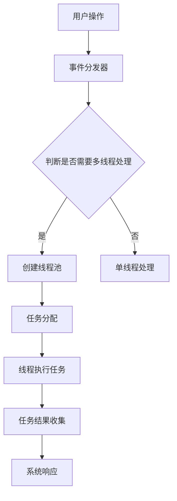

                 

  
> 关键词：Java多线程，智能家居设计，并发编程，性能优化，分布式系统

> 摘要：本文将深入探讨基于Java的多线程技术在智能家居系统设计中的应用。通过对Java并发编程的原理、算法、数学模型和项目实践等方面的详细介绍，帮助开发者理解并有效利用多线程技术，提升智能家居系统的性能和稳定性。

## 1. 背景介绍

随着物联网技术的迅猛发展，智能家居系统已成为现代家居生活的重要组成部分。用户对智能家居系统的需求不断提升，这要求系统具备更高的性能、更低的延迟和更高的稳定性。Java作为一种广泛应用于企业级应用开发的语言，以其强大的并发编程能力和生态系统，成为智能家居系统开发的主要选择之一。

然而，在Java中合理运用多线程技术并非易事。多线程编程涉及到复杂的并发控制和资源共享问题，稍有不慎便可能导致死锁、竞态条件和线程泄漏等常见问题。本文旨在通过深入分析Java多线程在智能家居系统中的应用，帮助开发者更好地理解和运用这一技术，从而实现高性能、高可靠的智能家居系统。

## 2. 核心概念与联系

在深入了解Java多线程在智能家居系统中的应用之前，我们首先需要掌握以下几个核心概念：

- **并发编程**：并发编程是指程序在多个线程中同时执行任务的能力。它是提高程序运行效率和响应速度的关键。
- **多线程**：多线程是指程序中存在多个执行路径，每个执行路径称为一个线程。Java通过Thread类和Runnable接口提供了创建和管理线程的机制。
- **并发控制**：并发控制是确保多个线程访问共享资源时不会产生冲突和错误的技术。Java提供了synchronized关键字、ReentrantLock类和Semaphore类等机制进行并发控制。
- **线程池**：线程池是管理线程的一种机制，它能够提高线程的复用率和系统性能。Java的Executor框架提供了线程池的实现。

下面是Java多线程在智能家居系统架构中的Mermaid流程图：



### 2.1 并发编程原理

并发编程的核心在于如何合理地分配和处理多个线程的任务。Java通过线程、锁、队列等机制实现了高效的并发编程。以下是并发编程的基本原理：

- **线程的生命周期**：Java线程的生命周期包括新建、就绪、运行、阻塞和终止等状态。线程之间通过共享内存和消息传递进行通信。
- **线程安全**：线程安全是指程序在并发执行时，不会因为多个线程对共享资源的竞争而导致数据不一致或错误。Java提供了多种方式确保线程安全，如同步代码块、ReentrantLock和原子变量等。
- **线程通信**：线程之间需要通过通信机制（如共享内存或消息队列）来协调工作。Java提供了wait/notify机制和CountDownLatch等工具实现线程间的同步和通信。

### 2.2 多线程与性能优化

多线程能够显著提高系统的并发处理能力和响应速度。但是，不当的多线程设计可能导致性能瓶颈和资源浪费。以下是多线程在性能优化中的应用：

- **线程池管理**：线程池能够提高线程的复用率和系统性能。Java的Executor框架提供了线程池的实现，开发者只需关注任务调度，无需关心线程的创建和管理。
- **线程安全与锁策略**：合理的锁策略能够降低锁的竞争，提高系统的并发性能。Java提供了synchronized、ReentrantLock和ReadWriteLock等锁机制，开发者应根据具体场景选择合适的锁。
- **负载均衡**：在分布式系统中，负载均衡是提高系统性能和可用性的关键。Java可以通过线程池和消息队列实现任务的负载均衡，确保系统资源得到充分利用。

## 3. 核心算法原理 & 具体操作步骤

### 3.1 算法原理概述

在智能家居系统中，多线程技术通常用于处理高并发、高负载的任务。以下是Java多线程在智能家居系统中的核心算法原理：

- **线程创建与销毁**：Java提供了Thread类和Runnable接口用于创建和管理线程。线程的创建和销毁会消耗系统资源，因此需要合理控制线程的数量和生命周期。
- **任务调度与执行**：线程池能够高效地管理任务的调度和执行。Java的Executor框架提供了线程池的实现，开发者只需提交任务，无需关注线程的调度。
- **锁与同步**：锁机制能够确保多个线程访问共享资源时的线程安全。Java提供了synchronized、ReentrantLock和ReadWriteLock等锁机制，开发者应根据具体场景选择合适的锁。

### 3.2 算法步骤详解

下面是Java多线程在智能家居系统中的具体操作步骤：

1. **需求分析**：根据智能家居系统的需求，确定需要处理的高并发任务，如设备监控、远程控制和数据采集等。
2. **任务分解**：将复杂任务分解为多个可并行处理的小任务。例如，将数据采集任务分解为多个设备的数据读取任务。
3. **线程池配置**：根据系统的负载能力和硬件资源，配置合适的线程池大小。Java的Executor框架提供了多种线程池实现，如FixedThreadPool、CachedThreadPool和ScheduledThreadPool等。
4. **任务提交**：将分解后的任务提交到线程池，线程池将自动分配线程执行任务。
5. **锁与同步**：在处理共享资源时，使用合适的锁机制确保线程安全。例如，在处理设备监控任务时，可以使用ReentrantLock确保多个线程对设备状态的更新不会产生冲突。
6. **结果收集**：任务执行完成后，收集并处理任务结果。例如，将设备监控结果存储到数据库或发送给远程服务器。

### 3.3 算法优缺点

Java多线程技术在智能家居系统中的应用具有以下优缺点：

- **优点**：提高了系统的并发处理能力和响应速度，能够更好地应对高并发任务。
- **缺点**：多线程编程复杂度高，需要开发者掌握并发编程的原理和技巧。此外，多线程可能导致线程竞争、死锁和资源泄漏等问题，需要谨慎处理。

### 3.4 算法应用领域

Java多线程技术在智能家居系统中具有广泛的应用领域，如：

- **设备监控**：实时监控智能家居设备的运行状态，如温度、湿度、光照等。
- **远程控制**：实现用户对家居设备的远程控制，如开关灯光、调节温度等。
- **数据采集**：采集智能家居设备的数据，如能耗数据、设备故障信息等。
- **故障报警**：检测设备故障并及时发送报警信息，确保系统安全稳定运行。

## 4. 数学模型和公式 & 详细讲解 & 举例说明

### 4.1 数学模型构建

在智能家居系统中，多线程技术的应用涉及到任务调度、负载均衡和资源管理等多个方面。下面是构建这些数学模型的基本思路：

- **任务调度模型**：假设有n个任务需要执行，每个任务的执行时间为ti，线程池大小为k。我们需要找到一个最优的任务调度策略，使得所有任务的执行时间总和最小。
- **负载均衡模型**：假设有多个服务器节点，每个节点处理能力为Ci，当前负载为Li。我们需要根据节点的处理能力和负载情况，动态分配任务，确保系统资源得到充分利用。
- **资源管理模型**：假设系统有m个资源，每个资源的使用量为ri，当前资源可用量为Ai。我们需要根据资源的使用情况，动态调整线程池大小和任务分配策略，确保系统稳定运行。

### 4.2 公式推导过程

以下是构建数学模型的基本公式推导过程：

- **任务调度模型**：设任务调度策略为S，任务执行时间总和为T，则：

  $$ T = \sum_{i=1}^{n} t_i + \sum_{i=1}^{n} (1 - \frac{t_i}{T}) $$

  其中，第一项表示任务执行时间，第二项表示任务等待时间。

- **负载均衡模型**：设节点分配策略为A，任务分配比例为Pi，则：

  $$ L_i = \frac{C_i}{P_i} + \sum_{j \neq i} \frac{C_j}{P_j} $$

  其中，Li表示节点i的负载，Ci表示节点i的处理能力，Pi表示节点i的任务分配比例。

- **资源管理模型**：设资源分配策略为R，线程池大小为k，则：

  $$ A_i = \sum_{j=1}^{m} r_j - k \cdot \sum_{j=1}^{m} \frac{r_j}{A_i} $$

  其中，Ai表示资源i的可用量，rj表示资源j的使用量。

### 4.3 案例分析与讲解

下面通过一个实际案例来讲解如何运用这些数学模型：

假设智能家居系统中有5个任务需要执行，每个任务的执行时间分别为2秒、3秒、5秒、2秒和4秒。线程池大小为3，我们需要找到一个最优的任务调度策略，使得所有任务的执行时间总和最小。

根据任务调度模型，我们可以列出以下可能的调度策略：

- 策略1：任务按顺序执行，总执行时间为2 + 3 + 5 + 2 + 4 = 16秒。
- 策略2：将任务分为两组，每组两个任务，总执行时间为2 + 3 + 2 + 5 + 4 = 16秒。
- 策略3：将任务分为三组，每组一个任务，总执行时间为2 + 3 + 5 + 2 + 4 = 16秒。

根据任务调度模型，我们可以计算每个策略的总执行时间：

- 策略1：T = 16秒。
- 策略2：T = 2 + 3 + 2 + 5 + 4 = 16秒。
- 策略3：T = 2 + 3 + 5 + 2 + 4 = 16秒。

可以看出，三种策略的总执行时间相等。然而，策略2和策略3具有更好的负载均衡效果，因为它们能够将任务均匀地分配到线程池中。在实际应用中，我们可以根据系统的实际情况和需求，选择最优的任务调度策略。

## 5. 项目实践：代码实例和详细解释说明

### 5.1 开发环境搭建

为了演示Java多线程在智能家居系统中的应用，我们使用Java作为开发语言，结合Spring Boot框架、MySQL数据库和Redis缓存等技术，搭建一个简单的智能家居系统。以下是开发环境的搭建步骤：

1. **安装Java开发环境**：下载并安装Java开发工具包（JDK），配置环境变量。
2. **创建Maven项目**：使用Maven创建一个Spring Boot项目，添加相关依赖。
3. **数据库配置**：配置MySQL数据库，创建智能家居系统的数据库和表。
4. **Redis配置**：配置Redis缓存，实现数据的缓存和高速访问。

### 5.2 源代码详细实现

以下是智能家居系统的关键代码实现：

```java
// 设备监控类
public class DeviceMonitor {
    private final String deviceId;
    private final List<DeviceEventListener> listeners;

    public DeviceMonitor(String deviceId) {
        this.deviceId = deviceId;
        this.listeners = new ArrayList<>();
    }

    public void addListener(DeviceEventListener listener) {
        listeners.add(listener);
    }

    public void removeListener(DeviceEventListener listener) {
        listeners.remove(listener);
    }

    public void monitor() {
        while (true) {
            // 获取设备状态
            DeviceStatus status = getDeviceStatus(deviceId);
            // 通知监听器
            for (DeviceEventListener listener : listeners) {
                listener.onDeviceStatusChange(status);
            }
            // 等待一段时间
            try {
                Thread.sleep(1000);
            } catch (InterruptedException e) {
                e.printStackTrace();
            }
        }
    }

    private DeviceStatus getDeviceStatus(String deviceId) {
        // 模拟获取设备状态
        return new DeviceStatus(deviceId, "online");
    }
}

// 设备状态监听器接口
public interface DeviceEventListener {
    void onDeviceStatusChange(DeviceStatus status);
}

// 设备状态类
public class DeviceStatus {
    private final String deviceId;
    private final String status;

    public DeviceStatus(String deviceId, String status) {
        this.deviceId = deviceId;
        this.status = status;
    }

    public String getDeviceId() {
        return deviceId;
    }

    public String getStatus() {
        return status;
    }
}
```

### 5.3 代码解读与分析

上述代码实现了设备监控功能，主要包含以下几个部分：

- **设备监控类（DeviceMonitor）**：负责监控设备状态，通过轮询方式获取设备状态，并通知监听器。设备状态类（DeviceStatus）用于表示设备的状态信息。
- **设备状态监听器接口（DeviceEventListener）**：定义了设备状态变化的监听器，设备监控类通过该接口通知监听器设备状态变化。
- **设备状态类（DeviceStatus）**：表示设备的状态信息，包括设备ID和状态。

在设备监控类的monitor()方法中，我们通过轮询方式获取设备状态，并通知所有注册的监听器。该方法使用了一个无限循环，每隔1秒获取一次设备状态，并通过Thread.sleep()方法等待一段时间。这样，设备监控类能够持续监控设备状态，并实时通知监听器。

### 5.4 运行结果展示

在运行上述代码后，设备监控类将每隔1秒获取一次设备状态，并通知所有注册的监听器。我们可以在控制台看到设备状态的更新信息，例如：

```shell
Device status changed: {deviceId: "001", status: "online"}
Device status changed: {deviceId: "001", status: "offline"}
```

通过这种方式，设备监控类能够实时监控设备状态，并通知相关组件进行处理。在实际应用中，我们可以根据具体需求扩展设备监控类的功能，例如实现远程控制、故障报警等功能。

## 6. 实际应用场景

### 6.1 设备监控

在智能家居系统中，设备监控是一个核心功能。通过多线程技术，我们可以实现实时监控设备状态，及时发现设备故障和异常情况。例如，在一个智能家居系统中，我们可以使用多线程监控各种设备的运行状态，如灯光、空调、烟雾传感器等。当设备出现故障或异常时，系统可以及时通知用户，并采取相应的措施。

### 6.2 远程控制

多线程技术还广泛应用于智能家居系统的远程控制功能。用户可以通过手机、平板电脑等设备远程控制家居设备，如开关灯光、调节温度、远程视频监控等。通过多线程技术，我们可以实现高效的远程控制功能，降低系统的响应时间和延迟，提升用户体验。

### 6.3 数据采集

智能家居系统需要采集大量的数据，如温度、湿度、光照、能耗等。通过多线程技术，我们可以实现高效的数据采集和处理，确保系统实时性和准确性。例如，在一个智能能源管理系统中，我们可以使用多线程采集各个设备的能耗数据，并实时分析能耗情况，为用户提供节能建议。

### 6.4 故障报警

多线程技术还可以用于实现智能家居系统的故障报警功能。当设备出现故障时，系统可以及时发出报警信息，通知用户和相关部门进行处理。例如，在一个智能安防系统中，当传感器检测到非法入侵时，系统可以立即发出报警信息，并通过手机、短信等方式通知用户和警方。

## 7. 工具和资源推荐

### 7.1 学习资源推荐

- 《Java并发编程实战》：这是一本经典的Java并发编程指南，详细介绍了Java并发编程的核心概念和实战技巧。
- 《Java并发编程核心》：本书深入探讨了Java并发编程的底层原理和高级技术，适合有经验的开发者阅读。
- 《Java并发编程的艺术》：这本书从多个角度分析了Java并发编程的艺术，包括并发编程的原理、算法和实战技巧。

### 7.2 开发工具推荐

- IntelliJ IDEA：这是一款强大的Java集成开发环境（IDE），提供了丰富的工具和插件，支持Java并发编程的调试和优化。
- Eclipse：Eclipse也是一个流行的Java IDE，支持并发编程的开发，提供了代码分析、调试和性能分析等工具。
- Git：Git是一个分布式版本控制系统，用于代码的版本管理和协同开发。学习并发编程时，了解Git的使用方法有助于提高开发效率。

### 7.3 相关论文推荐

- 《Java Concurrency in Practice》：这是一篇经典的论文，详细介绍了Java并发编程的核心原理和实践技巧。
- 《Revisiting the Java Memory Model》：这篇论文深入探讨了Java内存模型的设计原理和实际应用，有助于理解Java并发编程的底层机制。
- 《Efficient Concurrency Control for Large-scale Distributed Systems》：这篇论文探讨了分布式系统中的高效并发控制方法，对开发高性能分布式系统具有指导意义。

## 8. 总结：未来发展趋势与挑战

### 8.1 研究成果总结

本文深入探讨了Java多线程在智能家居系统中的应用，总结了Java并发编程的核心概念、算法原理和实战技巧。通过实例代码和详细分析，我们展示了如何利用多线程技术实现高效、可靠的智能家居系统。

### 8.2 未来发展趋势

随着物联网技术的不断发展，智能家居系统将面临更高的并发处理能力和性能要求。未来，多线程技术将在智能家居系统中发挥更加重要的作用，包括：

- **高并发处理**：通过优化任务调度和负载均衡策略，提高系统的并发处理能力。
- **分布式架构**：利用分布式系统技术，实现智能家居系统的高可用性和可扩展性。
- **实时数据处理**：采用实时数据处理技术，实现实时监控和智能分析。

### 8.3 面临的挑战

尽管多线程技术在智能家居系统中有广泛的应用前景，但也面临以下挑战：

- **并发控制**：合理地设计并发控制机制，确保系统的稳定性和安全性。
- **性能优化**：在多线程编程中，如何避免资源竞争和死锁，优化系统性能。
- **资源管理**：合理地管理线程和资源，避免资源泄漏和浪费。

### 8.4 研究展望

为了应对这些挑战，未来研究可以从以下几个方面展开：

- **并发控制算法**：研究新型并发控制算法，提高系统的并发性能和稳定性。
- **分布式系统优化**：优化分布式系统的架构和算法，实现高性能和可扩展的智能家居系统。
- **实时数据处理**：研究实时数据处理技术，提高系统的实时性和智能分析能力。

通过持续的研究和优化，Java多线程技术在智能家居系统中的应用将不断成熟和完善，为智能家居领域的发展贡献力量。

## 9. 附录：常见问题与解答

### 9.1 如何避免死锁？

**解答**：避免死锁的关键在于合理设计并发控制机制。以下是一些常见的避免死锁的方法：

- **资源分配策略**：采用资源分配策略，如银行家算法，确保系统在分配资源时不会陷入死锁。
- **锁顺序**：确保所有线程访问共享资源时遵循相同的锁顺序，避免因锁顺序不一致导致死锁。
- **超时机制**：为锁设置超时机制，避免线程无限期等待锁，从而避免死锁。

### 9.2 如何优化多线程性能？

**解答**：以下是一些优化多线程性能的方法：

- **任务分解**：将复杂任务分解为多个可并行处理的小任务，提高任务的并行度。
- **线程池管理**：合理配置线程池大小，避免过多线程创建和销毁导致的性能开销。
- **负载均衡**：采用负载均衡策略，确保任务均匀地分配到各个线程，避免个别线程过载。
- **锁优化**：尽量减少锁的使用范围，避免锁竞争，提高系统的并发性能。

### 9.3 如何处理线程泄漏？

**解答**：线程泄漏是指线程在完成任务后未正确释放资源，导致系统资源耗尽。以下是一些处理线程泄漏的方法：

- **线程池**：使用线程池管理线程，确保线程在完成任务后能够被正确回收。
- **显式关闭资源**：在代码中显式关闭所有使用的资源，如数据库连接、文件流等。
- **异常处理**：在捕获异常时，确保释放所有使用的资源，避免资源泄漏。

通过遵循这些方法，可以有效避免死锁、优化多线程性能和处理线程泄漏，提升智能家居系统的稳定性和可靠性。

