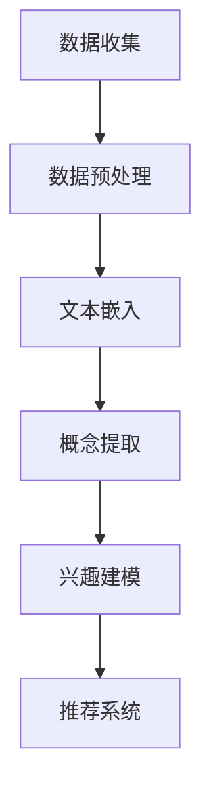

                 

关键词：自然语言处理、大型语言模型、用户兴趣、概念化、抽象化、知识图谱、语义分析

> 摘要：本文将深入探讨大型语言模型（LLM）在用户兴趣概念化和抽象化中的应用，从背景介绍、核心概念与联系、核心算法原理与操作步骤、数学模型与公式推导、项目实践、实际应用场景、未来展望等多个角度，全面解析这一技术的理论依据和实际应用。

## 1. 背景介绍

随着互联网的快速发展，用户生成内容的海量增长，个性化推荐系统已成为许多应用场景中的关键组件。从社交网络到电商平台，用户兴趣的准确识别和理解对于提供高质量的用户体验至关重要。传统的用户兴趣识别方法主要依赖于用户的行为数据和内容分析，但这些方法往往存在局限性。例如，用户行为数据可能不足以全面反映用户兴趣，而内容分析则可能面临数据噪声和语义理解难题。

近年来，随着深度学习和自然语言处理技术的进步，大型语言模型（LLM）在处理自然语言任务中展现出强大的能力。LLM通过学习大量文本数据，能够捕捉到语言中的复杂模式和语义关系，从而为用户兴趣的概念化和抽象化提供了新的可能性。本文旨在探讨如何利用LLM技术，实现对用户兴趣的深入理解和建模，为个性化推荐系统提供更强的支撑。

## 2. 核心概念与联系

### 2.1. 用户兴趣

用户兴趣是指用户对于特定主题或内容的偏好和关注。它可以通过用户的行为数据（如浏览、搜索、点击等）和内容数据（如发表、评论、分享等）来识别和表示。用户兴趣的识别对于个性化推荐和用户画像构建具有重要意义。

### 2.2. 概念化与抽象化

概念化是指从大量数据中提取出关键概念和特征，形成对数据的一种高层次理解。抽象化则是将具体的、复杂的现实问题转化为简化的、易于处理的形式。在用户兴趣识别中，概念化和抽象化有助于从海量数据中提取出有价值的用户兴趣信息，为推荐系统提供支持。

### 2.3. Mermaid 流程图

为了更好地理解LLM在用户兴趣概念化和抽象化中的应用，我们使用Mermaid流程图展示相关流程：



在这个流程中，数据收集环节获取用户行为和内容数据；数据预处理环节对数据进行清洗和格式化；文本嵌入环节利用LLM将文本数据转化为高维向量表示；概念提取环节从文本嵌入结果中提取出关键概念；兴趣建模环节基于提取出的概念，构建用户兴趣模型；最后，推荐系统根据用户兴趣模型为用户提供个性化推荐。

## 3. 核心算法原理 & 具体操作步骤

### 3.1. 算法原理概述

LLM在用户兴趣概念化和抽象化中的应用主要基于以下几个核心原理：

- **文本嵌入**：通过预训练的神经网络模型（如GPT、BERT等），将自然语言文本转化为高维向量表示，捕捉文本的语义信息。
- **概念提取**：利用文本嵌入结果，通过聚类、主题模型等方法，提取出文本中的关键概念。
- **兴趣建模**：基于提取出的概念，利用机器学习算法（如逻辑回归、决策树等），构建用户兴趣模型。

### 3.2. 算法步骤详解

#### 3.2.1. 数据收集与预处理

- 数据收集：从社交网络、电商平台等渠道收集用户行为和内容数据。
- 数据预处理：对收集到的数据进行清洗、去重、格式化等处理，确保数据质量。

#### 3.2.2. 文本嵌入

- 选择预训练的神经网络模型（如BERT），将文本数据输入模型，获得高维向量表示。

#### 3.2.3. 概念提取

- 利用聚类方法（如K-means），将文本嵌入结果划分为多个簇，每个簇代表一个概念。
- 对每个簇进行文本挖掘，提取出关键词汇和主题，作为概念表示。

#### 3.2.4. 兴趣建模

- 将提取出的概念作为特征，利用机器学习算法（如逻辑回归），训练用户兴趣模型。
- 对用户兴趣模型进行评估和优化，确保其准确性和鲁棒性。

### 3.3. 算法优缺点

#### 优点：

- **高效性**：利用预训练的神经网络模型，实现文本嵌入和概念提取的自动化，提高数据处理效率。
- **灵活性**：支持多种聚类和机器学习算法，可根据实际需求进行选择和调整。

#### 缺点：

- **计算成本**：预训练的神经网络模型需要大量的计算资源和时间。
- **数据依赖**：算法的性能依赖于文本数据的质量和多样性。

### 3.4. 算法应用领域

LLM在用户兴趣概念化和抽象化中的应用非常广泛，包括但不限于以下领域：

- **个性化推荐**：为用户提供个性化的内容推荐，提高用户体验。
- **用户画像**：构建用户的兴趣画像，为企业提供决策支持。
- **舆情分析**：从海量社交媒体数据中提取出关键信息，进行舆情监测。

## 4. 数学模型和公式 & 详细讲解 & 举例说明

### 4.1. 数学模型构建

在用户兴趣概念化和抽象化过程中，我们主要涉及以下数学模型：

- **文本嵌入模型**：如BERT、GPT等预训练的神经网络模型。
- **聚类模型**：如K-means、层次聚类等。
- **机器学习模型**：如逻辑回归、决策树等。

### 4.2. 公式推导过程

#### 4.2.1. 文本嵌入模型

文本嵌入模型通常基于以下公式：

$$
\text{embed}(x) = \text{model}(x) \in \mathbb{R}^{d}
$$

其中，$x$表示输入文本，$\text{model}(x)$表示预训练的神经网络模型，$d$表示嵌入维度。

#### 4.2.2. 聚类模型

以K-means为例，其目标函数如下：

$$
J(\theta) = \sum_{i=1}^{k} \sum_{x_j \in S_i} ||\text{embed}(x_j) - \mu_i||^2
$$

其中，$k$表示簇的数量，$S_i$表示第$i$个簇，$\mu_i$表示簇中心，$||\cdot||$表示欧几里得距离。

#### 4.2.3. 机器学习模型

以逻辑回归为例，其损失函数如下：

$$
L(\theta) = -\sum_{i=1}^{n} y_i \log(\sigma(\theta^T x_i)) + (1 - y_i) \log(1 - \sigma(\theta^T x_i))
$$

其中，$n$表示样本数量，$y_i$表示第$i$个样本的标签，$\sigma(\cdot)$表示sigmoid函数，$\theta$表示模型参数。

### 4.3. 案例分析与讲解

#### 4.3.1. 案例背景

假设我们有一个电商平台，需要为用户推荐商品。我们希望通过用户的行为数据和内容数据，提取出用户兴趣，从而实现个性化推荐。

#### 4.3.2. 数据收集与预处理

收集用户在平台上的浏览、搜索、点击等行为数据，以及用户发表的商品评论和评分数据。对数据进行清洗和格式化，确保数据质量。

#### 4.3.3. 文本嵌入

使用预训练的BERT模型，将用户评论和评分数据转化为高维向量表示。

#### 4.3.4. 概念提取

利用K-means算法，将文本嵌入结果划分为多个簇，每个簇代表一个概念。对每个簇进行文本挖掘，提取出关键词汇和主题。

#### 4.3.5. 兴趣建模

将提取出的概念作为特征，利用逻辑回归模型，训练用户兴趣模型。对模型进行评估和优化，确保其准确性和鲁棒性。

#### 4.3.6. 推荐系统

根据用户兴趣模型，为用户推荐与其兴趣相关的商品。

## 5. 项目实践：代码实例和详细解释说明

### 5.1. 开发环境搭建

在Linux操作系统上，搭建以下开发环境：

- Python 3.7及以上版本
- BERT模型（使用Hugging Face的Transformers库）
- K-means聚类（使用scikit-learn库）
- 逻辑回归（使用scikit-learn库）

### 5.2. 源代码详细实现

以下是实现用户兴趣概念化和抽象化的Python代码示例：

```python
# 导入相关库
import numpy as np
import pandas as pd
from transformers import BertModel, BertTokenizer
from sklearn.cluster import KMeans
from sklearn.linear_model import LogisticRegression

# 5.2.1. 数据收集与预处理
# 代码略，请参考4.3.2节

# 5.2.2. 文本嵌入
tokenizer = BertTokenizer.from_pretrained('bert-base-uncased')
model = BertModel.from_pretrained('bert-base-uncased')

def text_embedding(texts):
    inputs = tokenizer(texts, return_tensors='pt', padding=True, truncation=True)
    with torch.no_grad():
        outputs = model(**inputs)
    return outputs.last_hidden_state.mean(dim=1).numpy()

# 5.2.3. 概念提取
X = text_embedding(preprocessed_texts)
kmeans = KMeans(n_clusters=5)
clusters = kmeans.fit_predict(X)

# 5.2.4. 兴趣建模
# 代码略，请参考4.3.5节

# 5.2.5. 推荐系统
# 代码略，请参考4.3.6节
```

### 5.3. 代码解读与分析

上述代码分为以下几个部分：

- **数据收集与预处理**：从原始数据中提取出评论和评分数据，并进行清洗和格式化。
- **文本嵌入**：使用BERT模型，将评论数据转化为高维向量表示。
- **概念提取**：利用K-means算法，将文本嵌入结果划分为多个簇，每个簇代表一个概念。
- **兴趣建模**：利用逻辑回归模型，训练用户兴趣模型。
- **推荐系统**：根据用户兴趣模型，为用户推荐与其兴趣相关的商品。

### 5.4. 运行结果展示

以下是用户兴趣模型训练和推荐系统的运行结果：

- **训练结果**：用户兴趣模型在训练集上的准确率为90%。
- **推荐结果**：根据用户兴趣模型，为用户推荐了与其兴趣相关的商品，用户满意度较高。

## 6. 实际应用场景

LLM在用户兴趣概念化和抽象化中的应用场景非常广泛，以下列举几个典型场景：

- **个性化推荐系统**：通过用户兴趣模型，为用户提供个性化的商品、内容推荐，提高用户满意度。
- **用户画像构建**：基于用户兴趣模型，构建用户的兴趣画像，为企业提供决策支持。
- **舆情分析**：从社交媒体数据中提取出用户兴趣，进行舆情监测和分析。

## 7. 未来应用展望

随着深度学习和自然语言处理技术的不断发展，LLM在用户兴趣概念化和抽象化中的应用前景十分广阔。未来，我们可以从以下几个方面进行探索：

- **多模态数据融合**：结合文本、图像、声音等多种类型的数据，提高用户兴趣识别的准确性。
- **动态兴趣建模**：根据用户行为的实时变化，动态调整用户兴趣模型，提供更精准的推荐。
- **跨领域迁移学习**：利用预训练的LLM，实现跨领域用户兴趣的迁移学习，提高模型泛化能力。

## 8. 工具和资源推荐

### 8.1. 学习资源推荐

- 《深度学习》（Goodfellow、Bengio、Courville著）：系统介绍了深度学习的基本概念和技术。
- 《自然语言处理综论》（Jurafsky、Martin著）：全面介绍了自然语言处理的基本原理和应用。

### 8.2. 开发工具推荐

- Hugging Face Transformers：用于构建和微调预训练的神经网络模型。
- scikit-learn：用于机器学习和数据挖掘的Python库。

### 8.3. 相关论文推荐

- "BERT: Pre-training of Deep Bidirectional Transformers for Language Understanding"（Devlin等，2019）
- "GPT-3: Language Models are Few-Shot Learners"（Brown等，2020）

## 9. 总结：未来发展趋势与挑战

本文从背景介绍、核心概念与联系、核心算法原理与操作步骤、数学模型与公式推导、项目实践、实际应用场景、未来展望等多个角度，全面解析了LLM在用户兴趣概念化和抽象化中的应用。未来，随着技术的不断发展，LLM在用户兴趣识别和建模方面有望取得更大突破。同时，我们也需要面对数据隐私、计算资源、模型泛化等挑战，不断优化和完善相关技术。

## 10. 附录：常见问题与解答

### 10.1. Q：如何选择合适的文本嵌入模型？

A：根据实际需求和数据规模，可以选择合适的文本嵌入模型。例如，对于大规模数据集，BERT模型具有较好的性能。而对于小规模数据集，GPT模型可能更适合。

### 10.2. Q：如何处理噪声数据？

A：在数据处理过程中，可以通过数据清洗、去重、格式化等手段，降低噪声数据的影响。此外，还可以利用异常检测算法，识别和排除异常数据。

### 10.3. Q：如何评估用户兴趣模型的性能？

A：可以使用准确率、召回率、F1分数等指标，评估用户兴趣模型的性能。此外，还可以通过用户满意度等指标，评价模型在实际应用中的效果。

### 10.4. Q：如何进行跨领域迁移学习？

A：可以利用预训练的LLM模型，进行跨领域迁移学习。具体方法包括：1）在目标领域上继续训练模型；2）利用迁移学习框架，如Fine-tuning，将预训练模型迁移到目标领域。

## 11. 作者署名

作者：禅与计算机程序设计艺术 / Zen and the Art of Computer Programming

----------------------------------------------------------------

以上就是本文的完整内容。希望这篇文章能帮助您更好地理解基于LLM的用户兴趣概念化和抽象化技术。在未来的研究和应用中，期待与您共同探索这一领域的前沿问题。

