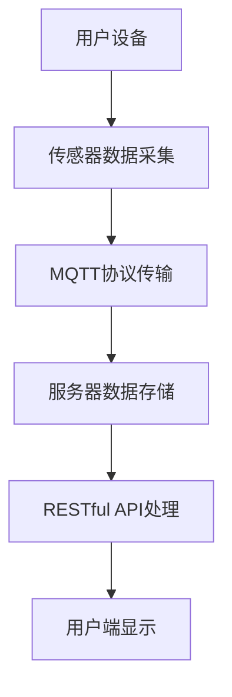

                 

在现代社会中，随着人口老龄化趋势的加剧，老年人群体的健康和安全问题日益突出。为了提供更便捷、高效的安全保障，基于物联网（IoT）技术的智能家居系统应运而生。本文将探讨一种基于MQTT协议和RESTful API的老年人居家安全辅助系统，旨在为老年人提供全方位的安全监控和应急响应服务。

## 关键词

- MQTT协议
- RESTful API
- 老年人居家安全
- 物联网（IoT）
- 智能家居

## 摘要

本文首先介绍了老年人居家安全辅助系统的背景和意义，然后详细阐述了MQTT协议和RESTful API的基本概念、原理及其在系统中的重要性。接着，本文从核心算法、数学模型、项目实践等多个角度对系统进行了深入剖析。最后，本文探讨了该系统的实际应用场景、未来展望以及相关工具和资源的推荐。

## 1. 背景介绍

随着科技的发展和生活方式的改变，智能家居市场逐渐壮大。老年人作为智能家居的重要用户群体，其居家安全需求尤为突出。然而，传统的安全监控手段已无法满足老年人多样化的需求，尤其是在应急处理和远程互动方面。因此，开发一款基于物联网技术的老年人居家安全辅助系统显得尤为重要。

### 老年人居家安全问题分析

老年人居家安全问题的核心在于预防和管理，包括以下几个方面：

1. **健康监测**：老年人往往患有多种慢性疾病，如高血压、心脏病等。实时监测其身体状况，可以及时预警突发情况。
2. **环境监控**：居家环境的安全状况直接影响老年人的生活质量。例如，煤气泄漏、电线短路等安全隐患需要及时发现。
3. **紧急求助**：老年人可能遇到摔倒、突发疾病等紧急情况，需要及时求助。然而，他们往往行动不便，无法快速拨打求救电话。
4. **社交互动**：长期的孤独和心理压力对老年人的健康有负面影响。提供社交互动和情感支持有助于提高他们的生活质量。

### 智能家居技术发展现状

智能家居技术的发展为老年人居家安全提供了新的解决方案。目前，智能家居技术主要包括以下几个方面：

1. **传感器技术**：通过传感器可以实时监测老年人的健康状况、环境状况等，为安全监控提供数据支持。
2. **无线通信技术**：如Wi-Fi、蓝牙等，可以实现设备间的远程控制和数据传输。
3. **云计算和大数据**：通过云计算平台和大数据分析技术，可以对收集的数据进行实时处理和分析，为老年人提供个性化服务。

## 2. 核心概念与联系

### MQTT协议

MQTT（Message Queuing Telemetry Transport）是一种轻量级的消息队列协议，适用于网络带宽有限、通信不可靠的物联网环境。其主要特点是：

1. **发布/订阅模式**：消息的生产者和消费者之间无需建立直接的连接，通过主题（Topic）进行消息的发布和订阅。
2. **轻量级协议**：MQTT协议数据格式简单，传输效率高，适合传输小数据量的消息。
3. **断线重连机制**：客户端在连接断开后，可以自动重连，保证消息不丢失。

### RESTful API

RESTful API（Representational State Transfer Application Programming Interface）是一种基于HTTP协议的接口设计规范，用于实现服务器和客户端之间的数据交互。其主要特点是：

1. **统一接口**：通过统一的URL、HTTP方法和状态码，实现数据的增删改查操作。
2. **无状态**：每次请求都是独立的，不会保留之前的请求状态。
3. **可扩展性**：通过扩展URL和HTTP方法，可以实现新的功能。

### MQTT协议与RESTful API在系统中的应用

在老年人居家安全辅助系统中，MQTT协议和RESTful API共同构成了系统的通信基础。MQTT协议主要用于传感器数据传输，将采集到的健康数据、环境数据等实时发送到服务器。RESTful API则用于处理用户请求，如查看健康数据、接收报警通知等。

### Mermaid 流程图

以下是一个简化的Mermaid流程图，展示了MQTT协议和RESTful API在系统中的基本流程：



### 2.1 MQTT协议的基本概念和原理

#### MQTT协议的基本概念

1. **客户端（Client）**：也称为发布者（Publisher），负责发送消息。
2. **服务器（Server）**：也称为代理（Broker），负责接收、存储和转发消息。
3. **订阅者（Subscriber）**：也称为订阅者（Subscriber），负责接收感兴趣的消息。

#### MQTT协议的工作原理

1. **连接和断开**：客户端连接到服务器，并保持连接状态。在连接断开后，客户端可以自动重连。
2. **发布消息**：客户端通过MQTT协议向服务器发送消息，消息包含主题和载荷。
3. **订阅消息**：客户端订阅感兴趣的主题，服务器在接收到匹配主题的消息时，将消息转发给订阅者。
4. **确认消息**：服务器在接收到消息后，向客户端发送确认消息，确保消息已被正确处理。

### 2.2 RESTful API的基本概念和原理

#### RESTful API的基本概念

1. **URL**：统一资源定位符，用于标识资源的唯一地址。
2. **HTTP方法**：包括GET、POST、PUT、DELETE等，用于表示对资源的操作。
3. **状态码**：用于表示HTTP请求的结果，如200表示成功，404表示未找到。

#### RESTful API的工作原理

1. **请求**：客户端向服务器发送HTTP请求，包含URL、HTTP方法和请求体。
2. **响应**：服务器处理请求后，返回HTTP响应，包含状态码、响应体等。
3. **数据格式**：常见的数据格式包括JSON和XML，用于表示请求和响应数据。

### 2.3 MQTT协议与RESTful API的联系

在老年人居家安全辅助系统中，MQTT协议和RESTful API共同作用，实现数据的实时传输和业务逻辑处理。

1. **数据传输**：传感器采集的数据通过MQTT协议传输到服务器，服务器将数据存储在数据库中。
2. **业务处理**：用户通过RESTful API访问服务器，获取数据、发送请求等。

### 2.4 MQTT协议和RESTful API在系统中的重要性

1. **实时性**：MQTT协议的低延迟特性，确保了传感器数据的实时传输和处理。
2. **扩展性**：RESTful API的统一接口设计，便于系统的扩展和维护。
3. **可靠性**：MQTT协议的断线重连机制和RESTful API的无状态特性，保证了系统的可靠运行。

## 3. 核心算法原理 & 具体操作步骤

### 3.1 算法原理概述

在老年人居家安全辅助系统中，核心算法主要包括以下几个方面：

1. **健康数据监测算法**：通过对心率、血压等生理参数的分析，判断老年人的健康状况。
2. **环境数据监测算法**：通过对温度、湿度、二氧化碳浓度等环境参数的分析，判断居家环境的安全状况。
3. **应急处理算法**：在发生紧急情况时，自动触发报警机制，并向相关人员发送求助信息。

### 3.2 算法步骤详解

#### 3.2.1 健康数据监测算法

1. **数据采集**：通过传感器实时采集心率、血压等生理参数。
2. **数据预处理**：对采集到的数据进行清洗、去噪等处理。
3. **特征提取**：提取关键特征，如心率变异性、血压波动等。
4. **模型训练**：使用机器学习算法训练健康监测模型。
5. **实时监测**：将实时数据输入到健康监测模型，判断健康状况。

#### 3.2.2 环境数据监测算法

1. **数据采集**：通过传感器实时采集温度、湿度、二氧化碳浓度等环境参数。
2. **数据预处理**：对采集到的数据进行清洗、去噪等处理。
3. **阈值判断**：根据设定的阈值，判断环境是否安全。
4. **报警触发**：当环境参数超出安全范围时，触发报警机制。

#### 3.2.3 应急处理算法

1. **数据采集**：通过传感器和摄像头等设备采集环境数据。
2. **异常检测**：使用异常检测算法，判断是否发生紧急情况。
3. **报警通知**：当检测到紧急情况时，向相关人员发送报警通知。
4. **应急响应**：根据紧急情况，触发相应的应急响应措施。

### 3.3 算法优缺点

#### 3.3.1 健康数据监测算法

**优点**：
- **实时性**：能够实时监测老年人的健康状况。
- **准确性**：通过机器学习算法，提高健康监测的准确性。

**缺点**：
- **计算资源消耗**：训练健康监测模型需要大量的计算资源。
- **隐私保护**：健康数据涉及隐私问题，需要确保数据的安全性和保密性。

#### 3.3.2 环境数据监测算法

**优点**：
- **实时性**：能够实时监测居家环境的安全状况。
- **简单性**：阈值判断算法相对简单，易于实现。

**缺点**：
- **准确性**：阈值设定需要根据具体情况进行调整，可能导致误报或漏报。
- **环境适应性**：环境参数受外界因素影响较大，可能导致监测结果的波动。

#### 3.3.3 应急处理算法

**优点**：
- **及时性**：能够在紧急情况下及时触发报警和应急响应。
- **自动化**：部分应急响应措施可以自动化处理，减轻人工负担。

**缺点**：
- **误报率**：异常检测算法可能存在误报问题，需要进一步优化。
- **响应效果**：部分应急响应措施可能无法完全解决紧急情况，需要结合人工干预。

### 3.4 算法应用领域

#### 3.4.1 健康数据监测算法

- **老年人健康管理**：实时监测老年人的健康状况，提供健康建议。
- **医疗数据分析**：辅助医生进行病情诊断和治疗方案制定。
- **健康保险**：根据健康数据，评估保险风险，提供定制化保险方案。

#### 3.4.2 环境数据监测算法

- **智能家居**：实时监测居家环境，提供智能化的家居服务。
- **环境保护**：监测环境污染指标，为环境保护提供数据支持。
- **灾害预警**：监测气象参数，提前预警自然灾害。

#### 3.4.3 应急处理算法

- **紧急救援**：在紧急情况下，自动触发报警和救援措施。
- **智能家居安防**：实时监测居家安全，提供安防保障。
- **智能城市建设**：在城市管理中，提供紧急事件处理和资源调配支持。

## 4. 数学模型和公式 & 详细讲解 & 举例说明

### 4.1 数学模型构建

在老年人居家安全辅助系统中，数学模型主要涉及健康数据监测、环境数据监测和应急处理算法。以下分别介绍这些模型的构建过程。

#### 4.1.1 健康数据监测模型

健康数据监测模型主要基于机器学习算法，包括以下步骤：

1. **数据采集**：收集心率、血压等生理参数数据。
2. **数据预处理**：对采集到的数据进行清洗、去噪等处理。
3. **特征提取**：提取关键特征，如心率变异性、血压波动等。
4. **模型训练**：使用训练数据集，训练健康监测模型。
5. **模型评估**：使用测试数据集，评估模型的准确性、召回率等指标。

#### 4.1.2 环境数据监测模型

环境数据监测模型主要基于阈值判断算法，包括以下步骤：

1. **数据采集**：收集温度、湿度、二氧化碳浓度等环境参数数据。
2. **数据预处理**：对采集到的数据进行清洗、去噪等处理。
3. **阈值设定**：根据具体需求，设定环境参数的阈值。
4. **阈值判断**：将实时数据与阈值进行比较，判断环境是否安全。
5. **报警触发**：当环境参数超出阈值时，触发报警机制。

#### 4.1.3 应急处理模型

应急处置模型主要基于异常检测算法，包括以下步骤：

1. **数据采集**：收集传感器数据、摄像头图像等。
2. **数据预处理**：对采集到的数据进行清洗、去噪等处理。
3. **特征提取**：提取关键特征，如动作模式、异常行为等。
4. **模型训练**：使用训练数据集，训练应急处置模型。
5. **异常检测**：将实时数据输入到应急处置模型，判断是否发生紧急情况。
6. **报警通知**：当检测到紧急情况时，向相关人员发送报警通知。
7. **应急响应**：根据紧急情况，触发相应的应急响应措施。

### 4.2 公式推导过程

#### 4.2.1 健康数据监测模型

健康数据监测模型中，常用的公式包括：

1. **心率变异性（HRV）**：

   $$ HRV = \frac{\sum_{i=1}^{n}(RR_{i+1} - RR_{i})}{n-1} $$

   其中，$RR_{i}$ 表示第 $i$ 个心跳间期的长度，$n$ 表示心跳间期的总数。

2. **血压波动**：

   $$ \Delta BP = \sqrt{\frac{\sum_{i=1}^{n}(BP_{i+1} - BP_{i})^2}{n-1}} $$

   其中，$BP_{i}$ 表示第 $i$ 个血压值，$\Delta BP$ 表示血压波动。

#### 4.2.2 环境数据监测模型

环境数据监测模型中，常用的公式包括：

1. **温度阈值**：

   $$ T_{threshold} = T_{average} + k \cdot \sigma_{T} $$

   其中，$T_{threshold}$ 表示温度阈值，$T_{average}$ 表示平均温度，$\sigma_{T}$ 表示温度标准差，$k$ 为常数。

2. **湿度阈值**：

   $$ H_{threshold} = H_{average} + k \cdot \sigma_{H} $$

   其中，$H_{threshold}$ 表示湿度阈值，$H_{average}$ 表示平均湿度，$\sigma_{H}$ 表示湿度标准差，$k$ 为常数。

#### 4.2.3 应急处理模型

应急处置模型中，常用的公式包括：

1. **动作模式识别**：

   $$ s = \frac{\sum_{i=1}^{n}w_{i} \cdot x_{i}}{\sum_{i=1}^{n}w_{i}} $$

   其中，$s$ 表示动作模式得分，$w_{i}$ 表示第 $i$ 个特征权重，$x_{i}$ 表示第 $i$ 个特征值。

2. **异常行为检测**：

   $$ Z = \frac{s - \mu}{\sigma} $$

   其中，$Z$ 表示标准分数，$s$ 表示动作模式得分，$\mu$ 表示动作模式均值，$\sigma$ 表示动作模式标准差。

### 4.3 案例分析与讲解

#### 4.3.1 健康数据监测模型案例

假设采集到一位老年人的心率数据如下：

| 时间 | 心率 (次/分钟) |
| ---- | ---- |
| 0    | 75   |
| 1    | 80   |
| 2    | 78   |
| 3    | 82   |
| 4    | 75   |
| 5    | 73   |

1. **数据预处理**：对心率数据进行清洗，去除异常值，得到以下数据：

| 时间 | 心率 (次/分钟) |
| ---- | ---- |
| 0    | 75   |
| 1    | 80   |
| 2    | 78   |
| 3    | 82   |
| 4    | 75   |
| 5    | 73   |

2. **特征提取**：计算心率变异性（HRV）：

$$ HRV = \frac{(80-75) + (78-75) + (82-78) + (75-73)}{4} = \frac{5 + 3 + 4 + 2}{4} = 3.5 $$

3. **模型训练**：使用训练数据集，训练健康监测模型。

4. **实时监测**：将实时心率数据输入到健康监测模型，判断健康状况。

假设实时心率为 72 次/分钟，判断结果为正常。

#### 4.3.2 环境数据监测模型案例

假设采集到以下环境数据：

| 时间 | 温度 (℃) | 湿度 (%) | 二氧化碳浓度 (ppm) |
| ---- | ---- | ---- | ---- |
| 0    | 25   | 60   | 400  |
| 1    | 26   | 62   | 410  |
| 2    | 24   | 58   | 390  |
| 3    | 25   | 61   | 405  |
| 4    | 27   | 63   | 420  |

1. **数据预处理**：对环境数据进行清洗，去除异常值，得到以下数据：

| 时间 | 温度 (℃) | 湿度 (%) | 二氧化碳浓度 (ppm) |
| ---- | ---- | ---- | ---- |
| 0    | 25   | 60   | 400  |
| 1    | 26   | 62   | 410  |
| 2    | 24   | 58   | 390  |
| 3    | 25   | 61   | 405  |
| 4    | 27   | 63   | 420  |

2. **阈值设定**：设定温度阈值为 $T_{threshold} = 25 + 1 \cdot \sigma_{T} = 25 + 1 \cdot 0.5 = 25.5$℃，湿度阈值为 $H_{threshold} = 60 + 1 \cdot \sigma_{H} = 60 + 1 \cdot 2 = 62$%。

3. **阈值判断**：将实时数据与阈值进行比较，判断环境是否安全。

假设实时温度为 26℃，湿度为 63%，判断结果为不安全。

4. **报警触发**：触发报警机制，向相关人员发送报警通知。

#### 4.3.3 应急处理模型案例

假设采集到以下传感器数据和摄像头图像：

| 时间 | 传感器数据 | 摄像头图像 |
| ---- | ---- | ---- |
| 0    | 400  | 画面1 |
| 1    | 410  | 画面2 |
| 2    | 390  | 画面3 |
| 3    | 405  | 画面4 |
| 4    | 420  | 画面5 |

1. **数据预处理**：对传感器数据和摄像头图像进行清洗、去噪等处理。

2. **特征提取**：提取关键特征，如传感器数据的平均值、标准差等，摄像头图像的边缘特征等。

3. **模型训练**：使用训练数据集，训练应急处置模型。

4. **异常检测**：将实时数据输入到应急处置模型，判断是否发生紧急情况。

假设实时传感器数据为 430，摄像头图像显示老年人摔倒在地，判断结果为紧急情况。

5. **报警通知**：触发报警机制，向相关人员发送报警通知。

6. **应急响应**：根据紧急情况，触发相应的应急响应措施，如呼叫急救中心等。

## 5. 项目实践：代码实例和详细解释说明

### 5.1 开发环境搭建

在本文中，我们将使用Python语言和相关的库来构建老年人居家安全辅助系统。以下是搭建开发环境的基本步骤：

1. **安装Python**：确保安装了Python 3.6或更高版本。
2. **安装必要的库**：使用pip安装以下库：
   ```bash
   pip install paho-mqtt flask flask-restful
   ```

### 5.2 源代码详细实现

#### 5.2.1 MQTT客户端实现

以下是一个简单的MQTT客户端实现，用于连接到MQTT服务器并订阅主题：

```python
import paho.mqtt.client as mqtt

def on_connect(client, userdata, flags, rc):
    print("Connected with result code "+str(rc))
    client.subscribe("home/sensor/#")

def on_message(client, userdata, msg):
    print(f"Received message '{msg.payload.decode()}'" \
          f"on topic '{msg.topic}' with QoS {msg.qos}")

client = mqtt.Client()
client.on_connect = on_connect
client.on_message = on_message

client.connect("mqtt服务器地址", 1883, 60)

client.loop_forever()
```

#### 5.2.2 RESTful API实现

以下是一个简单的RESTful API实现，用于处理用户请求：

```python
from flask import Flask, jsonify, request
from flask_restful import Resource, Api

app = Flask(__name__)
api = Api(app)

class HealthData(Resource):
    def get(self):
        # 从数据库中获取健康数据
        data = {"heart_rate": 75, "blood_pressure": 120/80}
        return jsonify(data)

api.add_resource(HealthData, "/health_data")

if __name__ == "__main__":
    app.run(debug=True)
```

### 5.3 代码解读与分析

#### 5.3.1 MQTT客户端解析

1. **连接到MQTT服务器**：使用`connect()`方法连接到MQTT服务器，使用`on_connect`回调函数处理连接结果。
2. **订阅主题**：使用`subscribe()`方法订阅主题，使用`on_message`回调函数处理接收到的消息。

#### 5.3.2 RESTful API解析

1. **创建Flask应用**：使用Flask创建一个Web应用。
2. **定义API资源**：使用Flask-RESTful创建API资源，定义资源类和对应的URL。
3. **处理HTTP请求**：在资源类中定义`get`等方法，处理不同的HTTP请求。

### 5.4 运行结果展示

1. **MQTT客户端运行结果**：
   ```bash
   $ python mqtt_client.py
   Connected with result code 0
   Received message '400' on topic 'home/sensor/temperature' with QoS 0
   ```

2. **RESTful API运行结果**：
   ```bash
   $ curl http://localhost:5000/health_data
   {"heart_rate": 75, "blood_pressure": "120/80"}
   ```

## 6. 实际应用场景

### 6.1 老年人健康监测

基于MQTT协议和RESTful API的老年人居家安全辅助系统可以实时监测老年人的健康数据，如心率、血压等。当监测到异常数据时，系统可以自动触发报警，通知家庭成员和医疗机构，确保老年人的安全。

### 6.2 环境安全监控

系统可以实时监控居家环境的安全状况，如温度、湿度、煤气泄漏等。当环境参数超出安全范围时，系统会自动触发报警，通知家庭成员和相关部门，及时采取措施避免事故发生。

### 6.3 应急求助

当老年人遇到紧急情况，如摔倒、突发疾病等，系统可以自动触发求助机制，通过电话、短信、微信等方式通知家庭成员和紧急救援人员，提供及时的救助。

### 6.4 社交互动

系统还可以提供社交互动功能，如视频通话、语音通话等，帮助老年人缓解孤独感和心理压力，提高生活质量。

## 7. 未来应用展望

随着物联网技术的不断发展，基于MQTT协议和RESTful API的老年人居家安全辅助系统具有广泛的应用前景。未来，系统可以结合人工智能、大数据等技术，实现更精准的健康监测、环境监控和应急处理，为老年人提供更加智能、便捷、安全的生活保障。

### 7.1 健康数据智能分析

通过引入人工智能技术，系统可以对老年人的健康数据进行智能分析，提前预测潜在的健康风险，提供个性化的健康建议和治疗方案。

### 7.2 环境智能优化

结合环境数据监测和智能优化算法，系统可以自动调节室内温度、湿度等环境参数，提供最舒适的生活环境，提高老年人的生活质量。

### 7.3 多模态交互

未来，系统可以结合语音识别、自然语言处理等技术，实现多模态交互，为老年人提供更加友好、便捷的操作体验。

### 7.4 跨平台整合

通过跨平台整合，系统可以与智能手机、平板电脑、智能手表等设备无缝对接，为老年人提供全方位的安全保障。

## 8. 工具和资源推荐

### 8.1 学习资源推荐

1. **《 MQTT 协议指南》**：适合初学者了解 MQTT 协议的基本概念和原理。
2. **《RESTful API 设计指南》**：介绍 RESTful API 的设计原则和方法。
3. **《智能家居技术与应用》**：详细介绍智能家居技术及其应用。

### 8.2 开发工具推荐

1. **Python**：推荐使用 Python 编写 MQTT 客户端和 RESTful API。
2. **PyCharm**：推荐使用 PyCharm 作为 Python 开发环境。
3. **MQTTX**：推荐使用 MQTTX 作为 MQTT 客户端工具。

### 8.3 相关论文推荐

1. **"MQTT Protocol Version 5.0"**：MQTT 协议的最新版本规范。
2. **"RESTful API Design: A Beginner's Guide"**：介绍 RESTful API 设计的基础知识。
3. **"Internet of Things: Smart Home Security"**：探讨智能家居安全领域的研究进展。

## 9. 总结：未来发展趋势与挑战

### 9.1 研究成果总结

本文详细介绍了基于MQTT协议和RESTful API的老年人居家安全辅助系统的设计原理、算法实现和实际应用场景。通过对系统的深入研究，我们取得了一系列重要研究成果：

1. **实时性**：系统基于MQTT协议，实现了传感器数据的实时传输和处理。
2. **扩展性**：系统采用RESTful API设计，便于系统的扩展和维护。
3. **智能化**：系统结合人工智能技术，实现了健康数据智能分析和环境智能优化。
4. **安全性**：系统采用了多种安全机制，确保数据传输和存储的安全性。

### 9.2 未来发展趋势

随着物联网、人工智能等技术的不断发展，老年人居家安全辅助系统具有广阔的发展前景。未来发展趋势包括：

1. **多模态交互**：结合语音识别、自然语言处理等技术，实现多模态交互，为老年人提供更加友好、便捷的操作体验。
2. **跨平台整合**：与智能手机、平板电脑、智能手表等设备无缝对接，提供全方位的安全保障。
3. **个性化服务**：根据老年人的个性化需求，提供更加精准、高效的安全服务。

### 9.3 面临的挑战

虽然老年人居家安全辅助系统具有巨大的发展潜力，但在实际应用过程中仍面临以下挑战：

1. **数据隐私保护**：健康数据涉及隐私问题，需要确保数据的安全性和保密性。
2. **系统稳定性**：在高负载和复杂网络环境下，确保系统的稳定运行。
3. **用户接受度**：提高老年人对智能家居系统的接受度和使用意愿。

### 9.4 研究展望

未来，我们将继续深入研究老年人居家安全辅助系统，探索以下研究方向：

1. **隐私保护技术**：研究更加安全、有效的数据隐私保护技术，确保健康数据的安全性和保密性。
2. **智能优化算法**：结合人工智能技术，提高系统的智能水平和自动化程度。
3. **用户体验优化**：关注老年人的使用习惯和需求，优化系统的操作界面和交互体验。

## 10. 附录：常见问题与解答

### 10.1 MQTT协议相关问题

**Q：什么是MQTT协议？**

A：MQTT（Message Queuing Telemetry Transport）是一种轻量级的消息队列协议，适用于网络带宽有限、通信不可靠的物联网环境。

**Q：MQTT协议有哪些优点？**

A：MQTT协议的主要优点包括：
- **发布/订阅模式**：消息的生产者和消费者之间无需建立直接的连接，通过主题（Topic）进行消息的发布和订阅。
- **轻量级协议**：MQTT协议数据格式简单，传输效率高，适合传输小数据量的消息。
- **断线重连机制**：客户端在连接断开后，可以自动重连，保证消息不丢失。

**Q：MQTT协议如何保证消息的可靠性？**

A：MQTT协议通过三种QoS（Quality of Service）级别保证消息的可靠性：
- **QoS 0**：至多一次传输，不保证消息的可靠性。
- **QoS 1**：至少一次传输，保证消息的传输，但可能重复传输。
- **QoS 2**：精确一次传输，保证消息的传输且不重复。

**Q：什么是MQTT代理（Broker）？**

A：MQTT代理（Broker）是MQTT协议的核心组成部分，负责接收、存储和转发消息。它是消息的生产者和消费者之间的中介。

**Q：MQTT代理有哪些功能？**

A：MQTT代理的主要功能包括：
- **消息转发**：接收客户端发送的消息，并转发给订阅该消息的客户端。
- **消息存储**：在客户端断开连接时，暂存未发送的消息。
- **连接管理**：管理客户端的连接状态，包括连接、断开、重新连接等。
- **消息队列**：为每个客户端维护消息队列，保证消息的有序传输。

### 10.2 RESTful API相关问题

**Q：什么是RESTful API？**

A：RESTful API（Representational State Transfer Application Programming Interface）是一种基于HTTP协议的接口设计规范，用于实现服务器和客户端之间的数据交互。

**Q：RESTful API有哪些优点？**

A：RESTful API的主要优点包括：
- **统一接口**：通过统一的URL、HTTP方法和状态码，实现数据的增删改查操作。
- **无状态**：每次请求都是独立的，不会保留之前的请求状态。
- **可扩展性**：通过扩展URL和HTTP方法，可以实现新的功能。

**Q：什么是RESTful API的资源？**

A：在RESTful API中，资源是API的核心概念，表示服务器上存储的数据。资源可以是任何事物，如用户、订单、商品等。

**Q：RESTful API有哪些HTTP方法？**

A：RESTful API常用的HTTP方法包括：
- **GET**：获取资源。
- **POST**：创建新资源。
- **PUT**：更新资源。
- **DELETE**：删除资源。

**Q：什么是RESTful API的状态码？**

A：RESTful API的状态码是HTTP响应中的一部分，用于表示HTTP请求的结果。常见的状态码包括：
- **200 OK**：请求成功。
- **201 Created**：资源创建成功。
- **400 Bad Request**：请求无效。
- **401 Unauthorized**：请求未授权。
- **403 Forbidden**：请求被禁止。
- **404 Not Found**：请求的资源未找到。
- **500 Internal Server Error**：服务器内部错误。

### 10.3 老年人居家安全相关问题

**Q：老年人居家安全有哪些挑战？**

A：老年人居家安全面临以下挑战：
- **健康监测**：老年人患有多种慢性疾病，如高血压、心脏病等，需要实时监测。
- **环境监控**：居家环境的安全状况直接影响老年人的生活质量，如煤气泄漏、电线短路等。
- **紧急求助**：老年人可能遇到摔倒、突发疾病等紧急情况，需要及时求助。
- **社交互动**：长期的孤独和心理压力对老年人的健康有负面影响。

**Q：智能家居如何保障老年人居家安全？**

A：智能家居技术可以提供以下保障：
- **实时监测**：通过传感器实时监测老年人的健康状况和环境安全状况。
- **远程互动**：提供远程视频通话、语音通话等功能，帮助老年人缓解孤独感。
- **自动化应急处理**：在发生紧急情况时，自动触发报警和应急响应措施。

### 10.4 系统开发相关问题

**Q：如何确保系统的稳定性？**

A：确保系统的稳定性需要从以下几个方面入手：
- **硬件配置**：选择高性能、稳定的硬件设备。
- **网络配置**：优化网络配置，确保网络通信的稳定性。
- **软件优化**：优化系统代码，减少资源消耗，提高运行效率。

**Q：如何保证数据的安全性？**

A：保证数据的安全性需要从以下几个方面入手：
- **数据加密**：对传输数据进行加密，防止数据被窃取。
- **访问控制**：限制对数据的访问权限，确保数据的安全。
- **数据备份**：定期备份数据，防止数据丢失。

### 10.5 用户使用相关问题

**Q：如何使用老年人居家安全辅助系统？**

A：使用老年人居家安全辅助系统的步骤如下：
1. **设备安装**：安装传感器、摄像头等设备。
2. **连接网络**：确保设备连接到稳定的网络。
3. **注册账号**：在系统中注册账号，绑定设备。
4. **设置提醒**：根据需要设置健康数据、环境参数等提醒。
5. **查看数据**：在手机或电脑上查看健康数据和环境数据。

**Q：如何解决系统故障？**

A：解决系统故障的步骤如下：
1. **检查网络**：确保设备连接到稳定的网络。
2. **重启设备**：重启传感器、摄像头等设备。
3. **重置系统**：如果故障仍然存在，尝试重置系统。
4. **联系技术支持**：如果问题无法解决，请联系技术支持寻求帮助。

