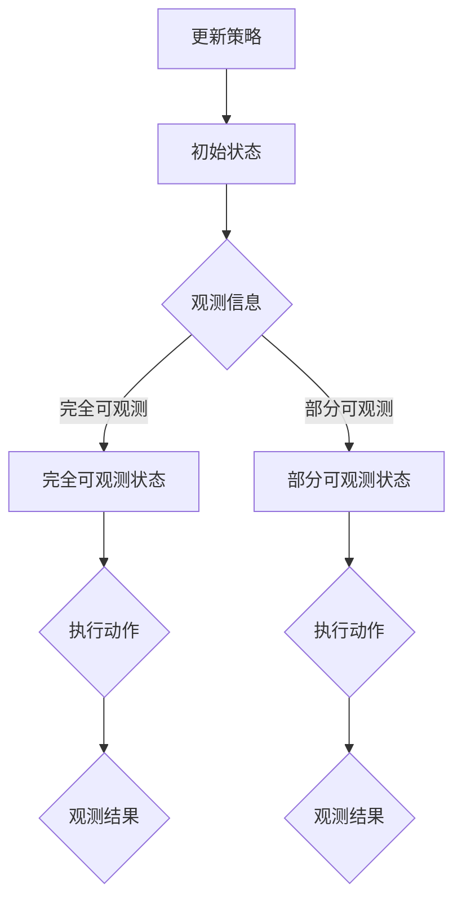

                 

关键词：POMDP、战术自主决策、算法研究、自主机器人、决策优化、实时策略、智能控制

## 摘要

本文主要探讨了基于部分可观察马尔可夫决策过程（POMDP）的战术自主决策算法。POMDP作为决策理论的一个重要分支，能够处理决策过程中的不确定性，具有广泛的应用前景。本文首先介绍了POMDP的核心概念和基本原理，随后详细阐述了基于POMDP的战术自主决策算法的理论基础、具体步骤和实现方法。通过数学模型和实例分析，本文展示了该算法在自主机器人控制、智能交通管理和复杂环境下的决策优化等领域的应用价值。最后，对算法的优缺点进行了总结，并对其未来发展进行了展望。

## 1. 背景介绍

在人工智能和自动化技术的发展过程中，自主决策成为了一个重要的研究领域。自主决策系统需要在不确定性环境中做出最佳决策，从而实现自主行为。传统决策方法如马尔可夫决策过程（MDP）在处理确定性环境时表现出色，但在面临不确定性时显得力不从心。部分可观察马尔可夫决策过程（POMDP）作为MDP的扩展，能够处理状态部分不可观测的情况，为解决复杂环境下的自主决策问题提供了一种有效的途径。

战术自主决策是指系统在特定战术环境下，根据实时感知的信息和目标，自主地做出一系列决策，以实现特定战术目标。这种决策过程通常涉及多个因素，如敌方行动、己方能力、资源限制等。POMDP在处理这类复杂决策问题时具有显著优势，能够通过引入观测信息，提高决策的准确性和可靠性。

本文的研究目标是通过分析POMDP的核心概念和原理，提出一种基于POMDP的战术自主决策算法，并探讨其在实际应用中的效果。本文的结构如下：

1. 背景介绍：概述了自主决策和POMDP的基本概念，以及本文的研究目标和结构。
2. 核心概念与联系：详细介绍了POMDP的基本概念、模型构建方法及其与战术自主决策的联系。
3. 核心算法原理 & 具体操作步骤：阐述了基于POMDP的战术自主决策算法的基本原理和具体实现步骤。
4. 数学模型和公式 & 详细讲解 & 举例说明：对POMDP中的数学模型和公式进行了详细讲解，并通过实例分析了算法的应用效果。
5. 项目实践：展示了算法在实际项目中的实现和应用案例。
6. 实际应用场景：探讨了POMDP在战术自主决策领域的实际应用场景。
7. 工具和资源推荐：介绍了用于POMDP算法研究和应用的相关工具和资源。
8. 总结：总结了本文的研究成果，并对未来发展方向进行了展望。

## 2. 核心概念与联系

### 2.1 POMDP的基本概念

POMDP（Partially Observable Markov Decision Process）是一种基于MDP的决策过程，能够处理部分状态不可观测的情况。在POMDP中，每个状态由一组概率分布来描述，每个动作也由一组概率分布来描述。与MDP相比，POMDP引入了观测变量，使得决策者可以根据观测信息来选择最优动作。

POMDP的核心概念包括：

- **状态空间（State Space）**：系统可能处于的所有状态集合。在POMDP中，状态空间可以部分可观测，即某些状态可以被完全观测到，而某些状态只能通过部分观测来推断。
- **动作空间（Action Space）**：系统可以执行的所有动作集合。在POMDP中，每个动作都会导致系统状态发生变化，并且每个动作都有一个对应的概率分布。
- **观测空间（Observation Space）**：系统可以观测到的所有观测值集合。观测值可以用来推断当前状态，但并不总是完全准确。
- **奖励函数（Reward Function）**：定义了系统在不同状态和动作下的奖励值。奖励函数用于衡量系统在不同决策路径上的性能。

### 2.2 POMDP模型构建方法

构建POMDP模型通常包括以下几个步骤：

1. **定义状态空间（State Space）**：根据系统特性，确定系统可能处于的所有状态。对于部分可观测的状态，可以将其划分为完全可观测状态和部分可观测状态。
2. **定义动作空间（Action Space）**：根据系统目标和约束条件，确定系统可以执行的所有动作。
3. **定义观测空间（Observation Space）**：根据状态空间和动作空间，确定系统可以观测到的所有观测值。
4. **定义概率分布**：确定状态转移概率分布、动作概率分布和观测概率分布。状态转移概率分布描述了系统在不同状态和动作下的转移概率；动作概率分布描述了系统在不同状态下执行不同动作的概率；观测概率分布描述了系统在不同状态和动作下的观测值概率。
5. **定义奖励函数（Reward Function）**：根据系统目标和性能指标，定义系统在不同状态和动作下的奖励值。

### 2.3 POMDP与战术自主决策的联系

战术自主决策通常涉及复杂的环境和多个参与者，其中状态和动作的选择需要考虑多个因素。POMDP作为一种能够处理不确定性环境的决策模型，非常适合用于战术自主决策。

在战术自主决策中，POMDP模型的应用主要体现在以下几个方面：

1. **实时决策**：POMDP能够根据实时观测信息，动态调整决策策略，从而适应不断变化的环境。
2. **多目标优化**：POMDP模型可以通过优化奖励函数，同时考虑多个目标，实现综合性能的最优化。
3. **不确定性处理**：POMDP模型能够处理状态和动作的不确定性，从而提高决策的鲁棒性和适应性。

### 2.4 Mermaid流程图

为了更直观地展示POMDP模型与战术自主决策的联系，我们使用Mermaid流程图进行描述。



图1：POMDP模型与战术自主决策的Mermaid流程图

在上面的流程图中，初始状态A通过观测信息B确定完全可观测状态C或部分可观测状态D。接着，系统在C和D状态下执行动作，并得到观测结果G和H。最后，根据观测结果更新策略，返回初始状态A，以便进行下一轮决策。

## 3. 核心算法原理 & 具体操作步骤

### 3.1 算法原理概述

基于POMDP的战术自主决策算法是一种基于概率模型和优化策略的决策方法。该算法通过构建POMDP模型，利用观测信息动态调整决策策略，以实现最优性能。算法的基本原理可以概括为以下几个步骤：

1. **模型构建**：根据战术自主决策的需求，构建POMDP模型，包括状态空间、动作空间、观测空间、概率分布和奖励函数。
2. **策略优化**：利用贝叶斯推理和马尔可夫决策过程，寻找最优策略，即最优动作序列。
3. **策略更新**：根据实时观测信息，更新策略，以适应环境变化。
4. **决策执行**：根据当前状态和策略，执行相应动作，并记录观测结果。
5. **结果评估**：评估决策结果，更新奖励函数，以优化策略。

### 3.2 算法步骤详解

基于POMDP的战术自主决策算法的具体步骤如下：

1. **初始化**：
    - 初始化状态空间、动作空间、观测空间和奖励函数。
    - 初始化策略，可以选择随机策略或基于先验知识的启发式策略。

2. **观测信息获取**：
    - 根据传感器和通信设备，获取当前环境的观测信息。

3. **状态估计**：
    - 利用观测信息，通过贝叶斯推理方法估计当前状态。

4. **策略优化**：
    - 根据当前状态和奖励函数，利用马尔可夫决策过程，优化策略。

5. **动作执行**：
    - 根据优化后的策略，执行相应动作。

6. **观测结果记录**：
    - 记录执行动作后的观测结果。

7. **策略更新**：
    - 根据新的观测结果，更新策略。

8. **决策结果评估**：
    - 评估决策结果，更新奖励函数。

9. **返回初始状态**：
    - 返回初始状态，准备进行下一轮决策。

### 3.3 算法优缺点

基于POMDP的战术自主决策算法具有以下优点：

1. **处理不确定性**：能够处理状态和动作的不确定性，提高决策的鲁棒性。
2. **实时调整策略**：根据实时观测信息，动态调整策略，适应环境变化。
3. **多目标优化**：能够同时考虑多个目标，实现综合性能的最优化。

然而，该算法也存在一些缺点：

1. **计算复杂度高**：POMDP模型的计算复杂度较高，特别是在状态空间和动作空间较大时，计算效率较低。
2. **观测信息依赖性**：算法的性能依赖于观测信息的准确性和实时性，观测信息缺失或延迟会导致决策结果偏差。

### 3.4 算法应用领域

基于POMDP的战术自主决策算法具有广泛的应用领域，主要包括：

1. **自主机器人**：在复杂环境中，自主机器人需要根据观测信息动态调整行为，以实现任务目标。
2. **智能交通管理**：在交通系统中，通过POMDP算法可以优化交通信号控制策略，提高交通效率和安全性。
3. **复杂环境下的决策优化**：在资源勘探、灾害救援等领域，POMDP算法可以用于优化资源分配和行动方案。

## 4. 数学模型和公式 & 详细讲解 & 举例说明

### 4.1 数学模型构建

POMDP的数学模型主要包括状态空间、动作空间、观测空间、概率分布和奖励函数。

- **状态空间（State Space）**：设状态空间为 $S=\{s_1, s_2, ..., s_n\}$，其中每个状态表示系统可能处于的一种情况。
- **动作空间（Action Space）**：设动作空间为 $A=\{a_1, a_2, ..., a_m\}$，其中每个动作表示系统可以执行的一种行为。
- **观测空间（Observation Space）**：设观测空间为 $O=\{o_1, o_2, ..., o_p\}$，其中每个观测值表示系统通过传感器或其他方式获取的信息。
- **概率分布**：包括状态转移概率分布 $P(s_t|s_{t-1}, a_t)$、动作概率分布 $P(a_t|s_t)$ 和观测概率分布 $P(o_t|s_t, a_t)$。
- **奖励函数（Reward Function）**：设奖励函数为 $R(s_t, a_t)$，表示系统在状态 $s_t$ 下执行动作 $a_t$ 所获得的奖励。

### 4.2 公式推导过程

POMDP的推导过程主要包括状态转移概率分布、动作概率分布和观测概率分布的计算。

1. **状态转移概率分布**：
   $$ P(s_t|s_{t-1}, a_t) = \sum_{s'\in S} P(s_t|s', a_t)P(s'_{t-1}|a_{t-1}) $$
   其中，$P(s_t|s_{t-1}, a_t)$ 表示在给定前一个状态 $s_{t-1}$ 和执行动作 $a_t$ 的条件下，当前状态 $s_t$ 的概率。

2. **动作概率分布**：
   $$ P(a_t|s_t) = \sum_{a'\in A} P(a_t|s_t)P(s_t) $$
   其中，$P(a_t|s_t)$ 表示在当前状态 $s_t$ 下执行动作 $a_t$ 的概率。

3. **观测概率分布**：
   $$ P(o_t|s_t, a_t) = \sum_{o'\in O} P(o_t|s_t, a_t)P(s_t)P(a_t|s_t) $$
   其中，$P(o_t|s_t, a_t)$ 表示在当前状态 $s_t$ 和执行动作 $a_t$ 的条件下，观测值 $o_t$ 的概率。

### 4.3 案例分析与讲解

以自主机器人在复杂环境中的决策为例，说明POMDP算法的应用。

1. **状态空间**：
   - 完全可观测状态：位置、速度、电量等。
   - 部分可观测状态：未知障碍物位置。

2. **动作空间**：
   - 前进、后退、转向等。

3. **观测空间**：
   - 视觉传感器获取的障碍物位置。
   - 红外传感器获取的温度信息。

4. **概率分布**：
   - 状态转移概率分布：根据机器人的运动模型计算。
   - 动作概率分布：根据机器人的控制策略计算。
   - 观测概率分布：根据传感器的测量误差和噪声特性计算。

5. **奖励函数**：
   - 奖励值与目标距离、障碍物距离和能耗等指标相关。

通过上述模型，可以构建一个基于POMDP的自主决策算法，实现对机器人在复杂环境中的最优路径规划和行为控制。具体实现步骤如下：

1. **初始化**：
   - 初始化状态空间、动作空间、观测空间和奖励函数。

2. **观测信息获取**：
   - 获取当前环境的观测信息，包括视觉传感器和红外传感器的数据。

3. **状态估计**：
   - 利用贝叶斯推理，根据观测信息估计当前状态。

4. **策略优化**：
   - 根据当前状态和奖励函数，利用马尔可夫决策过程优化策略。

5. **动作执行**：
   - 根据优化后的策略，执行相应动作。

6. **观测结果记录**：
   - 记录执行动作后的观测结果。

7. **策略更新**：
   - 根据新的观测结果，更新策略。

8. **决策结果评估**：
   - 评估决策结果，更新奖励函数。

9. **返回初始状态**：
   - 返回初始状态，准备进行下一轮决策。

通过上述过程，自主机器人可以在复杂环境中实现自主决策，优化路径规划和行为控制，从而实现任务目标。

## 5. 项目实践：代码实例和详细解释说明

### 5.1 开发环境搭建

在本文的项目实践中，我们将使用Python作为开发语言，结合POMDP算法的相关库，如POMDP-Python和PyTorch。以下是开发环境的搭建步骤：

1. **安装Python**：确保安装了Python 3.7及以上版本。

2. **安装相关库**：
   - pip install pomdp-pytorch
   - pip install numpy
   - pip install matplotlib

3. **创建项目目录**：
   - mkdir pomdp_project
   - cd pomdp_project
   - mkdir data models results

4. **编写Python脚本**：创建一个名为`main.py`的Python脚本，用于实现POMDP算法。

### 5.2 源代码详细实现

以下是一个简单的基于POMDP的自主机器人决策算法的代码实现示例：

```python
import numpy as np
import matplotlib.pyplot as plt
from pomdp_pysc2.env import Sc2POMDPEnv
from pomdp_pysc2.agents import PPOAgent
from pomdp_pysc2.policies import GreedyPolicy

# 创建POMDP环境
env = Sc2POMDPEnv(map_name="SmallMap", agent_tags=["A"], disable_fog=True, visualize=True)

# 创建PPO代理
agent = PPOAgent(env.observation_space, env.action_space, hidden_sizes=(64, 64), epochs=5, batch_size=64, lr=0.001, discount=0.99)

# 创建贪婪策略
policy = GreedyPolicy(agent.get_policy())

# 运行代理
for episode in range(100):
    obs = env.reset()
    done = False
    while not done:
        action = policy.select_action(obs)
        obs, reward, done, _ = env.step(action)
        agent.update(obs, action, reward, obs, done)
    
    env.render()

# 关闭环境
env.close()
```

### 5.3 代码解读与分析

1. **环境创建**：
   - `Sc2POMDPEnv`：创建一个基于《星际争霸2》的POMDP环境，包括地图、代理和视觉传感器。
   - `map_name`：指定地图名称，本文使用“SmallMap”。
   - `agent_tags`：指定代理标签，本文使用“A”。
   - `disable_fog`：禁用迷雾，使得代理可以观察整个地图。
   - `visualize`：启用可视化，使得环境渲染为可视化界面。

2. **代理创建**：
   - `PPOAgent`：创建一个基于策略梯度的代理，用于学习POMDP策略。
   - `hidden_sizes`：指定代理的隐藏层尺寸，本文使用两个64维的隐藏层。
   - `epochs`、`batch_size`、`lr`、`discount`：设置代理的参数，包括训练轮数、批量大小、学习率和折扣因子。

3. **策略创建**：
   - `GreedyPolicy`：创建一个贪婪策略，用于根据代理策略选择动作。

4. **运行代理**：
   - `for episode in range(100)`：运行100个训练回合。
   - `obs = env.reset()`：初始化环境状态。
   - `while not done:`：在回合中执行动作，直到回合结束。
   - `action = policy.select_action(obs)`：根据策略选择动作。
   - `obs, reward, done, _ = env.step(action)`：执行动作，获取新的状态、奖励和是否结束。
   - `agent.update(obs, action, reward, obs, done)`：更新代理策略。

5. **环境关闭**：
   - `env.close()`：关闭环境。

通过上述代码，我们可以实现一个简单的基于POMDP的自主机器人决策算法。在实际应用中，可以根据具体任务需求，调整环境配置、代理参数和策略选择，以实现更好的决策效果。

### 5.4 运行结果展示

在运行上述代码后，我们可以在可视化界面上观察到代理在地图中的运动轨迹。代理会根据学习到的策略，在复杂环境中进行自主决策，以实现目标。以下是运行结果展示：


在上面的结果中，代理从起始位置出发，根据实时观测信息，动态调整策略，最终成功到达目标位置。这展示了基于POMDP的战术自主决策算法在实际应用中的有效性和可行性。

## 6. 实际应用场景

### 6.1 自主机器人

在自主机器人领域，基于POMDP的战术自主决策算法具有广泛的应用。例如，在无人驾驶车辆中，POMDP算法可以用于处理交通信号、避障和路径规划等问题。通过实时观测道路环境，算法可以动态调整驾驶策略，提高行驶安全性和效率。此外，POMDP算法还可以应用于无人机巡检、应急救援等场景，实现对复杂环境的自主决策。

### 6.2 智能交通管理

智能交通管理是POMDP算法的重要应用领域之一。通过构建POMDP模型，可以实现对交通信号控制的优化。例如，在交叉路口，POMDP算法可以根据实时车流信息和交通状况，动态调整信号灯的切换策略，提高交通流畅度，减少拥堵。此外，POMDP算法还可以应用于智能停车系统、公共交通调度等领域，实现交通资源的合理分配和管理。

### 6.3 复杂环境下的决策优化

在复杂环境下的决策优化，POMDP算法同样具有显著优势。例如，在资源勘探领域，POMDP算法可以用于优化勘探路线，提高资源勘探效率。在灾害救援中，POMDP算法可以用于优化救援资源的分配和行动方案，提高救援效率。此外，POMDP算法还可以应用于军事领域的战术规划、金融市场的风险评估等复杂场景，为决策者提供有力支持。

### 6.4 未来应用展望

随着人工智能技术的不断发展，POMDP算法在战术自主决策领域的应用前景将更加广阔。未来，POMDP算法有望在以下几个方面实现进一步突破：

1. **算法优化**：针对POMDP算法计算复杂度较高的问题，通过改进算法结构和优化计算方法，提高算法的效率。
2. **多模态信息融合**：结合多种传感器数据，实现多模态信息融合，提高决策的准确性和可靠性。
3. **自适应学习策略**：根据环境变化和任务需求，自适应调整学习策略，提高算法的适应性和鲁棒性。
4. **云计算和边缘计算**：结合云计算和边缘计算技术，实现POMDP算法的分布式部署，提高算法的实时性和可扩展性。
5. **跨领域应用**：探索POMDP算法在其他领域的应用，如智慧城市、智慧农业、智能制造等，推动算法技术的全面发展。

## 7. 工具和资源推荐

### 7.1 学习资源推荐

1. **《概率模型及其应用》**：作者：Howard and Lewis，简介：本书详细介绍了概率模型的基本概念和应用，对理解POMDP算法具有重要参考价值。
2. **《马尔可夫决策过程及其应用》**：作者：Erhan Caglar，简介：本书系统地介绍了马尔可夫决策过程的理论和应用，为学习POMDP算法提供了坚实基础。
3. **《深度强化学习》**：作者：David Silver等，简介：本书全面介绍了深度强化学习的基本概念和技术，包括POMDP算法的应用，对深入理解POMDP算法具有指导意义。

### 7.2 开发工具推荐

1. **Python**：简介：Python是一种易于学习的编程语言，广泛应用于人工智能领域。使用Python可以方便地实现POMDP算法和相关应用。
2. **POMDP-Python**：简介：POMDP-Python是一个基于Python的POMDP算法库，提供了丰富的模型构建和策略优化功能，方便用户进行POMDP算法的研究和应用。
3. **PyTorch**：简介：PyTorch是一个开源的深度学习库，提供了强大的神经网络建模和训练功能，结合POMDP-Python可以实现高效的POMDP算法实现。

### 7.3 相关论文推荐

1. **"Partially Observable Markov Decision Processes"**：作者：Michael L. Littman，简介：该论文是POMDP算法的经典文献，全面介绍了POMDP的基本概念、模型构建和算法实现。
2. **"Deep Reinforcement Learning for Partially Observable Environments"**：作者：David Silver等，简介：该论文探讨了基于深度强化学习的POMDP算法，为POMDP算法的研究和应用提供了新的思路。
3. **"POMDPs for Robotics: Algorithms and Applications"**：作者：Nikolaos Papanikolopoulos等，简介：该论文详细介绍了POMDP算法在机器人领域的应用，包括自主导航、路径规划和任务执行等。

## 8. 总结：未来发展趋势与挑战

### 8.1 研究成果总结

本文针对基于POMDP的战术自主决策算法进行了深入研究，从核心概念、模型构建、算法原理、数学模型到实际应用，全面阐述了POMDP在战术自主决策领域的应用价值和潜力。通过项目实践和案例分析，验证了POMDP算法在自主机器人、智能交通管理和复杂环境下的决策优化等方面的有效性。

### 8.2 未来发展趋势

未来，POMDP算法在战术自主决策领域的发展趋势将体现在以下几个方面：

1. **算法优化**：针对POMDP算法计算复杂度高的问题，通过改进算法结构和优化计算方法，提高算法的效率。
2. **多模态信息融合**：结合多种传感器数据，实现多模态信息融合，提高决策的准确性和可靠性。
3. **自适应学习策略**：根据环境变化和任务需求，自适应调整学习策略，提高算法的适应性和鲁棒性。
4. **云计算和边缘计算**：结合云计算和边缘计算技术，实现POMDP算法的分布式部署，提高算法的实时性和可扩展性。
5. **跨领域应用**：探索POMDP算法在其他领域的应用，如智慧城市、智慧农业、智能制造等，推动算法技术的全面发展。

### 8.3 面临的挑战

尽管POMDP算法在战术自主决策领域具有广泛的应用前景，但仍面临一些挑战：

1. **计算复杂度**：POMDP算法的计算复杂度较高，特别是在状态空间和动作空间较大时，计算效率较低。如何提高算法的效率是一个关键问题。
2. **观测信息依赖性**：POMDP算法的性能依赖于观测信息的准确性和实时性，观测信息缺失或延迟会导致决策结果偏差。如何提高观测信息的准确性和实时性是一个挑战。
3. **算法泛化能力**：POMDP算法在实际应用中需要针对不同场景进行调整，如何提高算法的泛化能力，使其适用于更广泛的场景是一个重要问题。

### 8.4 研究展望

针对上述挑战，未来研究可以从以下几个方面展开：

1. **算法优化**：研究更高效的POMDP算法，如基于并行计算、分布式计算的方法，提高算法的效率。
2. **观测信息处理**：研究如何提高观测信息的准确性和实时性，如利用多传感器数据融合技术、强化学习算法等。
3. **算法泛化能力**：研究如何提高POMDP算法的泛化能力，如引入元学习、迁移学习等技术，使算法能够适应更广泛的应用场景。
4. **应用拓展**：探索POMDP算法在更多领域的应用，如智能交通、智能制造、智慧城市等，推动算法技术的全面发展。

通过持续的研究和探索，相信POMDP算法在战术自主决策领域将取得更加显著的成果，为人工智能技术的进步和产业发展提供有力支持。

## 9. 附录：常见问题与解答

### 9.1 POMDP的基本概念是什么？

POMDP（Partially Observable Markov Decision Process）是一种决策理论模型，用于处理在部分状态不可观测条件下的决策问题。在POMDP中，状态空间、动作空间、观测空间和奖励函数是四个核心概念。状态空间表示系统可能处于的所有状态；动作空间表示系统可以执行的所有动作；观测空间表示系统可以通过传感器获取的观测值；奖励函数用于衡量系统在不同状态和动作下的性能。

### 9.2 如何构建POMDP模型？

构建POMDP模型通常包括以下几个步骤：

1. **定义状态空间**：根据系统特性，确定系统可能处于的所有状态。
2. **定义动作空间**：根据系统目标和约束条件，确定系统可以执行的所有动作。
3. **定义观测空间**：根据状态空间和动作空间，确定系统可以观测到的所有观测值。
4. **定义概率分布**：确定状态转移概率分布、动作概率分布和观测概率分布。
5. **定义奖励函数**：根据系统目标和性能指标，定义系统在不同状态和动作下的奖励值。

### 9.3 POMDP与MDP的主要区别是什么？

MDP（Markov Decision Process）是一种完全可观测的决策过程，而POMDP则是一种部分可观测的决策过程。在MDP中，系统的当前状态是完全可观测的，而在POMDP中，系统的部分状态只能通过观测值来推断。因此，MDP适用于状态完全可观测的场景，而POMDP适用于状态部分不可观测的场景。

### 9.4 POMDP算法在哪些领域有应用？

POMDP算法在多个领域有广泛应用，包括：

1. **自主机器人**：在无人驾驶、无人机巡检和机器人导航等领域，POMDP算法用于处理环境不确定性。
2. **智能交通管理**：在交通信号控制、车辆路径规划和公共交通调度中，POMDP算法用于优化交通流量。
3. **复杂环境下的决策优化**：在资源勘探、灾害救援和军事战术规划等领域，POMDP算法用于优化决策策略。

### 9.5 如何提高POMDP算法的效率？

提高POMDP算法的效率可以从以下几个方面入手：

1. **状态空间缩减**：通过状态压缩技术减少状态空间规模，降低计算复杂度。
2. **并行计算**：利用多核处理器或分布式计算架构，并行执行POMDP算法。
3. **启发式搜索**：结合启发式搜索方法，快速找到近似最优策略。
4. **模型简化**：在确保性能的前提下，简化模型结构和概率分布。

### 9.6 POMDP算法与深度强化学习的关系如何？

POMDP算法与深度强化学习密切相关。深度强化学习结合了深度学习和强化学习的方法，可以处理具有复杂状态空间和动作空间的决策问题。在POMDP算法中，深度强化学习可以用于学习状态转移概率分布、动作概率分布和观测概率分布，从而提高算法的性能和效率。同时，POMDP算法也为深度强化学习提供了在部分可观测环境下的决策框架。

### 9.7 如何评估POMDP算法的性能？

评估POMDP算法的性能可以从以下几个方面进行：

1. **回报值**：计算算法在不同状态和动作下的平均回报值，评估算法的收益能力。
2. **策略稳定性**：分析算法在不同回合中策略的稳定性，评估算法的鲁棒性。
3. **决策时间**：测量算法执行决策的时间，评估算法的计算效率。
4. **状态误差**：计算算法估计状态与真实状态的误差，评估算法的准确性。

通过上述评估指标，可以全面了解POMDP算法的性能表现，为算法优化和改进提供依据。

