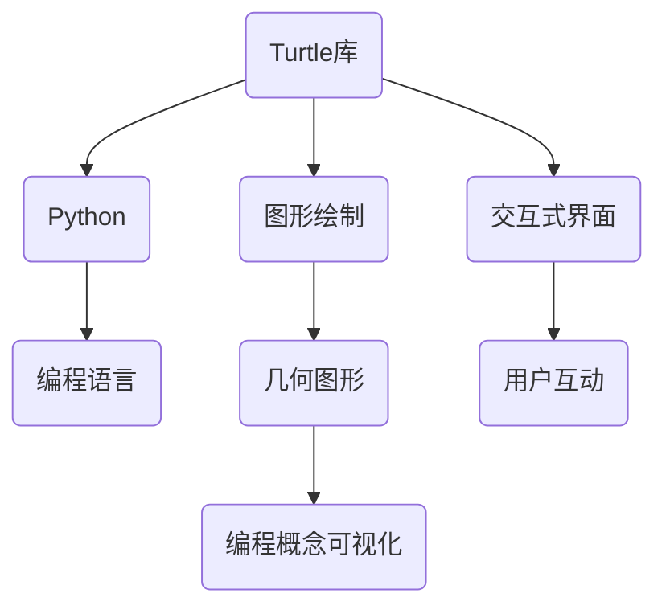

                 

关键词：Python、Turtle库、可视化、助学小程序、编程教育

> 摘要：本文介绍了如何使用Python的Turtle库来开发一个扩展的助学小程序，该小程序旨在通过图形化界面来辅助学生学习和理解编程概念。文章涵盖了从基础概念到具体实现的全过程，并提供了详细的代码实例和解释。

## 1. 背景介绍

在计算机编程教育中，可视化是一个重要的辅助工具。它能够将抽象的编程概念以图形化的方式呈现出来，使得学生更容易理解和掌握。Python的Turtle库是一个简单易用的图形库，通过它，我们可以创建交互式的图形界面，从而实现编程概念的可视化。

Turtle库的名字来源于turtle（海龟），它使用一个模拟海龟的绘图机器人来进行图形绘制。通过这个库，我们可以方便地实现各种几何图形的绘制，以及更复杂的动画效果。这种图形化的方式对于初学者来说尤其有益，因为它能够将编程语言和实际操作紧密结合，降低学习的难度。

本文将探讨如何利用Python-Turtle库来开发一个扩展的助学小程序。这个小程序将不仅包含基础的图形绘制功能，还会结合编程知识，提供一些互动性的学习元素，以帮助学生在学习过程中更好地理解和应用所学知识。

## 2. 核心概念与联系

在深入探讨Python-Turtle库之前，我们需要了解一些核心概念。以下是一个简化的Mermaid流程图，展示了与Turtle库相关的几个关键概念和它们之间的关系。



### 2.1 Turtle库与Python

Turtle库是Python标准库的一部分，因此使用它无需额外安装。Python作为一门广泛使用的编程语言，拥有丰富的库和工具，使得编程变得更加简单和高效。Turtle库正是这些库中的一种，它为图形化绘制提供了方便。

### 2.2 图形绘制与交互式界面

图形绘制是Turtle库的主要功能之一。通过简单的命令，我们可以绘制各种几何图形，如直线、圆形、多边形等。此外，Turtle库还支持动画和更复杂的图形效果，这为编程教育提供了丰富的视觉元素。

交互式界面则是Turtle库的另一个重要特点。它允许用户与绘制的图形进行互动，例如拖动图形、改变颜色等。这种交互性使得学习过程更加直观和有趣。

### 2.3 编程概念可视化

通过Turtle库，我们可以将抽象的编程概念可视化。例如，循环语句可以用来连续绘制多个图形，条件语句可以根据某些条件改变图形的属性等。这种可视化方式能够帮助学生更好地理解编程逻辑和流程。

## 3. 核心算法原理 & 具体操作步骤

### 3.1 算法原理概述

Turtle库的核心算法原理主要基于几何图形的绘制和动画制作。具体来说，它通过以下几个步骤来实现图形绘制：

1. **初始化**: 创建一个画布和模拟海龟的绘图机器人。
2. **前进与转向**: 通过命令让海龟在画布上移动并绘制图形。
3. **颜色与样式**: 设置图形的颜色和线条样式。
4. **动画**: 实现图形的移动和变化，创建动画效果。

### 3.2 算法步骤详解

#### 3.2.1 初始化

首先，我们需要导入Turtle库并创建一个画布。

```python
import turtle

# 创建画布
window = turtle.Screen()
window.title("Turtle库示例")
```

#### 3.2.2 前进与转向

接下来，我们创建一个海龟对象，并通过命令让它绘制图形。

```python
# 创建海龟
t = turtle.Turtle()

# 绘制一个正方形
for _ in range(4):
    t.forward(100)
    t.right(90)
```

#### 3.2.3 颜色与样式

我们还可以设置图形的颜色和线条样式。

```python
# 设置颜色
t.color("blue")

# 设置线条宽度
t.pensize(5)
```

#### 3.2.4 动画

最后，我们可以创建动画效果，例如让海龟沿着一个路径移动。

```python
# 绘制一条直线
t.goto(-200, 0)

# 设置动画速度
t.speed(10)

# 创建动画
t.circle(400)
```

### 3.3 算法优缺点

#### 优点

- **简单易用**: Turtle库提供了简单直观的命令和语法，非常适合初学者。
- **图形化**: 通过图形化的方式呈现编程概念，有助于学生理解和记忆。
- **交互性**: 用户可以与图形进行互动，增强学习体验。

#### 缺点

- **功能有限**: Turtle库主要用于基本的图形绘制，对于更复杂的图形处理可能不够强大。
- **性能问题**: 对于大量图形的绘制和动画，性能可能会受到影响。

### 3.4 算法应用领域

Turtle库在编程教育中被广泛应用，主要用于初学者学习基础编程概念。它可以帮助学生理解循环、条件语句、函数等编程基础。此外，Turtle库还可以用于科学计算、数据可视化等领域。

## 4. 数学模型和公式 & 详细讲解 & 举例说明

### 4.1 数学模型构建

在Turtle库的应用中，我们通常需要计算一些基本的几何属性，例如边长、角度等。以下是一个简单的数学模型，用于计算正方形的面积和周长。

```latex
\text{面积} = s^2
\text{周长} = 4s
```

其中，\( s \) 是正方形的边长。

### 4.2 公式推导过程

正方形的面积和周长可以通过基本的几何知识推导得出。设正方形的边长为 \( s \)，则：

- 面积 \( A \) 是正方形的边长平方，即 \( A = s^2 \)。
- 周长 \( P \) 是正方形的边长乘以4，即 \( P = 4s \)。

### 4.3 案例分析与讲解

假设我们想要绘制一个边长为50的正方形，我们可以按照以下步骤进行：

1. **计算面积**：

   $$ A = 50^2 = 2500 \text{平方单位} $$

2. **计算周长**：

   $$ P = 4 \times 50 = 200 \text{单位} $$

然后，我们使用Turtle库来绘制这个正方形：

```python
# 创建海龟
t = turtle.Turtle()

# 设置边长
side_length = 50

# 绘制正方形
for _ in range(4):
    t.forward(side_length)
    t.right(90)

# 设置颜色和线条宽度
t.color("green")
t.pensize(2)

# 显示结果
t.hideturtle()
turtle.done()
```

## 5. 项目实践：代码实例和详细解释说明

### 5.1 开发环境搭建

为了使用Python的Turtle库，您需要安装Python环境和Turtle库。以下是具体的步骤：

1. **安装Python环境**：

   您可以从Python的官方网站下载并安装最新版本的Python。安装过程中选择默认设置即可。

2. **安装Turtle库**：

   打开命令行窗口，执行以下命令安装Turtle库：

   ```bash
   pip install turtle
   ```

### 5.2 源代码详细实现

以下是一个简单的示例，展示如何使用Turtle库绘制一个五角星：

```python
import turtle

# 创建海龟
star = turtle.Turtle()

# 设置颜色和线条宽度
star.color("red")
star.pensize(3)

# 绘制五角星
angle = 144  # 内角
for _ in range(5):
    star.forward(100)
    star.right(angle)

# 隐藏海龟
star.hideturtle()

# 结束画布
turtle.done()
```

### 5.3 代码解读与分析

1. **导入模块**：

   ```python
   import turtle
   ```

   这行代码导入Turtle库，使我们能够使用其中的功能。

2. **创建海龟**：

   ```python
   star = turtle.Turtle()
   ```

   这行代码创建了一个名为`star`的海龟对象，我们将用它来绘制图形。

3. **设置颜色和线条宽度**：

   ```python
   star.color("red")
   star.pensize(3)
   ```

   这两行代码分别设置海龟的颜色和线条宽度。

4. **绘制五角星**：

   ```python
   angle = 144  # 内角
   for _ in range(5):
       star.forward(100)
       star.right(angle)
   ```

   这个循环语句用于绘制五角星。每次循环，海龟向前移动100单位，然后向右转144度。由于五角星有五个角，所以循环五次。

5. **隐藏海龟和结束画布**：

   ```python
   star.hideturtle()
   turtle.done()
   ```

   这两行代码分别隐藏了海龟，并结束画布的显示。

### 5.4 运行结果展示

运行上述代码后，您会看到一个红色的五角星，如下所示：


## 6. 实际应用场景

Turtle库在实际应用中具有广泛的应用场景。以下是一些常见应用：

### 6.1 编程教育

Turtle库是最常用的编程教育工具之一，它可以帮助学生快速入门编程，理解基本概念。

### 6.2 数据可视化

虽然Turtle库功能有限，但仍然可以用于简单的数据可视化任务，如绘制柱状图、折线图等。

### 6.3 科学计算

Turtle库可以用于绘制复杂的科学计算结果，帮助科学家和工程师更好地理解数据。

### 6.4 游戏开发

Turtle库可以用于简单的游戏开发，例如拼图游戏、贪吃蛇等。

## 7. 工具和资源推荐

### 7.1 学习资源推荐

1. **《Python编程：从入门到实践》**：适合初学者，详细介绍了Python的基础知识。
2. **《Turtle库官方文档》**：包含详细的API和使用示例。

### 7.2 开发工具推荐

1. **PyCharm**：一款强大的Python IDE，适合编写和调试代码。
2. **Jupyter Notebook**：适合进行交互式学习和数据分析。

### 7.3 相关论文推荐

1. **"Python for Kids: A Playful Introduction to Programming"**：适合儿童学习Python的论文。
2. **"The Turtle Art Project"**：介绍Turtle库在教育中的应用。

## 8. 总结：未来发展趋势与挑战

### 8.1 研究成果总结

Turtle库作为Python的一部分，已经成为编程教育中不可或缺的工具。它通过图形化的方式帮助学生理解编程概念，取得了显著的成果。

### 8.2 未来发展趋势

未来，Turtle库可能会更加完善，增加更多的功能和图形效果。同时，它可能会与其他编程教育工具相结合，提供更丰富的学习体验。

### 8.3 面临的挑战

Turtle库在处理复杂图形和大规模数据时可能存在性能问题。此外，如何更好地结合其他教育资源和工具，提高学习效果，也是需要面对的挑战。

### 8.4 研究展望

随着编程教育的不断普及，Turtle库有望在教育领域发挥更大的作用。未来的研究可以关注如何优化Turtle库的性能，以及如何将其与其他教育工具结合，为学生提供更有效的学习途径。

## 9. 附录：常见问题与解答

### 9.1 如何安装Turtle库？

您可以使用以下命令在命令行窗口中安装Turtle库：

```bash
pip install turtle
```

### 9.2 如何创建一个海龟对象？

要创建一个海龟对象，您可以使用以下代码：

```python
t = turtle.Turtle()
```

### 9.3 如何设置海龟的颜色和线条宽度？

要设置海龟的颜色，您可以使用以下代码：

```python
t.color("blue")
```

要设置线条宽度，您可以使用以下代码：

```python
t.pensize(2)
```

### 9.4 如何绘制一个正方形？

要绘制一个正方形，您可以使用以下代码：

```python
for _ in range(4):
    t.forward(100)
    t.right(90)
```

其中，`forward()` 函数用于让海龟向前移动，`right()` 函数用于让海龟向右转。

---

作者：禅与计算机程序设计艺术 / Zen and the Art of Computer Programming

通过上述详细的讨论和实例，我们深入了解了Python-Turtle库在助学小程序中的应用。Turtle库提供了一个直观且易于理解的方式，让学生通过图形化的界面学习编程。尽管存在一定的局限性，Turtle库在教育领域仍然具有重要的应用价值。随着技术的发展，我们期待Turtle库能够不断优化和完善，为学生提供更丰富的学习体验。

