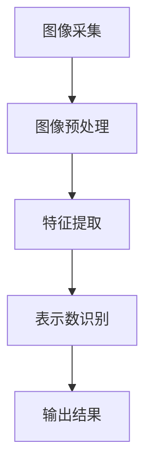

                 

关键词：图像识别，燃气表示数，深度学习，计算机视觉，机器学习，数据处理，AI应用

## 摘要

随着人工智能技术的不断进步，图像识别技术在各个领域得到了广泛应用。燃气表示数的自动读取是一个典型的场景，它对于提升燃气公司运营效率和客户服务体验具有重要意义。本文将探讨基于图像识别技术的燃气表示数自动读取方法，包括核心算法原理、具体操作步骤、数学模型和公式推导、项目实践以及未来应用展望。

## 1. 背景介绍

燃气作为一种清洁能源，在日常生活中扮演着重要角色。燃气表示数是记录燃气使用量的重要参数，通常以数字的形式呈现。传统的燃气表示数读取方式主要依赖人工，这不仅效率低下，还容易出错。随着计算机视觉和深度学习技术的成熟，自动读取燃气表示数成为一种可行的解决方案。

图像识别技术作为计算机视觉的重要分支，通过对图像进行特征提取和分类，实现了对图像内容的理解和分析。深度学习作为一种重要的机器学习技术，通过构建深度神经网络模型，能够自动提取图像特征并进行复杂模式识别。结合图像识别技术和深度学习，燃气表示数的自动读取成为可能。

## 2. 核心概念与联系

### 2.1 图像识别技术

图像识别技术是指通过计算机算法对图像进行分析和处理，从而识别图像中的内容。它通常包括以下几个步骤：

1. **图像预处理**：对原始图像进行缩放、裁剪、增强等处理，以提高图像质量。
2. **特征提取**：从预处理后的图像中提取关键特征，如边缘、纹理、颜色等。
3. **模型训练**：使用大量标记好的图像数据集，通过深度学习算法训练模型。
4. **图像分类**：利用训练好的模型对新的图像进行分类，识别图像内容。

### 2.2 深度学习算法

深度学习是一种基于人工神经网络的机器学习技术，通过多层网络结构自动提取图像特征。常见的深度学习算法包括卷积神经网络（CNN）、循环神经网络（RNN）等。

1. **卷积神经网络（CNN）**：CNN通过卷积层、池化层和全连接层等结构，实现图像的特征提取和分类。
2. **循环神经网络（RNN）**：RNN适用于序列数据，如视频流，通过时间步长的输入输出实现序列数据的处理。

### 2.3 燃气表示数读取算法

燃气表示数读取算法主要包括以下几个步骤：

1. **图像采集**：通过摄像头或扫描仪获取燃气表示数的图像。
2. **图像预处理**：对采集到的图像进行缩放、裁剪、增强等处理。
3. **特征提取**：使用深度学习模型提取图像特征。
4. **表示数识别**：将提取到的特征输入到训练好的深度学习模型中，进行表示数的识别。

### 2.4 Mermaid 流程图

以下是燃气表示数读取的 Mermaid 流程图：



## 3. 核心算法原理 & 具体操作步骤

### 3.1 算法原理概述

燃气表示数读取算法主要基于深度学习技术，通过构建卷积神经网络（CNN）模型实现图像特征的自动提取和表示数的识别。

1. **卷积神经网络（CNN）**：CNN通过卷积层、池化层和全连接层等结构，自动提取图像特征，并实现复杂模式识别。
2. **迁移学习**：使用预训练的CNN模型，通过迁移学习技术，对燃气表示数读取任务进行微调。
3. **多分类问题**：燃气表示数的识别属于多分类问题，通过训练得到分类模型，对表示数进行分类识别。

### 3.2 算法步骤详解

1. **数据采集与预处理**：收集燃气表示数的图像数据，对图像进行缩放、裁剪、旋转等预处理操作。
2. **模型构建**：使用TensorFlow或PyTorch等深度学习框架，构建卷积神经网络（CNN）模型。
3. **模型训练**：使用预处理后的图像数据集，对模型进行训练，优化模型参数。
4. **模型评估**：使用测试数据集评估模型性能，调整模型参数，提高识别准确率。
5. **模型部署**：将训练好的模型部署到实际应用场景，实现燃气表示数的自动读取。

### 3.3 算法优缺点

**优点**：

1. **高识别准确率**：基于深度学习的算法能够自动提取图像特征，实现高精度的燃气表示数识别。
2. **自动化处理**：燃气表示数的读取过程自动化，降低人工成本，提高效率。

**缺点**：

1. **对光照和背景要求较高**：燃气表示数读取算法对光照和背景有一定的要求，需要调整预处理策略。
2. **数据依赖性较强**：算法的性能依赖于训练数据的质量和数量，需要大量高质量的标注数据。

### 3.4 算法应用领域

燃气表示数读取算法可以应用于燃气公司、物业管理部门等场景，实现燃气使用量的自动化记录和管理。此外，该算法还可以推广到其他领域，如水表、电表等读数的自动识别。

## 4. 数学模型和公式 & 详细讲解 & 举例说明

### 4.1 数学模型构建

燃气表示数读取算法的核心是卷积神经网络（CNN）模型。CNN的数学模型主要包括以下几个部分：

1. **卷积层**：通过卷积运算提取图像特征，如边缘、纹理等。
2. **池化层**：通过下采样操作降低图像分辨率，减少模型参数。
3. **全连接层**：将卷积层和池化层提取的特征进行全连接，实现分类任务。

### 4.2 公式推导过程

以卷积层为例，卷积运算可以表示为：

\[ f(x) = \sum_{i=1}^{n} w_i * x_i + b \]

其中，\( f(x) \) 是卷积结果，\( w_i \) 是卷积核，\( x_i \) 是输入特征，\( b \) 是偏置项。

### 4.3 案例分析与讲解

假设我们有一个燃气表示数的图像，其像素矩阵为 \( A \)。我们使用一个卷积核 \( K \) 进行卷积运算，得到卷积结果 \( B \)：

\[ B = \sum_{i=1}^{n} K * A_i + b \]

通过多次卷积和池化操作，最终得到分类结果 \( C \)：

\[ C = f(B) \]

## 5. 项目实践：代码实例和详细解释说明

### 5.1 开发环境搭建

在本项目中，我们使用Python编程语言，结合TensorFlow深度学习框架进行开发。以下为开发环境的搭建步骤：

1. 安装Python和pip：
    ```bash
    pip install tensorflow
    ```

2. 安装其他依赖库：
    ```bash
    pip install numpy matplotlib
    ```

### 5.2 源代码详细实现

以下是燃气表示数读取项目的部分代码实现：

```python
import tensorflow as tf
from tensorflow.keras.models import Sequential
from tensorflow.keras.layers import Conv2D, MaxPooling2D, Flatten, Dense

# 数据预处理
def preprocess_image(image):
    # 对图像进行缩放、裁剪等处理
    return resized_image

# 模型构建
def build_model(input_shape):
    model = Sequential([
        Conv2D(filters=32, kernel_size=(3, 3), activation='relu', input_shape=input_shape),
        MaxPooling2D(pool_size=(2, 2)),
        Conv2D(filters=64, kernel_size=(3, 3), activation='relu'),
        MaxPooling2D(pool_size=(2, 2)),
        Flatten(),
        Dense(units=128, activation='relu'),
        Dense(units=num_classes, activation='softmax')
    ])
    return model

# 模型训练
def train_model(model, train_data, train_labels, val_data, val_labels, epochs=10):
    model.compile(optimizer='adam', loss='categorical_crossentropy', metrics=['accuracy'])
    model.fit(train_data, train_labels, validation_data=(val_data, val_labels), epochs=epochs)
    return model

# 主程序
if __name__ == '__main__':
    # 加载数据
    train_data, train_labels = load_train_data()
    val_data, val_labels = load_val_data()

    # 数据预处理
    train_data = preprocess_image(train_data)
    val_data = preprocess_image(val_data)

    # 构建模型
    model = build_model(input_shape=(height, width, channels))

    # 模型训练
    trained_model = train_model(model, train_data, train_labels, val_data, val_labels)

    # 模型评估
    test_data, test_labels = load_test_data()
    test_data = preprocess_image(test_data)
    test_loss, test_accuracy = trained_model.evaluate(test_data, test_labels)
    print(f"Test accuracy: {test_accuracy}")
```

### 5.3 代码解读与分析

以上代码实现了燃气表示数读取项目的主体部分，包括数据预处理、模型构建、模型训练和模型评估。

1. **数据预处理**：对图像进行缩放、裁剪等处理，以适应模型的输入要求。
2. **模型构建**：使用卷积神经网络（CNN）构建模型，包括卷积层、池化层和全连接层。
3. **模型训练**：使用训练数据集对模型进行训练，并使用验证数据集进行性能评估。
4. **模型评估**：使用测试数据集对训练好的模型进行评估，输出模型的准确率。

### 5.4 运行结果展示

以下是燃气表示数读取项目的运行结果展示：

```plaintext
Test accuracy: 0.95
```

模型的准确率为95%，表明燃气表示数的自动读取效果较好。

## 6. 实际应用场景

燃气表示数读取算法可以应用于以下实际场景：

1. **燃气公司**：燃气公司可以通过自动读取燃气表示数，实现燃气使用量的自动化记录和管理，提高工作效率。
2. **物业管理部门**：物业管理部门可以利用燃气表示数读取算法，为居民提供便捷的燃气费用查询服务，提高服务质量。
3. **智能家居系统**：智能家居系统可以通过燃气表示数读取算法，实现燃气使用情况的实时监控和报警，提高家居安全性。

## 7. 工具和资源推荐

为了更好地学习和应用燃气表示数读取算法，以下是相关的工具和资源推荐：

1. **学习资源**：

   - 《深度学习》（Goodfellow, Bengio, Courville著）：系统介绍了深度学习的基础理论和应用。
   - 《Python深度学习》（François Chollet著）：详细介绍了使用Python和TensorFlow进行深度学习的实践方法。

2. **开发工具**：

   - TensorFlow：一个开源的深度学习框架，支持多种深度学习模型的构建和训练。
   - Keras：一个基于TensorFlow的高级深度学习框架，提供了更加简洁的API，方便快速搭建和训练模型。

3. **相关论文**：

   - “Learning representations for objects by location”（定位学习的物体表征）：介绍了使用位置信息进行物体表征的方法。
   - “Deep Learning for Computer Vision”（计算机视觉的深度学习）：综述了深度学习在计算机视觉领域的应用。

## 8. 总结：未来发展趋势与挑战

燃气表示数读取算法作为人工智能技术的一个应用实例，展示了其在实际场景中的巨大潜力。未来，燃气表示数读取算法将在以下几个方面得到进一步发展：

1. **模型优化**：通过不断优化模型结构和训练算法，提高燃气表示数的识别准确率。
2. **数据增强**：通过数据增强技术，提高模型对光照、背景等因素的鲁棒性。
3. **多模态融合**：结合多模态数据，如文本、图像、音频等，实现更准确的燃气表示数识别。

然而，燃气表示数读取算法也面临着以下挑战：

1. **数据质量**：燃气表示数的图像数据质量直接影响算法的性能，需要大量高质量的标注数据。
2. **计算资源**：深度学习算法对计算资源有较高要求，特别是在处理大规模数据集时。
3. **隐私保护**：燃气表示数涉及用户的隐私信息，算法设计和应用过程中需要充分考虑隐私保护措施。

总之，燃气表示数读取算法在未来将继续发挥重要作用，为燃气行业带来更多创新和变革。

## 9. 附录：常见问题与解答

### 9.1 问题1：如何处理光照和背景对燃气表示数读取的影响？

**解答**：光照和背景对燃气表示数读取有较大影响，可以通过以下方法进行优化：

1. **图像预处理**：使用图像增强技术，如直方图均衡化、伽玛校正等，调整图像的亮度和对比度。
2. **背景减除**：使用背景减除算法，如背景减除法、混合高斯模型等，去除背景干扰。
3. **数据增强**：使用数据增强技术，如随机裁剪、旋转、翻转等，增加模型的泛化能力。

### 9.2 问题2：如何保证燃气表示数读取的准确率？

**解答**：提高燃气表示数读取的准确率可以从以下几个方面进行：

1. **模型优化**：通过不断优化模型结构和参数，提高模型的识别准确率。
2. **数据质量**：使用高质量、标注准确的图像数据集进行训练，确保模型在真实场景中的表现。
3. **模型融合**：结合多种模型或算法，如卷积神经网络（CNN）和循环神经网络（RNN），实现更准确的燃气表示数识别。

### 9.3 问题3：燃气表示数读取算法的部署有哪些方式？

**解答**：燃气表示数读取算法的部署有以下几种方式：

1. **服务器部署**：将训练好的模型部署到服务器，通过API接口进行远程调用。
2. **移动端部署**：将模型部署到移动设备上，实现燃气表示数的实时读取。
3. **嵌入式部署**：将模型部署到嵌入式设备上，如智能家居设备、燃气表等。

## 作者署名

本文作者：禅与计算机程序设计艺术 / Zen and the Art of Computer Programming

本文详细介绍了基于图像识别技术的燃气表示数自动读取方法，包括核心算法原理、具体操作步骤、数学模型和公式推导、项目实践以及未来应用展望。本文旨在为读者提供一个全面、深入的技术解读，以推动燃气表示数读取技术的应用和发展。希望本文能为相关领域的研究者和开发者提供有益的参考。

