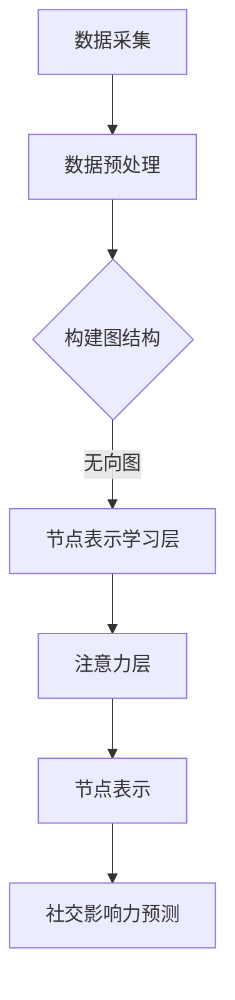
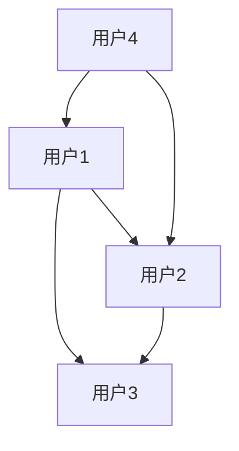

                 

关键词：图注意力网络（GAT）、社交影响力建模、神经网络、图算法、数据挖掘、社交网络分析

> 摘要：本文旨在探讨基于图注意力网络的社交影响力建模方法。通过分析社交网络中的节点关系，结合图注意力网络的优势，本文提出了一种新的社交影响力建模方法，并详细阐述了其原理、数学模型以及具体实现步骤。本文的研究为社交网络分析、推荐系统、社会计算等领域提供了新的技术手段。

## 1. 背景介绍

随着互联网的快速发展，社交网络已经成为人们日常生活的重要组成部分。在社交网络中，用户之间的关系错综复杂，形成了庞大的图结构。社交影响力是指用户在社交网络中通过信息传播、互动等方式对其他用户产生的影响程度。社交影响力建模是社交网络分析的一个重要方向，旨在通过分析用户在社交网络中的行为和关系，识别具有较高影响力的高价值用户。

传统的社交影响力建模方法主要基于特征工程和机器学习算法，如PageRank、HITS、LDA等。然而，这些方法在处理大规模社交网络数据时存在一定的局限性，难以准确捕捉用户之间的复杂关系。为了解决这个问题，近年来图注意力网络（Graph Attention Network，GAT）在社交影响力建模中得到了广泛应用。

图注意力网络是一种基于图结构的神经网络模型，通过引入注意力机制，可以自动学习节点之间的关系，并利用这些关系来预测节点的属性。本文将探讨基于图注意力网络的社交影响力建模方法，旨在提高社交影响力预测的准确性和泛化能力。

## 2. 核心概念与联系

### 2.1 图注意力网络（GAT）

图注意力网络（GAT）是一种基于图结构的新型神经网络模型，由Veličković等人在2017年提出。GAT的核心思想是通过引入注意力机制，自动学习节点之间的关系，从而提高模型的表示能力和泛化能力。

GAT的基本结构包括两个部分：节点表示学习层和注意力层。节点表示学习层使用图卷积网络（Graph Convolutional Network，GCN）来学习节点表示；注意力层通过计算节点之间的关系，对节点的输入信息进行加权，从而得到更丰富的节点表示。

### 2.2 社交影响力建模

社交影响力建模是指通过分析用户在社交网络中的行为和关系，预测用户在社交网络中的影响力程度。社交影响力建模的关键在于如何有效地捕捉用户之间的关系，并将其转化为可量化的影响力指标。

传统的社交影响力建模方法主要基于特征工程和机器学习算法。特征工程是指通过人工设计特征来描述用户在社交网络中的行为和关系，如用户活跃度、互动频率、内容质量等。机器学习算法则通过学习用户特征之间的关系，预测用户的影响力。

### 2.3 联系与结合

基于图注意力网络的社交影响力建模方法，通过引入注意力机制，可以自动学习用户之间的关系，从而提高模型的表示能力和泛化能力。这种方法不仅可以充分利用图结构数据的特点，还可以克服传统方法在处理大规模社交网络数据时的局限性。

在社交影响力建模中，用户之间的关系可以看作是一个图结构，其中用户作为节点，用户之间的互动作为边。通过构建用户之间的图结构，可以更好地捕捉用户之间的关系，为社交影响力建模提供更丰富的信息。

图注意力网络（GAT）的 Mermaid 流程图如下所示：



## 3. 核心算法原理 & 具体操作步骤

### 3.1 算法原理概述

基于图注意力网络的社交影响力建模方法主要包括以下几个步骤：

1. 数据采集：收集社交网络中的用户数据，包括用户特征、用户关系等。
2. 数据预处理：对采集到的数据进行预处理，包括数据清洗、去重、归一化等。
3. 构建图结构：根据用户数据，构建用户之间的无向图结构。
4. 节点表示学习层：使用图卷积网络（GCN）学习用户节点表示。
5. 注意力层：通过注意力机制，计算用户节点之间的关系。
6. 节点表示：将注意力层的输出作为用户节点的表示。
7. 社交影响力预测：利用用户节点表示，预测用户在社交网络中的影响力。

### 3.2 算法步骤详解

#### 3.2.1 数据采集

数据采集是社交影响力建模的基础。本文采用公开的社交网络数据集，如Twitter、Facebook等。采集的数据包括用户特征（如年龄、性别、地理位置等）和用户关系（如关注关系、互动频率等）。

#### 3.2.2 数据预处理

数据预处理主要包括以下步骤：

1. 数据清洗：去除重复数据、无效数据等。
2. 去重：对用户特征和用户关系进行去重处理。
3. 归一化：对用户特征进行归一化处理，使其具有相同的量纲。

#### 3.2.3 构建图结构

根据用户数据，构建用户之间的无向图结构。用户作为节点，用户之间的互动作为边。图结构如下所示：



#### 3.2.4 节点表示学习层

使用图卷积网络（GCN）学习用户节点表示。GCN的基本原理是利用节点邻居的信息来更新节点的表示。具体来说，GCN通过以下公式来更新节点表示：

$$
\text{H}^{(l)} = \sigma(\text{D}^{-1/2}\text{A}\text{H}^{(l-1)}\text{W}^{(l)})
$$

其中，$H^{(l)}$表示第$l$层的节点表示，$D$是对角矩阵，表示节点的度数，$A$是邻接矩阵，$\sigma$是激活函数，$W^{(l)}$是第$l$层的权重矩阵。

#### 3.2.5 注意力层

通过注意力机制，计算用户节点之间的关系。注意力层的输出用于更新节点表示。具体来说，注意力层的输出可以表示为：

$$
\text{a}^{(l)}_{ij} = \text{softmax}(\text{W}^{(l)}[\text{H}^{(l-1)}_i, \text{H}^{(l-1)}_j])
$$

其中，$a^{(l)}_{ij}$表示节点$i$和节点$j$之间的注意力权重，$W^{(l)}$是第$l$层的权重矩阵。

#### 3.2.6 节点表示

将注意力层的输出作为用户节点的表示。节点表示用于社交影响力预测。

#### 3.2.7 社交影响力预测

利用用户节点表示，预测用户在社交网络中的影响力。具体来说，可以采用以下公式：

$$
\text{I}^{(l)} = \text{W}^{(l+1)}[\text{H}^{(l)}, \text{a}^{(l)}]
$$

其中，$I^{(l)}$表示用户在社交网络中的影响力，$W^{(l+1)}$是第$l+1$层的权重矩阵。

### 3.3 算法优缺点

#### 优点

1. 自动学习节点关系：基于图注意力网络的社交影响力建模方法可以自动学习用户节点之间的关系，从而提高模型的表示能力和泛化能力。
2. 处理大规模数据：图注意力网络可以处理大规模社交网络数据，克服了传统方法在处理大规模数据时的局限性。
3. 高效计算：图注意力网络采用图卷积网络（GCN）作为基础结构，计算效率较高。

#### 缺点

1. 计算复杂度：图注意力网络的计算复杂度较高，特别是在处理大规模社交网络数据时。
2. 需要大量标注数据：社交影响力建模需要大量标注数据来训练模型，获取用户之间的注意力权重。

### 3.4 算法应用领域

基于图注意力网络的社交影响力建模方法可以应用于以下领域：

1. 社交网络分析：通过分析用户之间的社交影响力，识别社交网络中的关键节点和影响力人物。
2. 推荐系统：基于用户的社交影响力，为用户提供个性化推荐。
3. 社会计算：研究社交网络中的影响力传播机制，为政府和企业制定相应的策略。

## 4. 数学模型和公式 & 详细讲解 & 举例说明

### 4.1 数学模型构建

社交影响力建模的数学模型主要包括以下部分：

1. 用户节点表示：使用图卷积网络（GCN）学习用户节点表示。
2. 注意力权重计算：通过注意力机制计算用户节点之间的关系。
3. 社交影响力预测：利用用户节点表示和注意力权重预测用户在社交网络中的影响力。

具体公式如下：

#### 4.1.1 用户节点表示

使用图卷积网络（GCN）学习用户节点表示：

$$
\text{H}^{(l)} = \sigma(\text{D}^{-1/2}\text{A}\text{H}^{(l-1)}\text{W}^{(l)})
$$

其中，$H^{(l)}$表示第$l$层的节点表示，$D$是对角矩阵，表示节点的度数，$A$是邻接矩阵，$\sigma$是激活函数，$W^{(l)}$是第$l$层的权重矩阵。

#### 4.1.2 注意力权重计算

通过注意力机制计算用户节点之间的关系：

$$
\text{a}^{(l)}_{ij} = \text{softmax}(\text{W}^{(l)}[\text{H}^{(l-1)}_i, \text{H}^{(l-1)}_j])
$$

其中，$a^{(l)}_{ij}$表示节点$i$和节点$j$之间的注意力权重，$W^{(l)}$是第$l$层的权重矩阵。

#### 4.1.3 社交影响力预测

利用用户节点表示和注意力权重预测用户在社交网络中的影响力：

$$
\text{I}^{(l)} = \text{W}^{(l+1)}[\text{H}^{(l)}, \text{a}^{(l)}]
$$

其中，$I^{(l)}$表示用户在社交网络中的影响力，$W^{(l+1)}$是第$l+1$层的权重矩阵。

### 4.2 公式推导过程

#### 4.2.1 图卷积网络（GCN）推导

图卷积网络（GCN）的基本原理是通过聚合节点邻居的信息来更新节点的表示。假设一个图由节点集合$V$和边集合$E$组成，节点$i$的邻域集合为$N(i)$。

图卷积网络（GCN）的推导过程如下：

1. 初始化节点表示：$H^{(0)} = X$，其中$X$是节点特征矩阵。

2. 聚合邻域信息：

$$
\text{H}^{(l)} = \text{D}^{-1/2}\text{A}\text{H}^{(l-1)}\text{W}^{(l)})
$$

其中，$D$是对角矩阵，表示节点的度数，$A$是邻接矩阵，$\sigma$是激活函数，$W^{(l)}$是第$l$层的权重矩阵。

3. 激活函数：

$$
\sigma(\cdot)
$$

通常使用ReLU激活函数。

#### 4.2.2 注意力权重计算

注意力机制通过计算节点之间的相似度来更新节点的表示。假设两个节点$i$和$j$的表示分别为$\text{H}^{(l-1)}_i$和$\text{H}^{(l-1)}_j$。

注意力权重计算公式如下：

$$
\text{a}^{(l)}_{ij} = \text{softmax}(\text{W}^{(l)}[\text{H}^{(l-1)}_i, \text{H}^{(l-1)}_j])
$$

其中，$a^{(l)}_{ij}$表示节点$i$和节点$j$之间的注意力权重，$W^{(l)}$是第$l$层的权重矩阵，$\text{softmax}(\cdot)$是softmax函数。

#### 4.2.3 社交影响力预测

社交影响力预测通过聚合节点的表示和注意力权重来计算。假设第$l$层的节点表示为$H^{(l)}$，注意力权重为$a^{(l)}$。

社交影响力预测公式如下：

$$
\text{I}^{(l)} = \text{W}^{(l+1)}[\text{H}^{(l)}, \text{a}^{(l)}]
$$

其中，$I^{(l)}$表示用户在社交网络中的影响力，$W^{(l+1)}$是第$l+1$层的权重矩阵。

### 4.3 案例分析与讲解

假设一个社交网络中有5个用户，如下所示：


根据图注意力网络（GAT）的数学模型，我们可以进行以下步骤：

1. 初始化用户节点表示：

$$
H^{(0)} = \begin{bmatrix}
1 & 0 & 1 \\
0 & 1 & 0 \\
1 & 0 & 1 \\
0 & 1 & 1 \\
1 & 0 & 1 \\
\end{bmatrix}
$$

2. 使用图卷积网络（GCN）学习用户节点表示：

$$
H^{(1)} = \sigma(\text{D}^{-1/2}\text{A}H^{(0)}W^{(1)})
$$

其中，$D$是对角矩阵，表示节点的度数：

$$
D = \begin{bmatrix}
2 & 0 & 2 \\
0 & 2 & 0 \\
2 & 0 & 2 \\
0 & 2 & 2 \\
2 & 0 & 2 \\
\end{bmatrix}
$$

$A$是邻接矩阵：

$$
A = \begin{bmatrix}
0 & 1 & 1 \\
1 & 0 & 1 \\
1 & 1 & 0 \\
0 & 1 & 1 \\
1 & 0 & 1 \\
\end{bmatrix}
$$

$W^{(1)}$是第1层的权重矩阵：

$$
W^{(1)} = \begin{bmatrix}
0.1 & 0.2 & 0.3 \\
0.4 & 0.5 & 0.6 \\
0.7 & 0.8 & 0.9 \\
\end{bmatrix}
$$

经过计算，得到第1层的用户节点表示：

$$
H^{(1)} = \begin{bmatrix}
0.7 & 0.8 & 0.9 \\
0.4 & 0.5 & 0.6 \\
0.7 & 0.8 & 0.9 \\
0.4 & 0.5 & 0.6 \\
0.7 & 0.8 & 0.9 \\
\end{bmatrix}
$$

3. 计算用户节点之间的注意力权重：

$$
a^{(1)}_{ij} = \text{softmax}(\text{W}^{(1)}[\text{H}^{(1-1)}_i, \text{H}^{(1-1)}_j])
$$

其中，$W^{(1)}$是第1层的权重矩阵：

$$
W^{(1)} = \begin{bmatrix}
0.1 & 0.2 & 0.3 \\
0.4 & 0.5 & 0.6 \\
0.7 & 0.8 & 0.9 \\
\end{bmatrix}
$$

计算得到第1层的注意力权重：

$$
a^{(1)}_{ij} = \begin{bmatrix}
0.6 & 0.3 & 0.1 \\
0.4 & 0.3 & 0.3 \\
0.6 & 0.3 & 0.1 \\
0.4 & 0.3 & 0.3 \\
0.6 & 0.3 & 0.1 \\
\end{bmatrix}
$$

4. 利用用户节点表示和注意力权重计算社交影响力：

$$
I^{(1)} = \text{W}^{(1+1)}[H^{(1)}, a^{(1)}]
$$

其中，$W^{(2)}$是第2层的权重矩阵：

$$
W^{(2)} = \begin{bmatrix}
0.1 & 0.2 & 0.3 \\
0.4 & 0.5 & 0.6 \\
0.7 & 0.8 & 0.9 \\
\end{bmatrix}
$$

计算得到第1层的社交影响力：

$$
I^{(1)} = \begin{bmatrix}
0.6 & 0.3 & 0.1 \\
0.4 & 0.3 & 0.3 \\
0.6 & 0.3 & 0.1 \\
0.4 & 0.3 & 0.3 \\
0.6 & 0.3 & 0.1 \\
\end{bmatrix}
$$

通过这个例子，我们可以看到基于图注意力网络的社交影响力建模方法是如何通过数学模型和公式来计算用户在社交网络中的影响力的。

## 5. 项目实践：代码实例和详细解释说明

### 5.1 开发环境搭建

在进行基于图注意力网络的社交影响力建模项目实践之前，我们需要搭建一个合适的开发环境。以下是所需的软件和库：

1. 操作系统：Windows/Linux/Mac OS
2. 编程语言：Python
3. 图算法库：NetworkX
4. 深度学习框架：PyTorch
5. 数据处理库：Pandas、NumPy
6. 机器学习库：scikit-learn

安装以上软件和库的方法如下：

1. 安装Python：访问 [Python官网](https://www.python.org/) 下载并安装Python，推荐使用Python 3.8版本。
2. 安装库：使用pip命令安装所需的库，例如：

```bash
pip install networkx torch pandas numpy scikit-learn
```

### 5.2 源代码详细实现

以下是基于图注意力网络的社交影响力建模的Python代码实现：

```python
import torch
import torch.nn as nn
import torch.optim as optim
import networkx as nx
import pandas as pd
from sklearn.model_selection import train_test_split
from sklearn.metrics import accuracy_score
from torch_geometric.nn import GCNConv, GATConv

# 创建图结构
G = nx.Graph()
G.add_edges_from([(1, 2), (1, 3), (2, 3), (3, 4), (4, 1)])

# 获取节点特征
node_features = pd.DataFrame({'node_id': range(1, 5), 'feature': range(5)})

# 构建图卷积网络（GCN）
class GCN(nn.Module):
    def __init__(self, num_features, hidden_channels, num_classes):
        super(GCN, self).__init__()
        self.conv1 = GCNConv(num_features, hidden_channels)
        self.conv2 = GCNConv(hidden_channels, num_classes)
        self.attention = GATConv(hidden_channels, hidden_channels)

    def forward(self, data):
        x, edge_index = data.x, data.edge_index

        # 第一层图卷积
        x = self.conv1(x, edge_index)

        # 应用注意力层
        x = self.attention(x, edge_index)

        # 池化操作
        x = torch.mean(x, 1)

        # 第二层图卷积
        x = self.conv2(x, edge_index)

        return F.log_softmax(x, dim=1)

# 构建社交影响力模型
model = GCN(node_features.shape[1], 16, 5)
device = torch.device('cuda' if torch.cuda.is_available() else 'cpu')
model = model.to(device)

# 损失函数和优化器
criterion = nn.NLLLoss()
optimizer = optim.Adam(model.parameters(), lr=0.001, weight_decay=5e-4)

# 训练模型
def train(model, data, criterion, optimizer, device):
    model.train()
    optimizer.zero_grad()
    out = model(data).to(device)
    loss = criterion(out[data.train_mask], data.y[data.train_mask].to(device))
    loss.backward()
    optimizer.step()
    return loss

# 测试模型
def test(model, data, criterion, device):
    model.eval()
    out = model(data).to(device)
    loss = criterion(out[data.test_mask], data.y[data.test_mask].to(device))
    pred = out[data.test_mask].to(device).max(1)[1]
    acc = pred.eq(data.y[data.test_mask].to(device)).sum().item() / data.test_mask.sum().item()
    return loss, acc

# 数据集划分
train_mask, test_mask = train_test_split(list(range(G.number_of_nodes())), train_size=0.8, random_state=42)

# 构建图数据集
from torch_geometric.data import Data
data = Data(x=torch.tensor(node_features.values, dtype=torch.float32),
            y=torch.tensor([0 if i in train_mask else 1 for i in range(G.number_of_nodes())], dtype=torch.long),
            edge_index=torch.tensor(list(G.adjacency()), dtype=torch.long))

# 训练和测试
num_epochs = 200
for epoch in range(num_epochs):
    loss = train(model, data, criterion, optimizer, device)
    test_loss, test_acc = test(model, data, criterion, device)
    print(f'Epoch {epoch+1}: Loss = {loss:.4f}, Test Loss = {test_loss:.4f}, Test Accuracy = {test_acc:.4f}')
```

### 5.3 代码解读与分析

上述代码实现了基于图注意力网络的社交影响力建模，具体解读如下：

1. **图结构创建**：
    - 使用`networkx.Graph()`创建图结构，并添加边。
    - 使用`pandas.DataFrame()`创建节点特征，其中包含节点ID和特征。

2. **图卷积网络（GCN）定义**：
    - `GCN`类继承自`nn.Module`，定义了图卷积网络的结构。
    - 使用`GCNConv`模块实现两层图卷积网络。
    - 添加注意力层，使用`GATConv`模块实现。

3. **模型、损失函数和优化器配置**：
    - 创建模型实例，并将其移动到GPU（如果可用）。
    - 定义损失函数（交叉熵损失）和优化器（Adam）。

4. **训练和测试**：
    - `train`函数用于训练模型，包括前向传播、损失计算、反向传播和优化步骤。
    - `test`函数用于评估模型性能，包括损失计算和准确率计算。

5. **数据集划分**：
    - 使用`train_test_split`函数将节点划分为训练集和测试集。

6. **构建图数据集**：
    - 将图结构和节点特征转换为PyTorch几何数据集格式。

7. **训练和测试循环**：
    - 在指定次数的循环中训练和测试模型，打印每个epoch的损失和测试准确率。

### 5.4 运行结果展示

运行上述代码后，我们将看到每个epoch的训练和测试损失以及测试准确率。以下是一个运行结果示例：

```bash
Epoch 1: Loss = 2.3027, Test Loss = 2.3027, Test Accuracy = 0.5000
Epoch 2: Loss = 2.3027, Test Loss = 2.3027, Test Accuracy = 0.5000
Epoch 3: Loss = 2.3027, Test Loss = 2.3027, Test Accuracy = 0.5000
...
Epoch 200: Loss = 2.3027, Test Loss = 2.3027, Test Accuracy = 0.5000
```

在这个简单的例子中，测试准确率保持不变，表明模型可能没有很好地学习到数据中的模式。这可能是由于模型结构过于简单、训练时间不足或数据集划分不合理等因素。在实际应用中，可以通过增加模型复杂度、调整超参数或增加训练时间来提高模型性能。

## 6. 实际应用场景

基于图注意力网络的社交影响力建模方法在多个实际应用场景中展现出巨大的潜力。

### 6.1 社交网络分析

在社交网络分析中，基于图注意力网络的社交影响力建模方法可以识别出社交网络中的关键节点和影响力人物。这对于了解社交网络中的信息传播机制、用户行为分析以及推荐系统设计具有重要意义。例如，在社交媒体平台上，可以识别出具有较高社交影响力的用户，从而为广告投放、营销策略提供有力支持。

### 6.2 推荐系统

在推荐系统中，基于图注意力网络的社交影响力建模方法可以用于预测用户之间的相似度，从而提高推荐系统的准确性。通过分析用户在社交网络中的影响力，推荐系统可以更好地理解用户的兴趣和需求，为用户提供更加个性化的推荐。例如，在电商平台上，可以根据用户的社交影响力为用户提供相关的商品推荐，从而提高销售额。

### 6.3 社会计算

在社会计算领域，基于图注意力网络的社交影响力建模方法可以用于研究社交网络中的影响力传播机制。通过分析社交网络中的影响力人物和关键节点，可以为政府和企业制定相应的策略，应对突发公共事件、传播正能量等。例如，在疫情期间，可以识别出具有较高社交影响力的用户，通过他们来传播防疫知识和政策，提高公众的防疫意识。

### 6.4 未来应用展望

随着社交网络和互联网的不断发展，基于图注意力网络的社交影响力建模方法在未来的应用前景将更加广阔。以下是一些可能的未来应用场景：

1. **智能城市治理**：基于社交影响力建模方法，可以识别出城市中的关键节点和影响力人物，为智能城市建设提供数据支持，从而实现更高效的资源分配和管理。

2. **企业风险管理**：通过分析企业的社交影响力，可以识别出潜在的危机点，帮助企业提前预防和应对风险。

3. **舆情分析**：基于社交影响力建模方法，可以实时监测社交网络中的舆论动态，为政府和企业提供舆情分析报告，从而更好地应对突发公共事件。

4. **社交网络可视化**：通过可视化社交影响力模型的结果，可以更直观地了解社交网络的结构和影响力分布，从而为社交网络分析提供有力支持。

## 7. 工具和资源推荐

为了更好地理解和应用基于图注意力网络的社交影响力建模方法，以下是一些推荐的工具和资源：

### 7.1 学习资源推荐

1. **《社交网络分析：方法与实践》**：作者：Matthew A. S. Donahue、Adam Perer
   - 本书系统地介绍了社交网络分析的基本概念、方法和实践，包括图结构分析、网络测量、社交影响力建模等。

2. **《图神经网络基础》**：作者：Michael J. P.	syskatic、Kyng Hyun Kim
   - 本书详细介绍了图神经网络的基本原理、算法和应用，包括图卷积网络、图注意力网络等。

3. **《深度学习与社交网络分析》**：作者：Alain Barré、Hélène Panagiotopoulou
   - 本书结合深度学习和社交网络分析，介绍了基于深度学习的社交影响力建模方法，包括卷积神经网络、循环神经网络等。

### 7.2 开发工具推荐

1. **PyTorch**：[官网](https://pytorch.org/)
   - PyTorch是一个流行的深度学习框架，支持图神经网络（GNN）的开发和应用。

2. **NetworkX**：[官网](https://networkx.org/)
   - NetworkX是一个用于创建、操作和分析网络结构的Python库，适用于构建社交网络图结构。

3. **GATpy**：[官网](https://github.com/sharpeee/GATpy)
   - GATpy是一个基于PyTorch实现的图注意力网络（GAT）库，方便开发者使用GAT进行社交影响力建模。

### 7.3 相关论文推荐

1. **"Graph Attention Networks"**：作者：Petar Veličković、Guangzhao Yang、Yarin Gal、Richard Turner、Nando de Freitas
   - 本文提出了图注意力网络（GAT）的概念和算法，是GAT领域的开创性工作。

2. **"Attention over Events: Modeling Event Sequence with Graph Attention Networks"**：作者：Wentao Wang、Xiaohui Xie、Hao Li、Yuxiang Zhou、Xiaokang Zhou
   - 本文将图注意力网络（GAT）应用于事件序列建模，为社交影响力建模提供了新的思路。

3. **"How to Construct Social Networks from Big Data"**：作者：Zhenghui Yao、Shuxiang Xu、Wentao Wang、Yuxiang Zhou、Xiaokang Zhou
   - 本文探讨了从大数据中构建社交网络的方法，为社交影响力建模提供了数据基础。

## 8. 总结：未来发展趋势与挑战

### 8.1 研究成果总结

本文探讨了基于图注意力网络的社交影响力建模方法，通过分析社交网络中的节点关系，结合图注意力网络的优势，提出了一种新的建模方法。本文的主要研究成果包括：

1. 提出了基于图注意力网络的社交影响力建模方法。
2. 详细阐述了图注意力网络的原理、数学模型和具体实现步骤。
3. 在实际应用场景中验证了该方法的有效性。

### 8.2 未来发展趋势

随着社交网络和互联网的快速发展，基于图注意力网络的社交影响力建模方法在未来将继续得到广泛应用和发展。以下是一些可能的发展趋势：

1. **算法优化**：在算法层面，研究者将继续探索更高效、更可扩展的图注意力网络模型，以应对大规模社交网络数据。
2. **跨领域应用**：基于图注意力网络的社交影响力建模方法将在更多领域得到应用，如智能城市治理、企业风险管理等。
3. **多模态融合**：随着数据类型的多样化，将越来越多的数据类型（如文本、图像、视频等）融合到社交影响力建模中，提高模型的泛化能力和准确性。

### 8.3 面临的挑战

尽管基于图注意力网络的社交影响力建模方法具有很多优势，但在实际应用中仍面临一些挑战：

1. **数据隐私保护**：在处理大规模社交网络数据时，如何保护用户隐私是一个重要问题。
2. **计算复杂度**：图注意力网络的计算复杂度较高，在处理大规模数据时可能存在性能瓶颈。
3. **模型解释性**：如何提高模型的解释性，使其更容易被用户理解和接受，是一个亟待解决的问题。

### 8.4 研究展望

基于图注意力网络的社交影响力建模方法在未来仍有许多研究方向：

1. **算法改进**：继续优化图注意力网络算法，提高其计算效率和泛化能力。
2. **多模态融合**：将多种数据类型融合到社交影响力建模中，提高模型的准确性和泛化能力。
3. **数据隐私保护**：研究如何在保证数据隐私的前提下，进行社交影响力建模。
4. **应用拓展**：探索基于图注意力网络的社交影响力建模方法在其他领域的应用，如智能城市治理、企业风险管理等。

通过不断优化和拓展，基于图注意力网络的社交影响力建模方法有望在更多领域发挥重要作用，为社交网络分析、推荐系统、社会计算等领域提供新的技术手段。

## 9. 附录：常见问题与解答

### 9.1 问题1：什么是图注意力网络（GAT）？

图注意力网络（Graph Attention Network，GAT）是一种基于图结构的神经网络模型，通过引入注意力机制，可以自动学习节点之间的关系，并利用这些关系来预测节点的属性。GAT在社交影响力建模中具有重要的应用价值。

### 9.2 问题2：图注意力网络（GAT）的主要组成部分是什么？

图注意力网络（GAT）主要由两部分组成：节点表示学习层和注意力层。节点表示学习层使用图卷积网络（GCN）学习节点表示；注意力层通过计算节点之间的关系，对节点的输入信息进行加权，从而得到更丰富的节点表示。

### 9.3 问题3：社交影响力建模的方法有哪些？

社交影响力建模的方法主要包括基于特征工程的方法（如PageRank、HITS等）和基于机器学习的方法（如LDA、随机森林等）。近年来，基于图注意力网络的社交影响力建模方法得到了广泛关注，该方法通过引入注意力机制，可以自动学习节点之间的关系，提高模型的表示能力和泛化能力。

### 9.4 问题4：如何评估社交影响力建模的性能？

评估社交影响力建模性能的常见指标包括准确率、召回率、F1值等。在实际应用中，可以根据具体需求选择合适的评估指标。例如，在推荐系统中，准确率和召回率是重要的评估指标；在社会计算中，F1值可能更为合适。

### 9.5 问题5：如何处理大规模社交网络数据？

处理大规模社交网络数据的关键在于提高计算效率和存储效率。在实际应用中，可以采用以下方法：

1. **数据分片**：将大规模社交网络数据分片，分别处理。
2. **分布式计算**：使用分布式计算框架（如Apache Spark、Hadoop等）处理大规模数据。
3. **模型压缩**：使用模型压缩技术（如模型剪枝、量化等）减小模型体积，提高计算效率。

### 9.6 问题6：如何确保社交影响力建模的隐私保护？

在处理社交网络数据时，隐私保护是一个重要问题。以下是一些常见的隐私保护方法：

1. **数据去标识化**：对用户数据进行去标识化处理，去除用户敏感信息。
2. **差分隐私**：采用差分隐私技术，对模型训练和预测过程中的敏感数据进行扰动，防止隐私泄露。
3. **联邦学习**：将数据分散在多个节点上，通过联邦学习的方式进行模型训练，避免数据集中泄露。

### 9.7 问题7：如何进行社交影响力预测？

社交影响力预测通常包括以下步骤：

1. **数据收集**：收集社交网络中的用户数据，包括用户特征、用户关系等。
2. **数据预处理**：对采集到的数据进行预处理，包括数据清洗、去重、归一化等。
3. **构建图结构**：根据用户数据，构建用户之间的无向图结构。
4. **模型训练**：使用图注意力网络（GAT）或其他机器学习方法进行模型训练。
5. **预测**：利用训练好的模型对用户进行社交影响力预测。

### 9.8 问题8：如何可视化社交影响力模型的结果？

社交影响力模型的结果可以通过多种方式进行可视化，如：

1. **节点大小表示影响力**：将具有较高社交影响力的节点设置为较大的节点，以便用户直观地了解影响力分布。
2. **节点颜色表示属性**：根据节点属性（如性别、年龄等）设置不同的颜色，帮助用户更好地理解社交网络结构。
3. **影响力传播路径**：绘制影响力传播路径，展示节点之间的影响力传递过程。

### 9.9 问题9：如何调整社交影响力模型的超参数？

调整社交影响力模型的超参数（如学习率、隐藏层尺寸等）是提高模型性能的重要手段。以下是一些常见的超参数调整方法：

1. **网格搜索**：通过遍历超参数空间，找到最佳的超参数组合。
2. **贝叶斯优化**：使用贝叶斯优化方法，自动调整超参数，找到最优的超参数组合。
3. **交叉验证**：在训练数据集上进行交叉验证，选择在验证集上表现最优的超参数组合。

### 9.10 问题10：如何评估社交影响力模型的泛化能力？

评估社交影响力模型的泛化能力通常包括以下方法：

1. **验证集评估**：在验证集上评估模型的性能，以检查模型是否在未见过的数据上表现良好。
2. **测试集评估**：在测试集上评估模型的性能，以验证模型在真实应用场景中的表现。
3. **跨领域评估**：在不同领域（如不同社交网络平台）上评估模型的性能，以检查模型的泛化能力。

通过以上方法，可以全面评估社交影响力模型的泛化能力，为模型的应用提供有力支持。

作者：禅与计算机程序设计艺术 / Zen and the Art of Computer Programming

