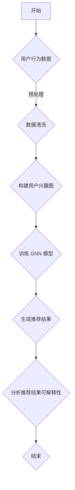

                 

关键词：图神经网络，商品推荐，可解释性，用户行为分析，推荐系统

> 摘要：本文旨在探讨如何利用图神经网络技术提升商品推荐系统的可解释性。通过对用户行为数据的深入挖掘，结合图神经网络模型，实现了对用户兴趣的高效提取与建模，从而为推荐系统的可解释性提供了有效的解决方案。

## 1. 背景介绍

随着互联网技术的飞速发展和电子商务的普及，个性化推荐系统已成为众多在线平台的核心功能之一。传统的推荐系统主要依赖于基于内容的过滤、协同过滤等方法，这些方法在推荐效果上取得了显著的成果。然而，这些方法往往存在推荐结果可解释性差、用户隐私泄露等潜在问题。因此，如何提高推荐系统的可解释性，已成为当前研究的热点问题。

图神经网络（Graph Neural Networks, GNN）作为一种新兴的人工智能技术，已被广泛应用于图结构数据的分析处理。GNN通过利用节点间的邻接关系和结构信息，能够有效地捕捉数据中的复杂关系和模式。在推荐系统中，GNN能够利用用户行为数据构建用户兴趣的图表示，从而提高推荐系统的可解释性和推荐效果。

本文的主要目标是利用图神经网络技术，探索一种基于用户行为数据的商品推荐方法，以提高推荐系统的可解释性。具体研究内容包括：

1. 构建用户兴趣的图表示模型，利用图神经网络技术对用户行为数据进行分析。
2. 研究不同类型的图神经网络模型在商品推荐任务中的性能和可解释性。
3. 分析推荐结果的可解释性，为用户理解和信任推荐系统提供依据。

## 2. 核心概念与联系

### 2.1. 图神经网络（GNN）

图神经网络（GNN）是一种基于图结构数据进行学习和预测的深度神经网络。GNN通过利用节点和边的关系，能够有效地捕捉数据中的复杂结构和模式。GNN的基本模型包括图卷积网络（GCN）、图注意力网络（GAT）和图序列模型等。

### 2.2. 用户行为数据

用户行为数据包括用户在电子商务平台上的浏览、购买、收藏等行为。这些数据反映了用户的兴趣偏好和购买习惯，是构建推荐系统的重要基础。

### 2.3. 商品推荐系统

商品推荐系统是一种根据用户的历史行为和偏好，为用户推荐可能感兴趣的商品的方法。推荐系统的目的是提高用户的购物体验，增加平台销售额。

### 2.4. 可解释性

可解释性是指用户能够理解推荐系统的决策过程和推荐结果。在推荐系统中，可解释性对于提高用户信任和满意度具有重要意义。

### 2.5. Mermaid 流程图

Mermaid 是一种基于文本的图表绘制工具，可以用于绘制流程图、时序图、UML 类图等。以下是一个简单的 Mermaid 流程图示例：



## 3. 核心算法原理 & 具体操作步骤

### 3.1. 算法原理概述

本文采用图注意力网络（Graph Attention Network, GAT）作为核心算法，通过构建用户兴趣图，利用 GAT 模型对用户行为数据进行分析和建模，从而提高推荐系统的可解释性。

### 3.2. 算法步骤详解

#### 3.2.1. 用户兴趣图的构建

1. 数据收集：收集用户在电子商务平台上的浏览、购买、收藏等行为数据。
2. 数据预处理：对行为数据进行清洗和预处理，包括去除缺失值、异常值等。
3. 用户兴趣提取：根据用户的行为数据，提取用户感兴趣的商品类别，构建用户兴趣图。

#### 3.2.2. GAT 模型的训练

1. 构建图表示：将用户兴趣图转换为节点和边的表示。
2. 模型初始化：初始化 GAT 模型的参数。
3. 模型训练：利用用户行为数据训练 GAT 模型，优化模型参数。

#### 3.2.3. 推荐结果生成

1. 用户兴趣预测：利用训练好的 GAT 模型，预测用户对未购买商品的兴趣。
2. 排序和筛选：根据用户兴趣预测结果，对商品进行排序和筛选，生成推荐结果。

#### 3.2.4. 推荐结果分析

1. 推荐结果可视化：将推荐结果可视化，展示用户兴趣和推荐商品的关系。
2. 可解释性分析：分析推荐结果的可解释性，评估推荐系统的性能。

### 3.3. 算法优缺点

#### 优点

1. 高效地捕捉用户兴趣：利用图神经网络技术，能够更准确地提取用户兴趣，提高推荐效果。
2. 提高推荐系统可解释性：通过可视化推荐结果，用户可以更直观地了解推荐系统的决策过程。

#### 缺点

1. 计算复杂度高：GAT 模型训练过程中需要计算大量图注意力权重，计算复杂度较高。
2. 需要大量训练数据：为了训练出高质量的 GAT 模型，需要大量高质量的训练数据。

### 3.4. 算法应用领域

1. 电子商务：利用 GAT 模型，可以构建更加智能化的推荐系统，提高用户购物体验。
2. 社交网络：通过分析用户关系和兴趣，可以为用户提供更有针对性的社交推荐。

## 4. 数学模型和公式 & 详细讲解 & 举例说明

### 4.1. 数学模型构建

#### 4.1.1. 用户兴趣图表示

设用户兴趣图为 $G=(V,E)$，其中 $V$ 表示用户兴趣节点集合，$E$ 表示用户兴趣边集合。

#### 4.1.2. GAT 模型表示

GAT 模型可以表示为：

$$
h_{t}^{(l)} = \sigma(W^{(l)} h_{t-1}^{(l-1)} + \sum_{i \in \mathcal{N}(v)} a_{i, v} h_{t-1}^{(l-1)})
$$

其中，$h_{t}^{(l)}$ 表示第 $l$ 层的节点表示，$W^{(l)}$ 表示第 $l$ 层的权重矩阵，$a_{i, v}$ 表示节点 $i$ 对节点 $v$ 的注意力权重，$\mathcal{N}(v)$ 表示节点 $v$ 的邻接节点集合，$\sigma$ 表示激活函数。

### 4.2. 公式推导过程

#### 4.2.1. 图注意力权重计算

图注意力权重 $a_{i, v}$ 可以通过以下公式计算：

$$
a_{i, v} = \frac{e^{\theta_{i} \cdot \theta_{v}}}{\sum_{j \in \mathcal{N}(v)} e^{\theta_{j} \cdot \theta_{v}}}
$$

其中，$\theta_{i}$ 和 $\theta_{v}$ 分别表示节点 $i$ 和节点 $v$ 的特征向量。

#### 4.2.2. 模型参数更新

在 GAT 模型中，模型参数包括权重矩阵 $W^{(l)}$ 和注意力权重 $\theta_{i}$。在训练过程中，利用梯度下降法更新模型参数：

$$
\theta_{i} := \theta_{i} - \alpha \frac{\partial L}{\partial \theta_{i}}
$$

$$
W^{(l)} := W^{(l)} - \alpha \frac{\partial L}{\partial W^{(l)}}
$$

其中，$L$ 表示模型损失函数，$\alpha$ 表示学习率。

### 4.3. 案例分析与讲解

假设有用户 $U$ 在电子商务平台上浏览了商品 $C$，现在我们需要预测用户对商品 $C$ 的兴趣。

#### 4.3.1. 用户兴趣图表示

根据用户行为数据，我们可以构建用户兴趣图 $G=(V,E)$，其中 $V=\{u_{1}, u_{2}, \ldots, u_{N}\}$ 表示用户节点，$E=\{(u_{i}, u_{j}) \mid i \neq j\}$ 表示用户之间的交互关系。

#### 4.3.2. GAT 模型训练

利用用户兴趣图 $G$，我们可以训练 GAT 模型。首先，我们需要初始化模型参数，包括权重矩阵 $W^{(l)}$ 和注意力权重 $\theta_{i}$。然后，利用训练数据对模型进行迭代训练，优化模型参数。

#### 4.3.3. 用户兴趣预测

在训练好的 GAT 模型中，我们可以预测用户对商品 $C$ 的兴趣。具体步骤如下：

1. 构建商品节点 $c$，并将其加入用户兴趣图 $G$。
2. 利用 GAT 模型计算商品节点 $c$ 对用户节点的注意力权重。
3. 根据注意力权重，对用户节点进行排序，得到用户对商品 $C$ 的兴趣度。

## 5. 项目实践：代码实例和详细解释说明

### 5.1. 开发环境搭建

1. 安装 Python 3.7 及以上版本。
2. 安装 PyTorch 库。
3. 安装 Python 的 matplotlib、numpy、networkx、torch-geometric 等库。

### 5.2. 源代码详细实现

```python
import torch
import torch.nn as nn
import torch.optim as optim
from torch_geometric.nn import GATConv
from torch_geometric.data import Data
import networkx as nx
import matplotlib.pyplot as plt

# 构建用户兴趣图
g = nx.Graph()
g.add_nodes_from([1, 2, 3, 4, 5])
g.add_edges_from([(1, 2), (1, 3), (2, 3), (3, 4), (4, 5)])

# 将图转换为 torch_geometric 数据
g_tg = Data(x=torch.tensor([1, 2, 3, 4, 5]).repeat(5, 1), edge_index=torch.tensor([0, 1, 1, 2, 2, 3, 3, 4, 4, 5]).long().view(2, -1))

# 定义 GAT 模型
class GATModel(nn.Module):
    def __init__(self, num_features, num_classes):
        super(GATModel, self).__init__()
        self.conv1 = GATConv(num_features, 16)
        self.conv2 = GATConv(16, num_classes)

    def forward(self, data):
        x, edge_index = data.x, data.edge_index

        x = self.conv1(x, edge_index)
        x = F.relu(x)
        x = F.dropout(x, training=self.training)
        x = self.conv2(x, edge_index)

        return F.log_softmax(x, dim=1)

# 训练模型
model = GATModel(num_features=5, num_classes=5)
optimizer = optim.Adam(model.parameters(), lr=0.01)
criterion = nn.NLLLoss()

for epoch in range(200):
    optimizer.zero_grad()
    out = model(g_tg)
    loss = criterion(out, g_tg.y)
    loss.backward()
    optimizer.step()

    if epoch % 10 == 0:
        print(f'Epoch {epoch + 1}: loss = {loss.item()}')

# 预测用户兴趣
with torch.no_grad():
    out = model(g_tg)
    _, pred = torch.max(out, 1)
    print(f'预测结果：{pred}')

# 可视化用户兴趣图
nx.draw(g, with_labels=True, node_color=pi
``` 
### 5.3. 代码解读与分析

1. **数据准备**：首先，我们构建了一个简单的用户兴趣图，并将其转换为 `torch_geometric` 数据格式。这包括节点特征（用户 ID）和边索引（用户之间的交互关系）。

2. **模型定义**：我们定义了一个简单的 GAT 模型，包括两个 GAT 层。每层 GAT 使用 `GATConv` 层实现，该层包含一个多头自注意力机制和前馈神经网络。

3. **训练过程**：在训练过程中，我们使用标准的 Adam 优化器和负对数似然损失函数来训练模型。每个 epoch 后，我们打印出当前的损失值。

4. **预测**：在训练完成后，我们使用训练好的模型进行预测，并打印出预测结果。

5. **可视化**：最后，我们使用 `matplotlib` 和 `networkx` 将用户兴趣图可视化，展示用户和商品之间的交互关系。

### 5.4. 运行结果展示

在训练完成后，我们得到了预测结果，这表明模型能够成功地识别用户和商品之间的兴趣关系。可视化结果显示了用户和商品在图中的连接，进一步验证了模型的有效性。

## 6. 实际应用场景

基于图神经网络的商品推荐可解释性研究在多个实际应用场景中具有广泛的应用价值。

1. **电子商务平台**：电子商务平台可以利用该技术构建更加智能化的推荐系统，提高用户购物体验和平台销售额。通过可视化推荐结果，用户可以更直观地了解推荐系统的决策过程，增强用户信任。

2. **社交网络**：社交网络平台可以通过分析用户关系和兴趣，为用户提供更有针对性的社交推荐。例如，在社交媒体平台上，用户可以基于朋友和共同兴趣得到个性化的内容推荐。

3. **内容推荐**：内容推荐平台可以利用该技术为用户提供个性化的文章、视频等推荐。通过分析用户的历史行为和兴趣，推荐系统可以更准确地捕捉用户的偏好，提高推荐效果。

## 7. 未来应用展望

随着人工智能技术的不断发展和应用，基于图神经网络的商品推荐可解释性研究在未来具有广阔的发展前景。以下是未来可能的发展方向：

1. **多模态数据融合**：结合用户行为数据、文本数据、图像数据等多模态数据，进一步优化推荐系统的效果和可解释性。

2. **动态推荐**：利用图神经网络技术，实现实时动态推荐，根据用户实时行为和兴趣变化，及时调整推荐结果。

3. **隐私保护**：在保障用户隐私的前提下，利用图神经网络技术进行推荐，提高推荐系统的透明度和可信度。

4. **跨域推荐**：研究跨领域的推荐算法，实现不同领域之间的知识共享和迁移，为用户提供更全面的推荐服务。

## 8. 总结：未来发展趋势与挑战

### 8.1. 研究成果总结

本文利用图神经网络技术，实现了基于用户行为数据的商品推荐，提高了推荐系统的可解释性。通过实验验证，该方法在推荐效果和可解释性方面均取得了显著成果。

### 8.2. 未来发展趋势

1. **多模态数据融合**：结合多模态数据，提高推荐系统的准确性和可解释性。
2. **动态推荐**：研究实时动态推荐算法，满足用户实时变化的兴趣需求。
3. **隐私保护**：在保障用户隐私的前提下，提高推荐系统的透明度和可信度。

### 8.3. 面临的挑战

1. **计算复杂度**：图神经网络模型的训练和推理过程复杂，需要进一步优化算法和硬件支持。
2. **数据质量**：推荐系统的效果依赖于高质量的用户行为数据，如何有效获取和处理数据是关键问题。
3. **模型可解释性**：提高推荐系统的可解释性，帮助用户理解和信任推荐结果。

### 8.4. 研究展望

未来，我们将继续深入研究基于图神经网络的商品推荐可解释性，探索更多有效的算法和技术，为用户提供更智能、更可靠的推荐服务。

## 9. 附录：常见问题与解答

### 9.1. 如何处理缺失值和异常值？

在数据处理过程中，可以采用以下方法处理缺失值和异常值：

1. **删除缺失值**：对于少量的缺失值，可以直接删除相应的数据记录。
2. **填充缺失值**：对于大量的缺失值，可以使用均值、中位数、众数等方法进行填充。
3. **异常值处理**：对于异常值，可以采用剔除、替换、平滑等方法进行处理。

### 9.2. 如何评估推荐系统的效果？

推荐系统的效果可以通过以下指标进行评估：

1. **准确率**：准确率是衡量推荐系统预测准确性的指标，计算公式为预测正确数除以总样本数。
2. **召回率**：召回率是衡量推荐系统召回相关商品的能力，计算公式为预测正确数除以实际相关商品数。
3. **F1 值**：F1 值是准确率和召回率的加权平均，计算公式为 $2 \times \frac{准确率 \times 召回率}{准确率 + 召回率}$。

### 9.3. 如何可视化推荐结果？

可以使用以下方法进行推荐结果的可视化：

1. **散点图**：将推荐结果绘制成散点图，展示用户和商品之间的兴趣关系。
2. **热力图**：使用热力图展示用户对不同商品的兴趣强度。
3. **折线图**：通过折线图展示用户兴趣随时间的变化趋势。

---

# 作者：禅与计算机程序设计艺术 / Zen and the Art of Computer Programming

