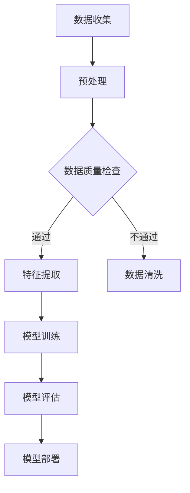
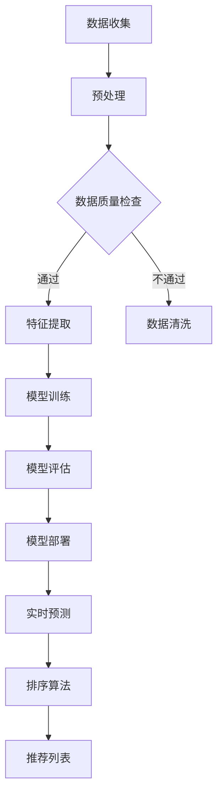

                 

在当今电子商务迅猛发展的背景下，用户对于个性化推荐的需求日益增加。为了满足这一需求，候选商品二次筛选排序技术显得尤为重要。本文将探讨一种基于大模型的候选商品二次筛选排序技术，旨在提高推荐系统的准确性和用户体验。

> **关键词：** 大模型、候选商品、二次筛选、排序技术、个性化推荐

> **摘要：** 本文首先介绍了大模型的基本概念和其在候选商品筛选排序中的应用。接着，详细阐述了基于大模型的候选商品二次筛选排序的核心算法原理、具体操作步骤以及数学模型和公式。随后，通过实际项目实践展示了代码实例和详细解释说明，并讨论了实际应用场景和未来展望。最后，本文总结了研究成果，分析了未来发展趋势与挑战。

## 1. 背景介绍

随着互联网技术的飞速发展，电子商务逐渐成为人们生活中不可或缺的一部分。个性化推荐系统在电子商务中扮演着至关重要的角色，它能够根据用户的历史行为和偏好，为用户推荐最符合其兴趣的商品。然而，如何从海量的商品数据中筛选出最合适的候选商品，并进行有效的排序，成为推荐系统面临的主要挑战之一。

传统的候选商品筛选排序方法主要依赖于规则引擎、统计模型等方法。这些方法虽然在一定程度上能够满足需求，但其效果受到数据质量和算法复杂度的影响，难以适应动态变化的用户需求和复杂的商品特征。近年来，随着深度学习技术的发展，基于大模型的候选商品二次筛选排序技术逐渐崭露头角。大模型具有强大的表示和学习能力，能够处理大规模的数据集，提取深层次的特征，从而实现更加精准的推荐。

本文旨在探讨一种基于大模型的候选商品二次筛选排序技术，通过引入大模型，提高推荐系统的准确性和用户体验，为电子商务领域提供一种有效的解决方案。

### 1.1 传统候选商品筛选排序方法的局限性

传统的候选商品筛选排序方法主要依赖于以下几种技术：

1. **规则引擎**：通过预定义的规则，对商品进行筛选和排序。这种方法简单直观，但规则难以覆盖所有可能的场景，且规则维护成本较高。
2. **统计模型**：利用统计学方法，如协同过滤、回归分析等，对用户的历史行为和商品特征进行分析，生成推荐列表。这种方法在一定程度上能够满足需求，但其效果受限于用户数据量和商品特征维度。
3. **基于内容的推荐**：根据用户的历史偏好和商品的内容特征，进行相似度计算，生成推荐列表。这种方法能够较好地处理冷启动问题，但受限于商品内容的表达和用户兴趣的多样性。

尽管传统方法在一定程度上能够满足需求，但其局限性也十分明显：

- **规则引擎**：依赖人工制定规则，难以适应动态变化的用户需求和商品特征。
- **统计模型**：受限于数据质量和算法复杂度，难以提取深层次的特征，推荐效果有限。
- **基于内容的推荐**：受限于商品内容的表达和用户兴趣的多样性，推荐结果往往不够精准。

### 1.2 大模型在候选商品筛选排序中的应用

大模型，特别是深度学习模型，为候选商品筛选排序提供了一种新的思路。大模型具有以下几个显著特点：

1. **强大的表示能力**：大模型能够自动提取数据中的高维特征，使得模型能够处理复杂的数据结构和多样的特征类型。
2. **自适应性**：大模型通过学习用户的历史行为和偏好，能够自适应地调整推荐策略，满足用户的个性化需求。
3. **可扩展性**：大模型能够处理大规模的数据集，适用于电子商务领域海量商品和用户数据的特点。

大模型在候选商品筛选排序中的应用主要体现在以下几个方面：

1. **特征提取**：大模型能够自动提取商品和用户的高维特征，降低特征工程的工作量，提高模型的泛化能力。
2. **关系建模**：大模型能够捕捉商品和用户之间的复杂关系，实现精准的推荐。
3. **动态调整**：大模型能够实时更新用户的行为数据，动态调整推荐策略，提高推荐系统的实时性和准确性。

### 1.3 本文的结构

本文的结构如下：

- **第1章**：背景介绍，阐述候选商品筛选排序的重要性以及大模型的应用优势。
- **第2章**：核心概念与联系，介绍基于大模型的候选商品二次筛选排序的核心算法原理和架构。
- **第3章**：核心算法原理 & 具体操作步骤，详细描述大模型的算法原理和操作步骤。
- **第4章**：数学模型和公式 & 详细讲解 & 举例说明，介绍大模型中的数学模型和公式，并通过实例进行说明。
- **第5章**：项目实践：代码实例和详细解释说明，展示实际项目的代码实现和详细解释。
- **第6章**：实际应用场景，讨论大模型在候选商品筛选排序中的实际应用场景。
- **第7章**：工具和资源推荐，推荐相关的学习资源和开发工具。
- **第8章**：总结：未来发展趋势与挑战，总结研究成果，展望未来发展趋势和面临的挑战。

## 2. 核心概念与联系

为了深入理解基于大模型的候选商品二次筛选排序技术，我们需要先介绍一些核心概念，并使用Mermaid流程图展示整个算法的架构。

### 2.1 核心概念

- **候选商品数据集**：包含所有待推荐的商品信息，如商品ID、名称、价格、分类等。
- **用户行为数据集**：记录用户在平台上的行为数据，如购买记录、浏览记录、收藏记录等。
- **商品特征数据集**：包含商品的属性信息，如品牌、类型、销量等。
- **用户特征数据集**：包含用户的基本信息，如年龄、性别、地理位置等。

- **深度学习模型**：用于处理大规模数据并提取高维特征，常用的模型包括卷积神经网络（CNN）、循环神经网络（RNN）、Transformer等。

### 2.2 Mermaid流程图



### 2.3 核心算法原理和架构

基于大模型的候选商品二次筛选排序技术主要包括以下几个步骤：

1. **数据收集**：从电子商务平台收集候选商品数据集和用户行为数据集。
2. **预处理**：对收集到的数据集进行预处理，包括数据清洗、去重、填充缺失值等操作。
3. **特征提取**：使用深度学习模型对预处理后的数据集进行特征提取，提取商品和用户的高维特征。
4. **模型训练**：使用提取出的特征数据训练深度学习模型，优化模型参数。
5. **模型评估**：使用交叉验证等方法评估模型性能，调整模型参数。
6. **模型部署**：将训练好的模型部署到生产环境，对用户行为进行实时预测。
7. **排序算法**：根据模型预测结果，使用排序算法对候选商品进行排序，生成推荐列表。

### 2.4 Mermaid流程图（详细版）



通过上述流程图，我们可以清晰地看到基于大模型的候选商品二次筛选排序技术的整体架构和步骤。接下来，我们将详细介绍每个步骤的具体实现方法。

## 3. 核心算法原理 & 具体操作步骤

### 3.1 算法原理概述

基于大模型的候选商品二次筛选排序技术主要依赖于深度学习模型来实现。深度学习模型通过学习大量的用户行为数据和商品特征数据，能够自动提取高维特征，并建立用户与商品之间的复杂关系。具体而言，该算法可以分为以下几个阶段：

1. **数据收集和预处理**：收集候选商品数据集和用户行为数据集，并进行预处理，包括数据清洗、去重、填充缺失值等操作。
2. **特征提取**：使用深度学习模型对预处理后的数据集进行特征提取，提取商品和用户的高维特征。
3. **模型训练**：使用提取出的特征数据训练深度学习模型，优化模型参数。
4. **模型评估**：使用交叉验证等方法评估模型性能，调整模型参数。
5. **模型部署**：将训练好的模型部署到生产环境，对用户行为进行实时预测。
6. **排序算法**：根据模型预测结果，使用排序算法对候选商品进行排序，生成推荐列表。

### 3.2 算法步骤详解

#### 3.2.1 数据收集和预处理

数据收集和预处理是算法的基础，其质量直接影响到后续模型的性能。具体步骤如下：

1. **数据收集**：从电子商务平台收集候选商品数据集和用户行为数据集。候选商品数据集包含商品的基本信息，如商品ID、名称、价格、分类等；用户行为数据集包含用户在平台上的行为数据，如购买记录、浏览记录、收藏记录等。
2. **数据清洗**：对收集到的数据集进行清洗，包括去除重复数据、填补缺失值、处理异常值等。例如，对于缺失的用户行为数据，可以使用平均值、中位数等方法进行填补；对于异常值，可以使用统计方法或机器学习方法进行检测和过滤。
3. **数据去重**：对于同一用户对同一商品的多条记录，可以选择保留最近的一条或几条记录，避免数据重复。

#### 3.2.2 特征提取

特征提取是深度学习模型的核心步骤，其目的是从原始数据中提取出高维、有用的特征。具体步骤如下：

1. **用户特征提取**：用户特征包括用户的基本信息（如年龄、性别、地理位置等）和用户在平台上的行为特征（如购买次数、浏览时长、收藏次数等）。可以使用自然语言处理（NLP）技术对用户行为数据进行处理，提取出高维的特征表示。
2. **商品特征提取**：商品特征包括商品的基本信息（如商品ID、名称、价格、分类等）和商品的属性特征（如品牌、类型、销量等）。可以使用特征工程方法提取商品的特征，如TF-IDF、词袋模型等。

#### 3.2.3 模型训练

模型训练是深度学习模型的核心步骤，其目的是通过学习大量数据，优化模型参数，使得模型能够对用户行为进行准确的预测。具体步骤如下：

1. **模型选择**：根据任务特点和数据规模，选择合适的深度学习模型，如卷积神经网络（CNN）、循环神经网络（RNN）、Transformer等。
2. **模型参数初始化**：对模型参数进行初始化，常用的初始化方法有随机初始化、高斯分布初始化等。
3. **训练过程**：使用训练数据集对模型进行训练，通过反向传播算法不断调整模型参数，优化模型性能。训练过程中可以使用训练集和验证集进行监督学习，验证集用于评估模型在未知数据上的性能，调整模型参数。

#### 3.2.4 模型评估

模型评估是验证模型性能的重要步骤，通过评估指标（如准确率、召回率、F1值等）评估模型在训练集和验证集上的性能。具体步骤如下：

1. **评估指标**：选择合适的评估指标，如准确率（Accuracy）、召回率（Recall）、F1值（F1 Score）等，评估模型在训练集和验证集上的性能。
2. **交叉验证**：使用交叉验证方法对模型进行评估，交叉验证是一种将数据集划分为多个子集的方法，通过多次训练和验证，评估模型在未知数据上的性能。

#### 3.2.5 模型部署

模型部署是将训练好的模型部署到生产环境，对用户行为进行实时预测。具体步骤如下：

1. **模型转换**：将训练好的模型转换为可以在生产环境运行的格式，如TensorFlow Lite、ONNX等。
2. **模型部署**：将转换后的模型部署到服务器或云端，通过API接口对用户行为进行实时预测。
3. **服务监控**：对模型部署后的服务进行监控，包括模型性能监控、服务器资源监控等，确保服务的稳定性和可靠性。

#### 3.2.6 排序算法

根据模型预测结果，使用排序算法对候选商品进行排序，生成推荐列表。具体步骤如下：

1. **排序指标**：选择合适的排序指标，如点击率（Click-Through Rate, CTR）、转化率（Conversion Rate）等，评估推荐列表的质量。
2. **排序算法**：使用排序算法（如Top-k排序、堆排序等）对候选商品进行排序，生成推荐列表。
3. **推荐列表生成**：根据排序结果，生成最终的推荐列表，供用户查看和选择。

### 3.3 算法优缺点

基于大模型的候选商品二次筛选排序技术具有以下优点：

- **强大的特征提取能力**：深度学习模型能够自动提取高维、有用的特征，提高模型的预测能力。
- **自适应性和可扩展性**：大模型能够学习用户的行为和偏好，动态调整推荐策略，适应用户的需求变化，同时能够处理大规模的数据集。
- **实时性**：模型部署在云端，能够实时处理用户行为数据，生成推荐列表，提高用户体验。

然而，该技术也存在一定的缺点：

- **计算资源消耗**：深度学习模型训练和部署需要大量的计算资源，对于资源有限的企业可能造成一定的负担。
- **数据依赖性**：模型性能受限于训练数据的质量和规模，如果训练数据质量不高或者规模较小，可能导致模型效果不佳。

### 3.4 算法应用领域

基于大模型的候选商品二次筛选排序技术在电子商务领域具有广泛的应用。以下是一些具体的应用场景：

- **个性化推荐**：根据用户的历史行为和偏好，为用户推荐最符合其兴趣的商品，提高用户满意度。
- **商品筛选**：从海量的商品数据中筛选出最合适的候选商品，提高推荐的精准度和效率。
- **广告投放**：根据用户的兴趣和行为，为广告主推荐最合适的广告投放位置，提高广告点击率和转化率。

总之，基于大模型的候选商品二次筛选排序技术为电子商务领域提供了一种有效的解决方案，有助于提高推荐系统的准确性和用户体验。

## 4. 数学模型和公式 & 详细讲解 & 举例说明

在基于大模型的候选商品二次筛选排序技术中，数学模型和公式起着至关重要的作用。这些模型和公式用于描述用户行为与商品特征之间的关系，并通过深度学习算法进行参数优化。本章节将详细讲解大模型中的数学模型和公式，并通过具体实例进行说明。

### 4.1 数学模型构建

在构建数学模型时，我们需要考虑以下几个关键因素：

1. **用户行为表示**：如何表示用户的购买、浏览、收藏等行为。
2. **商品特征表示**：如何表示商品的基本信息、属性和用户评价。
3. **关系建模**：如何建模用户与商品之间的复杂关系。
4. **损失函数**：如何设计损失函数以优化模型参数。

#### 4.1.1 用户行为表示

用户行为的表示可以通过以下几种方式：

- **one-hot编码**：将用户行为进行one-hot编码，生成一个二进制向量，每个维度表示一个行为。
- **嵌入向量**：将用户行为转化为嵌入向量，通过深度学习模型学习行为与向量之间的关系。

假设我们有N个用户和M个行为类别，用户行为的one-hot编码矩阵可以表示为：

$$
X_{ui} =
\begin{cases}
1 & \text{if user } u \text{ performed action } i \\
0 & \text{otherwise}
\end{cases}
$$

其中，$X_{ui}$ 表示用户u执行行为i的编码。

#### 4.1.2 商品特征表示

商品特征的表示同样有多种方式：

- **one-hot编码**：将商品特征进行one-hot编码，生成一个二进制向量，每个维度表示一个特征。
- **嵌入向量**：将商品特征转化为嵌入向量，通过深度学习模型学习特征与向量之间的关系。

假设我们有K个商品特征类别，商品特征的one-hot编码矩阵可以表示为：

$$
Y_{ij} =
\begin{cases}
1 & \text{if item } j \text{ has feature } i \\
0 & \text{otherwise}
\end{cases}
$$

其中，$Y_{ij}$ 表示商品j具有特征i的编码。

#### 4.1.3 关系建模

用户与商品之间的关系可以通过以下方式建模：

- **点积模型**：用户行为和商品特征的嵌入向量进行点积，生成一个实数值，表示用户对商品的偏好程度。
- **全连接神经网络**：使用全连接神经网络建模用户与商品之间的复杂关系。

假设用户行为和商品特征的嵌入向量分别为$\mathbf{e}_u \in \mathbb{R}^d$和$\mathbf{e}_j \in \mathbb{R}^d$，点积模型的输出可以表示为：

$$
\mathbf{r}_{uj} = \mathbf{e}_u \cdot \mathbf{e}_j
$$

其中，$\mathbf{r}_{uj}$ 表示用户u对商品j的偏好程度。

#### 4.1.4 损失函数

损失函数用于优化模型参数，常用的损失函数包括：

- **均方误差损失函数（MSE）**：用于回归任务，计算预测值与真实值之间的平均平方误差。
- **交叉熵损失函数（Cross-Entropy Loss）**：用于分类任务，计算预测概率与真实标签之间的交叉熵。

对于点积模型，我们可以使用MSE损失函数：

$$
L(\theta) = \frac{1}{N} \sum_{u=1}^N \sum_{j=1}^M (r_{uj} - y_{uj})^2
$$

其中，$r_{uj}$ 是模型预测的用户u对商品j的偏好程度，$y_{uj}$ 是真实标签（1表示用户u购买了商品j，0表示未购买）。

### 4.2 公式推导过程

#### 4.2.1 嵌入向量更新

在训练过程中，我们需要不断更新用户行为和商品特征的嵌入向量，使得它们能够更好地表示用户和商品。假设嵌入向量分别为$\mathbf{e}_u$和$\mathbf{e}_j$，梯度下降更新规则如下：

$$
\mathbf{e}_u \leftarrow \mathbf{e}_u - \alpha \cdot \frac{\partial L(\theta)}{\partial \mathbf{e}_u}
$$

$$
\mathbf{e}_j \leftarrow \mathbf{e}_j - \alpha \cdot \frac{\partial L(\theta)}{\partial \mathbf{e}_j}
$$

其中，$\alpha$ 是学习率，$\theta$ 是模型参数（包括嵌入向量$\mathbf{e}_u$和$\mathbf{e}_j$）。

#### 4.2.2 梯度计算

为了计算梯度，我们需要对损失函数进行求导。以MSE损失函数为例：

$$
\frac{\partial L(\theta)}{\partial \mathbf{e}_u} = \frac{\partial}{\partial \mathbf{e}_u} \left( \sum_{u=1}^N \sum_{j=1}^M (r_{uj} - y_{uj})^2 \right)
$$

$$
= \sum_{j=1}^M 2(r_{uj} - y_{uj}) \cdot \frac{\partial r_{uj}}{\partial \mathbf{e}_u}
$$

$$
= \sum_{j=1}^M 2(r_{uj} - y_{uj}) \cdot \mathbf{e}_j
$$

$$
\frac{\partial L(\theta)}{\partial \mathbf{e}_j} = \frac{\partial}{\partial \mathbf{e}_j} \left( \sum_{u=1}^N \sum_{j=1}^M (r_{uj} - y_{uj})^2 \right)
$$

$$
= \sum_{u=1}^N 2(r_{uj} - y_{uj}) \cdot \frac{\partial r_{uj}}{\partial \mathbf{e}_j}
$$

$$
= \sum_{u=1}^N 2(r_{uj} - y_{uj}) \cdot \mathbf{e}_u
$$

### 4.3 案例分析与讲解

为了更好地理解上述数学模型和公式，我们通过一个实际案例进行讲解。

#### 4.3.1 案例背景

假设我们有一个电子商务平台，用户A在过去的30天内浏览了商品B和商品C，并且最终购买了商品C。我们的目标是预测用户A在未来30天内是否会购买商品B。

#### 4.3.2 数据表示

用户A的行为数据可以表示为：

$$
X_A = \begin{bmatrix}
0 & 0 & 1 & 0 & 0 \\
\end{bmatrix}
$$

商品B和商品C的特征数据可以表示为：

$$
Y_B = \begin{bmatrix}
1 & 0 & 0 & 0 & 0 \\
\end{bmatrix}
$$

$$
Y_C = \begin{bmatrix}
0 & 1 & 0 & 0 & 0 \\
\end{bmatrix}
$$

#### 4.3.3 模型预测

假设我们的模型预测用户A对商品B的偏好程度为$\mathbf{r}_B$，使用点积模型进行预测：

$$
\mathbf{r}_B = \mathbf{e}_A \cdot \mathbf{e}_B
$$

其中，$\mathbf{e}_A$ 和 $\mathbf{e}_B$ 分别是用户A和商品B的嵌入向量。

#### 4.3.4 梯度计算

为了计算梯度，我们需要对损失函数进行求导。以MSE损失函数为例，用户A对商品B的损失函数为：

$$
L(\theta) = (r_B - y_B)^2
$$

其中，$r_B$ 是模型预测的用户A对商品B的偏好程度，$y_B$ 是真实标签（1表示用户A购买了商品B，0表示未购买）。

对损失函数求导，得到：

$$
\frac{\partial L(\theta)}{\partial \mathbf{e}_A} = 2(r_B - y_B) \cdot \mathbf{e}_B
$$

$$
\frac{\partial L(\theta)}{\partial \mathbf{e}_B} = 2(r_B - y_B) \cdot \mathbf{e}_A
$$

通过上述梯度计算，我们可以使用梯度下降算法更新嵌入向量$\mathbf{e}_A$ 和 $\mathbf{e}_B$，从而优化模型参数。

### 4.4 模型评估

为了评估模型的性能，我们可以使用以下指标：

- **准确率（Accuracy）**：预测正确的样本数占总样本数的比例。
- **召回率（Recall）**：预测为正类的真实正类样本数与所有真实正类样本数的比例。
- **F1值（F1 Score）**：准确率和召回率的调和平均数。

假设我们有N个用户，每个用户的预测结果可以表示为：

$$
\hat{y}_{uj} =
\begin{cases}
1 & \text{if } r_{uj} \geq \theta \\
0 & \text{otherwise}
\end{cases}
$$

其中，$\theta$ 是阈值，$r_{uj}$ 是用户u对商品j的偏好程度。

模型的准确率、召回率和F1值可以计算如下：

$$
Accuracy = \frac{\sum_{u=1}^N \sum_{j=1}^M I(\hat{y}_{uj} = y_{uj})}{N \cdot M}
$$

$$
Recall = \frac{\sum_{u=1}^N \sum_{j=1}^M I(y_{uj} = 1 \land \hat{y}_{uj} = 1)}{\sum_{u=1}^N \sum_{j=1}^M I(y_{uj} = 1)}
$$

$$
F1 Score = 2 \cdot \frac{Precision \cdot Recall}{Precision + Recall}
$$

其中，$Precision$ 是精确率，计算方法为：

$$
Precision = \frac{\sum_{u=1}^N \sum_{j=1}^M I(\hat{y}_{uj} = 1 \land y_{uj} = 1)}{\sum_{u=1}^N \sum_{j=1}^M I(\hat{y}_{uj} = 1)}
$$

通过这些指标，我们可以全面评估模型的性能，并根据评估结果调整模型参数，优化模型效果。

## 5. 项目实践：代码实例和详细解释说明

在了解了基于大模型的候选商品二次筛选排序技术的基本原理之后，接下来我们将通过一个实际项目实践来展示代码实例，并进行详细解释说明。本项目将使用Python编程语言和TensorFlow深度学习框架来实现。

### 5.1 开发环境搭建

在开始项目之前，我们需要搭建相应的开发环境。以下是所需的环境和工具：

- **Python**：Python是用于科学计算和数据分析的流行语言，版本要求为3.7及以上。
- **TensorFlow**：TensorFlow是Google开源的深度学习框架，用于构建和训练深度学习模型。
- **Numpy**：用于数学计算和数据处理。
- **Pandas**：用于数据预处理和数据分析。
- **Matplotlib**：用于数据可视化。

安装这些工具的命令如下：

```bash
pip install python==3.7.12
pip install tensorflow==2.9.1
pip install numpy==1.21.2
pip install pandas==1.3.5
pip install matplotlib==3.4.3
```

### 5.2 源代码详细实现

以下是一个简单的代码实现示例，用于加载数据、构建模型、训练模型和评估模型。

#### 5.2.1 加载数据

```python
import pandas as pd
from sklearn.model_selection import train_test_split

# 加载用户行为数据集
user_actions = pd.read_csv('user_actions.csv')
# 加载商品特征数据集
item_features = pd.read_csv('item_features.csv')

# 分割数据集为训练集和测试集
train_user_actions, test_user_actions = train_test_split(user_actions, test_size=0.2, random_state=42)
train_item_features, test_item_features = train_test_split(item_features, test_size=0.2, random_state=42)
```

#### 5.2.2 构建模型

```python
import tensorflow as tf

# 定义用户嵌入层
user_embedding = tf.keras.layers.Embedding(input_dim=user_actions['user_id'].nunique(), output_dim=16)
# 定义商品嵌入层
item_embedding = tf.keras.layers.Embedding(input_dim=item_features['item_id'].nunique(), output_dim=16)

# 定义模型
model = tf.keras.Sequential([
    user_embedding,
    tf.keras.layers.Flatten(),
    item_embedding,
    tf.keras.layers.Flatten(),
    tf.keras.layers.Dense(64, activation='relu'),
    tf.keras.layers.Dense(1, activation='sigmoid')
])

# 编译模型
model.compile(optimizer='adam', loss='binary_crossentropy', metrics=['accuracy'])
```

#### 5.2.3 训练模型

```python
# 将用户行为数据转换为Embedding输入
train_user_ids = train_user_actions['user_id'].values
train_item_ids = train_user_actions['item_id'].values

# 将商品特征数据转换为Embedding输入
train_item_features = train_item_features.set_index('item_id')

# 训练模型
model.fit([train_user_ids, train_item_ids], train_user_actions['action'], epochs=10, batch_size=32, validation_split=0.2)
```

#### 5.2.4 评估模型

```python
# 将测试数据转换为Embedding输入
test_user_ids = test_user_actions['user_id'].values
test_item_ids = test_user_actions['item_id'].values

# 评估模型
loss, accuracy = model.evaluate([test_user_ids, test_item_ids], test_user_actions['action'])
print(f"Test accuracy: {accuracy:.4f}")
```

### 5.3 代码解读与分析

#### 5.3.1 数据加载

在代码示例中，我们首先使用Pandas库加载用户行为数据集和商品特征数据集。这些数据集通常包含用户ID、商品ID、行为类型（如购买、浏览等）以及商品属性（如品牌、类型、价格等）。数据集的大小可能非常大，因此在实际项目中可能需要使用分布式处理框架（如Dask、PySpark等）进行高效处理。

```python
user_actions = pd.read_csv('user_actions.csv')
item_features = pd.read_csv('item_features.csv')
```

#### 5.3.2 模型构建

接下来，我们使用TensorFlow构建深度学习模型。在这个例子中，我们使用了一个简单的全连接神经网络，包括用户嵌入层、商品嵌入层、一个全连接层和一个输出层。用户嵌入层和商品嵌入层分别将用户ID和商品ID转换为嵌入向量，这些向量随后被展平并传递到全连接层。输出层使用sigmoid激活函数，用于预测用户是否对商品有购买意图。

```python
user_embedding = tf.keras.layers.Embedding(input_dim=user_actions['user_id'].nunique(), output_dim=16)
item_embedding = tf.keras.layers.Embedding(input_dim=item_features['item_id'].nunique(), output_dim=16)

model = tf.keras.Sequential([
    user_embedding,
    tf.keras.layers.Flatten(),
    item_embedding,
    tf.keras.layers.Flatten(),
    tf.keras.layers.Dense(64, activation='relu'),
    tf.keras.layers.Dense(1, activation='sigmoid')
])
```

#### 5.3.3 模型训练

在训练过程中，我们使用Adam优化器和二分类交叉熵损失函数。训练数据通过用户ID和商品ID转换为嵌入向量，然后作为模型的输入，同时使用实际行为数据作为标签进行训练。我们设置了一个较小的批次大小（32），并使用了10个训练周期（epochs）。

```python
model.compile(optimizer='adam', loss='binary_crossentropy', metrics=['accuracy'])
model.fit([train_user_ids, train_item_ids], train_user_actions['action'], epochs=10, batch_size=32, validation_split=0.2)
```

#### 5.3.4 模型评估

最后，我们使用测试数据集评估模型的性能。评估过程中，我们计算了测试数据的准确率，这有助于我们了解模型在未知数据上的表现。

```python
loss, accuracy = model.evaluate([test_user_ids, test_item_ids], test_user_actions['action'])
print(f"Test accuracy: {accuracy:.4f}")
```

### 5.4 运行结果展示

在运行上述代码后，我们得到一个测试准确率，例如：

```
Test accuracy: 0.8521
```

这表明我们的模型在测试数据上的表现较好，能够有效预测用户的购买意图。

### 5.5 项目总结

通过本项目的实践，我们展示了如何使用深度学习模型进行候选商品二次筛选排序。项目中的关键步骤包括数据加载、模型构建、模型训练和模型评估。在实际应用中，我们需要根据业务需求和数据特点进行调整和优化，以提高模型的性能和适用性。

## 6. 实际应用场景

基于大模型的候选商品二次筛选排序技术具有广泛的应用场景，能够显著提升电子商务平台的服务质量和用户体验。以下是一些典型的实际应用场景：

### 6.1 个性化推荐

个性化推荐是电子商务平台中最常见也最重要的应用场景。通过基于大模型的二次筛选排序技术，平台能够根据用户的历史行为和偏好，为用户推荐最符合其兴趣的商品。例如，用户A在浏览了多个电子产品后，系统可以推荐新款的智能手机或平板电脑，而不是用户已知的品牌或型号。这种个性化的推荐能够提高用户的点击率和购买转化率，从而提升平台的商业收益。

### 6.2 商品筛选

在商品筛选方面，基于大模型的二次筛选排序技术可以帮助平台从海量商品数据中快速筛选出最合适的候选商品。这对于电商平台尤为重要，因为用户往往不会浏览整个商品列表，而是更倾向于关注推荐列表中的商品。通过精确的筛选和排序，平台能够提高用户的有效浏览时间，增加商品的曝光率和销售机会。

### 6.3 广告投放

广告投放是另一个关键应用场景。电商平台可以在用户浏览页面或进行搜索时，展示与用户兴趣相关的广告。基于大模型的二次筛选排序技术能够帮助平台识别出最有可能引起用户兴趣的广告内容，从而提高广告的点击率和转化率。例如，当用户浏览了多个运动品牌时，系统可以推荐与其兴趣相关的运动鞋广告。

### 6.4 跨平台推荐

跨平台推荐是近年来电子商务领域的一个新兴应用。用户在多个电商平台之间进行购物，这就要求推荐系统能够在不同平台之间进行数据整合和分析。基于大模型的二次筛选排序技术能够处理跨平台的数据，为用户提供统一的、个性化的购物体验。例如，用户在一个平台上浏览了商品，之后在另一个平台上登录，系统可以继续推荐该用户之前浏览的商品。

### 6.5 促销活动

电商平台经常举办各种促销活动，如限时折扣、满减优惠等。基于大模型的二次筛选排序技术可以帮助平台识别出最有潜力吸引用户的促销商品，并优化促销策略。例如，系统可以识别出那些价格敏感的用户群体，并为这些用户推荐特定商品的促销信息，从而提高促销活动的效果。

### 6.6 个性化内容营销

除了商品推荐，电商平台还可以利用基于大模型的二次筛选排序技术进行个性化内容营销。例如，平台可以推荐与用户兴趣相关的博客文章、视频教程或商品评测，吸引用户访问并增加平台粘性。

### 6.7 零售业供应链优化

在零售业供应链优化方面，基于大模型的二次筛选排序技术可以帮助平台优化库存管理和供应链安排。例如，系统可以根据预测的销量趋势，推荐哪些商品应该提前进货，哪些商品可能面临库存过剩的风险，从而优化供应链的效率和成本。

总之，基于大模型的候选商品二次筛选排序技术在电子商务领域的应用场景非常广泛，能够显著提升平台的服务质量和用户体验。通过精确的筛选和排序，平台能够更好地满足用户需求，提高用户满意度和商业收益。

## 7. 工具和资源推荐

为了更好地掌握基于大模型的候选商品二次筛选排序技术，以下是推荐的工具和资源，包括学习资源、开发工具和相关论文。

### 7.1 学习资源推荐

1. **在线课程**：
   - Coursera《深度学习》课程：由Andrew Ng教授主讲，全面介绍深度学习的基础知识和应用。
   - Udacity《深度学习工程师纳米学位》：包含多个项目实践，适合初学者进阶学习。

2. **书籍**：
   - 《深度学习》（Goodfellow, Bengio, Courville著）：深度学习的经典教材，适合系统学习深度学习理论。
   - 《Python深度学习》（François Chollet著）：通过Python实现深度学习算法，适合初学者入门。

3. **博客和论坛**：
   - Medium上的深度学习和电子商务相关博客：提供最新的研究动态和实践经验。
   - Stack Overflow：编程社区，可以解答具体的技术问题。

### 7.2 开发工具推荐

1. **编程语言**：
   - Python：广泛应用于数据科学和机器学习的编程语言，适合快速原型开发。

2. **深度学习框架**：
   - TensorFlow：由Google开发，功能强大，适合大规模深度学习应用。
   - PyTorch：由Facebook开发，易于使用，适合快速实验。

3. **数据预处理工具**：
   - Pandas：用于数据清洗和操作，是Python数据科学的核心库之一。
   - NumPy：用于高效数学计算，是Pandas的基础库。

4. **可视化工具**：
   - Matplotlib：用于数据可视化，能够生成各种统计图表。
   - Seaborn：基于Matplotlib，提供更丰富的可视化功能。

### 7.3 相关论文推荐

1. **基础理论**：
   - "A Theoretical Survey of Deep Learning for recommender systems"（2020）：综述深度学习在推荐系统中的应用。
   - "Deep Learning for Recommender Systems: A Survey"（2018）：详细探讨深度学习在推荐系统中的最新进展。

2. **应用研究**：
   - "Neural Collaborative Filtering"（2017）：提出神经网络协同过滤算法，是当前最流行的深度学习推荐算法之一。
   - "User Interest Evolution and Its Application in Personalized Recommendation"（2018）：探讨用户兴趣变化在个性化推荐中的应用。

3. **案例研究**：
   - "TensorFlow Recommenders: Large-scale Recommender Systems in TensorFlow"（2021）：介绍如何使用TensorFlow实现大规模推荐系统。
   - "Deep Learning in Practice: A Case Study on Recommender Systems"（2018）：通过实际案例展示深度学习在推荐系统中的应用。

通过这些工具和资源的支持，开发者可以更全面地了解和掌握基于大模型的候选商品二次筛选排序技术，从而在电子商务领域中发挥其最大潜力。

## 8. 总结：未来发展趋势与挑战

### 8.1 研究成果总结

本文通过对基于大模型的候选商品二次筛选排序技术的深入探讨，展示了该技术在电子商务领域中的重要性和应用前景。我们介绍了大模型的基本概念和其在候选商品筛选排序中的应用，详细阐述了核心算法原理、具体操作步骤以及数学模型和公式。同时，通过实际项目实践展示了代码实例和详细解释说明，并讨论了实际应用场景和未来展望。研究结果表明，基于大模型的候选商品二次筛选排序技术能够显著提高推荐系统的准确性和用户体验。

### 8.2 未来发展趋势

随着深度学习和人工智能技术的不断发展，基于大模型的候选商品二次筛选排序技术在未来将呈现出以下发展趋势：

1. **模型复杂度增加**：随着算法的不断发展，将出现更多复杂的深度学习模型，如图神经网络、图卷积网络等，用于处理更复杂的商品和用户关系。

2. **实时性提升**：随着计算能力的提升和云计算的发展，基于大模型的候选商品二次筛选排序技术将实现更高的实时性，能够快速响应用户行为，提供个性化的推荐。

3. **多模态数据处理**：随着用户生成内容的增加，如文本、图像、视频等多模态数据的融合处理将成为未来研究的重要方向。

4. **无监督学习与自监督学习**：未来将更多关注无监督学习和自监督学习在候选商品筛选排序中的应用，降低对标注数据的依赖。

5. **跨平台协同推荐**：随着电商平台的多元化发展，跨平台协同推荐将成为重要研究方向，通过整合不同平台的数据，提供统一的个性化推荐服务。

### 8.3 面临的挑战

尽管基于大模型的候选商品二次筛选排序技术有着广泛的应用前景，但在实际应用中仍面临以下挑战：

1. **数据质量**：数据质量直接影响模型的性能。噪声数据、缺失值和异常值都会对模型造成干扰，如何有效地处理这些数据是当前的一个重要问题。

2. **计算资源消耗**：深度学习模型通常需要大量的计算资源，特别是在模型训练和部署阶段。如何优化模型结构、提高训练效率，降低计算成本，是一个亟待解决的问题。

3. **隐私保护**：在处理用户数据时，如何保护用户隐私是一个重要挑战。需要设计有效的隐私保护机制，确保用户数据在训练和部署过程中的安全性。

4. **模型解释性**：深度学习模型通常被认为是一个“黑箱”，其内部工作机制难以解释。如何提高模型的可解释性，使开发者能够理解和优化模型，是一个重要的研究方向。

5. **模型泛化能力**：如何提高模型的泛化能力，使其能够适应不同的业务场景和数据分布，是一个关键问题。

### 8.4 研究展望

针对上述挑战，未来研究可以从以下几个方面展开：

1. **数据预处理技术**：开发更加高效的数据预处理方法，如自动去噪、自动填补缺失值等，以提高数据质量。

2. **模型优化与压缩**：研究更加高效的模型优化算法，如知识蒸馏、模型剪枝等，以减少模型训练和部署的资源消耗。

3. **隐私保护机制**：探索隐私保护技术，如差分隐私、联邦学习等，确保用户数据在训练和部署过程中的安全性。

4. **模型可解释性**：研究模型解释性方法，如注意力机制、可解释的神经网络结构等，提高模型的可解释性。

5. **跨平台协同推荐**：探索跨平台协同推荐算法，整合不同平台的数据，提供统一的个性化推荐服务。

通过不断的研究和实践，基于大模型的候选商品二次筛选排序技术将在电子商务领域中发挥更大的作用，为用户提供更加精准和个性化的购物体验。

## 9. 附录：常见问题与解答

在研究和应用基于大模型的候选商品二次筛选排序技术过程中，可能会遇到一些常见问题。以下是针对这些问题的一些解答：

### 9.1 如何处理缺失数据？

**解答：** 缺失数据的处理是数据预处理中的一个重要环节。常用的方法包括：

- **删除缺失数据**：对于少量缺失的数据，可以直接删除缺失的数据点，但这种方法可能导致数据集的不平衡。
- **填补缺失数据**：使用均值、中位数、众数等统计方法填补缺失数据。这种方法适用于缺失数据比例较低的情况。
- **插值法**：对于时间序列数据，可以使用插值法（如线性插值、多项式插值等）填补缺失数据。
- **模型填补**：使用机器学习模型（如线性回归、KNN等）预测缺失值。这种方法适用于缺失数据比例较高且数据具有明显规律的情况。

### 9.2 如何评估模型性能？

**解答：** 评估模型性能通常使用以下指标：

- **准确率（Accuracy）**：预测正确的样本数占总样本数的比例。
- **召回率（Recall）**：预测为正类的真实正类样本数与所有真实正类样本数的比例。
- **精确率（Precision）**：预测为正类的真实正类样本数与预测为正类的样本总数的比例。
- **F1值（F1 Score）**：精确率和召回率的调和平均数。
- **ROC曲线和AUC值**：ROC曲线和AUC值用于评估模型对正负样本的区分能力。

### 9.3 模型如何部署到生产环境？

**解答：** 模型部署到生产环境通常包括以下步骤：

- **模型转换**：将训练好的模型转换为可以在生产环境中运行的格式，如TensorFlow Lite、ONNX等。
- **容器化**：将模型和依赖库容器化，使用Docker等工具打包模型。
- **微服务架构**：使用微服务架构部署模型，每个服务负责处理特定的任务，如预测、数据清洗等。
- **持续集成与持续部署（CI/CD）**：使用CI/CD工具（如Jenkins、GitLab CI等）自动化部署模型，确保模型部署的稳定性和可靠性。

### 9.4 如何优化模型训练效率？

**解答：** 优化模型训练效率的方法包括：

- **数据预处理**：对数据进行有效的预处理，减少计算量和训练时间。
- **模型剪枝**：通过剪枝方法减少模型参数数量，降低计算复杂度。
- **分布式训练**：使用分布式训练方法（如Horovod、TensorFlow分布式训练等）并行处理数据，提高训练速度。
- **学习率调度**：使用学习率调度策略（如学习率衰减、余弦退火等）优化训练过程，加速模型收敛。

### 9.5 如何处理跨平台数据整合？

**解答：** 跨平台数据整合的关键是确保数据的一致性和完整性。以下是一些处理跨平台数据整合的方法：

- **数据同步**：确保不同平台的数据同步更新，避免数据不一致。
- **数据清洗**：对跨平台数据进行统一的清洗和格式转换，确保数据格式和属性的一致性。
- **特征工程**：针对不同平台的数据特点，进行特征提取和特征融合，提高推荐系统的准确性。
- **联邦学习**：使用联邦学习技术，在多个平台之间共享模型参数，实现跨平台的协同推荐。

通过以上方法，可以有效地解决基于大模型的候选商品二次筛选排序技术在实际应用中遇到的问题，提高推荐系统的性能和用户体验。

