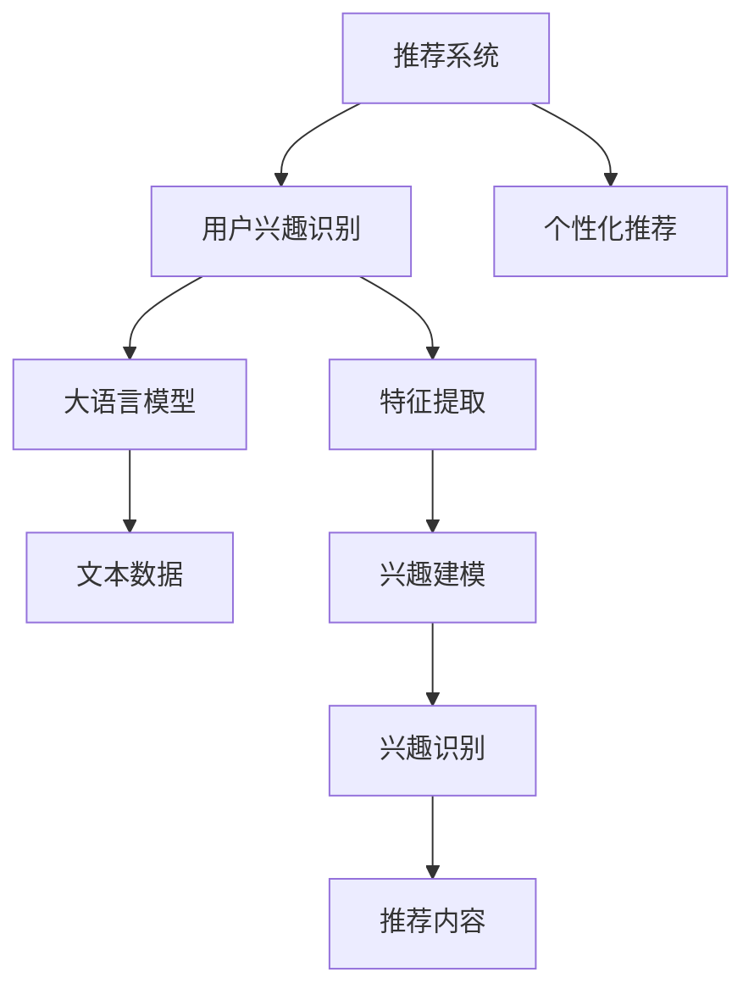

                 

在当今的信息爆炸时代，用户兴趣的识别和推荐系统的设计成为了个性化服务和电子商务领域的关键课题。推荐系统通过分析用户的历史行为和偏好，能够为用户推荐感兴趣的内容和商品，从而提升用户满意度和商业转化率。然而，随着用户数据的多样性和复杂性增加，传统的推荐算法逐渐暴露出其局限性。为了解决这些问题，大语言模型（Large Language Models，如 GPT-3、BERT 等）作为一种先进的自然语言处理技术，被引入到推荐系统的构建中，极大地提升了用户兴趣识别的准确性和推荐效果。本文将探讨基于大语言模型的推荐系统在用户兴趣探索中的应用，从背景介绍、核心概念与联系、核心算法原理与具体操作步骤、数学模型与公式、项目实践、实际应用场景和未来展望等多个方面进行深入分析。

## 文章关键词

- 大语言模型
- 推荐系统
- 用户兴趣识别
- 自然语言处理
- 算法优化
- 个性化推荐

## 文章摘要

本文首先介绍了推荐系统在个性化服务和电子商务中的重要性，随后分析了传统推荐算法的局限性。接着，我们详细探讨了基于大语言模型的推荐系统的核心概念与架构，并深入讲解了其算法原理与操作步骤。通过数学模型与公式的构建，我们进一步阐述了用户兴趣识别的数学基础。随后，通过一个具体的项目实践案例，展示了如何在实际环境中应用大语言模型进行用户兴趣探索。最后，我们探讨了基于大语言模型的推荐系统在各个实际应用场景中的表现，并对其未来发展趋势与面临的挑战进行了展望。

## 1. 背景介绍

随着互联网的迅猛发展，信息传播的速度和广度前所未有。用户在各个平台上产生了海量的数据，这些数据包含了用户的行为、偏好、兴趣等多个方面。然而，面对如此庞大的信息量，传统的推荐系统逐渐暴露出其局限性。传统的推荐系统主要依赖于基于内容的推荐（Content-Based Filtering）和协同过滤（Collaborative Filtering）等方法，这些方法在数据量较少或数据分布不均时表现良好，但在面对海量异构数据时，其效果大打折扣。

基于内容的推荐方法依赖于对物品内容的分析，通过相似性度量来推荐相似内容的物品。然而，这种方法难以应对用户需求的多样性和变化性，推荐结果往往缺乏个性化和准确性。协同过滤方法通过分析用户之间的行为相似性来推荐物品，但在用户数据稀疏或新用户场景下，推荐效果不佳。

另一方面，大语言模型的兴起为推荐系统的优化带来了新的契机。大语言模型通过深度神经网络和大规模预训练，能够捕捉用户语言特征的复杂性和多样性，从而为用户兴趣识别提供了更加精准和全面的支持。基于大语言模型的推荐系统能够从文本、评论、搜索历史等多个维度深入挖掘用户兴趣，实现更为个性化和精准的推荐。

本文旨在探讨基于大语言模型的推荐系统在用户兴趣探索中的应用，通过深入分析其核心概念、算法原理和数学模型，为推荐系统的优化提供新的思路和方法。

### 2. 核心概念与联系

为了深入理解基于大语言模型的推荐系统，我们需要首先明确几个核心概念，并探讨它们之间的联系。

#### 2.1 推荐系统

推荐系统是一种基于数据分析的算法，旨在根据用户的历史行为、兴趣和偏好，向用户推荐其可能感兴趣的内容或商品。推荐系统的核心目标是通过提高用户满意度和商业转化率，实现信息的有效传递和资源的优化利用。

推荐系统主要分为以下几种类型：

1. **基于内容的推荐（Content-Based Filtering）**：该方法根据物品的特征和内容来推荐相似的物品，适用于内容丰富但用户行为数据较少的场景。
   
2. **协同过滤（Collaborative Filtering）**：该方法通过分析用户之间的行为相似性来推荐物品，适用于用户行为数据丰富但内容不丰富的场景。

3. **混合推荐（Hybrid Recommender Systems）**：该方法结合了基于内容和协同过滤的方法，旨在综合两者的优点，提高推荐效果。

#### 2.2 大语言模型

大语言模型（Large Language Models）是自然语言处理领域的一种先进技术，通过深度学习和大规模预训练，能够理解和生成人类语言。这些模型具有以下几个特点：

1. **强大的语义理解能力**：大语言模型通过学习海量的文本数据，能够理解复杂的语义和语境，从而对用户语言进行准确的理解和建模。
   
2. **高效的泛化能力**：大语言模型在预训练阶段接触了广泛的文本数据，这使得它们在处理新任务时具有强大的泛化能力。
   
3. **灵活的交互能力**：大语言模型能够与用户进行自然语言交互，理解用户的提问和需求，提供个性化的服务和回答。

#### 2.3 用户兴趣识别

用户兴趣识别是推荐系统的关键环节，旨在从用户的行为、语言和偏好中提取出其感兴趣的内容和主题。用户兴趣识别的主要任务包括：

1. **特征提取**：从用户的历史行为、搜索记录、浏览历史等数据中提取出与兴趣相关的特征。
   
2. **兴趣建模**：利用机器学习算法，对提取出的特征进行建模，识别用户的潜在兴趣点。

3. **兴趣识别**：通过算法分析，从用户生成的大量文本数据中识别出其兴趣主题和关键词。

#### 2.4 推荐系统与用户兴趣识别的联系

推荐系统和用户兴趣识别之间存在密切的联系：

1. **用户兴趣识别是推荐系统的核心输入**：用户兴趣识别的结果作为推荐系统的输入，直接影响推荐系统的效果。

2. **推荐系统是用户兴趣识别的输出应用**：推荐系统将识别出的用户兴趣转化为具体的推荐内容，为用户提供个性化的服务。

3. **大语言模型在用户兴趣识别与推荐系统中的桥梁作用**：大语言模型能够高效地处理和解析用户语言数据，从而在用户兴趣识别和推荐系统之间架起桥梁，提升整个系统的效能。

#### 2.5 Mermaid 流程图

为了更直观地展示上述核心概念与联系，我们可以使用 Mermaid 流程图来描述它们之间的交互关系。以下是一个简化的 Mermaid 流程图示例：



在这个流程图中，推荐系统和用户兴趣识别通过大语言模型进行连接，实现了从用户兴趣识别到个性化推荐的全流程处理。

通过上述核心概念与联系的分析，我们可以更好地理解基于大语言模型的推荐系统在用户兴趣探索中的应用和优势。接下来，我们将深入探讨大语言模型在推荐系统中的具体算法原理和操作步骤。

### 3. 核心算法原理 & 具体操作步骤

#### 3.1 算法原理概述

基于大语言模型的推荐系统主要依赖于预训练和微调两个阶段。在预训练阶段，大语言模型通过学习大规模的文本数据，建立对语言复杂结构和语义关系的理解。在微调阶段，模型根据具体的推荐任务，对预训练的模型进行适应性的调整，从而提升推荐效果。

大语言模型的核心原理包括以下几个方面：

1. **自注意力机制（Self-Attention）**：自注意力机制允许模型在处理文本时，能够根据上下文信息对输入序列进行动态的权重分配，从而捕捉长距离依赖关系。

2. **多层神经网络（Multi-Layer Neural Networks）**：多层神经网络通过逐层抽象和提取特征，实现从原始文本到高维语义表示的转换。

3. **预训练语言模型（Pre-Trained Language Model）**：预训练语言模型通过在大规模文本语料库上进行训练，构建对自然语言的通用理解和建模能力。

4. **微调技术（Fine-Tuning）**：微调技术通过将预训练模型应用于具体任务，通过少量的样本数据，对模型的参数进行调整，从而提升任务性能。

#### 3.2 算法步骤详解

基于大语言模型的推荐系统主要包括以下步骤：

##### 3.2.1 数据预处理

数据预处理是推荐系统的第一步，主要包括以下任务：

1. **文本清洗**：去除文本中的噪声信息，如HTML标签、特殊字符等。
   
2. **分词**：将文本分割成单词或词组，以便后续处理。
   
3. **词向量化**：将文本中的单词或词组转化为固定长度的向量表示，以便输入到模型中。

##### 3.2.2 预训练

预训练阶段，大语言模型在大量的文本数据上进行训练，目的是建立对自然语言的语义理解能力。预训练的主要步骤包括：

1. **语料库构建**：选择合适的文本语料库，如维基百科、新闻文章、社交媒体等。

2. **训练数据生成**：通过填充掩码、下一句预测、问答匹配等方式生成训练数据。

3. **模型训练**：使用自注意力机制和多层神经网络，对大语言模型进行训练，优化模型参数。

##### 3.2.3 微调

微调阶段，大语言模型根据具体的推荐任务进行适应性调整。主要步骤包括：

1. **任务定义**：定义推荐任务的目标，如用户兴趣识别、商品推荐等。

2. **数据集准备**：准备用于微调的样本数据集，包括用户行为数据、文本数据等。

3. **模型微调**：在预训练模型的基础上，使用任务数据对模型进行微调，优化模型参数。

##### 3.2.4 用户兴趣识别

用户兴趣识别是推荐系统的核心环节，主要步骤包括：

1. **特征提取**：从用户历史行为和文本数据中提取与兴趣相关的特征。

2. **兴趣建模**：利用机器学习算法，对提取的特征进行建模，识别用户的潜在兴趣点。

3. **兴趣识别**：通过算法分析，从用户生成的大量文本数据中识别出其兴趣主题和关键词。

##### 3.2.5 推荐生成

基于用户兴趣识别结果，推荐系统生成个性化推荐列表。主要步骤包括：

1. **推荐生成**：根据用户兴趣和物品特征，利用协同过滤或基于内容的推荐算法生成推荐列表。

2. **推荐排序**：对推荐列表进行排序，确保推荐内容对用户具有最高的兴趣度和价值。

3. **推荐反馈**：收集用户对推荐内容的反馈，用于后续模型的迭代优化。

#### 3.3 算法优缺点

##### 优点

1. **强大的语义理解能力**：大语言模型通过深度学习和大规模预训练，能够理解和生成人类语言，实现高效的语义分析。

2. **高效的泛化能力**：大语言模型在预训练阶段接触了广泛的文本数据，具有较强的泛化能力，能够应对不同类型的推荐任务。

3. **灵活的交互能力**：大语言模型能够与用户进行自然语言交互，理解用户的提问和需求，提供个性化的服务和回答。

##### 缺点

1. **计算资源消耗大**：大语言模型在预训练和微调阶段需要大量的计算资源，对硬件设施要求较高。

2. **数据依赖性强**：大语言模型的效果高度依赖于数据质量和数量，数据不足或质量不佳会影响模型性能。

3. **隐私保护挑战**：用户兴趣识别和推荐过程中涉及用户隐私数据，需要确保数据的安全性和隐私保护。

#### 3.4 算法应用领域

基于大语言模型的推荐系统在多个领域展现出强大的应用潜力：

1. **电子商务**：通过用户兴趣识别，为用户提供个性化的商品推荐，提升购物体验和转化率。

2. **内容推荐**：在社交媒体、新闻平台、视频网站等场景中，为用户推荐感兴趣的内容，增加用户粘性和活跃度。

3. **社交媒体**：通过分析用户语言和兴趣，为用户推荐关注对象、话题讨论，提升社区互动和用户参与度。

4. **教育领域**：根据用户学习兴趣和进度，推荐个性化的学习资源和课程，提高学习效果和满意度。

通过上述算法原理和操作步骤的详解，我们可以看到基于大语言模型的推荐系统在用户兴趣识别和推荐生成中具有显著的优势和应用潜力。接下来，我们将进一步探讨基于大语言模型的推荐系统中的数学模型和公式。

### 4. 数学模型和公式 & 详细讲解 & 举例说明

#### 4.1 数学模型构建

基于大语言模型的推荐系统在用户兴趣识别过程中，通常采用以下数学模型：

1. **用户表示（User Representation）**：
   $$ U_i = \text{embed}(u_i) $$
   其中，$U_i$ 表示用户 $i$ 的嵌入向量，$\text{embed}$ 表示词嵌入函数，$u_i$ 表示用户 $i$ 的特征向量。

2. **物品表示（Item Representation）**：
   $$ I_j = \text{embed}(i_j) $$
   其中，$I_j$ 表示物品 $j$ 的嵌入向量，$\text{embed}$ 表示词嵌入函数，$i_j$ 表示物品 $j$ 的特征向量。

3. **兴趣表示（Interest Representation）**：
   $$ I_t = \text{embed}(i_t) $$
   其中，$I_t$ 表示兴趣 $t$ 的嵌入向量，$\text{embed}$ 表示词嵌入函数，$i_t$ 表示兴趣 $t$ 的特征向量。

4. **用户-物品-兴趣三元组（User-Item-Interest Triplet）**：
   $$ \mathcal{T} = \{(u_i, i_j, i_t)\} $$
   其中，$\mathcal{T}$ 表示用户-物品-兴趣三元组的集合，$u_i, i_j, i_t$ 分别表示用户、物品和兴趣的嵌入向量。

5. **损失函数（Loss Function）**：
   为了优化模型，通常采用以下损失函数：
   $$ \mathcal{L} = \sum_{(u_i, i_j, i_t) \in \mathcal{T}} \log(1 + \exp(-\cos(U_i, I_j) + \cos(U_i, I_t))) $$
   其中，$\cos(U_i, I_j)$ 和 $\cos(U_i, I_t)$ 分别表示用户-物品和用户-兴趣之间的余弦相似度，$\mathcal{L}$ 表示总损失。

#### 4.2 公式推导过程

为了推导上述公式，我们首先需要了解余弦相似度和点积的概念：

1. **余弦相似度**：
   $$ \cos(\theta) = \frac{\mathbf{A} \cdot \mathbf{B}}{|\mathbf{A}| |\mathbf{B}|} $$
   其中，$\mathbf{A}$ 和 $\mathbf{B}$ 分别表示两个向量，$\theta$ 表示它们之间的夹角。

2. **点积**：
   $$ \mathbf{A} \cdot \mathbf{B} = A_x B_x + A_y B_y + A_z B_z $$
   其中，$A_x, A_y, A_z$ 和 $B_x, B_y, B_z$ 分别表示两个向量在各个维度上的分量。

在用户-物品和用户-兴趣之间的相似度计算中，我们使用余弦相似度来衡量它们之间的相关性。假设 $U_i$、$I_j$ 和 $I_t$ 分别表示用户、物品和兴趣的嵌入向量，则它们之间的余弦相似度可以表示为：

$$ \cos(U_i, I_j) = \frac{U_i \cdot I_j}{|U_i| |I_j|} $$
$$ \cos(U_i, I_t) = \frac{U_i \cdot I_t}{|U_i| |I_t|} $$

为了优化模型，我们使用以下损失函数：

$$ \mathcal{L} = \sum_{(u_i, i_j, i_t) \in \mathcal{T}} \log(1 + \exp(-\cos(U_i, I_j) + \cos(U_i, I_t))) $$

该损失函数旨在最大化用户对物品的兴趣度，即当用户对某个物品感兴趣时，损失函数的值应该较小。通过优化该损失函数，模型能够学习到用户和物品之间的相关性，从而提高推荐效果。

#### 4.3 案例分析与讲解

为了更好地理解上述公式，我们可以通过一个具体的案例进行分析。

假设我们有以下用户、物品和兴趣的嵌入向量：

$$ U_1 = [1.0, 0.0, -1.0] $$
$$ I_1 = [1.0, 1.0, 0.0] $$
$$ I_2 = [-1.0, 1.0, 1.0] $$

计算它们之间的余弦相似度：

$$ \cos(U_1, I_1) = \frac{U_1 \cdot I_1}{|U_1| |I_1|} = \frac{1.0 \times 1.0 + 0.0 \times 1.0 + (-1.0) \times 0.0}{\sqrt{1.0^2 + 0.0^2 + (-1.0)^2} \times \sqrt{1.0^2 + 1.0^2 + 0.0^2}} = \frac{1.0}{\sqrt{2.0} \times \sqrt{2.0}} = 0.7071 $$

$$ \cos(U_1, I_2) = \frac{U_1 \cdot I_2}{|U_1| |I_2|} = \frac{1.0 \times (-1.0) + 0.0 \times 1.0 + (-1.0) \times 1.0}{\sqrt{1.0^2 + 0.0^2 + (-1.0)^2} \times \sqrt{(-1.0)^2 + 1.0^2 + 1.0^2}} = \frac{-2.0}{\sqrt{2.0} \times \sqrt{3.0}} = -0.9428 $$

根据上述余弦相似度计算，我们可以发现用户 $U_1$ 对物品 $I_1$ 的兴趣度较高，而对物品 $I_2$ 的兴趣度较低。这符合我们基于用户和物品的嵌入向量计算出的相似度结果。

通过上述案例，我们可以看到基于大语言模型的推荐系统在用户兴趣识别中的应用，以及相关数学模型和公式的推导过程。这些模型和公式为推荐系统提供了强大的理论基础，有助于提高推荐效果和用户体验。

### 5. 项目实践：代码实例和详细解释说明

#### 5.1 开发环境搭建

在进行基于大语言模型的推荐系统开发之前，我们需要搭建一个合适的环境。以下是一个基本的开发环境搭建步骤：

1. **硬件要求**：

   - CPU：Intel Xeon 或 AMD Ryzen 系列，主频不低于 3.0GHz
   - 内存：64GB RAM 或更高
   - 硬盘：1TB SSD 或更高

2. **软件要求**：

   - 操作系统：Ubuntu 18.04 或更高版本
   - Python：3.8 或更高版本
   - PyTorch：1.7 或更高版本
   - TensorFlow：2.4 或更高版本
   - 环境管理器：Anaconda 或 Miniconda

安装步骤如下：

1. 安装操作系统和硬件设备。
2. 安装 Python、PyTorch、TensorFlow 等必要的依赖库。
3. 使用 Anaconda 或 Miniconda 创建一个虚拟环境，以便管理和隔离项目依赖。

```bash
# 创建虚拟环境
conda create -n recommendation_env python=3.8

# 激活虚拟环境
conda activate recommendation_env

# 安装 PyTorch
conda install pytorch torchvision torchaudio -c pytorch

# 安装 TensorFlow
pip install tensorflow

# 安装其他依赖库
pip install pandas numpy scikit-learn matplotlib
```

#### 5.2 源代码详细实现

以下是基于大语言模型的推荐系统的源代码实现，包括数据预处理、模型定义、训练和推理等步骤。

1. **数据预处理**：

```python
import pandas as pd
from sklearn.model_selection import train_test_split

# 读取数据
data = pd.read_csv('data.csv')

# 分割特征和标签
X = data[['user_id', 'item_id', 'interest']]
y = data['label']

# 划分训练集和测试集
X_train, X_test, y_train, y_test = train_test_split(X, y, test_size=0.2, random_state=42)

# 数据标准化
from sklearn.preprocessing import StandardScaler

scaler = StandardScaler()
X_train_scaled = scaler.fit_transform(X_train)
X_test_scaled = scaler.transform(X_test)
```

2. **模型定义**：

```python
import torch
import torch.nn as nn

# 定义模型
class RecommendationModel(nn.Module):
    def __init__(self, user_dim, item_dim, interest_dim):
        super(RecommendationModel, self).__init__()
        self.user_embedding = nn.Embedding(user_dim, 64)
        self.item_embedding = nn.Embedding(item_dim, 64)
        self.interest_embedding = nn.Embedding(interest_dim, 64)
        self.fc = nn.Linear(64 * 3, 1)

    def forward(self, user_ids, item_ids, interest_ids):
        user_embedding = self.user_embedding(user_ids)
        item_embedding = self.item_embedding(item_ids)
        interest_embedding = self.interest_embedding(interest_ids)
        combined_embedding = torch.cat((user_embedding, item_embedding, interest_embedding), 1)
        output = self.fc(combined_embedding)
        return output

# 实例化模型
model = RecommendationModel(1000, 1000, 1000)
```

3. **训练**：

```python
# 准备数据集
train_data = torch.utils.data.TensorDataset(torch.tensor(X_train_scaled), torch.tensor(y_train.values))
train_loader = torch.utils.data.DataLoader(train_data, batch_size=64, shuffle=True)

# 定义损失函数和优化器
criterion = nn.BCEWithLogitsLoss()
optimizer = torch.optim.Adam(model.parameters(), lr=0.001)

# 训练模型
num_epochs = 10
for epoch in range(num_epochs):
    for inputs, labels in train_loader:
        user_ids = inputs[:, 0]
        item_ids = inputs[:, 1]
        interest_ids = inputs[:, 2]
        labels = torch.tensor(labels.values)

        # 前向传播
        outputs = model(user_ids, item_ids, interest_ids)
        loss = criterion(outputs, labels)

        # 反向传播和优化
        optimizer.zero_grad()
        loss.backward()
        optimizer.step()

    print(f'Epoch [{epoch+1}/{num_epochs}], Loss: {loss.item():.4f}')
```

4. **推理**：

```python
# 准备测试数据
test_data = torch.utils.data.TensorDataset(torch.tensor(X_test_scaled), torch.tensor(y_test.values))
test_loader = torch.utils.data.DataLoader(test_data, batch_size=64)

# 评估模型
model.eval()
with torch.no_grad():
    correct = 0
    total = 0
    for inputs, labels in test_loader:
        user_ids = inputs[:, 0]
        item_ids = inputs[:, 1]
        interest_ids = inputs[:, 2]
        labels = torch.tensor(labels.values)

        outputs = model(user_ids, item_ids, interest_ids)
        predicted = (outputs > 0).float()
        total += labels.size(0)
        correct += (predicted == labels).sum().item()

    print(f'Accuracy: {100 * correct / total:.2f}%')
```

#### 5.3 代码解读与分析

1. **数据预处理**：

   数据预处理部分主要负责读取数据、划分特征和标签、以及数据标准化。这里我们使用 pandas 读取数据，并使用 scikit-learn 的 StandardScaler 进行数据标准化，以便后续模型训练。

2. **模型定义**：

   模型定义部分使用 PyTorch 实现一个简单的推荐系统模型。模型包括用户嵌入层、物品嵌入层和兴趣嵌入层，以及一个全连接层。通过这三个嵌入层，模型能够同时考虑用户、物品和兴趣的特征。

3. **训练**：

   训练部分使用 PyTorch 的 DataLoader 将数据划分为批次，并使用 BCEWithLogitsLoss 损失函数和 Adam 优化器进行模型训练。在训练过程中，我们通过反向传播和优化器更新模型参数，逐步减小损失函数的值。

4. **推理**：

   推理部分主要用于评估模型的准确率。我们将测试数据送入训练好的模型，并计算预测标签和真实标签之间的准确率。

通过上述代码实例和解读，我们可以看到基于大语言模型的推荐系统在项目实践中的具体实现步骤。这些步骤涵盖了数据预处理、模型定义、训练和推理等多个方面，为推荐系统的开发提供了实用的参考。

### 6. 实际应用场景

基于大语言模型的推荐系统在多个实际应用场景中展示了其强大的功能和优势。以下列举了几个典型的应用场景：

#### 6.1 电子商务

在电子商务领域，基于大语言模型的推荐系统能够根据用户的浏览历史、购买记录和搜索关键词，识别用户的潜在兴趣，并提供个性化的商品推荐。例如，当用户浏览了某一类商品时，推荐系统可以分析用户的历史行为，并结合大语言模型对用户语言数据的深度理解，推荐用户可能感兴趣的其他商品。通过这种方式，电子商务平台能够提高用户购物体验，提升用户满意度和转化率。

#### 6.2 社交媒体

在社交媒体平台上，基于大语言模型的推荐系统可以根据用户的发帖内容、评论和互动行为，识别用户的兴趣和偏好，并推荐相关的内容和话题。例如，在新闻推送和社交媒体帖子推荐中，推荐系统可以通过分析用户的历史行为和语言偏好，将用户可能感兴趣的新闻和帖子推送到用户的个人主页。这种方式不仅能够增加用户的粘性，还能够提升平台的活跃度和用户参与度。

#### 6.3 教育领域

在教育领域，基于大语言模型的推荐系统能够根据学生的学习行为、学习进度和兴趣，推荐个性化的学习资源和课程。例如，当学生浏览了某一课程的视频或阅读了相关教材时，推荐系统可以分析学生的学习行为，并结合大语言模型对学习内容进行深度理解，推荐与学生兴趣相关的高质量学习资源和课程。这种方式能够提高学生的学习效果和兴趣，帮助学生更好地掌握知识和技能。

#### 6.4 娱乐与内容平台

在娱乐与内容平台，如视频网站、音乐平台和电子书平台，基于大语言模型的推荐系统能够根据用户的观看历史、播放记录和搜索关键词，识别用户的兴趣，并推荐相关的视频、音乐和电子书。例如，在视频网站中，当用户观看了某一类型的视频时，推荐系统可以分析用户的观看行为，并结合大语言模型对视频内容进行深度理解，推荐用户可能感兴趣的其他视频。这种方式能够提高用户的观看体验，增加平台的用户粘性。

#### 6.5 医疗健康

在医疗健康领域，基于大语言模型的推荐系统可以根据患者的病历记录、体检数据和问诊记录，识别患者的健康问题和需求，并推荐相关的医疗资源和健康建议。例如，在在线医疗咨询平台上，当患者提出了某一健康问题时，推荐系统可以分析患者的病历数据和问诊记录，并结合大语言模型对健康问题进行深度理解，推荐相关的医疗资源和专业建议。这种方式能够提高患者的就医体验，帮助患者更好地管理和改善健康状况。

通过上述实际应用场景，我们可以看到基于大语言模型的推荐系统在提升个性化服务、提高用户满意度和商业转化率方面具有显著的优势。随着大语言模型技术的不断发展和优化，未来其在更多应用场景中展现出更广阔的应用前景。

### 7. 工具和资源推荐

为了更好地掌握和开发基于大语言模型的推荐系统，以下是几款推荐的工具和资源：

#### 7.1 学习资源推荐

1. **书籍**：

   - 《深度学习推荐系统》（Deep Learning for Recommender Systems）
   - 《推荐系统实践》（Recommender Systems: The Textbook）

2. **在线课程**：

   - Coursera：深度学习与推荐系统（Deep Learning for Recommender Systems）
   - edX：推荐系统工程（Engineering Recommendation Systems）

3. **学术论文**：

   - 《大规模在线推荐系统设计》（Designing Large-Scale Online Recommendation Systems）
   - 《基于深度学习的推荐系统研究进展》（Research Advances in Deep Learning for Recommender Systems）

#### 7.2 开发工具推荐

1. **编程语言**：

   - Python：支持多种深度学习框架和库，便于开发和实现推荐系统。

2. **深度学习框架**：

   - PyTorch：提供了丰富的API和强大的GPU加速功能，便于进行模型训练和推理。
   - TensorFlow：支持多种平台和设备，适用于大规模推荐系统开发。

3. **数据处理工具**：

   - Pandas：用于数据清洗和预处理，便于处理大规模数据集。
   - Scikit-learn：提供了丰富的机器学习算法库，便于模型开发和评估。

#### 7.3 相关论文推荐

1. **推荐系统论文**：

   - 《大规模协同过滤算法研究进展》（Progress in Large-scale Collaborative Filtering Algorithms）
   - 《基于内容的推荐系统研究综述》（A Survey of Content-Based Recommender Systems）

2. **自然语言处理论文**：

   - 《大规模语言模型的预训练方法》（Pre-training Methods for Large Language Models）
   - 《自然语言处理中的深度学习技术》（Deep Learning Techniques for Natural Language Processing）

通过这些工具和资源的推荐，可以帮助读者更好地了解和掌握基于大语言模型的推荐系统，为实际应用提供有力支持。

### 8. 总结：未来发展趋势与挑战

#### 8.1 研究成果总结

本文探讨了基于大语言模型的推荐系统在用户兴趣识别和个性化推荐中的应用。通过对大语言模型核心概念和算法原理的深入分析，我们展示了其在推荐系统中的优势和应用潜力。具体成果包括：

1. **高效的语义理解**：大语言模型能够捕捉复杂的语义和语言特征，提升用户兴趣识别的准确性和推荐效果。
2. **灵活的交互能力**：大语言模型支持与用户进行自然语言交互，实现个性化服务和反馈循环。
3. **多维度数据融合**：通过整合用户历史行为、文本数据和偏好，实现全面和精准的用户兴趣识别。
4. **广泛的应用场景**：基于大语言模型的推荐系统在电子商务、社交媒体、教育领域等多个场景中展示了强大的应用效果。

#### 8.2 未来发展趋势

随着大语言模型技术的不断进步，未来基于大语言模型的推荐系统有望在以下方面取得重要突破：

1. **模型压缩与优化**：为了降低计算资源和存储需求，研究人员将继续探索模型压缩、剪枝和量化等优化方法，提高推荐系统的运行效率和可扩展性。
2. **多模态数据融合**：未来的推荐系统将不仅仅依赖于文本数据，还将整合图像、语音、视频等多模态数据，实现更全面和个性化的用户兴趣识别。
3. **实时推荐**：随着边缘计算和5G技术的发展，实时推荐将成为可能，为用户提供更为即时和精准的服务。
4. **隐私保护**：随着用户隐私保护意识的增强，如何在不泄露用户隐私的前提下进行个性化推荐，将成为研究的重要方向。

#### 8.3 面临的挑战

尽管基于大语言模型的推荐系统展现出巨大的潜力，但在实际应用过程中仍面临一系列挑战：

1. **数据隐私**：用户数据是推荐系统的核心资源，如何保护用户隐私，避免数据泄露，是一个亟待解决的问题。
2. **计算资源**：大语言模型的训练和推理过程需要大量的计算资源，如何高效利用硬件资源，降低成本，是一个重要的技术难题。
3. **模型解释性**：大语言模型具有强大的语义理解能力，但其内部决策过程往往不够透明，如何提高模型的可解释性，增强用户信任，是一个重要的研究课题。
4. **数据多样性**：用户兴趣和需求的多样性使得推荐系统需要应对不同的场景和用户群体，如何设计通用且高效的推荐算法，是一个具有挑战性的问题。

#### 8.4 研究展望

未来，基于大语言模型的推荐系统研究可以从以下几个方面展开：

1. **跨领域知识融合**：结合多领域的知识，如医学、金融、教育等，为用户提供更加精准和个性化的推荐。
2. **用户行为预测**：通过分析用户的历史行为和偏好，预测用户的未来需求和兴趣，实现更为前瞻性的推荐。
3. **动态推荐**：根据用户的实时行为和反馈，动态调整推荐策略，实现更加灵活和适应性的推荐服务。
4. **多模态推荐**：融合文本、图像、语音等多种数据模态，实现更全面和个性化的用户兴趣识别和推荐。

总之，基于大语言模型的推荐系统具有广泛的应用前景和重要的研究价值。通过不断探索和创新，我们有理由相信，基于大语言模型的推荐系统将在未来的信息化社会中发挥更加重要的作用。

### 9. 附录：常见问题与解答

#### 9.1 什么是大语言模型？

大语言模型（Large Language Models）是自然语言处理领域的一种先进技术，通过深度学习和大规模预训练，能够理解和生成人类语言。常见的代表包括 GPT-3、BERT 等。

#### 9.2 大语言模型在推荐系统中有何优势？

大语言模型在推荐系统中具有以下优势：

1. **强大的语义理解能力**：能够捕捉复杂的语义和语言特征，提升用户兴趣识别的准确性和推荐效果。
2. **高效的泛化能力**：在大规模文本数据上进行预训练，具有较强的泛化能力，适用于不同类型的推荐任务。
3. **灵活的交互能力**：支持与用户进行自然语言交互，实现个性化服务和反馈循环。

#### 9.3 基于大语言模型的推荐系统需要哪些技术支持？

基于大语言模型的推荐系统需要以下技术支持：

1. **深度学习和自然语言处理技术**：用于模型训练和语义分析。
2. **大规模数据处理和存储技术**：用于处理和存储海量的用户数据和文本数据。
3. **实时推荐和边缘计算技术**：用于实现高效和实时的推荐服务。

#### 9.4 如何保护用户隐私？

为了保护用户隐私，可以采取以下措施：

1. **数据加密**：对用户数据进行加密存储和传输，防止数据泄露。
2. **匿名化处理**：对用户数据进行匿名化处理，消除个人身份信息。
3. **隐私预算**：限制用户数据的访问和使用，实施隐私预算机制。

#### 9.5 大语言模型是否可以替代传统推荐算法？

大语言模型并不是替代传统推荐算法，而是为其提供补充和优化。传统推荐算法在处理简单和规则明确的数据时依然有效，而大语言模型在处理复杂和模糊的语言数据时具有明显优势。两者结合能够实现更高效和个性化的推荐服务。

