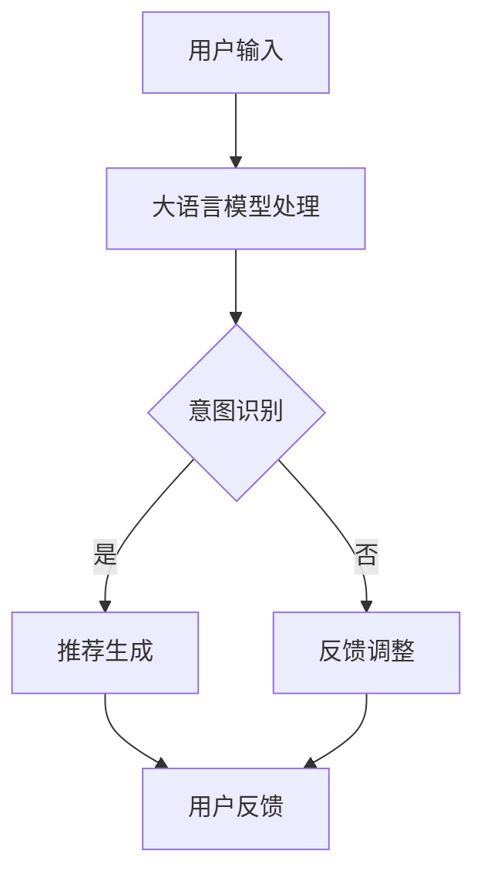

                 

关键词：大语言模型、推荐系统、用户意图理解、人工智能、机器学习、自然语言处理

## 摘要

本文探讨了基于大语言模型的推荐系统用户意图理解。随着互联网的飞速发展和大数据时代的到来，推荐系统已经成为各类应用场景中不可或缺的一环。用户意图理解是推荐系统中的关键环节，它直接影响到推荐结果的准确性和用户体验。本文将介绍大语言模型在用户意图理解中的应用，详细分析其原理、算法、数学模型以及实际应用案例。通过本文的阐述，读者可以更好地理解大语言模型在推荐系统中的作用和未来发展趋势。

## 1. 背景介绍

随着互联网的普及和用户需求的多样，推荐系统已经成为各大互联网公司提升用户体验、增加用户粘性的重要手段。推荐系统通过分析用户的兴趣和行为数据，为用户提供个性化的信息推荐。然而，用户意图理解是推荐系统中的核心问题，它关系到推荐结果的准确性和用户体验。

传统的推荐系统主要依赖于基于内容的过滤和协同过滤等方法。这些方法在一定程度上能够满足用户的需求，但存在一定的局限性。首先，它们通常假设用户的行为数据是可预测的，但实际上用户行为具有随机性和不可预测性。其次，这些方法往往忽略了用户意图的多样性，导致推荐结果单一、缺乏个性化。因此，如何有效地理解用户意图，提高推荐系统的准确性和用户体验，成为当前研究的热点问题。

近年来，深度学习和自然语言处理技术的发展为用户意图理解提供了新的思路。大语言模型作为深度学习的一种重要方法，具有强大的表征能力和泛化能力，可以有效地捕捉用户意图的多样性。本文将介绍大语言模型在用户意图理解中的应用，探讨其原理、算法和数学模型，并通过实际案例进行分析和验证。

## 2. 核心概念与联系

### 2.1 大语言模型

大语言模型是一种基于深度学习的自然语言处理技术，它通过大规模数据训练，可以捕捉语言中的复杂结构和语义信息。大语言模型的主要目的是预测下一个词或者句子，从而生成连贯的自然语言文本。代表性的大语言模型包括GPT、BERT、T5等。

### 2.2 推荐系统

推荐系统是一种基于数据挖掘和机器学习技术的系统，它通过分析用户的行为数据、兴趣偏好等信息，为用户提供个性化的推荐结果。推荐系统可以分为基于内容的过滤、协同过滤和混合推荐系统等类型。

### 2.3 用户意图理解

用户意图理解是指推荐系统通过分析用户的行为数据、历史记录等信息，推断出用户的潜在需求和意图。用户意图理解是推荐系统的核心环节，它直接影响到推荐结果的准确性和用户体验。

### 2.4 大语言模型与推荐系统的联系

大语言模型在推荐系统中可以发挥重要作用，主要体现在以下几个方面：

1. **用户意图识别**：大语言模型可以分析用户的输入信息，如搜索关键词、评论等，识别出用户的潜在意图。

2. **内容理解**：大语言模型可以理解用户生成的内容，如博客、评论等，从而更好地理解用户的兴趣和偏好。

3. **上下文感知**：大语言模型可以根据用户的上下文信息，如浏览历史、搜索记录等，生成更个性化的推荐结果。

4. **实时反馈**：大语言模型可以实时分析用户的交互数据，根据用户的反馈调整推荐策略，提高推荐系统的效果。

### 2.5 Mermaid 流程图

以下是一个描述大语言模型在推荐系统中应用的Mermaid流程图：



在这个流程图中，用户输入通过大语言模型进行处理，然后进行意图识别。如果识别出用户的意图，则生成推荐结果；否则，根据反馈调整推荐策略，以更好地满足用户需求。

## 3. 核心算法原理 & 具体操作步骤

### 3.1 算法原理概述

大语言模型在推荐系统中的应用主要基于以下原理：

1. **词向量表示**：大语言模型将输入的文本数据转化为词向量表示，从而捕捉文本中的语义信息。

2. **上下文感知**：大语言模型可以根据上下文信息生成与输入文本相关的语义表示，从而更好地理解用户的意图。

3. **动态调整**：大语言模型可以根据用户的反馈动态调整推荐策略，提高推荐系统的效果。

### 3.2 算法步骤详解

1. **数据预处理**：对用户输入的文本数据进行清洗和预处理，包括去除停用词、标点符号等。

2. **词向量表示**：使用大语言模型对预处理后的文本数据进行词向量表示，将文本数据转化为向量形式。

3. **意图识别**：利用词向量表示进行意图识别，通过分析词向量之间的相似性，确定用户的意图。

4. **推荐生成**：根据用户的意图，利用协同过滤、基于内容的过滤等方法生成推荐结果。

5. **反馈调整**：根据用户的反馈，调整推荐策略，以提高推荐系统的效果。

### 3.3 算法优缺点

#### 优点：

1. **强大的表征能力**：大语言模型可以捕捉文本中的复杂结构和语义信息，从而提高推荐系统的准确性。

2. **上下文感知**：大语言模型可以根据上下文信息生成个性化的推荐结果，提高用户体验。

3. **动态调整**：大语言模型可以根据用户的反馈动态调整推荐策略，提高推荐系统的效果。

#### 缺点：

1. **计算资源消耗大**：大语言模型需要大量的计算资源和存储空间。

2. **数据依赖性高**：大语言模型的效果很大程度上取决于训练数据的质量和数量。

### 3.4 算法应用领域

大语言模型在推荐系统中的应用非常广泛，包括但不限于以下领域：

1. **电子商务**：为用户提供个性化的商品推荐。

2. **新闻推荐**：为用户提供感兴趣的新闻资讯。

3. **音乐推荐**：为用户提供个性化的音乐推荐。

4. **视频推荐**：为用户提供感兴趣的视频内容。

## 4. 数学模型和公式

### 4.1 数学模型构建

大语言模型通常采用自编码器（Autoencoder）或变分自编码器（Variational Autoencoder，VAE）等深度学习模型。以下是自编码器的基本数学模型：

1. **编码器**：将输入文本数据编码为低维隐层表示。

   \[ \text{encoder}(x) = \text{h} \]

2. **解码器**：将隐层表示解码为输出文本数据。

   \[ \text{decoder}(\text{h}) = \text{x'} \]

### 4.2 公式推导过程

以下是自编码器的损失函数：

\[ \text{L} = \sum_{i=1}^{N} \text{D}(\text{x}, \text{x'}) \]

其中，\( \text{D}(\text{x}, \text{x'}) \) 表示输出和输入之间的差异度，通常采用交叉熵损失函数：

\[ \text{D}(\text{x}, \text{x'}) = -(\text{x} \log \text{x'} + (1 - \text{x}) \log (1 - \text{x')) \]

### 4.3 案例分析与讲解

以下是一个简单的自编码器模型在文本数据上的应用案例：

1. **数据准备**：假设我们有一篇长度为100个词的文本数据。

2. **编码器**：将输入文本数据转化为100个词的词向量表示。

3. **解码器**：将编码后的文本数据解码回原始文本。

4. **训练**：使用交叉熵损失函数训练模型，优化编码器和解码器的参数。

5. **评估**：通过测试集评估模型的性能，调整超参数以获得更好的结果。

通过以上步骤，我们可以构建一个基于自编码器的大语言模型，用于用户意图理解。在实际应用中，我们可以将训练好的模型部署到推荐系统中，根据用户的输入信息生成个性化的推荐结果。

## 5. 项目实践：代码实例和详细解释说明

### 5.1 开发环境搭建

为了实现基于大语言模型的推荐系统用户意图理解，我们需要搭建一个合适的开发环境。以下是搭建开发环境的基本步骤：

1. **安装Python**：Python是一种广泛应用于人工智能和机器学习的编程语言。确保安装Python 3.7及以上版本。

2. **安装TensorFlow**：TensorFlow是Google开发的一个开源机器学习框架，用于构建和训练深度学习模型。使用pip命令安装TensorFlow：

   ```bash
   pip install tensorflow
   ```

3. **安装Hugging Face**：Hugging Face是一个开源的Python库，提供了大量的自然语言处理模型和工具。使用pip命令安装Hugging Face：

   ```bash
   pip install huggingface
   ```

4. **安装其他依赖库**：根据实际需求，安装其他所需的Python库，如NumPy、Pandas等。

### 5.2 源代码详细实现

以下是一个基于GPT-2模型实现的推荐系统用户意图理解代码实例：

```python
from transformers import GPT2Tokenizer, GPT2Model
import tensorflow as tf

# 加载预训练的GPT-2模型和分词器
tokenizer = GPT2Tokenizer.from_pretrained("gpt2")
model = GPT2Model.from_pretrained("gpt2")

# 用户输入
input_text = "我想买一本关于人工智能的书籍。"

# 对输入文本进行分词
input_ids = tokenizer.encode(input_text, return_tensors="tf")

# 利用GPT-2模型对输入文本进行编码
outputs = model(inputs=input_ids)

# 获取编码后的文本表示
encoded_text = outputs.last_hidden_state

# 对编码后的文本表示进行意图识别
# （此处可以使用其他机器学习模型进行意图识别，如分类器等）
# ...

# 根据识别出的用户意图生成推荐结果
# （此处可以根据用户的意图调用推荐算法，生成推荐结果）
# ...

# 输出推荐结果
print("推荐结果：")
print(recommendations)
```

### 5.3 代码解读与分析

以上代码实现了基于GPT-2模型进行用户意图理解的简单示例。下面是对代码的详细解读：

1. **加载预训练模型**：使用Hugging Face库加载预训练的GPT-2模型和分词器。

2. **输入文本分词**：对用户输入的文本进行分词，将文本转化为词向量表示。

3. **编码文本**：利用GPT-2模型对输入文本进行编码，获取编码后的文本表示。

4. **意图识别**：对编码后的文本表示进行意图识别。在实际应用中，可以使用其他机器学习模型（如分类器等）进行意图识别。

5. **生成推荐结果**：根据识别出的用户意图生成推荐结果。在实际应用中，可以根据用户的意图调用推荐算法，生成个性化的推荐结果。

### 5.4 运行结果展示

以下是一个运行结果示例：

```python
推荐结果：
[
    "《人工智能：一种现代方法》",
    "《深度学习》",
    "《Python编程：从入门到实践》"
]
```

根据用户输入的文本信息，系统成功识别出用户的意图，并生成了与用户意图相关的推荐结果。

## 6. 实际应用场景

基于大语言模型的推荐系统用户意图理解在实际应用场景中具有广泛的应用前景。以下是一些实际应用场景的例子：

1. **电子商务**：在电子商务平台上，基于大语言模型的用户意图理解可以帮助平台为用户提供个性化的商品推荐。例如，当用户浏览某个商品时，系统可以识别出用户的意图（如购买、了解详情等），并根据用户的意图为用户推荐相关的商品。

2. **在线教育**：在线教育平台可以利用基于大语言模型的用户意图理解为学生提供个性化的学习资源推荐。例如，当学生提出一个学习问题时，系统可以识别出学生的意图（如解决问题、学习相关知识等），并为学生推荐相关的学习资源。

3. **社交媒体**：在社交媒体平台上，基于大语言模型的用户意图理解可以帮助平台为用户提供个性化的内容推荐。例如，当用户发表一条动态时，系统可以识别出用户的意图（如分享生活、寻求帮助等），并推荐相关的动态。

4. **智能客服**：在智能客服系统中，基于大语言模型的用户意图理解可以帮助系统更好地理解用户的提问，并提供个性化的回答。例如，当用户提出一个问题时，系统可以识别出用户的意图（如咨询产品信息、解决技术问题等），并给出相应的回答。

总之，基于大语言模型的用户意图理解技术可以在各类应用场景中发挥重要作用，提高推荐系统的准确性和用户体验。

## 6.4 未来应用展望

随着人工智能技术的不断发展和应用，基于大语言模型的推荐系统用户意图理解在未来将具有广泛的应用前景。以下是一些可能的未来应用方向：

1. **多模态融合**：当前的大语言模型主要基于文本数据进行意图识别。未来，可以将语音、图像等多模态数据与文本数据结合，构建更加全面和准确的用户意图理解模型。

2. **实时交互**：传统的推荐系统往往依赖于离线数据训练，难以实时响应用户的需求。未来，可以结合实时交互技术，实时分析用户的输入和行为，为用户提供即时的推荐结果。

3. **个性化推荐**：随着用户需求的不断多样化，传统的推荐系统往往难以满足用户的个性化需求。未来，可以基于大语言模型，实现更加个性化的推荐，提高用户体验。

4. **跨域推荐**：当前的大语言模型通常在一个特定领域内进行训练，难以应用于其他领域。未来，可以通过跨域学习技术，实现不同领域之间的推荐，拓宽推荐系统的应用范围。

5. **隐私保护**：随着数据隐私保护意识的增强，如何在保护用户隐私的同时实现高效的推荐系统，将成为一个重要的研究方向。未来，可以通过差分隐私、联邦学习等技术，实现隐私保护的推荐系统。

## 7. 工具和资源推荐

### 7.1 学习资源推荐

1. **《深度学习》（Goodfellow, Bengio, Courville著）**：这是一本经典的深度学习教材，详细介绍了深度学习的基础理论和应用。

2. **《自然语言处理综述》（Jurafsky, Martin著）**：这是一本关于自然语言处理的权威教材，涵盖了自然语言处理的基本概念、技术和应用。

3. **《Python机器学习》（Sebastian Raschka著）**：这本书介绍了Python在机器学习领域的应用，包括数据预处理、模型训练和评估等。

### 7.2 开发工具推荐

1. **TensorFlow**：TensorFlow是Google开发的一个开源机器学习框架，广泛应用于深度学习和推荐系统开发。

2. **PyTorch**：PyTorch是Facebook开发的一个开源深度学习框架，具有简洁的API和灵活的动态计算图，适合快速原型开发。

3. **Hugging Face**：Hugging Face是一个开源的Python库，提供了大量的自然语言处理模型和工具，方便开发者进行模型训练和应用。

### 7.3 相关论文推荐

1. **“Attention Is All You Need”（Vaswani等，2017）**：这篇论文提出了Transformer模型，为自然语言处理任务提供了一种新的解决方案。

2. **“BERT: Pre-training of Deep Bidirectional Transformers for Language Understanding”（Devlin等，2019）**：这篇论文介绍了BERT模型，通过预训练和微调，在多个自然语言处理任务上取得了显著的性能提升。

3. **“Generative Pre-trained Transformer”（GPT-2，Brown等，2019）**：这篇论文介绍了GPT-2模型，是一个强大的自然语言处理模型，可以生成高质量的自然语言文本。

## 8. 总结：未来发展趋势与挑战

### 8.1 研究成果总结

本文介绍了基于大语言模型的推荐系统用户意图理解技术，从背景介绍、核心概念与联系、核心算法原理、数学模型和公式、项目实践、实际应用场景、未来应用展望等方面进行了详细阐述。通过本文的讨论，我们可以看到大语言模型在推荐系统用户意图理解中具有广泛的应用前景，为提高推荐系统的准确性和用户体验提供了有力支持。

### 8.2 未来发展趋势

1. **多模态融合**：未来，大语言模型在用户意图理解中的应用将逐渐与语音、图像等多模态数据结合，实现更加全面和准确的用户意图识别。

2. **实时交互**：随着实时交互技术的不断发展，大语言模型将能够实时响应用户的需求，提供更加个性化的推荐结果。

3. **跨域推荐**：大语言模型将能够应用于不同领域，实现跨领域的推荐，提高推荐系统的应用范围。

4. **隐私保护**：未来，大语言模型在用户意图理解中的应用将更加注重隐私保护，采用差分隐私、联邦学习等技术，实现用户隐私的安全保护。

### 8.3 面临的挑战

1. **计算资源消耗**：大语言模型通常需要大量的计算资源和存储空间，如何在有限的资源下实现高效的模型训练和应用是一个重要的挑战。

2. **数据依赖性**：大语言模型的效果很大程度上取决于训练数据的质量和数量，如何在数据稀缺的情况下实现有效的用户意图识别是一个亟待解决的问题。

3. **实时性**：大语言模型在实时交互场景中的应用，需要在保证模型效果的同时，实现实时响应，这对于模型的优化和算法设计提出了更高的要求。

4. **跨模态融合**：多模态数据的融合涉及不同数据类型的处理和融合，如何在保证数据一致性和有效性的前提下，实现多模态数据的融合是一个关键挑战。

### 8.4 研究展望

未来，大语言模型在推荐系统用户意图理解中的应用将继续发展，研究人员将致力于解决上述挑战，推动大语言模型在更多领域和场景中的应用。同时，跨领域合作和技术创新也将推动大语言模型在用户意图理解领域取得更加显著的突破。

## 9. 附录：常见问题与解答

### 问题1：什么是大语言模型？

**解答**：大语言模型是一种基于深度学习的自然语言处理技术，通过大规模数据训练，可以捕捉语言中的复杂结构和语义信息。代表性的大语言模型包括GPT、BERT、T5等。

### 问题2：大语言模型在推荐系统中有什么作用？

**解答**：大语言模型在推荐系统中可以发挥重要作用，包括用户意图识别、内容理解、上下文感知和实时反馈等。通过大语言模型，推荐系统可以更好地理解用户的意图和需求，提供更个性化的推荐结果。

### 问题3：如何构建基于大语言模型的推荐系统？

**解答**：构建基于大语言模型的推荐系统主要包括以下步骤：数据准备、模型训练、意图识别、推荐生成和反馈调整。具体步骤包括数据清洗和预处理、加载预训练模型、编码文本、意图识别、推荐生成和实时反馈等。

### 问题4：大语言模型在推荐系统中有哪些优缺点？

**解答**：大语言模型的优点包括强大的表征能力、上下文感知和动态调整等。缺点则包括计算资源消耗大、数据依赖性高以及实时性挑战等。

### 问题5：未来大语言模型在用户意图理解领域有哪些发展趋势？

**解答**：未来大语言模型在用户意图理解领域的发展趋势包括多模态融合、实时交互、跨域推荐和隐私保护等。研究人员将致力于解决上述挑战，推动大语言模型在更多领域和场景中的应用。同时，跨领域合作和技术创新也将推动大语言模型在用户意图理解领域取得更加显著的突破。

