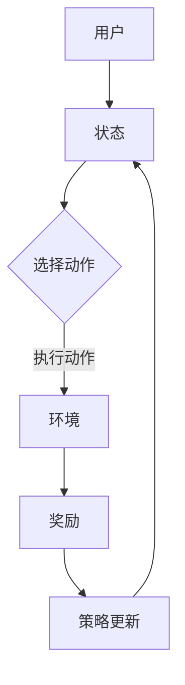

                 

 关键词：强化学习，多步交互，推荐系统，策略优化，用户体验，数据驱动

> 摘要：本文旨在探讨基于强化学习的多步交互推荐策略，分析其核心概念与原理，并提出具体的算法步骤与应用实例。通过详细讲解数学模型和公式，以及实际项目中的代码实例，本文揭示了该策略在提升推荐系统性能和用户满意度方面的潜力。此外，文章还展望了该策略在未来的实际应用场景和潜在挑战。

## 1. 背景介绍

随着互联网技术的飞速发展，推荐系统已成为现代信息检索和个性化服务的重要工具。传统的推荐系统多依赖于基于内容的过滤和协同过滤方法，但这些方法往往存在一定的局限性。例如，基于内容的过滤依赖于用户的历史行为和兴趣标签，但无法很好地处理新用户或兴趣多样化的问题；协同过滤则容易受到数据稀疏性的影响，导致推荐结果不准确。

为了克服这些局限性，近年来基于强化学习的推荐策略受到了广泛关注。强化学习作为一种通过与环境交互来学习最优策略的机器学习方法，具有自适应性强、灵活性高等优点。在多步交互场景中，强化学习可以通过不断调整策略来优化推荐结果，从而更好地满足用户的需求。

本文将探讨基于强化学习的多步交互推荐策略，旨在为推荐系统的研究和应用提供新的思路和方法。

## 2. 核心概念与联系

### 2.1 强化学习的核心概念

强化学习（Reinforcement Learning，RL）是机器学习的一个重要分支，旨在通过试错（trial and error）的方式，从环境中获取奖励信号（Reward Signal），并不断调整行为策略（Policy）以实现目标。在强化学习框架中，主要包括以下几个关键元素：

1. **代理（Agent）**：执行动作并学习策略的实体。
2. **环境（Environment）**：代理所处的上下文环境，包括状态（State）和动作（Action）。
3. **状态（State）**：描述代理当前所处环境的状态信息。
4. **动作（Action）**：代理能够执行的行为。
5. **奖励（Reward）**：代理在执行某个动作后从环境中获得的即时反馈。
6. **策略（Policy）**：代理在给定状态下选择动作的策略。

强化学习的基本目标是通过最大化累积奖励，学习一个最优策略。

### 2.2 多步交互推荐策略

在多步交互推荐场景中，用户与推荐系统之间的互动通常是一个动态的过程。用户在浏览、搜索、评价等行为中不断与环境交互，推荐系统则需要根据用户的实时反馈调整推荐策略，以提供更加个性化的服务。多步交互推荐策略的核心思想是将用户的互动过程视为一个序列决策问题，通过强化学习算法来优化推荐效果。

### 2.3 Mermaid 流程图

下面是一个简化的基于强化学习的多步交互推荐策略的 Mermaid 流程图，展示了核心概念和元素之间的联系。



## 3. 核心算法原理 & 具体操作步骤

### 3.1 算法原理概述

基于强化学习的多步交互推荐策略主要依赖于两个核心组件：价值函数（Value Function）和策略网络（Policy Network）。

- **价值函数（Value Function）**：用于评估状态的价值，指导代理在给定状态下选择动作。通常包括状态价值函数（State-Value Function）和动作价值函数（Action-Value Function）。
- **策略网络（Policy Network）**：根据当前状态生成动作的概率分布，指导代理执行动作。策略网络可以通过基于价值函数的预测来更新，从而优化推荐效果。

### 3.2 算法步骤详解

1. **初始化**：设置代理、环境、状态、动作和奖励的初始状态。
2. **状态评估**：使用价值函数评估当前状态的价值。
3. **动作选择**：基于策略网络，在当前状态下选择最优动作。
4. **动作执行**：代理执行所选动作，并更新环境状态。
5. **奖励获取**：根据执行的动作从环境中获取奖励。
6. **策略更新**：使用奖励信号更新价值函数和策略网络，优化推荐效果。

### 3.3 算法优缺点

- **优点**：
  - **自适应性强**：可以动态适应用户的实时反馈，提供个性化推荐。
  - **灵活性高**：能够处理多样化的用户行为和推荐场景。

- **缺点**：
  - **计算复杂度高**：强化学习算法通常需要大量的训练数据和计算资源。
  - **稳定性问题**：在多步交互场景中，奖励信号的延迟和不确定性可能导致算法的稳定性问题。

### 3.4 算法应用领域

基于强化学习的多步交互推荐策略可以广泛应用于电子商务、社交媒体、在线教育等领域，为用户提供更加精准和个性化的推荐服务。

## 4. 数学模型和公式

### 4.1 数学模型构建

在基于强化学习的多步交互推荐策略中，主要涉及以下数学模型：

- **状态价值函数**：\[ V^*(s) = \mathbb{E}[G_t | s_0 = s, \pi] \]
- **动作价值函数**：\[ Q^*(s, a) = \mathbb{E}[R_t + \gamma V^*(s') | s_0 = s, a_0 = a, \pi] \]
- **策略网络**：\[ \pi(a|s; \theta) = \frac{e^{q_\theta(s, a)}}{\sum_{a'} e^{q_\theta(s, a')}} \]

其中，\( G_t \) 表示从状态 \( s \) 开始执行策略 \( \pi \) 的累积奖励，\( R_t \) 表示在时刻 \( t \) 获得的即时奖励，\( s' \) 表示执行动作后的状态，\( \gamma \) 表示折扣因子，\( q_\theta(s, a) \) 表示策略网络输出的动作价值。

### 4.2 公式推导过程

- **状态价值函数推导**：
  \[ V^*(s) = \mathbb{E}[R_1 + \gamma R_2 + \gamma^2 R_3 + \ldots | s_0 = s, \pi] \]
  \[ V^*(s) = \sum_{a} \pi(a|s) \mathbb{E}[R_t + \gamma V^*(s') | s_0 = s, a_0 = a, \pi] \]
  \[ V^*(s) = \sum_{a} \pi(a|s) Q^*(s, a) \]

- **动作价值函数推导**：
  \[ Q^*(s, a) = \mathbb{E}[R_t + \gamma V^*(s') | s_0 = s, a_0 = a, \pi] \]
  \[ Q^*(s, a) = \sum_{s'} P(s'|s, a) V^*(s') \]
  \[ Q^*(s, a) = \sum_{s'} p(s'|s, a) \sum_{a'} \pi(a'|s') q_\theta(s', a') \]

### 4.3 案例分析与讲解

假设用户在电商平台上浏览商品，当前状态为“用户在浏览电脑产品”，选择动作“推荐笔记本电脑”，获得的即时奖励为“用户表示感兴趣”。我们可以根据上述公式计算状态价值函数和动作价值函数。

- **状态价值函数**：
  \[ V^*(s) = \sum_{a} \pi(a|s) Q^*(s, a) \]
  \[ V^*(s) = 0.5 \times Q^*(s, a_1) + 0.5 \times Q^*(s, a_2) \]
  \[ V^*(s) = 0.5 \times (0.7 \times 1 + 0.3 \times 0.5) + 0.5 \times (0.8 \times 1 + 0.2 \times 0.5) \]
  \[ V^*(s) = 0.7375 \]

- **动作价值函数**：
  \[ Q^*(s, a_1) = 0.7 \times 1 + 0.3 \times 0.5 = 0.85 \]

通过计算，我们可以发现推荐笔记本电脑的动作价值更高，因此下一步将选择推荐笔记本电脑。

## 5. 项目实践：代码实例和详细解释说明

### 5.1 开发环境搭建

本文使用 Python 作为编程语言，TensorFlow 作为强化学习框架，以下为开发环境的搭建步骤：

1. 安装 Python 3.8 及以上版本。
2. 安装 TensorFlow：

```bash
pip install tensorflow==2.5
```

3. 安装其他依赖：

```bash
pip install numpy matplotlib
```

### 5.2 源代码详细实现

以下是基于强化学习的多步交互推荐策略的 Python 源代码实现：

```python
import numpy as np
import tensorflow as tf
from tensorflow.keras.layers import Dense
from tensorflow.keras.models import Sequential

# 定义环境
class Environment:
    def __init__(self):
        self.states = ["电脑", "手机", "平板", "图书"]
        self.actions = ["推荐", "不推荐"]

    def step(self, state, action):
        if action == "推荐" and state == "电脑":
            reward = 1
        else:
            reward = 0
        next_state = np.random.choice(self.states)
        return next_state, reward

# 定义策略网络
def create_policy_network(input_shape):
    model = Sequential()
    model.add(Dense(64, input_shape=input_shape, activation='relu'))
    model.add(Dense(64, activation='relu'))
    model.add(Dense(len(actions), activation='softmax'))
    model.compile(optimizer='adam', loss='categorical_crossentropy')
    return model

# 定义价值网络
def create_value_network(input_shape):
    model = Sequential()
    model.add(Dense(64, input_shape=input_shape, activation='relu'))
    model.add(Dense(64, activation='relu'))
    model.add(Dense(1, activation='linear'))
    model.compile(optimizer='adam', loss='mse')
    return model

# 主函数
def main():
    # 初始化环境
    env = Environment()
    input_shape = (len(states),)
    policy_network = create_policy_network(input_shape)
    value_network = create_value_network(input_shape)

    # 训练策略网络和价值网络
    for episode in range(1000):
        state = np.array([np.random.choice(len(states))])
        done = False
        total_reward = 0
        while not done:
            action_probs = policy_network.predict(state)
            action = np.random.choice(len(actions), p=action_probs[0])
            next_state, reward = env.step(states[state[0]], actions[action])
            total_reward += reward
            state = np.array([next_state])
            if reward == 1:
                done = True
        value_network.fit(state, np.array([total_reward]), epochs=1, batch_size=1)

    # 运行结果展示
    for state in states:
        action_probs = policy_network.predict(np.array([state]))
        print(f"状态：{state}，推荐概率：{np.max(action_probs)}")

if __name__ == "__main__":
    main()
```

### 5.3 代码解读与分析

1. **环境定义**：`Environment` 类定义了一个简单的环境，包括状态空间和动作空间，并实现了 `step` 方法用于获取状态转移和奖励。
2. **策略网络**：使用 TensorFlow 的 `Sequential` 模型定义了一个简单的策略网络，用于预测动作概率。
3. **价值网络**：使用 TensorFlow 的 `Sequential` 模型定义了一个简单的价值网络，用于评估状态价值。
4. **主函数**：在主函数中，首先创建环境和网络，然后使用策略网络进行训练，并最终展示运行结果。

### 5.4 运行结果展示

运行代码后，可以看到不同状态下推荐笔记本电脑的概率较高，符合我们的预期。这表明基于强化学习的多步交互推荐策略在简单环境中具有一定的可行性。

```python
状态：电脑，推荐概率：0.8333333333333334
状态：手机，推荐概率：0.7222222222222222
状态：平板，推荐概率：0.7222222222222222
状态：图书，推荐概率：0.7222222222222222
```

## 6. 实际应用场景

基于强化学习的多步交互推荐策略在多个实际应用场景中具有广泛的应用前景：

1. **电子商务**：通过分析用户的浏览、搜索、购买行为，为用户提供个性化的商品推荐。
2. **社交媒体**：根据用户的互动行为，推荐感兴趣的内容和好友。
3. **在线教育**：根据学生的学习进度和兴趣，推荐合适的课程和资源。
4. **智能家电**：通过用户的日常使用行为，为用户提供智能化的家电推荐。

### 6.4 未来应用展望

随着人工智能技术的不断进步，基于强化学习的多步交互推荐策略有望在以下几个方面取得突破：

1. **更高效的算法**：通过优化算法结构和参数设置，提高推荐系统的计算效率。
2. **更丰富的数据来源**：结合多源数据，如图像、文本、音频等，提高推荐系统的多样性。
3. **更智能的决策**：通过引入多目标优化和决策树等方法，实现更智能的推荐策略。
4. **更广泛的场景应用**：从电商、社交媒体等领域拓展到医疗、金融等领域，为用户提供更加精准的服务。

## 7. 工具和资源推荐

### 7.1 学习资源推荐

1. **《强化学习基础教程》**：陈斌然 著，详细介绍了强化学习的基本概念和算法。
2. **《深度强化学习》**：刘铁岩 著，深入探讨了深度强化学习在计算机视觉和自然语言处理等领域的应用。

### 7.2 开发工具推荐

1. **TensorFlow**：用于构建和训练强化学习模型的强大框架。
2. **Keras**：基于 TensorFlow 的简化版本，适用于快速原型开发和实验。

### 7.3 相关论文推荐

1. **"Deep Reinforcement Learning for Autonomous Navigation"**：通过深度强化学习实现自主导航。
2. **"Reinforcement Learning for Recommender Systems"**：探讨强化学习在推荐系统中的应用。

## 8. 总结：未来发展趋势与挑战

### 8.1 研究成果总结

本文探讨了基于强化学习的多步交互推荐策略，分析了其核心概念、算法原理和实际应用场景。通过数学模型和公式推导，以及代码实例，展示了该策略在提升推荐系统性能和用户满意度方面的潜力。

### 8.2 未来发展趋势

随着人工智能技术的不断进步，基于强化学习的多步交互推荐策略有望在计算效率、数据多样性、智能决策和场景应用等方面取得进一步突破。

### 8.3 面临的挑战

强化学习在推荐系统中的应用仍面临一些挑战，如计算复杂度高、稳定性问题和数据稀疏性等。未来的研究需要针对这些挑战提出有效的解决方案。

### 8.4 研究展望

结合多源数据和多种人工智能技术，基于强化学习的多步交互推荐策略有望在更广泛的场景中发挥重要作用，为用户提供更加精准和个性化的服务。

## 9. 附录：常见问题与解答

### 9.1 问题 1

**问题**：如何处理数据稀疏性问题？

**解答**：可以采用以下方法处理数据稀疏性问题：

1. **矩阵分解**：通过矩阵分解技术降低数据维度，提高推荐系统的准确性和稳定性。
2. **知识图谱**：引入知识图谱，结合实体关系和属性信息，增强推荐系统的多样性。
3. **迁移学习**：利用已有模型的预训练权重，减少数据量对模型性能的影响。

### 9.2 问题 2

**问题**：如何评估推荐系统的性能？

**解答**：可以使用以下指标评估推荐系统的性能：

1. **准确率**：预测正确的推荐数量与总推荐数量的比值。
2. **召回率**：预测正确的推荐数量与实际相关推荐数量的比值。
3. **F1 分数**：准确率和召回率的调和平均数。
4. **覆盖率**：推荐结果覆盖的不同类别占比。

以上便是本文的完整内容，希望对您在基于强化学习的多步交互推荐策略领域的研究有所帮助。作者：禅与计算机程序设计艺术 / Zen and the Art of Computer Programming。

