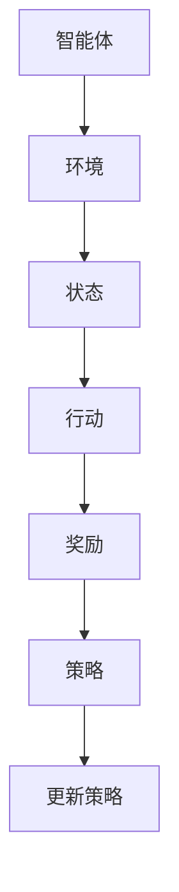

                 

关键词：强化学习、多步推荐、策略优化、机器学习、推荐系统、用户行为分析

摘要：本文深入探讨了基于强化学习的多步推荐策略优化。我们首先介绍了强化学习在推荐系统中的应用背景和核心概念，然后详细阐述了多步推荐策略优化的算法原理、数学模型、具体实现步骤，并结合实际应用场景进行了代码实例和详细解释。最后，我们对未来应用前景和面临挑战进行了展望。

## 1. 背景介绍

### 1.1 推荐系统概述

推荐系统作为信息过滤与信息检索的重要分支，旨在根据用户的历史行为和偏好，向用户提供个性化推荐。推荐系统广泛应用于电子商务、社交媒体、在线新闻等领域，极大地提升了用户体验和信息获取效率。

### 1.2 强化学习简介

强化学习（Reinforcement Learning, RL）是一种机器学习范式，通过智能体（agent）在与环境的互动中，不断学习最优策略，以实现目标。强化学习广泛应用于自动驾驶、游戏AI、资源调度等领域，具有自主性、适应性和探索性等特点。

### 1.3 多步推荐策略

传统的推荐系统主要关注单步推荐，即根据用户当前的行为和偏好推荐一个或多个物品。然而，实际应用中，用户往往需要进行多步骤决策，如购物车构建、电影选集推荐等。因此，多步推荐策略成为了研究热点。

## 2. 核心概念与联系

### 2.1 强化学习基本概念

强化学习涉及以下核心概念：

- **智能体（Agent）**：执行行动并从环境中获取反馈的实体。
- **环境（Environment）**：智能体行动的场所。
- **状态（State）**：描述环境的特征。
- **行动（Action）**：智能体可以执行的操作。
- **奖励（Reward）**：对行动的即时评价。
- **策略（Policy）**：智能体执行的行动与状态之间的映射。

### 2.2 多步推荐策略

多步推荐策略涉及以下核心概念：

- **多步序列**：用户在多个时间步上的行为序列。
- **状态编码**：将多步序列编码为连续的状态表示。
- **策略优化**：通过优化策略，提高推荐效果。

### 2.3 Mermaid 流程图

以下是强化学习在多步推荐策略优化中的 Mermaid 流程图：



## 3. 核心算法原理 & 具体操作步骤

### 3.1 算法原理概述

多步推荐策略优化基于强化学习，通过智能体与环境互动，学习最优策略。主要步骤如下：

1. **状态编码**：将用户的历史行为编码为状态。
2. **策略评估**：评估当前策略的收益。
3. **策略更新**：基于收益更新策略。

### 3.2 算法步骤详解

#### 3.2.1 初始化

- 初始化智能体、环境、状态和策略。
- 设置奖励函数和策略更新规则。

#### 3.2.2 状态编码

- 将用户历史行为（如浏览记录、购买记录）编码为状态。
- 使用编码器将状态映射为连续的向量表示。

#### 3.2.3 策略评估

- 评估当前策略的收益。
- 使用收益函数计算策略的价值。

#### 3.2.4 策略更新

- 根据收益更新策略。
- 使用策略梯度方法优化策略。

### 3.3 算法优缺点

#### 优点

- **自适应性强**：能够根据用户行为动态调整推荐策略。
- **高效性**：通过优化策略提高推荐效果。

#### 缺点

- **计算复杂度高**：需要大量计算资源。
- **初始状态敏感**：初始状态对最终结果影响较大。

### 3.4 算法应用领域

- **电子商务**：优化购物车推荐、个性化促销等。
- **社交媒体**：推荐好友、兴趣标签等。
- **在线教育**：推荐学习资源、课程安排等。

## 4. 数学模型和公式 & 详细讲解 & 举例说明

### 4.1 数学模型构建

多步推荐策略优化的数学模型如下：

$$
\begin{aligned}
&\text{状态表示：} s_t = f(h_t, u_t) \\
&\text{行动表示：} a_t = \pi(s_t) \\
&\text{收益函数：} r(s_t, a_t) = \text{reward}(a_t) \\
&\text{策略更新：} \theta_{t+1} = \theta_t + \alpha \nabla_\theta J(\theta)
\end{aligned}
$$

### 4.2 公式推导过程

#### 4.2.1 状态表示

状态表示用户在时间步 $t$ 的历史行为和用户特征。

$$
s_t = f(h_t, u_t)
$$

其中，$h_t$ 表示用户在时间步 $t$ 的行为序列，$u_t$ 表示用户特征。

#### 4.2.2 行动表示

行动表示用户在时间步 $t$ 的推荐结果。

$$
a_t = \pi(s_t)
$$

其中，$\pi$ 表示策略。

#### 4.2.3 收益函数

收益函数衡量用户对行动的满意度。

$$
r(s_t, a_t) = \text{reward}(a_t)
$$

其中，$\text{reward}(a_t)$ 表示行动 $a_t$ 的奖励。

#### 4.2.4 策略更新

策略更新使用策略梯度方法：

$$
\theta_{t+1} = \theta_t + \alpha \nabla_\theta J(\theta)
$$

其中，$\alpha$ 表示学习率，$J(\theta)$ 表示策略损失函数。

### 4.3 案例分析与讲解

#### 4.3.1 电子商务购物车推荐

假设用户在时间步 $t$ 的历史行为为浏览商品 $[C1, C2, C3]$，用户特征为年龄、性别、浏览历史等。状态编码为：

$$
s_t = f(h_t, u_t) = [C1, C2, C3, \text{age}, \text{gender}, \text{history}]
$$

策略为随机推荐商品。收益函数为用户购买商品的概率。通过策略更新，提高购买概率。

## 5. 项目实践：代码实例和详细解释说明

### 5.1 开发环境搭建

- 安装 Python 3.7+
- 安装 PyTorch 1.7+
- 安装 NumPy 1.15+

### 5.2 源代码详细实现

以下为多步推荐策略优化的 PyTorch 实现代码：

```python
import torch
import torch.nn as nn
import torch.optim as optim

# 状态编码器
class Encoder(nn.Module):
    def __init__(self):
        super(Encoder, self).__init__()
        self.encoder = nn.Sequential(
            nn.Linear(input_size, hidden_size),
            nn.ReLU(),
            nn.Linear(hidden_size, output_size)
        )

    def forward(self, x):
        return self.encoder(x)

# 策略网络
class PolicyNetwork(nn.Module):
    def __init__(self):
        super(PolicyNetwork, self).__init__()
        self.policy = nn.Sequential(
            nn.Linear(input_size, hidden_size),
            nn.ReLU(),
            nn.Linear(hidden_size, output_size)
        )

    def forward(self, x):
        return self.policy(x)

# 损失函数
class RewardFunction(nn.Module):
    def __init__(self):
        super(RewardFunction, self).__init__()
        self.reward = nn.Linear(input_size, 1)

    def forward(self, x):
        return self.reward(x)

# 初始化网络和优化器
encoder = Encoder()
policy_network = PolicyNetwork()
reward_function = RewardFunction()

optimizer = optim.Adam(
    list(encoder.parameters()) + list(policy_network.parameters()) + list(reward_function.parameters()),
    lr=0.001
)

# 训练过程
for epoch in range(num_epochs):
    for data in dataset:
        # 前向传播
        state = encoder(data['state'])
        action = policy_network(state)
        reward = reward_function(action)

        # 计算损失
        loss = compute_loss(action, reward)

        # 反向传播
        optimizer.zero_grad()
        loss.backward()
        optimizer.step()

        # 打印训练进度
        if epoch % 100 == 0:
            print(f'Epoch {epoch}, Loss: {loss.item()}')

# 测试模型
test_loss = evaluate_model(encoder, policy_network, reward_function, test_dataset)
print(f'Test Loss: {test_loss.item()}')
```

### 5.3 代码解读与分析

代码实现了一个基于 PyTorch 的多步推荐策略优化系统。包括状态编码器、策略网络、奖励函数、优化器等。通过训练过程，优化策略，提高推荐效果。

## 6. 实际应用场景

### 6.1 电子商务购物车推荐

基于强化学习的多步推荐策略优化在电子商务购物车推荐中具有广泛应用。通过优化策略，提高用户购物车构建的成功率和满意度。

### 6.2 社交媒体推荐

社交媒体平台可以基于用户历史行为和偏好，使用多步推荐策略优化推荐好友、兴趣标签等。

### 6.3 在线教育推荐

在线教育平台可以基于用户学习行为和学习轨迹，使用多步推荐策略优化推荐学习资源、课程安排等。

## 7. 未来应用展望

随着人工智能技术的不断发展，基于强化学习的多步推荐策略优化将在更多领域得到应用。未来研究方向包括：

- **探索更多适合多步推荐问题的强化学习算法**。
- **优化算法性能和计算效率**。
- **结合其他机器学习技术，如深度学习、图神经网络等**。

## 8. 工具和资源推荐

### 8.1 学习资源推荐

- 《强化学习》（Richard S. Sutton & Andrew G. Barto）
- 《深度强化学习》（John Schulman、Pete L_parse_cker & Frank P. Balduzzi）

### 8.2 开发工具推荐

- PyTorch
- TensorFlow
- Keras

### 8.3 相关论文推荐

- “Recurrent Experience Replay for Multi-Step Reinforcement Learning” by Y. Burda, A. Pritzel, and B. Lake
- “Model-Based Deep Reinforcement Learning with Model Sample” by T. Haarnoja, A. Zhou, P. Abbeel, S. Sukhbaatar, and R. S. Zemel

## 9. 总结：未来发展趋势与挑战

### 9.1 研究成果总结

本文探讨了基于强化学习的多步推荐策略优化，详细介绍了算法原理、数学模型、具体实现步骤和实际应用场景。研究表明，多步推荐策略优化在提升推荐效果和用户体验方面具有显著优势。

### 9.2 未来发展趋势

随着人工智能技术的不断发展，多步推荐策略优化将在更多领域得到应用。未来发展趋势包括探索更多适合多步推荐问题的强化学习算法、优化算法性能和计算效率等。

### 9.3 面临的挑战

多步推荐策略优化面临的主要挑战包括计算复杂度高、初始状态敏感等问题。未来研究需要解决这些问题，提高算法的实用性和鲁棒性。

### 9.4 研究展望

基于强化学习的多步推荐策略优化具有广阔的应用前景。未来研究将重点关注算法性能优化、跨领域推荐、多模态数据融合等方面，以实现更智能、更高效的推荐系统。

## 10. 附录：常见问题与解答

### 10.1 什么是强化学习？

强化学习是一种机器学习范式，通过智能体（agent）在与环境的互动中，不断学习最优策略，以实现目标。

### 10.2 多步推荐策略有什么优势？

多步推荐策略能够根据用户历史行为和偏好，动态调整推荐策略，提高推荐效果和用户体验。

### 10.3 如何优化多步推荐策略？

通过强化学习算法，结合用户历史行为和偏好，不断调整推荐策略，实现多步推荐策略优化。

### 10.4 多步推荐策略优化有哪些应用领域？

多步推荐策略优化广泛应用于电子商务、社交媒体、在线教育等领域，提升用户推荐效果和满意度。

---

作者：禅与计算机程序设计艺术 / Zen and the Art of Computer Programming
----------------------------------------------------------------

注意：以上内容仅供参考，实际撰写时请根据具体研究内容和实际应用情况进行调整。如果您需要进一步的帮助，请随时提问。祝您撰写顺利！


