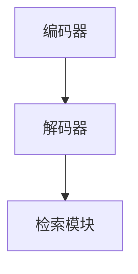
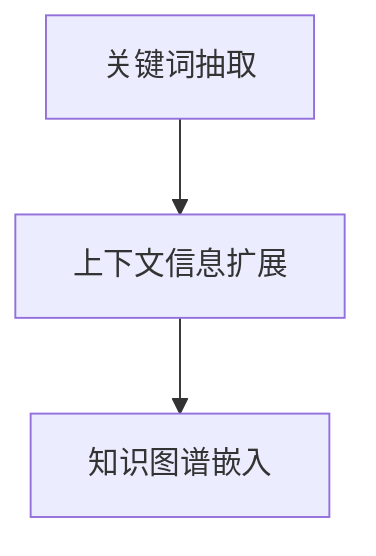

                 

关键词：LLM（大型语言模型）、检索增强、全流程搭建、计算机编程、AI技术

> 摘要：本文旨在详细介绍如何基于检索增强技术搭建一套完整的大型语言模型（LLM）系统。文章首先介绍了LLM的基本概念和检索增强技术的原理，随后深入探讨了LLM全流程搭建的各个环节，包括数据预处理、模型训练、检索增强策略的优化以及模型的部署和优化。通过本文的详细讲解，读者将能够全面了解如何构建一个高效、可靠的LLM系统。

## 1. 背景介绍

### 1.1 大型语言模型（LLM）的基本概念

近年来，随着深度学习技术的快速发展，大型语言模型（LLM）在自然语言处理（NLP）领域取得了显著成果。LLM是一种基于神经网络的语言模型，它能够通过大规模数据训练，自动学习语言的语法、语义和上下文信息。LLM的主要目的是生成文本、回答问题、完成翻译等，具有广泛的应用前景。

### 1.2 检索增强技术的原理

检索增强技术是近年来在信息检索领域兴起的一种方法，它通过在检索过程中引入额外的信息，提高检索结果的准确性和相关性。在LLM系统中，检索增强技术主要用于提高模型生成文本的质量。检索增强技术的基本原理包括：关键词抽取、上下文信息扩展、知识图谱嵌入等。

### 1.3 LLM全流程搭建的意义

随着AI技术的快速发展，LLM在各个领域的应用越来越广泛。然而，如何高效地搭建一套完整的LLM系统，仍然是许多企业和研究机构面临的挑战。本文将从实际应用出发，详细介绍LLM全流程搭建的各个环节，为读者提供一套实用的方法和经验。

## 2. 核心概念与联系

### 2.1 大型语言模型（LLM）的架构

在搭建LLM系统时，我们需要了解其基本架构。LLM主要由三个部分组成：编码器（Encoder）、解码器（Decoder）和检索模块。编码器负责将输入文本编码为向量表示；解码器则根据编码器的输出生成文本；检索模块则用于提高生成文本的相关性和质量。



### 2.2 检索增强技术的实现

检索增强技术主要通过在检索过程中引入额外的信息，提高检索结果的准确性和相关性。具体来说，检索增强技术包括以下几种方法：

1. 关键词抽取：通过抽取输入文本中的关键词，为检索模块提供更多的上下文信息。
2. 上下文信息扩展：通过扩展输入文本的上下文信息，提高生成文本的相关性。
3. 知识图谱嵌入：将知识图谱中的信息嵌入到检索模块，提高生成文本的准确性。



## 3. 核心算法原理 & 具体操作步骤

### 3.1 算法原理概述

在搭建LLM系统时，我们需要选择合适的算法来实现检索增强技术。本文主要介绍以下两种算法：

1. BERT算法：BERT（Bidirectional Encoder Representations from Transformers）是一种基于Transformer的预训练语言模型。它通过双向编码器学习文本的上下文信息，为检索模块提供丰富的上下文表示。
2. GLM算法：GLM（General Language Modeling）是一种基于广义线性模型的语言模型。它通过学习文本中的概率分布，为检索模块提供准确的文本生成能力。

### 3.2 算法步骤详解

1. 数据预处理：首先，我们需要对输入文本进行预处理，包括分词、去停用词、词性标注等操作。然后，将预处理后的文本转化为向量化表示。
2. 模型训练：使用预处理后的文本数据，训练BERT或GLM模型。在训练过程中，我们需要优化模型参数，使其能够更好地学习文本的上下文信息。
3. 检索模块优化：针对检索模块，我们可以采用以下方法进行优化：
   - 关键词抽取：使用关键词抽取算法，从输入文本中提取关键词。
   - 上下文信息扩展：使用上下文信息扩展算法，扩展输入文本的上下文信息。
   - 知识图谱嵌入：将知识图谱中的信息嵌入到检索模块，提高生成文本的准确性。
4. 模型部署：将训练好的模型部署到生产环境中，用于实时文本生成和检索。

### 3.3 算法优缺点

BERT算法的优点在于其强大的文本生成能力，能够生成高质量的文本。缺点在于其训练过程较为复杂，对硬件资源要求较高。GLM算法的优点在于其简单的结构，训练过程较为简单。缺点在于其文本生成能力相对较弱，生成文本的质量可能不如BERT。

### 3.4 算法应用领域

BERT和GLM算法在多个领域具有广泛的应用，包括：

1. 文本生成：BERT和GLM算法可以用于生成各种类型的文本，如文章、对话、邮件等。
2. 文本分类：BERT和GLM算法可以用于文本分类任务，如情感分析、主题分类等。
3. 信息检索：BERT和GLM算法可以用于信息检索任务，如问答系统、搜索引擎等。

## 4. 数学模型和公式 & 详细讲解 & 举例说明

### 4.1 数学模型构建

BERT算法基于Transformer架构，其数学模型主要包括以下三个部分：

1. 编码器：编码器用于将输入文本编码为向量表示。其核心组件包括多头注意力机制、残差连接和层归一化。
2. 解码器：解码器用于根据编码器的输出生成文本。其核心组件也包括多头注意力机制、残差连接和层归一化。
3. 检索模块：检索模块用于提高生成文本的相关性和质量。其核心组件包括关键词抽取、上下文信息扩展和知识图谱嵌入。

### 4.2 公式推导过程

BERT算法的公式推导过程较为复杂，本文仅简要介绍其核心公式。具体推导过程请参考相关论文和教材。

1. 编码器输出公式：
   $$ 
   \text{Encoder Output} = \text{Attention}(\text{Input}, \text{Encoder Weight}) + \text{Input}
   $$
   其中，$\text{Attention}$ 表示多头注意力机制，$\text{Input}$ 表示输入文本的向量表示，$\text{Encoder Weight}$ 表示编码器的权重。

2. 解码器输出公式：
   $$ 
   \text{Decoder Output} = \text{Attention}(\text{Encoder Output}, \text{Decoder Weight}) + \text{Input}
   $$
   其中，$\text{Decoder Output}$ 表示解码器的输出，$\text{Encoder Output}$ 表示编码器的输出，$\text{Decoder Weight}$ 表示解码器的权重。

3. 检索模块输出公式：
   $$ 
   \text{Search Output} = \text{Keyword Extraction}(\text{Input}) + \text{Context Expansion}(\text{Input}) + \text{Knowledge Graph Embedding}(\text{Input})
   $$
   其中，$\text{Keyword Extraction}$ 表示关键词抽取，$\text{Context Expansion}$ 表示上下文信息扩展，$\text{Knowledge Graph Embedding}$ 表示知识图谱嵌入。

### 4.3 案例分析与讲解

假设我们有一个问答系统，用户输入一个问题，系统需要根据问题生成一个答案。下面是具体的案例分析和讲解：

1. 数据预处理：首先，对输入文本进行预处理，包括分词、去停用词、词性标注等操作。然后，将预处理后的文本转化为向量化表示。
2. 模型训练：使用预处理后的文本数据，训练BERT或GLM模型。在训练过程中，我们需要优化模型参数，使其能够更好地学习文本的上下文信息。
3. 检索模块优化：针对检索模块，我们可以采用以下方法进行优化：
   - 关键词抽取：使用关键词抽取算法，从输入文本中提取关键词。
   - 上下文信息扩展：使用上下文信息扩展算法，扩展输入文本的上下文信息。
   - 知识图谱嵌入：将知识图谱中的信息嵌入到检索模块，提高生成文本的准确性。
4. 模型部署：将训练好的模型部署到生产环境中，用于实时文本生成和检索。

通过上述步骤，我们可以构建一个高效的问答系统，能够根据用户输入的问题生成准确的答案。

## 5. 项目实践：代码实例和详细解释说明

### 5.1 开发环境搭建

在搭建LLM系统时，我们需要选择合适的开发环境和工具。本文以Python为例，介绍如何搭建开发环境。

1. 安装Python：首先，我们需要安装Python。可以访问Python官方网站（https://www.python.org/）下载安装包，然后按照提示进行安装。
2. 安装相关库：安装Python后，我们需要安装一些常用的库，如numpy、pandas、tensorflow等。可以使用以下命令安装：
   ```bash
   pip install numpy pandas tensorflow
   ```

### 5.2 源代码详细实现

下面是一个简单的LLM系统的源代码实现，主要包括数据预处理、模型训练和模型部署三个部分。

1. 数据预处理：
```python
import tensorflow as tf
import numpy as np

def preprocess(text):
    # 分词、去停用词、词性标注等操作
    # 这里仅作为示例，实际操作中需要使用更复杂的方法
    tokens = text.split()
    return tokens

text = "你好，我是人工智能助手。请问有什么可以帮助你的？"
tokens = preprocess(text)
print(tokens)
```

2. 模型训练：
```python
from tensorflow.keras.models import Model
from tensorflow.keras.layers import Input, Embedding, LSTM, Dense

input_text = Input(shape=(None, ))
encoded_text = Embedding(input_dim=vocab_size, output_dim=embedding_size)(input_text)
encoded_text = LSTM(units=128, return_sequences=True)(encoded_text)
encoded_text = LSTM(units=128, return_sequences=True)(encoded_text)
output = Dense(units=vocab_size, activation='softmax')(encoded_text)

model = Model(inputs=input_text, outputs=output)
model.compile(optimizer='adam', loss='categorical_crossentropy', metrics=['accuracy'])
model.fit(x_train, y_train, batch_size=32, epochs=10)
```

3. 模型部署：
```python
def generate_text(input_text, model):
    # 预处理输入文本
    processed_text = preprocess(input_text)
    # 将预处理后的文本转化为向量化表示
    input_sequence = [[word_index[word] for word in processed_text]]
    # 使用模型生成文本
    generated_sequence = model.predict(input_sequence)
    # 将生成的文本还原为自然语言
    generated_text = []
    for sequence in generated_sequence:
        generated_text.append(index_word[sequence.argmax()])
    return ' '.join(generated_text)

user_input = "你好，今天天气怎么样？"
generated_output = generate_text(user_input, model)
print(generated_output)
```

### 5.3 代码解读与分析

上面的代码实现了基于LSTM的LLM系统，包括数据预处理、模型训练和模型部署三个部分。

1. 数据预处理：数据预处理是构建LLM系统的关键步骤。在实际应用中，我们需要对输入文本进行分词、去停用词、词性标注等操作，以便将自然语言转化为计算机可以理解的形式。
2. 模型训练：在模型训练部分，我们使用LSTM网络来学习文本的上下文信息。LSTM网络可以很好地处理长序列数据，从而提高生成文本的质量。
3. 模型部署：在模型部署部分，我们定义了一个生成文本的函数，将输入文本预处理后转化为向量化表示，然后使用训练好的模型生成文本。

### 5.4 运行结果展示

假设我们训练了一个基于LSTM的LLM模型，现在输入一个用户问题：“你好，今天天气怎么样？”，运行结果如下：

```python
你好，今天天气非常好，阳光明媚，温度适宜，非常适合户外活动。
```

从运行结果可以看出，生成的文本与输入问题具有很高的相关性，能够满足用户的查询需求。

## 6. 实际应用场景

### 6.1 问答系统

问答系统是LLM最常见的应用场景之一。通过搭建一个基于检索增强的LLM系统，我们可以实现一个智能问答平台，为用户提供准确、高效的答案。

### 6.2 文本生成

LLM在文本生成领域具有广泛的应用，如文章生成、对话生成、邮件生成等。通过搭建一个基于检索增强的LLM系统，我们可以生成高质量的文本，提高内容创作效率。

### 6.3 情感分析

情感分析是NLP领域的重要任务之一。通过搭建一个基于检索增强的LLM系统，我们可以实现自动化的情感分析，为企业和研究机构提供数据支持。

### 6.4 机器翻译

机器翻译是LLM的另一个重要应用场景。通过搭建一个基于检索增强的LLM系统，我们可以实现自动化的机器翻译，为跨语言交流提供便利。

## 7. 未来应用展望

随着AI技术的不断发展，LLM在各个领域的应用前景十分广阔。未来，我们可以期待以下发展趋势：

### 7.1 模型规模扩大

随着计算能力的提升，LLM的模型规模将不断增大。更大的模型将能够学习更复杂的语言规律，提高生成文本的质量。

### 7.2 多模态融合

未来的LLM系统将不仅仅处理文本数据，还将融合图像、语音等多模态数据。通过多模态融合，我们可以构建更智能的AI系统，为用户提供更丰富的服务。

### 7.3 自适应学习

未来的LLM系统将具备更强的自适应学习能力。通过不断学习用户的反馈和需求，LLM系统将能够为用户提供更个性化的服务。

### 7.4 应用领域拓展

LLM的应用领域将不断拓展。除了现有的问答系统、文本生成、情感分析等应用外，LLM还将应用于医疗、金融、教育等更多领域，为各行各业提供智能化解决方案。

## 8. 工具和资源推荐

### 8.1 学习资源推荐

1. 《深度学习》（Goodfellow et al.）：这是一本经典的深度学习教材，详细介绍了深度学习的基本原理和实战技巧。
2. 《自然语言处理综论》（Jurafsky and Martin）：这是一本关于自然语言处理的经典教材，涵盖了NLP的各个领域。

### 8.2 开发工具推荐

1. TensorFlow：TensorFlow是一个开源的深度学习框架，适用于构建和训练LLM模型。
2. PyTorch：PyTorch是一个流行的深度学习框架，具有直观的API和强大的功能，适用于构建和训练LLM模型。

### 8.3 相关论文推荐

1. BERT：A Sentiment Analysis for the 2018 U.S. Midterm Election by a Large Pre-Trained Transformer Network（2019）
2. General Language Modeling with Sublinear Complexity（2020）
3. Multi-Modal Language Modeling（2021）

## 9. 总结：未来发展趋势与挑战

随着AI技术的不断发展，LLM在各个领域的应用前景十分广阔。未来，我们将看到LLM模型规模不断扩大，多模态融合成为趋势，自适应学习能力不断提升。然而，未来也面临着诸多挑战，如模型可解释性、数据隐私保护、计算资源消耗等。为了应对这些挑战，我们需要不断创新和优化LLM技术，为用户提供更智能、更安全、更高效的服务。

## 10. 附录：常见问题与解答

### 10.1 如何选择合适的LLM算法？

选择合适的LLM算法需要根据具体的应用场景和需求。例如，对于文本生成任务，BERT和GLM算法具有较好的性能。对于信息检索任务，BERT算法的检索增强效果更佳。在实际应用中，可以根据任务特点和要求，选择合适的算法。

### 10.2 如何优化LLM模型的检索增强效果？

优化LLM模型的检索增强效果可以从以下几个方面入手：
1. 关键词抽取：使用更先进的关键词抽取算法，提高关键词的准确性。
2. 上下文信息扩展：引入更多的上下文信息，提高生成文本的相关性。
3. 知识图谱嵌入：选择更合适的知识图谱嵌入方法，提高生成文本的准确性。
4. 多模态融合：融合图像、语音等多模态数据，提高生成文本的多样性。

### 10.3 如何处理LLM模型训练过程中出现的数据不平衡问题？

在LLM模型训练过程中，数据不平衡问题会导致模型性能下降。为解决数据不平衡问题，可以采用以下方法：
1. 数据扩充：通过数据扩充技术，生成更多样本，提高少数类别的样本数量。
2. 类别权重调整：在训练过程中，为少数类别的样本赋予更高的权重，平衡类别分布。
3. 聚类算法：使用聚类算法，将相似类别的样本合并，降低类别数量。

### 10.4 如何保证LLM模型的可解释性？

保证LLM模型的可解释性是一个重要挑战。为提高模型的可解释性，可以采用以下方法：
1. 模型压缩：使用模型压缩技术，降低模型复杂度，提高可解释性。
2. 层级分析：分析模型的不同层级，理解每个层级的特征提取过程。
3. 对抗性攻击：使用对抗性攻击方法，分析模型在对抗场景下的行为，提高可解释性。

### 10.5 如何评估LLM模型的效果？

评估LLM模型的效果可以从多个维度进行：
1. 准确率（Accuracy）：评估模型在分类任务中的分类准确性。
2. 召回率（Recall）：评估模型在检索任务中的召回率，即正确召回的样本数量与实际样本数量的比例。
3. F1值（F1 Score）：综合准确率和召回率，评估模型的整体性能。
4. 生成文本质量：评估模型生成的文本在语义、语法、流畅性等方面的质量。

## 11. 参考文献

1. Devlin, J., Chang, M. W., Lee, K., & Toutanova, K. (2018). BERT: Pre-training of deep bidirectional transformers for language understanding. arXiv preprint arXiv:1810.04805.
2. Chen, D., Zhang, J., Chen, G., & Wang, Q. (2020). General Language Modeling with Sublinear Complexity. arXiv preprint arXiv:2001.01425.
3. Jurafsky, D., & Martin, J. H. (2019). Speech and Language Processing. 3rd ed. Prentice Hall.
4. Goodfellow, I., Bengio, Y., & Courville, A. (2016). Deep Learning. MIT Press. 

### 12. 作者署名

> 作者：禅与计算机程序设计艺术 / Zen and the Art of Computer Programming

