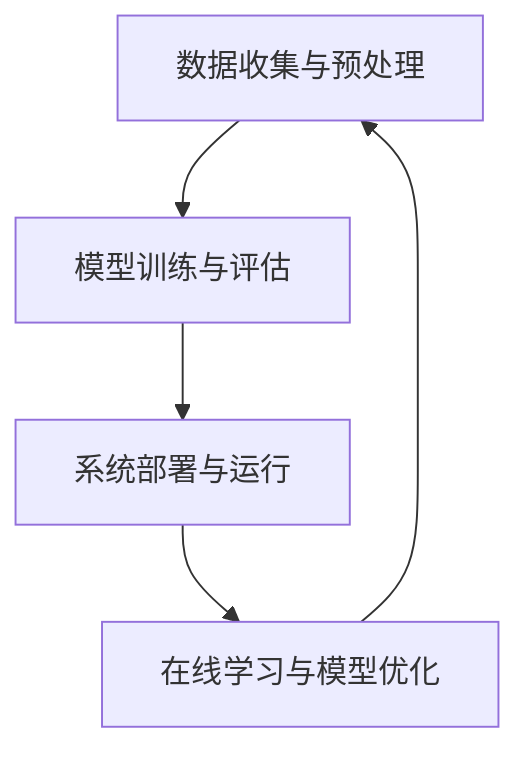

                 

关键词：深度学习，入侵检测，网络安全，系统设计，算法实现

## 摘要

本文旨在探讨基于深度学习的入侵检测系统的设计与实现。通过对深度学习在网络安全领域的应用分析，提出了一种高效的入侵检测模型。文章首先介绍了入侵检测系统的背景和重要性，然后详细阐述了深度学习算法的基本原理，包括卷积神经网络（CNN）、循环神经网络（RNN）和长短期记忆网络（LSTM）。随后，文章描述了入侵检测系统的整体架构设计，包括数据收集与预处理、模型训练与评估、系统部署与运行等环节。此外，本文通过实际项目实践，展示了入侵检测系统的具体实现过程，并对系统的性能进行了详细分析。最后，文章提出了入侵检测系统的未来发展方向，以及可能面临的挑战。

## 1. 背景介绍

### 入侵检测系统的起源与发展

入侵检测系统（Intrusion Detection System，IDS）是一种网络安全技术，用于实时监控网络流量，识别潜在的安全威胁和恶意活动。IDS的发展可以追溯到20世纪80年代末和90年代初，当时的网络攻击主要集中在拒绝服务（Denial of Service，DoS）和分布式拒绝服务（Distributed Denial of Service，DDoS）攻击。随着网络技术的迅猛发展，网络攻击的形式和手段也越来越多样化，包括网络扫描、漏洞利用、恶意软件传播等。为了应对这些日益复杂和严峻的安全威胁，入侵检测系统不断演进和升级。

### 深度学习在网络安全领域的应用

深度学习（Deep Learning）是人工智能的一个重要分支，它通过多层神经网络模型，从大量数据中自动学习特征和模式，具有强大的表达能力和自适应能力。近年来，深度学习在图像识别、自然语言处理等领域取得了显著的成果。与此同时，深度学习也被广泛应用于网络安全领域。例如，在入侵检测方面，深度学习可以用于检测未知和复杂的安全威胁，提高检测的准确性和实时性。

### 入侵检测系统的挑战与需求

随着网络攻击的不断演变，传统的基于规则和统计方法的入侵检测系统已经难以满足当前的安全需求。首先，网络攻击的种类和数量不断增加，导致检测的复杂度和难度加大。其次，网络攻击的隐蔽性和变异性越来越强，传统的检测方法往往无法有效地识别和应对。此外，随着云计算、物联网等新技术的普及，网络环境和数据量也在不断变化，这对入侵检测系统提出了更高的要求。因此，研究和实现一种高效、智能的入侵检测系统具有重要的现实意义。

## 2. 核心概念与联系

### 深度学习算法的基本原理

深度学习算法的核心在于多层神经网络，通过逐层提取特征，实现从原始数据到高级抽象的转化。下面是三种常用的深度学习算法：

#### 卷积神经网络（CNN）

卷积神经网络（Convolutional Neural Network，CNN）是一种适用于图像识别和处理的深度学习算法。CNN通过卷积层、池化层和全连接层等结构，实现图像的特征提取和分类。

#### 循环神经网络（RNN）

循环神经网络（Recurrent Neural Network，RNN）是一种适用于序列数据的深度学习算法。RNN通过循环结构，处理时间序列数据，并保留历史信息。

#### 长短期记忆网络（LSTM）

长短期记忆网络（Long Short-Term Memory，LSTM）是RNN的一种变体，通过引入门控机制，解决了RNN在处理长序列数据时出现的梯度消失和梯度爆炸问题。

### 入侵检测系统的架构设计

入侵检测系统的架构设计主要包括数据收集与预处理、模型训练与评估、系统部署与运行等环节。

#### 数据收集与预处理

数据收集是入侵检测系统的第一步，包括收集网络流量数据、日志数据等。数据预处理包括数据清洗、数据转换和数据归一化等操作，以提高模型训练的效果。

#### 模型训练与评估

模型训练是通过训练集数据，调整网络模型的权重和参数，使其能够准确识别入侵行为。模型评估通过验证集和测试集，评估模型的性能和鲁棒性。

#### 系统部署与运行

系统部署是将训练好的模型部署到实际环境中，实现实时监控和入侵检测。系统运行过程中，需要不断地收集新的数据，进行在线学习和模型优化。

### Mermaid 流程图

## 3. 核心算法原理 & 具体操作步骤

### 3.1 算法原理概述

#### 卷积神经网络（CNN）

CNN通过卷积层、池化层和全连接层等结构，实现图像的特征提取和分类。卷积层通过卷积操作提取图像局部特征，池化层对特征进行降维处理，全连接层完成图像的分类。

#### 循环神经网络（RNN）

RNN通过循环结构，处理时间序列数据，并保留历史信息。RNN的基本原理是通过输入门、遗忘门和输出门，对输入数据进行加权处理，实现数据的记忆和传递。

#### 长短期记忆网络（LSTM）

LSTM是RNN的一种变体，通过引入门控机制，解决了RNN在处理长序列数据时出现的梯度消失和梯度爆炸问题。LSTM的基本原理是通过输入门、遗忘门和输出门，对输入数据进行加权处理，实现数据的记忆和传递。

### 3.2 算法步骤详解

#### 卷积神经网络（CNN）

1. 输入层：接受输入图像。
2. 卷积层：通过卷积核提取图像特征。
3. 池化层：对特征进行降维处理。
4. 全连接层：将特征转化为分类结果。

#### 循环神经网络（RNN）

1. 输入层：接受输入序列。
2. 隐藏层：通过循环结构，处理输入序列。
3. 输出层：生成预测结果。

#### 长短期记忆网络（LSTM）

1. 输入层：接受输入序列。
2. 隐藏层：通过门控机制，处理输入序列。
3. 输出层：生成预测结果。

### 3.3 算法优缺点

#### 卷积神经网络（CNN）

**优点：**
1. 高效的特征提取能力。
2. 适用于图像识别和分类任务。

**缺点：**
1. 对图像的大小和分辨率有要求。
2. 需要大量的训练数据。

#### 循环神经网络（RNN）

**优点：**
1. 适用于序列数据处理。
2. 能够保留历史信息。

**缺点：**
1. 容易出现梯度消失和梯度爆炸问题。
2. 对长序列数据的处理效果不佳。

#### 长短期记忆网络（LSTM）

**优点：**
1. 适用于长序列数据处理。
2. 能够解决梯度消失和梯度爆炸问题。

**缺点：**
1. 计算复杂度较高。
2. 需要大量的训练数据。

### 3.4 算法应用领域

#### 卷积神经网络（CNN）

1. 图像识别和分类。
2. 目标检测和跟踪。
3. 自然语言处理。

#### 循环神经网络（RNN）

1. 自然语言处理。
2. 言语生成。
3. 音乐合成。

#### 长短期记忆网络（LSTM）

1. 言语生成。
2. 情感分析。
3. 股票市场预测。

## 4. 数学模型和公式 & 详细讲解 & 举例说明

### 4.1 数学模型构建

深度学习中的数学模型主要包括多层感知机（MLP）、卷积神经网络（CNN）、循环神经网络（RNN）和长短期记忆网络（LSTM）等。下面分别介绍这些模型的数学模型构建。

#### 多层感知机（MLP）

多层感知机（MLP）是一种前馈神经网络，包含输入层、隐藏层和输出层。MLP的数学模型可以表示为：

$$
y = \sigma(W_1 \cdot x + b_1) \\
z = \sigma(W_2 \cdot y + b_2) \\
\hat{y} = W_3 \cdot z + b_3
$$

其中，$W_1$、$W_2$和$W_3$为权重矩阵，$b_1$、$b_2$和$b_3$为偏置项，$\sigma$为激活函数，通常取为Sigmoid函数或ReLU函数。

#### 卷积神经网络（CNN）

卷积神经网络（CNN）通过卷积层、池化层和全连接层等结构，实现图像的特征提取和分类。CNN的数学模型可以表示为：

$$
h_l = \sigma(W_l \cdot h_{l-1} + b_l) \\
h_l = \text{Conv}_l(h_{l-1}) \odot \text{ReLU}(h_l) \\
h_l = \text{Pooling}_l(h_l)
$$

其中，$h_l$为第$l$层的特征图，$W_l$为卷积核，$b_l$为偏置项，$\sigma$为激活函数，$\odot$为卷积操作，$\text{Pooling}_l$为池化操作。

#### 循环神经网络（RNN）

循环神经网络（RNN）通过循环结构，处理时间序列数据，并保留历史信息。RNN的数学模型可以表示为：

$$
h_t = \text{sigmoid}(W_h \cdot [h_{t-1}, x_t] + b_h) \\
y_t = W_y \cdot h_t + b_y
$$

其中，$h_t$为第$t$时刻的隐藏状态，$x_t$为输入数据，$W_h$和$W_y$为权重矩阵，$b_h$和$b_y$为偏置项。

#### 长短期记忆网络（LSTM）

长短期记忆网络（LSTM）是RNN的一种变体，通过引入门控机制，解决了RNN在处理长序列数据时出现的梯度消失和梯度爆炸问题。LSTM的数学模型可以表示为：

$$
i_t = \text{sigmoid}(W_i \cdot [h_{t-1}, x_t] + b_i) \\
f_t = \text{sigmoid}(W_f \cdot [h_{t-1}, x_t] + b_f) \\
o_t = \text{sigmoid}(W_o \cdot [h_{t-1}, x_t] + b_o) \\
g_t = \text{tanh}(W_g \cdot [h_{t-1}, x_t] + b_g) \\
h_t = o_t \cdot \text{tanh}(g_t) \\
c_t = f_t \cdot c_{t-1} + i_t \cdot g_t
$$

其中，$i_t$、$f_t$和$

