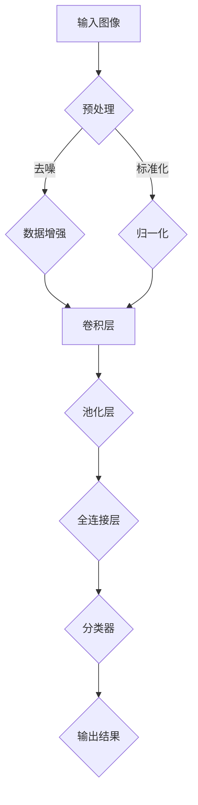

                 

关键词：深度学习、场景分类、计算机视觉、神经网络、图像识别、大数据分析

本文旨在探讨深度学习在场景分类中的应用，通过介绍核心概念、算法原理、数学模型、项目实践及未来展望，全面解析这一领域的研究现状与发展趋势。

## 1. 背景介绍

随着计算机技术和人工智能的快速发展，深度学习成为计算机视觉领域的一大突破。场景分类是计算机视觉的重要任务之一，旨在根据图像或视频内容将其分为不同的类别。传统的场景分类方法主要依赖于手工设计的特征和分类器，而深度学习则通过自动学习图像特征，大大提高了分类的准确性和效率。

场景分类的应用领域广泛，包括自动驾驶、视频监控、医疗影像分析等。然而，随着数据量的增加和场景的复杂化，传统的分类方法难以满足实际需求，深度学习场景分类的研究显得尤为重要。

## 2. 核心概念与联系

### 2.1 深度学习与场景分类

深度学习是一种基于多层神经网络的机器学习方法，通过模拟人脑神经元的连接方式，实现从大量数据中自动提取特征并构建模型。场景分类是深度学习在计算机视觉领域的重要应用，通过对输入图像或视频进行分类，实现对现实世界的理解和识别。

### 2.2 神经网络与卷积神经网络

神经网络是深度学习的基础，由大量神经元（节点）组成，每个神经元通过权重连接到其他神经元。卷积神经网络（CNN）是专门用于图像处理的神经网络，通过卷积层、池化层和全连接层等结构，有效地提取图像特征并进行分类。

### 2.3 Mermaid 流程图



## 3. 核心算法原理 & 具体操作步骤

### 3.1 算法原理概述

场景分类的核心在于特征提取和分类。深度学习通过多层神经网络结构，自动学习图像特征，并利用这些特征进行分类。主要步骤包括数据预处理、特征提取、模型训练和分类预测。

### 3.2 算法步骤详解

1. **数据预处理**：包括图像缩放、裁剪、翻转等，以提高模型的泛化能力。
2. **特征提取**：利用卷积层提取图像局部特征，通过池化层降低维度并增强特征鲁棒性。
3. **模型训练**：通过反向传播算法，利用标注数据训练模型，优化网络参数。
4. **分类预测**：输入待分类图像，通过模型输出分类结果。

### 3.3 算法优缺点

- **优点**：自动学习图像特征，提高分类准确性；适用于大量数据；可扩展性强。
- **缺点**：对计算资源要求较高；模型训练时间长；对数据质量和标注要求高。

### 3.4 算法应用领域

- **自动驾驶**：用于车辆、行人、道路等场景的识别。
- **视频监控**：实现目标检测和追踪。
- **医疗影像分析**：辅助医生诊断，如肿瘤检测、骨折诊断等。

## 4. 数学模型和公式

### 4.1 数学模型构建

场景分类的数学模型主要基于多层感知机（MLP）和卷积神经网络（CNN）。

$$
y = f(W \cdot x + b)
$$

其中，$y$ 表示输出类别，$f$ 表示激活函数，$W$ 为权重矩阵，$x$ 为输入特征，$b$ 为偏置。

### 4.2 公式推导过程

- **卷积操作**：

$$
(C_{out} \times C_{in} \times F \times P) = C_{out}
$$

其中，$C_{in}$ 为输入特征图数量，$C_{out}$ 为输出特征图数量，$F$ 为卷积核大小，$P$ 为填充大小。

- **池化操作**：

$$
P_{avg} = \frac{1}{(2^2)} \sum_{i=1}^{4} x_{i}
$$

其中，$P_{avg}$ 为平均池化结果，$x_{i}$ 为输入区域内的像素值。

### 4.3 案例分析与讲解

以自动驾驶场景分类为例，介绍卷积神经网络在场景分类中的应用。

## 5. 项目实践：代码实例和详细解释说明

### 5.1 开发环境搭建

- **硬件**：NVIDIA 显卡，CUDA 10.2 或更高版本
- **软件**：Python 3.8，TensorFlow 2.4

### 5.2 源代码详细实现

```python
import tensorflow as tf
from tensorflow.keras.models import Sequential
from tensorflow.keras.layers import Conv2D, MaxPooling2D, Flatten, Dense

# 创建模型
model = Sequential([
    Conv2D(32, (3, 3), activation='relu', input_shape=(128, 128, 3)),
    MaxPooling2D((2, 2)),
    Flatten(),
    Dense(64, activation='relu'),
    Dense(10, activation='softmax')
])

# 编译模型
model.compile(optimizer='adam', loss='categorical_crossentropy', metrics=['accuracy'])

# 训练模型
model.fit(train_images, train_labels, epochs=10, batch_size=32, validation_data=(test_images, test_labels))
```

### 5.3 代码解读与分析

- **模型构建**：使用 Sequential 模型，包含卷积层、池化层、全连接层。
- **编译模型**：选择优化器、损失函数和评估指标。
- **训练模型**：使用训练数据训练模型，并使用验证数据评估模型性能。

### 5.4 运行结果展示

```python
# 输出预测结果
predictions = model.predict(test_images)

# 打印预测结果
for i, prediction in enumerate(predictions):
    print(f"Test Image {i}: {prediction.argmax()}")

```

## 6. 实际应用场景

场景分类在自动驾驶、视频监控、医疗影像分析等领域具有广泛应用。

### 6.1 自动驾驶

自动驾驶系统需要实时识别道路上的各种场景，如车辆、行人、交通标志等，以确保行车安全。

### 6.2 视频监控

视频监控系统通过场景分类技术，实现目标检测、追踪和报警功能，提高监控效率。

### 6.3 医疗影像分析

医疗影像分类技术辅助医生进行疾病诊断，提高诊断准确率和效率。

## 7. 未来应用展望

随着深度学习技术的不断进步，场景分类在更多领域具有广泛的应用前景。

### 7.1 自动驾驶

自动驾驶系统将实现更高水平的自动驾驶，提高行车安全性和效率。

### 7.2 视频监控

视频监控系统将实现更智能的监控，提高公共安全。

### 7.3 医疗影像分析

医疗影像分类技术将辅助医生进行更精准的诊断，提高医疗服务质量。

## 8. 工具和资源推荐

### 8.1 学习资源推荐

- 《深度学习》（Goodfellow et al.）
- 《Python深度学习》（Raschka and MirJafari）

### 8.2 开发工具推荐

- TensorFlow
- PyTorch

### 8.3 相关论文推荐

- "Deep Learning for Image Recognition"
- "Convolutional Neural Networks for Visual Recognition"

## 9. 总结：未来发展趋势与挑战

场景分类在深度学习领域具有广泛的应用前景，但仍面临计算资源、数据质量和模型解释性等挑战。未来研究将继续探索更高效、更智能的分类方法，以推动计算机视觉技术的发展。

## 附录：常见问题与解答

### 9.1 为什么深度学习在场景分类中具有优势？

深度学习通过自动学习图像特征，避免了手工设计特征的问题，能够处理复杂和大规模的数据，提高分类准确性。

### 9.2 场景分类的模型如何训练？

使用大量标注数据，通过反向传播算法优化模型参数，使模型能够准确地识别不同场景。

### 9.3 如何提高场景分类的模型性能？

可以通过增加训练数据、调整模型结构和超参数等方法提高模型性能。

## 参考文献

- Goodfellow, I., Bengio, Y., & Courville, A. (2016). *Deep Learning*. MIT Press.
- Raschka, S., & MirJafari, V. (2019). *Python Deep Learning*. Packt Publishing.```

以上就是本文关于基于深度学习的场景分类研究的完整内容。希望这篇文章能够为您在这个领域的研究提供一些启发和帮助。**作者：禅与计算机程序设计艺术 / Zen and the Art of Computer Programming**。如果您有任何疑问或建议，欢迎在评论区留言讨论。**本文内容仅代表作者个人观点，不代表任何机构的意见。**```

