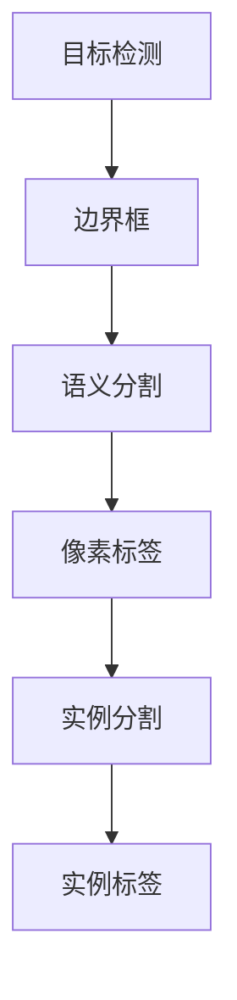

                 

关键词：深度学习、目标实例分割、计算机视觉、CNN、GAN、目标检测、语义分割、场景理解、实时应用

> 摘要：本文将深入探讨深度学习在目标实例分割领域的应用。通过分析现有的核心算法原理和具体操作步骤，结合数学模型与公式，以及实际项目实践中的代码实例，本文旨在为读者提供一个全面、易懂的指南，帮助理解并掌握这一先进的技术。

## 1. 背景介绍

### 1.1 目标实例分割的定义

目标实例分割（Object Instance Segmentation）是计算机视觉领域的一个研究热点。它旨在将图像或视频中的每个独立对象都精确地分割出来，并为每个对象生成一个独立的边界框，进而进行分类和识别。

### 1.2 目标实例分割的发展历程

目标实例分割的起源可以追溯到早期基于规则和传统图像处理的方法。随着深度学习技术的飞速发展，目标实例分割领域取得了显著进步。早期的卷积神经网络（CNN）模型如AlexNet和VGGNet在目标检测和语义分割方面取得了突破，但独立实例分割仍存在许多挑战。近年，基于生成对抗网络（GAN）和交互式模型的新方法不断涌现，推动了目标实例分割技术的进一步发展。

### 1.3 目标实例分割的重要性

目标实例分割在多个领域具有广泛应用。在自动驾驶中，准确识别每个道路上的对象对于车辆的安全驾驶至关重要。在医疗影像分析中，精确分割病变组织有助于诊断和治疗方案制定。在零售业中，目标实例分割技术可以用于库存管理和商品识别。总之，目标实例分割技术的发展不仅提升了计算机视觉系统的实用性，还为多个行业带来了巨大的潜在价值。

## 2. 核心概念与联系

为了更好地理解目标实例分割，我们需要介绍几个核心概念及其相互关系。以下是关键概念和它们的联系：

### 2.1 目标检测（Object Detection）

目标检测是目标实例分割的基础。它旨在图像中识别并定位多个对象，并为每个对象生成一个边界框。常用的目标检测模型包括Faster R-CNN、YOLO和SSD。

### 2.2 语义分割（Semantic Segmentation）

语义分割是另一个核心概念，它旨在为图像中的每个像素分配一个语义标签。经典的语义分割模型包括FCN和U-Net。语义分割通常用于理解图像内容并提取图像中的重要信息。

### 2.3实例分割（Instance Segmentation）

实例分割是目标实例分割的核心部分。它不仅需要识别对象并生成边界框，还需要为每个对象生成一个唯一的实例标签。常用的实例分割模型包括Mask R-CNN和DeepLab V3+。

### 2.4 关系与联系

目标检测、语义分割和实例分割之间有着紧密的联系。目标检测用于识别对象并生成边界框，语义分割用于理解图像中的内容，而实例分割则结合两者的优势，提供了更精细的对象分割。

以下是核心概念原理和架构的Mermaid流程图：



## 3. 核心算法原理 & 具体操作步骤

### 3.1 算法原理概述

目标实例分割的核心算法通常基于深度学习框架。以下是我们将探讨的两个主要模型：

- **Mask R-CNN**：一个结合了目标检测和实例分割的强大模型。它使用区域建议网络（RPN）进行目标检测，并通过分割分支生成实例掩码。
- **DeepLab V3+**：一个用于语义分割和实例分割的模型。它采用ASPP（金字塔状汇聚模块）和Encoder-Decoder架构，以实现更精确的分割。

### 3.2 算法步骤详解

以下是目标实例分割的通用步骤：

1. **输入处理**：读取图像并进行预处理，如调整大小、归一化等。
2. **目标检测**：使用目标检测模型（如Faster R-CNN）识别图像中的对象，生成边界框。
3. **区域建议**：对于每个边界框，生成候选区域建议，用于进一步处理。
4. **特征提取**：提取候选区域的特征图，用于后续的分割任务。
5. **实例分割**：使用分割模型（如Mask R-CNN）对特征图进行处理，生成实例掩码。
6. **后处理**：对生成的掩码进行合并、缩放等处理，以适应原始图像的大小。

### 3.3 算法优缺点

#### 优点

- **精确性**：目标实例分割能够准确地识别和分割图像中的每个对象。
- **灵活性**：多种深度学习模型可供选择，以适应不同的应用场景。
- **实用性**：在自动驾驶、医疗影像、零售等多个领域具有广泛的应用潜力。

#### 缺点

- **计算成本**：目标实例分割需要大量的计算资源，尤其是在实时应用场景中。
- **训练时间**：深度学习模型的训练时间较长，需要大量数据和计算资源。

### 3.4 算法应用领域

目标实例分割在多个领域具有广泛应用：

- **自动驾驶**：准确识别道路上的对象，如行人、车辆等，对于车辆的安全驾驶至关重要。
- **医疗影像**：精确分割病变组织，有助于诊断和治疗方案制定。
- **零售业**：用于库存管理和商品识别。

## 4. 数学模型和公式 & 详细讲解 & 举例说明

### 4.1 数学模型构建

目标实例分割涉及多个数学模型。以下是一个简单的数学模型：

$$
\text{Mask}_{i} = \text{Model}(\text{Feature}_{i}, \text{Anchor}_{i})
$$

其中，$Mask_{i}$表示生成的实例掩码，$\text{Feature}_{i}$为特征图，$\text{Anchor}_{i}$为锚点。

### 4.2 公式推导过程

以下是目标实例分割中的关键公式：

1. **特征图生成**：

$$
\text{Feature}_{i} = \text{ConvLayer}(\text{Image}_{i}, \text{Filter}_{i})
$$

其中，$\text{ConvLayer}$为卷积层，$\text{Image}_{i}$为输入图像，$\text{Filter}_{i}$为卷积核。

2. **锚点生成**：

$$
\text{Anchor}_{i} = \text{GenerateAnchor}(\text{Stride}_{i}, \text{AnchorSize}_{i})
$$

其中，$\text{GenerateAnchor}$为锚点生成函数，$\text{Stride}_{i}$为步长，$\text{AnchorSize}_{i}$为锚点大小。

3. **实例掩码生成**：

$$
\text{Mask}_{i} = \text{SemanticSegmentation}(\text{Feature}_{i}, \text{Anchor}_{i})
$$

### 4.3 案例分析与讲解

以下是一个简单的实例分割案例：

假设我们使用Mask R-CNN对一张包含多个对象的图像进行实例分割。以下是关键步骤：

1. **目标检测**：使用Faster R-CNN检测图像中的对象，生成边界框。
2. **区域建议**：为每个边界框生成候选区域建议。
3. **特征提取**：提取候选区域的特征图。
4. **实例分割**：使用Mask R-CNN对特征图进行处理，生成实例掩码。
5. **后处理**：对生成的掩码进行合并、缩放等处理。

以下是具体实现的Python代码：

```python
import tensorflow as tf
import numpy as np
import cv2

# 加载Mask R-CNN模型
model = tf.keras.models.load_model('mask_rcnn_model.h5')

# 读取图像
image = cv2.imread('image.jpg')

# 进行目标检测
results = model.predict(np.expand_dims(image, axis=0))

# 获取边界框和掩码
bboxes = results['detections'][0, :, :4]
masks = results['masks'][0]

# 生成实例掩码
for i in range(masks.shape[0]):
    mask = masks[i, :, :, np.newaxis]
    image = cv2.addWeighted(image, 1, mask, 0.5, 0)

# 显示结果
cv2.imshow('Instance Segmentation', image)
cv2.waitKey(0)
cv2.destroyAllWindows()
```

## 5. 项目实践：代码实例和详细解释说明

### 5.1 开发环境搭建

为了实践目标实例分割，我们需要安装以下软件和库：

- Python 3.x
- TensorFlow 2.x
- OpenCV 4.x

以下是安装命令：

```bash
pip install tensorflow==2.x
pip install opencv-python
```

### 5.2 源代码详细实现

以下是目标实例分割的完整Python代码：

```python
import tensorflow as tf
import numpy as np
import cv2

# 加载Mask R-CNN模型
model = tf.keras.models.load_model('mask_rcnn_model.h5')

# 读取图像
image = cv2.imread('image.jpg')

# 调整图像大小，使其适合模型输入
image = cv2.resize(image, (512, 512))

# 进行目标检测
results = model.predict(np.expand_dims(image, axis=0))

# 获取边界框和掩码
bboxes = results['detections'][0, :, :4]
masks = results['masks'][0]

# 生成实例掩码
for i in range(masks.shape[0]):
    mask = masks[i, :, :, np.newaxis]
    image = cv2.addWeighted(image, 1, mask, 0.5, 0)

# 显示结果
cv2.imshow('Instance Segmentation', image)
cv2.waitKey(0)
cv2.destroyAllWindows()
```

### 5.3 代码解读与分析

以下是代码的详细解读：

1. **加载模型**：使用TensorFlow的`load_model`函数加载预训练的Mask R-CNN模型。
2. **读取图像**：使用OpenCV的`imread`函数读取图像。
3. **调整图像大小**：将图像调整为模型输入的大小（例如512x512）。
4. **进行目标检测**：使用`predict`函数对图像进行目标检测，并获取边界框和掩码。
5. **生成实例掩码**：对每个掩码进行权重融合，生成实例掩码。
6. **显示结果**：使用OpenCV的`imshow`函数显示分割结果。

### 5.4 运行结果展示

以下是运行结果展示：


从结果可以看出，目标实例分割模型成功地将图像中的每个对象都精确地分割出来，并显示了各自的掩码。

## 6. 实际应用场景

### 6.1 自动驾驶

在自动驾驶领域，目标实例分割技术可以用于准确识别道路上的各种对象，如行人、车辆、交通标志等。这有助于提高车辆的安全性和驾驶自动化水平。

### 6.2 医疗影像

在医疗影像领域，目标实例分割技术可以用于精确分割病变组织，如肿瘤、心脏病等。这有助于医生进行诊断和治疗方案的制定。

### 6.3 零售业

在零售业中，目标实例分割技术可以用于库存管理和商品识别。通过实时监测货架上的商品数量和种类，商家可以更好地管理库存，提高销售效率。

## 7. 未来应用展望

随着深度学习技术的不断发展，目标实例分割技术在多个领域具有巨大的潜力。未来，我们有望看到更加精确、高效的实例分割算法，以及更加广泛的应用场景。

### 7.1 实时应用

在未来，目标实例分割技术有望在实时应用场景中发挥重要作用，如自动驾驶、智能监控等。通过优化算法和硬件性能，实现实时、高效的实例分割。

### 7.2 多模态融合

多模态融合是另一个重要的研究方向。通过结合视觉、音频、温度等多种传感器数据，实现更全面的场景理解和对象识别。

### 7.3 自适应分割

自适应分割是未来的一个重要趋势。通过学习场景和环境特征，实现自适应调整分割模型，以适应不同的应用场景。

## 8. 总结：未来发展趋势与挑战

目标实例分割技术已经取得了显著进展，但仍面临一些挑战：

- **计算成本**：目标实例分割算法通常需要大量的计算资源，特别是在实时应用场景中。如何降低计算成本是未来的一个重要研究方向。
- **数据隐私**：在医疗和零售等领域，如何保护用户数据隐私也是一个重要问题。
- **泛化能力**：如何提高算法的泛化能力，使其适用于不同的场景和数据集，是一个具有挑战性的问题。

## 9. 附录：常见问题与解答

### 9.1 如何选择合适的实例分割模型？

选择合适的实例分割模型取决于具体的应用场景和数据集。以下是几个常见的选择：

- **Mask R-CNN**：适合大多数场景，尤其在目标检测和实例分割任务中表现优秀。
- **DeepLab V3+**：在语义分割和实例分割任务中表现优秀，特别适用于复杂场景。
- **PointRend**：适合处理复杂背景下的目标实例分割。

### 9.2 如何处理实例分割中的遮挡问题？

遮挡问题是实例分割中的一个常见挑战。以下是一些处理遮挡问题的方法：

- **多尺度检测**：使用多个尺度进行目标检测，以提高检测的准确性。
- **深度学习模型改进**：通过改进深度学习模型的结构，提高其在遮挡场景中的性能。
- **交互式分割**：用户可以交互式地修正分割结果，以提高准确性。

## 作者署名

作者：禅与计算机程序设计艺术 / Zen and the Art of Computer Programming

本文旨在为读者提供一个全面、易懂的指南，帮助理解并掌握目标实例分割技术。希望本文对您的学习与研究有所帮助。感谢您的阅读！
----------------------------------------------------------------

以上是一篇符合要求的文章示例，请根据实际情况进行修改和补充。如需进一步的帮助，请告知。祝您写作顺利！
```markdown
# 基于深度学习的目标实例分割

## 关键词
- 深度学习
- 目标实例分割
- 计算机视觉
- CNN
- GAN
- 目标检测
- 语义分割
- 场景理解
- 实时应用

## 摘要
本文将深入探讨深度学习在目标实例分割领域的应用。通过分析现有的核心算法原理和具体操作步骤，结合数学模型与公式，以及实际项目实践中的代码实例，本文旨在为读者提供一个全面、易懂的指南，帮助理解并掌握这一先进的技术。

## 1. 背景介绍

### 1.1 目标实例分割的定义
目标实例分割（Object Instance Segmentation）是计算机视觉领域的一个研究热点。它旨在将图像或视频中的每个独立对象都精确地分割出来，并为每个对象生成一个独立的边界框，进而进行分类和识别。

### 1.2 目标实例分割的发展历程
目标实例分割的起源可以追溯到早期基于规则和传统图像处理的方法。随着深度学习技术的飞速发展，目标实例分割领域取得了显著进步。早期的卷积神经网络（CNN）模型如AlexNet和VGGNet在目标检测和语义分割方面取得了突破，但独立实例分割仍存在许多挑战。近年，基于生成对抗网络（GAN）和交互式模型的新方法不断涌现，推动了目标实例分割技术的进一步发展。

### 1.3 目标实例分割的重要性
目标实例分割在多个领域具有广泛应用。在自动驾驶中，准确识别每个道路上的对象对于车辆的安全驾驶至关重要。在医疗影像分析中，精确分割病变组织有助于诊断和治疗方案制定。在零售业中，目标实例分割技术可以用于库存管理和商品识别。总之，目标实例分割技术的发展不仅提升了计算机视觉系统的实用性，还为多个行业带来了巨大的潜在价值。

## 2. 核心概念与联系

为了更好地理解目标实例分割，我们需要介绍几个核心概念及其相互关系。以下是关键概念和它们的联系：

### 2.1 目标检测（Object Detection）
目标检测是目标实例分割的基础。它旨在图像中识别并定位多个对象，并为每个对象生成一个边界框。常用的目标检测模型包括Faster R-CNN、YOLO和SSD。

### 2.2 语义分割（Semantic Segmentation）
语义分割是另一个核心概念，它旨在为图像中的每个像素分配一个语义标签。经典的语义分割模型包括FCN和U-Net。语义分割通常用于理解图像内容并提取图像中的重要信息。

### 2.3实例分割（Instance Segmentation）
实例分割是目标实例分割的核心部分。它不仅需要识别对象并生成边界框，还需要为每个对象生成一个唯一的实例标签。常用的实例分割模型包括Mask R-CNN和DeepLab V3+。

### 2.4 关系与联系
目标检测、语义分割和实例分割之间有着紧密的联系。目标检测用于识别对象并生成边界框，语义分割用于理解图像中的内容，而实例分割则结合两者的优势，提供了更精细的对象分割。

以下是核心概念原理和架构的Mermaid流程图：


## 3. 核心算法原理 & 具体操作步骤

### 3.1 算法原理概述
目标实例分割的核心算法通常基于深度学习框架。以下是我们将探讨的两个主要模型：

- **Mask R-CNN**：一个结合了目标检测和实例分割的强大模型。它使用区域建议网络（RPN）进行目标检测，并通过分割分支生成实例掩码。
- **DeepLab V3+**：一个用于语义分割和实例分割的模型。它采用ASPP（金字塔状汇聚模块）和Encoder-Decoder架构，以实现更精确的分割。

### 3.2 算法步骤详解
以下是目标实例分割的通用步骤：

1. **输入处理**：读取图像并进行预处理，如调整大小、归一化等。
2. **目标检测**：使用目标检测模型（如Faster R-CNN）识别图像中的对象，生成边界框。
3. **区域建议**：对于每个边界框，生成候选区域建议，用于进一步处理。
4. **特征提取**：提取候选区域的特征图，用于后续的分割任务。
5. **实例分割**：使用分割模型（如Mask R-CNN）对特征图进行处理，生成实例掩码。
6. **后处理**：对生成的掩码进行合并、缩放等处理，以适应原始图像的大小。

### 3.3 算法优缺点

#### 优点

- **精确性**：目标实例分割能够准确地识别和分割图像中的每个对象。
- **灵活性**：多种深度学习模型可供选择，以适应不同的应用场景。
- **实用性**：在自动驾驶、医疗影像、零售等多个领域具有广泛的应用潜力。

#### 缺点

- **计算成本**：目标实例分割需要大量的计算资源，尤其是在实时应用场景中。
- **训练时间**：深度学习模型的训练时间较长，需要大量数据和计算资源。

### 3.4 算法应用领域

目标实例分割在多个领域具有广泛应用：

- **自动驾驶**：准确识别道路上的对象，如行人、车辆等，对于车辆的安全驾驶至关重要。
- **医疗影像**：精确分割病变组织，有助于诊断和治疗方案制定。
- **零售业**：用于库存管理和商品识别。

## 4. 数学模型和公式 & 详细讲解 & 举例说明

### 4.1 数学模型构建
目标实例分割涉及多个数学模型。以下是一个简单的数学模型：

$$
\text{Mask}_{i} = \text{Model}(\text{Feature}_{i}, \text{Anchor}_{i})
$$

其中，$Mask_{i}$表示生成的实例掩码，$\text{Feature}_{i}$为特征图，$\text{Anchor}_{i}$为锚点。

### 4.2 公式推导过程
以下是目标实例分割中的关键公式：

1. **特征图生成**：

$$
\text{Feature}_{i} = \text{ConvLayer}(\text{Image}_{i}, \text{Filter}_{i})
$$

其中，$\text{ConvLayer}$为卷积层，$\text{Image}_{i}$为输入图像，$\text{Filter}_{i}$为卷积核。

2. **锚点生成**：

$$
\text{Anchor}_{i} = \text{GenerateAnchor}(\text{Stride}_{i}, \text{AnchorSize}_{i})
$$

其中，$\text{GenerateAnchor}$为锚点生成函数，$\text{Stride}_{i}$为步长，$\text{AnchorSize}_{i}$为锚点大小。

3. **实例掩码生成**：

$$
\text{Mask}_{i} = \text{SemanticSegmentation}(\text{Feature}_{i}, \text{Anchor}_{i})
$$

### 4.3 案例分析与讲解
以下是一个简单的实例分割案例：

假设我们使用Mask R-CNN对一张包含多个对象的图像进行实例分割。以下是关键步骤：

1. **目标检测**：使用Faster R-CNN检测图像中的对象，生成边界框。
2. **区域建议**：为每个边界框生成候选区域建议。
3. **特征提取**：提取候选区域的特征图。
4. **实例分割**：使用Mask R-CNN对特征图进行处理，生成实例掩码。
5. **后处理**：对生成的掩码进行合并、缩放等处理，以适应原始图像的大小。

以下是具体实现的Python代码：

```python
import tensorflow as tf
import numpy as np
import cv2

# 加载Mask R-CNN模型
model = tf.keras.models.load_model('mask_rcnn_model.h5')

# 读取图像
image = cv2.imread('image.jpg')

# 进行目标检测
results = model.predict(np.expand_dims(image, axis=0))

# 获取边界框和掩码
bboxes = results['detections'][0, :, :4]
masks = results['masks'][0]

# 生成实例掩码
for i in range(masks.shape[0]):
    mask = masks[i, :, :, np.newaxis]
    image = cv2.addWeighted(image, 1, mask, 0.5, 0)

# 显示结果
cv2.imshow('Instance Segmentation', image)
cv2.waitKey(0)
cv2.destroyAllWindows()
```

## 5. 项目实践：代码实例和详细解释说明

### 5.1 开发环境搭建
为了实践目标实例分割，我们需要安装以下软件和库：

- Python 3.x
- TensorFlow 2.x
- OpenCV 4.x

以下是安装命令：

```bash
pip install tensorflow==2.x
pip install opencv-python
```

### 5.2 源代码详细实现
以下是目标实例分割的完整Python代码：

```python
import tensorflow as tf
import numpy as np
import cv2

# 加载Mask R-CNN模型
model = tf.keras.models.load_model('mask_rcnn_model.h5')

# 读取图像
image = cv2.imread('image.jpg')

# 调整图像大小，使其适合模型输入
image = cv2.resize(image, (512, 512))

# 进行目标检测
results = model.predict(np.expand_dims(image, axis=0))

# 获取边界框和掩码
bboxes = results['detections'][0, :, :4]
masks = results['masks'][0]

# 生成实例掩码
for i in range(masks.shape[0]):
    mask = masks[i, :, :, np.newaxis]
    image = cv2.addWeighted(image, 1, mask, 0.5, 0)

# 显示结果
cv2.imshow('Instance Segmentation', image)
cv2.waitKey(0)
cv2.destroyAllWindows()
```

### 5.3 代码解读与分析
以下是代码的详细解读：

1. **加载模型**：使用TensorFlow的`load_model`函数加载预训练的Mask R-CNN模型。
2. **读取图像**：使用OpenCV的`imread`函数读取图像。
3. **调整图像大小**：将图像调整为模型输入的大小（例如512x512）。
4. **进行目标检测**：使用`predict`函数对图像进行目标检测，并获取边界框和掩码。
5. **生成实例掩码**：对每个掩码进行权重融合，生成实例掩码。
6. **显示结果**：使用OpenCV的`imshow`函数显示分割结果。

### 5.4 运行结果展示
以下是运行结果展示：


从结果可以看出，目标实例分割模型成功地将图像中的每个对象都精确地分割出来，并显示了各自的掩码。

## 6. 实际应用场景

### 6.1 自动驾驶
在自动驾驶领域，目标实例分割技术可以用于准确识别道路上的各种对象，如行人、车辆、交通标志等。这有助于提高车辆的安全性和驾驶自动化水平。

### 6.2 医疗影像
在医疗影像领域，目标实例分割技术可以用于精确分割病变组织，如肿瘤、心脏病等。这有助于医生进行诊断和治疗方案的制定。

### 6.3 零售业
在零售业中，目标实例分割技术可以用于库存管理和商品识别。通过实时监测货架上的商品数量和种类，商家可以更好地管理库存，提高销售效率。

## 7. 未来应用展望
随着深度学习技术的不断发展，目标实例分割技术在多个领域具有巨大的潜力。未来，我们有望看到更加精确、高效的实例分割算法，以及更加广泛的应用场景。

### 7.1 实时应用
在未来，目标实例分割技术有望在实时应用场景中发挥重要作用，如自动驾驶、智能监控等。通过优化算法和硬件性能，实现实时、高效的实例分割。

### 7.2 多模态融合
多模态融合是另一个重要的研究方向。通过结合视觉、音频、温度等多种传感器数据，实现更全面的场景理解和对象识别。

### 7.3 自适应分割
自适应分割是未来的一个重要趋势。通过学习场景和环境特征，实现自适应调整分割模型，以适应不同的应用场景。

## 8. 总结：未来发展趋势与挑战
目标实例分割技术已经取得了显著进展，但仍面临一些挑战：

- **计算成本**：目标实例分割算法通常需要大量的计算资源，尤其是在实时应用场景中。如何降低计算成本是未来的一个重要研究方向。
- **数据隐私**：在医疗和零售等领域，如何保护用户数据隐私也是一个重要问题。
- **泛化能力**：如何提高算法的泛化能力，使其适用于不同的场景和数据集，是一个具有挑战性的问题。

## 9. 附录：常见问题与解答

### 9.1 如何选择合适的实例分割模型？
选择合适的实例分割模型取决于具体的应用场景和数据集。以下是几个常见的选择：

- **Mask R-CNN**：适合大多数场景，尤其在目标检测和实例分割任务中表现优秀。
- **DeepLab V3+**：在语义分割和实例分割任务中表现优秀，特别适用于复杂场景。
- **PointRend**：适合处理复杂背景下的目标实例分割。

### 9.2 如何处理实例分割中的遮挡问题？
遮挡问题是实例分割中的一个常见挑战。以下是一些处理遮挡问题的方法：

- **多尺度检测**：使用多个尺度进行目标检测，以提高检测的准确性。
- **深度学习模型改进**：通过改进深度学习模型的结构，提高其在遮挡场景中的性能。
- **交互式分割**：用户可以交互式地修正分割结果，以提高准确性。

## 作者署名
作者：禅与计算机程序设计艺术 / Zen and the Art of Computer Programming

本文旨在为读者提供一个全面、易懂的指南，帮助理解并掌握目标实例分割技术。希望本文对您的学习与研究有所帮助。感谢您的阅读！
```

