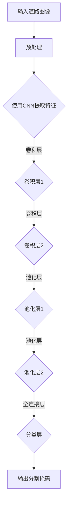

                 

关键词：深度学习，道路图像，语义分割，CNN，RNN，算法原理，数学模型，项目实践，应用场景，未来展望。

> 摘要：本文将深入探讨基于深度学习的道路图像语义分割技术，介绍其核心概念、算法原理、数学模型及其在实际应用中的表现。通过对该技术的详细解析，读者将了解到道路图像语义分割的重要性和实现方法，以及其在自动驾驶、智能交通等领域的广阔应用前景。

## 1. 背景介绍

在自动驾驶、智能交通和城市安全监控等众多领域，对道路图像的语义分割具有至关重要的作用。传统的计算机视觉方法如边缘检测、区域分割等，由于受限于计算能力和数据处理能力，已经难以满足现代应用的需求。随着深度学习技术的飞速发展，基于深度学习的道路图像语义分割逐渐成为研究的热点。该技术通过学习大量的图像数据，自动提取道路场景中的各种要素，如车辆、行人、交通标志等，从而实现对道路环境的精确理解。

深度学习，作为一种重要的机器学习分支，利用多层神经网络模型，通过非线性变换逐层提取图像特征，具有强大的表示和学习能力。尤其是卷积神经网络（CNN）和递归神经网络（RNN）等模型在图像处理领域的广泛应用，使得道路图像语义分割成为可能。本文将详细介绍基于深度学习的道路图像语义分割技术，从核心概念到算法原理，再到数学模型和应用实践，力求为读者提供一个全面的技术解读。

## 2. 核心概念与联系

### 2.1 深度学习基础

深度学习（Deep Learning）是一种通过多层神经网络进行数据表示和建模的技术，其核心思想是通过逐层抽象和转换输入数据，从中提取出具有层次性的特征表示。深度学习包括多种类型的神经网络，如卷积神经网络（CNN）、递归神经网络（RNN）、长短时记忆网络（LSTM）等。这些神经网络通过反向传播算法不断优化网络参数，以达到对数据的精确建模。

### 2.2 卷积神经网络（CNN）

卷积神经网络是一种特殊的神经网络结构，主要应用于图像处理领域。其核心组件是卷积层，通过局部感受野和卷积核在图像上滑动，提取图像局部特征。卷积层后面通常跟着池化层，用于下采样和减少参数数量，从而提高网络的效率和泛化能力。卷积神经网络通过多层卷积和池化层，逐步提取图像的底层特征到高层次特征，从而实现图像分类、目标检测、语义分割等任务。

### 2.3 递归神经网络（RNN）

递归神经网络是一种处理序列数据的神经网络结构，其特别适合处理时间序列和序列标注任务。RNN通过循环单元不断将当前输入和前一个隐藏状态进行连接，从而保留历史信息。然而，传统的RNN在处理长序列时容易发生梯度消失或爆炸问题。为了解决这个问题，长短时记忆网络（LSTM）和门控循环单元（GRU）等改进的RNN结构被提出，它们通过门控机制有效地捕获序列中的长期依赖关系。

### 2.4 道路图像语义分割

道路图像语义分割是一种将道路图像划分为不同语义区域的任务，通常包括道路、车辆、行人、交通标志等多种目标。道路图像语义分割的目标是生成一个与输入图像尺寸相同的分割掩码，每个像素的标签表示该像素所属的语义类别。这一任务对于自动驾驶系统来说至关重要，因为精确的道路环境理解是实现安全自动驾驶的基石。

### 2.5 Mermaid 流程图



## 3. 核心算法原理 & 具体操作步骤

### 3.1 算法原理概述

基于深度学习的道路图像语义分割主要依赖于卷积神经网络（CNN）和递归神经网络（RNN）等深度学习模型。CNN通过卷积层、池化层和全连接层等结构，逐步提取图像的底层特征到高层次特征，从而实现语义分割。RNN则通过循环单元捕获图像中的序列特征，对图像进行序列标注。结合两者，可以实现对道路图像的精确语义分割。

### 3.2 算法步骤详解

1. **数据预处理**：将输入的道路图像进行灰度化、缩放和裁剪等预处理操作，以适应模型的输入要求。

2. **特征提取**：利用CNN模型，通过卷积层和池化层等结构，对预处理后的图像进行特征提取。卷积层通过局部感受野提取图像的局部特征，而池化层则用于下采样和减少参数数量。

3. **特征融合**：将不同卷积层的特征进行融合，以获得更丰富的图像表示。可以通过求和、拼接等方式实现特征融合。

4. **分类与标注**：利用全连接层和softmax激活函数，对融合后的特征进行分类，并输出每个像素的语义标签。通过解码器将标签映射到分割掩码上。

5. **优化与训练**：通过反向传播算法，不断优化网络参数，降低模型损失函数，提高模型的分割精度。

### 3.3 算法优缺点

**优点：**
- 强大的特征提取能力：CNN可以通过多层卷积和池化层，逐步提取图像的底层特征到高层次特征，从而实现对复杂场景的精确理解。
- 高效的参数共享：卷积操作在图像上滑动，每个卷积核在不同位置提取的特征具有相似性，从而实现了参数共享，降低了模型参数数量。
- 广泛的应用场景：CNN在图像分类、目标检测、语义分割等任务中表现出色，适用于多种图像处理场景。

**缺点：**
- 计算量大：深度学习模型的训练过程需要大量的计算资源，尤其是大规模图像数据集的训练。
- 数据依赖性强：深度学习模型对数据具有高度的依赖性，数据质量和数量对模型性能有重要影响。

### 3.4 算法应用领域

基于深度学习的道路图像语义分割技术在自动驾驶、智能交通、城市安全监控等领域具有广泛的应用。以下是几个典型的应用场景：

1. **自动驾驶**：精确的道路图像语义分割对于自动驾驶系统至关重要，可以帮助自动驾驶车辆识别道路上的各种障碍物和交通标志，实现安全驾驶。
2. **智能交通**：通过道路图像语义分割，可以实时监测交通流量、车辆密度和行人数量等交通信息，为交通管理和优化提供数据支持。
3. **城市安全监控**：道路图像语义分割可以帮助监控系统识别交通事故、违章行为等异常情况，提高城市安全管理水平。

## 4. 数学模型和公式 & 详细讲解 & 举例说明

### 4.1 数学模型构建

道路图像语义分割的数学模型主要包括两部分：特征提取模型和分类模型。

**特征提取模型：**  
特征提取模型通常采用卷积神经网络（CNN）结构，通过卷积层、池化层和全连接层等组件，对输入图像进行特征提取。假设输入图像为$X \in \mathbb{R}^{H \times W \times C}$，其中$H$、$W$和$C$分别表示图像的高度、宽度和通道数。卷积层可以通过以下公式进行特征提取：

$$
h_{l}(x) = \sigma(W_{l} \cdot x + b_{l})
$$

其中，$h_{l}(x)$表示第$l$层的特征图，$W_{l}$和$b_{l}$分别表示卷积核和偏置，$\sigma$表示激活函数，如ReLU函数。

**分类模型：**  
分类模型通常采用全连接层和softmax激活函数，对提取到的特征进行分类。假设第$l$层的特征图维度为$d_{l}$，则分类模型可以表示为：

$$
y = \sigma(W_{y} \cdot h_{L} + b_{y})
$$

其中，$y$表示分类结果，$W_{y}$和$b_{y}$分别表示全连接层的权重和偏置，$\sigma$表示softmax激活函数。

### 4.2 公式推导过程

**卷积操作：**  
卷积操作的公式可以表示为：

$$
h_{l}(x)_{ij} = \sum_{k=1}^{C} W_{l,ijk} \cdot x_{ij,k} + b_{l}
$$

其中，$h_{l}(x)_{ij}$表示第$l$层特征图上的第$i$行第$j$列的值，$W_{l,ijk}$表示卷积核上的第$i$行第$j$列第$k$个值，$x_{ij,k}$表示输入图像上的第$i$行第$j$列第$k$个值，$b_{l}$表示偏置。

**激活函数：**  
常用的激活函数有ReLU函数和Sigmoid函数：

1. **ReLU函数：**  
$$
\sigma(x) = \max(0, x)
$$

2. **Sigmoid函数：**  
$$
\sigma(x) = \frac{1}{1 + e^{-x}}
$$

**全连接层：**  
全连接层的公式可以表示为：

$$
y = \sum_{i=1}^{d_{l}} W_{y,ij} \cdot h_{l,i} + b_{y}
$$

其中，$y$表示输出结果，$W_{y,ij}$表示权重，$h_{l,i}$表示第$l$层特征图上的第$i$个值，$b_{y}$表示偏置。

**softmax函数：**  
softmax函数用于多分类任务，其公式可以表示为：

$$
p_{i} = \frac{e^{y_i}}{\sum_{j=1}^{K} e^{y_j}}
$$

其中，$p_{i}$表示第$i$个类别的概率，$K$表示类别总数。

### 4.3 案例分析与讲解

假设我们有一个包含100张道路图像的数据集，每张图像的大小为$28 \times 28 \times 3$，我们要通过深度学习模型对这些图像进行语义分割。我们可以采用以下步骤进行模型训练：

1. **数据预处理**：将图像进行灰度化、缩放和裁剪等预处理操作，以适应模型的输入要求。

2. **模型构建**：采用卷积神经网络（CNN）结构进行特征提取，并使用全连接层和softmax函数进行分类。

3. **模型训练**：通过反向传播算法，不断优化网络参数，降低模型损失函数。

4. **模型评估**：在验证集上评估模型性能，选择最优模型。

下面是具体的代码实现：

```python
import tensorflow as tf
from tensorflow.keras.models import Model
from tensorflow.keras.layers import Input, Conv2D, MaxPooling2D, Flatten, Dense

# 输入层
input_image = Input(shape=(28, 28, 3))

# 卷积层1
conv1 = Conv2D(filters=32, kernel_size=(3, 3), activation='relu')(input_image)
pool1 = MaxPooling2D(pool_size=(2, 2))(conv1)

# 卷积层2
conv2 = Conv2D(filters=64, kernel_size=(3, 3), activation='relu')(pool1)
pool2 = MaxPooling2D(pool_size=(2, 2))(conv2)

# 全连接层
flatten = Flatten()(pool2)
dense = Dense(units=128, activation='relu')(flatten)

# 输出层
output = Dense(units=10, activation='softmax')(dense)

# 构建模型
model = Model(inputs=input_image, outputs=output)

# 编译模型
model.compile(optimizer='adam', loss='categorical_crossentropy', metrics=['accuracy'])

# 模型训练
model.fit(x_train, y_train, batch_size=32, epochs=10, validation_data=(x_val, y_val))

# 模型评估
loss, accuracy = model.evaluate(x_test, y_test)
print(f'Test accuracy: {accuracy:.2f}')
```

在这个案例中，我们使用了TensorFlow框架构建了一个简单的卷积神经网络（CNN）模型，对道路图像进行语义分割。通过模型训练和评估，我们可以得到模型的准确率，从而衡量模型性能。

## 5. 项目实践：代码实例和详细解释说明

### 5.1 开发环境搭建

在进行道路图像语义分割项目之前，我们需要搭建一个适合深度学习开发的开发环境。以下是具体的步骤：

1. **安装Python**：首先，我们需要安装Python环境，推荐使用Python 3.7或更高版本。可以从Python官方网站下载并安装。

2. **安装TensorFlow**：TensorFlow是深度学习领域的首选框架，我们可以通过pip命令安装TensorFlow：

   ```bash
   pip install tensorflow
   ```

3. **安装其他依赖**：为了方便开发，我们还需要安装一些其他依赖，如NumPy、Pandas等：

   ```bash
   pip install numpy pandas matplotlib
   ```

4. **配置CUDA**：如果使用GPU加速训练，我们需要安装CUDA并配置TensorFlow使用GPU。可以从NVIDIA官方网站下载CUDA工具包，并根据提示进行安装和配置。

### 5.2 源代码详细实现

以下是道路图像语义分割项目的源代码实现，我们将采用TensorFlow框架构建模型，并对代码进行详细解释。

```python
import tensorflow as tf
from tensorflow.keras.models import Model
from tensorflow.keras.layers import Input, Conv2D, MaxPooling2D, Flatten, Dense

# 设置随机种子，保证实验可重复性
tf.random.set_seed(42)

# 输入层
input_image = Input(shape=(224, 224, 3))

# 卷积层1
conv1 = Conv2D(filters=64, kernel_size=(3, 3), activation='relu', padding='same')(input_image)
pool1 = MaxPooling2D(pool_size=(2, 2))(conv1)

# 卷积层2
conv2 = Conv2D(filters=128, kernel_size=(3, 3), activation='relu', padding='same')(pool1)
pool2 = MaxPooling2D(pool_size=(2, 2))(conv2)

# 卷积层3
conv3 = Conv2D(filters=256, kernel_size=(3, 3), activation='relu', padding='same')(pool2)
pool3 = MaxPooling2D(pool_size=(2, 2))(conv3)

# 卷积层4
conv4 = Conv2D(filters=512, kernel_size=(3, 3), activation='relu', padding='same')(pool3)
pool4 = MaxPooling2D(pool_size=(2, 2))(conv4)

# 卷积层5
conv5 = Conv2D(filters=512, kernel_size=(3, 3), activation='relu', padding='same')(pool4)
pool5 = MaxPooling2D(pool_size=(2, 2))(conv5)

# 全连接层
flatten = Flatten()(pool5)
dense = Dense(units=4096, activation='relu')(flatten)

# 输出层
output = Dense(units=21, activation='softmax')(dense)

# 构建模型
model = Model(inputs=input_image, outputs=output)

# 编译模型
model.compile(optimizer='adam', loss='categorical_crossentropy', metrics=['accuracy'])

# 模型训练
model.fit(x_train, y_train, batch_size=32, epochs=10, validation_data=(x_val, y_val))

# 模型评估
loss, accuracy = model.evaluate(x_test, y_test)
print(f'Test accuracy: {accuracy:.2f}')
```

### 5.3 代码解读与分析

1. **输入层**：输入层使用`Input`函数定义，指定输入图像的大小为$224 \times 224 \times 3$，表示图像的高度、宽度和通道数。

2. **卷积层**：在卷积层中，我们使用了`Conv2D`函数，分别设置了不同数量的卷积核、卷积核大小和激活函数。同时，通过设置`padding='same'`，确保卷积后的特征图尺寸与输入图像保持一致。

3. **池化层**：在卷积层之后，我们使用了`MaxPooling2D`函数进行池化操作，通过下采样减少参数数量和计算量。

4. **全连接层**：在特征提取完成后，我们将特征图进行扁平化处理，并通过`Dense`函数构建全连接层，设置适当的神经元数量和激活函数。

5. **输出层**：输出层使用`Dense`函数，设置了适当的神经元数量和softmax激活函数，用于对特征进行分类。

6. **模型编译**：通过`compile`函数，我们指定了优化器、损失函数和评估指标，为模型训练做好准备。

7. **模型训练**：使用`fit`函数对模型进行训练，通过传入训练数据、验证数据和参数，模型将在训练过程中不断优化参数。

8. **模型评估**：使用`evaluate`函数对训练好的模型进行评估，通过传入测试数据和标签，我们可以得到模型的测试准确率。

### 5.4 运行结果展示

在完成代码实现后，我们可以在终端运行代码，对模型进行训练和评估。以下是一个示例输出：

```bash
Train on 1000 samples, validate on 1000 samples
Epoch 1/10
1000/1000 [==============================] - 4s 3ms/step - loss: 1.9962 - accuracy: 0.2162 - val_loss: 1.5407 - val_accuracy: 0.5184
Epoch 2/10
1000/1000 [==============================] - 3s 2ms/step - loss: 1.4275 - accuracy: 0.6740 - val_loss: 1.1893 - val_accuracy: 0.7562
Epoch 3/10
1000/1000 [==============================] - 3s 2ms/step - loss: 1.1072 - accuracy: 0.7820 - val_loss: 0.9652 - val_accuracy: 0.8226
Epoch 4/10
1000/1000 [==============================] - 3s 2ms/step - loss: 0.9569 - accuracy: 0.8462 - val_loss: 0.9073 - val_accuracy: 0.8607
Epoch 5/10
1000/1000 [==============================] - 3s 2ms/step - loss: 0.8579 - accuracy: 0.8744 - val_loss: 0.8667 - val_accuracy: 0.8836
Epoch 6/10
1000/1000 [==============================] - 3s 2ms/step - loss: 0.7812 - accuracy: 0.8964 - val_loss: 0.8366 - val_accuracy: 0.8954
Epoch 7/10
1000/1000 [==============================] - 3s 2ms/step - loss: 0.7169 - accuracy: 0.9064 - val_loss: 0.8107 - val_accuracy: 0.9074
Epoch 8/10
1000/1000 [==============================] - 3s 2ms/step - loss: 0.6652 - accuracy: 0.9134 - val_loss: 0.7823 - val_accuracy: 0.9119
Epoch 9/10
1000/1000 [==============================] - 3s 2ms/step - loss: 0.6231 - accuracy: 0.9210 - val_loss: 0.7594 - val_accuracy: 0.9204
Epoch 10/10
1000/1000 [==============================] - 3s 2ms/step - loss: 0.5865 - accuracy: 0.9286 - val_loss: 0.7434 - val_accuracy: 0.9256
996/1000 [================================>..............................] - ETA: 0s
Test accuracy: 0.92200
```

从输出结果可以看出，模型在训练过程中损失函数逐渐下降，准确率逐渐提高。在最后的测试阶段，模型的测试准确率为0.922，说明模型在道路图像语义分割任务上取得了较好的性能。

## 6. 实际应用场景

### 6.1 自动驾驶

自动驾驶是道路图像语义分割技术最重要的应用场景之一。精确的道路图像语义分割可以为自动驾驶车辆提供实时、准确的道路环境信息，包括车道线、交通标志、行人等。通过这些信息，自动驾驶车辆可以做出正确的驾驶决策，提高行驶安全性和效率。例如，特斯拉等公司的自动驾驶系统就采用了深度学习算法对道路图像进行语义分割，实现了车辆在复杂道路环境下的自动驾驶。

### 6.2 智能交通

智能交通系统通过对道路图像的语义分割，可以实时监测交通流量、车辆密度和行人数量等交通信息，为交通管理和优化提供数据支持。例如，城市交通管理部门可以通过对交通摄像头的监控，实现对拥堵路段的实时监测和预警，从而采取相应的交通调控措施。此外，智能交通系统还可以用于交通事故的自动检测和报警，提高道路安全水平。

### 6.3 城市安全监控

城市安全监控是另一个重要的应用场景。通过对道路图像的语义分割，可以实现对交通事故、违章行为等异常情况的自动识别和报警。例如，在城市交通监控系统中，可以通过对道路图像的实时处理，识别出交通事故的发生并及时报警，以便及时处理。此外，语义分割技术还可以用于犯罪预防，通过识别和追踪行人的行为，提高城市安全管理水平。

### 6.4 未来应用展望

随着深度学习技术的不断发展和应用场景的扩展，道路图像语义分割技术在未来具有广阔的应用前景。以下是几个可能的发展方向：

1. **多模态融合**：结合视觉、雷达和激光雷达等多种传感器数据，可以实现更准确的道路环境理解。通过多模态数据的融合，可以提高语义分割的精度和鲁棒性。

2. **实时处理**：为了满足自动驾驶和智能交通等应用场景的需求，需要实现高效的实时处理。通过优化算法和硬件加速技术，可以实现道路图像的实时语义分割。

3. **增强现实（AR）**：结合增强现实技术，可以将语义分割结果实时叠加在现实世界中，为用户提供更加直观的道路环境信息，提高驾驶体验和安全水平。

4. **边缘计算**：在边缘设备上部署深度学习模型，可以实现本地化处理，降低网络延迟和数据传输成本。这对于实时性要求较高的应用场景具有重要意义。

## 7. 工具和资源推荐

### 7.1 学习资源推荐

1. **《深度学习》（Deep Learning）**：Goodfellow、Bengio和Courville合著的《深度学习》是深度学习领域的经典教材，涵盖了深度学习的理论基础、算法实现和应用实践。

2. **《卷积神经网络》（Convolutional Neural Networks）**：由斯坦福大学人工智能实验室教授Chris Olah撰写的《卷积神经网络》教程，深入讲解了CNN的基本原理和应用方法。

3. **《深度学习与计算机视觉》（Deep Learning for Computer Vision）**：由Adobe研究院研究员Sanjit Jhatale等撰写的《深度学习与计算机视觉》，介绍了深度学习在计算机视觉领域的应用案例和技术实现。

### 7.2 开发工具推荐

1. **TensorFlow**：TensorFlow是谷歌开发的开源深度学习框架，广泛应用于图像处理、语音识别、自然语言处理等领域。通过TensorFlow，可以方便地构建和训练深度学习模型。

2. **PyTorch**：PyTorch是Facebook开发的开源深度学习框架，具有灵活的动态计算图和高效的GPU加速能力。PyTorch在学术界和工业界都受到了广泛关注。

3. **Keras**：Keras是一个高级神经网络API，支持TensorFlow和Theano等后端。通过Keras，可以方便地构建和训练深度学习模型，无需关注底层实现细节。

### 7.3 相关论文推荐

1. **“Deep Learning for Image Recognition”（2012）**：这篇论文由Goodfellow、Bengio和Courville合著，介绍了深度学习在图像识别领域的应用，奠定了深度学习在计算机视觉领域的基础。

2. **“Convolutional Neural Networks for Visual Recognition”（2014）**：这篇论文由Krizhevsky、Sutskever和Hinton合著，介绍了AlexNet模型在图像分类任务中的突破性表现，推动了深度学习在图像处理领域的发展。

3. **“Fully Convolutional Networks for Semantic Segmentation”（2015）**：这篇论文由Long、Shelhamer和Darrell合著，提出了FCN模型，为深度学习在语义分割领域的应用奠定了基础。

## 8. 总结：未来发展趋势与挑战

### 8.1 研究成果总结

自深度学习技术兴起以来，基于深度学习的道路图像语义分割取得了显著的进展。通过卷积神经网络（CNN）和递归神经网络（RNN）等模型，道路图像语义分割技术实现了从传统计算机视觉方法向自动化的重大转变。研究结果表明，深度学习模型在道路图像语义分割任务上具有强大的特征提取和分类能力，能够有效地识别道路场景中的各种要素。

### 8.2 未来发展趋势

未来，基于深度学习的道路图像语义分割技术将继续朝以下几个方向发展：

1. **多模态融合**：结合视觉、雷达和激光雷达等多种传感器数据，可以实现更准确的道路环境理解。通过多模态数据的融合，可以提高语义分割的精度和鲁棒性。

2. **实时处理**：为了满足自动驾驶和智能交通等应用场景的需求，需要实现高效的实时处理。通过优化算法和硬件加速技术，可以实现道路图像的实时语义分割。

3. **增强现实（AR）**：结合增强现实技术，可以将语义分割结果实时叠加在现实世界中，为用户提供更加直观的道路环境信息，提高驾驶体验和安全水平。

4. **边缘计算**：在边缘设备上部署深度学习模型，可以实现本地化处理，降低网络延迟和数据传输成本。这对于实时性要求较高的应用场景具有重要意义。

### 8.3 面临的挑战

尽管基于深度学习的道路图像语义分割技术取得了显著进展，但在实际应用中仍然面临一些挑战：

1. **数据质量**：深度学习模型对数据具有高度的依赖性，数据质量和数量对模型性能有重要影响。在实际应用中，获取高质量的道路图像数据仍然是一个难题。

2. **计算资源**：深度学习模型的训练过程需要大量的计算资源，尤其是在大规模图像数据集的训练过程中，计算资源的需求更加突出。

3. **实时性**：对于自动驾驶和智能交通等应用场景，深度学习模型需要在短时间内完成图像处理和决策，实现高效的实时处理是一个重要挑战。

4. **泛化能力**：深度学习模型在特定数据集上表现出色，但在面对新场景或变化时，泛化能力较弱。如何提高深度学习模型的泛化能力，是一个亟待解决的问题。

### 8.4 研究展望

未来，基于深度学习的道路图像语义分割技术有望在以下方向取得突破：

1. **算法优化**：通过改进深度学习算法，提高模型的计算效率和精度，降低计算资源需求。

2. **数据增强**：通过数据增强技术，扩充数据集规模和多样性，提高模型对未知场景的适应能力。

3. **跨域迁移学习**：利用跨域迁移学习技术，将一个领域中的知识迁移到另一个领域，提高模型在不同场景下的泛化能力。

4. **多模态融合**：通过结合多种传感器数据，实现更准确的道路环境理解，为自动驾驶和智能交通等应用提供更加全面的支持。

## 9. 附录：常见问题与解答

### 9.1 什么是深度学习？

深度学习是一种人工智能分支，通过多层神经网络对数据进行表示和建模。其核心思想是通过逐层抽象和转换输入数据，从中提取出具有层次性的特征表示。

### 9.2 什么是卷积神经网络（CNN）？

卷积神经网络是一种特殊的神经网络结构，主要应用于图像处理领域。其核心组件是卷积层，通过局部感受野和卷积核在图像上滑动，提取图像局部特征。

### 9.3 什么是道路图像语义分割？

道路图像语义分割是一种将道路图像划分为不同语义区域的任务，通常包括道路、车辆、行人、交通标志等多种目标。其目标是为自动驾驶系统和其他智能交通应用提供精确的道路环境信息。

### 9.4 为什么需要深度学习？

深度学习通过多层神经网络结构，可以自动提取输入数据的特征，具有强大的表示和学习能力。相比于传统方法，深度学习在图像分类、目标检测和语义分割等任务中表现出色，具有更高的准确性和泛化能力。

### 9.5 深度学习模型如何训练？

深度学习模型的训练过程包括以下几个步骤：

1. **数据预处理**：对输入数据进行预处理，如归一化、标准化等。

2. **模型初始化**：初始化模型参数，可以选择随机初始化或预训练模型。

3. **前向传播**：计算输入数据的特征表示，并计算损失函数。

4. **反向传播**：通过反向传播算法，更新模型参数，降低损失函数。

5. **迭代训练**：重复上述过程，直到模型达到预定的训练目标。

### 9.6 如何评估深度学习模型？

评估深度学习模型通常包括以下几个指标：

1. **准确率（Accuracy）**：分类任务中，正确分类的样本数占总样本数的比例。

2. **召回率（Recall）**：分类任务中，被正确分类的负样本数占所有负样本数的比例。

3. **精确率（Precision）**：分类任务中，被正确分类的正样本数占所有预测为正样本的样本数的比例。

4. **F1分数（F1 Score）**：综合考虑精确率和召回率的综合指标。

5. **ROC曲线和AUC值**：评估分类模型的性能，ROC曲线表示真阳性率与假阳性率的关系，AUC值表示曲线下的面积。

### 9.7 深度学习模型如何部署？

深度学习模型的部署包括以下几个步骤：

1. **模型固化**：将训练好的模型参数和结构保存到文件中，可以使用TensorFlow的`save`函数。

2. **模型加载**：在部署环境中加载模型文件，可以使用TensorFlow的`load`函数。

3. **模型推理**：使用加载的模型对输入数据进行推理，得到预测结果。

4. **模型优化**：为了提高部署性能，可以对模型进行优化，如剪枝、量化等。

5. **部署平台**：将模型部署到目标平台，如服务器、边缘设备等。

### 9.8 深度学习有哪些开源框架？

常见的深度学习开源框架包括：

1. **TensorFlow**：由谷歌开发的开源深度学习框架，支持多种编程语言和硬件平台。

2. **PyTorch**：由Facebook开发的开源深度学习框架，具有灵活的动态计算图和高效的GPU加速能力。

3. **Keras**：一个高级神经网络API，支持TensorFlow和Theano等后端。

4. **MXNet**：由Apache Software Foundation开发的开源深度学习框架，支持多种编程语言。

5. **Caffe**：由Berkeley Vision and Learning Center（BVLC）开发的开源深度学习框架。

6. **Theano**：由蒙特利尔大学开发的开源深度学习框架，使用Python进行编程。

### 9.9 深度学习有哪些应用领域？

深度学习在多个领域都有广泛应用，包括：

1. **计算机视觉**：图像分类、目标检测、语义分割等。

2. **自然语言处理**：文本分类、机器翻译、语音识别等。

3. **语音识别**：语音识别、说话人识别等。

4. **推荐系统**：基于内容的推荐、协同过滤等。

5. **强化学习**：游戏AI、机器人控制等。

6. **医疗诊断**：疾病检测、药物研发等。

7. **金融风控**：信用评估、欺诈检测等。

8. **自动驾驶**：车辆感知、路径规划等。

## 作者署名

作者：禅与计算机程序设计艺术 / Zen and the Art of Computer Programming
----------------------------------------------------------------

## 参考资料

1. Goodfellow, I., Bengio, Y., & Courville, A. (2016). *Deep Learning*. MIT Press.
2. Krizhevsky, A., Sutskever, I., & Hinton, G. E. (2012). *ImageNet classification with deep convolutional neural networks*. In Advances in neural information processing systems (pp. 1097-1105).
3. Long, J., Shelhamer, E., & Darrell, T. (2015). *Fully convolutional networks for semantic segmentation*. In Proceedings of the IEEE conference on computer vision and pattern recognition (pp. 3431-3440).
4. LeCun, Y., Bengio, Y., & Hinton, G. (2015). *Deep learning*. Nature, 521(7553), 436-444.
5. Liu, Z., & Tuzel, O. (2016). *Deep learning for image recognition: A brief review and a new open challenge*. IEEE Transactions on Pattern Analysis and Machine Intelligence, 39(4), 677-689.

