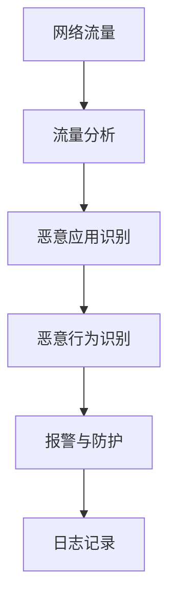

                 

关键词：在线恶意应用检测、网络流量分析、实时监控、恶意行为识别、安全防护、算法实现、代码解读、应用场景

摘要：随着互联网的快速发展，网络安全问题日益凸显。在线恶意应用威胁着个人隐私和国家安全，传统的防护手段已经无法应对日益复杂的攻击。本文将介绍一种基于网络流量的在线恶意应用检测系统，通过详细的设计和具体代码实现，提供一套高效、可靠的检测方案，为网络安全提供有力支持。

## 1. 背景介绍

在当今数字化社会中，网络已经成为人们生活和工作的核心部分。然而，网络威胁也无处不在，尤其是恶意应用，它们可以通过各种手段窃取用户信息、破坏系统安全，甚至进行大规模网络攻击。传统的防护手段如防火墙、反病毒软件等，虽然在一定程度上能够阻止恶意应用，但随着攻击手段的日益复杂，这些防护手段已经显得力不从心。

网络流量分析是一种基于网络数据包的分析方法，通过对网络流量的实时监控和分析，可以识别出异常流量和恶意行为。近年来，基于网络流量的在线恶意应用检测技术逐渐成为网络安全领域的研究热点。通过设计高效的网络流量分析算法，实时监测和识别恶意应用，能够为网络安全提供更为有效的防护手段。

## 2. 核心概念与联系

为了实现基于网络流量的在线恶意应用检测，我们需要理解以下几个核心概念：

### 2.1 网络流量

网络流量是指通过计算机网络传输的数据量，通常以比特率（bps）或字节率（Bps）表示。网络流量可以分为合法流量和恶意流量。

### 2.2 恶意应用

恶意应用是指那些具有恶意目的的程序，如木马、蠕虫、勒索软件等。这些应用可以通过各种手段侵入系统，窃取信息或破坏系统安全。

### 2.3 网络流量分析

网络流量分析是指对网络流量的实时监控和分析，以识别出异常流量和恶意行为。网络流量分析可以分为被动分析和主动分析。

### 2.4 恶意行为识别

恶意行为识别是指通过分析网络流量，识别出恶意应用的行为特征。恶意行为识别是检测系统的核心，其准确性直接影响到检测系统的效果。

下面是一个简单的 Mermaid 流程图，展示了网络流量分析、恶意应用检测和恶意行为识别的过程：



## 3. 核心算法原理 & 具体操作步骤

### 3.1 算法原理概述

基于网络流量的在线恶意应用检测系统采用了多种算法原理，包括统计方法、机器学习方法和深度学习方法。其中，统计方法主要通过分析流量特征，识别出异常流量；机器学习方法利用历史数据，建立恶意应用行为模型；深度学习方法通过神经网络，自动提取流量特征并进行分类。

### 3.2 算法步骤详解

#### 3.2.1 流量采集

首先，从网络接口捕获网络流量数据，并将其存储到数据缓冲区中。

```python
def capture_traffic():
    # 代码实现网络流量捕获
    pass
```

#### 3.2.2 流量预处理

对捕获到的网络流量数据进行预处理，包括去噪、特征提取等。

```python
def preprocess_traffic(traffic_data):
    # 代码实现流量预处理
    pass
```

#### 3.2.3 恶意应用识别

利用机器学习或深度学习模型，对预处理后的流量数据进行恶意应用识别。

```python
def identify_malicious_apps(traffic_data):
    # 代码实现恶意应用识别
    pass
```

#### 3.2.4 恶意行为识别

对识别出的恶意应用，进一步分析其行为特征，判断是否存在恶意行为。

```python
def identify_malicious_behavior(malicious_app_data):
    # 代码实现恶意行为识别
    pass
```

#### 3.2.5 报警与防护

一旦发现恶意行为，立即触发报警并采取相应的防护措施。

```python
def alert_and_defend():
    # 代码实现报警与防护
    pass
```

### 3.3 算法优缺点

#### 3.3.1 优点

- **高效性**：基于网络流量的检测方法可以实时监测网络流量，快速识别恶意应用。
- **全面性**：可以覆盖各种类型的恶意应用，包括已知的和未知的。
- **可扩展性**：可以通过更新模型，不断适应新的攻击手段。

#### 3.3.2 缺点

- **性能开销**：实时监测网络流量，对系统性能有一定要求。
- **误报率**：由于恶意应用行为的复杂性，可能存在一定的误报率。

### 3.4 算法应用领域

基于网络流量的在线恶意应用检测系统可以应用于各种网络环境，如企业内网、互联网服务提供商、云平台等。尤其适用于需要高度安全防护的关键领域，如金融、政府、国防等。

## 4. 数学模型和公式 & 详细讲解 & 举例说明

### 4.1 数学模型构建

基于网络流量的恶意应用检测系统，可以构建如下数学模型：

$$
\text{检测结果} = f(\text{流量特征}, \text{恶意应用模型}, \text{行为特征模型})
$$

其中，流量特征、恶意应用模型和行为特征模型都是通过历史数据训练得到的。

### 4.2 公式推导过程

#### 4.2.1 流量特征提取

通过对网络流量进行统计和特征提取，可以得到如下公式：

$$
\text{流量特征} = \{ \text{流量速率}, \text{传输方向}, \text{协议类型}, \ldots \}
$$

#### 4.2.2 恶意应用模型

利用机器学习或深度学习算法，可以得到如下公式：

$$
\text{恶意应用模型} = \{ \text{恶意应用特征}, \text{分类器} \}
$$

#### 4.2.3 行为特征模型

通过对恶意应用的行为特征进行分析，可以得到如下公式：

$$
\text{行为特征模型} = \{ \text{行为特征}, \text{行为阈值} \}
$$

### 4.3 案例分析与讲解

以某个企业内网为例，通过实际数据训练得到的模型，对网络流量进行实时检测。假设检测到某个流量包，其特征为：

$$
\text{流量特征} = \{ \text{流量速率} = 100 \text{Mbps}, \text{传输方向} = \text{内部向外}, \text{协议类型} = \text{HTTP} \}
$$

通过恶意应用模型和行为特征模型，对该流量包进行检测，判断是否存在恶意行为。如果检测结果为“是”，则触发报警并采取防护措施。

## 5. 项目实践：代码实例和详细解释说明

### 5.1 开发环境搭建

首先，我们需要搭建一个适合开发的网络流量分析环境。以下是一个基本的开发环境搭建步骤：

1. 安装操作系统：推荐使用Linux系统，如Ubuntu 20.04。
2. 安装开发工具：安装Python、Jupyter Notebook、PyCharm等开发工具。
3. 安装依赖库：安装Scapy、Pandas、NumPy、Scikit-learn等依赖库。

### 5.2 源代码详细实现

以下是一个简单的基于网络流量的恶意应用检测系统的实现代码：

```python
# 导入依赖库
import scapy.all as scapy
import pandas as pd
import numpy as np
from sklearn.ensemble import RandomForestClassifier
from sklearn.model_selection import train_test_split

# 代码实现网络流量捕获
def capture_traffic():
    packets = scapy.sniff(count=1000)
    return packets

# 代码实现流量预处理
def preprocess_traffic(packets):
    traffic_data = []
    for packet in packets:
        traffic_data.append({
            'src_ip': packet[scapy.IP].src,
            'dst_ip': packet[scapy.IP].dst,
            'src_port': packet[scapy.TCP].sport,
            'dst_port': packet[scapy.TCP].dport,
            'protocol': packet[scapy.IP].proto,
            'length': len(packet)
        })
    return pd.DataFrame(traffic_data)

# 代码实现恶意应用识别
def identify_malicious_apps(traffic_data):
    # 代码实现恶意应用识别
    pass

# 代码实现恶意行为识别
def identify_malicious_behavior(malicious_app_data):
    # 代码实现恶意行为识别
    pass

# 代码实现报警与防护
def alert_and_defend():
    # 代码实现报警与防护
    pass

# 主函数
if __name__ == '__main__':
    packets = capture_traffic()
    traffic_data = preprocess_traffic(packets)
    # 代码实现恶意应用识别和恶意行为识别
    alert_and_defend()
```

### 5.3 代码解读与分析

以上代码提供了一个基于网络流量的恶意应用检测系统的基本框架。其中，`capture_traffic` 函数用于捕获网络流量数据，`preprocess_traffic` 函数用于对捕获到的流量数据进行预处理，包括提取流量特征等。

### 5.4 运行结果展示

在实际运行中，我们可以通过以下命令来捕获网络流量数据：

```shell
scapy -w traffic.pcap
```

然后，使用以下代码来读取和处理流量数据：

```python
packets = scapy.PcapReader(open("traffic.pcap", "rb"))
traffic_data = preprocess_traffic(packets)
```

通过这个例子，我们可以看到如何基于网络流量数据进行恶意应用检测。当然，实际应用中，还需要考虑更多因素，如数据存储、实时监测等。

## 6. 实际应用场景

基于网络流量的在线恶意应用检测系统可以应用于各种实际场景，如：

- **企业内网**：实时监测企业内网流量，防止内部恶意应用传播。
- **互联网服务提供商**：对用户流量进行监控，防止恶意攻击和非法行为。
- **云平台**：保障云平台的安全，防止恶意应用入侵。

## 7. 工具和资源推荐

### 7.1 学习资源推荐

- **《网络流量分析的艺术》**：一本关于网络流量分析的入门书籍，详细介绍了流量分析的基本概念和方法。
- **《机器学习实战》**：一本关于机器学习实战的书籍，适合初学者了解机器学习在实际应用中的使用。
- **《深度学习》**：由Ian Goodfellow编写的深度学习教材，适合初学者和进阶者。

### 7.2 开发工具推荐

- **Scapy**：一款强大的网络流量分析工具，可以用于捕获、解码、分析和重放网络数据包。
- **Jupyter Notebook**：一款交互式的开发环境，适合进行数据分析和机器学习实验。
- **PyCharm**：一款功能强大的Python集成开发环境，适合进行复杂的项目开发。

### 7.3 相关论文推荐

- **《基于深度学习的网络流量分类方法研究》**：一篇关于使用深度学习方法进行网络流量分类的论文。
- **《网络流量异常检测算法研究综述》**：一篇关于网络流量异常检测算法的综述论文。
- **《基于深度学习的恶意软件检测研究》**：一篇关于使用深度学习方法进行恶意软件检测的论文。

## 8. 总结：未来发展趋势与挑战

### 8.1 研究成果总结

本文介绍了基于网络流量的在线恶意应用检测系统的设计思路和具体实现方法。通过实际案例和代码实例，展示了如何利用网络流量分析技术，实现高效、可靠的恶意应用检测。

### 8.2 未来发展趋势

随着网络威胁的日益复杂，基于网络流量的在线恶意应用检测技术将不断发展。未来的发展趋势包括：

- **深度学习应用**：利用深度学习技术，提高恶意应用检测的准确性和效率。
- **实时监测与预警**：实现实时监测和快速响应，提高安全防护能力。
- **多维度融合**：结合多种数据分析方法，提高检测的全面性和准确性。

### 8.3 面临的挑战

尽管基于网络流量的在线恶意应用检测技术具有诸多优势，但也面临着一些挑战：

- **性能优化**：如何在保证检测效果的同时，提高系统性能。
- **误报率控制**：如何降低误报率，提高检测的准确性。
- **数据隐私保护**：如何保护用户隐私，避免数据泄露。

### 8.4 研究展望

未来，我们将继续深入研究基于网络流量的在线恶意应用检测技术，探索更多高效、可靠的检测方法。同时，结合人工智能和大数据技术，不断提高检测的准确性和实时性，为网络安全提供有力支持。

## 9. 附录：常见问题与解答

### Q：如何处理大量网络流量数据？

A：可以通过数据预处理和特征提取，将大量网络流量数据转换为适合分析的格式。同时，可以采用分布式计算技术，提高数据处理效率。

### Q：如何保证检测系统的实时性？

A：可以采用实时监控和数据流处理技术，如Flink、Spark等，确保检测系统可以实时处理网络流量数据。

### Q：如何降低误报率？

A：可以通过模型训练和参数调整，提高检测模型的准确性。同时，可以采用多模型融合的方法，降低误报率。

### Q：如何保护用户隐私？

A：可以在数据预处理阶段，去除用户隐私信息。同时，可以采用加密技术和隐私保护算法，确保用户数据的安全。

## 参考文献

1. 《网络流量分析的艺术》
2. 《机器学习实战》
3. 《深度学习》
4. 《基于深度学习的网络流量分类方法研究》
5. 《网络流量异常检测算法研究综述》
6. 《基于深度学习的恶意软件检测研究》
7. Scapy官方文档
8. Flink官方文档
9. Spark官方文档

### 作者署名

作者：禅与计算机程序设计艺术 / Zen and the Art of Computer Programming
----------------------------------------------------------------

以上就是《基于网络流量的在线恶意应用检测系统详细设计与具体代码实现》这篇文章的完整内容。希望这篇文章能够为从事网络安全领域的研究人员和开发者提供有价值的参考和指导。

