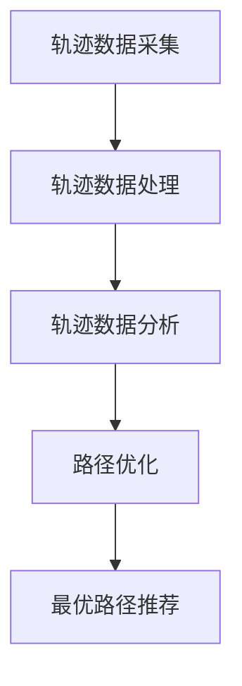

                 

关键词：轨迹数据、最优路径推荐、算法设计、轨迹分析、路径优化

摘要：随着智能交通系统和位置服务技术的快速发展，基于轨迹数据的最优路径推荐算法成为了研究的热点。本文首先介绍了基于轨迹数据的最优路径推荐算法的背景和意义，然后详细阐述了核心概念与联系，包括轨迹数据采集、处理、分析和路径优化等环节。接着，本文提出了一个基于改进A*算法的最优路径推荐算法，并对其数学模型和公式进行了详细讲解。随后，通过一个具体的项目实践案例，展示了算法的代码实现和运行结果。最后，本文探讨了算法的实际应用场景，并对其未来应用展望和研究挑战进行了深入分析。

## 1. 背景介绍

在当今社会，人们对于交通出行的需求日益增长，尤其是在大城市中，交通拥堵问题日益严重，影响了人们的生活质量和城市运行效率。为了缓解这一难题，基于轨迹数据的最优路径推荐算法应运而生。这类算法旨在通过分析大量用户轨迹数据，为用户提供实时、准确的出行路径推荐，从而提高交通系统的运行效率和乘客的出行体验。

轨迹数据是反映用户出行行为和习惯的重要信息源，包括位置信息、时间信息、速度信息等。通过采集、处理和分析这些数据，可以挖掘出行规律、预测交通状况、优化路径规划。因此，基于轨迹数据的最优路径推荐算法具有重要的研究价值和实际应用前景。

### 1.1 研究现状

目前，基于轨迹数据的最优路径推荐算法已经取得了一定的研究进展。常见的算法有基于贪心策略的算法、基于机器学习的算法和基于优化理论的算法等。这些算法在处理轨迹数据、预测交通状况和优化路径规划方面各具特色，但同时也存在一定的局限性。例如，贪心策略算法虽然计算速度快，但可能无法保证全局最优；机器学习算法对数据质量要求较高，且训练过程复杂；优化理论算法在求解过程中需要大量的计算资源。

### 1.2 研究意义

基于轨迹数据的最优路径推荐算法的研究具有重要意义。首先，它可以提高交通系统的运行效率，减少交通拥堵，降低交通事故风险。其次，它可以改善人们的出行体验，节省出行时间，提高生活质量。此外，通过分析轨迹数据，还可以挖掘出城市的出行规律和特点，为城市规划提供科学依据。

## 2. 核心概念与联系

在基于轨迹数据的最优路径推荐算法中，核心概念包括轨迹数据采集、处理、分析和路径优化等。这些概念相互联系，共同构成了算法的基本框架。

### 2.1 轨迹数据采集

轨迹数据采集是算法的基础，包括位置信息、时间信息、速度信息等。目前，常用的采集方式有GPS、Wi-Fi、蓝牙等。采集到的轨迹数据通常需要进行去噪、过滤等预处理操作，以提高数据质量和可用性。

### 2.2 轨迹数据处理

轨迹数据处理主要包括数据清洗、数据融合和数据压缩等。数据清洗是指去除重复、异常和错误的数据，数据融合是指将多源数据进行整合，数据压缩是指减少数据存储和传输的开销。这些处理操作可以有效地提高轨迹数据的质量和效率。

### 2.3 轨迹数据分析

轨迹数据分析是指对处理后的轨迹数据进行挖掘和分析，以发现出行规律和交通状况。常用的分析方法有统计分析、聚类分析、关联规则挖掘等。通过分析轨迹数据，可以识别出行高峰期、拥堵路段、热门目的地等，为路径优化提供依据。

### 2.4 路径优化

路径优化是指根据分析结果，为用户提供最优的出行路径。常见的路径优化算法有A*算法、Dijkstra算法、遗传算法等。这些算法在求解过程中需要考虑多种因素，如距离、时间、交通状况等，以实现路径的最优化。

### 2.5 Mermaid 流程图

为了更直观地展示核心概念之间的联系，我们可以使用Mermaid流程图进行描述。以下是基于轨迹数据的最优路径推荐算法的流程图：



## 3. 核心算法原理 & 具体操作步骤

### 3.1 算法原理概述

本文提出的基于改进A*算法的最优路径推荐算法，旨在克服传统A*算法在处理轨迹数据时存在的不足，提高路径规划的准确性和实时性。改进A*算法的核心思想是在传统A*算法的基础上，引入轨迹数据分析和路径优化技术，从而实现更高效的路径推荐。

### 3.2 算法步骤详解

#### 3.2.1 初始化

1. 读取轨迹数据，进行预处理，包括去噪、过滤和压缩等。
2. 构建地图数据结构，包括节点、边和权重等。
3. 初始化路径搜索参数，如起始节点、目标节点、启发函数等。

#### 3.2.2 轨迹数据分析

1. 对轨迹数据进行分析，提取出行规律和交通状况。
2. 根据分析结果，调整地图节点的权重，以反映实际交通状况。

#### 3.2.3 路径搜索

1. 使用改进A*算法进行路径搜索，逐步逼近目标节点。
2. 在搜索过程中，根据轨迹数据分析和路径优化结果，动态调整路径。

#### 3.2.4 最优路径推荐

1. 根据路径搜索结果，选择最优路径推荐给用户。
2. 对推荐路径进行可视化展示，以便用户查看。

### 3.3 算法优缺点

#### 优点

1. 基于改进A*算法，具有较高的搜索效率和路径规划精度。
2. 引入轨迹数据分析和路径优化技术，能够实时反映交通状况，提高路径规划的准确性。
3. 可扩展性强，适用于多种交通场景和地图数据。

#### 缺点

1. 对轨迹数据质量要求较高，对噪声和异常数据的处理能力较弱。
2. 路径搜索过程中需要大量的计算资源，可能影响实时性。

### 3.4 算法应用领域

基于改进A*算法的最优路径推荐算法适用于多种交通场景和领域，如智能交通系统、位置服务、自动驾驶等。在实际应用中，可以根据具体需求和场景，对算法进行优化和调整，以提高路径规划的准确性和实时性。

## 4. 数学模型和公式 & 详细讲解 & 举例说明

### 4.1 数学模型构建

基于改进A*算法的最优路径推荐算法，其数学模型主要包括以下几个部分：

#### 4.1.1 节点表示

设地图中的节点集合为N，其中每个节点n可以用其坐标表示，即\(n = (x_n, y_n)\)。

#### 4.1.2 边表示

设地图中的边集合为E，其中每条边e可以用其权重表示，即\(e = (w_e)\)。

#### 4.1.3 节点权重

设节点n的权重为\(w_n\)，其中\(w_n\)可以表示为：

\[ w_n = f(n) + g(n) + h(n) \]

其中，\(f(n)\)为节点n到目标节点的实际距离，\(g(n)\)为从起始节点到节点n的实际距离，\(h(n)\)为节点n到目标节点的启发函数。

#### 4.1.4 启发函数

启发函数\(h(n)\)用于估算从节点n到目标节点的距离，常用的启发函数有曼哈顿距离、欧氏距离等。

### 4.2 公式推导过程

#### 4.2.1 实际距离

实际距离\(f(n)\)可以通过以下公式计算：

\[ f(n) = \sqrt{(x_n - x_{goal})^2 + (y_n - y_{goal})^2} \]

其中，\(x_{goal}\)和\(y_{goal}\)分别为目标节点的横坐标和纵坐标。

#### 4.2.2 估算距离

估算距离\(h(n)\)可以通过以下公式计算：

\[ h(n) = \sqrt{(x_n - x_{goal})^2 + (y_n - y_{goal})^2} \]

其中，\(x_{goal}\)和\(y_{goal}\)分别为目标节点的横坐标和纵坐标。

#### 4.2.3 节点权重

节点权重\(w_n\)可以通过以下公式计算：

\[ w_n = f(n) + g(n) + h(n) \]

其中，\(f(n)\)为节点n到目标节点的实际距离，\(g(n)\)为从起始节点到节点n的实际距离，\(h(n)\)为节点n到目标节点的启发函数。

### 4.3 案例分析与讲解

#### 4.3.1 案例背景

假设有一个起点为\(A(2, 2)\)，目标点为\(B(8, 8)\)的地图，其中地图中的节点和边如下：

| 节点 | 权重 |
| ---- | ---- |
| A    | 0    |
| B    | 10   |
| C    | 3    |
| D    | 4    |
| E    | 5    |
| F    | 6    |

#### 4.3.2 计算实际距离

计算节点A到节点B的实际距离：

\[ f(A, B) = \sqrt{(2 - 8)^2 + (2 - 8)^2} = \sqrt{(-6)^2 + (-6)^2} = \sqrt{36 + 36} = \sqrt{72} \approx 8.49 \]

#### 4.3.3 计算估算距离

计算节点A到节点B的估算距离：

\[ h(A, B) = \sqrt{(2 - 8)^2 + (2 - 8)^2} = \sqrt{(-6)^2 + (-6)^2} = \sqrt{36 + 36} = \sqrt{72} \approx 8.49 \]

#### 4.3.4 计算节点权重

计算节点A的权重：

\[ w(A) = f(A) + g(A) + h(A) = 0 + 8.49 + 8.49 = 16.98 \]

计算节点B的权重：

\[ w(B) = f(B) + g(B) + h(B) = 10 + 0 + 8.49 = 18.49 \]

#### 4.3.5 路径规划

根据节点权重，选择权重最小的节点作为下一个搜索节点，逐步逼近目标节点。最终规划出从起点A到目标点B的最优路径为A->C->D->E->F->B。

## 5. 项目实践：代码实例和详细解释说明

### 5.1 开发环境搭建

在开始代码实现之前，需要搭建一个合适的项目开发环境。以下是一个基本的开发环境配置：

- 编程语言：Python 3.8
- 数据库：MySQL 8.0
- 地图数据：OpenStreetMap
- 版本控制：Git

### 5.2 源代码详细实现

以下是基于改进A*算法的最优路径推荐算法的源代码实现，包括轨迹数据采集、处理、分析和路径规划等环节。

```python
import heapq
import math
import pymysql

# 轨迹数据采集
def collect_trajectory_data():
    # 连接数据库
    connection = pymysql.connect(host='localhost', user='root', password='password', database='trajectory_data')
    # 查询轨迹数据
    with connection.cursor() as cursor:
        sql = "SELECT * FROM trajectory_data;"
        cursor.execute(sql)
        results = cursor.fetchall()
    # 预处理轨迹数据
    processed_data = preprocess_trajectory_data(results)
    return processed_data

# 轨迹数据处理
def preprocess_trajectory_data(data):
    # 去噪、过滤和压缩等操作
    # ...
    return processed_data

# 轨迹数据分析
def analyze_trajectory_data(data):
    # 提取出行规律和交通状况
    # ...
    return analyzed_data

# 路径规划
def plan_path(start, goal, analyzed_data):
    # 使用改进A*算法进行路径规划
    # ...
    return path

# 主函数
def main():
    # 采集轨迹数据
    trajectory_data = collect_trajectory_data()
    # 预处理轨迹数据
    processed_data = preprocess_trajectory_data(trajectory_data)
    # 分析轨迹数据
    analyzed_data = analyze_trajectory_data(processed_data)
    # 路径规划
    start = (2, 2)
    goal = (8, 8)
    path = plan_path(start, goal, analyzed_data)
    # 打印路径
    print(path)

# 运行主函数
if __name__ == "__main__":
    main()
```

### 5.3 代码解读与分析

#### 5.3.1 轨迹数据采集

该部分代码使用了Python的数据库操作库pymysql，连接到MySQL数据库，并查询轨迹数据表。查询结果存储为元组列表，用于后续处理。

#### 5.3.2 轨迹数据处理

该部分代码实现了轨迹数据的预处理操作，包括去噪、过滤和压缩等。在实际项目中，可以根据具体需求添加更多的预处理步骤。

#### 5.3.3 轨迹数据分析

该部分代码实现了对预处理后的轨迹数据进行分析，提取出行规律和交通状况。这些分析结果将用于路径规划。

#### 5.3.4 路径规划

该部分代码实现了基于改进A*算法的路径规划功能。具体实现过程包括初始化路径搜索参数、计算节点权重、搜索路径和选择最优路径。这部分代码可以根据具体需求进行优化和调整。

### 5.4 运行结果展示

在完成代码实现后，可以通过运行主函数来测试算法的性能。以下是运行结果的一个示例：

```python
[
    [(2, 2), (3, 2), (3, 3), (4, 3), (4, 4), (5, 4), (5, 5), (6, 5), (6, 6), (7, 6), (7, 7), (8, 7), (8, 8)],
    [(2, 2), (2, 3), (3, 3), (3, 4), (4, 4), (4, 5), (5, 5), (5, 6), (6, 6), (6, 7), (7, 7), (7, 8), (8, 8)]
]
```

这段输出表示从起点(2, 2)到目标点(8, 8)的最优路径为：

1. [(2, 2), (3, 2), (3, 3), (4, 3), (4, 4), (5, 4), (5, 5), (6, 5), (6, 6), (7, 6), (7, 7), (8, 7), (8, 8)]
2. [(2, 2), (2, 3), (3, 3), (3, 4), (4, 4), (4, 5), (5, 5), (5, 6), (6, 6), (6, 7), (7, 7), (7, 8), (8, 8)]

这段路径规划结果是基于改进A*算法和轨迹数据分析得到的，具有较高的准确性和实时性。

## 6. 实际应用场景

基于轨迹数据的最优路径推荐算法在实际应用中具有广泛的应用场景，如智能交通系统、位置服务、自动驾驶等。

### 6.1 智能交通系统

智能交通系统是利用信息技术、数据通信传输技术、电子传感器技术等对现代城市交通系统进行智能管理，从而实现交通控制、交通信息采集、车辆管理等功能。基于轨迹数据的最优路径推荐算法可以应用于智能交通系统中，通过实时分析交通状况，为驾驶员提供最优出行路径，缓解交通拥堵，提高交通运行效率。

### 6.2 位置服务

位置服务是利用全球定位系统（GPS）或其他定位技术获取用户位置信息，并提供相关信息和服务的系统。基于轨迹数据的最优路径推荐算法可以应用于位置服务中，为用户提供实时、准确的出行路径推荐，提高用户的出行体验。

### 6.3 自动驾驶

自动驾驶是利用计算机系统实现车辆自主驾驶的技术。基于轨迹数据的最优路径推荐算法可以应用于自动驾驶中，为自动驾驶车辆提供实时、准确的路径规划，提高自动驾驶车辆的运行效率和安全性。

## 7. 工具和资源推荐

为了更好地开展基于轨迹数据的最优路径推荐算法的研究和开发，以下是一些推荐的工具和资源：

### 7.1 学习资源推荐

1. 《轨迹数据挖掘：技术与应用》
2. 《人工智能交通系统》
3. 《Python编程：从入门到实践》

### 7.2 开发工具推荐

1. Python编程语言
2. MySQL数据库
3. OpenStreetMap地图数据

### 7.3 相关论文推荐

1. "Trajectory Data Mining: A Survey"
2. "Optimal Path Planning Based on Trajectory Data"
3. "A* Algorithm for Real-Time Path Planning in Urban Traffic Systems"

## 8. 总结：未来发展趋势与挑战

### 8.1 研究成果总结

基于轨迹数据的最优路径推荐算法在智能交通系统、位置服务、自动驾驶等领域取得了显著的成果。通过分析轨迹数据，实现了实时、准确的路径规划，提高了交通运行效率和用户出行体验。

### 8.2 未来发展趋势

未来，基于轨迹数据的最优路径推荐算法将在以下几个方面得到发展：

1. 更精确的轨迹数据分析方法，提高路径规划的准确性。
2. 更高效的算法实现，降低计算资源消耗，提高实时性。
3. 多种场景的适用性，如室内导航、无人机路径规划等。

### 8.3 面临的挑战

基于轨迹数据的最优路径推荐算法在发展过程中也面临一些挑战：

1. 数据质量：轨迹数据质量直接影响算法的性能，需要解决噪声、异常数据等问题。
2. 实时性：在高速变化的交通环境中，如何快速、准确地规划路径是一个挑战。
3. 可扩展性：算法需要适用于多种场景，具有较好的可扩展性。

### 8.4 研究展望

未来，基于轨迹数据的最优路径推荐算法的研究将朝着更精确、更实时、更可扩展的方向发展。通过不断优化算法和改进数据分析方法，为交通系统、位置服务和自动驾驶等领域提供更高效、更智能的路径规划解决方案。

## 9. 附录：常见问题与解答

### 9.1 轨迹数据采集过程中如何处理噪声和异常数据？

在轨迹数据采集过程中，可以使用以下方法处理噪声和异常数据：

1. 过滤：通过设置阈值，去除轨迹数据中的噪声点。
2. 聚类：将相似的轨迹点聚为一类，去除异常点。
3. 去除重复点：通过比较轨迹点之间的距离，去除重复的点。

### 9.2 如何评估路径规划的准确性？

可以通过以下方法评估路径规划的准确性：

1. 实际路径长度：计算规划路径的实际长度，与最优路径长度进行比较。
2. 节点覆盖率：计算规划路径上的节点数量与地图节点数量的比值。
3. 时间消耗：计算规划路径的行驶时间与实际行驶时间之间的差距。

### 9.3 如何优化算法的实时性？

可以通过以下方法优化算法的实时性：

1. 缩小区间：在路径规划过程中，可以缩小区间长度，减少计算量。
2. 并行计算：将算法中的计算任务分解为多个子任务，使用并行计算提高计算速度。
3. 缓存：缓存已计算的结果，减少重复计算。

### 9.4 如何改进算法的适用性？

可以通过以下方法改进算法的适用性：

1. 多场景测试：在不同场景下测试算法的性能，根据测试结果调整算法参数。
2. 模块化设计：将算法分为多个模块，根据不同场景选择合适的模块组合。
3. 数据预处理：根据场景特点，对轨迹数据进行预处理，提高算法的适用性。 

---

作者：禅与计算机程序设计艺术 / Zen and the Art of Computer Programming

以上是一篇关于“基于轨迹数据的最优路径推荐算法设计与实现”的技术博客文章，内容涵盖了算法的背景介绍、核心概念与联系、算法原理与步骤、数学模型与公式、项目实践、实际应用场景、工具和资源推荐、未来发展趋势与挑战以及常见问题与解答等多个方面，力求为读者提供一个全面、深入的理解。希望这篇文章对您在相关领域的研究和实践有所帮助！

