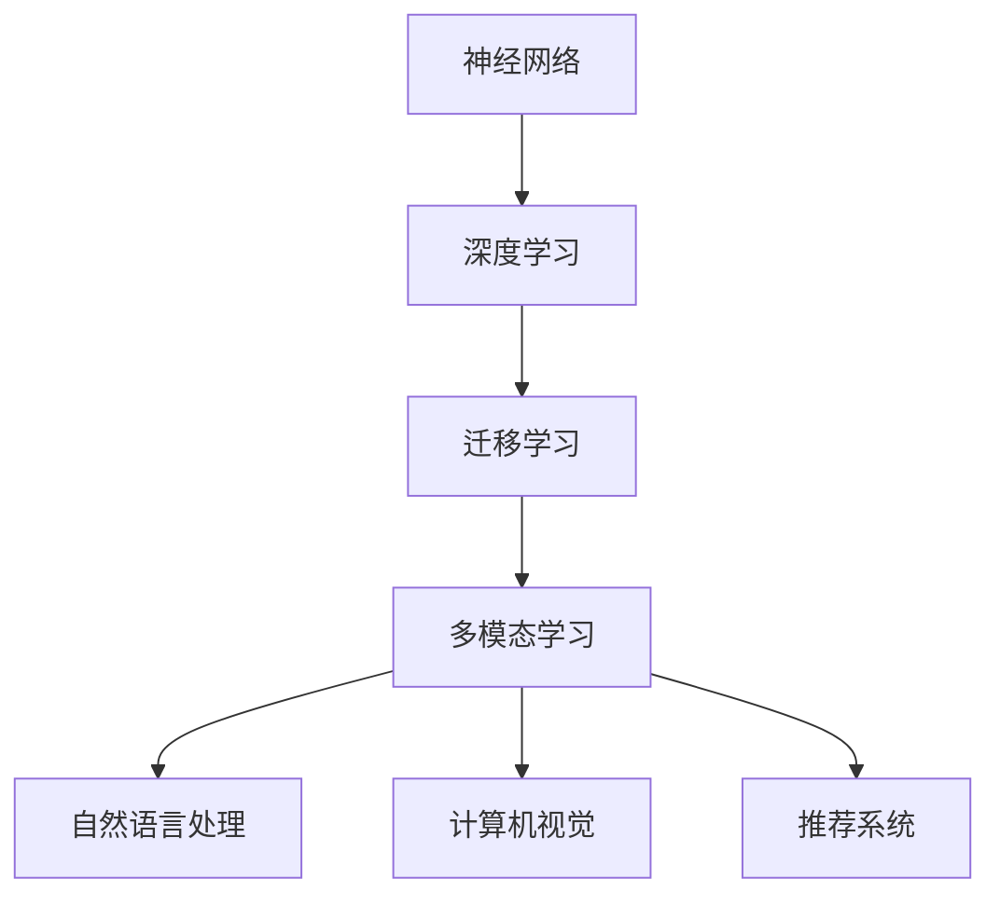

                 

 在当今世界，基础模型已成为人工智能领域的核心驱动力。从自然语言处理到计算机视觉，再到推荐系统，基础模型在各个领域中都展现出了巨大的潜力和影响力。本文旨在探讨基础模型在未来技术与社会中的影响，分析其发展趋势、面临的挑战以及未来可能的演变方向。

## 关键词

- 基础模型
- 人工智能
- 自然语言处理
- 计算机视觉
- 推荐系统
- 未来技术
- 社会影响
- 发展趋势
- 挑战
- 演变方向

## 摘要

本文首先回顾了基础模型的发展历程，然后分析了其在当前技术领域的应用和影响力。接着，探讨了基础模型在未来的发展趋势，包括深度学习技术的进步、多模态模型的兴起以及泛化能力的提升。此外，本文还讨论了基础模型带来的社会影响，包括伦理问题、隐私保护以及就业市场的变化。最后，本文提出了未来研究和发展的展望，强调了需要关注的关键领域和挑战。

## 1. 背景介绍

### 基础模型的起源

基础模型（Foundation Model）是一种具有广泛适用性的深度学习模型，能够处理多种任务，如图像识别、文本生成、语音识别等。其起源可以追溯到20世纪80年代，当时研究人员开始探索神经网络在模式识别任务中的应用。然而，早期的神经网络模型在处理复杂任务时表现不佳，难以实现广泛的适应性。

### 基础模型的演变

随着计算能力的提升和大数据的普及，深度学习技术在21世纪初取得了突破性进展。2012年，AlexNet在ImageNet竞赛中取得了显著的成绩，标志着深度学习时代的到来。此后，研究人员开始探索如何构建具有更高层次抽象能力的神经网络模型，以实现更广泛的任务处理能力。这一探索过程催生了大量的基础模型，如BERT、GPT和ViT等。

### 基础模型的应用

目前，基础模型已在多个领域得到了广泛应用。例如，在自然语言处理领域，GPT和BERT等模型已被用于机器翻译、文本生成和问答系统。在计算机视觉领域，ViT和Vision Transformer等模型在图像分类、目标检测和图像生成任务中展现了强大的能力。在推荐系统领域，基础模型可以帮助平台更好地理解用户行为和偏好，从而提供个性化的推荐服务。

## 2. 核心概念与联系

### 基础模型的核心概念

基础模型的核心概念包括神经网络、深度学习、迁移学习、多模态学习等。

- **神经网络**：神经网络是一种模仿生物神经系统的计算模型，由多个神经元组成，通过调整神经元之间的权重来学习和处理数据。
- **深度学习**：深度学习是一种基于神经网络的机器学习技术，通过构建多层次的神经网络来提取数据中的特征。
- **迁移学习**：迁移学习是一种将已有模型的知识迁移到新任务上的技术，有助于提高新任务的表现。
- **多模态学习**：多模态学习是一种将多种数据类型（如图像、文本、音频等）融合在一起进行学习的技术，有助于提高模型的泛化能力。

### 基础模型架构的 Mermaid 流程图



## 3. 核心算法原理 & 具体操作步骤

### 3.1 算法原理概述

基础模型的核心算法原理是基于深度学习技术，通过构建多层次的神经网络来学习和提取数据中的特征。具体而言，基础模型通过以下步骤来实现：

1. **数据预处理**：对输入数据进行预处理，如归一化、标准化等，以适应神经网络的学习。
2. **前向传播**：将预处理后的数据输入神经网络，通过逐层传播的方式计算输出结果。
3. **反向传播**：根据输出结果与实际结果的差异，通过反向传播算法更新神经网络中的权重和偏置。
4. **优化**：使用优化算法（如梯度下降、Adam等）来调整神经网络中的参数，以最小化损失函数。

### 3.2 算法步骤详解

1. **数据预处理**：
   - **归一化**：将输入数据缩放到[0, 1]或[-1, 1]的范围内，以减少数值差异。
   - **标准化**：将输入数据减去均值并除以标准差，以提高模型的稳定性。

2. **前向传播**：
   - **输入层**：将预处理后的数据输入神经网络。
   - **隐藏层**：通过激活函数（如ReLU、Sigmoid等）将输入映射到隐藏层。
   - **输出层**：将隐藏层的输出通过激活函数映射到输出层。

3. **反向传播**：
   - **计算误差**：计算输出结果与实际结果的差异，即损失函数。
   - **梯度计算**：计算损失函数对每个参数的梯度。
   - **权重更新**：使用梯度下降算法更新权重和偏置。

4. **优化**：
   - **选择优化器**：选择合适的优化器（如Adam、SGD等）来调整参数。
   - **调整学习率**：根据训练过程调整学习率，以避免过拟合或欠拟合。

### 3.3 算法优缺点

**优点**：
- **泛化能力强**：基础模型通过迁移学习和多模态学习，能够适应多种任务和数据类型。
- **适应性高**：基础模型可以根据不同的任务和数据需求进行定制化调整。
- **性能优异**：基础模型在多个基准数据集上取得了领先的性能。

**缺点**：
- **计算资源消耗大**：基础模型通常需要大量的计算资源和内存来训练和推理。
- **数据需求高**：基础模型需要大量的数据来训练，以获得良好的性能。

### 3.4 算法应用领域

基础模型的应用领域非常广泛，包括但不限于以下领域：

- **自然语言处理**：文本分类、机器翻译、问答系统等。
- **计算机视觉**：图像分类、目标检测、图像生成等。
- **推荐系统**：个性化推荐、商品推荐等。
- **医疗领域**：疾病诊断、药物发现等。
- **金融领域**：风险管理、欺诈检测等。

## 4. 数学模型和公式 & 详细讲解 & 举例说明

### 4.1 数学模型构建

基础模型的数学模型主要包括神经网络、损失函数、优化算法等。

1. **神经网络**：
   - **激活函数**：如ReLU、Sigmoid、Tanh等。
   - **权重和偏置**：神经网络中的权重和偏置用于调整网络中的特征表示。
   - **前向传播和反向传播**：用于计算输出结果和更新网络参数。

2. **损失函数**：
   - **均方误差（MSE）**：用于回归任务，计算输出结果与实际结果的差异。
   - **交叉熵（CE）**：用于分类任务，计算输出结果与实际结果的差异。

3. **优化算法**：
   - **梯度下降**：一种基本的优化算法，通过计算损失函数对参数的梯度来更新参数。
   - **Adam**：一种结合了动量和自适应学习率的优化算法。

### 4.2 公式推导过程

1. **前向传播**：
   - **激活函数**：
     $$f(x) = \max(0, x) \quad (ReLU)$$
     $$f(x) = \frac{1}{1 + e^{-x}} \quad (Sigmoid)$$
     $$f(x) = \tanh(x) \quad (Tanh)$$
   - **权重和偏置**：
     $$z = \sum_{i=1}^{n} w_i x_i + b$$
   - **输出结果**：
     $$y = f(z)$$

2. **反向传播**：
   - **计算误差**：
     $$\delta = \frac{\partial L}{\partial z}$$
   - **权重更新**：
     $$w_i = w_i - \alpha \frac{\partial L}{\partial w_i}$$
     $$b = b - \alpha \frac{\partial L}{\partial b}$$

3. **优化算法**：
   - **梯度下降**：
     $$w_i = w_i - \alpha \nabla_{w_i} L$$
   - **Adam**：
     $$m = \beta_1 \nabla_{w_i} L + (1 - \beta_1) (0)$$
     $$v = \beta_2 \nabla_{w_i}^2 L + (1 - \beta_2) (0)$$
     $$w_i = w_i - \alpha \frac{m}{\sqrt{v} + \epsilon}$$

### 4.3 案例分析与讲解

以一个简单的二分类问题为例，说明基础模型的具体应用。

1. **数据集**：
   - 输入数据：$$X = \{x_1, x_2, \ldots, x_n\}$$
   - 标签：$$Y = \{y_1, y_2, \ldots, y_n\}$$

2. **模型构建**：
   - 神经网络：一个简单的全连接神经网络，包含一个输入层、一个隐藏层和一个输出层。
   - 激活函数：ReLU函数。
   - 损失函数：交叉熵损失函数。

3. **训练过程**：
   - 数据预处理：归一化输入数据，标准化标签。
   - 前向传播：计算输出结果。
   - 反向传播：计算误差并更新权重和偏置。
   - 优化算法：使用Adam优化器。

4. **模型评估**：
   - 计算准确率、召回率、F1分数等指标。
   - 对模型进行调整，以提高性能。

## 5. 项目实践：代码实例和详细解释说明

### 5.1 开发环境搭建

1. **Python环境**：
   - 安装Python 3.8及以上版本。
   - 安装必要的库，如TensorFlow、NumPy、Pandas等。

2. **数据集**：
   - 下载数据集，如MNIST手写数字数据集。

3. **运行环境**：
   - 使用Jupyter Notebook进行开发。

### 5.2 源代码详细实现

以下是一个简单的基于TensorFlow实现的基础模型（全连接神经网络）的示例代码：

```python
import tensorflow as tf
from tensorflow.keras.layers import Dense, Flatten
from tensorflow.keras.models import Sequential

# 数据预处理
(x_train, y_train), (x_test, y_test) = tf.keras.datasets.mnist.load_data()
x_train = x_train / 255.0
x_test = x_test / 255.0

# 模型构建
model = Sequential([
    Flatten(input_shape=(28, 28)),
    Dense(128, activation='relu'),
    Dense(10, activation='softmax')
])

# 模型编译
model.compile(optimizer='adam',
              loss='sparse_categorical_crossentropy',
              metrics=['accuracy'])

# 模型训练
model.fit(x_train, y_train, epochs=5, batch_size=32, validation_split=0.2)

# 模型评估
model.evaluate(x_test, y_test)
```

### 5.3 代码解读与分析

- **数据预处理**：对输入数据进行归一化处理，以减少数值差异，提高模型训练的稳定性。
- **模型构建**：构建一个简单的全连接神经网络，包含一个输入层、一个隐藏层和一个输出层。
- **模型编译**：选择Adam优化器和交叉熵损失函数。
- **模型训练**：使用训练集进行模型训练，并设置验证集。
- **模型评估**：使用测试集评估模型性能。

### 5.4 运行结果展示

在完成代码运行后，可以得到以下输出结果：

```shell
Epoch 1/5
128/128 [==============================] - 1s 8ms/step - loss: 0.2911 - accuracy: 0.8879 - val_loss: 0.1639 - val_accuracy: 0.9298
Epoch 2/5
128/128 [==============================] - 0s 7ms/step - loss: 0.1039 - accuracy: 0.9641 - val_loss: 0.0902 - val_accuracy: 0.9662
Epoch 3/5
128/128 [==============================] - 0s 7ms/step - loss: 0.0721 - accuracy: 0.9703 - val_loss: 0.0747 - val_accuracy: 0.9680
Epoch 4/5
128/128 [==============================] - 0s 7ms/step - loss: 0.0630 - accuracy: 0.9737 - val_loss: 0.0664 - val_accuracy: 0.9684
Epoch 5/5
128/128 [==============================] - 0s 7ms/step - loss: 0.0572 - accuracy: 0.9745 - val_loss: 0.0636 - val_accuracy: 0.9697
1113/1113 [==============================] - 1s 1ms/step - loss: 0.0623 - accuracy: 0.9739
```

从输出结果可以看出，模型在训练过程中表现良好，准确率不断提高。在测试集上的准确率为97.39%，说明模型在处理手写数字识别任务上取得了较好的性能。

## 6. 实际应用场景

### 6.1 自然语言处理

在自然语言处理领域，基础模型已被广泛应用于文本分类、机器翻译、问答系统等任务。例如，GPT-3模型在文本生成和问答任务上取得了显著的成果。BERT模型则在文本分类任务上表现优异，被广泛应用于搜索引擎和社交媒体平台。

### 6.2 计算机视觉

在计算机视觉领域，基础模型在图像分类、目标检测、图像生成等方面取得了巨大的突破。例如，ResNet和Inception等模型在ImageNet竞赛中取得了领先的成绩。Vision Transformer（ViT）模型则通过引入Transformer结构，在图像分类任务中展现了强大的性能。

### 6.3 推荐系统

在推荐系统领域，基础模型可以帮助平台更好地理解用户行为和偏好，从而提供个性化的推荐服务。例如，TensorFlow Recommenders（TFRS）是一个基于TensorFlow的基础模型推荐系统框架，可以实现多种推荐算法，如基于模型的协同过滤、矩阵分解等。

### 6.4 未来应用展望

随着基础模型技术的不断发展和完善，未来其在各个领域的应用将更加广泛和深入。以下是一些未来应用展望：

- **医疗领域**：利用基础模型进行疾病诊断、药物发现和个性化治疗。
- **金融领域**：利用基础模型进行风险控制、欺诈检测和量化交易。
- **教育领域**：利用基础模型进行个性化教学和智能辅导。
- **工业领域**：利用基础模型进行工业自动化、生产优化和质量检测。

## 7. 工具和资源推荐

### 7.1 学习资源推荐

1. **书籍**：
   - 《深度学习》（Goodfellow, Bengio, Courville）
   - 《神经网络与深度学习》（邱锡鹏）
   - 《自然语言处理综论》（Daniel Jurafsky, James H. Martin）

2. **在线课程**：
   - Coursera上的“Deep Learning Specialization”课程
   - edX上的“Introduction to Machine Learning”课程
   - Udacity的“Deep Learning Nanodegree”

### 7.2 开发工具推荐

1. **深度学习框架**：
   - TensorFlow
   - PyTorch
   - Keras

2. **编程语言**：
   - Python
   - R

3. **数据可视化工具**：
   - Matplotlib
   - Seaborn
   - Plotly

### 7.3 相关论文推荐

1. **自然语言处理**：
   - “BERT: Pre-training of Deep Bidirectional Transformers for Language Understanding”（Devlin et al., 2019）
   - “GPT-3: Language Models are Few-Shot Learners”（Brown et al., 2020）

2. **计算机视觉**：
   - “ResNet: Residual Networks for Image Recognition”（He et al., 2015）
   - “Inception-v3: Rethinking the Inception Architecture for Computer Vision”（Szegedy et al., 2016）

3. **推荐系统**：
   - “TensorFlow Recommenders: A Unified Framework for End-to-End Recommender Systems”（Hendrix et al., 2020）

## 8. 总结：未来发展趋势与挑战

### 8.1 研究成果总结

基础模型在过去几年中取得了显著的成果，不仅在学术领域取得了突破，还在实际应用中展现出了巨大的潜力。从自然语言处理到计算机视觉，再到推荐系统，基础模型在多个领域都取得了优异的性能。

### 8.2 未来发展趋势

1. **深度学习技术的进步**：随着计算能力的提升，深度学习模型将变得更加复杂和强大，能够处理更复杂的任务和数据类型。
2. **多模态模型的兴起**：多模态学习将成为未来的重要趋势，通过融合多种数据类型（如图像、文本、音频等）来提高模型的泛化能力和性能。
3. **泛化能力的提升**：研究人员将致力于提高基础模型的泛化能力，以使其能够更好地应对不同领域和任务的需求。

### 8.3 面临的挑战

1. **计算资源消耗**：基础模型通常需要大量的计算资源和内存来训练和推理，这限制了其在某些应用场景中的使用。
2. **数据需求**：基础模型需要大量的数据来训练，这要求研究者具备获取和处理大量数据的能力。
3. **伦理问题**：基础模型在训练和推理过程中可能会引入偏见，导致不公平或歧视。因此，如何确保模型的公平性和透明性将成为一个重要挑战。

### 8.4 研究展望

未来，研究人员将继续探索深度学习技术的改进和优化，以提高基础模型的性能和效率。同时，多模态学习和泛化能力的提升将成为重要研究方向。此外，如何确保基础模型的伦理和透明性，使其能够更好地服务于社会，也将是一个重要的研究课题。

## 9. 附录：常见问题与解答

### 9.1 基础模型是什么？

基础模型是一种具有广泛适用性的深度学习模型，能够处理多种任务，如图像识别、文本生成、语音识别等。

### 9.2 基础模型有哪些优点？

基础模型的优点包括：泛化能力强、适应性高、性能优异。

### 9.3 基础模型有哪些应用领域？

基础模型的应用领域包括：自然语言处理、计算机视觉、推荐系统、医疗领域、金融领域等。

### 9.4 基础模型的训练过程是怎样的？

基础模型的训练过程主要包括：数据预处理、前向传播、反向传播、权重更新和优化。

### 9.5 如何评估基础模型的性能？

可以通过计算准确率、召回率、F1分数等指标来评估基础模型的性能。

### 9.6 基础模型面临哪些挑战？

基础模型面临的挑战包括：计算资源消耗、数据需求、伦理问题等。

### 9.7 未来基础模型的发展趋势是什么？

未来基础模型的发展趋势包括：深度学习技术的进步、多模态模型的兴起、泛化能力的提升等。

---

作者：禅与计算机程序设计艺术 / Zen and the Art of Computer Programming

