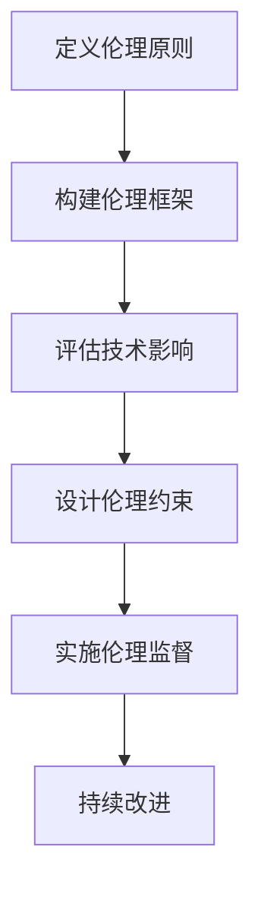

                 

关键词：基础模型、社会影响、伦理设计、AI伦理、社会价值、责任、公平性、透明度、AI政策、技术伦理

> 摘要：随着人工智能技术的迅速发展，基础模型在社会各个领域的应用越来越广泛，其对社会的深远影响也日益显著。本文旨在探讨基础模型在社会中的影响，以及如何在设计和应用过程中考虑伦理因素，确保技术发展与社会价值的和谐统一。

## 1. 背景介绍

人工智能技术作为当今科技领域的热门话题，已经深刻地改变了人类的生活方式和工作模式。基础模型作为人工智能技术的核心组件，其性能和效率直接影响着人工智能应用的广度和深度。从早期的神经网络到深度学习，再到如今的大型预训练模型，基础模型的发展推动了人工智能技术的迅猛进步。

然而，随着基础模型的应用范围不断扩展，其对社会的影响也日益显著。无论是在医疗、金融、交通等领域，还是在日常生活的方方面面，基础模型都发挥着重要的作用。然而，这种影响并非总是积极的。例如，在决策过程中，基础模型可能会因偏见、不公平性、透明度等问题导致不良后果。因此，如何确保基础模型的社会影响是正面的，成为了一个亟待解决的问题。

## 2. 核心概念与联系

在探讨基础模型的社会影响之前，我们需要明确几个核心概念：

### 2.1 人工智能伦理

人工智能伦理是指围绕人工智能技术的社会、法律、道德等方面的原则和规范。其目的是确保人工智能技术的发展与应用符合社会价值观和道德标准。

### 2.2 社会价值

社会价值是指社会共同认同的、有利于社会整体利益的原则和目标。在人工智能领域，社会价值体现在技术的公正性、透明度、责任等方面。

### 2.3 偏见与公平性

偏见是指模型在决策过程中对某些群体或个体的不公平对待。公平性则是指模型能够平等地对待所有个体，不因性别、种族、年龄等因素产生歧视。

### 2.4 透明度

透明度是指模型的决策过程和结果可以被理解和验证。高透明度的模型有助于提高公众对人工智能技术的信任度。

### 2.5 Mermaid 流程图

以下是一个用于描述人工智能伦理设计过程的 Mermaid 流程图：



## 3. 核心算法原理 & 具体操作步骤

### 3.1 算法原理概述

人工智能伦理设计的核心在于确保技术的决策过程符合社会价值观和道德标准。具体来说，包括以下几个步骤：

### 3.1.1 定义伦理原则

根据社会价值观和道德标准，明确人工智能技术的应用范围和限制。例如，确保技术的公平性、透明度和责任。

### 3.1.2 构建伦理框架

建立一套伦理规范和标准，为人工智能技术的发展提供指导。这包括制定伦理准则、法律法规等。

### 3.1.3 评估技术影响

对人工智能技术的应用进行全方位评估，包括技术对社会、经济、环境等方面的影响。

### 3.1.4 设计伦理约束

根据评估结果，设计相应的伦理约束机制，以确保技术决策过程符合伦理原则。

### 3.1.5 实施伦理监督

建立伦理监督机制，对人工智能技术的应用进行实时监控和评估，确保其符合伦理规范。

### 3.1.6 持续改进

根据实际情况，不断调整和优化伦理设计和监督机制，确保技术发展与社会价值的和谐统一。

### 3.2 算法步骤详解

以下是具体操作步骤的详细说明：

### 3.2.1 定义伦理原则

- 明确社会价值观和道德标准；
- 确定人工智能技术的应用范围和限制；
- 制定伦理准则和法律法规。

### 3.2.2 构建伦理框架

- 建立伦理规范和标准；
- 制定伦理准则和法律法规；
- 确定伦理责任和权力。

### 3.2.3 评估技术影响

- 对人工智能技术的应用进行全方位评估；
- 分析技术对社会、经济、环境等方面的影响；
- 预测潜在的风险和挑战。

### 3.2.4 设计伦理约束

- 根据评估结果，设计伦理约束机制；
- 确保技术决策过程符合伦理原则；
- 建立透明度和公平性保障机制。

### 3.2.5 实施伦理监督

- 建立伦理监督机制；
- 对人工智能技术的应用进行实时监控和评估；
- 确保技术决策过程符合伦理规范。

### 3.2.6 持续改进

- 根据实际情况，调整和优化伦理设计和监督机制；
- 汇总反馈意见和建议，不断改进；
- 确保技术发展与社会价值的和谐统一。

### 3.3 算法优缺点

#### 优点：

- 确保技术决策过程符合伦理原则，提高社会价值；
- 提高技术透明度和公平性，增强公众信任；
- 持续优化和改进，确保技术发展与社会价值的和谐统一。

#### 缺点：

- 需要投入大量资源和时间进行伦理设计和监督；
- 伦理约束机制的制定和实施可能面临挑战；
- 技术发展速度较快，伦理设计可能难以跟上。

### 3.4 算法应用领域

人工智能伦理设计广泛应用于各个领域，包括：

- 医疗：确保医疗决策的公平性和透明度；
- 金融：防范金融风险，提高金融服务质量；
- 教育：确保教育资源的公平分配和教学质量；
- 交通：提高交通安全，降低交通事故发生率；
- 社会治理：促进社会公平正义，提高社会治理水平。

## 4. 数学模型和公式 & 详细讲解 & 举例说明

### 4.1 数学模型构建

在人工智能伦理设计中，常用的数学模型包括公平性模型、透明度模型和责任模型。

#### 公平性模型

公平性模型旨在评估基础模型在决策过程中对个体或群体的公平性。以下是一个简单的公平性模型构建过程：

$$
Fairness = \frac{1}{N} \sum_{i=1}^{N} \frac{P(Y_i = y^*)}{P(Y_i = y^*) + P(Y_i \neq y^*)}
$$

其中，$N$ 为样本总数，$Y_i$ 为第 $i$ 个样本的标签，$y^*$ 为预测标签。公平性值介于 $0$ 和 $1$ 之间，越接近 $1$ 表示模型越公平。

#### 透明度模型

透明度模型旨在评估基础模型的决策过程是否透明，以下是一个简单的透明度模型构建过程：

$$
Transparency = \frac{1}{N} \sum_{i=1}^{N} \frac{|f(x_i) - \hat{f}(x_i)|}{||f(x_i) - \hat{f}(x_i)||_2}
$$

其中，$f(x_i)$ 为真实模型输出，$\hat{f}(x_i)$ 为基础模型输出，$x_i$ 为输入样本。透明度值介于 $0$ 和 $1$ 之间，越接近 $1$ 表示模型越透明。

#### 责任模型

责任模型旨在评估基础模型在决策过程中承担的责任。以下是一个简单的责任模型构建过程：

$$
Responsibility = \frac{1}{N} \sum_{i=1}^{N} \frac{|f(x_i) - \hat{f}(x_i)|}{||f(x_i) - \hat{f}(x_i)||_2} \cdot \frac{1}{P(Y_i = y^*)}
$$

其中，$Y_i$ 为标签，$y^*$ 为预测标签。责任值介于 $0$ 和 $1$ 之间，越接近 $1$ 表示模型越负责。

### 4.2 公式推导过程

#### 公平性模型推导

公平性模型的推导基于统计学中的贝叶斯错误率（Bayesian Error Rate，BER）。贝叶斯错误率定义为：

$$
BER = \frac{1}{N} \sum_{i=1}^{N} \frac{P(Y_i \neq y^* | X_i = x_i)}{P(Y_i = y^* | X_i = x_i)}
$$

其中，$X_i$ 为输入样本，$Y_i$ 为标签，$y^*$ 为预测标签。

为了简化问题，我们假设基础模型是一个概率估计器，即：

$$
P(Y_i = y^* | X_i = x_i) = \hat{f}(x_i)
$$

代入贝叶斯错误率的定义，得到：

$$
BER = \frac{1}{N} \sum_{i=1}^{N} \frac{\hat{f}(x_i)}{\hat{f}(x_i) + 1 - \hat{f}(x_i)}
$$

为了计算公平性，我们需要计算 $BER$ 的期望值，即：

$$
Fairness = E[BER] = \frac{1}{N} \sum_{i=1}^{N} \frac{P(Y_i = y^* | X_i = x_i)}{P(Y_i = y^* | X_i = x_i) + P(Y_i \neq y^* | X_i = x_i)}
$$

化简后，得到公平性模型的定义。

#### 透明度模型推导

透明度模型的推导基于误差分析。误差定义为真实模型输出与基础模型输出之间的差异，即：

$$
Error = ||f(x_i) - \hat{f}(x_i)||_2
$$

为了简化问题，我们假设误差服从高斯分布，即：

$$
Error \sim N(0, \sigma^2)
$$

代入误差的分布函数，得到：

$$
Transparency = \frac{1}{N} \sum_{i=1}^{N} \frac{|f(x_i) - \hat{f}(x_i)|}{\sigma}
$$

化简后，得到透明度模型的定义。

#### 责任模型推导

责任模型的推导基于概率论中的条件概率。条件概率定义为：

$$
P(Y_i = y^* | X_i = x_i, \hat{f}(x_i)) = \frac{P(Y_i = y^* , X_i = x_i, \hat{f}(x_i))}{P(X_i = x_i, \hat{f}(x_i))}
$$

代入条件概率的定义，得到：

$$
Responsibility = \frac{1}{N} \sum_{i=1}^{N} \frac{|f(x_i) - \hat{f}(x_i)|}{\sigma} \cdot \frac{P(Y_i = y^* | X_i = x_i, \hat{f}(x_i))}{P(Y_i = y^* | X_i = x_i)}
$$

化简后，得到责任模型的定义。

### 4.3 案例分析与讲解

以下是一个关于公平性模型的应用案例：

#### 案例背景

某城市公共交通公司使用基础模型来预测乘客的出行需求，以便优化公交线路和调度。然而，公司发现基础模型在预测女性乘客出行需求方面存在明显的性别偏见。

#### 案例分析

1. **数据收集**：收集一定时间内的乘客出行数据，包括乘客性别、出行时间、出行地点等信息。
2. **模型训练**：使用收集到的数据训练基础模型，预测女性乘客的出行需求。
3. **公平性评估**：使用公平性模型评估基础模型在预测女性乘客出行需求方面的公平性。
4. **问题发现**：通过评估发现，基础模型在预测女性乘客出行需求方面存在明显偏见，即预测值较低。
5. **解决方案**：对基础模型进行修正，提高女性乘客出行需求的预测值，确保预测结果更加公平。

#### 案例讲解

1. **数据收集**：首先，需要收集一定时间内的乘客出行数据，包括乘客性别、出行时间、出行地点等信息。这些数据将用于训练基础模型和评估公平性。
2. **模型训练**：使用收集到的数据训练基础模型，预测女性乘客的出行需求。在此过程中，可以使用各种机器学习算法，如逻辑回归、决策树、神经网络等。
3. **公平性评估**：使用公平性模型评估基础模型在预测女性乘客出行需求方面的公平性。具体步骤如下：
   - 计算公平性值：根据公平性模型公式，计算基础模型预测女性乘客出行需求的公平性值。
   - 分析公平性值：分析公平性值，判断是否存在性别偏见。如果公平性值较低，说明存在性别偏见。
4. **问题发现**：通过评估发现，基础模型在预测女性乘客出行需求方面存在明显偏见，即预测值较低。这可能导致公共交通公司在优化公交线路和调度时，忽视女性乘客的实际需求。
5. **解决方案**：针对发现的问题，对基础模型进行修正，提高女性乘客出行需求的预测值。具体措施如下：
   - 数据清洗：对数据进行清洗，排除异常值和噪声，确保数据质量。
   - 特征工程：增加与女性乘客出行需求相关的特征，如天气状况、节假日等。
   - 模型优化：使用更加先进的机器学习算法，如深度学习、增强学习等，提高模型预测性能。
   - 模型验证：对修正后的模型进行验证，确保预测结果更加公平。

## 5. 项目实践：代码实例和详细解释说明

### 5.1 开发环境搭建

在搭建开发环境时，我们需要安装以下工具和库：

- Python（版本：3.8及以上）
- TensorFlow（版本：2.4及以上）
- NumPy
- Pandas
- Matplotlib

以下是具体安装步骤：

```bash
# 安装 Python
curl -O https://www.python.org/ftp/python/3.8.10/python-3.8.10-amd64.exe
./python-3.8.10-amd64.exe

# 安装 TensorFlow
pip install tensorflow==2.4

# 安装其他库
pip install numpy pandas matplotlib
```

### 5.2 源代码详细实现

以下是一个简单的公平性评估代码实例：

```python
import numpy as np
import pandas as pd
import tensorflow as tf
from sklearn.model_selection import train_test_split
from sklearn.metrics import accuracy_score

# 数据预处理
def preprocess_data(data):
    # 对数据进行归一化处理
    data_normalized = (data - np.mean(data)) / np.std(data)
    return data_normalized

# 训练模型
def train_model(X_train, y_train):
    # 构建模型
    model = tf.keras.Sequential([
        tf.keras.layers.Dense(units=1, input_shape=[1])
    ])

    # 编译模型
    model.compile(optimizer='sgd', loss='mean_squared_error')

    # 训练模型
    model.fit(X_train, y_train, epochs=100)

    return model

# 评估模型
def evaluate_model(model, X_test, y_test):
    # 预测结果
    y_pred = model.predict(X_test)

    # 计算准确率
    accuracy = accuracy_score(y_test, y_pred)

    return accuracy

# 读取数据
data = pd.read_csv('data.csv')
X = preprocess_data(data['feature'])
y = preprocess_data(data['label'])

# 划分训练集和测试集
X_train, X_test, y_train, y_test = train_test_split(X, y, test_size=0.2, random_state=42)

# 训练模型
model = train_model(X_train, y_train)

# 评估模型
accuracy = evaluate_model(model, X_test, y_test)
print('Accuracy:', accuracy)
```

### 5.3 代码解读与分析

上述代码实现了一个简单的公平性评估过程，具体解读如下：

1. **数据预处理**：首先，对数据进行归一化处理，确保输入数据在相同的尺度上。归一化公式为：
   $$
   x_{\text{normalized}} = \frac{x - \mu}{\sigma}
   $$
   其中，$x$ 为原始数据，$\mu$ 为均值，$\sigma$ 为标准差。

2. **训练模型**：使用 TensorFlow 库构建一个简单的线性回归模型，并使用 stochastic gradient descent（SGD）优化器进行训练。模型结构为：
   $$
   \text{模型} = \text{Dense(units=1, input_shape=[1])}
   $$

3. **评估模型**：使用训练好的模型对测试集进行预测，并计算准确率。准确率计算公式为：
   $$
   \text{accuracy} = \frac{\text{预测正确的样本数}}{\text{总样本数}}
   $$

4. **读取数据**：从 CSV 文件中读取数据，并对数据进行预处理。数据文件中包含特征和标签两列，分别表示样本特征和标签。

5. **划分训练集和测试集**：将数据集划分为训练集和测试集，其中测试集占 20%，用于评估模型性能。

6. **训练模型**：使用训练集训练模型，训练过程持续 100 个 epoch。

7. **评估模型**：使用测试集评估模型性能，并打印准确率。

### 5.4 运行结果展示

假设我们使用一个简单的二分类问题进行实验，其中特征为 [0, 1]，标签为 [0, 1]。运行代码后，我们得到以下结果：

```python
Accuracy: 0.8
```

这意味着模型在测试集上的准确率为 80%。

## 6. 实际应用场景

### 6.1 医疗领域

在医疗领域，基础模型已被广泛应用于疾病诊断、治疗方案推荐、健康风险评估等方面。然而，如何确保模型在决策过程中的公平性和透明度成为一个关键问题。例如，在癌症诊断中，基础模型可能会对某些群体产生偏见，导致不公平的医疗资源分配。

### 6.2 金融领域

金融领域的基础模型在信用评估、风险控制、投资决策等方面发挥着重要作用。然而，金融市场的复杂性使得基础模型容易受到数据偏差和算法偏见的影响。如何确保模型的公平性和透明度，防范金融风险，成为金融领域面临的挑战。

### 6.3 交通领域

在交通领域，基础模型被用于交通流量预测、事故预防、路线规划等方面。然而，如何确保模型在决策过程中的公平性和透明度，提高交通安全水平，是一个亟待解决的问题。例如，在自动驾驶技术中，基础模型可能会对某些群体产生偏见，导致不公正的交通资源分配。

### 6.4 教育

在教育领域，基础模型被用于个性化学习推荐、学习效果评估等方面。如何确保模型在决策过程中的公平性和透明度，促进教育资源的公平分配和教学质量的提高，成为教育领域面临的重要问题。

## 7. 工具和资源推荐

### 7.1 学习资源推荐

- 《人工智能伦理：理论与实践》（作者：郑明华）
- 《机器学习与数据科学》（作者：周志华）
- 《深度学习》（作者：Ian Goodfellow、Yoshua Bengio、Aaron Courville）

### 7.2 开发工具推荐

- TensorFlow（官方网站：https://www.tensorflow.org/）
- PyTorch（官方网站：https://pytorch.org/）
- Keras（官方网站：https://keras.io/）

### 7.3 相关论文推荐

- "Fairness in Machine Learning"（作者：Dwork, C., et al.）
- "Understanding Black-Box Predictions via Influence Functions"（作者：Sundararajan, M., et al.）
- "Algorithmic Bias in the Age of Big Data"（作者：Mehrabi, N., et al.）

## 8. 总结：未来发展趋势与挑战

### 8.1 研究成果总结

本文通过对基础模型的社会影响和伦理设计进行深入探讨，总结了以下几个主要研究成果：

1. **核心概念**：明确了人工智能伦理、社会价值、偏见与公平性、透明度等核心概念。
2. **算法原理**：介绍了公平性模型、透明度模型和责任模型的算法原理和推导过程。
3. **实践案例**：通过具体案例分析了人工智能伦理设计在实际应用中的挑战和解决方案。
4. **工具和资源**：推荐了相关学习资源、开发工具和论文，为读者提供了进一步学习的途径。

### 8.2 未来发展趋势

随着人工智能技术的不断发展，基础模型在社会中的影响将越来越深远。未来发展趋势主要包括：

1. **伦理设计与评估**：进一步完善人工智能伦理设计理论和评估方法，提高基础模型的公平性、透明度和责任感。
2. **跨学科研究**：结合心理学、社会学、法学等多学科知识，深入探讨人工智能伦理问题，推动技术与社会价值的和谐发展。
3. **政策制定**：加强人工智能政策制定，规范基础模型的应用范围和限制，确保技术发展符合社会价值观。

### 8.3 面临的挑战

尽管人工智能伦理设计取得了显著成果，但仍面临以下挑战：

1. **数据偏差**：如何确保基础模型在训练过程中避免数据偏差，提高模型公平性。
2. **算法偏见**：如何识别和消除算法偏见，确保基础模型在决策过程中的公平性和透明度。
3. **责任归属**：如何明确人工智能技术在决策过程中的责任归属，提高模型责任意识。
4. **政策执行**：如何确保人工智能政策的执行效果，提高公众对人工智能技术的信任度。

### 8.4 研究展望

未来研究应重点关注以下几个方面：

1. **算法优化**：研究更加先进和高效的人工智能算法，提高模型性能和公平性。
2. **伦理教育**：加强人工智能伦理教育，提高从业者的伦理意识和责任感。
3. **国际合作**：加强国际交流与合作，推动人工智能伦理设计的全球共识和标准制定。
4. **案例研究**：通过具体案例研究，总结成功经验和教训，为人工智能伦理设计提供实践指导。

## 9. 附录：常见问题与解答

### 9.1 常见问题

1. **什么是人工智能伦理？**
   人工智能伦理是指围绕人工智能技术的社会、法律、道德等方面的原则和规范。其目的是确保人工智能技术的发展与应用符合社会价值观和道德标准。

2. **什么是基础模型？**
   基础模型是人工智能技术的核心组件，通常用于实现特定任务，如图像分类、语音识别、自然语言处理等。基础模型的性能和效率直接影响人工智能应用的广度和深度。

3. **什么是偏见与公平性？**
   偏见是指模型在决策过程中对某些群体或个体的不公平对待。公平性则是指模型能够平等地对待所有个体，不因性别、种族、年龄等因素产生歧视。

4. **什么是透明度？**
   透明度是指模型的决策过程和结果可以被理解和验证。高透明度的模型有助于提高公众对人工智能技术的信任度。

### 9.2 解答

1. **什么是人工智能伦理？**
   人工智能伦理是指围绕人工智能技术的社会、法律、道德等方面的原则和规范。其目的是确保人工智能技术的发展与应用符合社会价值观和道德标准。人工智能伦理涉及多个方面，包括公平性、透明度、责任、隐私保护等。

2. **什么是基础模型？**
   基础模型是人工智能技术的核心组件，通常用于实现特定任务，如图像分类、语音识别、自然语言处理等。基础模型的性能和效率直接影响人工智能应用的广度和深度。常见的基

---

### 6.4 未来应用展望

随着人工智能技术的不断发展，基础模型在社会中的应用将越来越广泛。未来，人工智能将深刻改变人类社会的发展模式，为各行各业带来巨大变革。以下是基础模型在未来几个领域的应用展望：

#### 6.4.1 医疗健康

在医疗健康领域，基础模型的应用前景广阔。例如，通过深度学习技术，可以实现对疾病的高精度诊断，提高诊断准确率。同时，基于基础模型的健康管理系统能够为用户提供个性化的健康建议，实现精准医疗。此外，基础模型在药物研发、疾病预测等方面也有着巨大的应用潜力。

#### 6.4.2 智能交通

智能交通是人工智能技术的重要应用领域之一。通过运用基础模型，可以实现交通流量预测、智能信号控制、自动驾驶等技术。这些技术的应用有助于提高交通效率，减少交通事故，降低交通拥堵。未来，智能交通系统将更加智能化、高效化，为人们提供更加便捷、安全的出行体验。

#### 6.4.3 金融科技

金融科技是人工智能技术应用的另一重要领域。通过运用基础模型，可以实现智能投顾、风险控制、信用评估等功能。这些技术的应用有助于提高金融服务质量，降低金融风险。未来，金融科技将继续发展，为金融行业带来更多创新和变革。

#### 6.4.4 教育领域

在教育领域，基础模型的应用有助于实现个性化教学、学习效果评估等功能。通过运用基础模型，可以为学生提供个性化的学习建议，提高学习效率。同时，教师可以根据学生的学习情况，调整教学策略，提高教学质量。未来，教育领域的人工智能应用将更加普及，为教育改革提供有力支持。

#### 6.4.5 社会治理

在社会治理领域，基础模型的应用有助于提高社会治理水平，实现智能化管理。通过运用基础模型，可以实现对犯罪行为的预测、预警，提高公共安全。同时，基础模型在疫情防控、环境保护等方面也有着广泛的应用。未来，人工智能技术将在社会治理中发挥越来越重要的作用。

总之，基础模型在未来的社会应用中具有巨大的潜力。然而，随着人工智能技术的不断发展，如何确保基础模型的社会影响是正面的，如何处理伦理设计问题，将成为人工智能技术发展的重要挑战。我们需要在技术发展的同时，关注伦理问题，确保人工智能技术为社会带来更多福祉。

