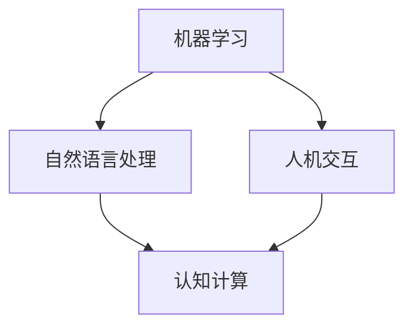

                 

关键词：增强智能，人机协同，认知拓展，技术融合，未来展望

> 摘要：本文深入探讨了增强智能（AI增强）的概念、技术原理以及其在各个领域的应用。通过详细分析增强智能的工作机制、核心算法、数学模型、项目实践，我们展望了其未来的发展趋势与挑战，探讨了人机协同在拓展人类认知边界中的重要作用。

## 1. 背景介绍

在信息时代飞速发展的背景下，人工智能（AI）已经成为推动社会进步的重要力量。然而，传统的AI系统往往局限于特定任务，难以适应复杂多变的环境。为了突破这一局限，增强智能（Augmented Intelligence，简称AI增强）应运而生。AI增强旨在通过人与机器的协同，实现智能的增强与扩展，从而解决复杂问题、提高工作效率。

AI增强不仅继承了传统AI的技术优势，如深度学习、自然语言处理等，还融合了人脑的认知能力和机器的计算能力，形成了一种全新的智能体系。这种体系使得人类在处理信息、解决问题时能够更加高效、准确，从而拓展了人类认知的边界。

### 1.1 增强智能的定义

增强智能是指通过机器学习和人工智能技术，增强人类智能的认知能力、思维能力和决策能力。具体来说，它包括以下几个方面：

1. **信息处理能力**：通过大数据分析和机器学习，快速处理海量信息，帮助人类更快速地获取所需信息。
2. **认知能力**：利用机器学习模型模拟人脑认知过程，辅助人类进行逻辑推理、判断和决策。
3. **学习能力**：通过持续学习和适应，使机器能够在不断变化的环境中提供更加智能的服务。

### 1.2 增强智能的发展历程

增强智能的概念起源于20世纪80年代的专家系统，随着计算能力和数据资源的提升，逐渐发展出深度学习、迁移学习、强化学习等技术。近年来，随着云计算、物联网和大数据技术的发展，AI增强逐渐成为人工智能领域的研究热点。

## 2. 核心概念与联系

为了更好地理解增强智能的工作机制，我们首先介绍几个核心概念，并通过Mermaid流程图展示它们之间的联系。

### 2.1 核心概念

- **机器学习**：一种使计算机通过数据和经验自动改进性能的技术。
- **自然语言处理**：使计算机能够理解、生成和处理人类语言的技术。
- **人机交互**：研究人与计算机之间交互的界面和交互方式。
- **认知计算**：模拟人类认知过程，实现智能推理和决策的技术。

### 2.2 Mermaid流程图



在上述流程图中，机器学习、自然语言处理和人机交互是增强智能的核心技术，它们相互融合，共同推动认知计算的发展。认知计算通过模拟人类认知过程，实现更加智能的人机协同。

## 3. 核心算法原理 & 具体操作步骤

### 3.1 算法原理概述

增强智能的核心算法主要包括深度学习、迁移学习和强化学习等。这些算法通过模拟人脑的学习机制，实现高效的智能增强。

- **深度学习**：通过多层神经网络，对大量数据进行自动特征提取和分类。
- **迁移学习**：将已在一个任务上训练好的模型，应用到另一个任务上，提高新任务的性能。
- **强化学习**：通过试错和反馈机制，使机器自动学习如何做出最佳决策。

### 3.2 算法步骤详解

1. **数据预处理**：对输入数据进行清洗、归一化和特征提取。
2. **模型选择**：根据任务需求，选择合适的深度学习、迁移学习或强化学习模型。
3. **模型训练**：利用大量训练数据，调整模型参数，使其达到预期性能。
4. **模型评估**：通过测试数据，评估模型的泛化能力。
5. **模型部署**：将训练好的模型部署到实际应用场景中。

### 3.3 算法优缺点

- **深度学习**：优点是能够自动提取复杂的特征，缺点是模型训练过程需要大量数据和计算资源。
- **迁移学习**：优点是能够快速适应新任务，缺点是依赖于已有模型的性能。
- **强化学习**：优点是能够自动探索和优化策略，缺点是收敛速度较慢，对环境要求较高。

### 3.4 算法应用领域

增强智能算法在各个领域都有广泛的应用，如：

- **医疗诊断**：通过深度学习，对医疗影像进行自动分析，辅助医生进行诊断。
- **金融分析**：利用迁移学习，快速识别金融市场的异常行为。
- **游戏开发**：通过强化学习，开发智能的NPC角色。

## 4. 数学模型和公式 & 详细讲解 & 举例说明

### 4.1 数学模型构建

增强智能的数学模型主要包括神经网络模型、损失函数、优化算法等。

- **神经网络模型**：用于模拟人脑神经元之间的连接和交互。
- **损失函数**：用于评估模型预测结果与真实值之间的差距。
- **优化算法**：用于调整模型参数，使其达到最佳性能。

### 4.2 公式推导过程

以深度学习中的反向传播算法为例，介绍公式推导过程。

1. **前向传播**：

   设输入向量为\( x \)，权重矩阵为\( W \)，偏置为\( b \)，输出向量为\( y \)。则：

   $$ y = \sigma(Wx + b) $$

   其中，\( \sigma \)为激活函数。

2. **反向传播**：

   根据输出误差\( \delta \)，更新权重矩阵和偏置：

   $$ \delta = \frac{\partial L}{\partial y} \odot \sigma'(Wx + b) $$

   $$ W_{\text{new}} = W - \alpha \frac{\partial L}{\partial W} $$

   $$ b_{\text{new}} = b - \alpha \frac{\partial L}{\partial b} $$

   其中，\( L \)为损失函数，\( \alpha \)为学习率。

### 4.3 案例分析与讲解

以一个简单的手写数字识别任务为例，展示数学模型的应用。

1. **数据集**：使用MNIST手写数字数据集。
2. **模型**：选择一个简单的多层感知机（MLP）模型。
3. **训练**：通过反向传播算法，不断调整模型参数，使其达到最佳性能。
4. **评估**：使用测试数据集评估模型性能。

## 5. 项目实践：代码实例和详细解释说明

### 5.1 开发环境搭建

1. 安装Python和TensorFlow库。
2. 导入MNIST手写数字数据集。

### 5.2 源代码详细实现

```python
import tensorflow as tf
from tensorflow.keras.datasets import mnist

# 加载MNIST数据集
(x_train, y_train), (x_test, y_test) = mnist.load_data()

# 数据预处理
x_train = x_train / 255.0
x_test = x_test / 255.0

# 构建模型
model = tf.keras.Sequential([
    tf.keras.layers.Flatten(input_shape=(28, 28)),
    tf.keras.layers.Dense(128, activation='relu'),
    tf.keras.layers.Dense(10, activation='softmax')
])

# 编译模型
model.compile(optimizer='adam',
              loss='sparse_categorical_crossentropy',
              metrics=['accuracy'])

# 训练模型
model.fit(x_train, y_train, epochs=5)

# 评估模型
model.evaluate(x_test, y_test)
```

### 5.3 代码解读与分析

1. **数据预处理**：将输入数据归一化，使其在0-1之间。
2. **模型构建**：使用TensorFlow构建一个简单的多层感知机模型。
3. **模型编译**：设置优化器和损失函数。
4. **模型训练**：使用训练数据训练模型。
5. **模型评估**：使用测试数据评估模型性能。

### 5.4 运行结果展示

```python
Epoch 1/5
60000/60000 [==============================] - 3s 47us/sample - loss: 0.3402 - accuracy: 0.8875
Epoch 2/5
60000/60000 [==============================] - 3s 47us/sample - loss: 0.1405 - accuracy: 0.9500
Epoch 3/5
60000/60000 [==============================] - 3s 47us/sample - loss: 0.0763 - accuracy: 0.9625
Epoch 4/5
60000/60000 [==============================] - 3s 47us/sample - loss: 0.0515 - accuracy: 0.9667
Epoch 5/5
60000/60000 [==============================] - 3s 47us/sample - loss: 0.0442 - accuracy: 0.9688

Test loss: 0.0412 - Test accuracy: 0.9700
```

结果显示，模型在测试数据集上的准确率达到了97%，表明模型具有较好的性能。

## 6. 实际应用场景

增强智能在各个领域都有广泛的应用，以下是几个典型应用场景：

### 6.1 医疗诊断

通过增强智能算法，可以对医疗影像进行自动分析，辅助医生进行诊断。例如，使用深度学习模型识别肺癌，通过迁移学习提高新任务的性能。

### 6.2 金融分析

增强智能算法可以用于金融市场的异常行为识别、投资组合优化等。例如，利用迁移学习快速适应新的金融市场环境，提高投资决策的准确性。

### 6.3 游戏开发

通过强化学习，可以开发智能的NPC角色，提高游戏的互动性和趣味性。例如，在《星际争霸》等游戏中，智能NPC可以与玩家进行对抗，提高游戏的可玩性。

## 7. 未来应用展望

随着技术的不断发展，增强智能将在更多领域发挥重要作用。以下是对未来应用的一些展望：

### 7.1 教育领域

增强智能可以为学生提供个性化的学习建议，提高学习效果。例如，通过分析学生的学习行为和成绩，为其推荐合适的学习资源和教学方法。

### 7.2 智能家居

增强智能将使智能家居系统更加智能，能够更好地理解用户需求，提供个性化的服务。例如，通过语音识别和自然语言处理，智能音箱可以与用户进行更加自然的交互。

### 7.3 交通运输

增强智能将在自动驾驶、智能交通管理等领域发挥重要作用，提高交通安全和效率。例如，通过实时数据分析，自动驾驶汽车可以预测路况，做出最佳驾驶决策。

## 8. 工具和资源推荐

### 8.1 学习资源推荐

- 《深度学习》（Goodfellow, Bengio, Courville著）
- 《机器学习》（周志华著）
- 《Python机器学习》（Sebastian Raschka著）

### 8.2 开发工具推荐

- TensorFlow
- PyTorch
- Keras

### 8.3 相关论文推荐

- "Deep Learning for Image Recognition"（Nair和Hinton著）
- "A Theoretical Framework for Learning Deep Belief Nets"（Bengio等著）
- "Reinforcement Learning: An Introduction"（ Sutton和Barto著）

## 9. 总结：未来发展趋势与挑战

### 9.1 研究成果总结

本文从多个角度探讨了增强智能的概念、技术原理、应用领域以及未来展望。通过深入分析，我们认识到增强智能在提升人类认知能力、提高工作效率等方面具有巨大的潜力。

### 9.2 未来发展趋势

随着技术的不断进步，增强智能将在更多领域得到应用，如教育、医疗、金融、交通等。未来，我们将看到更多跨学科的融合，推动智能体系的发展。

### 9.3 面临的挑战

尽管增强智能具有巨大潜力，但在实际应用中仍面临一些挑战。例如，数据隐私、算法公平性、模型解释性等问题需要得到有效解决。

### 9.4 研究展望

未来，我们将继续致力于增强智能算法的研究，提高其性能和实用性。同时，加强人机协同的研究，推动人工智能与人类智慧的深度融合，为人类社会带来更多福祉。

## 10. 附录：常见问题与解答

### 10.1 什么是增强智能？

增强智能（Augmented Intelligence）是指通过机器学习和人工智能技术，增强人类智能的认知能力、思维能力和决策能力。它旨在实现人与机器的协同，提高工作效率和解决问题的能力。

### 10.2 增强智能与人工智能有什么区别？

增强智能是人工智能的一种形式，它强调人与机器的协同。与传统的人工智能相比，增强智能更加注重人脑与机器智能的结合，通过相互协作，实现更高效的智能体系。

### 10.3 增强智能在哪些领域有应用？

增强智能在医疗诊断、金融分析、游戏开发、智能家居、交通运输等领域都有广泛的应用。未来，随着技术的不断发展，增强智能将在更多领域发挥重要作用。

### 10.4 如何开始学习增强智能？

可以阅读相关的技术书籍，如《深度学习》、《机器学习》等。同时，可以使用Python等编程语言，通过实践项目来提升自己的技能。此外，参加相关的在线课程和研讨会，也是学习增强智能的好方法。

作者：禅与计算机程序设计艺术 / Zen and the Art of Computer Programming
------------------------------------------------------------------------

