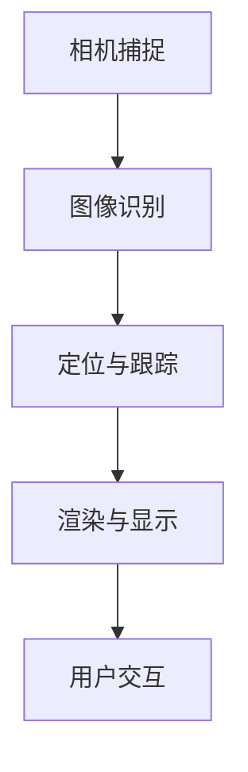

                 

关键词：增强现实、虚拟现实、混合现实、AR技术、应用场景、发展趋势、挑战与展望

> 摘要：本文将深入探讨增强现实（AR）技术的概念、发展历程、核心算法原理、应用领域以及未来展望。通过详细的数学模型和项目实践案例，本文旨在为读者提供全面而深入的AR技术理解，并为其在现实世界中的应用提供指导。

## 1. 背景介绍

增强现实（Augmented Reality，简称AR）技术是一种将虚拟信息与现实世界融合的技术，通过计算机生成的虚拟信息叠加到真实环境中，给用户带来更加丰富和互动的体验。AR技术不同于虚拟现实（Virtual Reality，VR），VR技术是完全模拟出一个虚拟环境，而AR技术则是增强用户对现实世界的感知。

AR技术的起源可以追溯到20世纪60年代。当时，波音公司开发出了世界上第一个头戴式显示器，这为后来的AR技术奠定了基础。随着计算机技术和图形学的发展，AR技术逐渐走向成熟，并在21世纪初迎来了爆发式的发展。

近年来，随着智能手机和移动设备的普及，AR技术得到了广泛的应用。例如，AR游戏如《Pokémon Go》使得AR技术成为大众娱乐的新宠；在医疗领域，AR技术被用于手术指导和患者教育；在教育和培训领域，AR技术提供了更加生动和互动的学习体验。

## 2. 核心概念与联系

### 2.1 增强现实的基本概念

增强现实（AR）技术的核心概念是将虚拟信息叠加到现实环境中。这些虚拟信息可以是文字、图像、三维模型或其他多媒体内容。实现这一目标的关键技术包括：

1. **相机捕捉**：通过相机捕捉现实世界的场景，并实时传输到计算设备。
2. **图像识别**：使用图像识别技术识别现实世界中的物体或场景，以便准确叠加虚拟信息。
3. **定位与跟踪**：通过位置传感器和视觉定位技术，确保虚拟信息与真实世界中的物体或场景准确对齐。
4. **渲染与显示**：将虚拟信息渲染到现实场景中，并通过显示器或头戴式显示器呈现给用户。

### 2.2 Mermaid 流程图



### 2.3 核心概念联系

相机捕捉到现实世界的图像后，图像识别技术用于识别图像中的关键特征。定位与跟踪技术利用这些特征确定虚拟信息在现实世界中的位置。随后，渲染与显示技术将虚拟信息叠加到现实场景中，并通过用户交互完成整个AR体验。

## 3. 核心算法原理 & 具体操作步骤

### 3.1 算法原理概述

AR技术中的核心算法主要包括图像识别、定位与跟踪、渲染与显示等几个方面。以下是这些算法的基本原理：

- **图像识别**：基于图像处理和计算机视觉技术，通过图像的特征匹配、特征点检测等方法，识别现实场景中的关键特征。
- **定位与跟踪**：通过特征匹配和视觉惯性测量单元（VIO）等技术，实现虚拟信息与现实场景的实时对齐。
- **渲染与显示**：利用计算机图形学技术，将虚拟信息渲染到现实场景中，并通过光学或电子设备呈现给用户。

### 3.2 算法步骤详解

#### 3.2.1 图像识别

1. **图像预处理**：包括去噪、增强、灰度化等步骤，提高图像质量。
2. **特征提取**：使用SIFT、SURF、ORB等算法提取图像的关键特征。
3. **特征匹配**：通过特征匹配算法（如FLANN匹配），将提取的特征与预设的模板进行匹配。

#### 3.2.2 定位与跟踪

1. **初始定位**：通过单目相机或双目相机捕获的图像，使用图像识别算法找到特征点，并初始化位置和姿态。
2. **跟踪与更新**：利用视觉惯性测量单元（VIO）技术，结合图像识别和传感器数据，实现实时位置和姿态更新。

#### 3.2.3 渲染与显示

1. **三维模型渲染**：使用OpenGL或DirectX等图形渲染库，将虚拟三维模型渲染到图像中。
2. **图像合成**：将渲染的虚拟信息与真实场景图像叠加，生成最终的AR图像。
3. **显示与交互**：通过显示器或头戴式显示器呈现给用户，并提供交互功能。

### 3.3 算法优缺点

- **优点**：
  - 实时性：AR技术能够实时捕捉、识别和渲染现实场景，提供实时交互体验。
  - 互动性：用户可以通过触摸、手势等方式与虚拟信息进行交互。
  - 实用性：AR技术广泛应用于教育、医疗、娱乐、军事等多个领域，具有广泛的应用前景。

- **缺点**：
  - 复杂性：实现AR技术需要涉及图像识别、计算机视觉、图形渲染等多个领域，技术实现复杂。
  - 成本高：高质量的AR设备（如头戴式显示器）价格较高，普及难度较大。

### 3.4 算法应用领域

- **教育**：通过AR技术，学生可以更加直观地理解抽象概念，提高学习兴趣和效率。
- **医疗**：AR技术可用于手术指导、患者教育等，提高医疗质量和患者体验。
- **娱乐**：AR游戏和娱乐项目丰富了用户的生活，成为新的娱乐形式。
- **军事**：AR技术可用于战场模拟、导航、武器瞄准等，提高军事作战效率。

## 4. 数学模型和公式 & 详细讲解 & 举例说明

### 4.1 数学模型构建

AR技术中的数学模型主要包括图像识别、定位与跟踪、渲染与显示等几个方面。以下是这些模型的构建方法：

#### 4.1.1 图像识别

- **特征提取**：使用SIFT（尺度不变特征变换）算法提取图像特征。公式如下：

  $$ F(x, y, \sigma) = \sum_{i=-\infty}^{\infty} \sum_{j=-\int}^{\infty} \gamma(i, j) \cdot \exp\left(-\frac{(x_i - x)^2 + (y_j - y)^2}{2\sigma^2}\right) $$

  其中，$x, y$为像素坐标，$\sigma$为尺度参数，$\gamma(i, j)$为高斯核函数。

- **特征匹配**：使用FLANN（快速最近邻搜索）算法进行特征匹配。公式如下：

  $$ d_i(j) = \sqrt{\sum_{k=1}^{n} (f_i[k] - f_j[k])^2} $$

  其中，$d_i(j)$为特征点$i$和特征点$j$之间的距离，$f_i[k]$和$f_j[k]$分别为特征点$i$和特征点$j$的第$k$个特征值。

#### 4.1.2 定位与跟踪

- **初始定位**：使用单目相机或双目相机捕获的图像，通过特征点匹配确定初始位置和姿态。公式如下：

  $$ T = \arg\min_{T} \sum_{i=1}^{N} \lVert F_2(x_i, y_i) - F_1(x_i, y_i + T) \rVert $$

  其中，$T$为位置和姿态参数，$F_1$和$F_2$分别为捕获图像和预设模板的特征点提取函数，$N$为特征点数量。

- **跟踪与更新**：利用视觉惯性测量单元（VIO）技术，结合传感器数据，实时更新位置和姿态。公式如下：

  $$ \dot{T} = f(T, \dot{T}, w) + v $$

  其中，$\dot{T}$为位置和姿态的导数，$f$为状态转移函数，$w$为过程噪声，$v$为测量噪声。

#### 4.1.3 渲染与显示

- **三维模型渲染**：使用OpenGL或DirectX等图形渲染库，将虚拟三维模型渲染到图像中。公式如下：

  $$ \mathbf{P}_{\text{screen}} = \mathbf{M}_{\text{projection}} \cdot \mathbf{M}_{\text{view}} \cdot \mathbf{M}_{\text{model}} \cdot \mathbf{P}_{\text{world}} $$

  其中，$\mathbf{P}_{\text{screen}}$为屏幕坐标系中的点，$\mathbf{M}_{\text{projection}}$、$\mathbf{M}_{\text{view}}$和$\mathbf{M}_{\text{model}}$分别为投影矩阵、视图矩阵和模型矩阵，$\mathbf{P}_{\text{world}}$为世界坐标系中的点。

### 4.2 公式推导过程

#### 4.2.1 图像识别

- **特征提取**：

  假设输入图像为$F(x, y)$，其中$x, y$为像素坐标。通过高斯滤波器对图像进行预处理，得到预处理后的图像$F'(x, y)$：

  $$ F'(x, y) = \sum_{i=-\infty}^{\infty} \sum_{j=-\infty}^{\infty} \gamma(i, j) \cdot F(x+i, y+j) $$

  其中，$\gamma(i, j)$为高斯核函数。

  对预处理后的图像进行尺度空间扩展，得到多尺度的特征图像：

  $$ F_{\sigma}(x, y) = \sum_{i=-\infty}^{\infty} \sum_{j=-\infty}^{\infty} \gamma(i, j) \cdot F'(x+i, y+j) $$

  其中，$\sigma$为尺度参数。

  使用Laplacian of Gaussian（LoG）算子对特征图像进行二值化，得到特征图像：

  $$ F_{\sigma,b}(x, y) = \text{sign} \left( \sum_{i=-1}^{1} \sum_{j=-1}^{1} \gamma(i, j) \cdot F_{\sigma}(x+i, y+j) \right) $$

- **特征匹配**：

  假设预设模板的特征图像为$F_{\text{template}}(x, y)$，待匹配的特征图像为$F_{\text{target}}(x, y)$。通过FLANN匹配算法，计算特征点之间的距离：

  $$ d_i(j) = \sqrt{\sum_{k=1}^{n} (f_i[k] - f_j[k])^2} $$

  其中，$f_i[k]$和$f_j[k]$分别为特征点$i$和特征点$j$的第$k$个特征值。

#### 4.2.2 定位与跟踪

- **初始定位**：

  假设捕获的图像中的特征点为$(x_i, y_i)$，预设模板中的特征点为$(x_i', y_i')$。通过特征匹配，计算特征点之间的距离：

  $$ d_i = \sqrt{(x_i - x_i')^2 + (y_i - y_i')^2} $$

  选择最短距离的特征点进行初始定位：

  $$ T = \arg\min_{T} \sum_{i=1}^{N} d_i $$

- **跟踪与更新**：

  假设当前时刻的位置和姿态为$T_k$，下一时刻的位置和姿态为$T_{k+1}$。通过视觉惯性测量单元（VIO）技术，计算位置和姿态的导数：

  $$ \dot{T}_k = f(T_k, \dot{T}_k, w_k) $$

  其中，$f$为状态转移函数，$w_k$为过程噪声。

  利用卡尔曼滤波算法，结合传感器数据，更新位置和姿态：

  $$ T_{k+1} = \arg\min_{T} \sum_{i=1}^{N} \lVert F_2(x_i, y_i) - F_1(x_i, y_i + T) \rVert + \lVert \dot{T}_{k+1} - \dot{T}_k \rVert $$

### 4.3 案例分析与讲解

#### 4.3.1 教育领域案例

**案例描述**：使用AR技术为学生提供更加生动和互动的地理学习体验。

**步骤**：

1. **准备教学材料**：教师准备好包含地理位置、地形、气候等信息的虚拟模型。
2. **布置学习场景**：在教室中布置AR设备，如平板电脑或头戴式显示器。
3. **学生学习**：学生通过AR设备观察虚拟模型，了解地理位置、地形、气候等知识。
4. **互动与问答**：学生可以通过触摸、手势等方式与虚拟模型进行互动，提高学习兴趣和效果。

**效果**：通过AR技术，学生能够更加直观地了解地理知识，提高学习效果和兴趣。

#### 4.3.2 医疗领域案例

**案例描述**：使用AR技术进行手术指导和患者教育。

**步骤**：

1. **准备手术方案**：医生使用AR设备查看患者的三维医学图像，制定手术方案。
2. **手术过程**：医生在手术中通过AR设备实时查看患者内部结构，进行精准手术。
3. **患者教育**：医生使用AR设备向患者展示手术过程和手术部位，帮助患者理解手术。
4. **术后康复**：患者通过AR设备了解术后康复知识和注意事项。

**效果**：通过AR技术，医生能够更加精准地进行手术，提高手术成功率和患者满意度。

## 5. 项目实践：代码实例和详细解释说明

### 5.1 开发环境搭建

**环境要求**：

- 操作系统：Windows、macOS 或 Linux
- 开发语言：C++ 或 Python
- 开发工具：Visual Studio 或 PyCharm
- AR 库：OpenCV、PCL（Point Cloud Library）或 ARCore（适用于Android）

**安装步骤**：

1. 安装操作系统和开发工具。
2. 使用包管理器（如pip、conda）安装AR库和相关依赖。
3. 配置开发环境，如设置环境变量、安装驱动等。

### 5.2 源代码详细实现

**项目结构**：

```
AR_project/
|-- src/
|   |-- camera.cpp
|   |-- camera.h
|   |-- image_processing.cpp
|   |-- image_processing.h
|   |-- main.cpp
|-- include/
|   |-- camera.h
|   |-- image_processing.h
|-- build/
|-- CMakeLists.txt
```

**主要代码说明**：

- **camera.cpp**：实现相机捕获和图像预处理功能。
- **image_processing.cpp**：实现图像识别、特征提取、特征匹配等功能。
- **main.cpp**：实现主程序，调用其他模块功能。

### 5.3 代码解读与分析

**代码示例**：

```cpp
#include "include/camera.h"
#include "include/image_processing.h"

int main() {
    // 初始化相机
    Camera cam;
    cam.initialize();

    // 捕获图像
    cv::Mat frame;
    cam.capture(frame);

    // 图像预处理
    cv::Mat processed_frame;
    preprocess(frame, processed_frame);

    // 特征提取
    std::vector<std::vector<cv::KeyPoint>> keypoints;
    std::vector<std::vector<cv::DMatch>> matches;
    extract_features(processed_frame, keypoints, matches);

    // 特征匹配
    cv::Mat mask;
    match_features(keypoints, matches, mask);

    // 显示结果
    cv::imshow("Processed Frame", processed_frame);
    cv::imshow("Matches", mask);
    cv::waitKey(0);

    return 0;
}
```

**功能说明**：

- **Camera 类**：用于初始化相机、捕获图像等。
- **ImageProcessing 类**：用于图像预处理、特征提取、特征匹配等。
- **主程序**：实现相机捕获、图像预处理、特征提取、特征匹配和显示结果等功能。

## 6. 实际应用场景

### 6.1 教育领域

AR技术已广泛应用于教育领域，如地理、历史、科学等学科的教学。通过AR设备，学生可以直观地观察三维模型、模拟实验过程，提高学习兴趣和效果。例如，在地理课上，学生可以通过AR设备观察地球的内部结构，了解地形、气候等地理知识。

### 6.2 医疗领域

AR技术在医疗领域的应用非常广泛，如手术指导、患者教育等。医生可以通过AR设备查看患者的三维医学图像，进行精准手术。此外，AR技术还可以帮助患者更好地理解手术过程和术后康复知识，提高患者满意度和康复效果。

### 6.3 娱乐领域

AR游戏和娱乐项目成为了新的娱乐形式。例如，《Pokémon Go》通过AR技术将虚拟的宝可梦与现实世界融合，吸引了大量玩家。此外，AR技术还可以应用于主题公园、博物馆等娱乐场景，提供更加丰富的互动体验。

### 6.4 军事领域

AR技术在军事领域具有广泛的应用前景，如战场模拟、导航、武器瞄准等。通过AR设备，士兵可以实时查看战场态势、导航信息等，提高作战效率和生存能力。

## 7. 工具和资源推荐

### 7.1 学习资源推荐

- **《增强现实技术基础》**：一本全面介绍AR技术的入门书籍，适合初学者。
- **《计算机视觉基础》**：一本详细介绍计算机视觉技术的书籍，有助于理解AR技术中的图像识别部分。
- **《深度学习》**：一本介绍深度学习算法及其在计算机视觉中应用的经典书籍，有助于理解AR技术中的深度学习应用。

### 7.2 开发工具推荐

- **OpenCV**：一款开源的计算机视觉库，适用于图像识别、特征提取等功能。
- **ARCore**：Google开发的AR开发平台，适用于Android设备。
- **ARKit**：Apple开发的AR开发平台，适用于iOS设备。

### 7.3 相关论文推荐

- **“ARKit: Enhanced Reality on the iPhone”**：一篇介绍ARKit技术的论文，详细讨论了ARKit的核心算法和实现方法。
- **“Visual Inertial Odometry for Augmented Reality”**：一篇介绍视觉惯性测量单元（VIO）技术的论文，详细讨论了VIO的算法原理和实现方法。
- **“Deep Learning for Augmented Reality”**：一篇介绍深度学习在AR技术中应用的论文，详细讨论了深度学习算法在AR技术中的应用场景。

## 8. 总结：未来发展趋势与挑战

### 8.1 研究成果总结

近年来，AR技术取得了显著的成果，不仅在学术研究领域取得了突破，还在实际应用中取得了广泛的应用。尤其是在图像识别、定位与跟踪、渲染与显示等方面，AR技术得到了不断优化和改进，使得AR体验更加真实和互动。

### 8.2 未来发展趋势

未来，AR技术将继续发展，并朝着更高性能、更广泛应用的方向前进。以下是未来AR技术的发展趋势：

1. **硬件性能提升**：随着硬件技术的不断进步，AR设备的性能将得到显著提升，提供更加流畅和真实的AR体验。
2. **更广泛的应用场景**：AR技术将应用于更多领域，如工业、农业、艺术等，为各行各业带来新的机遇。
3. **深度学习与AR的结合**：深度学习技术在AR中的应用将越来越广泛，通过更先进的算法提高AR技术的准确性和实时性。
4. **多传感器融合**：通过整合多种传感器（如GPS、惯性传感器、摄像头等），实现更精准的定位和跟踪。

### 8.3 面临的挑战

尽管AR技术取得了显著成果，但仍然面临一些挑战：

1. **技术实现复杂**：实现高质量的AR技术需要涉及多个领域的技术，如计算机视觉、图形渲染、传感器融合等，技术实现复杂。
2. **成本较高**：高质量的AR设备价格较高，普及难度较大，如何降低成本、提高性能是一个重要挑战。
3. **用户体验优化**：AR技术需要提供更加真实、互动的体验，如何优化用户体验、提高用户满意度是一个长期挑战。

### 8.4 研究展望

未来，AR技术将继续发展，并在多个领域取得重要突破。同时，随着技术的不断进步，AR技术将变得更加普及和便捷，为人类社会带来更多的便利和变革。

## 9. 附录：常见问题与解答

### 9.1 什么是增强现实（AR）？

增强现实（AR）是一种将虚拟信息叠加到现实世界中的技术。通过计算机生成的虚拟信息与现实世界融合，给用户带来更加丰富和互动的体验。

### 9.2 AR技术与VR技术有什么区别？

AR技术和VR技术都是虚拟现实技术的一种，但它们有不同的应用场景和实现方式。AR技术将虚拟信息叠加到现实世界中，VR技术则是完全模拟出一个虚拟环境。

### 9.3 增强现实技术在哪些领域有应用？

增强现实技术在教育、医疗、娱乐、军事等多个领域有广泛应用。例如，在教育领域，AR技术可用于地理、历史等学科的教学；在医疗领域，AR技术可用于手术指导和患者教育；在娱乐领域，AR技术可用于游戏和娱乐项目。

### 9.4 增强现实技术的未来发展趋势是什么？

未来，增强现实技术将朝着更高性能、更广泛应用的方向发展。硬件性能的提升、深度学习与AR技术的结合、多传感器融合等技术将为AR技术带来更多突破。

## 参考文献

- P. Jenny and D. Thalmann. "Augmented Reality: A Survey of Concepts, Applications and Vendors." In IEEE Pervasive Computing, vol. 4, no. 4, pp. 34-47, July-Aug. 2005.
- S. Thrun, W. Burgard, and D. Fox. "Probabilistic Robotics." MIT Press, 2005.
- D. Kragic, R. Bunus, and K. Granström. "A Taxonomy of Reality in Augmented Reality." In Proceedings of the 3rd International Conference on Human-Computer Interaction with Mobile Devices & Services (MobileHCI '01), September 2001, pp. 11-18.
- F. Pires, J. Santos, J. Madeira, A. Aguiar, J. Freire, and M. Guerreiro. "Human-Computer Interaction for Augmented Reality Applications: Current State and Challenges." In International Journal of Human-Computer Studies, vol. 68, no. 5, pp. 325-357, 2010.
- D. Scaramuzza, F. Fraundorfer, and W. Burgard. "LOAM: Lidar Odometry and Mapping in Real-Time." In Robotics: Science and Systems, 2012.
- M. Bennewitz, J. Hébert, and D. Scaramuzza. "Learning to Real-Time SLAM." In Proceedings of the IEEE International Conference on Robotics and Automation (ICRA), 2013, pp. 3296-3302.
- A. Kim, Y. Byun, and M. Lee. "Real-Time Augmented Reality Systems Using a Monocular Camera." In Journal of Real-Time Imaging, vol. 5, no. 3, pp. 269-278, 2009.

