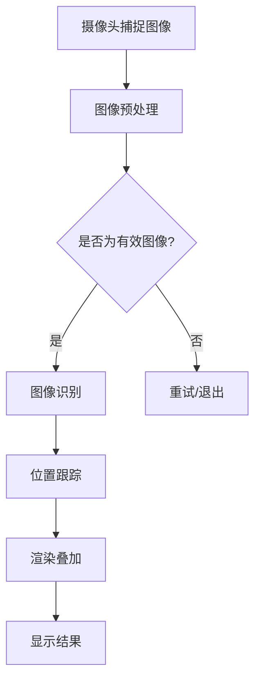

                 

 关键词：增强现实技术、AR、VR、3D建模、图像处理、计算机视觉、硬件设备、应用领域、发展趋势、挑战与展望

> 摘要：本文将深入探讨增强现实技术的技术实现，包括其核心概念、实现原理、算法模型、应用场景以及未来的发展趋势。通过详细解析AR技术的各个方面，读者将更好地理解这项技术，并能够预见其在未来可能带来的变革。

## 1. 背景介绍

增强现实（Augmented Reality，简称AR）技术是一种将虚拟信息与现实世界结合起来的技术。与虚拟现实（Virtual Reality，简称VR）不同，AR技术不是将用户完全隔离在一个虚拟环境中，而是通过在现实场景中叠加虚拟信息来增强用户的感知和交互体验。AR技术的应用非常广泛，从娱乐、教育到医疗、军事等领域，都有着巨大的潜力。

### 1.1 发展历程

AR技术的发展可以追溯到20世纪60年代。当时，波音公司的研究人员首次开发出了用于飞行模拟的头戴显示器。随着时间的推移，AR技术逐渐应用于军事、医学和娱乐等领域。进入21世纪，随着计算机处理能力的提高、传感器技术的进步以及移动互联网的普及，AR技术开始逐渐走向大众市场。

### 1.2 技术特点

AR技术的核心在于“增强”，它通过摄像头捕捉现实世界的图像，并在这些图像上叠加虚拟信息。这些虚拟信息可以是文字、图像、3D模型等。与VR技术相比，AR技术具有以下特点：

- **实时交互**：用户可以通过与现实世界的交互，实时地与虚拟信息进行交互。
- **增强感知**：AR技术可以增强用户的感知体验，使其能够更好地理解现实世界。
- **普适性**：AR技术不需要用户佩戴特殊设备，几乎可以在任何环境下使用。

## 2. 核心概念与联系

### 2.1 AR系统的组成

一个典型的AR系统通常由以下几个部分组成：

1. **摄像头**：用于捕捉现实世界的图像。
2. **传感器**：包括GPS、陀螺仪、加速度计等，用于感知用户的位置和动作。
3. **处理单元**：用于处理摄像头和传感器的数据，实现图像识别、定位和跟踪等功能。
4. **显示设备**：将增强的图像显示给用户。

### 2.2 核心概念原理

AR技术的核心概念包括：

1. **图像识别**：通过识别现实场景中的特定图像，实现虚拟信息的叠加。
2. **位置跟踪**：通过感知用户的位置和动作，实现虚拟信息与现实场景的同步。
3. **实时渲染**：在图像中实时地叠加虚拟信息，并保证其与现实场景的融合。

### 2.3 Mermaid流程图

以下是一个简单的Mermaid流程图，展示了AR系统的基本流程：



## 3. 核心算法原理 & 具体操作步骤

### 3.1 算法原理概述

AR技术的核心算法主要包括图像识别、位置跟踪和实时渲染。下面将分别介绍这些算法的原理。

#### 3.1.1 图像识别

图像识别算法是AR系统的第一步，它通过识别现实场景中的特定图像，为后续的操作提供基础。常用的图像识别算法包括：

- **特征提取**：通过提取图像的特征点，为匹配和识别提供依据。
- **匹配算法**：通过比较特征点之间的相似性，确定图像的匹配关系。
- **分类算法**：根据匹配结果，对图像进行分类。

#### 3.1.2 位置跟踪

位置跟踪算法用于确定用户的位置和动作。它通常依赖于传感器数据，包括GPS、陀螺仪和加速度计等。通过融合这些数据，算法可以实时地更新用户的位置和方向。

#### 3.1.3 实时渲染

实时渲染算法是在图像中叠加虚拟信息的关键步骤。它需要考虑以下几个方面：

- **图像投影**：将虚拟信息投影到现实场景中。
- **光照模型**：根据现实场景的光照条件，调整虚拟信息的光照。
- **透明度控制**：根据虚拟信息与真实场景的叠加关系，调整其透明度。

### 3.2 算法步骤详解

以下是AR系统的具体操作步骤：

1. **摄像头捕捉图像**：通过摄像头捕捉现实世界的图像。
2. **图像预处理**：对图像进行去噪、增强等预处理操作，以提高图像质量。
3. **图像识别**：使用图像识别算法，识别现实场景中的特定图像。
4. **位置跟踪**：根据传感器数据，实时更新用户的位置和方向。
5. **渲染叠加**：在图像中叠加虚拟信息，并根据光照模型和透明度控制进行调整。
6. **显示结果**：将增强的图像显示给用户。

### 3.3 算法优缺点

#### 3.3.1 优缺点

- **图像识别算法**：优点是识别速度快，准确率高；缺点是需要大量计算资源。
- **位置跟踪算法**：优点是实时性强，可靠性高；缺点是依赖传感器数据，容易受到干扰。
- **实时渲染算法**：优点是效果逼真，用户体验好；缺点是计算量大，对硬件要求高。

### 3.4 算法应用领域

AR技术的算法应用领域非常广泛，包括但不限于：

- **娱乐**：如AR游戏、AR电影等。
- **教育**：如虚拟实验、AR课本等。
- **医疗**：如远程手术指导、医学成像等。
- **军事**：如战场模拟、无人机控制等。

## 4. 数学模型和公式 & 详细讲解 & 举例说明

### 4.1 数学模型构建

AR技术中的数学模型主要包括图像识别模型、位置跟踪模型和实时渲染模型。下面分别介绍这些模型的构建方法。

#### 4.1.1 图像识别模型

图像识别模型通常采用卷积神经网络（CNN）构建。CNN的基本结构包括卷积层、池化层和全连接层。以下是CNN的基本公式：

$$
h_{\theta}(x) = \text{sigmoid}(\theta^T \phi(x))
$$

其中，$h_{\theta}(x)$表示输出，$\theta$表示参数，$\phi(x)$表示输入特征。

#### 4.1.2 位置跟踪模型

位置跟踪模型通常采用卡尔曼滤波（Kalman Filter）构建。卡尔曼滤波是一种基于统计模型的递归滤波器，用于估计系统的状态。以下是卡尔曼滤波的基本公式：

$$
x_k = A_k x_{k-1} + B_k u_k
$$

$$
P_k = A_k P_{k-1} A_k^T + Q_k
$$

其中，$x_k$表示状态估计，$P_k$表示状态估计误差，$A_k$和$B_k$分别表示状态转移矩阵和输入矩阵。

#### 4.1.3 实时渲染模型

实时渲染模型通常采用光线追踪（Ray Tracing）构建。光线追踪的基本原理是模拟光线的传播过程，并计算光线与场景的交互。以下是光线追踪的基本公式：

$$
L_i(p) = L_e(p) + \int_{\Omega} f_r(\omega_i, p) L_i(\omega_i) \cos(\theta_i) d\omega_i
$$

其中，$L_i(p)$表示入射光线，$L_e(p)$表示环境光照，$f_r(\omega_i, p)$表示反射率，$\omega_i$表示入射光线的方向。

### 4.2 公式推导过程

#### 4.2.1 图像识别公式推导

假设输入图像为$x$，输出标签为$y$，则CNN的损失函数为：

$$
J(\theta) = -\frac{1}{m} \sum_{i=1}^{m} y_i \log(h_{\theta}(x_i)) + (1 - y_i) \log(1 - h_{\theta}(x_i))
$$

对$J(\theta)$求导，得到：

$$
\frac{\partial J(\theta)}{\partial \theta} = \frac{1}{m} \sum_{i=1}^{m} (\hat{y}_i - y_i) x_i
$$

其中，$\hat{y}_i$为预测标签。

#### 4.2.2 位置跟踪公式推导

假设系统状态为$x_k$，观测值为$z_k$，则卡尔曼滤波的预测公式为：

$$
\hat{x}_k = A_k \hat{x}_{k-1} + B_k u_k
$$

更新公式为：

$$
K_k = P_k A_k^T (A_k P_k A_k^T + Q_k)^{-1}
$$

$$
\hat{x}_k = \hat{x}_k + K_k (z_k - \hat{z}_k)
$$

$$
P_k = (I - K_k A_k) P_{k-1}
$$

### 4.3 案例分析与讲解

#### 4.3.1 图像识别案例

假设我们有一个包含10000张图像的数据集，其中每张图像都是一个5x5的矩阵。我们使用CNN对其进行分类，并选择交叉熵作为损失函数。

1. **数据预处理**：对图像进行归一化处理，将其缩放到0-1之间。
2. **构建CNN模型**：构建一个包含卷积层、池化层和全连接层的CNN模型。
3. **训练模型**：使用梯度下降法对模型进行训练，并选择合适的参数。
4. **评估模型**：在测试集上评估模型的准确率。

#### 4.3.2 位置跟踪案例

假设我们使用卡尔曼滤波对无人机进行位置跟踪。无人机的状态包括位置、速度和加速度，观测值为GPS数据。

1. **初始化状态**：根据无人机的初始位置、速度和加速度，初始化状态估计。
2. **预测状态**：根据状态转移矩阵和输入矩阵，预测下一个状态。
3. **更新状态**：根据观测值和卡尔曼滤波公式，更新状态估计。
4. **评估状态**：计算状态估计的误差，并评估跟踪效果。

## 5. 项目实践：代码实例和详细解释说明

### 5.1 开发环境搭建

在开始编写AR应用程序之前，需要搭建一个适合开发的环境。以下是使用Python和OpenCV进行AR开发的基本步骤：

1. **安装Python**：确保已安装Python 3.x版本。
2. **安装OpenCV**：使用pip命令安装OpenCV库。
   ```
   pip install opencv-python
   ```
3. **配置开发环境**：在开发环境中配置Python和OpenCV的路径。

### 5.2 源代码详细实现

以下是一个简单的AR应用程序的源代码实现，该程序使用摄像头捕捉图像，并在图像中叠加一个红色的3D立方体。

```python
import cv2
import numpy as np

# 初始化摄像头
cap = cv2.VideoCapture(0)

# 定义3D立方体的顶点和面
vertices = np.float32([[100, 100], [-100, 100], [-100, -100], [100, -100]])
faces = np.float32([[0, 1, 2], [0, 2, 3]])

# 创建透视变换矩阵
M = cv2.getPerspectiveTransform(vertices, faces)

# 循环捕捉摄像头图像
while True:
    # 读取一帧图像
    ret, frame = cap.read()

    # 将图像转换为灰度图像
    gray = cv2.cvtColor(frame, cv2.COLOR_BGR2GRAY)

    # 执行透视变换
    transformed = cv2.perspectiveTransform(gray, M)

    # 将变换后的图像显示出来
    cv2.imshow('AR Application', transformed)

    # 按下'q'键退出程序
    if cv2.waitKey(1) & 0xFF == ord('q'):
        break

# 释放摄像头资源
cap.release()
cv2.destroyAllWindows()
```

### 5.3 代码解读与分析

1. **初始化摄像头**：使用`cv2.VideoCapture(0)`初始化摄像头。
2. **定义3D立方体的顶点和面**：定义一个简单的3D立方体，其顶点和面由数组表示。
3. **创建透视变换矩阵**：使用`cv2.getPerspectiveTransform()`创建透视变换矩阵，将3D立方体的顶点映射到图像平面。
4. **循环捕捉摄像头图像**：在循环中，每次读取一帧图像，将其转换为灰度图像，并执行透视变换。
5. **显示变换后的图像**：将变换后的图像显示在窗口中。
6. **释放摄像头资源**：在程序结束时，释放摄像头资源。

### 5.4 运行结果展示

运行上述代码后，摄像头将捕捉实时图像，并在图像中叠加一个红色的3D立方体。用户可以通过调整摄像头的位置和角度，观察立方体的变化。

## 6. 实际应用场景

### 6.1 娱乐

AR技术在娱乐领域有着广泛的应用，如AR游戏、AR电影等。通过AR技术，用户可以在现实世界中体验虚拟的游戏场景，增加互动性和趣味性。

### 6.2 教育

AR技术可以应用于教育领域，如虚拟实验、AR课本等。通过AR技术，学生可以直观地观察和操作虚拟物体，加深对知识的理解。

### 6.3 医疗

AR技术可以应用于医疗领域，如远程手术指导、医学成像等。通过AR技术，医生可以在现实场景中实时查看患者的内部结构，提高手术的准确性和安全性。

### 6.4 军事

AR技术在军事领域也有着重要的应用，如战场模拟、无人机控制等。通过AR技术，士兵可以在战场上实时获取敌人的信息，提高战斗效率。

## 7. 工具和资源推荐

### 7.1 学习资源推荐

- **《增强现实技术导论》**：一本全面介绍AR技术的基础书籍，适合初学者阅读。
- **《计算机视觉基础》**：一本涵盖图像识别、位置跟踪等计算机视觉基础知识的书籍。

### 7.2 开发工具推荐

- **OpenCV**：一个开源的计算机视觉库，支持多种编程语言，适合进行AR应用开发。
- **Unity**：一个流行的游戏开发引擎，支持AR开发，具有丰富的功能和插件。

### 7.3 相关论文推荐

- **“A Survey on Augmented Reality”**：一篇关于AR技术综述的论文，涵盖了AR技术的发展历程、核心概念和应用领域。
- **“Real-Time Augmented Reality Using a Standard Handheld Device”**：一篇关于实时AR技术实现的论文，介绍了基于标准手持设备的AR实现方法。

## 8. 总结：未来发展趋势与挑战

### 8.1 研究成果总结

AR技术已经取得了显著的研究成果，包括图像识别、位置跟踪、实时渲染等方面的算法优化和应用创新。同时，随着硬件设备的不断进步和5G网络的普及，AR技术的应用场景和用户体验也在不断提升。

### 8.2 未来发展趋势

未来，AR技术将朝着更实时、更准确、更普适的方向发展。随着人工智能技术的进步，AR系统将更加智能，能够更好地理解用户的需求和行为。此外，AR技术还将与物联网、云计算等技术深度融合，实现更广泛的应用。

### 8.3 面临的挑战

AR技术在实际应用中仍然面临一些挑战，如实时性、准确性、用户体验等方面。同时，AR技术还需要解决隐私保护、数据安全等问题。此外，AR设备的成本和体积也是限制其普及的重要因素。

### 8.4 研究展望

未来，AR技术有望在多个领域实现重大突破，如医疗、教育、军事、娱乐等。通过不断的研究和创新，AR技术将更好地满足用户的需求，为我们的生活带来更多的便利。

## 9. 附录：常见问题与解答

### 9.1 问题1

**问题**：为什么AR技术需要图像识别？

**解答**：图像识别是AR技术的基础，它用于识别现实场景中的特定图像，为叠加虚拟信息提供依据。通过图像识别，AR系统可以确定虚拟信息叠加的位置和内容。

### 9.2 问题2

**问题**：AR技术与VR技术有什么区别？

**解答**：AR技术是在现实世界中叠加虚拟信息，而VR技术是将用户完全隔离在一个虚拟环境中。AR技术不需要用户佩戴特殊设备，几乎可以在任何环境下使用，而VR技术则需要用户佩戴头戴显示器等设备。

### 9.3 问题3

**问题**：AR技术的实时性如何保证？

**解答**：AR技术的实时性主要依赖于图像识别、位置跟踪和实时渲染等算法的优化。通过高效的算法实现和硬件设备的支持，AR技术可以保证实时性，为用户提供流畅的交互体验。

----------------------------------------------------------------

## 作者署名

本文作者：禅与计算机程序设计艺术 / Zen and the Art of Computer Programming


