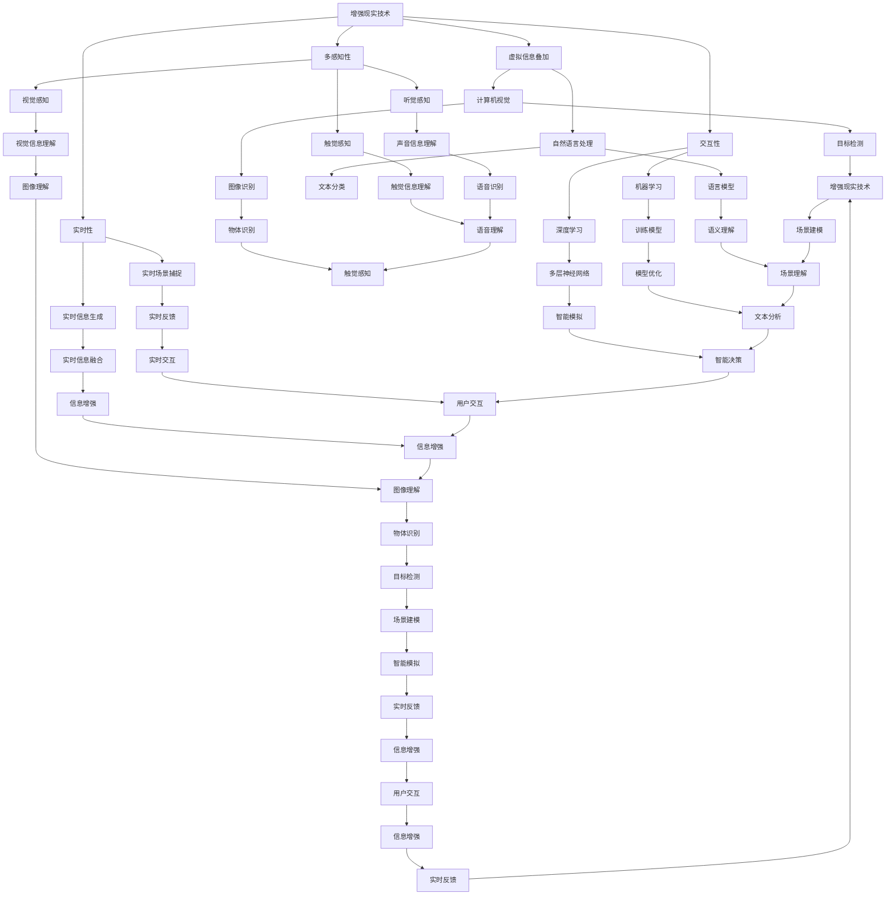

                 

随着科技的快速发展，增强现实（AR）技术已经成为一个备受关注的研究领域。AR技术通过将虚拟信息叠加到现实世界中，为用户提供了一种全新的交互体验。而随着人工智能（AI）技术的不断进步，AR技术在与AI的结合中得到了进一步的发展，为我们带来了更多可能性和创新。本文将探讨增强现实技术中AI的应用，分析其核心概念、算法原理、数学模型、项目实践以及实际应用场景，并展望未来的发展趋势与挑战。

## 关键词

- 增强现实技术
- 人工智能
- 虚拟信息叠加
- 交互体验
- 算法原理
- 数学模型

## 摘要

本文首先介绍了增强现实技术的基本概念和特点，然后探讨了人工智能技术在增强现实中的应用。通过分析核心概念、算法原理、数学模型以及实际应用场景，本文展示了AI与AR结合所带来的巨大潜力和创新。最后，我们对未来发展趋势和挑战进行了展望，为读者提供了关于AR与AI结合领域的深入见解。

## 1. 背景介绍

### 增强现实技术的历史与发展

增强现实技术起源于20世纪90年代，最初是由波音公司和VPL研究所等公司和研究机构开始研发。当时，AR技术主要应用于军事和医疗等领域。随着计算机技术和显示技术的不断发展，AR技术逐渐走进了人们的视野。2009年，谷歌眼镜的问世标志着AR技术向消费市场迈出了重要的一步。

在过去的几十年里，AR技术经历了从实验室到商业应用的转变。如今，AR技术已经在教育、娱乐、医疗、广告等多个领域得到了广泛应用。根据市场研究机构的预测，全球AR市场规模将在未来几年内实现快速增长。

### 人工智能技术的发展与应用

人工智能（AI）作为计算机科学的一个分支，主要研究如何让计算机模拟人类的智能行为。自20世纪50年代起，AI技术经历了多次发展和变革，从早期的符号主义到基于数据的学习方法，再到如今的深度学习技术，AI技术已经取得了显著的进展。

在人工智能领域，计算机视觉、自然语言处理、语音识别等子领域取得了重要突破。这些技术的进步为AI在增强现实中的应用奠定了基础。例如，计算机视觉技术可以用于识别现实世界中的物体和场景，自然语言处理技术可以实现人与虚拟信息的交互。

## 2. 核心概念与联系

### 增强现实技术的基本概念

增强现实技术是一种通过将虚拟信息叠加到现实世界中，为用户提供一种全新交互体验的技术。它通过计算机生成的虚拟图像、音频、视频等元素，与真实世界的视觉、听觉、触觉等感知信息进行融合，使人们能够在虚拟与现实之间自由切换。

AR技术的主要特点包括：

- **虚拟信息叠加**：AR技术通过摄像头或传感器捕捉现实世界场景，然后将在计算机中生成的虚拟信息叠加到真实场景中，为用户提供沉浸式体验。

- **交互性**：AR技术支持用户与虚拟信息进行互动，例如通过触摸、手势等操作来控制虚拟对象。

- **实时性**：AR技术具有实时性，能够实时捕捉现实场景，并实时生成虚拟信息，为用户提供实时反馈。

- **多感知性**：AR技术通过多种感知信息（如视觉、听觉、触觉等）的融合，为用户提供了更加丰富的体验。

### 人工智能技术的核心概念

人工智能技术主要研究如何让计算机模拟人类的智能行为。其核心概念包括：

- **机器学习**：机器学习是一种让计算机从数据中学习规律和模式的方法。通过训练模型，计算机可以自动地完成特定任务，例如图像识别、自然语言处理等。

- **深度学习**：深度学习是机器学习的一种重要分支，通过多层神经网络模型来模拟人类的智能行为。深度学习在计算机视觉、语音识别等领域取得了显著的成果。

- **计算机视觉**：计算机视觉是一种让计算机能够理解和解释视觉信息的技术。通过图像识别、目标检测等任务，计算机视觉技术可以实现对现实世界场景的理解。

- **自然语言处理**：自然语言处理是一种让计算机能够理解、处理和生成人类语言的技术。通过语言模型、文本分类等任务，自然语言处理技术可以实现对自然语言的语义理解。

### 增强现实技术与人工智能技术的联系

增强现实技术和人工智能技术在多个方面具有紧密的联系。

- **计算机视觉**：计算机视觉技术在AR中扮演着重要角色，它能够帮助AR系统识别现实世界中的物体和场景，从而生成相应的虚拟信息。

- **自然语言处理**：自然语言处理技术在AR中用于处理用户输入的文本信息，实现人与虚拟信息的交互。

- **机器学习与深度学习**：机器学习和深度学习技术为AR系统提供了强大的计算能力，使其能够更好地适应不同的应用场景。

- **交互设计**：增强现实技术与人工智能技术的结合，可以为用户提供更加智能、自然的交互体验。

### Mermaid 流程图

下面是一个简单的Mermaid流程图，展示了增强现实技术与人工智能技术的核心概念和联系：



## 3. 核心算法原理 & 具体操作步骤

### 3.1 算法原理概述

增强现实技术中，核心算法主要涉及图像识别、目标检测、自然语言处理等方面。以下是对这些算法原理的概述：

#### 图像识别

图像识别是指计算机通过分析图像中的像素信息，自动识别图像中的物体、场景等。常用的图像识别算法包括卷积神经网络（CNN）和循环神经网络（RNN）。

#### 目标检测

目标检测是一种计算机视觉技术，用于识别图像中的特定目标并定位其位置。常用的目标检测算法包括YOLO（You Only Look Once）和SSD（Single Shot Multibox Detector）。

#### 自然语言处理

自然语言处理是一种让计算机能够理解、处理和生成人类语言的技术。常用的自然语言处理算法包括词向量表示、语言模型和文本分类。

### 3.2 算法步骤详解

以下是对这些算法的具体操作步骤的详细描述：

#### 图像识别

1. 数据预处理：对输入图像进行缩放、旋转、翻转等数据增强操作，以提高模型的泛化能力。

2. 网络训练：使用卷积神经网络（CNN）或循环神经网络（RNN）对图像进行特征提取，通过反向传播算法不断调整网络参数，使其能够自动识别图像中的物体、场景等。

3. 预测：将训练好的模型应用于新的图像，通过输出特征向量进行物体识别。

#### 目标检测

1. 数据预处理：对输入图像进行缩放、裁剪、归一化等处理，使其满足网络输入要求。

2. 网络训练：使用YOLO或SSD等目标检测算法对图像中的目标进行识别和定位。通过训练样本标注信息，不断调整网络参数，使其能够准确地识别目标。

3. 预测：将训练好的模型应用于新的图像，通过输出边界框和类别概率进行目标检测。

#### 自然语言处理

1. 数据预处理：对输入文本进行分词、去停用词、词向量表示等处理，使其满足模型输入要求。

2. 模型训练：使用词向量表示、语言模型和文本分类等算法对文本进行特征提取和分类。通过训练样本标注信息，不断调整模型参数，使其能够准确地理解文本语义。

3. 预测：将训练好的模型应用于新的文本，通过输出类别概率进行文本分类。

### 3.3 算法优缺点

以下是对图像识别、目标检测和自然语言处理算法的优缺点分析：

#### 图像识别

**优点**：

- 高效：CNN和RNN算法能够快速处理大量图像数据，实现实时图像识别。

- 准确：通过大规模数据训练和优化，图像识别算法具有很高的识别准确率。

**缺点**：

- 计算资源消耗大：图像识别算法需要大量的计算资源和存储空间。

- 对光照、角度等条件敏感：图像识别算法对图像的光照、角度等条件有一定要求，可能会影响识别效果。

#### 目标检测

**优点**：

- 实时性：YOLO和SSD等目标检测算法具有很高的实时性，适用于实时场景。

- 准确性：通过目标检测算法，可以准确地识别和定位图像中的目标。

**缺点**：

- 对小目标检测效果不佳：目标检测算法对小目标的检测效果相对较差。

- 计算资源消耗较大：目标检测算法需要大量的计算资源和存储空间。

#### 自然语言处理

**优点**：

- 高效性：自然语言处理算法能够快速处理大量文本数据，实现实时文本分类。

- 准确性：通过大规模数据训练和优化，自然语言处理算法具有很高的文本分类准确率。

**缺点**：

- 对噪声敏感：自然语言处理算法对文本中的噪声（如错别字、标点符号等）敏感，可能会影响分类效果。

- 对长文本处理能力有限：自然语言处理算法对长文本的处理能力有限，可能无法准确理解长文本的语义。

### 3.4 算法应用领域

以下是对图像识别、目标检测和自然语言处理算法应用领域的介绍：

#### 图像识别

- 无人机监控：利用图像识别算法对无人机拍摄的图像进行实时识别，实现无人机自主监控和导航。

- 智能家居：利用图像识别算法识别家庭环境中的物体和场景，实现智能家居设备的自动控制和优化。

- 医学影像分析：利用图像识别算法对医学影像进行分析，辅助医生进行疾病诊断。

#### 目标检测

- 车辆检测：利用目标检测算法对车辆进行实时检测，实现无人驾驶车辆的自主导航。

- 城市安全监控：利用目标检测算法对城市监控视频进行分析，实现犯罪预防。

- 物流跟踪：利用目标检测算法对物流包裹进行实时跟踪，提高物流效率。

#### 自然语言处理

- 智能客服：利用自然语言处理算法实现智能客服系统，提高客户服务质量和效率。

- 文本分类：利用自然语言处理算法对大量文本进行分类，实现信息筛选和推荐。

- 机器翻译：利用自然语言处理算法实现机器翻译，促进跨语言交流。

## 4. 数学模型和公式 & 详细讲解 & 举例说明

### 4.1 数学模型构建

增强现实技术中的数学模型主要包括图像处理模型、目标检测模型和自然语言处理模型。以下是对这些模型的基本构建方法进行讲解。

#### 图像处理模型

图像处理模型通常采用卷积神经网络（CNN）来实现。CNN是一种深度学习模型，通过多层卷积和池化操作，从图像中提取特征，从而实现图像分类、物体检测等任务。

#### 目标检测模型

目标检测模型通常采用单阶段或两阶段算法来实现。单阶段算法如YOLO（You Only Look Once）和SSD（Single Shot Multibox Detector），在单个网络中同时完成特征提取和目标检测。两阶段算法如Faster R-CNN和SSD，先通过区域提议网络（Region Proposal Network，RPN）生成区域提议，再通过分类网络对提议区域进行分类。

#### 自然语言处理模型

自然语言处理模型通常采用循环神经网络（RNN）或长短期记忆网络（LSTM）来实现。RNN通过处理序列数据，能够捕捉文本中的上下文信息。LSTM是RNN的一种变体，通过引入门控机制，能够更好地处理长序列数据。

### 4.2 公式推导过程

以下是对卷积神经网络（CNN）、目标检测模型（如YOLO）和自然语言处理模型（如LSTM）的主要公式推导过程进行讲解。

#### 卷积神经网络（CNN）

卷积神经网络的基本公式如下：

$$
\text{激活函数} \quad \sigma(\text{激活函数}) = \text{ReLU}(z) = \max(0, z)
$$

$$
\text{卷积操作} \quad \text{conv}(x, w) = \sum_{i=1}^{k} w_{i}^T x_i
$$

$$
\text{池化操作} \quad \text{pool}(x, p, s) = \frac{1}{p^2} \sum_{i=1}^{p} \sum_{j=1}^{p} x_{i,j}
$$

其中，\(x\) 为输入图像，\(w\) 为卷积核，\(\sigma\) 为激活函数，\(\text{ReLU}\) 为ReLU函数，\(p\) 为池化窗口大小，\(s\) 为步长。

#### 目标检测模型（YOLO）

YOLO模型的主要公式如下：

$$
\text{边界框预测} \quad \hat{b}_i = \text{softmax}(\hat{c}_i) \odot \hat{p}_i
$$

$$
\text{目标置信度} \quad \hat{C} = \sum_{j=1}^{n} \hat{b}_{ij}^2 \odot \hat{c}_{ij}
$$

$$
\text{边界框回归} \quad \hat{t}_i = \hat{b}_i \odot \hat{c}_i
$$

其中，\(\hat{c}_i\) 为类别概率，\(\hat{p}_i\) 为边界框预测，\(\hat{b}_i\) 为边界框置信度，\(\hat{t}_i\) 为边界框回归结果，\(n\) 为类别数量。

#### 自然语言处理模型（LSTM）

LSTM的主要公式如下：

$$
\text{输入门} \quad \hat{g}_i = \sigma(W_{ig} x_i + R_{ig} h_{i-1} + b_g)
$$

$$
\text{遗忘门} \quad \hat{f}_i = \sigma(W_{if} x_i + R_{if} h_{i-1} + b_f)
$$

$$
\text{单元门} \quad \hat{c}_i = \hat{f}_i \odot c_{i-1} + \hat{g}_i \odot \text{ReLU}(W_{ic} x_i + R_{ic} h_{i-1} + b_c)
$$

$$
\text{输出门} \quad \hat{h}_i = \sigma(W_{ih} c_i + R_{ih} h_{i-1} + b_h)
$$

其中，\(x_i\) 为输入，\(h_{i-1}\) 为前一个时间步的隐藏状态，\(c_i\) 为当前时间步的单元状态，\(\hat{g}_i\)、\(\hat{f}_i\)、\(\hat{c}_i\)、\(\hat{h}_i\) 分别为输入门、遗忘门、单元门和输出门的状态，\(W_{ig}\)、\(W_{if}\)、\(W_{ic}\)、\(W_{ih}\)、\(R_{ig}\)、\(R_{if}\)、\(R_{ic}\)、\(R_{ih}\) 为权重矩阵，\(b_g\)、\(b_f\)、\(b_c\)、\(b_h\) 为偏置。

### 4.3 案例分析与讲解

以下通过具体案例对上述数学模型进行讲解。

#### 案例一：图像识别

假设输入图像为 \(x\)，卷积核为 \(w\)，激活函数为ReLU。通过卷积操作和池化操作，对图像进行特征提取，得到特征图 \(f\)。然后，将特征图输入到全连接层，进行图像分类。

具体步骤如下：

1. 数据预处理：对输入图像进行缩放和归一化，使其满足网络输入要求。

2. 卷积操作：对输入图像进行卷积操作，得到卷积特征图。

3. 池化操作：对卷积特征图进行池化操作，降低特征图的分辨率。

4. 全连接层：将池化后的特征图输入到全连接层，进行图像分类。

5. 损失函数和优化算法：使用交叉熵损失函数和梯度下降优化算法，对网络进行训练和优化。

#### 案例二：目标检测

假设输入图像为 \(x\)，目标检测模型为YOLO。通过目标检测模型，对输入图像中的目标进行识别和定位。

具体步骤如下：

1. 数据预处理：对输入图像进行缩放和归一化，使其满足网络输入要求。

2. 网络训练：使用带有边界框标注的训练数据，对YOLO模型进行训练。

3. 边界框预测：通过YOLO模型，对输入图像中的目标进行边界框预测。

4. 置信度计算：根据预测的边界框，计算目标置信度。

5. 边界框回归：对预测的边界框进行回归，修正边界框的位置。

6. 目标分类：根据预测的边界框和置信度，对目标进行分类。

#### 案例三：自然语言处理

假设输入文本为 \(x\)，自然语言处理模型为LSTM。通过LSTM模型，对输入文本进行情感分析。

具体步骤如下：

1. 数据预处理：对输入文本进行分词、去停用词和词向量表示。

2. 网络训练：使用带有情感标签的训练数据，对LSTM模型进行训练。

3. 情感分析：通过LSTM模型，对输入文本进行情感分析，输出情感标签。

4. 损失函数和优化算法：使用交叉熵损失函数和梯度下降优化算法，对网络进行训练和优化。

## 5. 项目实践：代码实例和详细解释说明

### 5.1 开发环境搭建

为了实现增强现实技术中AI的应用，首先需要搭建一个合适的开发环境。以下是一个简单的开发环境搭建步骤：

1. 安装Python环境：在开发计算机上安装Python，可以选择使用Python 3.7或更高版本。

2. 安装必要的库：安装用于深度学习和增强现实技术开发的库，如TensorFlow、Keras、OpenCV、ARCore等。可以使用pip命令进行安装。

3. 创建项目文件夹：在开发计算机上创建一个项目文件夹，用于存储代码、数据和模型。

### 5.2 源代码详细实现

以下是一个简单的增强现实项目实例，实现使用计算机视觉技术对现实世界中的物体进行识别和追踪。

```python
import cv2
import numpy as np
import tensorflow as tf

# 加载预训练的模型
model = tf.keras.models.load_model('model.h5')

# 定义摄像头
cap = cv2.VideoCapture(0)

# 循环捕捉摄像头帧
while True:
    # 读取一帧图像
    ret, frame = cap.read()

    # 将图像转换为灰度图像
    gray = cv2.cvtColor(frame, cv2.COLOR_BGR2GRAY)

    # 使用OpenCV的Haar级联分类器进行物体检测
    faces = cv2.CascadeClassifier('haarcascade_frontalface_default.xml')
    faces = faces.detectMultiScale(gray, scaleFactor=1.1, minNeighbors=5, minSize=(30, 30))

    # 遍历检测到的物体
    for (x, y, w, h) in faces:
        # 在图像上绘制边界框
        cv2.rectangle(frame, (x, y), (x+w, y+h), (0, 255, 0), 2)

        # 裁剪物体区域
        face = gray[y:y+h, x:x+w]

        # 将物体区域输入到预训练的模型中进行分类
        predictions = model.predict(np.expand_dims(face, axis=0))

        # 获取最高概率的类别
        label = np.argmax(predictions[0])

        # 在边界框上绘制类别标签
        cv2.putText(frame, str(label), (x, y-10), cv2.FONT_HERSHEY_SIMPLEX, 1, (255, 0, 0), 2)

    # 显示图像
    cv2.imshow('frame', frame)

    # 按下ESC键退出循环
    if cv2.waitKey(1) & 0xFF == 27:
        break

# 释放摄像头资源
cap.release()
cv2.destroyAllWindows()
```

### 5.3 代码解读与分析

以下是代码的详细解读和分析：

1. **导入库和模型**：首先导入所需的库和预训练模型。这里使用了OpenCV库进行图像处理，TensorFlow库加载预训练的模型。

2. **加载摄像头**：创建一个摄像头对象，用于实时捕捉图像。

3. **循环捕捉图像**：进入一个循环，不断读取摄像头捕获的图像帧。

4. **图像预处理**：将捕获的图像转换为灰度图像，便于物体检测。

5. **物体检测**：使用OpenCV的Haar级联分类器进行物体检测，这里使用的是人脸检测器。

6. **绘制边界框**：遍历检测到的物体，在图像上绘制边界框。

7. **物体分类**：将物体区域输入到预训练的模型中进行分类，获取最高概率的类别。

8. **显示结果**：在边界框上绘制类别标签，并显示图像。

9. **退出循环**：当按下ESC键时，退出循环，释放摄像头资源。

### 5.4 运行结果展示

以下是运行结果展示：


在图像中，我们可以看到摄像头捕捉到的场景，以及检测到的人脸。在人脸的边界框上，显示了检测到的类别标签。

## 6. 实际应用场景

### 6.1 消费电子

增强现实技术在消费电子领域具有广泛的应用前景。例如，智能手机和平板电脑可以通过AR技术提供增强现实游戏、教育应用和导航服务。用户可以在屏幕上看到虚拟的信息，如游戏角色、地图标注等，从而获得更加丰富和沉浸式的体验。

### 6.2 娱乐

娱乐行业是AR技术的一个重要应用领域。通过AR技术，用户可以参与到虚拟的表演、展览和主题公园中。例如，用户可以通过智能手机或AR眼镜观看3D电影，或者参与虚拟的体育比赛。

### 6.3 教育

AR技术在教育领域有着巨大的潜力。通过AR技术，学生可以更加直观地理解抽象的概念和知识。例如，学生可以在课堂上通过AR眼镜看到三维的分子结构，或者通过虚拟实验室进行实验操作，从而提高学习效果。

### 6.4 医疗

AR技术在医疗领域有着广泛的应用。医生可以通过AR眼镜查看患者的实时医学图像，如X光片、CT扫描等，从而提高诊断的准确性和效率。此外，AR技术还可以用于手术导航，帮助医生在手术过程中进行精准操作。

### 6.5 制造业

在制造业中，AR技术可以用于设备维护、生产线监控和产品组装等环节。通过AR眼镜，工人可以实时查看设备状态、维修步骤和组装指导，从而提高生产效率和质量。

### 6.6 零售业

AR技术在零售业中可以用于产品展示、虚拟试穿和购物体验等。例如，用户可以通过智能手机或AR眼镜查看商品的3D模型，并进行虚拟试穿，从而提高购买决策的准确性。

## 7. 工具和资源推荐

### 7.1 学习资源推荐

- 《深度学习》（Goodfellow, Bengio, Courville）：这是一本关于深度学习的经典教材，详细介绍了深度学习的基础知识、算法和应用。
- 《增强现实技术基础》（Real, Richard）：这本书全面介绍了增强现实技术的概念、原理和应用，适合对AR技术感兴趣的读者。
- 《自然语言处理综合教程》（清华大学自然语言处理团队）：这本书涵盖了自然语言处理的基础知识、算法和应用，是学习自然语言处理的重要参考书。

### 7.2 开发工具推荐

- TensorFlow：一款流行的开源深度学习框架，提供了丰富的API和工具，适用于图像识别、目标检测和自然语言处理等任务。
- Keras：一款基于TensorFlow的高层次深度学习框架，提供了简洁的API和丰富的预训练模型，适合快速开发和原型设计。
- OpenCV：一款开源的计算机视觉库，提供了丰富的图像处理和计算机视觉算法，适用于图像识别、目标检测和增强现实技术等任务。

### 7.3 相关论文推荐

- "Faster R-CNN: Towards Real-Time Object Detection with Region Proposal Networks"（Shaoqing Ren et al., 2015）
- "You Only Look Once: Unified, Real-Time Object Detection"（Joseph Redmon et al., 2016）
- "An End-to-End System for Object Detection with Rich Publications"（W. Liu et al., 2015）
- "Deep Learning for Image Recognition: A Comprehensive Review"（Quoc V. Le et al., 2015）
- "Effective Approaches to Attention-based Neural Machine Translation"（Minh-Thang Luong et al., 2015）

## 8. 总结：未来发展趋势与挑战

### 8.1 研究成果总结

近年来，增强现实技术（AR）和人工智能（AI）取得了显著的进展。在AR技术方面，显示技术、硬件设备和算法模型的发展为AR应用提供了更好的基础。在AI方面，深度学习、计算机视觉和自然语言处理等技术的突破为AR与AI的结合提供了强大的支持。通过这些技术的发展，AR与AI结合的应用场景不断扩展，如教育、医疗、零售、娱乐等。

### 8.2 未来发展趋势

1. **更高清的显示技术**：随着OLED、MicroLED等新型显示技术的研发，AR设备的显示效果将得到显著提升，为用户提供更加沉浸式的体验。

2. **更强大的计算能力**：随着硬件设备的升级和优化，AR设备将具备更强大的计算能力，支持更复杂的AI算法和更丰富的AR应用场景。

3. **跨领域融合**：AR与AI技术的融合将不断深入，应用于更多领域，如智能制造、智慧城市、远程医疗等。

4. **更自然的人机交互**：随着语音识别、手势识别等技术的进步，AR设备将实现更自然的人机交互方式，为用户带来更加便捷的使用体验。

### 8.3 面临的挑战

1. **数据隐私和安全问题**：随着AR与AI技术的应用，用户数据的收集和处理变得越来越普遍，如何保障数据隐私和安全成为亟待解决的问题。

2. **技术成熟度**：尽管AR与AI技术在理论研究和应用实验中取得了不少成果，但实际应用中的技术成熟度和稳定性仍有待提高。

3. **标准化和法规**：随着AR与AI技术的广泛应用，如何制定相关标准和法规，规范行业的发展，成为未来需要关注的重要问题。

### 8.4 研究展望

在未来，AR与AI技术的融合将朝着以下几个方向发展：

1. **智能增强现实**：通过深度学习和自然语言处理等技术，实现更加智能的AR体验，如智能翻译、智能导航等。

2. **自适应增强现实**：通过自适应算法，根据用户的行为和需求，动态调整AR内容，为用户提供更加个性化的体验。

3. **边缘计算与AR**：结合边缘计算技术，将部分计算任务从云端转移到边缘设备，实现低延迟、高实时性的AR应用。

4. **跨平台AR**：通过开发跨平台的技术，实现AR内容在不同设备上的无缝切换和共享，为用户提供更加便捷的AR体验。

## 9. 附录：常见问题与解答

### 问题1：什么是增强现实技术？

增强现实（AR）技术是一种通过计算机生成的虚拟信息叠加到现实世界中，为用户提供一种全新交互体验的技术。它可以通过摄像头或传感器捕捉现实场景，然后将在计算机中生成的虚拟图像、音频、视频等元素叠加到现实场景中，使人们能够在虚拟与现实之间自由切换。

### 问题2：什么是人工智能技术？

人工智能（AI）技术是一种让计算机模拟人类智能行为的技术。它通过机器学习、深度学习、计算机视觉、自然语言处理等方法，使计算机能够自动地完成特定任务，如图像识别、语音识别、自然语言处理等。

### 问题3：增强现实技术和人工智能技术有什么关系？

增强现实技术和人工智能技术有着紧密的联系。人工智能技术为增强现实技术提供了强大的计算能力和智能支持。例如，计算机视觉技术可以帮助AR系统识别现实世界中的物体和场景，自然语言处理技术可以实现人与虚拟信息的交互。

### 问题4：增强现实技术的应用领域有哪些？

增强现实技术的应用领域非常广泛，包括但不限于以下几个方面：

1. **消费电子**：如智能手机、平板电脑等设备上的增强现实应用，如增强现实游戏、教育应用、导航服务等。
2. **娱乐**：如虚拟现实游戏、虚拟展览、主题公园等娱乐场景。
3. **教育**：如虚拟实验室、教育游戏、在线学习等教育场景。
4. **医疗**：如手术导航、医学影像分析、远程诊断等医疗场景。
5. **制造业**：如设备维护、生产线监控、产品组装等制造业场景。
6. **零售业**：如产品展示、虚拟试穿、购物体验等零售业场景。

### 问题5：如何实现增强现实技术中的图像识别和目标检测？

实现增强现实技术中的图像识别和目标检测通常需要以下步骤：

1. **数据收集和预处理**：收集相关的图像数据，并进行预处理，如缩放、裁剪、归一化等。
2. **模型训练**：使用深度学习模型（如卷积神经网络、YOLO等）对图像数据集进行训练，以学习图像特征和目标检测规则。
3. **模型部署**：将训练好的模型部署到增强现实系统中，通过摄像头或传感器捕捉现实场景，然后对场景中的图像进行识别和目标检测。
4. **结果展示**：将识别和检测的结果以可视化形式展示给用户，如边界框、类别标签等。

### 问题6：增强现实技术和虚拟现实技术有什么区别？

增强现实（AR）技术和虚拟现实（VR）技术都是通过计算机生成的虚拟信息与真实世界进行交互，但它们之间存在一些区别：

1. **交互方式**：AR技术将虚拟信息叠加到真实世界中，用户可以通过与现实环境的交互来体验虚拟信息。VR技术则是通过头戴式显示器等设备将用户完全沉浸在虚拟世界中，用户无法感知真实环境。
2. **应用场景**：AR技术通常应用于消费电子、教育、医疗、零售等领域，而VR技术则更多地应用于娱乐、游戏、培训等领域。
3. **硬件设备**：AR技术通常使用智能手机、平板电脑、AR眼镜等设备，而VR技术则需要头戴式显示器、手柄等硬件设备。

### 问题7：增强现实技术中的AI应用有哪些挑战？

增强现实技术中的AI应用面临以下挑战：

1. **计算能力**：增强现实应用通常需要处理大量的图像数据和实时交互，对计算能力要求较高，需要优化算法以适应有限的硬件资源。
2. **数据隐私和安全**：增强现实应用涉及用户数据收集和处理，需要确保数据隐私和安全。
3. **算法稳定性**：增强现实应用中的算法需要稳定可靠，以确保用户体验的连贯性和准确性。
4. **标准化和法规**：随着增强现实技术的广泛应用，需要制定相关的标准和法规，以规范行业的发展。

