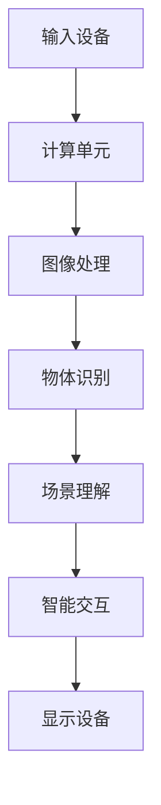

                 

关键词：增强现实（AR），人工智能（AI），应用案例，深度学习，图像处理，增强现实应用，虚拟现实，交互设计，智能眼镜，物体识别，场景理解，算法优化，软件开发。

> 摘要：本文将探讨增强现实（AR）技术与人工智能（AI）的深度融合，通过具体的应用案例，详细分析AI在增强现实领域的关键作用，并展望未来的发展趋势与挑战。

## 1. 背景介绍

增强现实（Augmented Reality，AR）是一种将虚拟信息与现实世界融合的技术，通过计算机生成图像、声音、视频等虚拟信息，叠加到真实环境中，从而提供一种新的感知和交互方式。随着计算机技术、图像处理技术、传感器技术的快速发展，增强现实技术在各个领域得到了广泛应用，包括教育、医疗、军事、娱乐等。

人工智能（Artificial Intelligence，AI）则是一种模拟人类智能的技术，通过机器学习、深度学习、自然语言处理等技术，使计算机能够实现自主学习和智能决策。AI技术已经在各个领域产生了深远的影响，尤其在图像识别、语音识别、推荐系统等方面取得了显著的成果。

随着增强现实技术的成熟和AI技术的发展，二者开始深度融合，形成了一种新的技术趋势——智能增强现实（Smart Augmented Reality）。智能增强现实不仅能够提供更为丰富和互动的虚拟信息，还能够通过AI算法实现实时场景理解、智能交互等高级功能。

本文将围绕这一技术趋势，探讨AI在增强现实领域中的应用案例，分析其核心算法原理、应用场景、未来发展趋势和挑战。

## 2. 核心概念与联系

### 2.1 增强现实（AR）技术

增强现实（AR）技术的基本原理是将虚拟信息叠加到真实环境中，使虚拟信息和真实环境相互融合。AR系统通常包括以下几个核心组件：

1. **输入设备**：如摄像头、传感器等，用于捕捉真实环境的信息。
2. **显示设备**：如头戴显示器（HMD）、智能眼镜等，用于显示虚拟信息。
3. **计算单元**：用于处理输入信息，生成虚拟信息，并控制显示设备的输出。
4. **算法与模型**：用于实现图像处理、物体识别、场景理解等功能。

### 2.2 人工智能（AI）技术

人工智能（AI）技术是模拟人类智能的技术，包括机器学习、深度学习、自然语言处理等。在增强现实领域，AI技术主要用于以下几个方面：

1. **图像识别**：通过机器学习算法，实现对图像中的物体、场景、文字等的识别。
2. **物体跟踪**：通过计算机视觉技术，实现对真实环境中物体的实时跟踪。
3. **场景理解**：通过对图像和传感器数据的分析，实现对场景的智能理解。
4. **智能交互**：通过自然语言处理等技术，实现人与虚拟信息的智能交互。

### 2.3 Mermaid 流程图

下面是一个简单的Mermaid流程图，展示了增强现实技术中的核心组件和AI技术的作用。



## 3. 核心算法原理 & 具体操作步骤

### 3.1 算法原理概述

在增强现实技术中，AI算法的核心作用在于实现图像处理、物体识别和场景理解等功能。以下是这些算法的基本原理：

1. **图像处理**：通过图像处理算法，对捕获的图像数据进行预处理，如去噪、增强、分割等。
2. **物体识别**：利用深度学习算法，对图像中的物体进行识别和分类，如卷积神经网络（CNN）。
3. **物体跟踪**：通过计算机视觉算法，实现对真实环境中物体的实时跟踪，如光流法、Kalman滤波等。
4. **场景理解**：通过对图像和传感器数据的综合分析，实现对场景的智能理解，如语义分割、场景重建等。
5. **智能交互**：通过自然语言处理算法，实现人与虚拟信息的智能交互，如语音识别、对话系统等。

### 3.2 算法步骤详解

下面是增强现实技术中AI算法的具体操作步骤：

1. **输入设备捕获图像**：使用摄像头等输入设备捕获真实环境中的图像。
2. **图像预处理**：对捕获的图像进行预处理，如去噪、增强、分割等。
3. **物体识别**：利用深度学习算法，对预处理后的图像进行物体识别，输出识别结果。
4. **物体跟踪**：对识别出的物体进行实时跟踪，确保在场景中的位置和状态。
5. **场景理解**：结合物体跟踪和传感器数据，对场景进行智能理解，如语义分割、场景重建等。
6. **智能交互**：通过自然语言处理算法，实现人与虚拟信息的智能交互，如语音识别、对话系统等。
7. **显示虚拟信息**：将处理后的虚拟信息叠加到真实环境中，通过显示设备呈现给用户。

### 3.3 算法优缺点

AI算法在增强现实技术中的应用具有以下优缺点：

1. **优点**：
   - **高效性**：AI算法能够快速处理大量图像数据，实现实时物体识别和场景理解。
   - **准确性**：深度学习算法在物体识别和场景理解方面具有较高的准确性。
   - **灵活性**：AI算法可以根据不同的应用需求，灵活调整和优化。

2. **缺点**：
   - **计算资源消耗**：深度学习算法通常需要大量的计算资源和时间，对硬件设备要求较高。
   - **数据依赖**：AI算法的性能依赖于训练数据的质量和数量，数据不足可能导致性能下降。
   - **安全性**：AI算法在处理用户隐私数据时，需要确保数据的安全性和隐私性。

### 3.4 算法应用领域

AI算法在增强现实技术中的应用非常广泛，以下是一些典型的应用领域：

1. **医疗健康**：通过AR技术，医生可以在手术过程中实时查看患者的3D模型，辅助诊断和治疗。
2. **教育培训**：通过AR技术，学生可以沉浸在虚拟的学习环境中，提高学习效果和兴趣。
3. **工业制造**：通过AR技术，工人可以在生产过程中实时获取工艺指导、设备维护等信息。
4. **娱乐游戏**：通过AR技术，玩家可以沉浸在虚拟的游戏世界中，实现更加真实和互动的游戏体验。

## 4. 数学模型和公式 & 详细讲解 & 举例说明

### 4.1 数学模型构建

在增强现实技术中，常用的数学模型包括：

1. **图像处理模型**：
   - **滤波模型**：用于图像去噪、增强等操作，如卷积滤波器。
   - **特征提取模型**：用于提取图像的特征，如SIFT、HOG等。
   - **物体识别模型**：用于图像中的物体识别和分类，如卷积神经网络。

2. **物体跟踪模型**：
   - **光流模型**：用于计算图像序列中像素的运动轨迹，如光流法。
   - **Kalman滤波模型**：用于估计物体的状态，如Kalman滤波器。

3. **场景理解模型**：
   - **语义分割模型**：用于将图像分割为不同的语义区域，如深度卷积网络。
   - **场景重建模型**：用于从图像中重建3D场景，如结构光投影法。

### 4.2 公式推导过程

以下是一个简单的图像滤波公式的推导过程：

设原图像为\( f(x, y) \)，滤波器为\( h(x, y) \)，滤波后的图像为\( g(x, y) \)。则滤波公式可以表示为：

\[ g(x, y) = \sum_{i=-\infty}^{\infty} \sum_{j=-\infty}^{\infty} h(i, j) \cdot f(x-i, y-j) \]

### 4.3 案例分析与讲解

以下是一个简单的物体识别案例：

假设我们需要识别一张图像中的汽车，输入图像为\( I \)，输出结果为是否包含汽车。我们可以使用卷积神经网络（CNN）来实现这一目标。

1. **数据预处理**：
   - **图像缩放**：将输入图像缩放到统一大小。
   - **归一化**：将图像的像素值归一化到[0, 1]范围内。

2. **模型构建**：
   - **卷积层**：用于提取图像的局部特征。
   - **池化层**：用于降低图像的维度。
   - **全连接层**：用于分类输出。

3. **模型训练**：
   - **损失函数**：用于衡量模型输出与真实标签之间的差距，如交叉熵损失函数。
   - **优化器**：用于调整模型参数，如随机梯度下降（SGD）。

4. **模型评估**：
   - **准确率**：用于衡量模型识别的准确程度。
   - **召回率**：用于衡量模型识别的全面性。

通过以上步骤，我们可以训练出一个能够识别汽车图像的卷积神经网络模型。在实际应用中，我们可以将模型应用于摄像头捕获的实时图像，实现对汽车的实时识别。

## 5. 项目实践：代码实例和详细解释说明

### 5.1 开发环境搭建

为了实践增强现实技术，我们需要搭建一个开发环境。以下是搭建过程的简要说明：

1. **安装Python**：Python是增强现实开发的主要语言，我们需要安装Python环境。
2. **安装深度学习库**：如TensorFlow、PyTorch等，用于构建和训练神经网络模型。
3. **安装增强现实库**：如ARCore、Vuforia等，用于实现增强现实功能。
4. **安装摄像头驱动**：确保摄像头能够正常工作。

### 5.2 源代码详细实现

以下是一个简单的增强现实项目实例，用于实现物体识别功能。

```python
import cv2
import numpy as np
import tensorflow as tf

# 加载训练好的物体识别模型
model = tf.keras.models.load_model('car_detection_model.h5')

# 设置摄像头参数
camera = cv2.VideoCapture(0)
camera.set(cv2.CAP_PROP_FRAME_WIDTH, 640)
camera.set(cv2.CAP_PROP_FRAME_HEIGHT, 480)

while True:
    # 读取摄像头帧
    ret, frame = camera.read()
    
    # 图像预处理
    frame = cv2.resize(frame, (224, 224))
    frame = frame / 255.0
    frame = np.expand_dims(frame, axis=0)
    
    # 物体识别
    prediction = model.predict(frame)
    car_detected = prediction > 0.5
    
    # 显示结果
    if car_detected:
        cv2.rectangle(frame, (50, 50), (150, 150), (0, 0, 255), 2)
        cv2.putText(frame, 'Car Detected', (50, 50), cv2.FONT_HERSHEY_SIMPLEX, 1, (255, 255, 255), 2)
    
    cv2.imshow('Frame', frame)
    
    if cv2.waitKey(1) & 0xFF == ord('q'):
        break

camera.release()
cv2.destroyAllWindows()
```

### 5.3 代码解读与分析

1. **导入库**：首先，我们导入所需的库，包括OpenCV（用于图像处理）、NumPy（用于数据处理）和TensorFlow（用于构建和训练神经网络模型）。
2. **加载模型**：我们加载一个已经训练好的物体识别模型。在实际应用中，我们需要训练一个适用于特定物体的模型。
3. **摄像头参数设置**：我们设置摄像头的宽度和高度，以适应增强现实应用的需求。
4. **循环读取摄像头帧**：我们进入一个无限循环，读取摄像头捕获的每一帧。
5. **图像预处理**：我们对每一帧图像进行预处理，包括缩放、归一化和扩维。这是为了将图像数据转换为模型所需的输入格式。
6. **物体识别**：我们使用训练好的模型对预处理后的图像进行物体识别。模型的输出概率大于0.5时，我们认为图像中包含了目标物体。
7. **显示结果**：我们使用OpenCV绘制一个矩形框和文字标签，标记出目标物体的位置。
8. **键盘交互**：我们设置键盘交互，用户可以按'q'键退出程序。

通过以上步骤，我们实现了基于增强现实技术的物体识别功能。

### 5.4 运行结果展示

在运行上述代码时，摄像头会实时捕获图像，并显示在窗口中。当图像中包含汽车时，窗口中会显示一个红色的矩形框和文字标签“Car Detected”，表示成功识别到汽车。

## 6. 实际应用场景

### 6.1 医疗健康

在医疗健康领域，增强现实技术可以通过以下几种方式应用：

- **手术指导**：医生可以在手术过程中通过AR设备实时查看患者的3D模型，辅助诊断和治疗。
- **康复训练**：通过AR技术，康复师可以指导患者进行康复训练，实时显示训练过程和反馈。
- **患者教育**：通过AR技术，医生可以向患者展示疾病的相关知识，提高患者的疾病意识和康复意愿。

### 6.2 教育培训

在教育培训领域，增强现实技术可以提供以下应用：

- **虚拟实验室**：学生可以通过AR设备进入虚拟实验室，进行各种实验操作，提高学习兴趣和实践能力。
- **历史重现**：通过AR技术，学生可以观看历史事件的虚拟重现，增强历史学习的效果。
- **互动教学**：教师可以通过AR技术创建互动教学场景，提高教学效果和学生的学习兴趣。

### 6.3 工业制造

在工业制造领域，增强现实技术可以应用于以下场景：

- **设备维护**：工程师可以通过AR设备查看设备的使用说明和维护流程，提高维护效率。
- **工艺指导**：通过AR技术，工程师可以在生产过程中实时获取工艺指导，提高生产质量。
- **故障排查**：通过AR技术，工程师可以查看设备的状态和故障信息，快速定位故障并修复。

### 6.4 娱乐游戏

在娱乐游戏领域，增强现实技术可以提供以下应用：

- **游戏体验**：玩家可以通过AR设备进入虚拟游戏世界，实现更加真实和互动的游戏体验。
- **场景互动**：通过AR技术，玩家可以与虚拟场景中的角色进行互动，增强游戏的趣味性。
- **角色扮演**：玩家可以通过AR设备扮演虚拟角色，进行各种角色扮演活动，体验不同的故事情节。

## 7. 工具和资源推荐

### 7.1 学习资源推荐

- **在线课程**：《增强现实技术基础》（Coursera）提供了增强现实技术的入门课程，适合初学者。
- **书籍推荐**：《增强现实技术：原理与实践》（作者：李飞飞）、《人工智能：一种现代方法》（作者：斯图尔特·罗素和彼得·诺维格）。
- **官方文档**：ARCore（Google）、Vuforia（Pramati Technologies）等提供了详细的官方文档，是学习增强现实技术的宝贵资源。

### 7.2 开发工具推荐

- **开发框架**：ARKit（Apple）、ARCore（Google）、Vuforia（Pramati Technologies）等提供了丰富的开发工具和API，适用于不同平台的应用开发。
- **深度学习框架**：TensorFlow、PyTorch等提供了强大的深度学习功能，适合构建和训练AI模型。
- **图像处理库**：OpenCV、Pillow等提供了丰富的图像处理函数，方便实现图像处理算法。

### 7.3 相关论文推荐

- **增强现实技术**：《Augmented Reality: A Survey》（作者：Shahram Izadi等）。
- **深度学习**：《Deep Learning》（作者：Ian Goodfellow、Yoshua Bengio、Aaron Courville）。
- **计算机视觉**：《Computer Vision: Algorithms and Applications》（作者：Richard Szeliski）。

## 8. 总结：未来发展趋势与挑战

### 8.1 研究成果总结

随着增强现实技术和人工智能技术的不断发展，二者在深度融合方面取得了显著的研究成果。以下是一些主要的研究成果：

- **智能交互**：通过AI技术，实现了更加自然和智能的交互方式，提高了用户的体验。
- **实时场景理解**：通过深度学习和计算机视觉技术，实现了对场景的实时理解和分析，为增强现实应用提供了基础。
- **高效物体识别**：通过卷积神经网络等深度学习算法，实现了对图像中物体的快速和准确识别，提高了应用效果。
- **多模态融合**：通过融合多种数据源（如视觉、语音、触觉等），实现了更加丰富和互动的增强现实体验。

### 8.2 未来发展趋势

未来，增强现实技术和人工智能技术将继续深度融合，以下是一些发展趋势：

- **硬件升级**：随着硬件技术的进步，增强现实设备将更加轻便、易于携带，支持更高的分辨率和帧率。
- **算法优化**：通过优化算法和模型，实现更加高效和准确的增强现实应用，提高用户体验。
- **跨平台集成**：增强现实技术和人工智能技术将更加 seamlessly地集成到不同平台和应用中，实现跨平台的统一体验。
- **个性化定制**：通过个性化数据分析和智能推荐，为用户提供更加个性化的增强现实内容和服务。

### 8.3 面临的挑战

尽管增强现实技术和人工智能技术在融合方面取得了显著成果，但仍面临以下挑战：

- **计算资源消耗**：深度学习算法通常需要大量的计算资源和时间，如何在有限的硬件资源下实现高效计算仍是一个挑战。
- **数据隐私和安全**：在处理用户数据时，如何确保数据的隐私和安全，防止数据泄露和滥用，是一个重要问题。
- **用户体验优化**：如何提供更加自然、直观和高效的交互体验，提高用户的满意度和接受度，是一个持续的挑战。
- **标准化和互操作性**：不同平台和应用之间的标准化和互操作性，如何实现增强现实技术和人工智能技术的广泛应用和互操作，仍需解决。

### 8.4 研究展望

未来，增强现实技术和人工智能技术将继续发展，以下是一些研究方向：

- **智能增强现实系统**：研究如何构建智能增强现实系统，实现更加高效和智能的虚拟信息融合和交互。
- **跨领域应用**：探索增强现实技术和人工智能技术在各个领域的应用，推动其跨领域的创新和进步。
- **虚拟现实与增强现实融合**：研究虚拟现实（VR）和增强现实（AR）的融合技术，实现更加丰富和真实的虚拟体验。
- **人工智能与增强现实协同进化**：研究如何实现人工智能与增强现实的协同进化，不断提高二者的性能和应用价值。

## 9. 附录：常见问题与解答

### 问题1：增强现实（AR）技术与虚拟现实（VR）技术有什么区别？

**回答**：增强现实（AR）技术和虚拟现实（VR）技术虽然都是将虚拟信息与现实世界相结合，但它们有以下区别：

- **沉浸感**：VR技术通常提供完全沉浸的虚拟体验，用户戴上VR设备后无法看到现实世界。而AR技术则将虚拟信息叠加到现实世界中，用户仍然可以看到现实环境。
- **应用场景**：VR技术主要用于游戏、教育、训练等需要完全沉浸式体验的场景。而AR技术则更多应用于医疗、工业、娱乐等领域，提供辅助和增强现实功能的场景。
- **交互方式**：VR技术主要依赖于手柄、遥控器等交互设备。而AR技术则更多依赖于触摸屏、手势识别等交互方式。

### 问题2：增强现实技术中常用的图像处理算法有哪些？

**回答**：增强现实技术中常用的图像处理算法包括：

- **滤波算法**：用于图像去噪、增强等操作，如卷积滤波器、中值滤波等。
- **边缘检测算法**：用于提取图像中的边缘信息，如Canny算法、Sobel算法等。
- **特征提取算法**：用于提取图像的特征，如SIFT、HOG、SURF等。
- **物体识别算法**：基于深度学习算法，用于图像中的物体识别和分类，如卷积神经网络（CNN）。
- **场景重建算法**：用于从图像中重建3D场景，如结构光投影法、多视图几何等。

### 问题3：如何实现增强现实中的实时物体识别？

**回答**：实现增强现实中的实时物体识别，通常需要以下步骤：

1. **图像预处理**：对摄像头捕获的图像进行预处理，如缩放、归一化等。
2. **物体识别模型训练**：使用深度学习算法训练物体识别模型，如卷积神经网络（CNN）。
3. **实时物体识别**：在摄像头捕获的图像上，实时运行物体识别模型，输出识别结果。
4. **结果处理**：根据识别结果，进行物体跟踪、场景理解等后续处理。
5. **显示虚拟信息**：将处理后的虚拟信息叠加到真实环境中，通过显示设备呈现给用户。

### 问题4：增强现实技术的未来发展有哪些方向？

**回答**：增强现实技术的未来发展有以下几个方向：

- **硬件升级**：研究更加轻便、易于携带、支持高分辨率和帧率的增强现实设备。
- **算法优化**：优化深度学习算法和计算机视觉算法，提高物体识别、场景理解等功能的效率和准确性。
- **跨平台集成**：实现增强现实技术和人工智能技术在不同平台和应用中的集成，提供统一的用户体验。
- **多模态融合**：融合多种数据源（如视觉、语音、触觉等），实现更加丰富和互动的增强现实体验。
- **跨领域应用**：探索增强现实技术和人工智能技术在各个领域的应用，推动其跨领域的创新和进步。 

---

作者：禅与计算机程序设计艺术 / Zen and the Art of Computer Programming。

