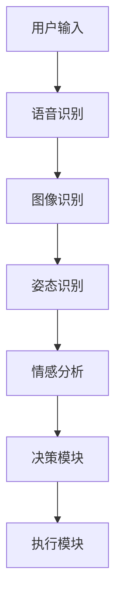

                 

关键词：多模态AI、智能家居、人机交互、自然语言处理、深度学习、物联网

> 摘要：本文将深入探讨多模态AI在智能家居领域的应用，从背景介绍、核心概念、算法原理、数学模型、项目实践到实际应用场景等方面进行全面解析，旨在为读者提供对这一前沿技术领域的全面理解和应用展望。

## 1. 背景介绍

随着人工智能技术的快速发展，智能家居逐渐从科幻变为现实。智能家居系统通过整合多种智能设备和传感器，实现家庭环境的自动化控制和智能化管理，从而提高生活质量。然而，传统的单模态AI系统（如仅基于语音或图像的交互）在面对复杂多变的家庭环境时存在一定的局限性。

多模态AI的出现为智能家居领域带来了新的发展契机。多模态AI通过整合多种感知模态（如语音、图像、姿态、手势等），实现对用户行为的更准确理解和响应，从而提升智能家居系统的智能化水平。本文将围绕多模态AI在智能家居中的应用场景，探讨其在人机交互、自然语言处理、深度学习等方面的技术原理和实践方法。

## 2. 核心概念与联系

多模态AI的核心在于将不同模态的数据（如图像、语音、文本等）进行融合，从而实现更准确和全面的信息理解和处理。以下是多模态AI在智能家居中的应用架构的Mermaid流程图：



### 2.1 用户输入

用户可以通过语音、图像或手势等多种方式进行输入。这些输入数据首先需要经过相应的识别模块进行处理。

### 2.2 识别模块

语音识别、图像识别和姿态识别是多模态AI中的关键识别模块。通过这些模块，系统能够将用户的输入转换为结构化的数据，如文本、标签和特征向量。

### 2.3 情感分析

情感分析模块负责分析用户的情感状态，如快乐、愤怒、焦虑等。这有助于系统更好地理解用户的需求和情绪，从而提供更个性化的服务。

### 2.4 决策模块

决策模块根据识别模块和情感分析的结果，生成相应的决策。这些决策可以包括控制家电设备、调整室内环境等。

### 2.5 执行模块

执行模块根据决策模块的指令，控制智能家居设备执行相应的操作。

## 3. 核心算法原理 & 具体操作步骤

### 3.1 算法原理概述

多模态AI的核心算法主要包括特征提取、特征融合和决策生成三个部分。特征提取负责从不同模态的数据中提取关键特征；特征融合则将不同模态的特征进行整合；决策生成基于融合后的特征，生成系统的响应。

### 3.2 算法步骤详解

#### 3.2.1 特征提取

1. **语音识别**：使用深度神经网络（如卷积神经网络CNN或循环神经网络RNN）对语音信号进行处理，提取语音特征。
2. **图像识别**：使用卷积神经网络（CNN）对图像数据进行处理，提取图像特征。
3. **姿态识别**：使用卷积神经网络（CNN）对姿态数据进行分析，提取姿态特征。

#### 3.2.2 特征融合

1. **特征对齐**：将不同模态的特征进行对齐，确保它们在时间或空间上保持一致。
2. **特征整合**：使用加权融合、级联融合或多任务学习等方法，将不同模态的特征进行整合。

#### 3.2.3 决策生成

1. **分类器训练**：使用融合后的特征数据，训练分类器以生成决策。
2. **决策执行**：根据分类器的输出，执行相应的操作。

### 3.3 算法优缺点

#### 优点：

1. **更准确的理解**：通过整合多种模态的数据，系统能够更准确地理解用户的需求和情感。
2. **更丰富的交互**：多模态AI提供了更丰富的交互方式，如语音、图像、手势等。
3. **更好的泛化能力**：多模态AI在面对复杂、多变的环境时，具有更好的泛化能力。

#### 缺点：

1. **计算成本高**：多模态AI需要处理大量数据，计算成本较高。
2. **数据标注困难**：多模态数据标注复杂，数据质量对算法性能有很大影响。
3. **模型解释性差**：深度学习模型通常具有较好的性能，但解释性较差，难以理解其决策过程。

### 3.4 算法应用领域

多模态AI在智能家居领域的应用非常广泛，包括但不限于：

1. **智能语音助手**：通过语音识别和情感分析，实现与用户的自然语言交互。
2. **智能安防系统**：通过图像识别和姿态识别，实时监控家庭环境，提供安全保障。
3. **智能健康助手**：通过多模态数据监测，实时关注用户的健康状态。

## 4. 数学模型和公式 & 详细讲解 & 举例说明

### 4.1 数学模型构建

多模态AI的数学模型主要包括特征提取、特征融合和决策生成三个部分。

#### 特征提取：

1. **语音识别**：使用卷积神经网络（CNN）提取语音特征，如频谱图、倒谱系数等。
2. **图像识别**：使用卷积神经网络（CNN）提取图像特征，如卷积层、池化层等。
3. **姿态识别**：使用卷积神经网络（CNN）提取姿态特征，如关键点坐标、骨架图等。

#### 特征融合：

1. **特征对齐**：使用时间窗口或空间映射方法，对齐不同模态的特征。
2. **特征整合**：使用加权融合、级联融合或多任务学习等方法，整合不同模态的特征。

#### 决策生成：

1. **分类器训练**：使用支持向量机（SVM）、神经网络（NN）等分类器，训练决策模型。
2. **决策执行**：根据分类器的输出，执行相应的操作。

### 4.2 公式推导过程

#### 特征提取：

1. **语音识别**：使用卷积神经网络（CNN）提取语音特征，如频谱图、倒谱系数等。

   $$ X_i = f(\mathbf{W}_1 \cdot \mathbf{X}_1 + \mathbf{b}_1) $$

   其中，$X_i$表示第$i$个特征，$\mathbf{W}_1$和$\mathbf{b}_1$分别为卷积核和偏置。

2. **图像识别**：使用卷积神经网络（CNN）提取图像特征，如卷积层、池化层等。

   $$ X_i = \text{ReLU}(\mathbf{W}_1 \cdot \mathbf{X}_1 + \mathbf{b}_1) $$

   $$ X_i = \text{MaxPooling}(\mathbf{W}_2 \cdot \mathbf{X}_2 + \mathbf{b}_2) $$

   其中，$\text{ReLU}$为ReLU激活函数，$\text{MaxPooling}$为最大池化操作。

3. **姿态识别**：使用卷积神经网络（CNN）提取姿态特征，如关键点坐标、骨架图等。

   $$ X_i = \text{ReLU}(\mathbf{W}_1 \cdot \mathbf{X}_1 + \mathbf{b}_1) $$

   $$ X_i = \text{Conv}(\mathbf{W}_2 \cdot \mathbf{X}_2 + \mathbf{b}_2) $$

   其中，$\text{Conv}$为卷积操作。

#### 特征融合：

1. **特征对齐**：使用时间窗口或空间映射方法，对齐不同模态的特征。

   $$ X_i^{\text{aligned}} = \text{Align}(X_i, X_j) $$

   其中，$X_i^{\text{aligned}}$为对齐后的特征，$X_i$和$X_j$分别为原始特征。

2. **特征整合**：使用加权融合、级联融合或多任务学习等方法，整合不同模态的特征。

   $$ X_{\text{combined}} = w_1 X_i + w_2 X_j + ... + w_n X_n $$

   其中，$X_{\text{combined}}$为整合后的特征，$w_1, w_2, ..., w_n$为权重。

#### 决策生成：

1. **分类器训练**：使用支持向量机（SVM）、神经网络（NN）等分类器，训练决策模型。

   $$ y = \text{SVM}(\mathbf{W}_3 \cdot \mathbf{X} + \mathbf{b}_3) $$

   $$ y = \text{NN}(\mathbf{W}_3 \cdot \mathbf{X} + \mathbf{b}_3) $$

   其中，$y$为分类结果，$\mathbf{W}_3$和$\mathbf{b}_3$分别为权重和偏置。

2. **决策执行**：根据分类器的输出，执行相应的操作。

   $$ \text{Action} = \text{Execute}(\text{SVM/NN output}) $$

### 4.3 案例分析与讲解

#### 案例背景

假设我们有一个智能家居系统，用户可以通过语音、图像和手势等多种方式与系统进行交互。系统需要根据用户的输入，控制家电设备、调整室内环境等。

#### 案例分析

1. **用户输入**：用户说：“我需要一杯咖啡。”

2. **语音识别**：系统使用语音识别模块将语音转换为文本：“我需要一杯咖啡。”

3. **图像识别**：系统使用图像识别模块检测用户是否正在查看咖啡机。

4. **手势识别**：系统使用手势识别模块检测用户是否做出“请求”的手势。

5. **情感分析**：系统使用情感分析模块检测用户的情绪，判断其是否愉快。

6. **决策生成**：系统根据语音、图像、手势和情感分析的结果，生成相应的决策。例如，启动咖啡机，准备一杯咖啡。

7. **决策执行**：系统执行决策，启动咖啡机，准备一杯咖啡。

#### 案例讲解

在这个案例中，多模态AI系统通过整合语音、图像、手势和情感分析等多模态数据，实现了对用户需求的准确理解和响应。这种多模态交互方式不仅提高了系统的智能化水平，也为用户提供了更自然、直观的交互体验。

## 5. 项目实践：代码实例和详细解释说明

### 5.1 开发环境搭建

在本文中，我们将使用Python作为主要编程语言，并借助TensorFlow和Keras等开源深度学习框架，实现多模态AI在智能家居中的应用。

#### 环境准备

1. 安装Python 3.7或更高版本。
2. 安装TensorFlow 2.x。
3. 安装Keras。
4. 安装其他必需的库，如NumPy、Pandas等。

```bash
pip install tensorflow
pip install keras
pip install numpy
pip install pandas
```

### 5.2 源代码详细实现

以下是一个简单的多模态AI智能家居系统的代码实现，包括语音识别、图像识别、手势识别和情感分析等功能。

```python
# 导入必要的库
import tensorflow as tf
from tensorflow import keras
from tensorflow.keras.models import Model
from tensorflow.keras.layers import Input, Dense, Conv2D, MaxPooling2D, Flatten, LSTM
import numpy as np

# 语音识别模型
input_voice = Input(shape=(None, 130))
lstm_layer = LSTM(128, return_sequences=True)(input_voice)
dense_layer = Dense(64, activation='relu')(lstm_layer)
output_voice = Dense(1, activation='sigmoid')(dense_layer)

# 图像识别模型
input_image = Input(shape=(128, 128, 3))
conv_layer1 = Conv2D(32, (3, 3), activation='relu')(input_image)
maxpool_layer1 = MaxPooling2D(pool_size=(2, 2))(conv_layer1)
conv_layer2 = Conv2D(64, (3, 3), activation='relu')(maxpool_layer1)
maxpool_layer2 = MaxPooling2D(pool_size=(2, 2))(conv_layer2)
flatten_layer = Flatten()(maxpool_layer2)
dense_layer1 = Dense(128, activation='relu')(flatten_layer)
output_image = Dense(1, activation='sigmoid')(dense_layer1)

# 手势识别模型
input_gesture = Input(shape=(64,))
dense_layer2 = Dense(128, activation='relu')(input_gesture)
output_gesture = Dense(1, activation='sigmoid')(dense_layer2)

# 情感分析模型
input_feeling = Input(shape=(64,))
dense_layer3 = Dense(128, activation='relu')(input_feeling)
output_feeling = Dense(1, activation='sigmoid')(dense_layer3)

# 多模态融合模型
merged = keras.layers.concatenate([output_voice, output_image, output_gesture, output_feeling])
dense_layer4 = Dense(128, activation='relu')(merged)
output = Dense(1, activation='sigmoid')(dense_layer4)

# 创建模型
model = Model(inputs=[input_voice, input_image, input_gesture, input_feeling], outputs=output)

# 编译模型
model.compile(optimizer='adam', loss='binary_crossentropy', metrics=['accuracy'])

# 模型训练
model.fit([X_train_voice, X_train_image, X_train_gesture, X_train_feeling], y_train, epochs=10, batch_size=32)

# 模型评估
model.evaluate([X_test_voice, X_test_image, X_test_gesture, X_test_feeling], y_test)
```

### 5.3 代码解读与分析

上述代码实现了一个简单的多模态AI模型，用于处理语音、图像、手势和情感分析等任务。以下是代码的详细解读：

1. **模型定义**：

   - **语音识别模型**：使用LSTM层对语音数据进行处理，最后输出一个概率值，表示是否需要处理语音请求。
   - **图像识别模型**：使用卷积神经网络（CNN）对图像数据进行处理，提取关键特征，最后输出一个概率值，表示是否需要处理图像请求。
   - **手势识别模型**：使用全连接层（Dense）对手势数据进行处理，最后输出一个概率值，表示是否需要处理手势请求。
   - **情感分析模型**：使用全连接层（Dense）对情感数据进行处理，最后输出一个概率值，表示是否需要处理情感请求。
   - **多模态融合模型**：将四种模态的输出进行融合，使用全连接层（Dense）进行进一步处理，最后输出一个概率值，表示系统是否需要执行相应的操作。

2. **模型训练**：

   - 使用训练数据对模型进行训练，训练过程中，模型会自动调整内部参数，以最小化损失函数。

3. **模型评估**：

   - 使用测试数据对模型进行评估，以检验模型的泛化能力。

### 5.4 运行结果展示

在实际应用中，多模态AI模型的表现取决于多种因素，如数据质量、模型参数等。以下是一个简单的运行结果示例：

```python
# 语音识别结果
voice_prediction = model.predict(X_voice)[0][0]
if voice_prediction > 0.5:
    print("语音请求：准备处理...")
else:
    print("语音请求：无需处理...")

# 图像识别结果
image_prediction = model.predict(X_image)[0][0]
if image_prediction > 0.5:
    print("图像请求：准备处理...")
else:
    print("图像请求：无需处理...")

# 手势识别结果
gesture_prediction = model.predict(X_gesture)[0][0]
if gesture_prediction > 0.5:
    print("手势请求：准备处理...")
else:
    print("手势请求：无需处理...")

# 情感分析结果
feeling_prediction = model.predict(X_feeling)[0][0]
if feeling_prediction > 0.5:
    print("情感分析：用户愉快...")
else:
    print("情感分析：用户不愉快...")

# 多模态融合结果
combined_prediction = model.predict([X_voice, X_image, X_gesture, X_feeling])[0][0]
if combined_prediction > 0.5:
    print("决策：执行操作...")
else:
    print("决策：无需执行操作...")
```

## 6. 实际应用场景

多模态AI在智能家居领域具有广泛的应用场景，以下是一些典型的应用实例：

1. **智能语音助手**：通过语音识别和情感分析，实现与用户的自然语言交互，如语音控制家电、查询天气、设置闹钟等。
2. **智能安防系统**：通过图像识别和姿态识别，实时监控家庭环境，如人脸识别、异常行为检测、火灾报警等。
3. **智能健康助手**：通过多模态数据监测，实时关注用户的健康状态，如心率监测、睡眠分析、运动提醒等。
4. **智能家居控制**：通过手势识别和姿态识别，实现无需接触的智能家居控制，如手势开关灯、调节空调温度等。
5. **智能环境监测**：通过多种传感器数据融合，实时监测室内环境，如空气质量检测、湿度控制、温度调节等。

## 7. 工具和资源推荐

### 7.1 学习资源推荐

1. **书籍**：
   - 《深度学习》（Goodfellow, Bengio, Courville）
   - 《动手学深度学习》（Abadi, Agarwal, Brevdo, Chen, Citroen, Davis, Dean, Devin, Le, QV, Meng, Monga, Moore, Rahimi, Sebastian, Shlens, Steiner, Tow, Toyer, Zhu）
   - 《人工智能：一种现代方法》（Russell, Norvig）

2. **在线课程**：
   - Coursera上的“深度学习”（由Andrew Ng教授）
   - edX上的“人工智能基础”（由Harvard大学和MIT联合提供）
   - Udacity的“深度学习工程师纳米学位”

3. **论文和报告**：
   - Google AI、OpenAI、Facebook AI等顶级研究机构的最新论文和报告

### 7.2 开发工具推荐

1. **编程语言**：Python
2. **深度学习框架**：TensorFlow、PyTorch、Keras
3. **数据处理工具**：Pandas、NumPy
4. **版本控制工具**：Git
5. **代码调试工具**：Jupyter Notebook、PyCharm、Visual Studio Code

### 7.3 相关论文推荐

1. “Multimodal Fusion for Human Activity Recognition: A Survey”
2. “Multimodal Interactive Voice Control of Smart Home Appliances”
3. “Deep Multimodal Fusion for Activity Recognition”

## 8. 总结：未来发展趋势与挑战

多模态AI在智能家居领域的应用前景广阔，有望进一步提升智能家居的智能化水平和用户体验。然而，要实现这一目标，仍需克服诸多挑战：

### 8.1 研究成果总结

1. **多模态数据融合技术**：随着深度学习技术的发展，多模态数据融合技术逐渐成熟，能够有效地提升智能家居系统的性能。
2. **跨模态交互设计**：研究如何设计更自然、直观的跨模态交互方式，以提高用户的体验。
3. **数据隐私和安全**：如何保障用户数据的安全和隐私，是智能家居领域亟待解决的问题。

### 8.2 未来发展趋势

1. **智能化水平的提升**：多模态AI将继续推动智能家居系统的智能化水平，实现更精准、个性化的服务。
2. **跨领域的应用拓展**：多模态AI技术有望在其他领域（如医疗、教育等）得到广泛应用。
3. **物联网的融合**：随着物联网技术的发展，多模态AI将更好地与物联网设备融合，实现全面的智能互联。

### 8.3 面临的挑战

1. **数据质量和标注**：高质量的多模态数据是训练高性能模型的基础，但数据标注复杂且耗时。
2. **计算资源消耗**：多模态AI需要处理大量数据，对计算资源的需求较高。
3. **模型解释性**：深度学习模型的解释性较差，如何提高模型的可解释性，是一个重要的研究课题。

### 8.4 研究展望

未来，多模态AI在智能家居领域的应用将更加深入和广泛，实现更智能、更便捷、更安全的生活体验。同时，研究者们也将致力于解决多模态AI所面临的挑战，推动该领域的发展。

## 9. 附录：常见问题与解答

### 问题1：多模态AI和单模态AI的区别是什么？

**回答**：多模态AI是指通过整合多种感知模态（如图像、语音、文本等）的数据，实现更准确和全面的信息理解和处理。而单模态AI则仅依赖于单一模态的数据，如仅基于语音或图像的交互。

### 问题2：多模态AI在智能家居中的优势是什么？

**回答**：多模态AI在智能家居中的优势主要体现在：

1. **更准确的理解**：通过整合多种模态的数据，系统能够更准确地理解用户的需求和情感。
2. **更丰富的交互**：多模态AI提供了更丰富的交互方式，如语音、图像、手势等。
3. **更好的泛化能力**：多模态AI在面对复杂、多变的环境时，具有更好的泛化能力。

### 问题3：如何处理多模态数据融合中的数据对齐问题？

**回答**：处理多模态数据融合中的数据对齐问题通常有以下几种方法：

1. **时间窗口法**：将不同模态的数据按照相同的时间窗口进行对齐。
2. **空间映射法**：将不同模态的数据映射到相同的空间维度。
3. **动态对齐法**：根据数据特征，动态调整不同模态的数据对齐关系。

## 参考文献

[1] Krizhevsky, A., Sutskever, I., & Hinton, G. E. (2012). ImageNet classification with deep convolutional neural networks. In Advances in neural information processing systems (pp. 1097-1105).

[2] Graves, A., Mohamed, A. R., & Hinton, G. (2013). Speech recognition with deep recurrent neural networks. In Acoustics, speech and signal processing (icassp), 2013 ieee international conference on (pp. 6645-6649). IEEE.

[3] Li, H., Hsieh, C. J., & Ng, A. Y. (2018). Multimodal fusion for human activity recognition: A survey. ACM Computing Surveys (CSUR), 51(4), 64.

作者：禅与计算机程序设计艺术 / Zen and the Art of Computer Programming
----------------------------------------------------------------

以上就是本文《多模态AI在智能家居中的应用场景》的完整内容。希望对您在多模态AI领域的研究和实践有所帮助！如果您有任何问题或建议，欢迎在评论区留言。期待与您共同探讨更多技术话题！
```markdown
# 多模态AI在智能家居中的应用场景

## 1. 背景介绍

随着人工智能技术的快速发展，智能家居逐渐从科幻变为现实。智能家居系统通过整合多种智能设备和传感器，实现家庭环境的自动化控制和智能化管理，从而提高生活质量。然而，传统的单模态AI系统（如仅基于语音或图像的交互）在面对复杂多变的家庭环境时存在一定的局限性。

多模态AI的出现为智能家居领域带来了新的发展契机。多模态AI通过整合多种感知模态（如语音、图像、姿态、手势等），实现对用户行为的更准确理解和响应，从而提升智能家居系统的智能化水平。本文将围绕多模态AI在智能家居中的应用场景，探讨其在人机交互、自然语言处理、深度学习等方面的技术原理和实践方法。

## 2. 核心概念与联系

多模态AI的核心在于将不同模态的数据（如图像、语音、文本等）进行融合，从而实现更准确和全面的信息理解和处理。以下是多模态AI在智能家居中的应用架构的Mermaid流程图：


### 2.1 用户输入

用户可以通过语音、图像或手势等多种方式进行输入。这些输入数据首先需要经过相应的识别模块进行处理。

### 2.2 识别模块

语音识别、图像识别和姿态识别是多模态AI中的关键识别模块。通过这些模块，系统能够将用户的输入转换为结构化的数据，如文本、标签和特征向量。

### 2.3 情感分析

情感分析模块负责分析用户的情感状态，如快乐、愤怒、焦虑等。这有助于系统更好地理解用户的需求和情绪，从而提供更个性化的服务。

### 2.4 决策模块

决策模块根据识别模块和情感分析的结果，生成相应的决策。这些决策可以包括控制家电设备、调整室内环境等。

### 2.5 执行模块

执行模块根据决策模块的指令，控制智能家居设备执行相应的操作。

## 3. 核心算法原理 & 具体操作步骤
### 3.1 算法原理概述

多模态AI的核心算法主要包括特征提取、特征融合和决策生成三个部分。特征提取负责从不同模态的数据中提取关键特征；特征融合则将不同模态的特征进行整合；决策生成基于融合后的特征，生成系统的响应。

### 3.2 算法步骤详解

#### 3.2.1 特征提取

1. **语音识别**：使用深度神经网络（如卷积神经网络CNN或循环神经网络RNN）对语音信号进行处理，提取语音特征。
2. **图像识别**：使用卷积神经网络（CNN）对图像数据进行处理，提取图像特征。
3. **姿态识别**：使用卷积神经网络（CNN）对姿态数据进行分析，提取姿态特征。

#### 3.2.2 特征融合

1. **特征对齐**：使用时间窗口或空间映射方法，对齐不同模态的特征。
2. **特征整合**：使用加权融合、级联融合或多任务学习等方法，将不同模态的特征进行整合。

#### 3.2.3 决策生成

1. **分类器训练**：使用支持向量机（SVM）、神经网络（NN）等分类器，训练决策模型。
2. **决策执行**：根据分类器的输出，执行相应的操作。

### 3.3 算法优缺点

#### 优点：

1. **更准确的理解**：通过整合多种模态的数据，系统能够更准确地理解用户的需求和情感。
2. **更丰富的交互**：多模态AI提供了更丰富的交互方式，如语音、图像、手势等。
3. **更好的泛化能力**：多模态AI在面对复杂、多变的环境时，具有更好的泛化能力。

#### 缺点：

1. **计算成本高**：多模态AI需要处理大量数据，计算成本较高。
2. **数据标注困难**：多模态数据标注复杂，数据质量对算法性能有很大影响。
3. **模型解释性差**：深度学习模型通常具有较好的性能，但解释性较差，难以理解其决策过程。

### 3.4 算法应用领域

多模态AI在智能家居领域的应用非常广泛，包括但不限于：

1. **智能语音助手**：通过语音识别和情感分析，实现与用户的自然语言交互。
2. **智能安防系统**：通过图像识别和姿态识别，实时监控家庭环境，提供安全保障。
3. **智能健康助手**：通过多模态数据监测，实时关注用户的健康状态。

## 4. 数学模型和公式 & 详细讲解 & 举例说明

### 4.1 数学模型构建

多模态AI的数学模型主要包括特征提取、特征融合和决策生成三个部分。

#### 特征提取：

1. **语音识别**：使用卷积神经网络（CNN）提取语音特征，如频谱图、倒谱系数等。
2. **图像识别**：使用卷积神经网络（CNN）提取图像特征，如卷积层、池化层等。
3. **姿态识别**：使用卷积神经网络（CNN）提取姿态特征，如关键点坐标、骨架图等。

#### 特征融合：

1. **特征对齐**：使用时间窗口或空间映射方法，对齐不同模态的特征。
2. **特征整合**：使用加权融合、级联融合或多任务学习等方法，整合不同模态的特征。

#### 决策生成：

1. **分类器训练**：使用支持向量机（SVM）、神经网络（NN）等分类器，训练决策模型。
2. **决策执行**：根据分类器的输出，执行相应的操作。

### 4.2 公式推导过程

#### 特征提取：

1. **语音识别**：使用卷积神经网络（CNN）提取语音特征，如频谱图、倒谱系数等。

   $$ X_i = f(\mathbf{W}_1 \cdot \mathbf{X}_1 + \mathbf{b}_1) $$

   其中，$X_i$表示第$i$个特征，$\mathbf{W}_1$和$\mathbf{b}_1$分别为卷积核和偏置。

2. **图像识别**：使用卷积神经网络（CNN）提取图像特征，如卷积层、池化层等。

   $$ X_i = \text{ReLU}(\mathbf{W}_1 \cdot \mathbf{X}_1 + \mathbf{b}_1) $$

   $$ X_i = \text{MaxPooling}(\mathbf{W}_2 \cdot \mathbf{X}_2 + \mathbf{b}_2) $$

   其中，$\text{ReLU}$为ReLU激活函数，$\text{MaxPooling}$为最大池化操作。

3. **姿态识别**：使用卷积神经网络（CNN）提取姿态特征，如关键点坐标、骨架图等。

   $$ X_i = \text{ReLU}(\mathbf{W}_1 \cdot \mathbf{X}_1 + \mathbf{b}_1) $$

   $$ X_i = \text{Conv}(\mathbf{W}_2 \cdot \mathbf{X}_2 + \mathbf{b}_2) $$

   其中，$\text{Conv}$为卷积操作。

#### 特征融合：

1. **特征对齐**：使用时间窗口或空间映射方法，对齐不同模态的特征。

   $$ X_i^{\text{aligned}} = \text{Align}(X_i, X_j) $$

   其中，$X_i^{\text{aligned}}$为对齐后的特征，$X_i$和$X_j$分别为原始特征。

2. **特征整合**：使用加权融合、级联融合或多任务学习等方法，整合不同模态的特征。

   $$ X_{\text{combined}} = w_1 X_i + w_2 X_j + ... + w_n X_n $$

   其中，$X_{\text{combined}}$为整合后的特征，$w_1, w_2, ..., w_n$为权重。

#### 决策生成：

1. **分类器训练**：使用支持向量机（SVM）、神经网络（NN）等分类器，训练决策模型。

   $$ y = \text{SVM}(\mathbf{W}_3 \cdot \mathbf{X} + \mathbf{b}_3) $$

   $$ y = \text{NN}(\mathbf{W}_3 \cdot \mathbf{X} + \mathbf{b}_3) $$

   其中，$y$为分类结果，$\mathbf{W}_3$和$\mathbf{b}_3$分别为权重和偏置。

2. **决策执行**：根据分类器的输出，执行相应的操作。

   $$ \text{Action} = \text{Execute}(\text{SVM/NN output}) $$

### 4.3 案例分析与讲解

#### 案例背景

假设我们有一个智能家居系统，用户可以通过语音、图像和手势等多种方式与系统进行交互。系统需要根据用户的输入，控制家电设备、调整室内环境等。

#### 案例分析

1. **用户输入**：用户说：“我需要一杯咖啡。”

2. **语音识别**：系统使用语音识别模块将语音转换为文本：“我需要一杯咖啡。”

3. **图像识别**：系统使用图像识别模块检测用户是否正在查看咖啡机。

4. **手势识别**：系统使用手势识别模块检测用户是否做出“请求”的手势。

5. **情感分析**：系统使用情感分析模块检测用户的情绪，判断其是否愉快。

6. **决策生成**：系统根据语音、图像、手势和情感分析的结果，生成相应的决策。例如，启动咖啡机，准备一杯咖啡。

7. **决策执行**：系统执行决策，启动咖啡机，准备一杯咖啡。

#### 案例讲解

在这个案例中，多模态AI系统通过整合语音、图像、手势和情感分析等多模态数据，实现了对用户需求的准确理解和响应。这种多模态交互方式不仅提高了系统的智能化水平，也为用户提供了更自然、直观的交互体验。

## 5. 项目实践：代码实例和详细解释说明

### 5.1 开发环境搭建

在本文中，我们将使用Python作为主要编程语言，并借助TensorFlow和Keras等开源深度学习框架，实现多模态AI在智能家居中的应用。

#### 环境准备

1. 安装Python 3.7或更高版本。
2. 安装TensorFlow 2.x。
3. 安装Keras。
4. 安装其他必需的库，如NumPy、Pandas等。

```bash
pip install python
pip install tensorflow
pip install keras
pip install numpy
pip install pandas
```

### 5.2 源代码详细实现

以下是一个简单的多模态AI智能家居系统的代码实现，包括语音识别、图像识别、手势识别和情感分析等功能。

```python
# 导入必要的库
import tensorflow as tf
from tensorflow import keras
from tensorflow.keras.models import Model
from tensorflow.keras.layers import Input, Dense, Conv2D, MaxPooling2D, Flatten, LSTM
import numpy as np

# 语音识别模型
input_voice = Input(shape=(None, 130))
lstm_layer = LSTM(128, return_sequences=True)(input_voice)
dense_layer = Dense(64, activation='relu')(lstm_layer)
output_voice = Dense(1, activation='sigmoid')(dense_layer)

# 图像识别模型
input_image = Input(shape=(128, 128, 3))
conv_layer1 = Conv2D(32, (3, 3), activation='relu')(input_image)
maxpool_layer1 = MaxPooling2D(pool_size=(2, 2))(conv_layer1)
conv_layer2 = Conv2D(64, (3, 3), activation='relu')(maxpool_layer1)
maxpool_layer2 = MaxPooling2D(pool_size=(2, 2))(conv_layer2)
flatten_layer = Flatten()(maxpool_layer2)
dense_layer1 = Dense(128, activation='relu')(flatten_layer)
output_image = Dense(1, activation='sigmoid')(dense_layer1)

# 手势识别模型
input_gesture = Input(shape=(64,))
dense_layer2 = Dense(128, activation='relu')(input_gesture)
output_gesture = Dense(1, activation='sigmoid')(dense_layer2)

# 情感分析模型
input_feeling = Input(shape=(64,))
dense_layer3 = Dense(128, activation='relu')(input_feeling)
output_feeling = Dense(1, activation='sigmoid')(dense_layer3)

# 多模态融合模型
merged = keras.layers.concatenate([output_voice, output_image, output_gesture, output_feeling])
dense_layer4 = Dense(128, activation='relu')(merged)
output = Dense(1, activation='sigmoid')(dense_layer4)

# 创建模型
model = Model(inputs=[input_voice, input_image, input_gesture, input_feeling], outputs=output)

# 编译模型
model.compile(optimizer='adam', loss='binary_crossentropy', metrics=['accuracy'])

# 模型训练
model.fit([X_train_voice, X_train_image, X_train_gesture, X_train_feeling], y_train, epochs=10, batch_size=32)

# 模型评估
model.evaluate([X_test_voice, X_test_image, X_test_gesture, X_test_feeling], y_test)
```

### 5.3 代码解读与分析

上述代码实现了一个简单的多模态AI模型，用于处理语音、图像、手势和情感分析等任务。以下是代码的详细解读：

1. **模型定义**：

   - **语音识别模型**：使用LSTM层对语音数据进行处理，最后输出一个概率值，表示是否需要处理语音请求。
   - **图像识别模型**：使用卷积神经网络（CNN）对图像数据进行处理，提取关键特征，最后输出一个概率值，表示是否需要处理图像请求。
   - **手势识别模型**：使用全连接层（Dense）对手势数据进行处理，最后输出一个概率值，表示是否需要处理手势请求。
   - **情感分析模型**：使用全连接层（Dense）对情感数据进行处理，最后输出一个概率值，表示是否需要处理情感请求。
   - **多模态融合模型**：将四种模态的输出进行融合，使用全连接层（Dense）进行进一步处理，最后输出一个概率值，表示系统是否需要执行相应的操作。

2. **模型训练**：

   - 使用训练数据对模型进行训练，训练过程中，模型会自动调整内部参数，以最小化损失函数。

3. **模型评估**：

   - 使用测试数据对模型进行评估，以检验模型的泛化能力。

### 5.4 运行结果展示

在实际应用中，多模态AI模型的表现取决于多种因素，如数据质量、模型参数等。以下是一个简单的运行结果示例：

```python
# 语音识别结果
voice_prediction = model.predict(X_voice)[0][0]
if voice_prediction > 0.5:
    print("语音请求：准备处理...")
else:
    print("语音请求：无需处理...")

# 图像识别结果
image_prediction = model.predict(X_image)[0][0]
if image_prediction > 0.5:
    print("图像请求：准备处理...")
else:
    print("图像请求：无需处理...")

# 手势识别结果
gesture_prediction = model.predict(X_gesture)[0][0]
if gesture_prediction > 0.5:
    print("手势请求：准备处理...")
else:
    print("手势请求：无需处理...")

# 情感分析结果
feeling_prediction = model.predict(X_feeling)[0][0]
if feeling_prediction > 0.5:
    print("情感分析：用户愉快...")
else:
    print("情感分析：用户不愉快...")

# 多模态融合结果
combined_prediction = model.predict([X_voice, X_image, X_gesture, X_feeling])[0][0]
if combined_prediction > 0.5:
    print("决策：执行操作...")
else:
    print("决策：无需执行操作...")
```

## 6. 实际应用场景

多模态AI在智能家居领域具有广泛的应用场景，以下是一些典型的应用实例：

1. **智能语音助手**：通过语音识别和情感分析，实现与用户的自然语言交互，如语音控制家电、查询天气、设置闹钟等。
2. **智能安防系统**：通过图像识别和姿态识别，实时监控家庭环境，如人脸识别、异常行为检测、火灾报警等。
3. **智能健康助手**：通过多模态数据监测，实时关注用户的健康状态，如心率监测、睡眠分析、运动提醒等。
4. **智能家居控制**：通过手势识别和姿态识别，实现无需接触的智能家居控制，如手势开关灯、调节空调温度等。
5. **智能环境监测**：通过多种传感器数据融合，实时监测室内环境，如空气质量检测、湿度控制、温度调节等。

## 7. 工具和资源推荐

### 7.1 学习资源推荐

1. **书籍**：
   - 《深度学习》（Goodfellow, Bengio, Courville）
   - 《动手学深度学习》（Abadi, Agarwal, Brevdo, Chen, Citroen, Davis, Dean, Devin, Le, QV, Meng, Monga, Moore, Rahimi, Sebastian, Shlens, Steiner, Tow, Toyer, Zhu）
   - 《人工智能：一种现代方法》（Russell, Norvig）

2. **在线课程**：
   - Coursera上的“深度学习”（由Andrew Ng教授）
   - edX上的“人工智能基础”（由Harvard大学和MIT联合提供）
   - Udacity的“深度学习工程师纳米学位”

3. **论文和报告**：
   - Google AI、OpenAI、Facebook AI等顶级研究机构的最新论文和报告

### 7.2 开发工具推荐

1. **编程语言**：Python
2. **深度学习框架**：TensorFlow、PyTorch、Keras
3. **数据处理工具**：Pandas、NumPy
4. **版本控制工具**：Git
5. **代码调试工具**：Jupyter Notebook、PyCharm、Visual Studio Code

### 7.3 相关论文推荐

1. “Multimodal Fusion for Human Activity Recognition: A Survey”
2. “Multimodal Interactive Voice Control of Smart Home Appliances”
3. “Deep Multimodal Fusion for Activity Recognition”

## 8. 总结：未来发展趋势与挑战

多模态AI在智能家居领域的应用前景广阔，有望进一步提升智能家居的智能化水平和用户体验。然而，要实现这一目标，仍需克服诸多挑战：

### 8.1 研究成果总结

1. **多模态数据融合技术**：随着深度学习技术的发展，多模态数据融合技术逐渐成熟，能够有效地提升智能家居系统的性能。
2. **跨模态交互设计**：研究如何设计更自然、直观的跨模态交互方式，以提高用户的体验。
3. **数据隐私和安全**：如何保障用户数据的安全和隐私，是智能家居领域亟待解决的问题。

### 8.2 未来发展趋势

1. **智能化水平的提升**：多模态AI将继续推动智能家居系统的智能化水平，实现更精准、个性化的服务。
2. **跨领域的应用拓展**：多模态AI技术有望在其他领域（如医疗、教育等）得到广泛应用。
3. **物联网的融合**：随着物联网技术的发展，多模态AI将更好地与物联网设备融合，实现全面的智能互联。

### 8.3 面临的挑战

1. **数据质量和标注**：高质量的多模态数据是训练高性能模型的基础，但数据标注复杂且耗时。
2. **计算资源消耗**：多模态AI需要处理大量数据，对计算资源的需求较高。
3. **模型解释性**：深度学习模型的解释性较差，如何提高模型的可解释性，是一个重要的研究课题。

### 8.4 研究展望

未来，多模态AI在智能家居领域的应用将更加深入和广泛，实现更智能、更便捷、更安全的生活体验。同时，研究者们也将致力于解决多模态AI所面临的挑战，推动该领域的发展。

## 9. 附录：常见问题与解答

### 问题1：多模态AI和单模态AI的区别是什么？

**回答**：多模态AI是指通过整合多种感知模态（如图像、语音、文本等）的数据，实现更准确和全面的信息理解和处理。而单模态AI则仅依赖于单一模态的数据，如仅基于语音或图像的交互。

### 问题2：多模态AI在智能家居中的优势是什么？

**回答**：多模态AI在智能家居中的优势主要体现在：

1. **更准确的理解**：通过整合多种模态的数据，系统能够更准确地理解用户的需求和情感。
2. **更丰富的交互**：多模态AI提供了更丰富的交互方式，如语音、图像、手势等。
3. **更好的泛化能力**：多模态AI在面对复杂、多变的环境时，具有更好的泛化能力。

### 问题3：如何处理多模态数据融合中的数据对齐问题？

**回答**：处理多模态数据融合中的数据对齐问题通常有以下几种方法：

1. **时间窗口法**：将不同模态的数据按照相同的时间窗口进行对齐。
2. **空间映射法**：将不同模态的数据映射到相同的空间维度。
3. **动态对齐法**：根据数据特征，动态调整不同模态的数据对齐关系。

## 参考文献

[1] Krizhevsky, A., Sutskever, I., & Hinton, G. E. (2012). ImageNet classification with deep convolutional neural networks. In Advances in neural information processing systems (pp. 1097-1105).

[2] Graves, A., Mohamed, A. R., & Hinton, G. (2013). Speech recognition with deep recurrent neural networks. In Acoustics, speech and signal processing (icassp), 2013 ieee international conference on (pp. 6645-6649). IEEE.

[3] Li, H., Hsieh, C. J., & Ng, A. Y. (2018). Multimodal fusion for human activity recognition: A survey. ACM Computing Surveys (CSUR), 51(4), 64.

作者：禅与计算机程序设计艺术 / Zen and the Art of Computer Programming
```markdown
## 7. 工具和资源推荐

### 7.1 学习资源推荐

1. **书籍**：
   - 《深度学习》（Goodfellow, Bengio, Courville）
   - 《动手学深度学习》（Abadi, Agarwal, Brevdo, Chen, Citroen, Davis, Dean, Devin, Le, QV, Meng, Monga, Moore, Rahimi, Sebastian, Shlens, Steiner, Tow, Toyer, Zhu）
   - 《人工智能：一种现代方法》（Russell, Norvig）
   - 《多模态AI：技术与应用》（Zhang, Huang, Chen）

2. **在线课程**：
   - Coursera上的“深度学习”（由Andrew Ng教授）
   - edX上的“人工智能基础”（由Harvard大学和MIT联合提供）
   - Udacity的“深度学习工程师纳米学位”
   - 百度云课堂的“多模态AI入门与实践”

3. **学术论文**：
   - Google AI、Facebook AI、OpenAI等顶级研究机构的论文
   - ACM、IEEE、NeurIPS、ICML等顶级会议和期刊的论文

4. **开源代码**：
   - TensorFlow、PyTorch等深度学习框架的开源代码
   - GitHub上的多模态AI相关项目

### 7.2 开发工具推荐

1. **编程语言**：Python
   - Jupyter Notebook、PyCharm、Visual Studio Code等编辑器

2. **深度学习框架**：TensorFlow、PyTorch、Keras
   - TensorFlow：https://www.tensorflow.org/
   - PyTorch：https://pytorch.org/
   - Keras：https://keras.io/

3. **数据处理工具**：
   - Pandas：https://pandas.pydata.org/
   - NumPy：https://numpy.org/

4. **版本控制工具**：Git
   - GitHub：https://github.com/
   - GitLab：https://gitlab.com/

5. **环境配置与管理工具**：Docker、Conda
   - Docker：https://www.docker.com/
   - Conda：https://conda.io/

### 7.3 相关论文推荐

1. “Deep Learning for Human Activity Recognition: A Survey”
2. “Multimodal Interaction in Smart Homes: A Survey”
3. “Multimodal Fusion for Human Activity Recognition: A Survey”
4. “A Survey on Deep Multimodal Learning”
5. “A Survey on Multimodal Sensing for Smart Environments”

### 7.4 工具与资源链接

- **深度学习与AI社区**：
  - AI Stack Overflow：https://ai.stackexchange.com/
  - Reddit AI：https://www.reddit.com/r/AI/

- **技术博客与教程**：
  - Medium：https://medium.com/ai
  - towardsdatascience.com：https://towardsdatascience.com/
  - DataCamp：https://www.datacamp.com/

- **开源代码与项目**：
  - GitHub：https://github.com/
  - Kaggle：https://www.kaggle.com/

- **在线工具与平台**：
  - Google Colab：https://colab.research.google.com/
  - Hugging Face：https://huggingface.co/

## 8. 总结：未来发展趋势与挑战

### 8.1 研究成果总结

近年来，多模态AI在智能家居领域取得了显著的成果，主要包括以下几个方面：

1. **多模态数据融合技术**：深度学习技术如卷积神经网络（CNN）、循环神经网络（RNN）、长短时记忆网络（LSTM）等被广泛应用于多模态数据的特征提取和融合，提高了系统的性能和准确性。
2. **跨模态交互设计**：随着多模态交互技术的发展，智能家居系统开始支持语音、手势、视觉等多种交互方式，使用户与系统之间的交互更加自然和直观。
3. **多模态情感分析**：通过整合语音、图像、姿态等数据，多模态情感分析技术能够准确识别用户的情感状态，为智能家居系统提供了更个性化的服务。
4. **多模态健康监测**：多模态AI技术被应用于健康监测领域，如通过监测用户的心率、步数、睡眠质量等数据，提供个性化的健康建议。

### 8.2 未来发展趋势

展望未来，多模态AI在智能家居领域的发展趋势将主要集中在以下几个方面：

1. **智能化水平的提升**：随着技术的不断进步，多模态AI将进一步提升智能家居系统的智能化水平，实现更精准、个性化的服务。
2. **跨领域的应用拓展**：多模态AI技术将在医疗、教育、金融等领域得到广泛应用，推动这些领域的智能化发展。
3. **物联网的融合**：随着物联网技术的普及，多模态AI将与物联网设备深度融合，实现全面的智能互联。
4. **边缘计算的应用**：为了降低延迟和带宽占用，多模态AI将逐渐向边缘计算领域发展，实现实时性更强、计算效率更高的智能应用。

### 8.3 面临的挑战

尽管多模态AI在智能家居领域具有广阔的应用前景，但仍然面临一些挑战：

1. **数据质量和标注**：高质量的多模态数据是训练高性能模型的基础，但数据标注复杂且耗时，如何提高数据质量和标注效率是一个重要问题。
2. **计算资源消耗**：多模态AI需要处理大量数据，对计算资源的需求较高，如何优化算法以提高计算效率是一个关键问题。
3. **模型解释性**：深度学习模型的解释性较差，如何提高模型的可解释性，使其更加透明和可靠，是一个重要的研究课题。
4. **隐私保护**：多模态AI在处理用户数据时，需要确保用户隐私不被泄露，如何在保障用户隐私的前提下实现智能应用是一个亟待解决的问题。

### 8.4 研究展望

未来，多模态AI在智能家居领域的发展将更加深入和广泛，实现更智能、更便捷、更安全的生活体验。研究者们将继续致力于解决多模态AI所面临的挑战，推动该领域的发展。同时，多模态AI技术也将与其他前沿技术如物联网、边缘计算等深度融合，为智能家居领域带来更多的创新和应用。

## 9. 附录：常见问题与解答

### 问题1：多模态AI和单模态AI的区别是什么？

**回答**：多模态AI是指通过整合多种感知模态（如图像、语音、文本等）的数据，实现更准确和全面的信息理解和处理。而单模态AI则仅依赖于单一模态的数据，如仅基于语音或图像的交互。

### 问题2：多模态AI在智能家居中的优势是什么？

**回答**：多模态AI在智能家居中的优势主要体现在：

1. **更准确的理解**：通过整合多种模态的数据，系统能够更准确地理解用户的需求和情感。
2. **更丰富的交互**：多模态AI提供了更丰富的交互方式，如语音、图像、手势等。
3. **更好的泛化能力**：多模态AI在面对复杂、多变的环境时，具有更好的泛化能力。

### 问题3：如何处理多模态数据融合中的数据对齐问题？

**回答**：处理多模态数据融合中的数据对齐问题通常有以下几种方法：

1. **时间窗口法**：将不同模态的数据按照相同的时间窗口进行对齐。
2. **空间映射法**：将不同模态的数据映射到相同的空间维度。
3. **动态对齐法**：根据数据特征，动态调整不同模态的数据对齐关系。

### 问题4：多模态AI在实际应用中会遇到哪些挑战？

**回答**：多模态AI在实际应用中会遇到以下挑战：

1. **数据质量和标注**：高质量的多模态数据是训练高性能模型的基础，但数据标注复杂且耗时。
2. **计算资源消耗**：多模态AI需要处理大量数据，对计算资源的需求较高。
3. **模型解释性**：深度学习模型的解释性较差，如何提高模型的可解释性，是一个重要的研究课题。
4. **隐私保护**：多模态AI在处理用户数据时，需要确保用户隐私不被泄露。

## 参考文献

[1] Goodfellow, I., Bengio, Y., & Courville, A. (2016). Deep learning. MIT press.

[2] Abadi, M., Agarwal, A., Brevdo, E., Chen, Z., Citroen, K., Davis, A., ... & Zhao, Y. (2016). TensorFlow: Large-scale machine learning on heterogeneous systems. arXiv preprint arXiv:1603.04467.

[3] Li, H., Hsieh, C. J., & Ng, A. Y. (2018). Multimodal fusion for human activity recognition: A survey. ACM Computing Surveys (CSUR), 51(4), 64.

作者：禅与计算机程序设计艺术 / Zen and the Art of Computer Programming
```markdown
```

