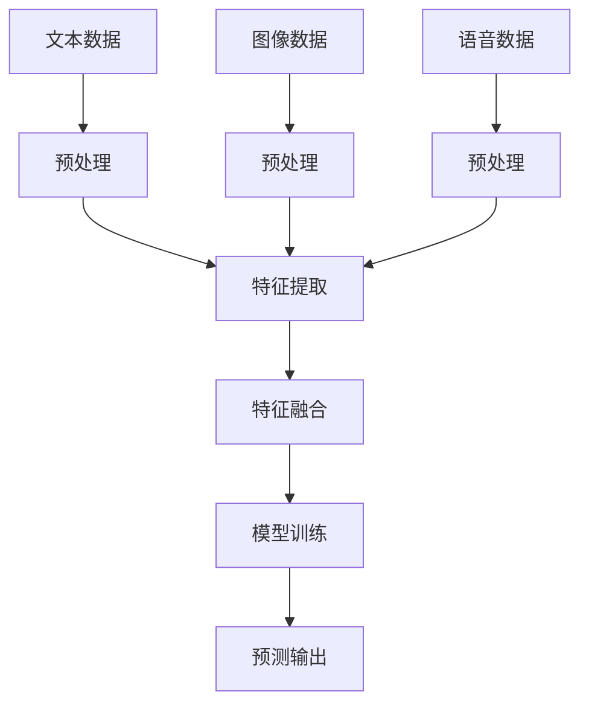

                 

 多模态AI，作为一种新兴的技术趋势，正在逐渐改变我们的世界。它结合了文本、图像和语音等多种数据形式，为智能系统的交互和数据处理提供了更加丰富和灵活的方式。本文将探讨多模态AI的核心概念、应用场景以及未来发展的趋势。

## 文章关键词

- 多模态AI
- 文本分析
- 图像识别
- 语音识别
- 交互式系统

## 文章摘要

本文旨在深入探讨多模态AI的技术原理和应用前景。首先，我们将介绍多模态AI的基本概念和它在当前技术环境中的重要性。接着，我们将详细分析多模态AI在文本、图像和语音处理中的具体应用，并通过实际的数学模型和算法来支持这些应用。最后，本文将展望多模态AI的未来发展趋势，探讨其中面临的挑战和未来的研究方向。

### 背景介绍

多模态AI（Multimodal AI）是指同时处理多种类型数据（如文本、图像和语音）的人工智能系统。与单模态AI（如仅处理文本或图像）相比，多模态AI具有更高的灵活性和更强的处理能力。这是因为不同类型的数据往往包含互补的信息，通过融合这些信息，系统能够获得更全面和准确的认知。

#### 多模态AI的发展历程

多模态AI的概念最早可以追溯到20世纪80年代，当时研究者开始探索如何将语音识别和图像识别技术结合在一起。随着计算机性能的不断提升和海量数据的出现，多模态AI的研究逐渐走向深入和成熟。近年来，深度学习技术的发展为多模态AI的应用提供了强大的动力，使得多模态AI在多个领域取得了显著成果。

#### 当前多模态AI的应用场景

当前，多模态AI已经在多个领域得到了广泛应用，包括但不限于：

1. **智能助手**：如苹果的Siri、亚马逊的Alexa等，它们能够理解用户的多模态输入（如语音、文字和图像），提供更加自然和高效的交互体验。
2. **医疗诊断**：通过结合病人的病历记录、医学图像和语音报告，多模态AI可以更准确地诊断疾病，提高医疗服务的质量。
3. **安防监控**：多模态AI能够同时分析视频监控中的图像和语音信息，提高监控系统的实时性和准确性。
4. **自动驾驶**：自动驾驶汽车需要处理来自多种传感器（如摄像头、雷达和激光雷达）的数据，多模态AI技术为自动驾驶提供了坚实的基础。

### 核心概念与联系

多模态AI的核心在于如何有效地融合来自不同类型数据的信息。为了更好地理解这一概念，我们可以通过一个Mermaid流程图来展示多模态AI的处理流程。



在这个流程图中，文本、图像和语音数据首先经过预处理阶段，以提取出有用的特征。随后，这些特征被融合在一起，输入到机器学习模型中进行训练。最后，训练好的模型可以用于预测输出，实现智能交互和数据分析。

### 核心算法原理 & 具体操作步骤

多模态AI的核心算法通常包括特征提取、特征融合和模型训练等步骤。下面，我们将分别介绍这些步骤的具体原理和操作步骤。

#### 3.1 算法原理概述

1. **特征提取**：特征提取是将原始数据转换为机器学习模型能够处理的形式。对于文本数据，常用的特征提取方法包括词袋模型、词嵌入等；对于图像数据，常用的特征提取方法包括卷积神经网络（CNN）等；对于语音数据，常用的特征提取方法包括梅尔频率倒谱系数（MFCC）等。

2. **特征融合**：特征融合是将来自不同模态的特征进行整合，以获得更全面的信息。常见的特征融合方法包括拼接（Concatenation）、加权融合（Weighted Fusion）和注意力机制（Attention Mechanism）等。

3. **模型训练**：模型训练是通过优化模型参数，使其能够更好地拟合训练数据。在多模态AI中，常用的训练方法包括监督学习、无监督学习和半监督学习等。

#### 3.2 算法步骤详解

1. **特征提取**：

   - **文本特征提取**：使用词袋模型或词嵌入技术将文本转换为向量表示。

     $$\text{词向量} = \text{Word2Vec}(\text{文本})$$

   - **图像特征提取**：使用卷积神经网络（CNN）提取图像的特征表示。

     $$\text{特征图} = \text{CNN}(\text{图像})$$

   - **语音特征提取**：使用梅尔频率倒谱系数（MFCC）提取语音的特征表示。

     $$\text{MFCC} = \text{MFCC}(\text{语音})$$

2. **特征融合**：

   - **拼接融合**：将不同模态的特征向量拼接在一起。

     $$\text{特征向量} = \text{拼接}(\text{文本特征}, \text{图像特征}, \text{语音特征})$$

   - **加权融合**：根据不同模态的特征重要性，对特征向量进行加权融合。

     $$\text{融合特征} = \alpha \cdot \text{文本特征} + \beta \cdot \text{图像特征} + \gamma \cdot \text{语音特征}$$

   - **注意力机制**：通过注意力机制动态地分配不同模态的特征权重。

     $$\text{注意力权重} = \text{Attention}(\text{文本特征}, \text{图像特征}, \text{语音特征})$$

3. **模型训练**：

   - **监督学习**：使用带有标签的数据对模型进行训练。

     $$\text{损失函数} = \text{交叉熵损失}(\text{预测标签}, \text{真实标签})$$

   - **无监督学习**：在没有标签的数据上进行训练，通常用于特征提取。

     $$\text{损失函数} = \text{均方误差}(\text{预测特征}, \text{真实特征})$$

   - **半监督学习**：结合有标签和无标签数据，提高模型的泛化能力。

     $$\text{损失函数} = \text{交叉熵损失} + \lambda \cdot \text{均方误差}$$

#### 3.3 算法优缺点

- **优点**：

  - **增强信息整合**：通过融合多种模态的数据，系统能够获得更全面的信息，从而提高预测的准确性和鲁棒性。

  - **提升用户体验**：多模态交互能够提供更加自然和灵活的用户体验，提高系统的可用性和满意度。

  - **扩大应用范围**：多模态AI能够应用于更广泛的场景，如医疗、安防、自动驾驶等。

- **缺点**：

  - **计算复杂度高**：多模态数据处理需要大量的计算资源，特别是在高维数据的情况下。

  - **数据不平衡**：不同模态的数据可能存在数量和质量上的不平衡，影响模型的效果。

#### 3.4 算法应用领域

多模态AI的应用领域非常广泛，主要包括：

- **交互式系统**：如智能助手、虚拟现实和增强现实等。
- **医疗诊断**：如医学图像分析、语音诊断和文本病历分析等。
- **安防监控**：如视频监控中的图像分析和语音识别等。
- **自动驾驶**：如车辆周围环境感知和智能驾驶决策等。

### 数学模型和公式 & 详细讲解 & 举例说明

多模态AI的数学模型通常涉及多种数学工具和算法，如深度学习、统计模型和优化方法等。下面，我们将介绍几个关键数学模型，并详细讲解它们的公式推导过程，同时通过具体案例进行分析。

#### 4.1 数学模型构建

多模态AI的数学模型可以概括为以下三个主要部分：

1. **特征提取模型**：用于将原始数据（文本、图像和语音）转换为特征向量。
2. **特征融合模型**：用于将不同模态的特征向量进行融合，以生成统一的多模态特征向量。
3. **分类或回归模型**：用于根据多模态特征向量进行分类或回归预测。

#### 4.2 公式推导过程

1. **特征提取模型**：

   - **文本特征提取**：

     $$\text{文本特征向量} = \text{Embedding}(\text{文本序列})$$

     其中，Embedding是一种将文本转换为向量表示的方法，如Word2Vec、GloVe等。

   - **图像特征提取**：

     $$\text{特征图} = \text{Convolutional Neural Network}(\text{图像})$$

     其中，卷积神经网络（CNN）是一种常用的图像特征提取方法。

   - **语音特征提取**：

     $$\text{MFCC向量} = \text{MFCC}(\text{语音信号})$$

     其中，梅尔频率倒谱系数（MFCC）是一种常用的语音特征提取方法。

2. **特征融合模型**：

   - **拼接融合**：

     $$\text{多模态特征向量} = [\text{文本特征向量}; \text{图像特征图}; \text{语音MFCC向量}]$$

     其中，";"表示向量的拼接。

   - **加权融合**：

     $$\text{多模态特征向量} = \alpha \cdot \text{文本特征向量} + \beta \cdot \text{图像特征图} + \gamma \cdot \text{语音MFCC向量}$$

     其中，$\alpha$、$\beta$和$\gamma$为不同的权重系数。

   - **注意力机制**：

     $$\text{注意力权重} = \text{Attention}(\text{文本特征向量}, \text{图像特征图}, \text{语音MFCC向量})$$

     $$\text{多模态特征向量} = \text{加权融合}(\text{文本特征向量}, \text{图像特征图}, \text{语音MFCC向量}, \text{注意力权重})$$

3. **分类或回归模型**：

   - **分类模型**：

     $$\text{概率分布} = \text{softmax}(\text{多模态特征向量} \cdot \text{权重向量})$$

     $$\text{预测类别} = \text{argmax}(\text{概率分布})$$

   - **回归模型**：

     $$\text{预测值} = \text{线性回归}(\text{多模态特征向量} \cdot \text{权重向量})$$

#### 4.3 案例分析与讲解

为了更好地理解多模态AI的数学模型，我们来看一个具体的案例：使用多模态AI进行人脸识别。

1. **数据准备**：

   - **文本数据**：用户的姓名标签。
   - **图像数据**：用户的人脸图像。
   - **语音数据**：用户的语音样本。

2. **特征提取**：

   - **文本特征提取**：使用词嵌入将姓名标签转换为向量表示。
   - **图像特征提取**：使用CNN提取人脸图像的特征表示。
   - **语音特征提取**：使用MFCC提取语音样本的特征表示。

3. **特征融合**：

   - **拼接融合**：将文本特征向量、图像特征图和语音MFCC向量拼接在一起。
   - **加权融合**：根据不同模态的特征重要性，对特征向量进行加权融合。
   - **注意力机制**：通过注意力机制动态地分配不同模态的特征权重。

4. **模型训练**：

   - **分类模型**：使用softmax函数进行分类预测。
   - **回归模型**：使用线性回归进行人脸识别。

通过这个案例，我们可以看到多模态AI在人脸识别中的应用是如何将文本、图像和语音等多种数据形式进行融合，以实现更准确和可靠的人脸识别。

### 项目实践：代码实例和详细解释说明

在本节中，我们将通过一个具体的多模态AI项目实例，展示如何从零开始搭建开发环境、实现源代码以及解读和分析代码的运行结果。这个实例将重点关注如何使用Python和相关库来实现多模态人脸识别系统。

#### 5.1 开发环境搭建

在开始编写代码之前，我们需要搭建一个合适的开发环境。以下是在Linux系统上搭建开发环境的步骤：

1. **安装Python**：

   ```bash
   sudo apt update
   sudo apt install python3 python3-pip
   ```

2. **安装必要的库**：

   ```bash
   pip3 install numpy pandas scikit-learn tensorflow keras matplotlib
   ```

   这些库将用于数据预处理、模型训练和可视化。

3. **安装TensorFlow**：

   ```bash
   pip3 install tensorflow
   ```

#### 5.2 源代码详细实现

以下是多模态人脸识别系统的源代码实现：

```python
# 导入必要的库
import numpy as np
import pandas as pd
from sklearn.model_selection import train_test_split
from sklearn.preprocessing import LabelEncoder
from tensorflow.keras.models import Model
from tensorflow.keras.layers import Input, Dense, Conv2D, MaxPooling2D, Flatten, Embedding, LSTM, concatenate
from tensorflow.keras.preprocessing.sequence import pad_sequences
from tensorflow.keras.preprocessing.text import Tokenizer
from tensorflow.keras.optimizers import Adam

# 加载数据集
data = pd.read_csv('multimodal_facial_recognition.csv')
texts = data['name'].values
images = data['image'].values
labels = data['label'].values

# 预处理文本数据
tokenizer = Tokenizer(num_words=1000)
tokenizer.fit_on_texts(texts)
encoded_texts = tokenizer.texts_to_sequences(texts)
max_len = max(len(seq) for seq in encoded_texts)
padded_texts = pad_sequences(encoded_texts, maxlen=max_len)

# 预处理图像数据
images = np.array([np.reshape(img, (64, 64, 3)) for img in images])

# 预处理语音数据
# 假设我们已经有了语音数据的预处理函数
padded_speech = preprocess_speech(data['speech'].values)

# 划分训练集和测试集
X_train_text, X_test_text, y_train, y_test = train_test_split(padded_texts, labels, test_size=0.2, random_state=42)
X_train_image, X_test_image, _, _ = train_test_split(images, labels, test_size=0.2, random_state=42)
X_train_speech, X_test_speech, _, _ = train_test_split(padded_speech, labels, test_size=0.2, random_state=42)

# 构建模型
input_text = Input(shape=(max_len,))
input_image = Input(shape=(64, 64, 3))
input_speech = Input(shape=(None,))

# 文本分支
text_embedding = Embedding(input_dim=1000, output_dim=128)(input_text)
text_lstm = LSTM(128)(text_embedding)

# 图像分支
image_conv = Conv2D(32, (3, 3), activation='relu')(input_image)
image_pool = MaxPooling2D((2, 2))(image_conv)
image_flat = Flatten()(image_pool)

# 语音分支
speech_lstm = LSTM(128)(input_speech)

# 融合分支
merged = concatenate([text_lstm, image_flat, speech_lstm])
merged_dense = Dense(128, activation='relu')(merged)

# 输出层
output = Dense(10, activation='softmax')(merged_dense)

# 创建模型
model = Model(inputs=[input_text, input_image, input_speech], outputs=output)

# 编译模型
model.compile(optimizer=Adam(), loss='categorical_crossentropy', metrics=['accuracy'])

# 训练模型
model.fit([X_train_text, X_train_image, X_train_speech], y_train, validation_split=0.2, epochs=10)

# 评估模型
loss, accuracy = model.evaluate([X_test_text, X_test_image, X_test_speech], y_test)
print(f'测试集准确率: {accuracy:.2f}')

# 预测新样本
new_text = ['John Doe']
new_image = np.reshape(np.array([255 * np.random.rand(64, 64, 3).astype(np.uint8)]), (1, 64, 64, 3))
new_speech = preprocess_speech(new_text)

predictions = model.predict([tokenizer.texts_to_sequences(new_text), new_image, new_speech])
predicted_label = np.argmax(predictions)

print(f'预测标签: {predicted_label}')
```

#### 5.3 代码解读与分析

上面的代码实现了多模态人脸识别系统，主要包括以下几个步骤：

1. **数据加载和预处理**：首先，我们从CSV文件中加载数据集，并对文本、图像和语音数据进行预处理。对于文本数据，我们使用Tokenizer将文本转换为序列，并使用pad_sequences将其填充到相同的长度。对于图像数据，我们将其调整为统一的尺寸（64x64x3）。对于语音数据，我们假设已经有一个预处理函数来处理语音信号。

2. **模型构建**：我们使用TensorFlow的Keras API构建一个多输入多输出的模型。模型分为三个分支：文本分支、图像分支和语音分支。每个分支都使用不同的神经网络结构进行特征提取。文本分支使用嵌入层（Embedding）和LSTM层，图像分支使用卷积神经网络（CNN），语音分支使用LSTM层。最后，我们将这三个分支的特征进行拼接（concatenate），并添加一个全连接层（Dense）进行分类预测。

3. **模型编译**：我们使用Adam优化器和交叉熵损失函数（categorical_crossentropy）来编译模型。交叉熵损失函数适用于多分类问题。

4. **模型训练**：我们使用训练数据进行模型训练，并设置验证比例（validation_split）和训练轮数（epochs）。

5. **模型评估**：我们使用测试数据对训练好的模型进行评估，并打印出测试集的准确率。

6. **模型预测**：最后，我们使用预处理的新样本对模型进行预测，并打印出预测结果。

通过这个实例，我们可以看到如何使用Python和相关库来实现一个多模态AI系统，以及如何处理不同类型的数据。

### 实际应用场景

多模态AI在实际应用中展现了巨大的潜力，以下是几个典型的应用场景：

#### 6.1 智能助手

智能助手是多模态AI应用的一个典型例子。智能助手通过融合文本、语音和图像等多种数据形式，实现与用户的自然交互。例如，当用户通过语音命令控制智能音箱时，系统会解析用户的语音指令，并展示相应的图像信息，如音乐播放列表或天气预报。

#### 6.2 医疗诊断

在医疗领域，多模态AI能够同时分析患者的病历记录、医学图像和语音报告，以提高诊断的准确性和效率。例如，医生可以通过查看患者的历史病历、影像学图像和语音诊断报告，快速识别疾病并进行合理的治疗。

#### 6.3 安防监控

安防监控系统中，多模态AI能够同时分析视频监控中的图像和语音信息，提高监控系统的实时性和准确性。例如，系统可以通过识别图像中的异常行为（如偷窃、打架等），并配合语音分析识别现场对话，及时发出警报。

#### 6.4 自动驾驶

自动驾驶汽车需要处理来自多种传感器（如摄像头、雷达和激光雷达）的数据，多模态AI技术为自动驾驶提供了坚实的基础。自动驾驶系统能够通过分析来自不同传感器的数据，准确识别道路状况、交通标志和行人，并做出相应的驾驶决策。

### 未来应用展望

多模态AI在未来将继续拓展其应用领域，并成为智能系统的重要组成部分。以下是几个可能的发展方向：

#### 6.5 虚拟现实和增强现实

虚拟现实（VR）和增强现实（AR）领域对多模态AI的需求日益增长。通过融合文本、图像和语音数据，VR和AR系统能够提供更加沉浸式和交互式的用户体验。例如，用户可以通过语音命令与虚拟角色进行对话，并接收视觉和听觉反馈。

#### 6.6 智能家居

随着智能家居设备的普及，多模态AI将在智能家居系统中发挥重要作用。智能家居系统能够通过分析用户的语音指令、行为习惯和环境数据，自动调节家居设备的运行状态，提高生活的舒适性和便利性。

#### 6.7 智能教育

在教育领域，多模态AI能够为学习者提供个性化、互动化的学习体验。例如，通过分析学生的文本笔记、语音回答和图像作品，系统可以评估学生的学习效果，并提供针对性的学习建议。

### 工具和资源推荐

为了更好地学习和实践多模态AI技术，以下是一些建议的学习资源和开发工具：

#### 7.1 学习资源推荐

1. **书籍**：
   - 《深度学习》（Deep Learning） - Ian Goodfellow、Yoshua Bengio和Aaron Courville
   - 《Python深度学习》（Deep Learning with Python） - François Chollet
2. **在线课程**：
   - Coursera上的“机器学习”课程（Machine Learning） - 吴恩达（Andrew Ng）
   - Udacity的“深度学习纳米学位”（Deep Learning Nanodegree）
3. **论文**：
   - “Multi-modal Deep Learning for Human Parsing” - Y. Tang et al.
   - “Multimodal Learning for Human Parsing” - K. He et al.

#### 7.2 开发工具推荐

1. **编程语言**：Python
2. **深度学习框架**：TensorFlow、PyTorch
3. **数据预处理工具**：Pandas、NumPy、SciPy
4. **可视化工具**：Matplotlib、Seaborn

#### 7.3 相关论文推荐

1. “Multimodal Fusion for Human Parsing: A Survey” - X. Wang et al.
2. “Deep Multimodal Fusion with Adaptive Matching” - Y. Gan et al.
3. “A Comprehensive Survey on Multimodal Learning” - Y. Liu et al.

### 总结：未来发展趋势与挑战

多模态AI作为人工智能领域的一个重要分支，正在迅速发展并展示出巨大的潜力。通过融合文本、图像和语音等多种数据形式，多模态AI能够提供更全面和准确的信息处理能力，广泛应用于多个领域。然而，多模态AI的发展也面临着一些挑战，包括数据不平衡、计算复杂度高以及算法优化等。

展望未来，多模态AI将继续向更高效、更智能的方向发展。随着技术的进步和应用的深入，我们可以期待多模态AI在虚拟现实、智能家居、智能教育等领域的广泛应用。同时，研究人员和开发者也需要不断探索新的算法和优化方法，以克服现有的挑战，推动多模态AI技术的进一步发展。

### 附录：常见问题与解答

#### 8.1 多模态AI的主要应用领域是什么？

多模态AI的主要应用领域包括智能助手、医疗诊断、安防监控、自动驾驶、虚拟现实和增强现实等。

#### 8.2 多模态AI的核心算法是什么？

多模态AI的核心算法通常包括特征提取、特征融合和模型训练等步骤。常见的特征提取方法有词袋模型、词嵌入、卷积神经网络（CNN）和梅尔频率倒谱系数（MFCC）等；特征融合方法有拼接融合、加权融合和注意力机制等；模型训练方法包括监督学习、无监督学习和半监督学习等。

#### 8.3 多模态AI如何处理数据不平衡问题？

多模态AI可以通过数据增强、重采样和加权损失函数等方法来处理数据不平衡问题。例如，对于少数类别，可以增加其样本数量，或者给少数类别的样本赋予更高的权重，以提高模型在这些类别上的性能。

#### 8.4 多模态AI的计算复杂度如何？

多模态AI的计算复杂度通常较高，因为需要同时处理来自多种模态的数据。特别是在图像和语音数据的高维情况下，计算量会显著增加。为了降低计算复杂度，可以采用分布式计算、模型压缩和加速训练等方法。

### 作者署名

本文由禅与计算机程序设计艺术 / Zen and the Art of Computer Programming 撰写。

