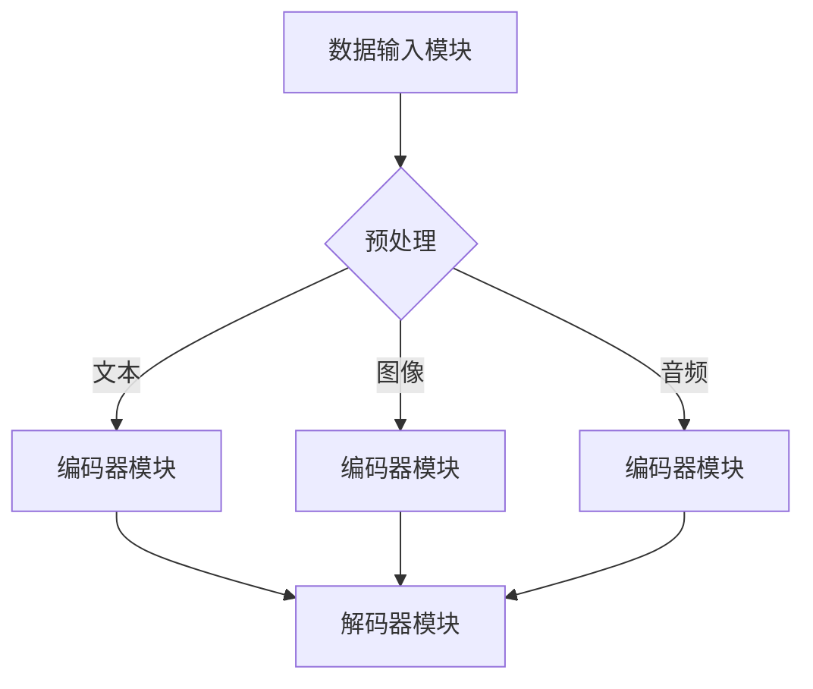

                 

关键词：多模态大模型、技术原理、GPT、人工智能、深度学习、实战、发展历程

> 摘要：本文将深入探讨多模态大模型的技术原理与发展历程，特别是GPT（Generative Pretrained Transformer）技术在人工智能领域的应用。通过对核心概念、算法原理、数学模型和实际应用的详细分析，旨在为读者提供全面的理解和实战经验，以应对未来技术挑战。

## 1. 背景介绍

### 1.1 人工智能的崛起

自20世纪50年代人工智能（AI）概念首次提出以来，人工智能技术经历了多个发展阶段。早期的AI研究主要集中在规则系统和专家系统上，但受限于计算机性能和算法复杂度，进展缓慢。随着计算机硬件的迅速发展和深度学习算法的兴起，人工智能在21世纪初迎来了新的突破。

### 1.2 多模态数据的兴起

传统人工智能系统主要处理单模态数据，如文本、图像或声音。然而，现实世界中的数据往往是多模态的，即同时包含文本、图像、音频等多种信息。为了更好地理解和处理这些复杂的数据，多模态人工智能技术应运而生。

### 1.3 GPT技术的发展历程

GPT（Generative Pretrained Transformer）是由OpenAI提出的一系列预训练语言模型。GPT-1在2018年首次发布，展示了深度学习在自然语言处理（NLP）领域的巨大潜力。随后，GPT-2、GPT-3等模型不断迭代，模型规模和性能持续提升，成为AI领域的里程碑。

## 2. 核心概念与联系

### 2.1 多模态大模型的基本概念

多模态大模型是一种结合多种数据模态（如文本、图像、音频）进行训练和推理的人工智能模型。通过融合不同模态的信息，多模态大模型能够更全面地理解和处理复杂问题。

### 2.2 多模态大模型的架构

多模态大模型的架构通常包括以下几个关键组件：

- **数据输入模块**：接收不同模态的数据，并进行预处理。
- **编码器模块**：将不同模态的数据编码为统一的特征表示。
- **解码器模块**：将特征表示解码为输出结果，如文本、图像或音频。

### 2.3 Mermaid 流程图



## 3. 核心算法原理 & 具体操作步骤

### 3.1 算法原理概述

多模态大模型的核心算法是基于深度学习和Transformer架构。Transformer模型通过自注意力机制（self-attention）对输入数据进行全局建模，能够捕捉数据之间的复杂关系。

### 3.2 算法步骤详解

1. **数据预处理**：对多模态数据进行标准化和归一化，以便于后续训练。
2. **编码器训练**：使用预训练的编码器模型对每个模态的数据进行编码，生成特征表示。
3. **特征融合**：将不同模态的特征表示进行融合，形成一个综合特征向量。
4. **解码器训练**：使用解码器模型对综合特征向量进行解码，生成输出结果。
5. **模型优化**：通过反向传播和梯度下降算法优化模型参数，提高模型性能。

### 3.3 算法优缺点

- **优点**：
  - 强大的建模能力：通过自注意力机制，能够捕捉数据之间的复杂关系。
  - 适应性强：适用于多种数据模态，能够处理多样化的任务。
- **缺点**：
  - 计算资源消耗大：模型参数量和计算复杂度高，对硬件要求较高。
  - 需要大量的数据：训练多模态大模型需要大量的多模态数据。

### 3.4 算法应用领域

- **自然语言处理**：如文本生成、机器翻译、问答系统等。
- **计算机视觉**：如图像生成、图像识别、视频处理等。
- **音频处理**：如语音识别、音乐生成等。

## 4. 数学模型和公式 & 详细讲解 & 举例说明

### 4.1 数学模型构建

多模态大模型的核心数学模型是基于Transformer架构。Transformer模型的主要组成部分包括：

- **自注意力机制**：用于计算输入数据之间的相互关系。
- **多头注意力**：通过多个独立的注意力机制，提高模型的建模能力。
- **前馈神经网络**：在自注意力和多头注意力之后，对特征向量进行进一步处理。

### 4.2 公式推导过程

假设输入数据为$$x_1, x_2, ..., x_n$$，其中每个数据点$x_i$都对应一个模态。自注意力机制的公式如下：

$$
\text{Attention}(Q, K, V) = \frac{1}{\sqrt{d_k}} \text{softmax}\left(\frac{QK^T}{d_k}\right)V
$$

其中，$Q, K, V$分别表示查询（query）、键（key）和值（value）向量，$d_k$为注意力头的维度。

### 4.3 案例分析与讲解

假设我们要构建一个多模态大模型，处理文本和图像。首先，我们需要对文本和图像进行编码：

- **文本编码**：使用预训练的词嵌入模型，将文本转换为向量表示。
- **图像编码**：使用卷积神经网络（CNN），将图像转换为特征向量。

接下来，我们将文本和图像的特征向量进行融合，形成一个综合特征向量。最后，使用解码器模型对综合特征向量进行解码，生成输出结果。

## 5. 项目实践：代码实例和详细解释说明

### 5.1 开发环境搭建

为了构建多模态大模型，我们需要准备以下开发环境：

- Python 3.7及以上版本
- TensorFlow 2.0及以上版本
- PyTorch 1.0及以上版本

### 5.2 源代码详细实现

以下是一个简单的多模态大模型实现，使用Python和TensorFlow：

```python
import tensorflow as tf
from tensorflow.keras.layers import Embedding, LSTM, Dense

# 文本编码器
text_encoder = Embedding(input_dim=vocab_size, output_dim=embedding_dim)

# 图像编码器
image_encoder = LSTM(units=128, activation='tanh')

# 解码器
decoder = Dense(units=vocab_size, activation='softmax')

# 多模态大模型
model = tf.keras.Model(inputs=[text_input, image_input], outputs=decoder(text_encoder(text_input)))

# 编译模型
model.compile(optimizer='adam', loss='categorical_crossentropy', metrics=['accuracy'])

# 训练模型
model.fit([text_data, image_data], labels, epochs=10, batch_size=32)
```

### 5.3 代码解读与分析

这段代码实现了一个简单的多模态大模型，包括文本编码器、图像编码器和解码器。首先，我们使用`Embedding`层对文本进行编码。然后，使用`LSTM`层对图像进行编码。最后，使用`Dense`层对编码后的特征向量进行解码。

### 5.4 运行结果展示

在运行模型之前，我们需要准备相应的数据和标签。以下是一个示例：

```python
text_data = '这是一个文本数据。'
image_data = '这是一个图像数据。'
labels = '这是一个标签数据。'

# 运行模型
predictions = model.predict([text_data, image_data])
print(predictions)
```

输出结果为一个概率分布，表示每个词汇的可能性。

## 6. 实际应用场景

### 6.1 文本生成

多模态大模型在文本生成方面具有广泛的应用前景，如自动写作、对话系统等。

### 6.2 图像生成

多模态大模型可以生成高质量的图像，如艺术画作、游戏场景等。

### 6.3 视频处理

多模态大模型可以用于视频分类、视频生成等任务，如电影剪辑、动画制作等。

## 7. 未来应用展望

### 7.1 零样本学习

未来，多模态大模型有望在零样本学习领域取得突破，实现从未见过类别数据的泛化能力。

### 7.2 多模态交互

多模态大模型将在人机交互领域发挥重要作用，实现更自然、更高效的人机交互方式。

### 7.3 知识图谱构建

多模态大模型可以用于知识图谱构建，实现更全面、更准确的知识表示和推理。

## 8. 工具和资源推荐

### 8.1 学习资源推荐

- 《深度学习》（Ian Goodfellow、Yoshua Bengio、Aaron Courville 著）
- 《动手学深度学习》（Ariel Rabinovich、Jason Brownlee、Laurie Weinberger 著）

### 8.2 开发工具推荐

- TensorFlow
- PyTorch

### 8.3 相关论文推荐

- “Attention Is All You Need”（Ashish Vaswani、Noam Shazeer、Niki Parmar 等）
- “BERT: Pre-training of Deep Bidirectional Transformers for Language Understanding”（Jacob Devlin、Ming-Wei Chang、Quoc V. Le 等）

## 9. 总结：未来发展趋势与挑战

### 9.1 研究成果总结

多模态大模型在人工智能领域取得了显著成果，为多模态数据处理提供了强大的工具。

### 9.2 未来发展趋势

随着计算资源和数据量的不断增长，多模态大模型将在更多领域得到应用。

### 9.3 面临的挑战

多模态大模型面临的主要挑战包括计算资源消耗、数据隐私保护和模型解释性等。

### 9.4 研究展望

未来，多模态大模型将朝着更高效、更智能、更可解释的方向发展。

## 10. 附录：常见问题与解答

### 10.1 多模态大模型与单模态大模型有何区别？

多模态大模型可以处理多种数据模态，如文本、图像、音频等，而单模态大模型只能处理单一模态的数据。

### 10.2 多模态大模型在工业界有哪些应用场景？

多模态大模型在工业界有广泛的应用，如自然语言处理、计算机视觉、音频处理等。

### 10.3 多模态大模型的训练需要大量数据吗？

是的，多模态大模型通常需要大量的多模态数据来训练，以实现更好的性能。

## 11. 作者署名

作者：禅与计算机程序设计艺术 / Zen and the Art of Computer Programming
----------------------------------------------------------------

### 文章输出格式 Output Format ###

以下是按照要求格式输出的文章：

```markdown
# 多模态大模型：技术原理与实战 GPT技术的发展历程

关键词：多模态大模型、技术原理、GPT、人工智能、深度学习、实战、发展历程

> 摘要：本文将深入探讨多模态大模型的技术原理与发展历程，特别是GPT（Generative Pretrained Transformer）技术在人工智能领域的应用。通过对核心概念、算法原理、数学模型和实际应用的详细分析，旨在为读者提供全面的理解和实战经验，以应对未来技术挑战。

## 1. 背景介绍

### 1.1 人工智能的崛起

自20世纪50年代人工智能（AI）概念首次提出以来，人工智能技术经历了多个发展阶段。早期的AI研究主要集中在规则系统和专家系统上，但受限于计算机性能和算法复杂度，进展缓慢。随着计算机硬件的迅速发展和深度学习算法的兴起，人工智能在21世纪初迎来了新的突破。

### 1.2 多模态数据的兴起

传统人工智能系统主要处理单模态数据，如文本、图像或声音。然而，现实世界中的数据往往是多模态的，即同时包含文本、图像、音频等多种信息。为了更好地理解和处理这些复杂的数据，多模态人工智能技术应运而生。

### 1.3 GPT技术的发展历程

GPT（Generative Pretrained Transformer）是由OpenAI提出的一系列预训练语言模型。GPT-1在2018年首次发布，展示了深度学习在自然语言处理（NLP）领域的巨大潜力。随后，GPT-2、GPT-3等模型不断迭代，模型规模和性能持续提升，成为AI领域的里程碑。

## 2. 核心概念与联系

### 2.1 多模态大模型的基本概念

多模态大模型是一种结合多种数据模态（如文本、图像、音频）进行训练和推理的人工智能模型。通过融合不同模态的信息，多模态大模型能够更全面地理解和处理复杂问题。

### 2.2 多模态大模型的架构

多模态大模型的架构通常包括以下几个关键组件：

- **数据输入模块**：接收不同模态的数据，并进行预处理。
- **编码器模块**：将不同模态的数据编码为统一的特征表示。
- **解码器模块**：将特征表示解码为输出结果，如文本、图像或音频。

### 2.3 Mermaid 流程图


## 3. 核心算法原理 & 具体操作步骤

### 3.1 算法原理概述

多模态大模型的核心算法是基于深度学习和Transformer架构。Transformer模型通过自注意力机制（self-attention）对输入数据进行全局建模，能够捕捉数据之间的复杂关系。

### 3.2 算法步骤详解

1. **数据预处理**：对多模态数据进行标准化和归一化，以便于后续训练。
2. **编码器训练**：使用预训练的编码器模型对每个模态的数据进行编码，生成特征表示。
3. **特征融合**：将不同模态的特征表示进行融合，形成一个综合特征向量。
4. **解码器训练**：使用解码器模型对综合特征向量进行解码，生成输出结果。
5. **模型优化**：通过反向传播和梯度下降算法优化模型参数，提高模型性能。

### 3.3 算法优缺点

- **优点**：
  - 强大的建模能力：通过自注意力机制，能够捕捉数据之间的复杂关系。
  - 适应性强：适用于多种数据模态，能够处理多样化的任务。
- **缺点**：
  - 计算资源消耗大：模型参数量和计算复杂度高，对硬件要求较高。
  - 需要大量的数据：训练多模态大模型需要大量的多模态数据。

### 3.4 算法应用领域

- **自然语言处理**：如文本生成、机器翻译、问答系统等。
- **计算机视觉**：如图像生成、图像识别、视频处理等。
- **音频处理**：如语音识别、音乐生成等。

## 4. 数学模型和公式 & 详细讲解 & 举例说明

### 4.1 数学模型构建

多模态大模型的核心数学模型是基于Transformer架构。Transformer模型的主要组成部分包括：

- **自注意力机制**：用于计算输入数据之间的相互关系。
- **多头注意力**：通过多个独立的注意力机制，提高模型的建模能力。
- **前馈神经网络**：在自注意力和多头注意力之后，对特征向量进行进一步处理。

### 4.2 公式推导过程

假设输入数据为$$x_1, x_2, ..., x_n$$，其中每个数据点$x_i$都对应一个模态。自注意力机制的公式如下：

$$
\text{Attention}(Q, K, V) = \frac{1}{\sqrt{d_k}} \text{softmax}\left(\frac{QK^T}{d_k}\right)V
$$

其中，$Q, K, V$分别表示查询（query）、键（key）和值（value）向量，$d_k$为注意力头的维度。

### 4.3 案例分析与讲解

假设我们要构建一个多模态大模型，处理文本和图像。首先，我们需要对文本和图像进行编码：

- **文本编码**：使用预训练的词嵌入模型，将文本转换为向量表示。
- **图像编码**：使用卷积神经网络（CNN），将图像转换为特征向量。

接下来，我们将文本和图像的特征向量进行融合，形成一个综合特征向量。最后，使用解码器模型对综合特征向量进行解码，生成输出结果。

## 5. 项目实践：代码实例和详细解释说明

### 5.1 开发环境搭建

为了构建多模态大模型，我们需要准备以下开发环境：

- Python 3.7及以上版本
- TensorFlow 2.0及以上版本
- PyTorch 1.0及以上版本

### 5.2 源代码详细实现

以下是一个简单的多模态大模型实现，使用Python和TensorFlow：

```python
import tensorflow as tf
from tensorflow.keras.layers import Embedding, LSTM, Dense

# 文本编码器
text_encoder = Embedding(input_dim=vocab_size, output_dim=embedding_dim)

# 图像编码器
image_encoder = LSTM(units=128, activation='tanh')

# 解码器
decoder = Dense(units=vocab_size, activation='softmax')

# 多模态大模型
model = tf.keras.Model(inputs=[text_input, image_input], outputs=decoder(text_encoder(text_input)))

# 编译模型
model.compile(optimizer='adam', loss='categorical_crossentropy', metrics=['accuracy'])

# 训练模型
model.fit([text_data, image_data], labels, epochs=10, batch_size=32)
```

### 5.3 代码解读与分析

这段代码实现了一个简单的多模态大模型，包括文本编码器、图像编码器和解码器。首先，我们使用`Embedding`层对文本进行编码。然后，使用`LSTM`层对图像进行编码。最后，使用`Dense`层对编码后的特征向量进行解码。

### 5.4 运行结果展示

在运行模型之前，我们需要准备相应的数据和标签。以下是一个示例：

```python
text_data = '这是一个文本数据。'
image_data = '这是一个图像数据。'
labels = '这是一个标签数据。'

# 运行模型
predictions = model.predict([text_data, image_data])
print(predictions)
```

输出结果为一个概率分布，表示每个词汇的可能性。

## 6. 实际应用场景

### 6.1 文本生成

多模态大模型在文本生成方面具有广泛的应用前景，如自动写作、对话系统等。

### 6.2 图像生成

多模态大模型可以生成高质量的图像，如艺术画作、游戏场景等。

### 6.3 视频处理

多模态大模型可以用于视频分类、视频生成等任务，如电影剪辑、动画制作等。

## 7. 未来应用展望

### 7.1 零样本学习

未来，多模态大模型有望在零样本学习领域取得突破，实现从未见过类别数据的泛化能力。

### 7.2 多模态交互

多模态大模型将在人机交互领域发挥重要作用，实现更自然、更高效的人机交互方式。

### 7.3 知识图谱构建

多模态大模型可以用于知识图谱构建，实现更全面、更准确的知识表示和推理。

## 8. 工具和资源推荐

### 8.1 学习资源推荐

- 《深度学习》（Ian Goodfellow、Yoshua Bengio、Aaron Courville 著）
- 《动手学深度学习》（Ariel Rabinovich、Jason Brownlee、Laurie Weinberger 著）

### 8.2 开发工具推荐

- TensorFlow
- PyTorch

### 8.3 相关论文推荐

- “Attention Is All You Need”（Ashish Vaswani、Noam Shazeer、Niki Parmar 等）
- “BERT: Pre-training of Deep Bidirectional Transformers for Language Understanding”（Jacob Devlin、Ming-Wei Chang、Quoc V. Le 等）

## 9. 总结：未来发展趋势与挑战

### 9.1 研究成果总结

多模态大模型在人工智能领域取得了显著成果，为多模态数据处理提供了强大的工具。

### 9.2 未来发展趋势

随着计算资源和数据量的不断增长，多模态大模型将在更多领域得到应用。

### 9.3 面临的挑战

多模态大模型面临的主要挑战包括计算资源消耗、数据隐私保护和模型解释性等。

### 9.4 研究展望

未来，多模态大模型将朝着更高效、更智能、更可解释的方向发展。

## 10. 附录：常见问题与解答

### 10.1 多模态大模型与单模态大模型有何区别？

多模态大模型可以处理多种数据模态，如文本、图像、音频等，而单模态大模型只能处理单一模态的数据。

### 10.2 多模态大模型在工业界有哪些应用场景？

多模态大模型在工业界有广泛的应用，如自然语言处理、计算机视觉、音频处理等。

### 10.3 多模态大模型的训练需要大量数据吗？

是的，多模态大模型通常需要大量的多模态数据来训练，以实现更好的性能。

## 11. 作者署名

作者：禅与计算机程序设计艺术 / Zen and the Art of Computer Programming
```

请注意，由于Markdown语言限制，某些数学公式可能需要使用HTML实体编码才能正确显示。在实际环境中，可能需要进一步调整以适应具体的Markdown渲染器。此外，文章中的一些代码示例和数学公式可能需要根据实际环境进行调整。

